# quant-pivot 架构与详细设计

> Last reviewed: 2026-07-19.
>
> This document describes the current quant-pivot architecture implemented in this repository. The project has not entered production and will be deployed from a fresh boot-v1 database. Historical phase increments are audit context only and have no implementation authority. There is no production seal or compatibility bridge: post-deployment evolution uses normal forward migrations, rollback, and data verification.

## 1. 系统目标

quant-pivot 是 Polymarket-only 的量化系统。它的闭环目标不是直接发现一个“机会”就立即冲单，而是产生可审计、可治理、可回放的 `RecommendationReport`，再按 runtime mode 决定是否进入订单执行链路。

核心问题：

1. 买什么：哪个 market、token、outcome；
2. 什么时候买：entry window、book freshness、depth、limit/slippage；
3. 买多少：真实 venue 账户资金、Kelly sizing、组合约束、流动性和 correlation；
4. 为什么买：features、factors、model、expected return、confidence、evidence；
5. 什么时候卖：take profit、stop loss、time exit、signal invalidation、hold-to-resolution；
6. 卖多少：position lot、exit plan、partial/full exit policy；
7. 如何闭环：execution、reconciliation、settlement redeem、attribution、training feedback。

## 2. 端到端业务闭环

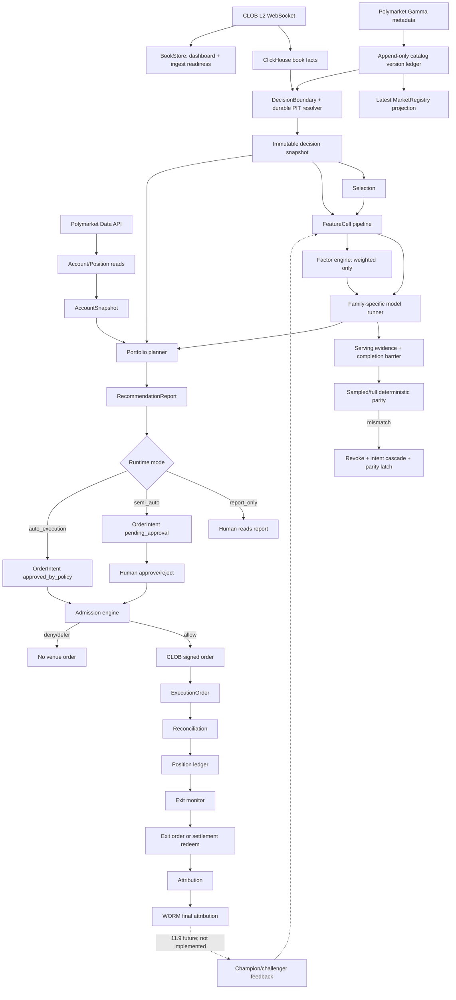

关键设计点：

- 报告是 first-class artifact，不是执行副产品；
- `report_only` 仍读取真实账户资金；
- execution 是 mode-gated 和 admission-gated 的后续链路；
- 所有订单状态、资金锁定、reconciliation 和 attribution 都落 Postgres；
- 市场事实和研究事实主要进入 ClickHouse；
- selection、feature、capture 从同一 `DecisionBoundary` 与 immutable PIT snapshot 投影；`BookStore` 不得充当历史 replay 来源；
- 训练/CV/backtest/serving 共用模型输入 transform，serving 证据写入完成前 model run 不得成功；
- model runner 先验证全部 route 再按 family 分派；configured category route 失败整轮失败，不回退 generic；
- 确定性 parity mismatch 会撤销报告、级联失效 intent 并打开 latch，报告、publish 和新入场 fail-closed，退出/结算继续；
- 六类 policy resource 是独立 revision 的治理对象；部署凭证和 immutable research artifact 都不是 hot policy。

## 3. 外部上下文

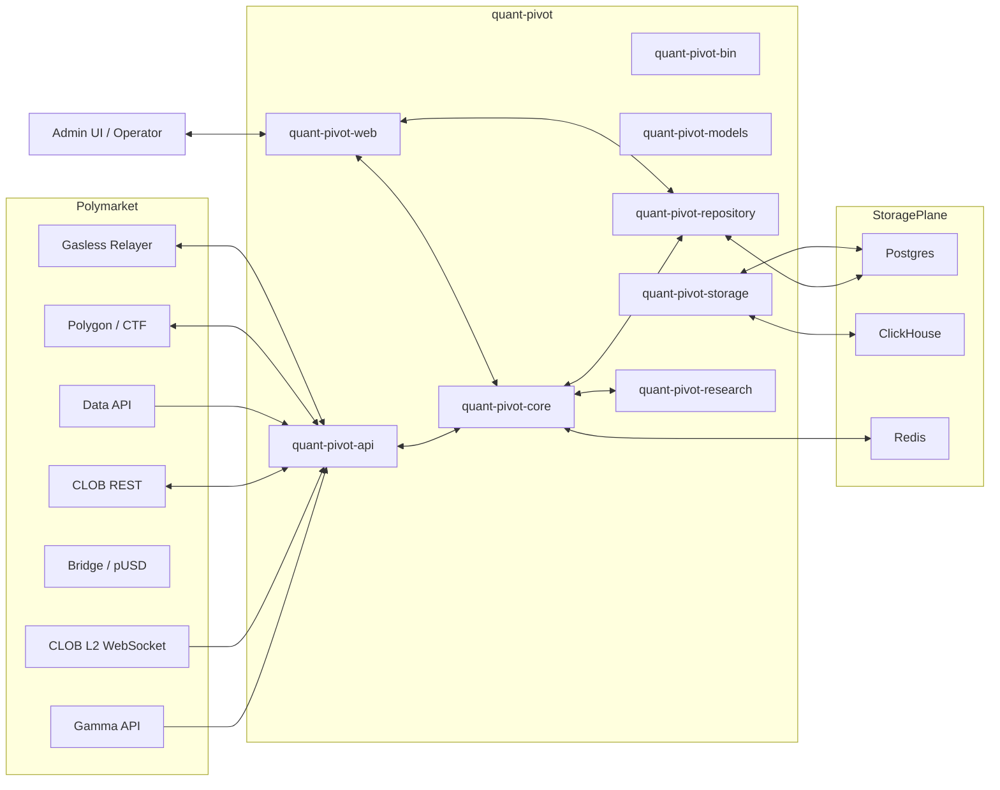

## 4. Crate 分层

| Crate | 职责 | 不应该做什么 |
|-------|------|--------------|
| `quant-pivot-bin` | CLI entrypoint、加载 deploy config、bootstrap app | 不承载业务逻辑 |
| `quant-pivot-core` | AppContext、data ingest、report builder、governance、execution、account、reconciliation | 不直接暴露 HTTP contract |
| `quant-pivot-api` | Polymarket Gamma/CLOB/Data API/on-chain/relayer clients | 不做策略 sizing |
| `quant-pivot-models` | DTO、domain structs、enums、typed policy schema、entities/idens | 不访问外部服务 |
| `quant-pivot-storage` | DB pools、migrations、ClickHouse writer | 不编码交易策略 |
| `quant-pivot-repository` | Postgres repository traits/impl、idempotent writes | 不写 HTTP handler |
| `quant-pivot-web` | Actix routes、auth、RBAC、API envelope、WS | 不绕过 core 服务直接下单 |
| `quant-pivot-research` | features、factors、model、portfolio sizing/optimizer | 不访问私钥或提交订单 |
| `quant-pivot-test-support` | 测试 harness 和 fixtures | 不进入 production runtime |
| `quant-pivot-xtask` | 项目任务脚本 | 不作为服务依赖 |

## 5. 配置架构

### 5.1 Deploy config

Deploy config 只管理进程启动时才能决定的部署身份与基础设施边界：

- Polymarket CLOB/Gamma/Data API/RPC/relayer endpoints；
- DB/ClickHouse/Redis；
- secret 字段（TOML 明文解析为不可序列化、日志脱敏且内存清零的 `SecretText`）；
- `quant.account.funder`；
- `quant.account.wallet_kind`；
- Web listen/CORS/JWT；
- observability。

加载顺序收敛为编译默认值、tracked 基础 TOML 与 gitignored/deployment-local TOML。环境变量只用于选择配置目录和部署身份，不允许覆盖业务策略或直接承载 secret：

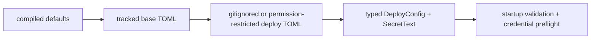

Deploy config 拒绝 unknown fields。所有 mode 都要求 private key 和 funder；可执行 mode 下 proxy/safe 还要求 relayer secret。PostgreSQL 与 ClickHouse 各自只有一组配置身份，runtime、schema CLI 与 Fresh Boot 复用该身份；权限隔离由环境边界、生命周期租约和受控 CLI 承担，不维护平行 credential。

### 5.2 Governed policy resources（boot schema 1）

原巨型 Runtime Config 已 clean-break 删除。运行时热更新由六类强类型、独立 revision 的 policy resource 承担：

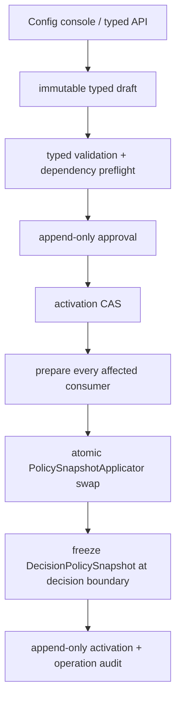

六类资源与生效边界：

| Resource | 职责 | 生效边界 |
|----------|------|----------|
| `recommendation_policy` | selection、data quality、Top-N 与报告有效期 | 新 claim 的 report run |
| `execution_risk_policy` | sizing、exposure、entry/exit 与 breaker | 新 order intent / admission |
| `model_routing` | category active/shadow/exit artifact 指针 | 新 model evaluation claim |
| `report_schedule` | timezone、cadence、enabled、future run reconcile | 尚未 claim 的 future run |
| `operational_control` | report pause、execution halt、notification routing、worker admission | operational admission gate |
| `execution_authorization` | `ReportOnly` / `SemiAuto` / `AutoExecution` 授权约束 | mode preflight 后的新 admission |

每个 resource 固定 `schema_version = 1`，但没有统一大文档版本。修改必须依次完成 Draft、Validate/Preflight、Approve、Activate；activation body 绑定 `approval_id`、`expected_active_revision_id`、`preflight_token` 和 `idempotency_key`。任一 prepare 或 CAS 失败都保持旧 snapshot；不存在自动回滚，回滚也是一次显式、可审计 activation。

特征、因子、domain 语义与研究方法是 content-addressed immutable profile artifact，随 decision/job lineage 冻结，不通过热配置修改。凭据和 provider endpoint 属于 Deploy Config。

## 6. 数据面设计

### 6.1 Market metadata

Gamma 同步负责发现和更新 Polymarket 市场。一次成功 batch 在同一 Postgres transaction 内写入
`catalog_sync_batch`、append-only `event_catalog_version` / `market_catalog_version` 和 latest projection；commit
成功后才发布到内存 registry/cache/subscription：

1. 定时 full sync；
2. 分页拉取 Gamma markets；
3. 解析 token、outcome、resolution time、category、negRisk 等 metadata；
4. 以 source effective time + available time 写入不可变 catalog version；
5. 更新 latest MarketRegistry projection；
6. transaction commit 后生成订阅计划给 CLOB WS。

历史 selection/replay 只读 version ledger；latest projection 不得冒充历史。首次成功同步建立
`catalog_coverage_start`，早于覆盖起点的 replay fail-closed，绝不 backdate 当前行。

### 6.2 BookStore

BookStore 是 L2 order book 的热路径读模型：

- CLOB WS 接收 book snapshot/update；
- 按 token id 维护 best bid/ask、depth ladder、book timestamp；
- 提供 lock-free 或低锁读取给实时看板、subscription/ingest readiness、entry/admission 和 exit monitor；
- 对 book age、depth、spread 输出 data quality signal。

报告 selection/feature/capture 与离线 dataset/replay 不从 BookStore 拼历史快照；它们读取同一
`DecisionBoundary` 下 catalog ledger + ClickHouse facts，并冻结为一份 immutable decision snapshot。

### 6.3 ClickHouse facts

ClickHouse 存储研究和回放友好的事实：

- book snapshots / top-of-book；
- data-quality measurements；
- stateful `quant_feature_event`（完整 FeatureCell state/reason/evidence）；
- `quant_model_input_event`（真实 model run/route、ordered encoded input、transform hashes）；
- `quant_serving_evidence_completion`（feature/model-input writer ACK barrier）；
- `quant_feature_parity_event`（sampled/full 的逐阶段 online/replay 证据）；
- attribution / PnL analytics。

Postgres 是业务系统 of record；ClickHouse 是事实/分析面。不能把 ClickHouse 当作订单状态真相。

### 6.4 Frozen training/serving contract

- `DecisionBoundary.decision_at = trigger_time`；`knowledge_cutoff = decision_at - knowledge_lag` 只在唯一构造器计算一次。
- 所有事实同时满足 `source_effective_at <= source_cutoff` 与 `available_at/ingestion_time <= decision_at`。
- Feature schema 以 boot version 1 为当前唯一契约；缺失以 `Observed | Substituted | Missing | NotApplicable` 表达，禁止 stub、silent zero 或 future-time clamp。
- Dataset lifecycle 为 `Planned → Building → Ready | InsufficientLabels | Failed`、`Ready → Expired`；不存在人工 `Built → Ready`。
- Parquet dataset 与 model artifact 都只接受 boot `format_version = 1`。训练、每个 CV fold、backtest 和 serving 共用 fit/apply transform；非 boot loader fail-closed。
- 100% serving 证据在 run success 前通过 completion barrier；确定性抽样和 24h full replay 比较 selection、capture、FeatureCell/DQ、factor、encoded input 与 canonical prediction。
- 任一确定性 mismatch 自动 revoke 报告、级联失效 intent 并打开 parity latch。后续报告、model publish、新入场阻断；exit、reconciliation、settlement 继续。

## 7. 账户与资金设计

### 7.1 Account provider

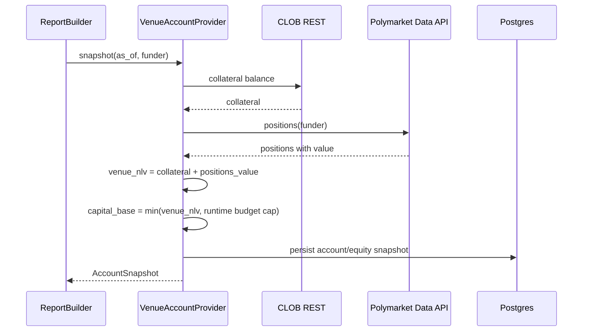

账户真相：

- `collateral` 来自 CLOB；
- `positions` 来自 Data API；
- `venue_net_liquidation = collateral + positions_value`；
- `capital_base = min(venue_net_liquidation, portfolio.budget.total_budget_usd)`；
- `available = collateral - reserved`。

缺 credentials 或 funder 时，报告生成失败，不会 fallback 到配置预算。

### 7.2 Capital allocation

执行链路会维护 capital allocation：

| State | 语义 |
|-------|------|
| `planned` | recommendation sizing 中计划使用 |
| `allocated` | intent 创建/审批后预留 |
| `locked` | submit / venue in-flight |
| `spent` | 成交后实际花费 |
| `released` | 未成交、取消或释放 |
| `impaired` | reconciliation 异常或账务不一致 |

capital allocation 用于防止重复花同一笔现金，也用于 auto preflight。

## 8. 报告生成详细设计

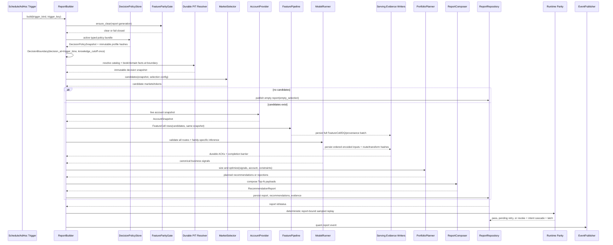

### 8.1 Empty report

报告为空不是错误，它是 fail-closed 输出。常见 reason：

- system degraded；
- empty selection；
- insufficient data quality；
- no positive signal；
- portfolio budget exhausted。

Parity latch open/uninitialized、关键 PIT snapshot 缺失、category route 故障或 serving evidence barrier 未完成不是
“空报告”原因，而是整轮失败；不得用 empty report 掩盖完整性故障。

### 8.2 Recommendation payload

推荐由这些 contract 组成：

| Payload block | 内容 | 使用者 |
|---------------|------|--------|
| Identity | market/token/outcome/rank/report refs | UI、operator、intent create |
| Signal | model score、confidence、expected return、factor contribution | quant、approver |
| EntryPlan | trigger、limit/immediate、slippage、book age、valid window | admission、operator |
| SizingPlan | suggested USD/shares、Kelly、caps、binding constraints | portfolio、approver |
| ExitPlan | TP/SL/time/signal/hold/redeem | exit monitor、operator |
| RiskEnvelope | exposure、liquidity、downside、correlation | admission、risk |
| Evidence | feature snapshot、data quality、model/factor refs | audit、debug |
| ExecutionEligibility | eligible modes、auto reasons、approval required | UI、dispatcher |

## 9. Portfolio 与 sizing 设计

### 9.1 Sizing

生产 sizing 使用 **校准 P(win) 直接 Kelly**（Phase 11.3 方向 A）：

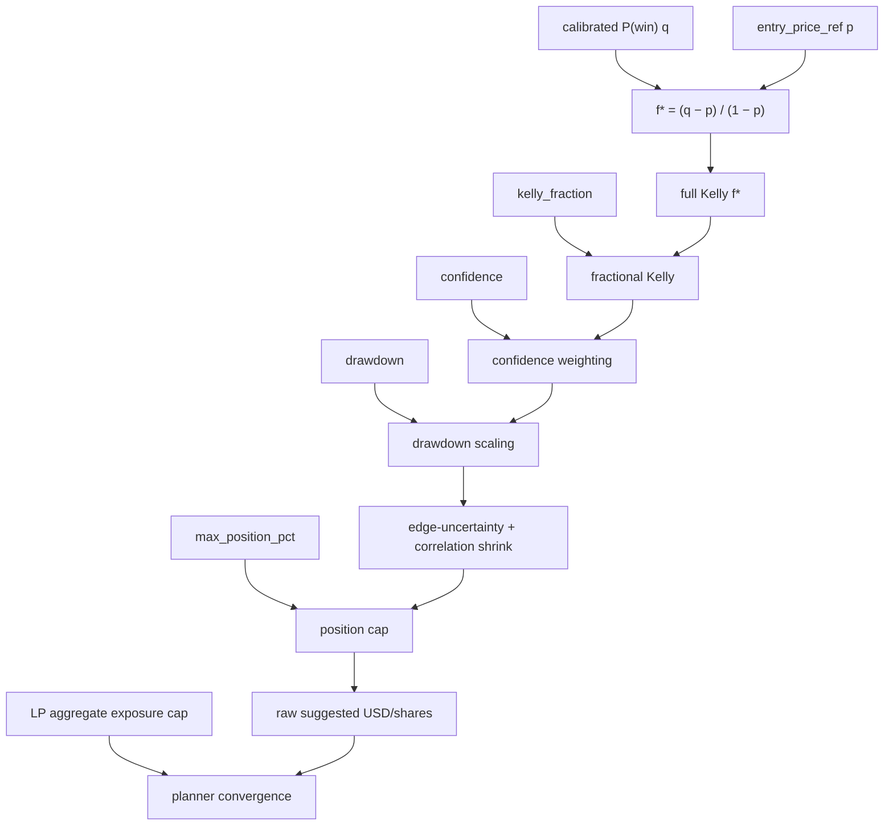

`HeuristicReturnModel {300,500}` 仅冷启动 `ReportOnly` 可达；`target_reward_multiple` 用于止盈定价，
不再反解 Kelly 胜率。四处 `resolve_return_model_calibration` 深校验关闭 publish/report/admission/intent TOCTOU。

### 9.2 Optimizer constraints

Portfolio planner 把 raw sizing 放进约束优化：

- total budget；
- available cash；
- min/max recommendation USD；
- max market exposure；
- max event exposure；
- max category exposure；
- max correlated exposure；
- liquidity usage cap；
- Kelly cap；
- drawdown scaling；
- correlation policy。

输出可能是：

- accepted recommendation with binding constraints；
- rejected candidate with explicit reason；
- empty report if all candidates rejected。

## 10. 执行治理设计

### 10.1 Intent lifecycle

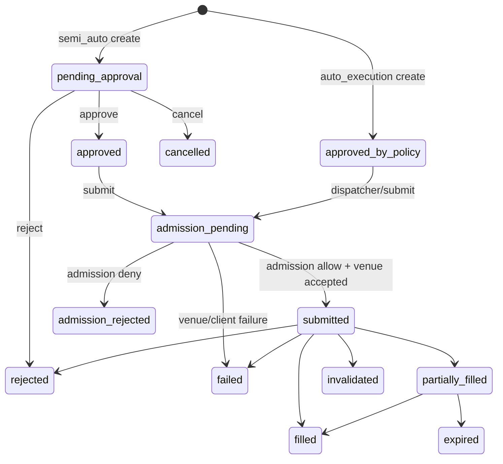

`OrderIntent` 冻结 recommendation 的 entry/sizing/risk envelope。审批、提交、拒绝、取消都会写 operation log。

### 10.2 Admission engine

Admission 是提交前最后一道门。它检查：

| Check | 目的 |
|-------|------|
| `intent_state` | intent 必须处于可提交状态 |
| `recommendation_freshness` | 推荐未过期 |
| `report_status` | 报告仍 published 且未 revoke |
| `runtime_mode` | 当前 mode 允许订单提交 |
| `model_publication` | model 状态仍可用 |
| `data_quality` | 数据质量未退化 |
| `book_freshness` | order book 足够新 |
| `entry_trigger` | 价格/depth/entry window 符合 |
| `risk_envelope_hash` | 审批未篡改推荐风险包络 |
| `capital_budget` | 资金仍足够 |
| `max_open_intents` | open intents 未超限 |
| `max_reserved_capital` | reserved capital 未超限 |
| `market_exposure` | 单 market exposure 未超限 |
| `event_exposure` | event exposure 未超限 |
| `category_exposure` | category exposure 未超限 |
| `liquidity_depth` | 可成交深度足够 |
| `slippage` | slippage cap 未突破 |
| `manual_block` | 市场/推荐未被人工 blocked |
| `kill_switch` | kill switch 允许新开仓 |
| `venue_guard` | venue 状态和 order constraints 可用 |
| `credential_readiness` | 私钥/funder/relayer 可用 |
| `exit_monitor_readiness` | 可执行后续退出管理 |

Outcome：

- `allow`：签名并提交；
- `deny`：不可执行，通常转 `admission_rejected`；
- `defer`：临时不可执行，可稍后重试。

## 11. Entry order 与 venue 设计

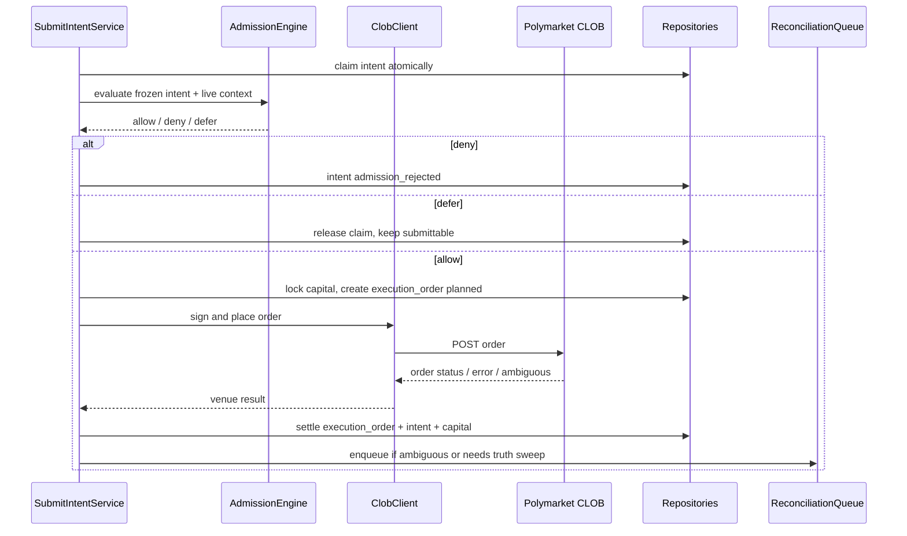

Order policy：

- default 是 limit entry；
- `allow_market_orders=false` 时不允许 immediate market order；
- `allow_market_orders=true` 时仍必须带 worst-price / slippage cap；
- `max_slippage_bps`、tick size、book depth、book age 都参与 admission；
- BUY 需要 pUSD allowance，SELL 需要 conditional token allowance。

## 12. Exit、settlement、attribution 设计

### 12.1 Exit monitor

Exit monitor 读取 open positions 和 exit plan：

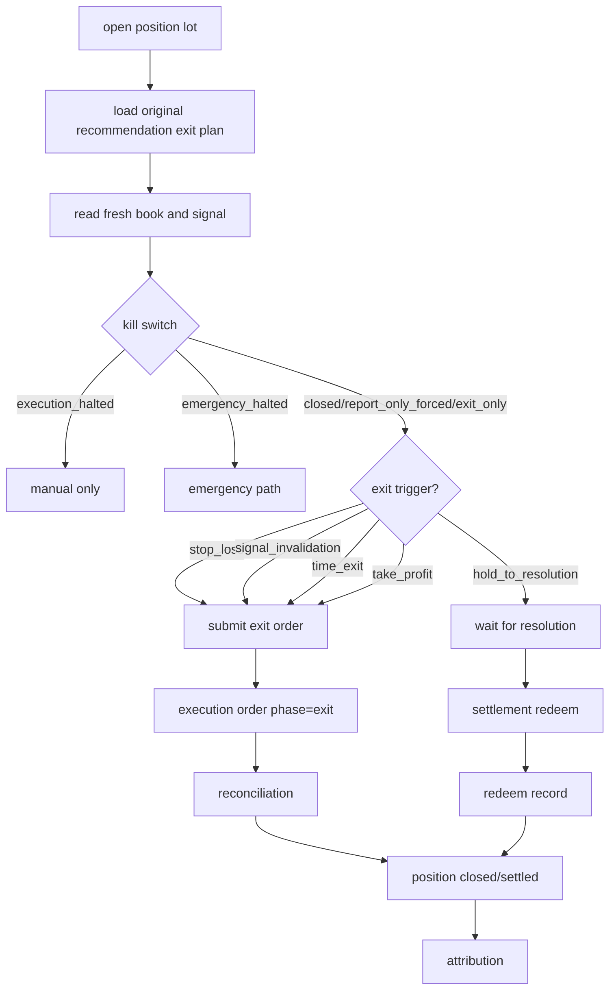

### 12.2 Settlement redeem

Resolved market 后：

- winning tokens redeem to pUSD；
- losing tokens settle to zero；
- redeem burns the full condition balance；
- policy 可自动批量 redeem；
- 不支持或失败时生成 manual required。

### 12.3 Attribution

Attribution 只在 truth 明确后 finalize：

- entry order terminal；
- exit order terminal 或 settlement redeem confirmed；
- reconciliation 不为 pending/unresolvable；
- position state closed/settled；
- account/equity snapshot 可对齐。

输出用于 PnL、模型反馈、factor governance 和训练数据。

## 13. Reconciliation 设计

Reconciliation 解决 “订单是否真实成交、成交多少、资金/仓位如何变化”。

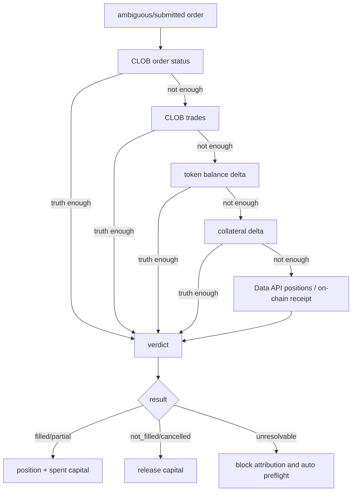

Evidence is ordered and recorded so an operator can later audit or manually resolve a case.

## 14. API 与控制面

所有成功响应：

```json
{
  "code": 200,
  "message": "ok",
  "data": {}
}
```

Async enqueue 使用 HTTP 202 和 body `code: 202`。

Protected `/api/...` routes require：

- `Authorization: Bearer <access_token>`；
- `Accept-Api-Version: v1`；
- governed mutations require `X-Acting-Role`。

控制面主要接口：

| Area | Paths |
|------|-------|
| Auth | `/api/auth/login`, `/api/auth/refresh`, `/api/auth/logout`, `/api/auth/me` |
| Config governance | `/api/config/resources`, `/api/config/{kind}/current|schema|revisions`, `/drafts/...`, `/api/config/activity`, `/deployment`, `/lifecycle` |
| System | `/api/system/status`, `/api/system/health`, `/api/system/quant-mode`, `/api/system/kill-switch` |
| Account | `/api/quant/account/live`, `/api/quant/account/equity-snapshots` |
| Reports | `/api/quant/reports`, `/api/quant/reports/current`, `/api/quant/reports/run`, `/api/quant/report-runs`, `/api/quant/report-schedules/health` |
| Recommendations | `/api/quant/recommendations/{id}`, `/evidence`, `/attribution` |
| Execution | `/api/quant/intents`, `/api/quant/execution-orders`, `/api/quant/positions` |
| Reconciliation | `/api/quant/reconciliations`, `/api/quant/reconciliations/{id}/resolve` |
| Settlement | `/api/quant/settlement-redeems` |

## 15. Storage 设计

### 15.1 Postgres of record

Postgres 保存业务状态：

- runtime config versions and activation；
- system runtime state；
- kill switch；
- operation logs；
- append-only catalog sync/version ledger + latest market/event projection；
- training dataset lifecycle、model/factor registry 与 immutable revision bindings；
- feature parity run/state latch、governed acknowledge lineage；
- reports；
- recommendations；
- evidence refs；
- order intents；
- execution orders；
- capital allocations；
- position ledger；
- reconciliation records；
- settlement redeem records；
- attribution；
- RBAC users/roles/permissions。

写入原则：

- idempotent writes 使用 outcome enum，而不是把 duplicate 当 generic error；
- 状态转换必须显式；
- duplicate/retry 路径保持原子性；
- operation log 记录 actor、role、reason 和 state hash。

### 15.2 ClickHouse analytics

ClickHouse 保存高频事实和研究数据：

- market data facts；
- book snapshots；
- feature materialization；
- stateful FeatureCell serving evidence；
- ordered model-input/route/transform evidence；
- serving completion barrier 与逐阶段 parity evidence；
- data-quality metrics；
- training rows；
- backtest/inference analytics；
- PnL aggregation。

ClickHouse lag 会影响 data quality 和 report，但不会成为订单状态真相。

### 15.3 Redis

Redis 用于：

- JWT revocation；
- short-lived cache；
- runtime coordination；
- optional WS/session adjunct state。

Redis 不存储不可恢复的交易真相。

## 16. 安全设计

| 风险 | 防护 |
|------|------|
| 私钥泄露 | 环境变量/secret manager 注入；masked deploy view；不写 git |
| 错 funder | startup/config validation；wallet topology check |
| 账户读取失败却继续交易 | account provider fail-closed |
| 旧报告下单 | recommendation freshness + report status admission |
| 数据 stale | data-quality gate + book freshness admission |
| 人工放大仓位 | approve 只能 narrow |
| runtime 配置漂移 | immutable versions + activation audit + rollback |
| 重复提交 | atomic claim intent + idempotency + capital lock |
| venue ambiguous | reconciliation queue + held capital |
| 自动交易失控 | mode preflight + kill switch + breaker + caps |
| 提现导致资金不足 | capital/account snapshot + budget cap + operational freeze SOP |

## 17. Observability

### 17.1 Metrics

重点指标：

- process uptime / readiness；
- Gamma sync lag；
- CLOB WS reconnect count；
- book age by token/market；
- ClickHouse flush lag/errors；
- report build latency；
- empty report count by reason；
- recommendations count；
- admission outcomes by check；
- intent states；
- execution order states；
- reconciliation pending age；
- capital reserved/spent/released/impaired；
- exit monitor trigger count；
- settlement redeem failures；
- policy validation/preflight/activation failures by resource kind；
- kill switch state changes；
- breaker trips；
- account snapshot failures。
- catalog coverage/watermark age；
- serving evidence writer ACK/pending age；
- feature parity run status/counts by low-cardinality stage/feature/reason/family/category；
- parity latch state and age。

### 17.2 Logs

生产日志必须能按这些字段检索：

- `request_id`；
- `actor` / `acting_role`；
- `report_id`；
- `recommendation_id`；
- `order_intent_id`；
- `execution_order_id`；
- `market_id` / `token_id`；
- `decision_policy_snapshot_id` 与参与决策的 policy revision ids；
- `quant_runtime_mode`；
- `kill_switch_state`；
- `admission_check_id`；
- `reconciliation_id`。
- `model_run_id` / `feature_parity_run_id`（结构化日志字段；Prometheus label 禁止这些高基数 ID）。

不得记录 private key、JWT signing key、evidence signing key、relayer key、完整 auth header、PII。

## 18. Failure-mode matrix

| Failure | Detection | System behavior | Operator action |
|---------|-----------|-----------------|-----------------|
| Missing private key | startup validation | fail start / fail mode preflight | inject secret |
| Missing funder | startup/account validation | fail report generation | set correct funder |
| CLOB auth fail | bootstrap/client connect | no account/execution | check key/topology/CLOB |
| Gamma/Data lag | health/data quality | empty report or admission deny | freeze entries, wait/repair |
| Book stale | data quality/admission | deny/defer | wait for WS recovery |
| Budget exhausted | portfolio planner | empty report/rejected candidates | deposit, close positions, adjust caps |
| Allowance insufficient | venue submit/reconciliation | order failure/ambiguous | perform approval, reconcile |
| Ambiguous venue response | submit result | capital held | wait for reconciliation |
| Unresolvable recon | recon worker | blocks auto preflight/attribution | manually resolve with evidence |
| Policy revision bad | typed validation, dependency preflight or activation CAS | reject and retain previous snapshot | fix typed draft or explicitly roll back after review |
| Catalog coverage/watermark missing | PIT resolver / integrity summary | block replay, dataset build, report | preserve ingest, repair Gamma ledger; never backdate |
| Serving writer misses deadline | evidence completion / parity pending timeout | fail run, alert, open latch when terminal | repair writer/watermark, run covering full parity |
| Deterministic parity mismatch | sampled/full replay | revoke report, cascade intent, open latch; block report/publish/entry | safe mode, fix forward, covering full parity, governed ack |
| Legacy/corrupt dataset or model artifact | format/hash/deep loader validation | reject training/load/publish | rebuild boot v1 artifact; never activate an unknown pointer |
| Model degraded | quality gate/report | no positive signal/empty | rollback model/factor |
| Breaker daily loss | breaker | trip kill switch | incident review |
| Bridge deposit stuck | account mismatch | funds unavailable | check bridge status/support |
| Withdrawal during execution | account/capital mismatch | admission deny or impaired capital | freeze, reconcile, lower budget |

## 19. Deployment lifecycle

部署只有一套 boot-v1 起点，没有 `pre_production_resettable / production_frozen` 运行时状态，也没有不可逆
production seal。首次部署前可在精确授权下使用独立 CLI 清空未投产基础设施；应用和 Web API 从不自动删除
数据。首次部署后所有 schema、数据与内部 format 演进直接使用正常 forward migration、回滚与数据验证。

首次上线顺序：

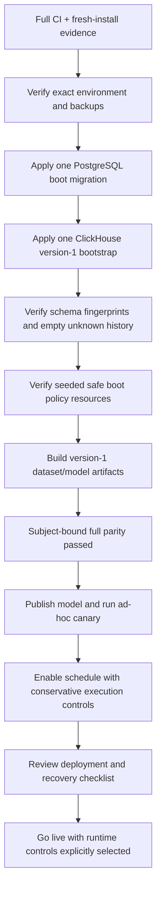

Activation failures retain the prior `DecisionPolicySnapshot`; they do not trigger automatic rollback. Operational incidents use explicit policy rollback or halt actions while ingest、exit、reconciliation 和 settlement continue. Scaling budget/caps remains a governed business decision after report/order/reconciliation/attribution evidence, not a deploy toggle.
## 20. 设计边界与当前限制

1. 只支持 Polymarket，不存在 multi-venue abstraction。
2. 当前 wallet topology 支持 `eoa`、`proxy`、`gnosis_safe`、`deposit_wallet`；系统不创建 Deposit Wallet。
3. Report sizing 使用真实账户；没有配置预算模拟 fallback。
4. 当前 order intent kind 是 buy entry；exit order 由 execution/exit subsystem 管理。
5. 手动在 Polymarket UI 下单不会自动生成系统内 `OrderIntent`。
6. 六类 policy resource、feature、dataset、model 和 internal format 只接受 boot version 1；未知 schema/format 不能激活、训练、publish 或 serving。
7. `auto_execution` 仍受 admission、kill switch、capital 和 breaker 限制。
8. ClickHouse 是 analytics plane，不是订单 truth。
9. two-hour/twelve-reconciliation soak 与真实云身份、secret mount、WORM restore、retention/capacity、200-day readiness 仍待真实环境执行；代码与文档就绪不等于 production complete。

## 21. 设计验收清单

任何新增功能或改动必须保持：

- report-first artifact；
- account truth credential-gated；
- Deploy Config、governed hot policy 与 immutable research artifact 三类 authority 分离；
- policy resource independently revisioned, approved, activated and audited；
- every system-owned schema/manifest/artifact format starts at boot version 1；
- DecisionBoundary 双时间 PIT 与 frozen train/serve transform；
- serving evidence completion barrier + deterministic parity latch；
- activation prepare/CAS 失败时保持旧 snapshot；恢复或回滚必须显式治理；
- mode transition preflight；
- kill switch fail-closed；
- admission before every venue submit；
- capital reservation atomic with intent/order transitions；
- reconciliation before final attribution；
- no `f64` money in production paths；
- no untyped internal error bucket in production paths；
- no private key or secret value in tracked defaults、environment、process arguments、logs、docs examples、tests or commits；local-development 的明文 secret 只写入 gitignored `quant-pivot.local.toml`，部署环境的明文 secret 只写入权限 `0600`、不进入版本控制的 deploy TOML。
