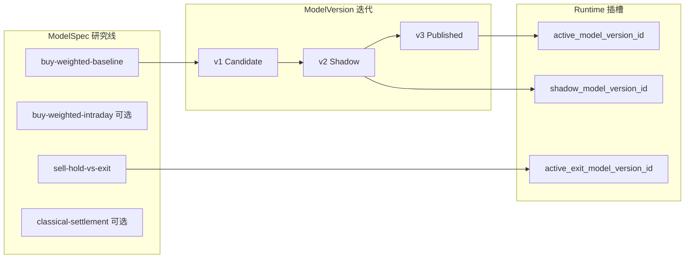

# Model Spec 目录规划指南

面向**量化 / 运维 / 研发**：回答「要不要为不同 `model_family` 或不同业务场景创建多个 model spec？」以及生产级闭环下的推荐做法。

> 当前唯一契约是 runtime **v10** / feature **v6** / dataset+model artifact **v2**。
> category pointer **缺席**时可使用 generic default；pointer 一旦已配置，load/scope/inference 任一失败
> 必须使整轮报告失败，不得回退 generic 或 `ZeroWeight`。

| 关联文档 | 用途 |
|----------|------|
| [runbook.md §8](./runbook.md) | 冷启动：创建 spec → 因子 → 训练集 → train → publish → 出报告 |
| [03-data-factor-model-pipeline.md §12](../plans/quant-pivot/03-data-factor-model-pipeline.md) | 离线研究生命周期概念规格 |
| [phase-03/03.8-vertical-domain-closed-loop.md](../plans/quant-pivot/phase-03/03.8-vertical-domain-closed-loop.md) | 03.8 垂直闭环（**已被 11.2 取代**） |
| [phase-11/11.2-polymarket-vertical-alpha.md](../plans/quant-pivot/phase-11/11.2-polymarket-vertical-alpha.md) | ModelRouting / category_scope 的**权威设计**（Phase 11.2.2 已落地） |

---

## 1. 三个概念：Spec、Version、Runtime 指针

不要把这三层混为一谈。

```text
ModelSpec（规格，研究线的「合同」）
  └── ModelVersion v1, v2, v3…（不可变训练产物，Candidate → Shadow → Published → Retired）
        └── 线上只认 Published artifact

RuntimeConfig.model（同时在线的「插槽」，各 1 个）
  ├── active_model_version_id          ← Buy 侧默认排序（generic cross-category）
  ├── shadow_model_version_id          ← Buy 侧 shadow 对比（可选，1 个）
  ├── active_exit_model_version_id     ← Sell 侧 hold-vs-exit（HoldVsExitWeighted）
  └── category_model_pointers.{cat}    ← Buy 侧 per-category override（未配置才使用 generic）
```

| 层级 | 存什么 | 创建入口 | 典型数量 |
|------|--------|----------|----------|
| **ModelSpec** | 名称、`model_family`、声明性 `prediction_horizon_secs`、schema 版本、typed `input_contract` / `training_contract`、`spec_json` | `POST /research/model-specs` | 按**研究线**规划，不是按每次实验 |
| **ModelVersion** | 冻结 artifact（权重、乘子、horizon 等） | `POST /research/models/train` 或治理导入 | 同一 spec 下可有很多版本 |
| **Runtime 指针** | 当前线上用哪个 version | publish 自动 sync，或 runtime-config patch | Buy 1 + Shadow 0–1 + Exit 0–1 |

**硬规则（已实现）**：

- 同一 `model_spec_id` 下，publish 时会 **retire 该 spec 的其他 Published 版本**（单 spec 单 active published 不变量）。
- publish 会把对应 version 写入 **全局** `active_model_version_id` 或 `active_exit_model_version_id`（按 family 路由）；**整个系统同一时刻只有 1 个 Buy active、1 个 Exit active**。
- `Published` artifact **不可变**；修正必须 train 新版本 → backtest → publish。
- Draft spec **不能**线上推理；必须至少有一个 Published version 且指针已配置。

---

## 2. 直接回答：要不要创建多个 model spec？

### 2.1 按 model_family

**不同 family = 不同 spec（必须分开）。**

`model_family` 是 registry 级硬类型（Postgres `qp_model_family`），Buy 与 Sell、Weighted 与 Classical 在 artifact 结构、训练入口、runtime 指针上都不互通：

| model_family | 角色 | 是否单独建 spec |
|--------------|------|-----------------|
| `weighted_factor` | Buy 侧 TopN 排序 | ✅ 至少 1 个 |
| `hold_vs_exit_weighted` | Sell 侧退出打分 | ✅ 与 Buy **必须**分开（走 `active_exit_model_version_id`） |
| `classical_*`（6 种） | Buy 侧 ML 排序（需 settlement 等成熟标签） | ✅ 每种算法一条研究线（若你打算做） |

**冷启动最小集：1 个 spec**（`weighted_factor`）即可出第一份 Buy 报告。  
**完整闭环最小集：3 条研究线**（见 §5）——这是之前拍板的「三层规格」在生产上的落地形态。

### 2.2 同一个 WeightedFactor，要不要多个 spec？

**大多数迭代：不要。** 在同一 spec 下 train 新版本即可。

| 场景 | 新建 spec？ | 正确做法 |
|------|------------|----------|
| 调因子权重、改 regularization、换训练窗口 | ❌ | 同一 spec → 新 dataset（若窗口/schema 变）→ train v2 → backtest → shadow/publish |
| A/B 对比 challenger | ❌ | train challenger → 设 `shadow_model_version_id` → shadow window → publish 替换 |
| 回滚 | ❌ | governance `rollback` 或 publish 上一 Published version |
| **不同 prediction_horizon 意图**（如 1h vs 24h） | ✅ | 不同 horizon = 不同标签语义 + 不同 artifact horizon 乘子 + 不同推荐持仓周期 → **独立研究线** |
| **feature / label schema 版本升级** | ✅ | 新 schema 是新的数据合同，应新 spec（或明确命名的 v2 spec） |
| 不同业务命名/审计线（如「bootstrap」vs「production-24h」） | ✅ 可选 | 治理清晰时可分 spec；也可只用 spec 内 version 号区分 |
| 按 market category 分模型（crypto vs politics） | ✅ 可选 specialist | **已实现** category routing（见 §7 / §8.4）；为 proven vertical 增 **1 个** specialist spec + `category_model_pointers` |

**经验法则**：

> **Spec 划分「研究合同是否变了」；Version 划分「同一合同下的第几次训练产物」。**

合同变了的信号：

1. `model_family` 变了  
2. 声明性 `prediction_horizon_secs` 档位变了（1h / 4h / 24h / 3d）  
3. `feature_schema_version` 或 `label_schema_version` 变了  
4. Buy vs Sell 角色变了  

合同没变 → **只增 ModelVersion**。

---

## 3. 各 model_family 业务语义与就绪条件

### 3.1 `weighted_factor`（Buy 排序，冷启动首选）

- **输入**：PIT 因子 + runtime-config 启用的 factor set  
- **输出**：composite score、confidence、`suggested_horizon_secs`  
- **训练标签**：常用 `return_to_horizon` + `label_horizon_secs`（与 prediction horizon 对齐）  
- **就绪时间**：L2 ingest 若干小时即可 plan；label 成熟通常需 **window_end ≤ now − horizon**（默认 24h 则约 7–14 天连续 ingest 才稳过 gate）  
- **spec 数量建议**：冷启动 **1 个**；成熟后若做日内/长周期双轨，**+1～2 个**（不同 horizon）

### 3.2 `hold_vs_exit_weighted`（Sell / 退出）

- **输入**：持仓 lot + 市场因子 + 退出决策标签  
- **输出**：exit alpha、推荐累计退出比例  
- **训练前提**：**必须先有真实或模拟平仓样本**（`ExitDecision` 行）  
- **runtime**：publish 写入 `active_exit_model_version_id`，**不替换** Buy active  
- **spec 数量建议**：**1 个**即可；与 Buy spec 独立

### 3.3 `classical_*`（Buy ML）—— 六种算法各自适用什么？

Classical 不是「另一种 weighted」，而是 **另一条 Buy 研究线**：用监督学习直接拟合
**特征/因子矩阵 → 排序分数**，artifact 是序列化的 smartcore 估计器（`ml-classical`
feature 开启时可用）。六种 `model_family` 一一对应六种算法，**同一时刻只能有 1 个
占 Buy active**（与 weighted 互斥），其余只能走 **shadow** 或 **Candidate 离线评估**。

#### 3.3.1 与 WeightedFactor 的根本差异

| 维度 | `weighted_factor` | `classical_*` |
|------|-------------------|---------------|
| 可解释性 | **高** — 逐因子权重 + breakdown | **中～低** — 线性模型可看系数；树模型看 feature importance |
| 主标签 | `return_to_horizon`（forward 中间价收益，horizon 秒） | **`settlement_outcome`**（最终 YES=1 / NO=0，`label_horizon_secs=0`） |
| 标签成熟速度 | 较快 — `as_of + horizon` 后即有 forward book | **慢** — 需市场 **resolved** |
| 冷启动能否 train | ✅ 有 L2 即可（label 需等 horizon 成熟） | ❌ 需大量已结算样本 |
| 设计定位（Phase 3） | **生产主路径** | **shadow 候选 / 升级路径** |
| 在线降级 | active 失败 → 报告 fail-closed | shadow 失败 → **active 继续**（设计允许） |

> WeightedFactor 回答：「未来 H 秒内哪边更有 edge？」  
> Classical（settlement 标签）回答：「哪边更可能最终赢？」  
> 二者相关但不等价；是否替换 active 必须走 shadow + quality gate，不能凭直觉切换。

#### 3.3.2 六种 classical family 分场景说明

| model_family | 算法 | 典型应用场景 | 优势 | 劣势 / 慎用 |
|--------------|------|-------------|------|-------------|
| `classical_logistic_regression` | 逻辑回归 | **首选 shadow 对照**；结算概率校准；需要向风控解释「哪些因子推高 P(win)」 | 可解释、训练快、样本效率好 | 只能建模线性关系；因子共线需正则 |
| `classical_ridge` | L2 线性回归 | 连续型标签（若用 `return_to_horizon` 做 classical 实验）；高维因子矩阵的稳定线性基线 | 稳定、不易过拟合 | 无非线性；对 tail event 弱 |
| `classical_lasso` | L1 线性回归 | **因子选择** — 自动稀疏化，筛掉无效因子列 | 内置 feature selection | 相关因子只留一个，可能丢结构信息 |
| `classical_elastic_net` | L1+L2 | 因子多且共线时的折中 baseline | 兼顾稀疏与稳定 | 超参敏感；解释性弱于纯 Lasso |
| `classical_random_forest` | 随机森林 | **非线性 + 交互**；settlement 预测主力候选（样本充足后） | 捕捉因子交互、对 outlier 鲁棒 | 黑盒度高；需更多样本；smartcore 版本锁定 |
| `classical_extra_trees` | 极端随机树 | 与 RF 类似，更随机分裂；高噪声 Polymarket 微结构 |  variance 更低、训练快 | 同 RF，需 settlement 样本量 |

**生产选型建议（classical 内部只选 1～2 条 spec，不要六种全建）：**

1. **第一条 shadow spec**：`classical_logistic_regression` — 可解释、训练便宜、适合证明「ML 是否 beat 加权因子」。
2. **第二条升级 spec（可选）**：`classical_random_forest` — settlement 样本 > 几千且 logistic shadow 有稳定 IC 后再开。
3. **Ridge / Lasso / ElasticNet**：研究工具，除非你在做因子筛选实验，**不必单独占 spec 槽位**；同一数据集上 offline 对比即可。
4. **ExtraTrees vs RandomForest**：二选一，不要两条并行占 catalog。

#### 3.3.3 Classical 训练参数要点

```json
{
  "model_family": "classical_logistic_regression",
  "label_name": "settlement_outcome",
  "label_horizon_secs": 0,
  "prediction_horizon_secs": 86400
}
```

- `label_horizon_secs=0`：settlement 标签与预测 horizon 无关（市场何时结算何时成熟）。
- `prediction_horizon_secs`：仍写入 artifact，影响线上 `suggested_horizon_secs` 与 horizon 乘子（与 weighted 相同机制）。
- 数据集 `window_end` 应覆盖 **已 resolved** 市场为主；否则 `insufficient_labels` / gate 失败。
- 需要 **`ml-classical` build feature**；默认 dev build 未开则 train 会被拒绝。

#### 3.3.4 何时该上 Classical、何时不该

| 阶段 | 是否用 classical | 理由 |
|------|-----------------|------|
| 冷启动 Day 0–14 | **否**（active） | 无 settlement 标签；weighted 是唯一可行 Buy 路径 |
| 有 500+ Resolved 样本 | **可以 shadow** | 开始 train logistic shadow，与 weighted active 并行对比 |
| Shadow IC / hit rate 连续优于 weighted | **考虑 promote** | publish classical → 替换 `active_model_version_id` |
| 只有 forward return 标签、市场未结算 | **用 weighted，不用 classical settlement** | 标签合同不同 |
| 需要向 compliance 解释每笔推荐 | **active 保持 weighted** | 因子 breakdown 是硬需求；classical 仅 shadow |

---

## 3A. 生产选型：这么多 family，我到底该用什么？

### 3A.1 先理解「三个插槽，两种角色」

系统不是「每个 family 各跑各的」，而是 **3 个 runtime 插槽 × 2 种业务角色**：

```text
                    ┌─────────────────────────────────────┐
  Buy 侧（TopN 推荐） │ active_model_version_id   ← 只能 1 个 │
                    │ shadow_model_version_id   ← 可选 1 个 │
                    └─────────────────────────────────────┘
                    weighted_factor  OR  classical_*  （二选一占 active）

                    ┌─────────────────────────────────────┐
  Sell 侧（退出）     │ active_exit_model_version_id ← 0～1 个 │
                    └─────────────────────────────────────┘
                    hold_vs_exit_weighted  （与 Buy 完全独立）
```

**Catalog 里可以有 10 个 spec，但线上同时生效的只有：**

- **1 个 Buy 决策者**（active）
- **0～1 个 Buy 挑战者**（shadow，用于 publish 前证据）
- **0～1 个 Sell 决策者**（exit，semi_auto/auto 卖出路径才需要）

因此问题不是「我该创建哪些 family」，而是 **「每个阶段 active / shadow / exit 各放谁」**。

### 3A.2 分阶段推荐配置（可直接照做）

#### 阶段 0 — 冷启动（目标：第一份 RecommendationReport）

| 插槽 | 填什么 | model_family | 动作 |
|------|--------|--------------|------|
| `active_model_version_id` | **WeightedFactor v1** | `weighted_factor` | train → backtest → publish |
| `shadow_model_version_id` | 空 | — | 不做 |
| `active_exit_model_version_id` | 空 | — | ReportOnly 可不建 exit spec |

**Catalog**：只建 **1 个 spec** — `buy-weighted-baseline`。

#### 阶段 1 — 稳定运营（目标：weekly retrain + 风控可解释）

| 插槽 | 填什么 | 说明 |
|------|--------|------|
| active | WeightedFactor 最新 Published | 同 spec 递增 version，不换 family |
| shadow | 空或 challenger weighted vN+1 | 大改权重前 shadow 一周 |
| exit | 空 | 仍手动平仓 |

**Catalog**：仍 **1 个 Buy spec**；迭代 version。

#### 阶段 2 — 开启 Sell 闭环（目标：opportunistic exit）

| 插槽 | 填什么 | 说明 |
|------|--------|------|
| active | WeightedFactor（不变） | Buy 仍用 weighted |
| shadow | 可选 | — |
| exit | **HoldVsExitWeighted v1** | 独立 spec + 独立指针 |

**Catalog**：**+1 个 spec** — `sell-hold-vs-exit-baseline`（与 Buy 无关）。

#### 阶段 3 — ML 升级评估（目标：验证 classical 是否 beat weighted）

| 插槽 | 填什么 | 说明 |
|------|--------|------|
| active | **WeightedFactor**（保持） | 不因实验动生产 |
| shadow | **ClassicalLogisticReg v1** | settlement 标签 train；跑 shadow window |
| exit | HoldVsExitWeighted（若有） | 不变 |

**Catalog**：**+1 个 spec** — `classical-settlement-lr`（仅 shadow，不占 active）。

Shadow 稳定优于 weighted 后：

| 插槽 | 填什么 | 说明 |
|------|--------|------|
| active | **Classical RF 或 LR**（gate 通过） | publish → **替换** weighted active |
| shadow | 原 weighted 或空 | 可反向 shadow 作 rollback 备份 |

**Catalog**：2 个 Buy spec（weighted + classical），但 **active 仍只有 1 个**。

#### 阶段 4 — 双 horizon 策略（目标：日内 + 隔夜两套信号）

| 插槽 | 填什么 | 说明 |
|------|--------|------|
| active | **二选一** — `buy-weighted-baseline`（24h）**或** `buy-weighted-intraday`（1h） | 不能两个同时 active |
| shadow | 另一条 horizon 的 challenger | 对比后 publish 切换 |
| exit | 按阶段 2 | — |

**Catalog**：2 个 WeightedFactor spec（不同 horizon）；**运营上同时只 live 一条**。

### 3A.3 「我该用哪个 family？」一表决策

| 你的目标 | 用的 family | 占哪个插槽 | 何时 |
|----------|------------|-----------|------|
| 冷启动出第一份 Buy 报告 | `weighted_factor` | active | Day 0 |
| 日常 Buy 排序（可解释、可审计） | `weighted_factor` | active | 默认生产态 |
| weekly 调权重 | `weighted_factor` | 新 version，同 spec | 持续 |
| challenger A/B | `weighted_factor` 或 `classical_*` | shadow | 大版本前 |
| 验证 ML 能否 beat 因子加权 | `classical_logistic_regression` | shadow → 可能 promote active | settlement 样本充足 |
| 非线性 settlement 预测升级 | `classical_random_forest` | shadow → active | logistic shadow 成功后再考虑 |
| 因子筛选实验 | `classical_lasso` | **仅 offline**，不占 active/shadow | 研究期 |
| 自动/半自动卖出 | `hold_vs_exit_weighted` | **exit**（不是 active） | 有平仓样本 + 开 execution |
| 日内 vs 24h 信号 | `weighted_factor` × 2 spec | active 二选一 | 明确两套 horizon 策略 |

### 3A.4 常见误区

| 误区 | 为什么错 | 正确理解 |
|------|----------|----------|
| 「6 种 classical 都建 spec 同时用」 | active 只有 1 个 | 选 1 种 classical 做 shadow，最多 1 种做升级候选 |
| 「classical 比 weighted 高级，冷启动直接 classical」 | 无 settlement 标签 | weighted 是 Phase 3 主路径 |
| 「Buy 和 Sell 共用一个 spec」 | family 不同、artifact 不同、指针不同 | 两个 spec |
| 「shadow 和 active 可以是不同 family」 | ✅ 可以 | 这正是 classical shadow 的设计用法 |
| 「publish classical 后 weighted spec 没用了」 | spec 仍保留历史 version | 可 rollback 或再 shadow |

---

## 4. 生产级闭环：推荐生命周期



**标准治理链**（每条 spec 独立走）：

```text
创建 Draft ModelSpec
  → Plan / Build TrainingDataset（绑定 model_spec_id + runtime_config_version_id）
  → Train（产出 Candidate ModelVersion，horizon 冻结进 artifact）
  → Backtest + calibrate
  →（可选）Shadow arm
  → Publish（retire 同 spec 旧 Published + sync runtime 指针）
  → Live RecommendationReport
```

**WeightedFactor 迭代（不新建 spec）**：

```text
buy-weighted-baseline (spec 不变)
  → dataset window 2026-W01 → train v1 → publish
  → dataset window 2026-W02 → train v2 → shadow → publish（v1 retired）
```

**Horizon 分叉（新建 spec）**：

```text
buy-weighted-baseline     prediction_horizon_secs=86400  label_horizon=86400
buy-weighted-intraday     prediction_horizon_secs=3600   label_horizon=3600
```

两条线 **dataset / train / publish 完全独立**；同一时刻 runtime 仍只能 **1 个 Buy active**——选其一 publish，或用 shadow 对比后再切换。

---

## 5. 推荐目录：从冷启动到成熟

### 5.1 阶段 A — 冷启动（Day 0–14）

| 优先级 | spec 名称示例 | model_family | prediction_horizon | 说明 |
|--------|---------------|--------------|-------------------|------|
| **P0 必建** | `buy-weighted-baseline` | `weighted_factor` | `86400` | 第一份报告的唯一路径 |
| P1 可选预建 | `sell-hold-vs-exit-baseline` | `hold_vs_exit_weighted` | `86400` | 可先建 spec，等平仓样本再 train |
| 暂不建 | `classical-*` | `classical_*` | — | 无 settlement 标签，train 会 insufficient_labels |

#### 5.1.1 第一次冷启动：UI「模型输入契约」与「规格元数据」填什么？

这是 Day 0 在 **研究 → 模型规格 → 新建** 创建 `buy-weighted-baseline` 时，最容易填错的区域。

| UI 区域 | 冷启动第一次怎么填 | 为什么 |
|---------|-------------------|--------|
| **模型输入契约** | 至少选择一个原始 feature；冷启动可用 `book.spread_bps`（Required） | 契约不能为空。Required 在缺失时直接拒绝样本；Optional 由 fold 内拟合的插补器及 Missing / NotApplicable / Substituted 指示列处理。顺序就是 artifact 的原始输入顺序。 |
| **训练契约** | `settlement_outcome` / `0` 秒 / `3` folds（仅作为首次显式输入） | target、horizon 与 CV folds 随 spec 冻结；train 请求不能覆盖，每个 fold 独立拟合 transform。若训练 forward-return 模型，应显式选择匹配的 label/horizon。 |
| **规格元数据（JSON）** | **`{}`** 或下方备注 JSON | **后端训练/推理不读**；仅人工审计。权重、因子 enablement、category 路由都在 runtime-config + train artifact，不要写进 `spec_json`。 |

**完整 UI/API 示例（Day 1 推荐值）**：

```json
{
  "name": "buy-weighted-baseline",
  "model_family": "weighted_factor",
  "prediction_horizon_secs": 86400,
  "feature_schema_version": 6,
  "label_schema_version": 1,
  "input_contract": {
    "inputs": [
      {"feature_name": "book.spread_bps", "requiredness": "required"}
    ]
  },
  "training_contract": {
    "target_label_name": "settlement_outcome",
    "target_label_horizon_secs": 0,
    "validation_folds": 3
  },
  "spec_json": {
    "tier": "bootstrap",
    "intent": "day-1 generic buy ranker; no category routing yet",
    "owner": "quant-team"
  },
  "reason": "bootstrap first model spec"
}
```

> **UI 操作对照**：编辑器只从 `GET /research/feature-contract` 读取 active `FeatureSchema`，自动绑定返回的 schema version/hash；按模型实际消费顺序选择 raw feature 并逐项指定 Required / Optional。不得填写 `.__missing`、one-hot 等合成列，也不得手填或猜测 schema version。

**三个字段的职责边界（避免混用）**：

| 字段 | 谁消费 | 冷启动 |
|------|--------|--------|
| `input_contract` | Dataset PIT selection、fold transform fit、训练与 serving；Required 输入参与候选拒绝 | 至少一个 raw input |
| `training_contract` | Dataset label 绑定、CV fold 数和最终训练；train 请求只能引用 dataset | 显式 target/horizon/folds |
| `spec_json` | **无人**（元数据） | `{}` 或备注 |

`spec_json` 冷启动备注示例（与 `input_contract` 无关，二选一即可）：

```json
{
  "tier": "bootstrap",
  "intent": "day-1 buy ranker until first trained v1 publishes",
  "owner": "quant-team"
}
```

### 5.2 阶段 B — 第一份 Published 之后

| 动作 | 是否新 spec |
|------|------------|
| Weekly retrain 同一 horizon | ❌ 新 version |
| Challenger vs production | ❌ shadow + 新 version |
| 开启 opportunistic sell | ❌ 在 **exit spec** 上 train v1，publish 到 `active_exit_model_version_id` |

### 5.3 阶段 C — 成熟运营

| spec 名称示例 | family | 何时建 |
|---------------|--------|--------|
| `buy-weighted-baseline` | weighted_factor | 已有 |
| `buy-weighted-intraday` | weighted_factor | 明确要做 1h 信号且 dataset label 不同 |
| `sell-hold-vs-exit-baseline` | hold_vs_exit_weighted | 有 exit 样本 |
| `classical-settlement-rf` | classical_random_forest | settlement 标签覆盖率稳定 |
| `classical-settlement-lr` | classical_logistic_regression | 需要可解释 shadow 对照 |

**不建议**为每个 market category 各建一个 WeightedFactor spec，直到 §7 的 `ModelRouting` 落地；当前所有 category 共用 **同一个** `active_model_version_id`。

---

## 6. 决策表（速查）

### 6.1 要不要新建 ModelSpec？

| 问题 | 答案 |
|------|------|
| 换 model_family（含 classical 算法种类）？ | **是** — 新 spec |
| Buy vs Sell？ | **是** — 不同 spec + 不同 runtime 指针 |
| 仅改训练数据窗口？ | **否** — 新 dataset + 新 version |
| 仅改因子权重 / 超参？ | **否** — 新 version |
| prediction_horizon 从 24h 改 1h？ | **是** — 新 spec（或明确废弃旧 spec 重建） |
| feature_schema_version 2？ | **是** — 新 spec |
| 做 shadow A/B？ | **否** — 新 version + shadow 指针 |
| 同一 horizon 的「实验性」副本？ | **否** — 用 Candidate/Shadow，不要复制 spec |

### 6.2 各 family 最小 spec 数 vs 典型 spec 数

| model_family | 最小（能跑） | 典型（成熟） | 线上指针 |
|--------------|-------------|-------------|----------|
| `weighted_factor` | 1 | 1–3（按 horizon 分） | `active_model_version_id` |
| `hold_vs_exit_weighted` | 0（无 sell 可不建） | 1 | `active_exit_model_version_id` |
| `classical_*`（每种算法） | 0 | 0–1 / 算法 | `active_model_version_id`（与 weighted 互斥，同时只 active 一个 Buy） |

### 6.3 Spec 字段怎么填（WeightedFactor 冷启动）

| 字段 | 推荐值 | 备注 |
|------|--------|------|
| `name` | `buy-weighted-baseline` | 稳定治理名 |
| `model_family` | `weighted_factor` | |
| `prediction_horizon_secs` | `86400` | 声明意图；**线上以 artifact 为准**（train 时对齐） |
| `feature_schema_version` | 由 feature-contract endpoint 自动绑定 | 不允许 UI 本地默认或人工猜测 |
| `label_schema_version` | `1` | 与 active runtime-config 一致 |
| `input_contract.inputs` | 至少 `book.spread_bps`（Required） | ordered raw inputs；Optional 才允许插补 |
| `training_contract` | 显式 label / horizon / 2–20 folds | 训练请求不可覆盖 |
| `spec_json` | `{}` 或 §5.1.1 备注 JSON | **后端不消费**；勿存权重/因子配置 |

**UI 速查（第一次新建）**：

```text
模型输入契约       → book.spread_bps / Required（再按模型实际输入扩展）
规格元数据 JSON   → {} 或 {"tier":"bootstrap",...}
```

### 6.4 常见反模式

| 反模式 | 后果 | 正确做法 |
|--------|------|----------|
| 每次 train 都新建 spec | catalog 爆炸、审计混乱、dataset 血缘碎片化 | 同 spec 递增 version |
| 10 个 WeightedFactor spec 对应 10 个 category | 当前只有 1 个 Buy active 插槽，其余 spec 无法同时在线 | 等 ModelRouting；现在用 **1 个 generic + 因子/selector 配置** |
| spec 填 horizon=3600，train 用默认 86400 | 治理声明与 artifact 不一致，推荐持仓周期「货不对板」 | train 时显式传 `prediction_horizon_secs`，与 spec 一致 |
| 只建 classical spec 指望冷启动出报告 | 标签未成熟，train/publish 长期 blocked | 先 `weighted_factor` publish |
| 用 `spec_json` 存权重 | 后端不读；权重在 runtime-config seed + train artifact | 权重走 train / runtime-config |
| 把 Crypto domain 输入混入 generic baseline | 非 Crypto 样本大量 NotApplicable/拒绝，契约语义错误 | Crypto specialist 使用独立 spec 和独立 `input_contract`（§8.4） |

---

## 7. 当前系统边界（规划 vs 现状）

以下能力在 **设计文档** 中有描述；标注 **已落地** 的可在生产中直接使用：

| 能力 | 状态 | 对 spec 策略的影响 |
|------|------|-------------------|
| `ModelRouting::CategorySpecific` + `category_model_pointers` | ✅ 已落地（11.2.2） | 可为 Crypto 等 vertical 配置 **1 个** specialist Buy 模型；无 pointer 时回落 `active_model_version_id` |
| `WeightedFactorModelArtifact.category_scope` | ✅ 已落地 | 从显式训练范围 / 数据集 category / selection policy 推断；publish 时校验 Crypto scope 须含 domain 因子权重 |
| `ModelSpec.input_contract` | ✅ 已落地 | typed ordered raw inputs；驱动 selection eligibility、fold transform 与 serving |
| `ModelSpec.training_contract` | ✅ 已落地 | 冻结 target/horizon/CV folds；train API 仅接收 dataset id + reason |
| `FeatureAvailabilityOracle` domain 感知 | ⚠️ 部分落地 | Chainlink oracle 可用性检查仍在推进；Crypto domain 特征已可物化 |
| ModelSpec.prediction_horizon → train 自动继承 | ✅ 已落地 | train 从 dataset/spec 冻结合同推导，不接受调用方覆盖 |
| spec_json 强类型 / 驱动训练超参 | ❌ 故意不做 | spec_json 仅元数据 |

**现状下的最佳实践**：用 **少量 spec（按 family + horizon + schema + input contract）** + **同 spec 多 version** + **shadow** 完成迭代；仅对有可信增益的 category 建独立 specialist spec。

---

## 7A. ModelRouting 与 category_scope（已落地）

**结论：Phase 11.2.2 已交付 category routing；仅对 proven IC lift 的 vertical（如 Crypto）增 1 个 specialist spec。**

### 7A.1 运行时行为

- `RuntimeConfig.model.category_model_pointers.{category}` — 指向一个 **Published** Buy 侧 `ModelVersionId`。
- `ModelRunner::infer_routed_cross_section` — 按 `market.category` 选 specialist；pointer 为空才使用 generic。pointer 已配置但 load/scope/inference 失败时整轮失败，禁止静默回落。
- `CategoryPointerGuard` — runtime-config **激活时**拒绝 `category_scope` 与 pointer key 不一致的版本；`ModelRunner` 在 load 时再次 fail-closed。
- `WeightedFactorModelArtifact.category_scope: Option<MarketCategory>` — 训练产物声明适用范围；`None` = generic cross-category scorer。

### 7A.2 训练产物 `category_scope` 推断顺序

训练服务按以下 precedence 冻结 `category_scope`（可被显式 override）：

1. `TrainModelInput.category_scope` 显式传参（内部 / CLI）。
2. Runtime selection `enabled_categories` **仅有 1 个 entry** → 该 category。
3. 物化样本的 `market.category` **unanimous** → 该 category（Crypto-only dataset build 自动命中）。
4. 否则 `None`（generic scorer）。

Publish 时对 `category_scope = Crypto` 的 weighted artifact 额外校验：至少一个非零 `domain_crypto_strike_pressure` 或 `domain_crypto_beta_regime` 权重。

### 7A.3 推荐 spec 策略（落地后）

| | 落地前（Phase 3） | 现在（11.2.2+） |
|---|--------------|----------------|
| Buy active 插槽 | 1 global | 1 global default + **可选** per-category pointer |
| spec 是否按 category 复制 | **否** | **仅 specialist vertical 增 1 个**（如 `buy-weighted-crypto`） |
| Crypto 无 domain 数据 | selector 过滤 | Oracle fail-closed + 回落 generic |
| 训练 | 1 个 global dataset | category-filtered dataset **可选**；`category_scope` 自动推断 |

### 7A.4 Crypto specialist spec 模板

```json
{
  "name": "buy-weighted-crypto",
  "model_family": "weighted_factor",
  "prediction_horizon_secs": 86400,
  "feature_schema_version": 6,
  "input_contract": {
    "inputs": [
      {"feature_name": "book.spread_bps", "requiredness": "required"},
      {"feature_name": "domain.crypto.distance_to_strike", "requiredness": "required"},
      {"feature_name": "domain.crypto.underlying_momentum", "requiredness": "optional"},
      {"feature_name": "domain.crypto.underlying_realized_vol", "requiredness": "optional"},
      {"feature_name": "domain.crypto.time_to_observation", "requiredness": "required"},
      {"feature_name": "domain.crypto.basis_vs_resolution_source", "requiredness": "optional"}
    ]
  }
}
```

训练完成后 publish → 在运行配置中将 `model.category_model_pointers.crypto` 指向该 Published version（见 §8.4）。

---

## 7B. 历史规划备忘（ superseded by §7A ）

以下段落保留决策脉络；**以 §7 / §7A 现状为准**。

### 7B.1 为什么需要 category routing（业务动机）

Polymarket 不同 category 的定价机制差异很大：

- **Crypto 短周期**：oracle gap（Chainlink vs Binance）、strike 压力、beta regime — 需要 **domain 因子 + 可能独立的排序模型**（见 [11.2](../plans/quant-pivot/phase-11/11.2-polymarket-vertical-alpha.md)）。
- **Politics / Sports**：外部数据形态不同，favorite-longshot 偏差按 category 条件化。
- **Neg-risk 多腿**：结构性因子只对 `neg_risk=true` 有意义。

当前 **单一 global `active_model_version_id`** 强迫所有 category 共用同一套因子权重 / ML 映射，会在 vertical alpha（11.2）落地后成为瓶颈。11.2 已明确：

> 本期单一全局 + crypto per-category 权重；**category-specific ensemble 后续**。

`ModelRouting::CategorySpecific` + `category_scope` 的目标：在不增加「多个 active 插槽」的前提下，**按 `market.category` 路由到 specialist artifact**，无 specialist 时回落 global。

### 7A.2 设计意图（11.2 权威，取代 03.8）

```rust
pub enum ModelRouting {
    /// Generic + structural weighted scorer — all categories.
    GenericWeighted,
    /// Category-specific artifact (generic ⊕ structural ⊕ domain slice).
    CategorySpecific { category: MarketCategory, artifact: ModelVersionId },
}
```

- `WeightedFactorModelArtifact.category_scope: Option<MarketCategory>` — 声明 artifact 适用范围。
- **回落**：无 category-specific artifact → 继续用 `GenericWeighted`（不 fail 整个报告）。
- **fail-closed**：model 显式 `required_features` 含 `domain.*` 但 Oracle 判不可用 → 排除该 market（不是静默填 0）。

### 7A.3 推荐落地顺序（生产级，避免半套系统）

| 阶段 | 交付 | 与 spec 策略的关系 |
|------|------|-------------------|
| **现在（Phase 3 现状）** | 1 个 global `weighted_factor` active | **不要**按 category 复制 spec |
| **11.2 第一批** | Structural 因子 + Crypto domain 因子 + 两层 FeatureVector + Oracle 解除硬编码 | 仍 **1 个 global weighted spec**；category 差异由 **因子平面 + selector** 吸收 |
| **11.2 第二批** | `ModelRouting` + `category_scope` + `ModelRunner` 路由 | 可增 **`buy-weighted-crypto`** spec（`category_scope=crypto`），global baseline 保留；runtime-config 声明 routing 表 |
| **11.4+** | 统一 LTR 训练目标；per-category 权重在单 artifact 内 vs 多 artifact 路由 | 若单 artifact 内 per-category 权重足够，可能 **不必** 每 category 一个 spec |

**不建议单独落地 `category_scope` 而不做 ModelRouting** — 字段无人消费，是死语义。

**不建议在 11.2 因子平面完成前做 CategorySpecific routing** — 没有 domain slice / Oracle，category-specific artifact 与 global 输入不一致，训练-serving parity 无法保证。

### 7A.4 落地前 vs 落地后的 spec 策略变化

| | 落地前（现在） | 落地后（11.2 + routing） |
|---|--------------|------------------------|
| Buy active 插槽数 | 1 global | 仍 1 global default；category override 走 routing **表** |
| spec 是否按 category 复制 | **否** | **仅对 proven IC lift 的 vertical 增 1 个 specialist spec**（如 crypto） |
| politics 无 domain 数据 | selector 过滤 | Oracle fail-closed + 回落 global |
| 训练 | 1 个 global dataset | category-specific dataset **可选**（11.2 W6） |

### 7A.5 决策建议（给产品 / 量化负责人）

| 问题 | 建议 |
|------|------|
| 现在要不要为 crypto / politics 各建 WeightedFactor spec？ | **不要** — 无 routing，只有 1 个能 active |
| 要不要把 ModelRouting 排进 roadmap？ | **要** — 作为 11.2 **第二批**，在 structural + crypto domain 因子之后 |
| 先做 category_scope 还是先做 ModelRouting？ | **一起做**（11.2 §3.8 同一交付单元） |
| 短期 category 差异怎么表达？ | `CategoryFilter` + 因子 enablement + `factor_weights` seed；**不是**多 spec |
| classical 要不要 per-category？ | **更晚** — 先 global settlement shadow；11.2 延后项明确 crypto RF ensemble 是后续 |

---

## 8. 操作清单

### 8.1 冷启动第一天

1. 创建 **1 个** `buy-weighted-baseline` spec（`weighted_factor`, horizon=86400）— **特征需求两项留空**，`spec_json` 用 `{}` 或备注（§5.1.1）  
2. 注册并 publish 启用因子（[runbook §8.1 Step 0.6](./runbook.md)）  
3. ingest → plan → build → train → backtest → publish  
4. 确认 `model.active_model_version_id` 非空  
5. 开启 report schedule  

### 8.2 加 Sell 闭环

1. 创建 **1 个** `sell-hold-vs-exit-baseline` spec（`hold_vs_exit_weighted`）  
2. 累积 exit 样本 → build exit dataset → train → publish  
3. 确认 `model.active_exit_model_version_id` 非空  

### 8.4 配置 Crypto category pointer（11.2.2 runbook）

**前置**：generic Buy 模型已 publish（`active_model_version_id` 非空）；Crypto domain 因子已 publish；可选 specialist spec 已 train + publish 且 artifact `category_scope = crypto`。

1. **创建 specialist spec**（若尚未有）— UI：研究 → 模型规格 → 新建；按 §7A.4 配置独立 `input_contract`；schema version 由 active feature-contract 自动绑定。
2. **构建 Crypto-only 训练集** — selection `enabled_categories` 含 `crypto`；build dataset → train → backtest → publish specialist version。
3. **配置 pointer** — 运行配置 → `model.category_model_pointers.crypto` → 选择刚 publish 的 version（picker 仅展示 `category_scope ∈ {None, Crypto}` 的 Published Buy 版本）。
4. **激活 runtime-config** — `CategoryPointerGuard` 在 apply 时校验 scope；通过后下一 report round 对 Crypto 市场路由 specialist，其余 category 仍走 generic。
5. **验证** — 报告 pipeline 日志中可见 `resolve_model_route`；若 pointer 版本 retired，retire-sync 会自动清除 dangling pointer。

**路由行为**：pointer 留空 → Crypto 市场使用 generic active；pointer 一旦配置，retired / scope 不匹配 / load 失败都会令整轮报告失败，不会 silent 用错模型。

**勿做**：为每个 category 复制 spec 却不 train/publish specialist — pointer 只能指向真实 Published artifact。

---

### 8.3 加 Classical shadow

1. 创建 **1 个** `classical-settlement-rf` spec（或 LR）  
2. 用 settlement 标签 train → backtest  
3. 设 `shadow_model_version_id` 跑 shadow window  
4. gate 通过后 publish（会替换 Buy active——与 weighted 互斥，需运营决策）  

---

## 9. 相关 API / UI

| 动作 | API | UI |
|------|-----|-----|
| 读取 active feature contract | `GET /research/feature-contract` | 新建 ModelSpec 时自动加载；失败则禁止提交 |
| 创建 spec | `POST /research/model-specs` | 研究 → 模型规格 → 新建（typed `input_contract` 编辑器） |
| 列出 spec | `GET /research/model-specs` | 训练 / 数据集表单的 spec 下拉 |
| 训练 version | `POST /research/models/train` | 研究 → 已训练模型 → 训练模型 |
| 发布 | `POST /research/models/{id}/publish` | 模型详情 → 发布 |
| Shadow | runtime-config patch `model.shadow_model_version_id` | 运行配置 |
| Category pointer | runtime-config patch `model.category_model_pointers.{cat}` | 运行配置 → Buy 侧 category 模型选择器 |

---

## 10. 总结

| 问题 | 结论 |
|------|------|
| 不同 model_family 要多个 spec 吗？ | **要** — Buy weighted 1 个；Sell exit 1 个；classical 按算法 0～1 个（通常只开 LR + 可选 RF） |
| 同一 WeightedFactor 多个场景要多个 spec 吗？ | **通常不要** — 用 ModelVersion 迭代；**仅当 horizon 或 schema 合同变了**才新建 |
| 冷启动该用什么 family？ | **`weighted_factor` → active**；classical / exit 都不占 active |
| classical 六种都要建吗？ | **否** — shadow 首选 `classical_logistic_regression`；升级候选 `classical_random_forest` |
| 线上能同时跑几个 Buy 模型？ | **1 active + 0～1 shadow**；weighted 与 classical **互斥占 active** |
| 完整闭环推荐几个 spec？ | **3～5 个 catalog 上限**：buy-weighted + sell-exit +（可选）classical-lr +（可选）intraday +（11.2 后）crypto specialist |
| ModelRouting / category_scope？ | **已落地**（11.2.2）；仅对 proven vertical 增 1 个 specialist spec + pointer（见 §8.4） |

规范创建入口始终是 API/UI 治理写路径 — **没有 migration seed**。新建 spec 后走完整 [runbook §8.1](./runbook.md) 闭环，才是生产级做法。
