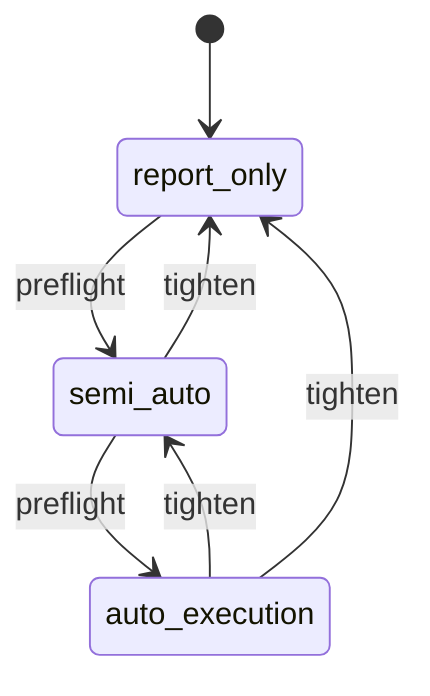
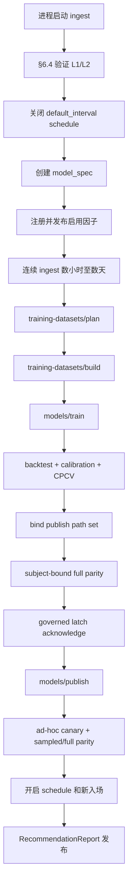
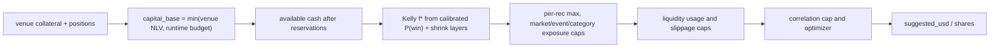

# quant-pivot 生产运行 Runbook

> Last reviewed: 2026-07-02.
>
> This document is an operating manual for quant-pivot on Polymarket. It explains how to prepare credentials and capital, start the system, read reports, place governed orders, sell or redeem positions, and respond to incidents. It is not investment advice. Every buy/sell decision must be traceable to a published `RecommendationReport`, an `OrderIntent`, an `ExecutionOrder`, or an explicit operator incident action.

## 0. 核心原则

1. **Polymarket-only.** 本系统只支持 Polymarket Gamma、CLOB、Data API、Polygon 结算链路。
2. **主产物是 `RecommendationReport`。** 系统先给出 Top-N 推荐，推荐里包含买什么、什么时候买、买多少、什么时候卖、卖多少、依据什么。
3. **`report_only` 不是模拟。** `report_only` 不签名、不下单，但报告 sizing 基于真实 venue 账户：CLOB collateral 加 Data API positions。因此启动和生成报告也需要真实 `private_key`、`quant.account.funder` 和可读账户。
4. **私钥只在可执行模式签名。** `semi_auto` / `auto_execution` 下提交订单时才会用私钥签 CLOB order；`report_only` 只用认证客户端读取账户和 CLOB L2 凭证。
5. **所有执行默认 fail-closed。** 缺私钥 credential、缺 funder、账户不一致、active policy/preflight 无效、数据质量不足、book 过期、kill switch 非 `closed`、capital/reconciliation 异常，都会拒绝或延后执行。
6. **人工只能收紧订单。** `approve` 允许降低 shares、降低 limit price、降低 max notional；不能放大报告给出的风险包络。
7. **资金真相来自 venue。** `AccountSnapshot` 使用 CLOB collateral 和 Data API positions，runtime budget 只是上限，不是凭空可花资金。
8. **先治理，后执行。** 生产订单优先走 `semi_auto` 或 `auto_execution` 的 `OrderIntent` 链路；直接在 Polymarket UI 手动交易只适合作为人工 `report_only` 操作或事故处置，审计和 attribution 会弱于系统内订单。

## 1. 外部资料与系统事实来源

运行前应核对外部接口文档，因为 Polymarket 的 bridge、wallet 类型、费用和 CLOB 约束可能变化。

| 主题 | 来源 |
|------|------|
| Polymarket CLOB、认证、签名类型 | [Trading Overview](https://docs.polymarket.com/trading/overview), [Authentication](https://docs.polymarket.com/api-reference/authentication) |
| 创建订单、tick size、allowance、order type | [Create Order](https://docs.polymarket.com/trading/orders/create) |
| 交易费用 | [Fees](https://docs.polymarket.com/trading/fees) |
| 充值 / bridge supported assets | [Deposit](https://docs.polymarket.com/trading/bridge/deposit), [Supported Assets](https://docs.polymarket.com/trading/bridge/supported-assets) |
| 提现 | [Withdraw](https://docs.polymarket.com/trading/bridge/withdraw) |
| 到期赎回 / 合并 token | [Redeem Tokens](https://docs.polymarket.com/trading/ctf/redeem), [Merge Tokens](https://docs.polymarket.com/trading/ctf/merge) |
| Gasless relayer | [Gasless Transactions](https://docs.polymarket.com/trading/gasless) |
| 本仓库 deploy config | `config/quant-pivot.toml`, `config/quant-pivot.production.example.toml`, `crates/quant-pivot-models/src/config/` |
| 本仓库 runtime config | `crates/quant-pivot-models/src/runtime_config/` |
| API routes | `crates/quant-pivot-web/src/routes/` |
| 执行 / reconciliation | `crates/quant-pivot-core/src/execution/` |

## 2. 角色与权限

| 角色 | 可以做什么 | 禁止事项 |
|------|------------|----------|
| Operator | 启停进程、健康检查、运行 ad-hoc report、切 mode、设置 kill switch、处理事故 | 不修改策略参数除非有量化/负责人授权 |
| Quant | 配置 selection、features、factors、model、portfolio、reports、execution 策略；解释推荐 | 不直接绕过治理提交订单 |
| Approver | 在 `semi_auto` 审批或拒绝 `OrderIntent` | 不扩大 shares、price、notional |
| Admin | 管理用户、角色、JWT、secret readiness、policy 激活/回滚 | 不把私钥、JWT signing key、relayer key 写入仓库、环境变量或命令行 |

新部署会 seed `admin`，但不存在默认口令。执行 `postgres-schema apply` 前，secret manager 必须把
16–256 字符的强随机初始口令挂载为权限 `0400` 或 `0600` 的普通文件，并通过
`QUANT_PIVOT_BOOTSTRAP__ADMIN_PASSWORD_FILE` 传给 deploy-only xtask。缺失、权限过宽、`admin` 等模板值都会
使 schema finalize 失败；应用 runtime 不读取该文件。首次登录后仍应轮换口令或创建实名管理员并禁用
bootstrap 账户。

## 3. Runtime mode 与 kill switch

### 3.1 Runtime mode

| Mode | 报告 | 创建 intent | 人工审批 | 自动策略批准 | 签名 / 提交订单 |
|------|------|-------------|----------|--------------|-----------------|
| `report_only` | 是 | 否 | 不适用 | 否 | 否 |
| `semi_auto` | 是 | 是，状态 `pending_approval` | 必须 | 否 | 仅 `approve` 后人工 `submit` |
| `auto_execution` | 是 | 是，状态 `approved_by_policy` | 非必需 | 是 | admission 通过后自动或人工提交 |

允许的升级/降级路径：



`report_only` 不能直接升级到 `auto_execution`。先进入 `semi_auto`，完成 shadow / readiness 后再升级。

### 3.2 Kill switch

| State | 新开仓 | 普通自动卖出 | 用途 |
|-------|--------|--------------|------|
| `closed` | 允许 | 允许 | 正常状态 |
| `report_only_forced` | 禁止 | 允许 | 强制只生成报告，不新增 exposure |
| `exit_only` | 禁止 | 允许 | 只允许退出或减仓 |
| `execution_halted` | 禁止 | 禁止 | 暂停所有自动执行，人工处理 |
| `emergency_halted` | 禁止 | 禁止普通自动退出；进入紧急处置 | 严重事故，清除时需要 operator ack |

设置 kill switch 示例：

```bash
BASE=http://127.0.0.1:8080
TOKEN=...

curl -sS -X POST "$BASE/api/system/kill-switch" \
  -H "Authorization: Bearer $TOKEN" \
  -H "Accept-Api-Version: v1" \
  -H "X-Acting-Role: operator" \
  -H "Content-Type: application/json" \
  -d '{
    "state": "exit_only",
    "reason": "venue instability: stop new entries, keep exits enabled",
    "ack": false
  }'
```

清除 `emergency_halted` 时必须显式设置 `ack: true`，并在 reason 里写明事故编号和复盘结论。

## 4. 运行前准备清单

### 4.1 外部账户与凭证

| 项 | 是否必须 | 用于 | 配置位置 | 说明 |
|----|----------|------|----------|------|
| Polygon / Polymarket signer private key | 所有 mode 必须 | CLOB auth、账户读取、可执行模式签订单 | `[keys].private_key = "REPLACE_WITH_PRIVATE_KEY"` | 明文仅写入 gitignored 或权限 `0600` 的 deploy TOML；解析后由 `SecretText` 持有 |
| `quant.account.funder` | 所有 mode 必须 | 读取 collateral、positions、计算 capital base | `QUANT_PIVOT__QUANT__ACCOUNT__FUNDER` | EOA 必须等于 signer 地址；proxy/safe 必须是 signer 控制的钱包地址 |
| `quant.account.wallet_kind` | 所有 mode 必须 | 决定签名类型和 funder 校验 | `QUANT_PIVOT__QUANT__ACCOUNT__WALLET_KIND` | 当前代码支持 `eoa`、`proxy`、`gnosis_safe` |
| CLOB L2 credentials | 不单独配置 | CLOB trading endpoints | 自动派生 | SDK connect 时由 private key 和 wallet topology 派生 |
| Polygon RPC URL | 所有 mode 必须 | on-chain 读写、结算、赎回 | `QUANT_PIVOT__POLYMARKET__ONCHAIN__RPC_URL` | 生产必须使用可靠 RPC，配置超时 |
| Gasless relayer key/address | proxy/safe 且会提交链上交易时必须 | gasless approval/redeem/settlement | `[polymarket.relayer].api_key = "REPLACE_WITH_RELAYER_API_KEY"`；address 为非敏感配置 | EOA 可直接付 gas；relayer key 不得暴露到前端 |
| JWT signing key | Web API 必须 | HS256 登录和 API 认证 | `[web.jwt].signing_key = "REPLACE_WITH_JWT_SIGNING_KEY"` | 值为 Base64URL-no-pad 编码的恰好 32 个随机字节；轮换立即使所有旧 JWT 失效 |
| Evidence signing key | 研究证据生产必须 | BLAKE3 keyed attestation | `[research.evidence_attestation].signing_key = "REPLACE_WITH_EVIDENCE_SIGNING_KEY"` | 值为 64 个小写 hex；历史 key 同样由 `SecretText` 持有，禁止与 JWT key 复用 |
| Telegram / webhook secrets | 可选 | 通知 | deploy TOML 的 `SecretText` 字段；`operational_control.notifications` 只管事件路由 | Config API 永不返回 secret value |

注意：Polymarket 官方文档列出 Deposit Wallet / `POLY_1271` 等签名类型，但当前代码只建模 `eoa`、`proxy`、`gnosis_safe`。如果要接入 Deposit Wallet，需要先扩展 wallet topology、配置校验、CLOB client 和 relayer 路径。

### 4.2 基础设施

| 组件 | 用途 | 运行前检查 |
|------|------|------------|
| Postgres | 系统主库、policy revisions/approvals/activations、reports、intents、orders、positions、operation log | 空库只执行单一 boot migration；runtime 连接池账号无 DDL 权限 |
| ClickHouse | market facts、features、数据质量、研究分析 | database 存在，批量写入权限正常 |
| Redis | JWT revocation、缓存、运行时辅助状态 | 连接、认证、DB、key prefix 正确 |
| Web server | API、UI、WS、metrics | listen host/port、CORS、JWT 配置正确 |
| Metrics backend | `/metrics` scrape | Prometheus 或同等采集已配置 |
| Log backend | 结构化日志 | production 建议 `log_json=true` |

### 4.3 Deploy Config 与 governed policy 分工

Deploy Config 只包含启动时才能决定的内容：服务 endpoint、bind/CORS、deployment identity、PostgreSQL/ClickHouse/Redis/artifact store 连接位置、Polymarket/provider binding、日志/TLS/JWT metadata 与七组主机资源预算。来源固定为：

1. compiled defaults；
2. source-controlled non-secret `quant-pivot.toml`；
3. gitignored 或部署主机上的权限 `0600` TOML；
4. 环境变量只允许选择 config directory、deployment identity 等极少数部署元数据，禁止覆盖业务策略或直接承载 secret。

Runtime 热更新由六个强类型 policy resource 负责：`recommendation_policy`、`execution_risk_policy`、`model_routing`、`report_schedule`、`operational_control`、`execution_authorization`。每个资源独立 revision、固定 boot `schema_version = 1`，必须经过 Draft → Validate/Preflight → Approve → Activate；不存在旧巨型 Runtime Config parser 或自动回滚。

Feature、factor、domain 语义和 research/training methodology 属于 content-addressed immutable profile/job artifact，不从 Deploy Config 或热配置读取。详细操作见 §7。

### 4.4 Deploy TOML 最小安装示例

不要把 private key、数据库/缓存口令、JWT signing key、webhook/Telegram token、evidence key 或 relayer key 写入 tracked TOML、环境变量、命令行或日志。生产部署从 reviewed example 安装一份权限 `0600`、不进入版本控制的配置，再通过交互式编辑器填写 secret；不要用 shell argument 或重定向把值留在 history。

```bash
install -d -m 0700 /etc/quant-pivot
install -m 0600 config/quant-pivot.production.example.toml /etc/quant-pivot/quant-pivot.toml
${EDITOR:?set EDITOR} /etc/quant-pivot/quant-pivot.toml
```

systemd unit 只设置 `Environment=QUANT_PIVOT_CONFIG_DIR=/etc/quant-pivot`，不设置 secret environment。启动前检查所有 `REPLACE_WITH_*` 已替换、文件 owner 是 service user、mode 精确为 `0600`。

PostgreSQL 与 ClickHouse 各自只配置一组 `user + password`，由 runtime、schema CLI 与 Fresh Boot 复用。所有 schema/reset/seal mutation 必须持有 canonical lifecycle lease；应用启动仍只执行 verify，绝不自动 DDL。deploy TOML 必须是普通文件、权限 `0600`、不进入版本控制；Config 控制台只显示 secret readiness，不返回值。
## 5. 钱包、充值、allowance 与提现

### 5.1 选择 wallet topology

| Topology | `wallet_kind` | `funder` 应该是什么 | 适用场景 | 风险点 |
|----------|---------------|----------------------|----------|--------|
| EOA | `eoa` | signer address | 最简单，EOA 自己付 gas | 私钥直接控制资金，必须严控 secret |
| Proxy wallet | `proxy` | signer 控制的 proxy wallet 地址 | 历史 Polymarket 账户或 proxy 体系 | funder 不等于 signer，需要 relayer/代理链路校验 |
| Gnosis Safe | `gnosis_safe` | signer 控制的 Safe 地址 | 多签/机构化 custody | relayer、Safe owner、签名类型和 allowance 更复杂 |

上线前检查：

1. signer private key 能派生预期 signer address；
2. `funder` 与 `wallet_kind` 的关系满足代码校验；
3. `GET /api/system/deploy-config` 返回 `keys.private_key_present=true`；
4. `GET /api/quant/account/live` 能读到 collateral、positions 和 capital base；
5. 如果要提交订单，Polymarket 侧 allowance 足够。

### 5.2 充值 SOP

充值目标是让 `funder` 获得可用于 Polymarket CLOB 的 pUSD / collateral。Polymarket bridge 支持的 chain/token、最小额和流程会变化，操作前必须核对官方 `supported-assets`。

1. **确认收款钱包。** 使用 `quant.account.funder`，不是随手复制 signer address。EOA 下二者相同；proxy/safe 下通常不同。
2. **检查当前系统账户。**

   ```bash
   curl -sS "$BASE/api/quant/account/live" \
     -H "Authorization: Bearer $TOKEN" \
     -H "Accept-Api-Version: v1" | jq .
   ```

3. **查 supported assets。** 按 Polymarket Bridge 文档调用 supported-assets，确认源链、token、minimum、预计时间和输出资产。
4. **生成本次充值地址。** 通过 Polymarket Bridge / UI 为目标 wallet 请求本次充值地址。不要复用旧页面或不明来源地址。
5. **从源链转入。** 只发送 supported token。错误 chain/token 可能无法找回。大额资金分批；官方文档建议超过 50k USD 的非 Polygon bridge 考虑拆分或使用第三方 bridge。
6. **等待 bridge 完成。** 跟踪 bridge status、源链 tx、Polygon 到账情况。
7. **系统侧复核。** 到账后刷新 `GET /api/quant/account/live`，确认：
   - `collateral` 增加；
   - `venue_net_liquidation = collateral + positions_value` 合理；
   - `capital_base = min(venue_net_liquidation, runtime budget cap)`；
   - `available` 足够覆盖计划交易。
8. **调整 runtime budget。** 如果新增资金只是备用，不希望策略使用全部余额，降低 `portfolio.budget.total_budget_usd` 或各 exposure caps。

充值完成前不要提高 mode；账户读取失败时不要假定资金可用。

### 5.3 订单 allowance

Polymarket CLOB 下单要求：

| 方向 | 需要的 allowance |
|------|------------------|
| BUY | pUSD / collateral allowance >= spend |
| SELL | conditional token allowance >= sell amount |

当前系统的 CLOB client 负责认证和下单，但没有在 runbook 层保证自动补齐所有 allowance。上线前必须用 Polymarket UI、官方 SDK 或 wallet 工具确认 funder 对 CLOB/exchange adapter 的 allowance 足够。allowance 不足时，系统 admission 可能通过，但 venue 提交会失败或 reconciliation 进入异常路径。

### 5.4 费用、滑点和 bridge 成本

运行前必须把三类成本纳入决策：

| 成本 | 来源 | 系统如何处理 | 操作注意 |
|------|------|--------------|----------|
| CLOB trading fee | Polymarket fee schedule | SDK/venue 层处理 fee 计算；report 和 attribution 应使用成交后事实复核 | 不要用手工估算替代实际成交和 fee 记录 |
| Slippage / spread | CLOB order book | `entry_order_policy.max_slippage_bps`、entry plan limit cap、admission `slippage` check | marketable order 也必须有 worst-price cap |
| Bridge / intermediary / gas / liquidity cost | 充值提现、跨链、relayer、RPC/on-chain | 不进入 recommendation alpha；作为运营成本单独记录 | Polymarket 文档说明平台本身可能不收充值/提现费，但中间路由、流动性、gas 和第三方服务可能产生成本 |

Polymarket 当前文档描述 taker fee 与成交额、fee rate 和价格相关，maker fee 为 0，SDK 会处理 venue fee 细节。运营上仍要用实际 execution/trade/settlement 结果做账，不要在报告阶段提前把 fee 估成确定 PnL。

### 5.5 提现 SOP

提现是资金移出系统，必须先冻结新增风险。

1. **切到安全状态。**
   - 常规提现：切 `report_only` 或设置 `report_only_forced`。
   - 有未平仓但只想停止开仓：设置 `exit_only`。
   - 不要在 `auto_execution` 且 kill switch `closed` 时提现。

2. **确认没有进行中的系统动作。**

   ```bash
   curl -sS "$BASE/api/quant/intents?status=admission_pending" \
     -H "Authorization: Bearer $TOKEN" \
     -H "Accept-Api-Version: v1" | jq .

   curl -sS "$BASE/api/quant/execution-orders?state=submitted" \
     -H "Authorization: Bearer $TOKEN" \
     -H "Accept-Api-Version: v1" | jq .

   curl -sS "$BASE/api/quant/reconciliations?result=pending" \
     -H "Authorization: Bearer $TOKEN" \
     -H "Accept-Api-Version: v1" | jq .
   ```

3. **计算可提现额。** 以 venue collateral 为上限，扣除：
   - open orders / reserved capital；
   - `quant_capital_allocation` 中 `allocated`、`locked`、`impaired`；
   - 近期待 reconciliation 的 ambiguous order；
   - 计划保留的最小操作现金。

4. **通过 Polymarket Withdraw / Bridge 发起提现。**
   - 指定目标 chain、目标 token、destination address；
   - 根据官方页面生成本次 withdrawal address；
   - 不要预生成和长期保存 withdrawal address；
   - 大额提现拆分；如果流动性池不足，等待或分批；
   - pUSD 直接提现需要目标地址能识别 pUSD，否则可能需要 swap/bridge 成更通用资产。

5. **系统侧复核。** 提现完成后再次读取 `GET /api/quant/account/live`。如 capital base 下降，必须治理并降低 `execution_risk_policy` 中的 budget/caps，否则后续 report 会被 budget exhausted 或 admission 拒绝。

6. **解除冻结。** 只有当 account snapshot、reconciliation、positions 都一致后，才把 kill switch 恢复为 `closed` 或切回目标 mode。

## 6. 启动与基础健康检查

### 6.1 构建与启动

开发或单机验证：

```bash
cargo run -p quant-pivot-bin -- --config-dir config
```

生产建议先构建 release binary，再由 systemd、Nomad、Kubernetes 或同等进程管理器托管：

```bash
cargo build --release -p quant-pivot-bin
./target/release/quant-pivot --config-dir /etc/quant-pivot
```

启动失败常见原因：

| 现象 | 可能原因 | 处理 |
|------|----------|------|
| deploy config validation failed | 缺 private key、funder、JWT signing key、relayer config，或 production runtime 配置混入 migration DDL password | 补齐环境变量/TOML；DDL password 只挂载给 deploy/xtask profile |
| authenticated CLOB client failed | private key 无效、wallet topology 不匹配、CLOB endpoint 不通 | 校验 signer/funder，检查网络和 CLOB auth |
| account provider unavailable | `funder` 缺失或 Data API/CLOB collateral 读取失败 | 修复账户配置，不能降级为模拟资金 |
| policy revision rejected | typed schema、semantic constraint、dependency preflight 或 CAS 失败 | 读取 resource schema/validation evidence，修正 typed draft 后重新 review |

### 6.2 登录与 header

所有 `/api/...` 受保护接口都需要：

1. `Authorization: Bearer <access_token>`
2. `Accept-Api-Version: v1`
3. 对 governed mutation 增加 `X-Acting-Role: <role-code>`

登录示例：

```bash
BASE=http://127.0.0.1:8080
read -r -p "Admin username: " ADMIN_USERNAME
read -r -s -p "Admin password: " ADMIN_PASSWORD

TOKEN=$(
  jq -n --arg username "$ADMIN_USERNAME" --arg password "$ADMIN_PASSWORD" \
    '{username: $username, password: $password}' \
  | curl -sS -X POST "$BASE/api/auth/login" \
    -H "Accept-Api-Version: v1" \
    -H "Content-Type: application/json" \
    --data-binary @- \
  | jq -r '.data.access_token'
)
unset ADMIN_PASSWORD
```

首次登录后立即轮换 bootstrap 口令，或创建实名管理员并禁用 bootstrap 账户。

### 6.3 健康检查

无需认证：

```bash
curl -sS "$BASE/health" | jq .
curl -sS "$BASE/ready" | jq .
curl -sS "$BASE/metrics" | head
```

需要认证：

```bash
curl -sS "$BASE/api/system/status" \
  -H "Authorization: Bearer $TOKEN" \
  -H "Accept-Api-Version: v1" | jq .

curl -sS "$BASE/api/system/health" \
  -H "Authorization: Bearer $TOKEN" \
  -H "Accept-Api-Version: v1" | jq .

curl -sS "$BASE/api/system/deploy-config" \
  -H "Authorization: Bearer $TOKEN" \
  -H "Accept-Api-Version: v1" | jq .

curl -sS "$BASE/api/quant/account/live" \
  -H "Authorization: Bearer $TOKEN" \
  -H "Accept-Api-Version: v1" | jq .
```

上线前必须看到：

- process running；
- Postgres/ClickHouse/Redis healthy；
- private key present；
- `quant_runtime_mode` 初始为 `report_only`；
- kill switch 为 `closed` 或明确的收紧状态；
- live account snapshot 成功；
- no pending/unresolvable reconciliation；
- market data WS 和 Gamma/Data API 正常。

### 6.4 冷启动：数据采集是否正常

首次部署时 Postgres / ClickHouse 为空，**数据摄取可以立即开始，但报告与训练有各自的前置条件**（见 §8.0）。本节说明要采集哪些数据、大致需要多久、以及如何用 API / 日志 / 指标确认采集正常。

#### 6.4.1 三层数据与用途

| 层 | 存储 | 采集内容 | 用途 | 大致可用时间 |
|----|------|----------|------|--------------|
| **L1 目录 + 实时盘口** | Postgres `market` / `event`；进程内 BookStore；CLOB WS | Gamma 全量/增量同步；订阅 token 的 L2 订单簿 | 市场列表、实时 book、报告选市（live PIT） | 启动后 **数分钟**（首次 Gamma full sync + WS shard 就绪） |
| **L2 历史盘口事实** | ClickHouse `book_snapshots`、`tick_events`、`book_l2_replay_hot`、`book_microstructure_*` | WS 增量写入；异步 fact writer 批量刷盘 | 离线训练集的 PIT 特征/标签、回测 | 持续 ingest **数小时** 起有可用窗口；训练窗口越长需要越久 |
| **L3 量化事实** | ClickHouse `quant_feature_event`、`quant_factor_event` 等 | 特征/因子/信号/报告流水线产出 | 研究分析、归因反馈、后续再训练 | 首份报告跑通后才有；冷启动阶段可忽略 |

**训练集 build** 主要消费 **L1 目录 + L2 历史盘口**（以及可选的 live attribution，需已有执行闭环）。  
**在线报告** 主要消费 **L1 实时盘口 + 已发布的 active model**（不读 ClickHouse 历史窗做 live scoring）。

#### 6.4.2 用 API 确认 L1（目录 + 实时 book）

**1. 系统生命周期 — 目录与 WS 是否就绪**

```bash
curl -sS "$BASE/api/system/status" \
  -H "Authorization: Bearer $TOKEN" \
  -H "Accept-Api-Version: v1" | jq '{
    catalog: .data.catalog,
    operational_phase: .data.operational_phase,
    market_data: .data.market_data,
    active_markets: .data.active_markets
  }'
```

期望（ ingest 正常时）：

| 字段 | 正常值 | 含义 |
|------|--------|------|
| `catalog.state` | `"ready"` | Gamma 首次 full sync 已完成 |
| `catalog.markets` | `> 0` | 已注册市场数 |
| `operational_phase.phase` | `"operational"` | 目录就绪且 WS 有新鲜 book 消息 |
| `market_data.ready` | `true` | 全局 CLOB WS 连通且消息未过期 |
| `market_data.ws_shards.disconnected` | `0` | 所有 WS shard 已连接 |
| `active_markets` | `> 0` | 当前活跃可检测市场数 |

若长期停留在 `catalog_warming` 或 `market_data_connecting`，检查 Gamma endpoint、CLOB WS URL、网络与进程日志（`quant_pivot_core::service::gamma`、`quant_pivot_api::ws::router`）。

**2. 市场列表 — Postgres 是否有 catalog**

```bash
curl -sS "$BASE/api/markets?page=1&size=5" \
  -H "Authorization: Bearer $TOKEN" \
  -H "Accept-Api-Version: v1" | jq '{total: .data.total, sample: [.data.items[] | {market_id, question, status}]}'
```

`total > 0` 表示 Gamma 持久化成功。若 API 有数据但日志曾出现 `failed to persist markets`，说明 upsert 曾失败（常见为 Postgres 枚举 cast 问题），需升级至含修复的二进制并观察下次 sync。

**3. 单市场盘口 — BookStore 是否有 L2**

```bash
MARKET_ID="<从 markets 列表取一个 market_id>"
curl -sS "$BASE/api/markets/$MARKET_ID/book" \
  -H "Authorization: Bearer $TOKEN" \
  -H "Accept-Api-Version: v1" | jq .
```

YES/NO 两侧应有 bid/ask 档位；若长期为空，检查该 market 是否已订阅（tier1 选市日志 `subscribed=N`）。

**4. 数据质量快照 — 实时 book 新鲜度**

```bash
curl -sS "$BASE/api/quant/data-quality" \
  -H "Authorization: Bearer $TOKEN" \
  -H "Accept-Api-Version: v1" | jq .
```

期望：`total_tokens > 0`；`fresh + acceptable` 占多数（= 可用盘口，静默但有效的冷门 book 属 `acceptable`，非故障）；`ingest_lag_exceeded: false`。  
`worst_book_age_ms` 是跨 token 实际观测到的最差盘口年龄（对照阈值 `max_book_age_ms`）。  
`worst_ingest_lag_ms` 接近或超过 `max_ingest_lag_ms` 表示 ClickHouse 入库管道（enqueue→flush）滞后，会影响离线训练集的 PIT 精度；它衡量写入背压，与 venue 盘口年龄无关。

**5. 子系统健康**

```bash
curl -sS "$BASE/api/system/health" \
  -H "Authorization: Bearer $TOKEN" \
  -H "Accept-Api-Version: v1" | jq '{overall_healthy: .data.overall_healthy, checks: .data.checks}'
```

Postgres、ClickHouse、Redis 探针应为 `healthy`。

#### 6.4.3 用日志确认采集（无需 DB 直连）

启动后日志中应出现类似条目（时间戳因环境而异）：

| 日志关键词 | 含义 |
|------------|------|
| `gamma full sync complete events=… registered=…` | Gamma 目录同步完成 |
| `CLOB websocket subscription ingest synced … subscribed=N` | WS 订阅与 tier 选市完成 |
| `WS shard spawned shard_id=…` | CLOB WS 分片就绪 |
| `ClickHouse schema ensured` | CH 表结构已就绪 |
| `Tick size changed asset_id=…` | 盘口增量正常（INFO，非错误） |

**可忽略的 WARN（若进程继续启动）**：

- `POST /auth/api-key … Could not create api key` — SDK 在 key 已存在时 create 失败后会 derive 成功。

**需要处理的 WARN/ERROR**：

- `failed to persist markets` — Postgres upsert 失败，目录不完整。
- `report generation failed … active_model_version_id is not configured` — 尚无已发布模型（冷启动预期；见 §8.0 关 schedule）。

#### 6.4.4 用 Prometheus 指标确认（可选）

从 `/metrics` 抓取（名称前缀 `quant_pivot_`）：

| 指标 | 正常趋势 |
|------|----------|
| `gamma_markets_total` | > 0，full sync 后稳定 |
| `gamma_last_sync_success` | 1（最近一次 sync 成功） |
| `ingest_pipeline_lag_worst_ms` | 低于 `recommendation_policy.data_quality.max_ingest_lag_ms` |
| `ingest_pipeline_lag_seconds`（按 writer） | 无持续增大 |

#### 6.4.5 用 ClickHouse 确认 L2 历史（训练前）

直连 ClickHouse（替换连接参数）：

```sql
-- 最近是否有 book 快照写入
SELECT count() AS rows, max(ingestion_time) AS latest
FROM book_snapshots
WHERE ingestion_time > now() - INTERVAL 1 HOUR;

-- 按 token 看覆盖（抽样）
SELECT token_id, count() AS snaps, min(event_time) AS first_seen, max(event_time) AS last_seen
FROM book_snapshots
WHERE ingestion_time > now() - INTERVAL 24 HOUR
GROUP BY token_id
ORDER BY snaps DESC
LIMIT 10;
```

`rows > 0` 且 `latest` 接近当前时间，说明 L2 历史事实在积累。  
**训练集 plan 的 `planned_samples` 依赖这段历史**；窗口 `[window_start, window_end)` 内没有足够 PIT book 的样本会在 build 时被丢弃。

#### 6.4.6 训练集需要累积多久（数量级）

没有固定「日历天数」，取决于 **窗口长度、采样间隔、订阅市场数、ModelSpec 标签/预测 horizon** 和
**model evaluation profile 阈值**。以下是冷启动示例契约与当前 immutable research profile，不是同一个 hot policy resource：

| 参数 | 默认值 | 影响 |
|------|--------|------|
| `ModelSpec.prediction_horizon_secs` / `training_contract.target_label_horizon_secs` | 示例 `86400`（24h） | 冻结进 ModelSpec；训练标签需样本 `decision_at` 之后 24h 内有 forward truth |
| `ModelEvaluationSpec.min_sample_count` | `500` | publish 门禁：回测/数据集样本数 |
| `ModelEvaluationSpec.min_label_coverage` | `0.70` | 标签覆盖率 |
| `report_schedule.schedules[default_interval].cadence` | 每 `300`s | 与训练无关；冷启动无模型时会 ERROR |

**实操估算**（默认 24h horizon、`sample_interval_secs=300`、tier1 ~1600 token）：

1. **L1 就绪**：启动后 ~5–15 分钟（Gamma + WS）。
2. **L2 可用于短窗 plan**：连续 ingest **≥ 几小时** 后可对最近 1–4 小时窗口做 plan，看 `planned_samples`。
3. **标签成熟**：窗口内每个样本的标签要求 `decision_at + horizon` 之前的 forward truth 已 ingest。
   因此 **`window_end` 应 ≤ `now - max(horizons_secs)`**（通常 ≤ now − 24h），否则大量 `labels_not_mature`。
4. **首次 publish**：在 label 成熟的前提下，往往还需要 **≥ 7–14 天** 连续 ingest + 足够跨市场样本，才能通过默认 `min_sample_count=500`；Quant 可在授权下临时调低 gate 做 bootstrap。

先用 **plan 干跑** 看数量，再决定 build（§8.2）：

```bash
curl -sS -X POST "$BASE/api/research/training-datasets/plan" \
  -H "Authorization: Bearer $TOKEN" \
  -H "Accept-Api-Version: v1" \
  -H "X-Acting-Role: risk_owner" \
  -H "Content-Type: application/json" \
  -d '{
    "model_spec_id": "<已有 model spec UUID>",
    "decision_policy_snapshot_id": "<active decision policy snapshot UUID>",
    "window_start": "2026-06-25T00:00:00Z",
    "window_end": "2026-07-01T00:00:00Z",
    "sample_interval_secs": 300,
    "horizons_secs": [86400],
    "knowledge_lag_secs": 10,
    "feature_schema_version": 1,
    "reason": "cold-start dry plan"
  }' | jq '{planned_samples: .data.planned_samples, training_dataset_id: .data.training_dataset_id}'
```

`planned_samples` 接近 0 → 继续 ingest 或扩大窗口 / 检查 ClickHouse。

Build（在 plan 满意后，复用相同 window 参数 + plan 返回的 `training_dataset_id`）是异步作业，HTTP 返回 `202 Accepted`：

```bash
curl -sS -X POST "$BASE/api/research/training-datasets/build" \
  -H "Authorization: Bearer $TOKEN" \
  -H "Accept-Api-Version: v1" \
  -H "X-Acting-Role: risk_owner" \
  -H "Content-Type: application/json" \
  -d '{
    "training_dataset_id": "<plan 返回的 UUID>",
    "model_spec_id": "<model spec UUID>",
    "decision_policy_snapshot_id": "<decision policy snapshot UUID>",
    "window_start": "2026-06-25T00:00:00Z",
    "window_end": "2026-07-01T00:00:00Z",
    "sample_interval_secs": 300,
    "horizons_secs": [86400],
    "knowledge_lag_secs": 10,
    "feature_schema_version": 1,
    "reason": "cold-start first dataset build"
  }' | jq '{job_id: .data.job_id, status: .data.status}'
```

Poll `GET /api/research/jobs/{job_id}` 到 `succeeded | failed | cancelled`；作业成功后再 poll
`GET /api/research/training-datasets/{training_dataset_id}`，只有 `ready` 可以进入训练/CPCV/回测。

## 7. Config policy 操作

Config 控制台（`/system/config`）是首选入口。CLI 仅用于自动化和事故恢复；请求/响应 DTO 与 UI 类型均由 Rust schema 单一来源生成。权限分为 view、create、approve、activate、rollback 与 lifecycle seal，同一操作者可以执行多步，但每一步必须独立留痕。

### 7.1 查看资源、当前 revision 与 schema

```bash
curl -sS "$BASE/api/config/resources" \
  -H "Authorization: Bearer $TOKEN" \
  -H "Accept-Api-Version: v1" | jq .

KIND=recommendation_policy
curl -sS "$BASE/api/config/$KIND/current" \
  -H "Authorization: Bearer $TOKEN" \
  -H "Accept-Api-Version: v1" | jq .

curl -sS "$BASE/api/config/$KIND/schema" \
  -H "Authorization: Bearer $TOKEN" \
  -H "Accept-Api-Version: v1" | jq .
```

合法 `KIND` 只有：`recommendation_policy`、`execution_risk_policy`、`model_routing`、`report_schedule`、`operational_control`、`execution_authorization`。不要拼接自由字符串或旧 section path。

### 7.2 Draft → Validate/Preflight → Approve → Activate

每次修改创建一个完整、强类型且不可变的 resource document；没有 dotted-path patch、editable raw JSON 或“一键创建并激活”。以下命令演示治理协议，实际编辑优先使用 Config 控制台的字段表单、影响摘要和 diff review。

```bash
CURRENT=$(
  curl -sS "$BASE/api/config/$KIND/current" \
    -H "Authorization: Bearer $TOKEN" \
    -H "Accept-Api-Version: v1"
)
EXPECTED_ACTIVE_REVISION_ID=$(jq -r '.data.revision.policy_revision_id // empty' <<<"$CURRENT")
DOCUMENT=$(jq -c '.data.revision.document' <<<"$CURRENT")

# 使用受评审的 typed document 生成 DRAFT_DOCUMENT；不要把 masked/secret 值写入此文档。
# 示例仅展示 recommendation policy 的一个字段：
DRAFT_DOCUMENT=$(jq -c '.document.reports.max_top_n = 20' <<<"$DOCUMENT")

DRAFT=$(
  jq -n --argjson document "$DRAFT_DOCUMENT" \
    '{document: $document, reason: "raise report result cap after review"}' \
  | curl -sS -X POST "$BASE/api/config/$KIND/drafts" \
      -H "Authorization: Bearer $TOKEN" \
      -H "Accept-Api-Version: v1" \
      -H "X-Acting-Role: risk_owner" \
      -H "Content-Type: application/json" \
      --data-binary @-
)
REVISION_ID=$(jq -r '.data.policy_revision_id' <<<"$DRAFT")

VALIDATION=$(
  curl -sS -X POST "$BASE/api/config/$KIND/drafts/$REVISION_ID/validate" \
    -H "Authorization: Bearer $TOKEN" \
    -H "Accept-Api-Version: v1" \
    -H "X-Acting-Role: risk_owner" \
    -H "Content-Type: application/json" \
    -d '{"reason":"typed validation and dependency preflight"}'
)
test "$(jq -r '.data.valid' <<<"$VALIDATION")" = "true"
PREFLIGHT_TOKEN=$(jq -r '.data.preflight_token' <<<"$VALIDATION")

APPROVAL=$(
  curl -sS -X POST "$BASE/api/config/$KIND/drafts/$REVISION_ID/approve" \
    -H "Authorization: Bearer $TOKEN" \
    -H "Accept-Api-Version: v1" \
    -H "X-Acting-Role: risk_owner" \
    -H "Content-Type: application/json" \
    -d '{"decision":"approved","reason":"reviewed diff and impact","expires_at":null}'
)
APPROVAL_ID=$(jq -r '.data.policy_approval_id' <<<"$APPROVAL")

jq -n \
  --arg approval_id "$APPROVAL_ID" \
  --arg expected "$EXPECTED_ACTIVE_REVISION_ID" \
  --arg reason "activate reviewed policy revision" \
  --arg preflight_token "$PREFLIGHT_TOKEN" \
  --arg idempotency_key "$(uuidgen)" \
  '{
    approval_id: $approval_id,
    expected_active_revision_id: (if $expected == "" then null else $expected end),
    reason: $reason,
    preflight_token: $preflight_token,
    idempotency_key: $idempotency_key
  }' \
| curl -sS -X POST "$BASE/api/config/$KIND/drafts/$REVISION_ID/activate" \
    -H "Authorization: Bearer $TOKEN" \
    -H "Accept-Api-Version: v1" \
    -H "X-Acting-Role: risk_owner" \
    -H "Content-Type: application/json" \
    --data-binary @- | jq .
```

关键失败语义：

- validation/preflight 失败：revision 保持 draft/validated 可修订状态，active snapshot 不变；
- `preflight_token` 过期或与 revision 不匹配：重新 validate，不复用旧 token；
- `expected_active_revision_id` stale：返回 CAS conflict，重新加载 current、review diff，再创建或激活；
- consumer prepare 失败：数据库 activation 与内存 snapshot 都不切换；
- activation 成功：只影响该 resource 的精确 effective boundary；运行中的 report/job 和已提交订单继续使用冻结 snapshot；
- 不存在自动回滚。

### 7.3 显式回滚

回滚不是切换一个数据库指针。选择历史 revision 后必须重新执行 Validate/Preflight、Approve 与 Review，并向下列 endpoint 提交与 §7.2 相同的 activation body：

```bash
curl -sS "$BASE/api/config/$KIND/revisions?limit=50" \
  -H "Authorization: Bearer $TOKEN" \
  -H "Accept-Api-Version: v1" | jq .

curl -sS -X POST \
  "$BASE/api/config/$KIND/revisions/$TARGET_REVISION_ID/rollback" \
  -H "Authorization: Bearer $TOKEN" \
  -H "Accept-Api-Version: v1" \
  -H "X-Acting-Role: risk_owner" \
  -H "Content-Type: application/json" \
  --data-binary @rollback-activation.json | jq .
```

`rollback-activation.json` 必须包含对目标 revision 有效的 `approval_id`、最新 `expected_active_revision_id`、`reason`、未过期 `preflight_token` 与新的 `idempotency_key`。回滚结果写入 append-only approval、activation 和 operation audit。

### 7.4 生效边界与操作选择

| 变更意图 | Resource | 生效边界 |
|----------|----------|----------|
| selection、data quality、Top-N、report TTL | `recommendation_policy` | 新 claim 的 ReportRun |
| budget、Kelly、exposure、entry/exit、breaker | `execution_risk_policy` | 新 OrderIntent / admission |
| active/shadow/exit model artifact | `model_routing` | 新 model evaluation claim |
| timezone、cadence、enabled | `report_schedule` | reconcile 未 claim future runs |
| pause/halt、worker admission、notification routing | `operational_control` | operational admission gate |
| SemiAuto/AutoExecution capability | `execution_authorization` | mode preflight 后的新 admission |

立即停止新执行使用 `operational_control` 的 halt 动作；不要靠缩小 risk threshold 模拟紧急停机。切换 mode 使用 `execution_authorization`；不要把 mode 当 Deploy Config。

### 7.5 Boot baseline 与正式投产封存

当前 `project-lifecycle.toml` 为 `pre_production_resettable / boot`。系统自有 policy、feature、dataset、model、manifest、evaluator 与 ClickHouse row schema 均从版本 1 开始；HTTP namespace `/api/v1` 和外部协议编号不重置。

空 PostgreSQL 只应用 `m00000000_000001_bootstrap`，空 ClickHouse 只应用 version 1 bootstrap。若检测到旧 migration history、未知非空 schema 或 manifest fingerprint 不一致，工具必须 fail closed，并提示清空该未投产环境后重新 bootstrap。Runbook 不自动删除数据库、缓存或 artifact；执行任何销毁前必须重新确认精确环境和授权。

正式上线前进入 `/system/config/lifecycle`，核对环境、build commit、PostgreSQL/ClickHouse fingerprint、migration、backup、Config E2E 与 active policy bundle。封存请求必须使用服务端返回的确认短语：

```bash
curl -sS "$BASE/api/config/lifecycle" \
  -H "Authorization: Bearer $TOKEN" \
  -H "Accept-Api-Version: v1" | jq .

curl -sS -X POST "$BASE/api/config/lifecycle/seal-production" \
  -H "Authorization: Bearer $TOKEN" \
  -H "Accept-Api-Version: v1" \
  -H "X-Acting-Role: operator" \
  -H "Content-Type: application/json" \
  -d '{
    "environment":"production",
    "confirmation_phrase":"<exact phrase from lifecycle response>",
    "reason":"seal verified first production baseline"
  }' | jq .
```

`production_frozen` 不可逆。封存后 boot squash/reset 被 API、CLI 与 migration 工具拒绝；任何 schema/data/version 演进都必须恢复标准 forward migration、兼容性评估、回滚方案与数据验证。
## 8. 生成与阅读报告

### 8.0 前置条件（冷启动必读）

**出报告 ≠ 只要进程跑起来。** 当前实现中，每次报告构建（定时或 ad-hoc）在选市之前会 **fail-closed** 检查：

1. **feature parity latch 已 clear** — 未初始化也是 open，新报告在任何模型/选市逻辑前就会被拒绝。
2. **`model_routing.model.active_model_version_id` 已配置** — 指向 registry 中 **`PublicationStatus::Published`** 的 boot v1 模型 artifact，且 artifact 可加载。
3. **启用因子已注册且 Published** — 因子平面 fail-closed 要求每个启用因子在 `quant_factor_definition` 中 **存在且为 `Published`**；**未注册**（从未 register）或仍为 `Draft` 都会阻断（报错 `enabled definitions must be Published … must first be registered via POST /research/factors/register`）。因子定义**不再由报告热路径隐式注册**，必须显式走 register。
4. **数据 ingest 就绪** — `operational_phase` 为 `operational`（或仅收紧型 degrade 仍允许报告）；实时 book 满足 data-quality 阈值。
5. **账户可读** — 所有 mode 下 CLOB collateral + Data API positions 可用（ReportOnly 不是 dry-run）。

因此 **第一次运行、库里没有任何模型时，报告必然失败** — 这是设计行为，不是 ingest 坏了。  
默认 boot `report_schedule` 可能 **启用** `default_interval` 定时 schedule（每 300s），但初次 parity latch 是 uninitialized/open，所以日志首先出现：

`feature parity latch is uninitialized; new report generation is blocked`

**冷启动推荐做法**（详见 §8.1）：

1. 先确认 §6.4 数据采集正常。
2. 在 Config 控制台编辑 `report_schedule`，经完整治理流程关闭 `default_interval`，避免无意义 ERROR 刷屏。
3. **创建 model_spec**（`POST /api/research/model-specs`）—— 离线研究生命周期的根，dataset/train 都要引用它。
4. **注册并发布启用因子**（`POST /api/research/factors/register` → `POST /api/research/factors/publish-batch`）—— 满足报告因子平面的 fail-closed 门。
5. 连续 ingest 直至 training-dataset **plan** 的 `planned_samples` 足够。
6. 走 **train → backtest/calibration → CPCV → bind path set → subject-bound parity → governed latch acknowledge → publish** 治理链。
7. 保持 schedule 关闭，先做 ad-hoc canary + sampled/full parity；全部通过后才开启 schedule 和新入场（§7.5）。

**训练集与报告的关系**：

| 问题 | 答案 |
|------|------|
| 出报告是否必须有训练集？ | **不直接需要**；报告读的是 **已发布模型 artifact**，不是训练集 Parquet。 |
| 那模型从哪来？ | 标准路径是 **model_spec → 训练集 build → train → backtest → publish**。没有 publish 就没有 active model。 |
| model_spec 从哪来？ | **`POST /api/research/model-specs`**（`materialization:create`，UI: 研究 → 模型 → 新建模型规格）。这是唯一的生产创建入口——**没有 seed、没有 DBA 预置**。 |
| 因子定义从哪来？ | **`POST /api/research/factors/register`** 幂等把启用因子集登记为 `Draft`，再 `publish-batch` 发布。dataset build 只要求因子**启用**（不要求 Published），但**报告**要求 Published。 |
| 能否跳过训练手动指模型？ | 只能在 `model_routing` picker 中选择当前 boot 契约下从 frozen v1 dataset 训练、并已通过 artifact/full-parity/质量门的 **Published** artifact；空库首次激活不存在可复用旧版本。 |

### 8.0.1 ClickHouse boot schema 门禁

当前 ClickHouse 只有 version 1 bootstrap。首次启动任何 writer 前，使用同一配置身份显式 apply，再执行只读 verify；两者与 PostgreSQL migration/reset/seal 竞争同一 lifecycle lease：

```bash
cargo run -p quant-pivot-xtask -- \
  clickhouse-schema apply --config-dir config
cargo run -p quant-pivot-xtask -- \
  clickhouse-schema verify --config-dir config
```

若发现旧 migration history、未知非空 schema、manifest checksum 或 schema fingerprint 不一致，命令立即 fail closed；不会搬运旧 rows、创建兼容 view 或让 runtime startup 自动 DDL。项目未投产时应在获得精确销毁授权后清空该环境并重新 bootstrap；`production_frozen` 后必须改用正式 forward migration。

### 8.1 从冷启动到第一份报告（完整流程）



**Step 0 — 关闭默认定时报告（避免 ERROR 刷屏）**

进入 `/system/config/report_schedule`，编辑 `default_interval.enabled = false`，完整执行 Draft → Review & Validate → Approve → Activate。Review 必须确认生效边界是“reconcile 尚未 claim 的 future runs”，已 claim run 不会被隐式取消。CLI 自动化按 §7.2 使用 `KIND=report_schedule` 的完整 typed document；禁止调用旧全局 version API 或 dotted-path patch。
**Step 0.5 — 创建 model_spec（离线研究生命周期的根）**

全新系统 `quant_model_spec` 为空，dataset/train 都要引用一个 `model_spec_id`。用治理写接口创建（**没有 seed / DBA 预置**）：

```bash
SPEC_ID=$(
  curl -sS -X POST "$BASE/api/research/model-specs" \
    -H "Authorization: Bearer $TOKEN" \
    -H "Accept-Api-Version: v1" \
    -H "X-Acting-Role: risk_owner" \
    -H "Content-Type: application/json" \
    -d '{
      "name": "buy-weighted-baseline",
      "model_family": "weighted_factor",
      "prediction_horizon_secs": 86400,
      "feature_schema_version": 1,
      "label_schema_version": 1,
      "input_contract": {"inputs": [
        {"feature_name": "book.spread_bps", "requiredness": "required"}
      ]},
      "training_contract": {
        "target_label_name": "return_to_horizon",
        "target_label_horizon_secs": 86400,
        "validation_folds": 5
      },
      "thesis": {
        "summary": "Polymarket buy-side weighted-factor baseline",
        "hypothesis": "Governed factor ranks predict positive 24h forward net returns",
        "limitations": ["Use only for markets covered by the frozen research profile"]
      },
      "reason": "bootstrap first model spec"
    }' | jq -r '.data.model_spec_id'
)
```

> `model_family` 取 `qp_model_family` 的 wire 值：`weighted_factor`（买方排序器，冷启动首选）、`hold_vs_exit_weighted`（卖方/退出，需先有平仓样本才可训练）、`classical_*`（需成熟 settlement label）。ModelSpec 创建后即为 append-only、内容寻址的研究定义；发布状态仅属于训练后的 ModelVersion。UI 入口：研究 → 模型 → **新建模型规格**。要建几个 spec、同一 WeightedFactor 何时拆线，见 [model-spec-catalog-guide.md](./model-spec-catalog-guide.md)。

**Step 0.6 — 注册并发布启用因子**

报告因子平面 fail-closed 要求启用因子**已注册且 Published**；因子定义**不再由报告热路径隐式注册**。先幂等注册为 `Draft`，再批量发布：

```bash
# 注册当前 immutable scoring profile 启用的因子集为 Draft（幂等）
curl -sS -X POST "$BASE/api/research/factors/register" \
  -H "Authorization: Bearer $TOKEN" \
  -H "Accept-Api-Version: v1" \
  -H "X-Acting-Role: risk_owner" \
  -H "Content-Type: application/json" \
  -d '{"reason":"bootstrap register enabled factors"}' \
  | jq '[.data[] | {name, status}]'

# 收集全部 draft 因子 id 并批量发布
DRAFT_IDS=$(
  curl -sS "$BASE/api/research/factors?status=draft&size=500" \
    -H "Authorization: Bearer $TOKEN" \
    -H "Accept-Api-Version: v1" | jq '[.data.items[].factor_definition_id]'
)
curl -sS -X POST "$BASE/api/research/factors/publish-batch" \
  -H "Authorization: Bearer $TOKEN" \
  -H "Accept-Api-Version: v1" \
  -H "X-Acting-Role: risk_owner" \
  -H "Content-Type: application/json" \
  -d "{\"factor_definition_ids\": $DRAFT_IDS, \"reason\": \"bootstrap publish factors\"}" \
  | jq '[.data[] | {name, status}]'
```

> dataset build 只要求因子集**启用**（非空），不要求 Published；因此 Step 0.6 也可以在 train 之后、开报告之前再做。但报告一定要它。UI 入口：研究 → 因子 → **注册启用因子** / **发布全部草稿**。

**Step 1 — Plan / Build 训练集**

前提：

- 已有目标 `model_spec_id`（Step 0.5 创建）；
- `decision_policy_snapshot_id` 使用当前 active policy bundle 生成的冻结 snapshot：

```bash
DECISION_POLICY_SNAPSHOT_ID=$(
  curl -sS "$BASE/api/config/recommendation_policy/current" \
    -H "Authorization: Bearer $TOKEN" \
    -H "Accept-Api-Version: v1" \
  | jq -r '.data.activation.decision_policy_snapshot_id'
)
```

1. **Plan**（不写 ledger，只看 `planned_samples`）— 见 §6.4.6 示例。
2. **Build**（同 plan body，加上 plan 返回的 `training_dataset_id`）— 见 §6.4.6 build 示例。
3. **Poll** `GET /api/research/training-datasets/{id}` 直到 `status` 为终端态。Trainer 只吃 **`ready`** 状态。

**Step 2 — Train → Backtest/Calibration → CPCV → Bind → Parity → Publish**

Train 只接受 frozen dataset ID + reason；model family、target、horizon、decision policy snapshot 和 input contract 全部从 dataset/model spec 冻结推导。返回是 `202 Accepted` 的 research job，不是已训练模型：

```bash
TRAIN_JOB_ID=$(
  curl -sS -X POST "$BASE/api/research/models/train" \
    -H "Authorization: Bearer $TOKEN" \
    -H "Accept-Api-Version: v1" \
    -H "X-Acting-Role: risk_owner" \
    -H "Content-Type: application/json" \
    -d "{
      \"training_dataset_id\": \"$TRAINING_DATASET_ID\",
      \"reason\": \"cold-start first model from frozen boot dataset\"
    }" \
  | jq -r '.data.job_id'
)

# Poll 到 succeeded | failed | cancelled；succeeded 的 result_ref 是 model_version_id。
curl -sS "$BASE/api/research/jobs/$TRAIN_JOB_ID" \
  -H "Authorization: Bearer $TOKEN" \
  -H "Accept-Api-Version: v1" | jq '.data | {status, result_ref, error}'
```

作业成功后，用新 `MODEL_VERSION_ID` 运行回测与 CPCV；两者也返回 `202` job，必须 poll 终态。如模型族需要 probability→return/downside calibration，先用独立、purged/embargoed calibration dataset fit 并 bind，不得把同一训练分区的 `calibrate=true` 当成生产校准。

```bash
# Basic frozen-dataset backtest.
curl -sS -X POST "$BASE/api/research/models/$MODEL_VERSION_ID/backtest" \
  -H "Authorization: Bearer $TOKEN" \
  -H "Accept-Api-Version: v1" \
  -H "X-Acting-Role: risk_owner" \
  -H "Content-Type: application/json" \
  -d "{
    \"training_dataset_id\": \"$TRAINING_DATASET_ID\",
    \"decision_policy_snapshot_id\": \"$DECISION_POLICY_SNAPSHOT_ID\",
    \"calibrate\": false,
    \"reason\": \"cold-start frozen backtest before publish\"
  }" | jq '{job_id: .data.job_id, status: .data.status}'

# CPCV/DSR/PBO. Family, input contract, target and horizons are resolved from
# MODEL_VERSION_ID -> TRAINING_DATASET_ID -> immutable ModelSpec; clients cannot
# repeat or override them.
CPCV_JOB_ID=$(
  curl -sS -X POST "$BASE/api/research/models/$MODEL_VERSION_ID/cpcv-backtest" \
    -H "Authorization: Bearer $TOKEN" \
    -H "Accept-Api-Version: v1" \
    -H "X-Acting-Role: risk_owner" \
    -H "Content-Type: application/json" \
    -d "{
      \"training_dataset_id\": \"$TRAINING_DATASET_ID\",
      \"decision_policy_snapshot_id\": \"$DECISION_POLICY_SNAPSHOT_ID\",
      \"reason\": \"cold-start CPCV publish evidence\"
    }" \
  | jq -r '.data.job_id'
)

# succeeded 的 result_ref 是 path_set_id。
curl -sS "$BASE/api/research/jobs/$CPCV_JOB_ID" \
  -H "Authorization: Bearer $TOKEN" \
  -H "Accept-Api-Version: v1" | jq '.data | {status, result_ref, error}'

curl -sS -X POST "$BASE/api/research/models/$MODEL_VERSION_ID/bind-publish-path-set" \
  -H "Authorization: Bearer $TOKEN" \
  -H "Accept-Api-Version: v1" \
  -H "X-Acting-Role: risk_owner" \
  -H "Content-Type: application/json" \
  -d "{
    \"path_set_id\": \"$PATH_SET_ID\",
    \"reason\": \"bind exact CPCV evidence for first boot publish\"
  }" | jq .
```

旧 `model_family`、`label_name`、`label_horizon_secs`、`prediction_horizon_secs` 字段不会被忽略，而会因
`deny_unknown_fields` 明确返回 4xx；应修正调用方，不能复制 ModelSpec 值来“兼容”。

最后按 §7.5.4 执行首次 publish → 查询 subject-bound Passed full run → governed latch acknowledge → 重试 publish。该顺序不可跳过。

确认指针已写入：

```bash
curl -sS "$BASE/api/config/model_routing/current" \
  -H "Authorization: Bearer $TOKEN" \
  -H "Accept-Api-Version: v1" | jq '.data.revision.document.document.model.active_model_version_id'
```

**Step 3 — Canary 后开启报告**

严格执行 §7.5.5：先启用 ad-hoc 并手动触发（§8.4），验证 sampled + runtime full parity；之后才能开启 schedule，最后恢复新入场。

### 8.2 定时报告 vs Ad-hoc 报告

| 维度 | 定时报告（Scheduled） | Ad-hoc 报告 |
|------|----------------------|-------------|
| 触发 | `report_schedule.schedules[]` + cron/interval worker | 人工 `POST /api/quant/reports/run` 或 UI「立即生成」 |
| 默认 | bootstrap **enabled**（`default_interval`，300s） | bootstrap **disabled**（`ad_hoc_report_enabled=false`） |
| `top_n` | 取自 schedule 配置 | **请求体必填**（无配置回退） |
| `knowledge_lag_secs` | 取自 schedule 配置 | **请求体必填** |
| 幂等键 | `schedule_id` + `trigger_time` 派生 | 请求体 `request_id`（客户端生成） |
| HTTP | 无直接 HTTP（后台 scheduler） | `POST` 返回 **202 Accepted**（异步入队） |
| 典型用途 | 生产周期性 Top-N | 事故恢复后验证、semi_auto 审批前刷新、策略变更后手动快照 |

两者走 **同一套** `ReportLifecycleService::run` 流水线；差异仅在触发源、参数来源和治理开关。

### 8.3 定时报告

默认 boot `report_schedule` 包含一个 interval schedule（`schedule_id=default_interval`，`interval_secs=300`，`top_n=20`，`knowledge_lag_secs=10`）。

报告生成流程：

1. 在 claim 边界冻结 `DecisionPolicySnapshot` 与参与决策的 revision IDs；
2. 构造唯一 `DecisionBoundary`：`decision_at = trigger_time`，`knowledge_cutoff = decision_at - knowledge_lag_secs`；每个 source cutoff 只在这里推导一次；
3. 从 catalog ledger + facts 在 boundary 上解析 immutable snapshot；selection/feature/capture 共用它；
4. **`active_requirements`** — 加载 Published active model；
5. selection 选出候选市场，account provider 读取真实 venue 账户；
6. FeatureCell / factor / family-specific model transform 输出信号；category route 任一加载/scope/inference 故障整轮失败；
7. feature 与 model-input writer 全部 ACK 后写 serving evidence completion barrier；
8. portfolio planner 做 sizing 和约束优化，composer 生成 Top-N `RecommendationReport`；
9. 持久化报告 + WebSocket `quant.report` 事件；
10. 对该报告运行确定性 sampled parity；确定性 mismatch 自动 revoke report、cascade intent 并打开 latch。

Schedule 被 **disabled** 时，worker 不会触发；若误配为 enabled 且无 active model，每 tick ERROR（§8.0）。

### 8.4 Ad-hoc 报告（详细）

**是什么**：Ad-hoc（「按需 / 手动」）报告是一次 **显式触发** 的报告构建，不等待定时 schedule。  
与定时报告产出相同类型的 `RecommendationReport`（Top-N 推荐 + sizing + exit plan），但：

- 由 analyst / operator **主动发起**（API 或 Admin UI）；
- **必须**在请求中指定 `top_n` 和 `knowledge_lag_secs`（代码 fail-closed，无默认值）；
- 受 `recommendation_policy.reports.ad_hoc_report_enabled` 治理（默认 `false`）；
- **异步执行**：HTTP 只负责入队，不阻塞到报告写完。

**何时使用**：

- 冷启动完成 publish 后，**第一次验证**报告流水线；
- 数据质量事故恢复后（§16.1），确认新 report 正常再恢复交易；
- `semi_auto` 审批窗口前需要 **最新** Top-N（runbook §11 场景）；
- governed policy 变更后，不想等到下一个 300s tick。

**启用 ad-hoc**：

进入 `/system/config/recommendation_policy`，将 `reports.ad_hoc_report_enabled` 设为 `true`，Review 业务影响与 ReportRun claim 生效边界后，按 §7.2 完成独立 Validate、Approve、Activate。CLI 使用 `KIND=recommendation_policy` 的完整 typed document。
**触发 ad-hoc**（`quant_report:enqueue` 权限；内置 `analyst` 或 `operator` 角色）：

```bash
curl -sS -X POST "$BASE/api/quant/reports/run" \
  -H "Authorization: Bearer $TOKEN" \
  -H "Accept-Api-Version: v1" \
  -H "X-Acting-Role: operator" \
  -H "Content-Type: application/json" \
  -d '{
    "request_id": "manual-20260702-001",
    "reason": "first report after model publish",
    "top_n": 20,
    "knowledge_lag_secs": 10
  }' | jq .
```

**响应语义**：

| HTTP | Body | 含义 |
|------|------|------|
| **202 Accepted** | `ReportRunView` | 新 run 已 durable 入队；通过 `report_run_id` 跟踪 |
| **200 OK** | 既有 `ReportRunView` | 相同 request id 的幂等重放；没有创建第二次 run |
| **409 Conflict** | `ad-hoc report generation is disabled` | 未开启 `ad_hoc_report_enabled` |
| **429 Too Many Requests** | queue-capacity error | durable ad-hoc queue 已达到 deploy 上限 |
| **4xx** | validation / auth | 缺 `top_n`/`knowledge_lag_secs`、权限不足等 |

**跟踪完成**（三选一，推荐 1+2）：

1. **Run API** — `GET /api/quant/report-runs/{report_run_id}`；刷新、重连和进程重启后仍是权威。
2. **WebSocket** — 订阅 `quant.report_run` 作为 revision hint；收到事件后重读 run API。
3. **Report current** — `GET /api/quant/reports/current?profile_id=<id>&kind=top_n`。
4. **Metrics / health** — `GET /api/quant/report-schedules/health` 与 report-run/gap metrics。

**幂等**：相同 `request_id` 重复 POST 返回同一 durable run。客户端应使用全局唯一 `request_id`
（如 `manual-<date>-<seq>`）；retry 必须调用 run retry endpoint 生成带 lineage 的新 run，不能更换 request id 绕过审计。

**Empty outcome**：

- Boot `recommendation_policy` 不存在 `publish_empty_reports`；空 selection 以正式 empty report 表达。
- 完整评估得到零 recommendations 时仍写 Prepared report，事实验证后正式 Published，并取代旧 current。
- 没有 active model、账户读取失败或系统 readiness 不满足是 ReportRun Failed，不产生 report。

**Ad-hoc 仍失败时的常见原因**（与定时报告相同）：

| 错误 / empty_reason | 处理 |
|---------------------|------|
| `active_model_version_id is not configured` | 完成 §8.1 publish 流程 |
| `active model … must be published` | 指向 Candidate 版本；需 publish |
| `insufficient data quality` | §6.4 数据质量 / WS |
| `no positive signal` | 正常空报告，非 ingest 故障 |

### 8.5 如何读一条 Recommendation

每条推荐至少要看这些块：

| 块 | 关键字段 | 操作意义 |
|----|----------|----------|
| Identity | report id、rank、market id、token id、outcome side、runtime mode | 买什么，来自哪份报告 |
| Signal | score、confidence、expected return、model version、factor breakdown | 为什么买，信号是否足够强 |
| Entry plan | trigger kind、limit price、max slippage、valid window、min depth、max book age | 什么时候买、以什么价格买 |
| Sizing plan | suggested USD、shares、Kelly cap、budget cap、binding constraints | 买多少，为什么不能更多 |
| Exit plan | take profit、stop loss、time exit、signal invalidation、hold-to-resolution / redeem policy | 什么时候卖，卖多少 |
| Risk envelope | market/event/category/correlation exposure、liquidity usage、downside bps | 这笔单的风险边界 |
| Evidence | feature snapshot、book age、data quality、model/factor refs | 审计依据 |
| Execution eligibility | eligible modes、auto ineligibility reasons、approval required | 能否在当前 mode 执行 |

如果报告为空，先看 empty reason：

| Empty reason | 常见原因 | 处理 |
|--------------|----------|------|
| system degraded | infra / data pipeline unhealthy | 修健康项，不要下单 |
| empty selection | selection 条件过严或市场池为空 | 检查 Gamma sync、selection config |
| insufficient data quality | book age、coverage、fact lag 不满足阈值 | 等数据恢复或收紧运营 |
| no positive signal | 模型没有正期望候选 | 不交易 |
| budget exhausted | 资金、exposure、capital allocation 不足 | 充值、平仓、降低 open intents，或调整 budget caps |

## 9. 买什么、什么时候买、买多少、依据什么

### 9.1 买什么

只考虑最新、已发布、未撤销、未过有效期报告中的推荐。人工或系统都不应该根据旧截图、聊天记录、未发布 report 或 research notebook 下单。

买入对象由推荐确定：

- `market_id`：Polymarket market；
- `token_id`：条件 token；
- `outcome_side`：YES/NO 或具体 outcome；
- `rank`：Top-N 排序；
- `recommendation_id`：创建 intent 的唯一输入。

### 9.2 什么时候买

以 `entry_plan` 为准：

1. 当前时间必须在 `entry_plan.valid_from` 到 `entry_plan.valid_until` 之间；
2. order book age 必须不超过 `max_book_age_ms`；
3. 可成交深度必须达到 `min_depth_usd`；
4. 当前价格不能突破 limit cap / slippage cap；
5. recommendation、report、frozen decision-policy snapshot、model、data-quality 在提交前都不能失效；
6. kill switch 必须允许 new entry；
7. admission 必须返回 `allow`。

默认策略是限价单：`allow_market_orders=false` 时，entry plan 使用 `limit_price`，并带 `cancel_if_not_triggered=true`。只有已激活的 `execution_risk_policy.entry_order_policy.allow_market_orders=true` 时，才允许 immediate entry，但仍必须带 limit cap。

### 9.3 买多少

只有 `trade_plan.kind = frozen` 才存在可操作 sizing，并以 `trade_plan.sizing.suggested_usd` 与
`suggested_shares` 为上限。生产 Kelly 使用校准 `P(win)` 与市场价 `p` 直接计算
`f* = (q − p) / (1 − p)`（Phase 11.3）。未校准 return model 生成 `Unavailable`，没有金额，也不能创建 intent。

计算链路：



人工审批时只能拒绝，或以 tagged `override_amount` 缩小冻结 USD/shares，并以 side-aware
`override_price` 收紧价格边界：BUY 不得提高，SELL 不得降低。USD price-only override 不改变冻结 spend；
Shares override 按最终 `shares × price` 原子重算资本预留。审批即 Arm，条件满足且重新准入通过后系统可
自动提交真实订单；审批弹窗必须明确确认该授权。

不能因为主观看好而放大仓位。若要改变 sizing/risk 逻辑，必须治理并激活新的 `execution_risk_policy` revision，再重新生成报告。

### 9.4 依据什么

每笔买入至少要能回答：

1. **数据依据**：Gamma market metadata、CLOB L2 book、Data API positions、ClickHouse facts 是否新鲜；
2. **信号依据**：factor breakdown、model score、confidence、expected return、downside；
3. **组合依据**：Kelly cap、budget cap、exposure cap、correlation cap、liquidity cap；
4. **治理依据**：runtime mode、kill switch、admission checks、operation log；
5. **执行依据**：entry plan、order type、limit price、valid window。

如果任一依据不可查，拒绝或延后交易。

## 10. 在 `report_only` 下人工下单

`report_only` 下系统不会创建 `OrderIntent`，也不会签名或提交订单。人工可以把 report 当成交易建议，在 Polymarket UI 或自有工具中手动下单，但必须接受这些后果：

- 系统能通过 Data API 在后续 account snapshot 中看到 position；
- 该交易没有系统内 `OrderIntent` 和 `ExecutionOrder` 审计链；
- attribution、reconciliation、capital allocation 可能不完整；
- 后续 exit monitor 不一定能按系统策略自动管理这笔外部仓位。

人工下单 SOP：

1. 读取最新报告和对应 recommendation；
2. 只在 entry window 内操作；
3. 用 recommendation 给出的 token/outcome；
4. 使用 limit price，不要高于 report 的 cap；
5. notional 不超过 `suggested_usd`；
6. 下单后记录 operator note、venue order id、tx/trade id；
7. 重新调用 `GET /api/quant/account/live` 确认 positions；
8. 如果希望系统后续可审计，下一次应切 `semi_auto` 走 intent 链路。

生产资金建议优先使用 `semi_auto`。

## 11. `semi_auto` 下单 SOP

### 11.1 切换到 `semi_auto`

```bash
curl -sS -X POST "$BASE/api/system/quant-mode" \
  -H "Authorization: Bearer $TOKEN" \
  -H "Accept-Api-Version: v1" \
  -H "X-Acting-Role: operator" \
  -H "Content-Type: application/json" \
  -d '{
    "mode": "semi_auto",
    "reason": "enable governed order intents after report-only readiness checks"
  }' | jq .
```

升级会跑 preflight。失败时按返回 check 修复，不要绕过。

### 11.2 创建 intent

```bash
curl -sS -X POST "$BASE/api/quant/intents" \
  -H "Authorization: Bearer $TOKEN" \
  -H "Accept-Api-Version: v1" \
  -H "X-Acting-Role: trader" \
  -H "X-Request-Id: intent-20260701-001" \
  -H "Content-Type: application/json" \
  -d '{
    "recommendation_id": "00000000-0000-0000-0000-000000000000",
    "reason": "rank 1 report recommendation within entry window"
  }' | jq .
```

`semi_auto` 下返回状态应是 `pending_approval`。

### 11.3 审批或拒绝

审批并收紧订单：

```bash
curl -sS -X POST "$BASE/api/quant/intents/$INTENT_ID/approve" \
  -H "Authorization: Bearer $TOKEN" \
  -H "Accept-Api-Version: v1" \
  -H "X-Acting-Role: approver" \
  -H "X-Request-Id: approve-20260701-001" \
  -H "Content-Type: application/json" \
  -d '{
    "reason": "book fresh and depth sufficient; approve with smaller notional",
    "override_amount": { "unit": "usd", "value": "25" },
    "override_price": "0.55"
  }' | jq .
```

`override_amount.unit` 必须与 intent 冻结 `entry_order.amount.unit` 完全一致；省略 override 即按冻结值审批。
审批成功后不会再出现第二个 Submit 操作。

拒绝：

```bash
curl -sS -X POST "$BASE/api/quant/intents/$INTENT_ID/reject" \
  -H "Authorization: Bearer $TOKEN" \
  -H "Accept-Api-Version: v1" \
  -H "X-Acting-Role: approver" \
  -H "X-Request-Id: reject-20260701-001" \
  -H "Content-Type: application/json" \
  -d '{"reason":"recommendation expired before approval"}' | jq .
```

### 11.4 提交到 CLOB

这是实盘路径，会签名并提交订单。

```bash
curl -sS -X POST "$BASE/api/quant/intents/$INTENT_ID/submit" \
  -H "Authorization: Bearer $TOKEN" \
  -H "Accept-Api-Version: v1" \
  -H "X-Acting-Role: trader" \
  -H "X-Request-Id: submit-20260701-001" \
  -H "Content-Type: application/json" \
  -d '{"reason":"approved intent still passes admission"}' | jq .
```

结果解释：

| HTTP / state | 含义 | 行动 |
|--------------|------|------|
| 200 + `filled` / `partially_filled` | venue 已确认成交或部分成交 | 查 position 和 execution order |
| 200 + `ambiguous` | venue 响应不确定，capital held | 等 reconciliation，不要重复提交 |
| 409 | admission deny 或状态不可提交 | 读 admission trace，修根因或放弃 |
| 503 | transient defer | 等待数据/venue 恢复后重试 |

提交后复核：

```bash
curl -sS "$BASE/api/quant/intents/$INTENT_ID" \
  -H "Authorization: Bearer $TOKEN" \
  -H "Accept-Api-Version: v1" | jq .

curl -sS "$BASE/api/quant/execution-orders?order_intent_id=$INTENT_ID" \
  -H "Authorization: Bearer $TOKEN" \
  -H "Accept-Api-Version: v1" | jq .

curl -sS "$BASE/api/quant/positions?order_intent_id=$INTENT_ID" \
  -H "Authorization: Bearer $TOKEN" \
  -H "Accept-Api-Version: v1" | jq .
```

## 12. `auto_execution` SOP

`auto_execution` 只适合在 `semi_auto` 稳定运行后启用。它不是跳过风控：策略可自动批准 intent，但提交前仍跑 admission、kill switch、capital、data quality、book、venue、credential、exit monitor 等检查。

### 12.1 升级前条件

必须全部满足：

- JWT signing key 已换成 Base64URL-no-pad 编码的 32 字节随机 key，旧 session 已按单-key语义全部失效；
- private key、funder、wallet topology、relayer 配置通过 preflight；
- 六类 active policy resource 与 immutable profile/model/dataset boot schema 1 有效；
- feature parity latch clear，最近 sampled/full run 均为 `passed`，`parity_age_secs` 未超出运维时效；
- `execution_authorization.auto_execution.enabled=true`；
- `execution_authorization.auto_execution.max_orders_per_report`、`max_total_usd_per_report`、`min_score`、`min_confidence` 保守；
- `execution_risk_policy.portfolio.budget.total_budget_usd > 0` 且 account live snapshot 可用；
- 已有 published model，且 shadow period / quality gate 通过；
- data quality healthy；
- no pending/unresolvable reconciliation；
- no impaired capital allocation；
- kill switch 为 `closed`；
- exit monitor healthy；
- 近若干个 `semi_auto` 订单 attribution 和 reconciliation 正常。

### 12.2 启用策略批准

先在 Config 控制台编辑 `execution_authorization`，建议使用极小上限并完整执行 Review、preflight、approval 与 activation：

在 `/system/config/execution_authorization` 设置：

- `auto_execution.enabled = true`；
- `max_orders_per_report = 1`；
- `max_total_usd_per_report = "20"`；
- `min_score = "0.75"`；
- `min_confidence = "0.70"`。

资金与入场风险上限属于 `execution_risk_policy`，不要混入这次 authorization revision。CLI 自动化按 §7.2 使用 `KIND=execution_authorization` 的完整 typed document，并保留 activation CAS expectation。

激活后再切 mode：

```bash
curl -sS -X POST "$BASE/api/system/quant-mode" \
  -H "Authorization: Bearer $TOKEN" \
  -H "Accept-Api-Version: v1" \
  -H "X-Acting-Role: operator" \
  -H "Content-Type: application/json" \
  -d '{
    "mode": "auto_execution",
    "reason": "all auto-execution preflight checks passed; conservative caps enabled"
  }' | jq .
```

### 12.3 Auto 日常监控

每个 report 周期检查：

- 最新 report 是否 published；
- auto ineligibility reasons 是否为空；
- 新 intent 数量不超过 `max_orders_per_report`；
- 单 report 总 notional 不超过 `max_total_usd_per_report`；
- execution order 没有异常积压；
- reconciliation 没有 pending 过久或 unresolvable；
- daily loss cap / breaker 未触发；
- exit monitor 正常处理 open positions。

任何异常先切 `exit_only` 或 `report_only_forced`，再排查。

## 13. 什么时候卖、卖多少、依据什么

### 13.1 卖出信息源

卖出依据来自：

1. recommendation 的 `exit_plan`；
2. position / lot 的当前状态；
3. exit monitor 的 signal recheck；
4. kill switch 和 emergency policy；
5. market resolution / settlement redeem 状态；
6. operator incident decision。

不要凭旧 entry 逻辑手动猜 exit。每次卖出都必须关联 position、trigger 和 reason。

### 13.2 Exit trigger 优先级

| 优先级 | Trigger | 典型动作 | 卖多少 |
|--------|---------|----------|--------|
| 1 | `emergency_halted` / breaker | 进入事故处置，按 emergency policy 或人工减仓 | 通常全部风险仓位，除非 operator 明确分批 |
| 2 | `stop_loss` | 价格或风险突破止损阈值 | 默认全部该 lot；如系统支持部分节点，按节点配置 |
| 3 | `signal_invalidation` | 重新推理后信号弱化或反转 | 默认全部该 lot，或按 opportunistic sell 目标 |
| 4 | `time_exit` | 到达推荐 horizon / valid horizon | 默认全部未退出 shares |
| 5 | `take_profit` | 达到 take-profit price | 默认全部该 lot；部分止盈仅在 exit plan 明确给出时允许 |
| 6 | hold-to-resolution / redeem | 接近 resolution 且策略选择持有到期 | 不卖，等待 resolve 后 redeem |

当前 composer 生成的基础 exit plan 是：

- `take_profit_price = entry_price * (1 + target_reward_multiple * downside)`，并裁剪到合法价格区间；
- `stop_loss_price = entry_price * (1 - downside)`；
- `time_exit_at = decision_at + effective_horizon`；
- 如果开启 hold-to-resolution 且接近 resolution，则取消 take-profit/time-exit，保留 stop-loss，并使用 auto/manual redeem policy。

### 13.3 手动卖出 SOP

手动卖出只能减少风险：

1. 查询 position：

   ```bash
   curl -sS "$BASE/api/quant/positions?state=open" \
     -H "Authorization: Bearer $TOKEN" \
     -H "Accept-Api-Version: v1" | jq .
   ```

2. 找到原 recommendation / intent / execution order；
3. 读取 exit plan 和当前 book；
4. 如果正常策略退出，使用 limit order，价格不低于 exit plan 或 operator 事故阈值；
5. shares 不超过 open shares；
6. 下单后记录 venue order id 和 reason；
7. 等待 account snapshot / reconciliation 反映 position 变化；
8. 如系统不能自动归因，手工标注事故记录和账务差异。

### 13.4 系统自动卖出与赎回

`execution.exit_monitor.enabled=true` 时，系统会定期 recheck signal 和 exit 条件。kill switch 为 `closed`、`report_only_forced`、`exit_only` 时允许普通 auto exit；`execution_halted` 和 `emergency_halted` 不走普通自动退出。

市场 resolved 后：

- winning tokens 可按 1 token = 1 pUSD 赎回；
- losing tokens 价值为 0；
- Polymarket 文档表示没有赎回 deadline；
- redeem 会 burn 整个 condition balance，不是指定部分 amount；
- 当前 `settlement_redeem` policy 可自动批量 redeem；失败或不支持 topology 时进入 manual required。

## 14. Reconciliation 与账务闭环

订单提交后，系统按以下证据顺序收敛 truth：

1. CLOB order status；
2. CLOB trades；
3. token balance delta；
4. collateral delta；
5. Data API positions；
6. on-chain transaction receipt。

`ambiguous` 或 `pending` 时不要重复提交同一 intent。capital 会 held，直到 reconciliation 给出 `filled`、`not_filled`、`partially_filled`、`cancelled` 或 `unresolvable`。

查看：

```bash
curl -sS "$BASE/api/quant/reconciliations" \
  -H "Authorization: Bearer $TOKEN" \
  -H "Accept-Api-Version: v1" | jq .
```

人工 resolve 只能在已经查明 venue truth 后执行：

```bash
curl -sS -X POST "$BASE/api/quant/reconciliations/$RECON_ID/resolve" \
  -H "Authorization: Bearer $TOKEN" \
  -H "Accept-Api-Version: v1" \
  -H "X-Acting-Role: operator" \
  -H "Content-Type: application/json" \
  -d '{
    "result": "not_filled",
    "reason": "venue order not found after CLOB status, trades, balance and Data API checks"
  }' | jq .
```

如果存在 `unresolvable`，不要升级到 `auto_execution`。

## 15. 日常操作清单

### 15.1 开盘 / 开始交易前

- `GET /ready` 成功；
- `GET /api/system/health` 无 degraded；
- `GET /api/system/quant-mode` 是预期 mode；
- `GET /api/system/kill-switch` 是预期 state；
- `GET /api/quant/account/live` 账户可读，capital base 合理；
- no stale report schedule；
- no pending/unresolvable reconciliation；
- no impaired capital；
- data quality healthy；
- `GET /api/research/feature-integrity/summary` 的 `latch.open=false`；
- `catalog_coverage_start` 已建立、`catalog_watermark` 持续前进，`parity_age_secs` 在运维时效内；
- latest sampled/full parity 为 `passed`，无 mismatch，无超过 materialization deadline 的 pending；
- latest model/factor publication 是预期版本；
- 六类 active policy revision、bundle hash 与 decision snapshot 是预期值；
- allowance 足够；
- Polymarket status / RPC / bridge 无已知事故。

### 15.2 每次下单前

- 使用最新 published report；
- recommendation 未过期；
- entry window 内；
- book fresh；
- spread/slippage/depth 满足 entry plan；
- notional <= suggested；
- exposure caps 未触发；
- kill switch 允许 new entry；
- mode 和 approval chain 正确；
- admission 返回 `allow`。

### 15.3 每次下单后

- intent state 进入 submitted/filled/partially_filled 或明确失败；
- execution order 有 venue status；
- position ledger 更新；
- capital allocation 从 reserved 进入 spent/released；
- reconciliation 没有长时间 pending；
- account live snapshot 与 expected delta 一致；
- exit monitor 正在监控 open lot。

### 15.4 日终 / 停止交易

- 切 `report_only_forced` 或 `report_only`；
- 处理所有 pending approval intent；
- 检查 submitted/ambiguous orders；
- 检查 open positions 和 exit state；
- 导出 latest report、orders、positions、attribution；
- 检查 settlement redeem queue；
- 记录 PnL、drawdown、异常和下一交易日预算。

## 16. 事故处理

### 16.1 数据延迟或质量下降

症状：

- report empty: insufficient data quality；
- book age 超阈值；
- Gamma full sync lag；
- ClickHouse fact lag；
- WS reconnect 频繁。

处理：

1. 设置 `report_only_forced` 或 `execution_halted`；
2. 查看 `/api/system/health` 和 data quality snapshot；
3. 检查 CLOB WS、Gamma、Data API、ClickHouse 写入；
4. 恢复后重新跑 ad-hoc report；
5. 只有新 report 正常后才恢复交易。

### 16.2 CLOB 提交失败

常见原因：

- allowance 不足；
- order price/tick size 不合法；
- order book 变动导致 slippage 超限；
- credentials/wallet_kind/funder 不匹配；
- venue 暂时不可用。

处理：

1. 不重复 submit 同一 intent，先查 execution order；
2. 查 admission trace 和 venue response；
3. 如 ambiguous，等待 reconciliation；
4. 如 allowance 问题，按官方流程补 approval；
5. 需要重试时确认 intent 仍 submittable 且 recommendation 未过期。

### 16.3 Reconciliation unresolvable

处理：

1. 切 `report_only_forced` 或 `execution_halted`；
2. 收集 CLOB status、trades、balance、Data API、on-chain receipt；
3. 人工判定 truth；
4. 调 resolve API；
5. 确认 capital allocation 和 position ledger 修正；
6. 复盘后再恢复。

### 16.4 资金或提现异常

处理：

1. 冻结新增开仓；
2. 对账 Polymarket UI、CLOB collateral、Data API positions、链上 tx；
3. 不调整 runtime budget 来掩盖实际资金缺口；
4. bridge 卡住时按 Polymarket bridge status 和官方支持流程处理；
5. 资金恢复前不要启用 `auto_execution`。

### 16.5 模型或策略异常

处理：

1. revoke 异常 report；
2. 对 `model_routing` 创建显式 rollback activation，回到不引用异常 artifact 的已验证 boot revision；不得加载 boot baseline 之前的旧 schema 或 pointer；
3. rollback/retire model 或 factor publication；
4. 重新跑 backtest / shadow report；
5. 用小 budget 在 `semi_auto` 验证后再恢复 auto。

### 16.6 Feature parity mismatch / latch open

1. 不要重复发报告或手工创建新入场；确认自动 report revoke 与 intent cascade 已完成，收紧为 `exit_only`。
2. 读 `GET /api/research/feature-integrity/summary`，记录 `blocking_run_id`、`opened_at`、cause window 和 subject；用 `events?parity_run_id=...` 对比 online/replay 证据定位根因。
3. 保持 ingest/exit/reconciliation/settlement，完成前向修复。PendingMaterialization 未超 deadline 时等 writer watermark，不立即定性为 mismatch。
4. 运行一个在 latch 打开之后完成、覆盖 causal window 且 subject scope 一致的新 full parity；只有非空 `passed` 才能继续。
5. `risk_owner` 用该 recovery run 调用 `POST /api/research/feature-integrity/latch/acknowledge`，然后按 §7.5.5 重做 ad-hoc canary → sampled/full parity → schedule → 新入场。

详细因果、窗口、计数与回退要求见 §7.5.4–§7.5.6。

## 17. 常用 API 速查

| 操作 | Method / Path |
|------|---------------|
| 登录 | `POST /api/auth/login` |
| 当前用户 | `GET /api/auth/me` |
| 系统状态 | `GET /api/system/status` |
| 系统健康 | `GET /api/system/health` |
| 当前 mode | `GET /api/system/quant-mode` |
| 切 mode | `POST /api/system/quant-mode` |
| kill switch | `GET/POST /api/system/kill-switch` |
| masked deploy config | `GET /api/system/deploy-config` |
| Config 资源总览 | `GET /api/config/resources` |
| 当前 policy resource | `GET /api/config/{kind}/current` |
| policy resource schema | `GET /api/config/{kind}/schema` |
| 新建 typed draft | `POST /api/config/{kind}/drafts` |
| Validate / Preflight | `POST /api/config/{kind}/drafts/{id}/validate` |
| Approve | `POST /api/config/{kind}/drafts/{id}/approve` |
| Activate | `POST /api/config/{kind}/drafts/{id}/activate` |
| 显式回滚 | `POST /api/config/{kind}/revisions/{id}/rollback` |
| Deployment 只读快照 | `GET /api/config/deployment` |
| Lifecycle / production seal | `GET /api/config/lifecycle`, `POST /api/config/lifecycle/seal-production` |
| Feature Integrity 概览 / latch | `GET /api/research/feature-integrity/summary` |
| Parity run 列表 | `GET /api/research/feature-integrity/runs` |
| Parity 逐阶段证据 | `GET /api/research/feature-integrity/events` |
| 运行 runtime full parity | `POST /api/research/feature-integrity/runs/full` |
| Governed latch acknowledge | `POST /api/research/feature-integrity/latch/acknowledge` |
| live account | `GET /api/quant/account/live` |
| 当前报告 | `GET /api/quant/reports/current?profile_id=<id>&kind=top_n` |
| Report run | `GET /api/quant/report-runs/{id}` |
| Schedule health | `GET /api/quant/report-schedules/health` |
| Schedule gaps | `GET /api/quant/report-schedule-gaps` |
| ad-hoc report | `POST /api/quant/reports/run` |
| report recommendations | `GET /api/quant/reports/{id}/recommendations` |
| recommendation evidence | `GET /api/quant/recommendations/{id}/evidence` |
| 创建 intent | `POST /api/quant/intents` |
| 审批 intent | `POST /api/quant/intents/{id}/approve` |
| 拒绝 intent | `POST /api/quant/intents/{id}/reject` |
| 取消 intent | `POST /api/quant/intents/{id}/cancel` |
| 提交 intent | `POST /api/quant/intents/{id}/submit` |
| execution orders | `GET /api/quant/execution-orders` |
| positions | `GET /api/quant/positions` |
| reconciliations | `GET /api/quant/reconciliations` |
| settlement redeems | `GET /api/quant/settlement-redeems` |

## 18. Done criteria

一次生产操作完成，需要满足：

1. operation log 有 actor、role、reason；
2. 相关 report / recommendation / intent / order / position id 可追踪；
3. account snapshot 与预期资金变化一致；
4. no unexpected pending reconciliation；
5. risk budget 和 runtime mode 处于预期状态；
6. 事故或人工操作已记录 reason 和外部 evidence。
