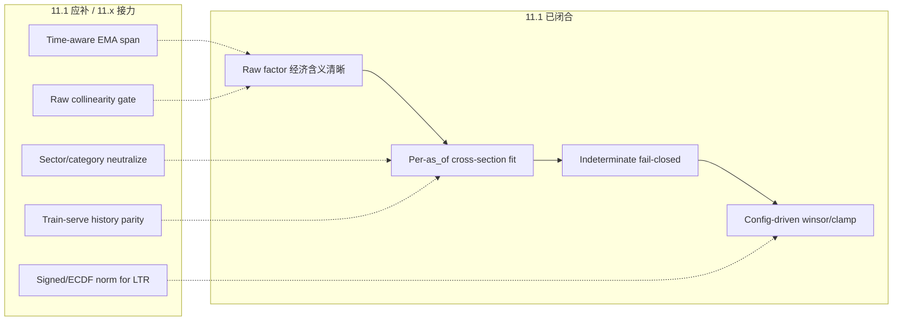

# Phase 11.1 深度审计报告

**结论先行**：Phase 11.1 在**在线因子引擎主路径**上，已基本闭合审计点 #1/#2/#3 的设计意图，架构方向与 Coqueret & Guida / sigc 截面预处理最佳实践一致。但若以「生产级完整闭环 + 最佳实践 + UX 闭环」标准衡量，**尚未满分**——存在若干**语义级算法风险**、**离线/在线 parity 漏洞**、**验收测试缺口**和**前端/运营可观测性未完成项**。

以下按：已闭合 → 方法论对照 → 遗漏/风险 → UX → 明确不算缺口（后续 phase）→ 优先级建议 组织。

---

## 1. 总体判定矩阵

| 维度 | 状态 | 说明 |
|------|------|------|
| 审计 #1 默认 3/9 因子 | ✅ 已闭合 | `FactorsConfig::default()` 启用 `FactorFamily::ALL_GENERIC`（8 族 ≥12 因子） |
| 审计 #2 动量≡收益共线 | ⚠️ 部分闭合 | 删除 `ts.momentum_{W}`，4 个独立估计量；缺**默认因子集 raw 共线验收** |
| 审计 #3 手调 logistic + 静默 0.5 | ✅ 在线主路径闭合 | config 驱动 `WinsorizedZScore/Rank/MinMax`；小截面 → `Indeterminate` |
| 两阶段引擎 | ✅ | raw → cross-section fit/apply，PIT 同 `as_of` batch |
| 持久化 + scorer + report | ✅ 核心闭合 | PG 可空 `normalized_score` + reason；scorer 零贡献 |
| 共线 analyzer + API | ✅ | Spearman + `GET /research/factors/collinearity` |
| 前端研究闭环 | ⚠️ 部分 | 页面/API/types/locale 已有；**路由/menu 未在 repo 内找到注册** |
| 验收测试 §8 | ⚠️ 约 5/8 | 19 个 acceptance 全绿，但缺 z-score 截面统计、默认集共线、HistoricalQuantile |
| 训练-服务 parity | ⚠️ | `materialize_cross_section` 未接 history（11.6 主责，但影响可选策略） |

---

## 2. 已正确落地的核心架构（值得保留）

### 2.1 截面归一化契约 — 符合行业最佳实践

文献与工业惯例（[mlfactor Ch.4](https://www.mlfactor.com/Data.html)、[sigc cross-sectional operators](https://docs.skelfresearch.com/sigc/operators/cross-sectional/)、近期 factor investing 论文）共识：

1. **逐 as_of 截面** winsorize → z-score（或 rank）
2. **禁止全样本统计**（look-ahead）
3. **小样本 fail-closed**，不伪造中性值

实现与之一致：

```342:374:crates/quant-pivot-research/src/factors/computer.rs
fn normalize_one_factor(
    normalizer: &dyn CrossSectionalNormalizer,
    column: &RawFactorColumn,
    cross_section: &FactorCrossSectionConfig,
    history: &FactorHistory,
) -> Vec<NormalizedFactor> {
    // ...
    match cross_section.small_cross_section_policy {
        SmallCrossSectionPolicy::Indeterminate => {
            indeterminate_present(column, FactorIndeterminateReason::CrossSectionTooSmall)
        }
        SmallCrossSectionPolicy::HistoricalQuantile => { /* fit history, apply today */ }
    }
}
```

WinsorizedZScore 流程：**fit 阶段求 winsor 边界 + mean/std → apply 阶段 winsor → z-score → ±σ clamp → 映射到 `[0,1]` Probability**。这与 plan 和 mlfactor 的 winsor→zscore 顺序一致；映射到 `[0,1]` 是本系统 `Probability` 域选择，LTR 需要的 signed rank 明确留给 11.4。

### 2.2 无静默 0.5 — 因子层真正消除

- `NormalizedFactor::Indeterminate` 替代旧 `neutral()`
- `assemble()` 中 `contributes = scored && !below_confidence_floor`
- CH 只 emit scored 行；indeterminate 权威记录在 PG
- Scorer：`normalized_score().map_or(ZERO, ...)`，confidence mass 只累加 `is_scored()`

`FactorRequiresBatch` 已死（error crate 残留，无 call site）——设计转向正确。

### 2.3 动量族语义解耦 — 12-1 思想正确

`lag_skipped_roc` 用 `(t-W)` 到 `(t-L)` 的价格，排除最近 `L` 秒反转段，符合 classic 12-1 momentum（[Alpha Architect](https://alphaarchitect.com/momentum-everywhere-including-in-factors/)、[sigc price momentum](https://docs.skelfresearch.com/sigc/strategies/momentum/price-momentum/)）：

```125:144:crates/quant-pivot-research/src/features/timeseries.rs
/// Lag-skipped rate of change over `[t - window, t - lag]`.
fn lag_skipped_roc(...) -> Option<Decimal> {
    let full = mids(window, window_secs);
    let recent = mids(window, lag_secs);
    let base = *full.first()?;
    let at_lag = *recent.first()?;
    stats::rate_of_change(base, at_lag)
}
```

单元测试 `momentum_roc_not_equal_simple_return` 通过。

### 2.4 配置 schema v12 + 持久化 + API + UI 骨架

- `RUNTIME_CONFIG_SCHEMA_VERSION = 12`，`MomentumFeaturesConfig` 替代 `momentum_windows_secs`
- PG：`normalized_score`/`normalization_source`/`indeterminate_reason` 可空
- `FactorBreakdownEntry` 透传 source/reason
- 因子目录 drawer、共线热力图 drawer、recommendation breakdown 徽章均已实现

---

## 3. 关键遗漏、潜在 Bug 与风险

### 🔴 P0 — 算法语义 / 正确性

#### 3.1 EMA/MACD 把「秒」当「点数 span」——最危险的语义 bug

```103:107:crates/quant-pivot-research/src/features/stats.rs
/// The exponential moving average series of `series` with the given span (in
/// points). `alpha = 2 / (span + 1)`; seeded with the first observation.
pub fn ema_series(series: &[Decimal], span_points: u64) -> Option<Vec<Decimal>>
```

但调用侧传入的是 `momentum.ema_fast_secs`（配置名是秒）：

```69:73:crates/quant-pivot-research/src/features/timeseries.rs
stats::ema_slope(&mids(window, *secs), momentum.ema_fast_secs),
```

**问题**：`mids(window, 900s)` 返回的是**窗口内实际 bucket 数量**（稀疏时可能只有几十个点），而 EMA span 被设为 300/900 **点**。只有当 bucket 严格 1Hz 且窗口内恰好 900 个点时，`ema_fast_secs=300` 才等价于 300 秒。

**影响**：`ts.ema_slope_*`、`ts.macd_norm` 的平滑程度与配置标签不符；operator 调 `ema_fast_secs` 不会产生预期行为。这是**语义欺诈**级别的 bug，比「缺测试」更严重。

**建议**：要么 span 按「目标时间 / 平均 bucket 间隔」换算；要么 rename config 为 `ema_fast_points` 并文档化 bucket 假设；最好在 `MarketWindowSnapshot` 上提供 `span_for_duration(secs)` helper。

#### 3.2 `ema_slope_{W}` 与 EMA 窗口 W 解耦

Plan §3.1：`EMA(W)` 的斜率。实现是「W 秒价格序列 + 固定 `ema_fast_secs` span」，两者独立。默认 `slope_windows=[900]`, `ema_fast=300`，语义是「900s 窗口上的 300-point EMA 斜率」，不是「900s EMA 斜率」。

#### 3.3 MACD 公式与 plan 不一致

- Plan：`(EMA_fast - EMA_slow) / realized_vol`
- 代码：`((fast - slow) / slow) / vol`（相对 MACD 再 vol 归一）

scale-invariant 有其道理，但与 spec/文档不对齐，训练-解释-复现会出问题。

#### 3.4 `momentum_vol_adjusted` 仍可能与 `ts.return_{W}` 高相关

`vol_adjusted_return = simple_return / realized_vol`。截面 vol 稳定时，与 raw return 的 Spearman ρ 仍可很高。Plan §8 要求 `|ρ| < max_correlation` 的**默认集验收**——**不存在**（只有 ROC 不等式单测）。

---

### 🟠 P1 — 闭环 / parity / 可观测性

#### 3.5 离线 replay 未接 `FactorHistory`（HistoricalQuantile 策略下在线≠离线）

```147:148:crates/quant-pivot-core/src/service/historical_replay.rs
let outcomes = engine.compute_all_batch(&kept_vectors, &config.factors)?;
```

在线 `factor_pipeline.rs` 在 `HistoricalQuantile` 时会 `build_history` + `compute_all_batch_with_history`。回测/training dataset 走 replay 路径时，若 operator 切换策略，离线会得到 `CrossSectionTooSmall`/`NoHistory` 而非分位归一化。

默认策略是 `Indeterminate`，所以**默认配置下无感**；但 config 允许切换，这是**隐藏的 train-serve skew**（11.6 主责，11.1 应至少在 acceptance 里覆盖 optional path）。

#### 3.6 Indeterminate 因子仍保留非零 `confidence`

Plan §3.3：scorer 端 `confidence=0`。Scorer 数学上忽略 indeterminate 的 confidence mass，但：

- PG `quant_factor_value.confidence` 仍存 raw feature confidence
- `recommendation-factors.vue` 仍显示该值

**UX 误导**：operator 看到「confidence 85% + indeterminate reason」会困惑。应在 `assemble()` 对 indeterminate/missing 将 confidence 置零，或 UI 对 indeterminate 行显示 `—` 并禁用 confidence 列。

#### 3.7 共线分析用 **normalized_score**，不是 **raw_value**

`research_catalog.rs` pivot 时跳过 `normalized_score = None`，且只用归一化后分数。问题：

1. **审计 #2 的根因是 raw 特征共线**——Rank vs WinsorizedZScore 混用时，归一化后 ρ 可能被人为压低/抬高
2. 小截面 regime 下大量 indeterminate → 样本偏置（只保留「全因子都 scored」的观测）

**最佳实践**：研究 UI 应提供 **raw ρ 与 normalized ρ 双矩阵**，或至少 raw 为主、normalized 为辅。当前只有后者。

#### 3.8 共线 threshold 与 runtime config 脱钩

`factor_governance.rs` 默认 hardcode `0.9`，不读 `factors.orthogonalize.max_correlation`。UI/operator 改 config 后，共线 drawer 仍用 0.9（除非手动 query param）。

#### 3.9 `factors.orthogonalize.neutralize_by` 是死配置

config + UI schema 有字段，research crate **无 OLS 残差实现**。Plan 11.1 只要求 analyzer，neutralize 可视为延后——但 config 已 expose，属于**零死语义**边界上的灰区（字段存在但不 emit 任何行为）。

#### 3.10 多窗口 momentum config 只消费第一个

`generic.rs` 用 `roc_windows_secs.first()` 绑定因子；默认 `[900, 3600]` 意味着 `ts.momentum_roc_3600s` 算了但无因子消费——**算力浪费 + config 语义模糊**。

---

### 🟡 P2 — 测试 / 文档 / 工程卫生

| 缺口 | Plan §8 | 现状 |
|------|---------|------|
| `cross_sectional_zscore_mean_zero_std_one_per_as_of` | 要求 | ❌ 缺失 |
| 默认因子集 collinearity under threshold | 要求（analyzer-only） | ❌ 仅合成 α/β/γ 测试；`collinearity.rs` 注释声称有，实际无 |
| `online_and_backtest_use_same_normalizer` | 要求 | ⚠️ 只有 serial≡rayon，非 online vs replay |
| `HistoricalQuantile` path | 应有 | ❌ 无测试 |
| E2E `model_train_backtest_e2e` | 动量 plane | ❌ 仍只训 `liquidity_depth` |
| `normalization_method` 列 | plan 提过 | 未实现（method 在 definition_json，不在 value 行——可接受，但与 plan 字面有 drift） |
| Clamp audit | 可选 | 内存有，`persistence` 丢弃 |
| `FactorRequiresBatch` | 应删 | 死 variant 残留 |
| Phase README | 说「未进入代码落地」 | 与 11.1 md「已实现」矛盾 |

#### 3.11 `data_quality` raw 层仍有硬编码启发式

归一化层已清干净，但 `generic.rs` 中 `data_quality_confidence`（0.85/0.60/…）、`staleness_penalty` cap 0.5、`missing_penalty * 0.5` 仍是代码常量——不是静默 0.5 normalized score，但仍是**未 config 化的 alpha 启发式**。

---

## 4. UX 与内容闭环审计

### 4.1 已做好的部分

- **因子目录 drawer**：normalization / direction / input_features / quality_gates ✅
- **共线 drawer**：ECharts heatmap + violations 表 + lookback/threshold 元数据 ✅
- **推荐 breakdown**：`normalized_score` 空值占位、`normalization_source` 徽章、indeterminate Tag + Tooltip ✅
- **Runtime config UI schema**：normalization/cross_section/orthogonalize/momentum 字段已在 `schema/ui.rs` ✅
- **Locale**：enum/page json 新增（git untracked）✅

### 4.2 UX 缺口

| 缺口 | 严重度 | 说明 |
|------|--------|------|
| **`source_refs` 列未展示** | 中 | `FactorBreakdownEntry` 有字段，composer 已填充，vue 表格无列 — plan 明确要求 |
| **Indeterminate 时 confidence 仍显示** | 高 | 见 §3.6 |
| **路由/menu 注册未找到** | 高 | `views/research/factors/` 是 untracked 新文件；ui  submodule 内仅 4 个 vue，无 router 配置 — **页面可能无法从菜单到达** |
| **共线 UI 不读 runtime threshold** | 中 | 与 §3.8 联动 |
| **无 raw vs normalized 共线切换** | 中 | 研究 UX 不完整 |
| **recommendation 缺 clamp/winsor 审计** | 低 | `NormalizationClampAudit` 未进 breakdown |
| **weight-map catalog 动量子因子名** | 未验证 | plan todo 项，需确认 runtime-config 编辑器 weight catalog |

---

## 5. 与最佳实践的深层对照（超出 plan 表的思考）



**做得对的**：
- fit/apply 分离 → 为 HistoricalQuantile 和将来 FittedMonotone 预留 seam
- Spearman 共线（rank IC 文献也偏好 rank correlation）
- MinMax 用于语义有界因子（data_quality∈[0,1]）
- PIT batch 不变量（mixed as_of 拒绝）

**与顶级 quant stack 仍有差距的**（部分属后续 phase，部分 11.1 应补）：
1. **Neutralize before/after normalize**（QuantLab/finlab 标准 pipeline）— config 有、代码无
2. **Dual collinearity panel（raw + normalized）** — 11.1 analyzer 交付了 half
3. **Time-native EMA** — 预测市场 bucket 稀疏，seconds≠points 是致命假设
4. **默认集 collinearity CI lint** — plan 写了但没落地，comment 还虚假声称已有

---

## 6. 明确不算「未闭环」的项（已在 §10 延后）

这些**不应**计为 11.1 未完成：

- `FittedMonotone` + `CalibrationArtifactId` → 11.3
- `RankCentered` / `Uniformize` → 11.4
- 共线 **hard publish-gate** → 11.5
- HistoricalQuantile **PIT 离线一致性**完整验证 → 11.6
- 领域/垂直因子 → 11.2
- 学习 winsor_p / 因子权重 → 11.4

---

## 7. 优先级修复建议（按 ROI 排序）

| 优先级 | 项 | 理由 |
|--------|-----|------|
| **P0** | 修复 EMA span 秒↔点语义 | 直接影响 `ema_slope`/`macd` 信号正确性 |
| **P0** | 补默认因子集 raw Spearman 验收测试 | 闭合审计 #2 的可证伪性 |
| **P1** | Indeterminate 时 confidence 置零或 UI 隐藏 | 运营闭环、防误导 |
| **P1** | 共线 API：读 runtime `max_correlation` + 支持 raw panel | 研究 UX 与 config 一致 |
| **P1** | 确认并补全 UI route/menu 注册 | 否则前端交付不可达 |
| **P1** | `recommendation-factors.vue` 加 `source_refs` 列 | plan 明确要求 |
| **P2** | replay 路径接 `build_history`（当 HistoricalQuantile） | 可选策略下的 parity |
| **P2** | 补 `cross_sectional_zscore_mean_zero_std_one` 测试 | Plan §8 blocker 类测试 |
| **P2** | 文档同步（Phase README v12、phase-03 旧 contract、MACD 公式） | 防团队认知分裂 |
| **P3** | 删 `FactorRequiresBatch`；persist clamp audit；多窗口因子 or 文档化 first-only | 工程卫生 |

---

## 8. 最终 verdict

> **Phase 11.1 在「在线因子引擎 + 无静默中性 + config 化截面归一化 + 动量解耦方向」上，已达到可合并、可运行的生产级重构水准，审计 #1/#3 可判闭合，#2 方向正确但证据链不完整。**
>
> **尚不能称为「最佳实践完整闭环」**：EMA 时间语义 bug、默认集共线未验收、离线 history parity 漏洞、共线分析方法论偏 normalized-only、以及前端 route/source_refs/confidence UX 缺口，意味着 operator 和研究员仍可能在「看起来闭环、实际有 skew」的状态下做决策。

若你希望，我可以按 P0→P1 顺序直接开修（EMA span 修正 + acceptance 补全 + indeterminate confidence + UI route/source_refs 是最小 high-impact 批次）。