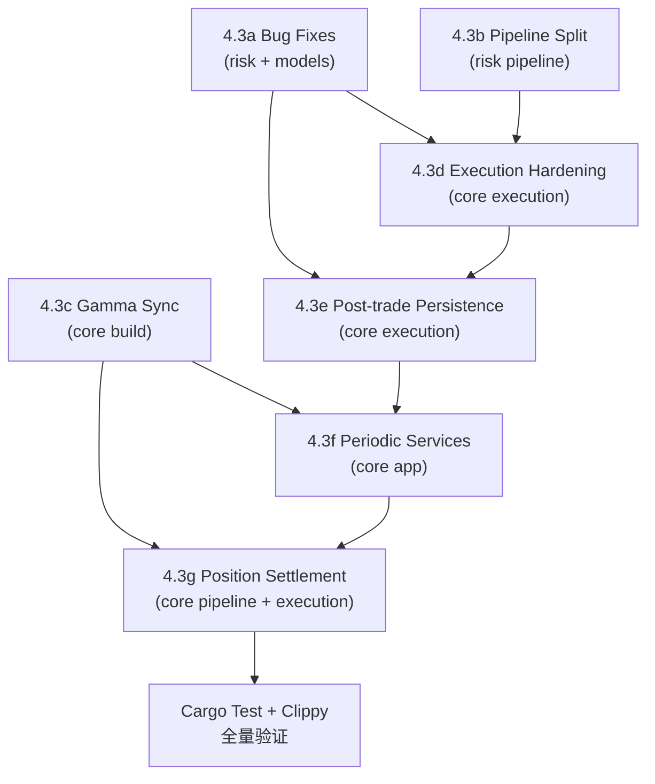

# Phase 4.3 — Production Hardening 总览

> **状态**: 待审核
>
> **日期**: 2026-05-27
>
> **依赖**: Phase 4.1 (`oxide-arb-risk`) + Phase 4.2 (`oxide-arb-core`) 已编译通过
>
> **目标**: 修复所有已知 bug、补齐缺失的运行时任务与持久化链路，使系统具备 DryRun/Paper 端到端验证能力并为 Live 模式做好准备

---

## 子计划索引

Phase 4.3 拆分为 7 个独立可落地的子计划，按依赖拓扑排序：

| 序号 | 文件 | 范围 | 预估变更量 |
|------|------|------|-----------|
| A | `phase4.3a-bug-fixes.md` | P0 bug 修复：breaker level、PotentialLoss、neg_risk、snapshot emergency、BreakerRecovered 审计 | ~150 行改动 |
| B | `phase4.3b-risk-pipeline-split.md` | PHASE1_GATE_COUNT → `requires_metrics()` 自动分割 | ~80 行改动 |
| C | `phase4.3c-gamma-sync.md` | GammaService 启动同步 + 周期 spawn（整个检测链路的前置条件） | ~120 行改动 |
| D | `phase4.3d-execution-hardening.md` | Live 超时、Fee 统一计算、Paper depth、FSM auto-recovery、TradeId UUID v7 | ~200 行改动 |
| E | `phase4.3e-post-trade-persistence.md` | Trade DB 写入、Lifecycle Events 持久化、ClickHouse Opportunity Audit、AlertDispatcher 接入 | ~250 行改动 |
| F | `phase4.3f-periodic-services.md` | queue_periodic_services：Risk tick、Exposure GC、WalletBalance、Calibration、Reconciliation | ~180 行改动 |
| G | `phase4.3g-position-settlement.md` | Settlement 事件接入（含 VotingOracle resolution）、Position lifecycle 闭环、Potential Loss resolve | ~200 行改动 |

**延后到 Phase 4.4**:
- ClickHouse OpportunityAudit 批量写入（`AsyncWriter<OpportunityAuditRow>` 构造 + spawn）
- 完整多阶段 Lifecycle Event audit trail（从 detected → validated → dispatched → filled/missed → settled）
- 精确结算逻辑（VotingOracle resolution outcome 确定 payout 方向）

---

## 依赖拓扑

**推荐执行顺序**: A → B → C → D → E → F → G

每个子计划落地后执行 `cargo build --workspace && cargo clippy --workspace -- -D warnings && cargo test --workspace` 验证。

**re-export 清除** 穿插在每个涉及的子计划中执行 — 当修改某个文件的 import 时顺手清除该文件用到的 re-export 路径，改为显式模块路径。最终在 G 完成后做一次全量 grep 确认 workspace 内无 convenience re-export。

---

## 已确认决策

| 议题 | 决策 |
|------|------|
| BUG-1 breaker level | Weekly → `System` halt；single-loss 保持 `Daily` |
| Fee 计算 | **始终**用 `FeeCalculator(filled_shares, avg_fill_price)` 计算，忽略 CLOB resp.fee_paid |
| TradeId | UUID v7 独立生成，通过 `opportunity_id` 字段关联 |
| Paper mode | 检查 book 深度：够则 fill、否则 miss（不模拟 slippage） |
| PHASE1_GATE_COUNT | `RiskCheck` trait 加 `requires_metrics() -> bool`，pipeline 自动分割 |
| Bloom FP | 保持 bloom 初筛 + DashMap exact fallback（已实现，无需改动） |
| Settlement 策略 | Fill + Settlement 立即连续调用；市场 resolve 后通过 reconciliation 修正 |
| PostTradeInput::is_miss | 只匹配 `TradeOutcome::Miss`（正确行为，API 错误不触发 auto-blacklist） |

---

## 需要删除/合并的代码汇总

### 删除文件

| 文件 | 原因 | 所属子计划 |
|------|------|-----------|
| `oxide-arb-core/src/execution/types.rs` | 空文件（仅 2 行注释占位），无任何类型定义 | D |

**同步删除** `execution/mod.rs` 中的 `pub mod types;` 声明。

### 删除代码

| 文件/位置 | 删除内容 | 原因 | 所属子计划 |
|-----------|----------|------|-----------|
| `oxide-arb-risk/src/engine.rs` L61 | `const PHASE1_GATE_COUNT: usize = 4;` | 被 `pipeline.metrics_split_index()` 替代 | B |
| `oxide-arb-risk/src/engine.rs` L123, L136 | 两处 `PHASE1_GATE_COUNT` 引用 | 同上，替换为 `self.pipeline.metrics_split_index()` | B |

### 需要清除的 re-export

**零容忍 re-export 政策**: 以下 `pub use` 需要评估是否为 convenience re-export（违反）还是 type alias（允许）：

| 文件 | re-export | 判定 | 处理 |
|------|-----------|------|------|
| `bridge/mod.rs` L10 | `pub use fee_estimator::CoreFeeEstimator;` | **convenience re-export** — 调用方应使用 `bridge::fee_estimator::CoreFeeEstimator` | **删除**, 更新 `app/mod.rs` + `app/build.rs` + `detection/scanner.rs` 中的 import 路径 |
| `bridge/mod.rs` L11 | `pub use oxide_arb_algorithm::pipeline::OpportunityPipeline;` | **跨 crate re-export** — `oxide_arb_core::bridge` 不应 re-export `oxide_arb_algorithm` 的类型 | **删除**, 调用方直接 `use oxide_arb_algorithm::pipeline::OpportunityPipeline` |
| `bridge/mod.rs` L14 | `pub type CoreOpportunityPipeline = OpportunityPipeline<CoreFeeEstimator>;` | **type alias** — 合法（不是 re-export，是新类型定义） | **保留** |
| `pipeline/mod.rs` L11-18 | 8 个 `pub use` (BookStore, OrderBook, etc.) | **convenience re-export** — 每个类型有明确的子模块路径 | **删除全部**, 更新所有 `use crate::pipeline::BookStore` → `use crate::pipeline::book_store::BookStore` |
| `app/mod.rs` L312 | `pub use task_registry::AppRunner;` | **convenience re-export** | **删除**, 更新 `bootstrap.rs` 的 import |

### 字段语义变更（不删除但行为变化）

| 字段 | 变更 | 所属子计划 |
|------|------|-----------|
| `ExecutionOutcome::Filled::fee_paid` | 值始终来自 `FeeCalculator`，不再来自 CLOB response | D |
| `OrderResponse::fee_paid` | 保留但 `map_order_response` 不再读取 | D |

### 签名变更（需要更新所有调用方）

| 函数/struct | 变更 | 所属子计划 |
|-------------|------|-----------|
| `PostTradeInput` | +`shares: Shares`, +`entry_price: Price` | A |
| `PostTradeJob` | +`opportunity_id`, +`event_id`, +`execution_id`, +`side`, +`filled_shares`, +`execution_mode`, +`edge_bps`, +`detected_profit` | E |
| `PlanBuilder::new` | +`market_registry: Arc<MarketRegistry>` | A |
| `Dispatcher::new` | +`book_store: Option<Arc<BookStore>>`, +`fee_calculator: Arc<FeeCalculator>` | D |
| `OrderStrategy::new` | +`fee_calculator: Arc<FeeCalculator>`, +`dispatcher_timeout_ms: u64` | D |
| `map_order_response` | +`fee_calculator: &FeeCalculator`, +`category: MarketCategory`, +`token_id: &TokenId` | D |
| `ExecutionPlan` | +`category: MarketCategory` | D |
| `DataPipelineDeps` | +`settlement_tx: flume::Sender<MarketId>` | G |
| `spawn_outcome_drain` | +`trade_repo`, +`lifecycle_repo`, +`position_repo`, +`potential_loss_repo`, +`alerts` | E+G |
| `RiskEngine` struct | +`last_emergency: RwLock<Option<(DateTime<Utc>, String)>>` | A |

### Stub 文件（当前为空壳，需要在对应子计划中实现或删除）

| 文件 | 现状 | 处理 | 所属子计划 |
|------|------|------|-----------|
| `observability/report_generator.rs` | 两个方法都是 `tracing::info!("not yet implemented")` | **保留文件**但标记为 Phase 4.4 实施；当前不删除以免破坏编译 | 延后 |
