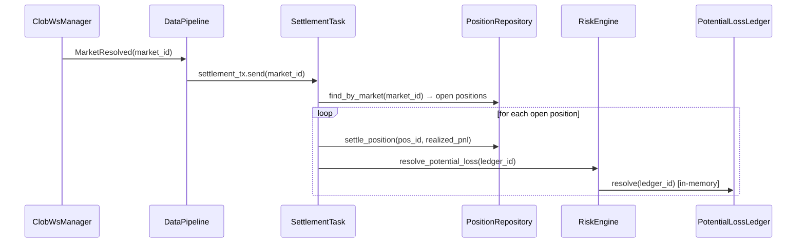

# Phase 4.3g — Position Lifecycle & Settlement Event

> **状态**: 待实施
>
> **前置**: 4.3c (GammaService), 4.3e (Trade persistence), 4.3f (Periodic services)
>
> **影响 crate**: `oxide-arb-core`, `oxide-arb-risk`

---

## 问题总览

三个关键 lifecycle 断点导致 position 和 potential loss 不闭环：

1. **Settlement 事件未接入** — `DataPipeline` 收到 `MarketResolved` WS event 时仅 log，不做任何 position/potential-loss 处理
2. **Position Lifecycle 不闭环** — Fill 时不创建 position record；settle 时无 close/settle 调用
3. **Potential Loss resolve** — Fill 时记入 `PotentialLossLedger`（在 risk engine 内），但 settle 时仅在 risk 内 resolve，不通知 DB 的 `PotentialLossRepository`

---

## 1. Fill 后创建 Position

### 现状

`process_post_trade_job` 写 trade 到 DB、做 risk accounting，但不创建 position。`PositionRepository::create()` 从未被调用。

### 方案

在 `process_post_trade_job` 中，对 `TradeOutcome::Success` (fill)，创建 position 记录：

```rust
if trade_outcome == TradeOutcome::Success {
    let new_position = NewPosition {
        market_id: job.market_id.clone(),
        token_id: job.token_id.clone(),
        trade_id: job.trade_id.clone(),
        side: job.side,
        shares: job.filled_shares,
        entry_price: job.entry_price,
        cost_usd: cost,
        status: PositionStatus::Open,
    };

    match position_repo.create(new_position).await {
        Ok(pos) => {
            tracing::debug!(position_id = %pos.position_id, "position opened");
            // Refresh risk metrics position cache so next pre_trade_check sees updated counts
            risk_engine.refresh_positions(risk_metrics);
        }
        Err(e) => {
            tracing::error!(%e, "position creation failed");
            // non-fatal for risk accounting, but log prominently
        }
    }
}
```

**`spawn_outcome_drain`** 签名增加 `position_repo: Arc<dyn PositionRepository>`。

---

## 2. Market Resolve 事件处理

### 现状

`DataPipeline` 收到 `PipelineEvent::MarketResolved` 时（L183-187）：

```rust
PipelineEvent::MarketResolved { market_id, .. } => {
    let known = self.market_registry.get_market(&market_id).is_some();
    tracing::info!(%market_id, known, "Market resolved via WS");
    self.metrics.markets_resolved_ws.inc();
}
```

仅 log + metric，不做 position settlement。

### 方案

增加一个 settlement channel + settlement task：

#### 2a. Settlement Channel

```rust
// In DataPipelineDeps
pub settlement_tx: flume::Sender<MarketId>,
```

在 `MarketResolved` 处理中发送：

```rust
PipelineEvent::MarketResolved { market_id, .. } => {
    tracing::info!(%market_id, "market resolved via WS — scheduling settlement");
    self.metrics.markets_resolved_ws.inc();

    if let Err(e) = self.settlement_tx.try_send(market_id.clone()) {
        tracing::error!(%e, %market_id, "settlement channel full — market resolve lost");
    }
}
```

#### 2b. Settlement Task

新文件: `oxide-arb-core/src/execution/settlement_task.rs`

```rust
pub struct SettlementTask {
    rx: flume::Receiver<MarketId>,
    risk_engine: Arc<RiskEngine>,
    risk_metrics: Arc<CoreRiskMetrics>,
    position_repo: Arc<dyn PositionRepository>,
    potential_loss_repo: Arc<dyn PotentialLossRepository>,
    voting_oracle: Arc<VotingOracle>,
    market_registry: Arc<MarketRegistry>,
    shutdown: CancellationToken,
}

impl SettlementTask {
    pub async fn run(self) -> Result<(), OxideError> {
        loop {
            tokio::select! {
                () = self.shutdown.cancelled() => return Ok(()),
                market_id = self.rx.recv_async() => {
                    match market_id {
                        Ok(market_id) => self.settle_market(&market_id).await,
                        Err(_) => return Ok(()),
                    }
                }
            }
        }
    }

    async fn settle_market(&self, market_id: &MarketId) {
        // 1. Find open positions for this market
        let positions = match self.position_repo.find_by_market(market_id).await {
            Ok(p) => p,
            Err(e) => {
                tracing::error!(%e, %market_id, "failed to load positions for settlement");
                return;
            }
        };

        let open_positions: Vec<_> = positions.iter()
            .filter(|p| p.status == PositionStatus::Open)
            .collect();

        if open_positions.is_empty() {
            tracing::debug!(%market_id, "no open positions for resolved market");
            return;
        }

        // 2. Query resolution outcome via VotingOracle
        let resolution = match self.voting_oracle.resolve(market_id).await {
            Ok(Some(outcome)) => outcome,
            Ok(None) => {
                tracing::warn!(%market_id, "MarketResolved received but oracle has no outcome yet — deferring");
                return; // retry on next periodic reconcile or next WS event
            }
            Err(e) => {
                tracing::error!(%e, %market_id, "failed to query resolution outcome");
                return;
            }
        };

        // 3. For each open position, compute realized PnL and settle
        for pos in &open_positions {
            // Endgame: we bought token at entry_price, payout is $1 if resolution matches our side, $0 otherwise
            let payout_per_share = if resolution.winning_side == pos.side {
                Decimal::ONE // correct prediction → $1/share
            } else {
                Decimal::ZERO // wrong prediction → $0/share
            };
            let realized_pnl = pos.shares.inner() * payout_per_share - pos.cost_usd.inner();

            if let Err(e) = self.position_repo.settle_position(&pos.position_id, realized_pnl).await {
                tracing::error!(%e, position_id = %pos.position_id, "position settlement failed");
                continue;
            }

            // 3. Resolve corresponding potential loss entry
            let ledger_id = LedgerId::new(pos.trade_id.as_str());
            if let Err(e) = self.risk_engine.resolve_potential_loss(&ledger_id, self.risk_metrics.as_ref()).await {
                tracing::error!(%e, %ledger_id, "potential loss resolve failed");
            }
        }

        // 4. Remove resolved market from book store and registry
        // (optional — market may naturally go inactive via next Gamma sync)

        tracing::info!(
            %market_id,
            positions = open_positions.len(),
            "market settlement complete"
        );
    }
}
```

#### 2c. Register settlement task

新增 `TaskId` variant（或复用 `PotentialLossEscalation`）：

在 `AppContext` 中 spawn：

```rust
fn queue_settlement_task(&self) {
    // ... construct SettlementTask ...
    self.pending_tasks.push(TaskId::PotentialLossEscalation, move |shutdown| async move {
        if let Err(e) = task.run().await {
            tracing::error!(%e, "settlement task exited with error");
        }
    });
}
```

---

## 3. Potential Loss DB 同步

### 现状

- **Fill**: `RiskEngine::apply_fill()` 向内存 `PotentialLossLedger` 写入 entry → 正确
- **Settlement**: `RiskEngine::apply_settlement()` 在内存中 resolve → 正确
- **但**: `PotentialLossRepository` (PG) 从未被用于创建/更新 entries

`CorePotentialLossStore` 已实现但 **仅在 builder startup 时用于加载 active entries**，运行时不写入。

### 方案

在 `process_post_trade_job` 的 fill 成功后，也写 PG：

```rust
// After risk_engine.on_trade_result(Fill, ...) succeeds:
if trade_outcome == TradeOutcome::Success {
    let pl_entry = NewPotentialLoss {
        ledger_id: LedgerId::new(job.trade_id.as_str()),
        market_id: job.market_id.clone(),
        token_id: job.token_id.clone(),
        shares: job.filled_shares,
        entry_price: job.entry_price,
        max_loss_usd: cost + fee,
        status: LedgerStatus::Active,
    };
    if let Err(e) = potential_loss_repo.create(pl_entry).await {
        tracing::error!(%e, "potential loss DB write failed");
    }
}
```

在 `SettlementTask::settle_market` 中 resolve 后更新 PG status：

```rust
// After risk_engine.resolve_potential_loss succeeds:
potential_loss_repo.update_status(&ledger_id, LedgerStatus::Resolved).await;
```

**`spawn_outcome_drain`** 签名增加 `potential_loss_repo: Arc<dyn PotentialLossRepository>`。

---

## 4. 完整 Position Settlement 数据流



---

## 5. 已知限制与后续 TODO

1. **VotingOracle 可用性**: `VotingOracle::resolve()` 需要返回 `ResolutionOutcome { winning_side: Side }`。当前 `VotingOracle` 已有 Gamma + CTF 源（`oxide-arb-api/src/oracle/`），需确认 `resolve(market_id)` 方法签名是否已支持返回 winning side。如果只返回 "resolved: bool" 而没有 winning side，需要扩展。

2. **Partial settlements**: Polymarket 可能分阶段 resolve（rare）。当前实现对 `MarketResolved` 做一次性全量 settle。

3. **ClickHouse audit**: settlement 完成后应写 audit row 到 ClickHouse — 延迟到 Phase 4.4。

4. **Deferred resolution**: 如果 `VotingOracle` 在 `MarketResolved` 时还没有 outcome（oracle 延迟），当前实现跳过并等待下次 reconciliation。需要确保 `LedgerReconcile` 周期任务能补偿这些 deferred settlement。

---

## 数据模型依赖

| 类型 | 位置 | 状态 |
|------|------|------|
| `NewPosition` | `oxide-arb-models/src/domain/position.rs` | 已存在 |
| `PositionStatus::Open/Closed/Settled` | `oxide-arb-models/src/enums` | 已存在 |
| `PositionRepository::create/settle_position` | `oxide-arb-repository/src/traits/position.rs` | 已存在 |
| `PotentialLossRepository::create` | `oxide-arb-repository/src/traits` | 已存在 |
| `LedgerId` | `oxide-arb-models/src/types/ids.rs` | 已存在 |

---

## 测试

| 场景 | 测试 |
|------|------|
| Fill → position created in DB | `tests/execution_integration.rs` — verify `position_repo.find_by_market()` returns Open |
| MarketResolved → position settled | new `tests/settlement_integration.rs` — emit MarketResolved → verify position status = Settled |
| MarketResolved → potential loss resolved | same test — verify `risk_engine.potential_loss.active_count() == 0` |
| No open positions → settle is no-op | verify no error on resolve for unknown market |
| Position repo failure → non-fatal | verify settlement continues for other positions |
