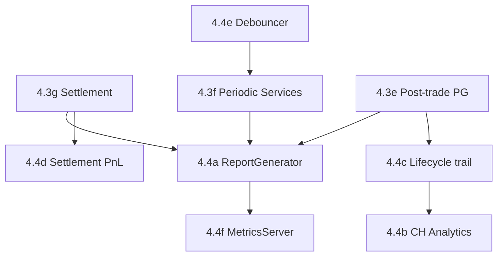

# Phase 4.4 — Reporting, Analytics & Operational Completeness

> **状态**: 待实施
>
> **前置**: Phase 4.3g (Position Settlement), Phase 4.3f (Periodic Services — merged reconcile)
>
> **目标**: 补齐 Phase 4.3 延后项，落地 ReportGenerator 完整链路，形成 检测 → 执行 → 持久化 → 报告 → 告警 闭环

---

## 子模块索引

| 序号 | 范围 | 说明 | 预估变更量 |
|------|------|------|-----------|
| 4.4a | ReportGenerator 周期任务 | Daily/Weekly 报告生成 + Telegram/Webhook 推送 | ~200 行 |
| 4.4b | ClickHouse 分析写入完善 | OpportunityAudit 批量 AsyncWriter 调优、detection→audit→execution 查询模板 | ~100 行 |
| 4.4c | Lifecycle audit trail | outbox_event 驱动的 detected→settled 全链路 CH/PG 审计 | ~250 行 |
| 4.4d | Settlement 精确 payout | VotingOracle outcome → realized PnL 修正 → DailyReport 输入 | ~150 行 |
| 4.4e | RiskStateDebouncer wire | `DebouncedWriter` + `TaskId::RiskStateDebouncer` 落地 | ~80 行 |
| 4.4f | MetricsServer | Prometheus `/metrics` HTTP（oxide-arb-bin） | ~60 行 |

---

## 依赖拓扑



**推荐执行顺序**: 4.4e → 4.4d → 4.4a → 4.4c → 4.4b → 4.4f

---

## 4.4a — ReportGenerator 周期任务

### 现状

`observability/report_generator.rs` 是 stub（`generate_daily` / `generate_weekly` 仅 `tracing::info!`）。
`models::domain::trade::DailyReport` 结构体已定义。
`TaskId::ReportGenerator` 已声明但未 spawn。

### 输入数据源

| `DailyReport` 字段 | 数据来源 |
|---------------------|----------|
| `total_pnl` | PG trades: `sum(net_profit_usd) WHERE outcome = 'success' AND DATE(created_at) = :date` |
| `total_fees_paid` | PG trades: `sum(fee_usd)` |
| `total_gas_paid` | Phase 4.4d — settlement service 写入 gas 字段后可用；初始版本填 `Usd::ZERO` |
| `trade_count` / `success_count` / `miss_count` | PG trades: `COUNT(*)` by outcome |
| `largest_single_loss` / `largest_single_profit` | PG trades: `MIN/MAX(net_profit_usd)` |

### 实现设计

```rust
pub struct ReportGenerator {
    trade_repo: Arc<PgTradeRepository>,
    risk_engine: Arc<RiskEngine>,
    alerts: Arc<AlertDispatcher>,
}

impl ReportGenerator {
    pub async fn generate_daily(&self, date: NaiveDate) -> Result<DailyReport, OxideError> {
        let trades = self.trade_repo.find_by_date(date).await?;
        // aggregate into DailyReport fields...
    }

    pub async fn generate_weekly(&self, week_start: NaiveDate) -> Result<WeeklyReport, OxideError> {
        // 7 x daily aggregation or direct PG query
    }
}
```

### 周期 Spawn

- `TaskId::ReportGenerator`
- 调度策略：`PeriodicTask` + 自定义 next-midnight 计算，Daily UTC 00:05 / Weekly 周一 00:10
- 输出：`AlertDispatcher` Telegram 推送 + 可选 PG `daily_reports` 表持久化

### 需新增

| 项目 | 位置 |
|------|------|
| `TradeRepository::find_by_date(NaiveDate)` | `oxide-arb-repository/src/traits/trade.rs` |
| `DailyReport` PG 表（可选） | `oxide-arb-storage/src/postgres/migration/` |
| `WeeklyReport` 结构体 | `oxide-arb-models/src/domain/trade.rs` |
| `report_generator.rs` 重写 | `oxide-arb-core/src/observability/` |
| `queue_report_generator()` | `oxide-arb-core/src/app/periodic_services.rs` |

---

## 4.4b — ClickHouse 分析写入完善

### 现状

`AsyncWriter<OpportunityAuditRow>` 和 `AsyncWriter<OpportunityDetectionRow>` 已在 `PersistenceBundle` 中 wire。

### 待优化

| 项目 | 说明 |
|------|------|
| 批量参数调优 | `batch_size` / `flush_interval` 基于 Live 模式 throughput 调参 |
| 查询模板 | detection → audit → execution 三表 JOIN SQL 供 ops 查询 |
| 写入监控 | `async_writer_dropped` metric 已有；补 `async_writer_flush_duration_ms` histogram |

---

## 4.4c — Lifecycle Audit Trail

### 目标

对任意 `OpportunityId`，可从 ClickHouse/PG 追溯完整生命周期：

```text
detected (DetectionWriter/CH, opportunity_detection table)
  → validated (RiskAuditBatch/PG, risk_decision_audit table)
  → dispatched (ExecutionAuditWriter/CH, opportunity_audit table)
  → filled|missed (PG trades table + outbox_event)
  → settled (4.3g settlement + outbox consumer → position closed)
```

### 实现

| 步骤 | 说明 |
|------|------|
| outbox_event payload schema | 定义 `TradeFilledPayload` / `MarketSettledPayload` JSON schema |
| `OutboxConsumer` 实现 | 首个具体 consumer — 写 CH lifecycle event 行 |
| 查询 API | CH `SELECT * FROM ... WHERE opportunity_id = ? ORDER BY stage` |

### `OutboxConsumer` 首个实现

```rust
pub struct LifecycleAuditConsumer {
    timeseries: Arc<ChTimeseriesRepository>,
}

#[async_trait]
impl OutboxConsumer for LifecycleAuditConsumer {
    fn name(&self) -> &str { "lifecycle-audit" }
    async fn consume(&self, event: &OutboxEventInfo) -> Result<(), OxideError> {
        // parse payload → insert CH lifecycle row
    }
}
```

接入 `PersistenceBundle::wire` 的 `consumers: vec![...]`。

---

## 4.4d — Settlement 精确 Payout

### 现状（Phase 4.3g 完成后）

Fill 时写入 `projected_payout`；market resolve 后 settlement 处理，但 realized PnL 基于 projected。

### 精确逻辑

| 场景 | PnL 计算 |
|------|----------|
| 预测正确（YES resolve, 持有 YES） | `shares * $1.00 - total_cost - fees` |
| 预测错误（NO resolve, 持有 YES） | `-total_cost - fees`（payout = 0） |
| Settlement 后 | `position.realized_pnl = payout - total_cost` |

- `DailyReport.total_pnl` 以 **settled realized PnL** 为准
- 未 settle 的 open position 不计入 daily PnL（保守会计）
- Reconciliation 在 refresh 中检测 drift

---

## 4.4e — RiskStateDebouncer Wire

### 现状

- `DebouncedWriter` 完整实现在 `infra/debounced_writer.rs`
- `TaskId::RiskStatePersist` / `TaskId::RiskStateDebouncer` 已声明
- `RiskEngine::tick()` 在 state change 时同步 persist（变更驱动）

### 补齐

- `DebouncedWriter<UpsertRiskEngineState>` 构造
- 每 60s debounce flush（即使无 tick 触发的 change，也保证最新状态定期写 PG — 灾难恢复安全网）
- 与 tick persist 互补：tick 是变更驱动，debouncer 是时间驱动
- 在 `periodic_services.rs` 注册 `TaskId::RiskStatePersist`

### 冲突避免

两条 persist 路径写同一 PG row（`risk_engine_state` 表）。使用 `updated_at` 列做乐观比较：
- tick persist: `UPDATE ... SET ... WHERE updated_at < :now`
- debouncer: 同样带 `WHERE updated_at < :now`
- 两者不冲突：last-write-wins 且都用同一 `RiskEngine.snapshot()` → 幂等

---

## 4.4f — MetricsServer

### 现状

`MetricsHub` 使用 `prometheus::Registry`，所有 metrics 注册在其中。无 HTTP export。

### 实现

| 项目 | 位置 |
|------|------|
| HTTP server | `oxide-arb-bin/src/main.rs` 或独立 `metrics_server.rs` |
| TaskId | `MetricsServer`（需加回 enum） |
| 绑定 | `0.0.0.0:9090/metrics`，Prometheus text format |
| 依赖 | `hyper` / `axum` minimal HTTP + `prometheus::Encoder::encode` |

```rust
async fn serve_metrics(registry: &Registry, addr: SocketAddr) -> Result<(), OxideError> {
    // axum::Router::new().route("/metrics", get(handler)).serve(addr)
}
```

---

## 验收标准

- [ ] Daily report UTC 00:05 自动生成并推送（4.4a）
- [ ] 任意 `OpportunityId` 可从 CH 追溯 detected → filled → settled（4.4c）
- [ ] `DailyReport.total_pnl` 与 PG settled trades 一致（± reconciliation tolerance）（4.4d）
- [ ] RiskState debounced persist 与 tick persist 不冲突、不丢数据（4.4e）
- [ ] `curl localhost:9090/metrics` 返回 Prometheus 格式（4.4f）
- [ ] `cargo test --workspace` + `cargo clippy --workspace -- -D warnings` 全绿
