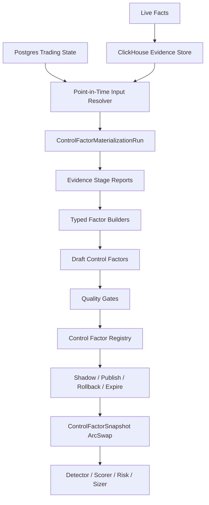
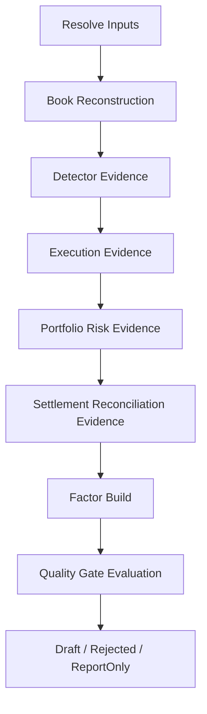
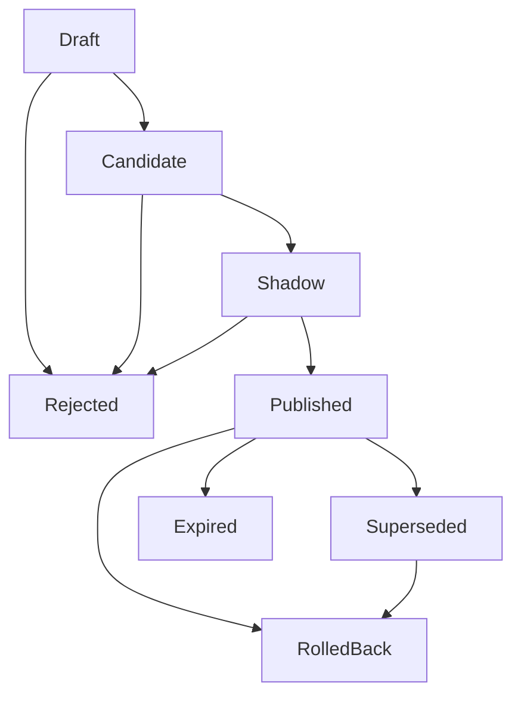

# Phase 5 — Control Factor Materialization & Governance Plane

> **产出**: `oxide-arb-control` evidence engine + control factor materialization runner + factor registry + governance API + live `ControlFactorSnapshot` consumption.
>
> **核心结论**:
>
> - Replay / simulation is an internal evidence engine.
> - Materialization is the production job.
> - Control factors are governed runtime artifacts.
> - Publication state, not replay mode, controls live behavior.
> - UI / API / scheduler operate the control plane; the trading hot path reads only immutable in-memory snapshots.

---

## 子阶段推进索引

Phase 5 已按 Phase 4 的推进方式拆成多个生产级子阶段文件。本文保留为完整母文档和设计依据；实际落地、评审与验收按以下子阶段推进，避免实现过程跑偏或遗漏。

| 子阶段 | 文件 | 主要责任 | 覆盖本文章节 |
|---|---|---|---|
| Phase 5.0 | [`phase5.0-control-plane-foundation.md`](./phase5.0-control-plane-foundation.md) | 架构契约、不变量、crate 边界、artifact 模型、破坏式变更原则 | 0, 1, 3, 4, 8.2, 8.5, 9.4, 20 |
| Phase 5.1 | [`phase5.1-fact-data-plane.md`](./phase5.1-fact-data-plane.md) | CH/PG facts、schema、writer、repository、migration | 2, 10.6, 11, 15.1, 15.2, 18.1 |
| Phase 5.2 | [`phase5.2-pit-materialization-runner.md`](./phase5.2-pit-materialization-runner.md) | PIT resolver、materialization manifest、run 状态机、幂等、错误码 | 1.3, 5, 6.1, 15.1.1, 18.2, 18.3 |
| Phase 5.3 | [`phase5.3-evidence-engine.md`](./phase5.3-evidence-engine.md) | book/detector/execution/portfolio/settlement/reconciliation evidence | 6.2-6.6, 9.2, 18.4 |
| Phase 5.4 | [`phase5.4-factor-builders-quality-gates.md`](./phase5.4-factor-builders-quality-gates.md) | 五类 typed factor builders、统计物化、quality gates、shadow readiness | 7, 8, 9, 13, 18.5 |
| Phase 5.5 | [`phase5.5-registry-governance-api-scheduler.md`](./phase5.5-registry-governance-api-scheduler.md) | registry、publication、audit、API、RBAC、scheduler | 14, 15.3, 16, 18.6, 18.7 |
| Phase 5.6 | [`phase5.6-live-consumption.md`](./phase5.6-live-consumption.md) | `ControlFactorSnapshot`、live refresher、detector/scorer/risk/sizer 接入、shadow delta | 10.1-10.5, 10.7, 10.8, 17, 18.8 |
| Phase 5.8 | [`phase5.8-verification-operations.md`](./phase5.8-verification-operations.md) | 退出条件、测试矩阵、观测、runbooks、防漂移审查 | 18, 19 |

推进规则：

1. 每个子阶段都必须满足自己的退出条件，不能以 stub 进入下一阶段。
2. 本文中的所有原始设计点都必须能在上表中找到归属；如果实现新增边界或改变语义，必须同步更新对应子阶段文件。
3. 任何 compatibility re-export、旧 replay alias、hot path CH/PG query、current-state replay、自动风险扩张，均视为 Phase 5 设计违规。

---

## 0. 建设目标

Phase 5 不再设计成“Replay Analytics 报告系统”。它是 **Control Factor Materialization & Governance Plane**：把 live 系统持续写下来的历史事实，按 point-in-time 规则重建证据，物化为可审计、可过期、可 shadow、可发布、可回滚的控制因子，再通过内存快照进入 detector、scorer、risk、sizer。

这个模块解决的是当前系统的反馈闭环缺口：

1. 历史成交、miss、risk denial、settlement、reconciliation 没有稳定反哺 live 决策。
2. detector 复现正确不代表真实 FOK 能成交；成交也不代表组合风险长期可持续。
3. 当前 CH / PG 事实不完整，无法证明“为什么这个 bucket、盘口、市场、组合状态以后应该降权或拒绝”。
4. 旧 mutable key-value `runtime_config` 无法提供 PIT、完整版本、activation history、rollback lineage 和 canonical hash；Phase 5 必须改为 `runtime_config_version` + `runtime_config_activation`。
5. live hot path 不能查 ClickHouse / Postgres，所以必须把离线证据物化为可原子替换的内存快照。

### 0.1 非目标

- 不提供用户可见 `ReplayMode`。
- 不提供 `DetectorOnly` / `Execution` / `PortfolioRisk` / `Diagnostic` 等产品模式。
- 不把 CLI 作为主入口。
- 不把复杂 factor payload 塞进 runtime config document；旧 mutable key-value `runtime_config` 必须删除。
- 不设计一个吞掉所有语义的“总控因子”。
- 不允许 live hot path 同步查询 ClickHouse 或 Postgres。
- 不为了旧草案保留兼容 alias、re-export 或旧类型名。

### 0.2 系统形态



### 0.3 生产验收目标

Phase 5 完成时，系统必须做到：

- 可从 ClickHouse + Postgres point-in-time 数据重建 endgame 机会的 market context、YES/NO L2 book、calibration state、fee schedule、risk/accounting context。
- 可按固定 stage graph 生成 detector / execution / portfolio / settlement / reconciliation evidence。
- 可生成五类 typed control factor draft，并附带完整 evidence、coverage、sample、confidence interval、tail risk、config hash、code sha。
- 可通过 quality gates 将 Draft 推进为 Candidate，或带原因 Rejected / ReportOnly。
- 可将 Candidate 进入 Shadow，记录 would-reject / would-size / would-score，不改变真实交易。
- 可发布 `Published` control factor publication，并由 live refresher 构建 `ArcSwap<ControlFactorSnapshot>`。
- 可在 TTL 到期、publication rollback、factor schema mismatch、snapshot stale 时按类型 fail neutral 或 fail closed。
- 所有 materialization、approval、publication、rollback、runtime config activation 都有不可变 audit event。

---

## 1. 生产不变量

### 1.1 领域不变量

- `MarketId` 是 Polymarket `condition_id`；`TokenId` 是 CLOB token id。L2 ticks / books 按 `TokenId` 存储，market-level factor 必须通过 PG market mapping 解析 YES/NO token pair。
- Money / price / shares 计算层必须使用 `Decimal` 或现有 newtypes：`Usd`、`Shares`、`Price`、`MicroUsd`、`MicroShares`、`MicroPrice`。CH row 边界可为压缩和查询使用 primitive，但 evidence / factor builder 不能裸用 `f64` 表达业务不变量。
- Endgame 策略当前是 settlement directional bet；默认 hold-to-resolution。任何主动 exit / stop-loss 设计必须作为单独产品决策，不隐含在 control factor 中。
- 自动控制因子只能收紧风险：所有 multiplier 默认必须在 `0..=1`；降低 edge、放大 budget、放大 Kelly、提高 max positions 必须人工审批并审计。

### 1.2 数据面与控制面

| 层 | 角色 | 约束 |
|---|---|---|
| ClickHouse | 高容量事实库与物化输入 | append-only / replacing 型；不作为 live 决策系统 |
| Postgres 交易状态 | trade、position、risk、settlement、reconciliation 权威 | 物化时做 point-in-time join；hot path 不每笔查询 |
| Postgres 控制 registry | factor value、publication、audit、runtime config version / activation 权威 | 所有状态转换可审计、可回滚 |
| 内存快照 | live `ControlFactorSnapshot` | `ArcSwap` 原子替换，hot path 只读 |

### 1.3 Point-in-Time 正确性

Materialization 不允许用今天的状态解释过去。每个 evidence stage 必须按事件时间读取当时可见的数据：

- market / event metadata。
- YES / NO token mapping。
- fee schedule。
- calibration snapshot。
- runtime config version。
- risk state / accounting snapshot。
- balance and token balances。
- settlement truth and reconciliation status。

Scheduled materialization 必须配置 `source_delay`，默认窗口为：

```text
[trigger_time - source_delay - interval, trigger_time - source_delay)
```

这避免刚发生但尚未完整落库的事件污染 evidence。

### 1.4 失败语义

| 场景 | 结果 |
|---|---|
| 缺 L2 / book snapshot，但目标 factor 依赖 execution evidence | 不生成生产级 factor，stage `InsufficientCoverage` |
| 缺 settlement truth，但目标 factor 依赖 outcome | 保持 `ReportOnly` / `Draft`，不能 Candidate |
| 缺 point-in-time calibration | 不能生成 `BucketRiskFactor` Candidate |
| factor payload schema mismatch | 拒绝 publication 或 live snapshot load |
| safety factor expired | 可配置 fail closed，推荐 reconciliation / critical market anomaly fail closed |
| non-safety factor expired | fail neutral，剔除该 factor |
| materialization run partial failed | 写完整 run report，不推进 affected factors |

---

## 2. 当前缺口

### 2.1 ClickHouse 事实数据

| 表 | 当前状态 | Phase 5 要求 | 用途 |
|---|---|---|---|
| `tick_events` | schema/repo 有，live producer 缺 | 写入 BBO ticks 或采样 bars | 粗粒度 convergence、spread、price reversal |
| `tick_events_l2` | row/schema 有，repo producer 不完整 | 写 token-level L2 snapshot/delta | execution quality、book replay |
| `book_snapshots` | schema/repo 有，producer 缺 | 启动、reconnect、gap、周期 top N snapshot | replay bootstrap、gap recovery |
| `opportunity_detection` | live 写入，字段偏 slim | 增加 score components、fill probability、calibration detail、book context | bucket risk、live vs materialized cross-check |
| `opportunity_audit` | live 写入，settlement attribution 部分缺 | settlement row 保留 scored snapshot 或稳定 join key | fill/miss/reject/settlement truth |
| `calibration_snapshots` | schema/repo 有，producer 缺 | `CalibrationUpdater` 每次更新后写 snapshot | point-in-time calibration |

### 2.2 Postgres 状态数据

| 数据域 | 当前状态 | Phase 5 要求 |
|---|---|---|
| `market` / `event` | 已有 | 用于 PIT market context 和 token mapping |
| `trade` / `position` | 已有 | join CH audit，重建 sequence / settlement |
| `risk_engine_state` | 已有 | risk/accounting PIT 输入 |
| `potential_loss_ledger` | 已有 | portfolio risk evidence |
| `blacklist_entry` | 已有 | market anomaly / block evidence |
| `endgame_calibration_bucket` | 已有 current state | 不能代替 PIT snapshot |
| `endgame_calibration_outcome` | schema/trait 有，live writer 缺 | fill 后 unresolved，settlement 后 resolved |
| `reconciliation_report` | 已有 | reconciliation factor evidence |
| `runtime_config` | 表/repo 有，但 mutable key-value 语义不满足 PIT/evidence | 删除旧表/repo/cache/seed；runtime config 统一迁到 immutable `runtime_config_version` + append-only `runtime_config_activation` |

### 2.3 新增必要状态

- `control_factor_materialization_run`
- `control_factor_stage_report`
- `control_factor_value`
- `control_factor_publication`
- `control_factor_audit_event`
- `control_factor_shadow_decision`
- `runtime_config_version`
- `runtime_config_activation`
- `balance_snapshot`

所有 Postgres 表必须遵循 `docs/persistence/schema-catalog.md`：新增 iden module、entity、repository trait、schema graph tests、migration tests；禁止 migration 中裸写业务 schema；禁止兼容 re-export。

---

## 3. Crate 与模块边界

### 3.1 推荐 Crate 结构

```text
crates/
├── oxide-arb-models/
│   ├── domain/control_factor/
│   ├── enums/control_factor.rs
│   ├── idens/control_factor_*.rs
│   └── clickhouse/...
├── oxide-arb-control/
│   ├── materialization/
│   ├── evidence/
│   ├── factor/
│   ├── gates/
│   ├── governance/
│   └── report/
├── oxide-arb-core/
│   ├── control/factor_refresher.rs
│   ├── control/factor_snapshot.rs
│   └── observability/fact_writers.rs
├── oxide-arb-repository/
│   ├── traits/control_factor.rs
│   ├── postgres/control_factor.rs
│   └── clickhouse/timeseries.rs
└── oxide-arb-web/
    └── routes/control_factors.rs
```

`oxide-arb-control` owns offline materialization and governance logic. It may depend on `models`, `algorithm`, `risk`, `repository`, and `error`. It should not depend on `core` hot path internals.

`oxide-arb-core` owns live fact writers and live factor consumption. It should not own the materialization engine.

### 3.2 为什么不能放进 runtime config

Phase 5 不保留旧 mutable key-value `runtime_config`。运行时配置必须是 immutable `runtime_config_version` document，并通过 append-only `runtime_config_activation` 生效。

Runtime config version is operator baseline, not evidence-governed control. Control factors need:

- typed dimensions and payloads;
- evidence and source run lineage;
- TTL and freshness policy;
- Draft / Candidate / Shadow / Published lifecycle;
- publication versioning;
- rollback target;
- immutable audit trail;
- shadow decision deltas.

Putting this into runtime config would create stringly typed risk logic with no reliable evidence chain.

Phase 5 runtime config rules:

- Delete old `runtime_config` table/entity/repository/cache/seed.
- Do not add compatibility view, alias repository, or re-export.
- Runtime config changes are create-version + activate-version, never per-key upsert/delete.
- Materialization manifests reference fixed `runtime_config_version_id` and `config_hash`.
- Evidence、TTL、shadow、publication、factor payload、factor rollback belong to control factor registry, not runtime config document.

---

## 4. 控制因子 Artifact 模型

### 4.1 核心类型

```rust
pub struct ControlFactorValue {
    pub factor_id: ControlFactorId,
    pub factor_type: ControlFactorType,
    pub dimensions: FactorDimensions,
    pub payload: FactorPayload,
    pub evidence: FactorEvidence,
    pub status: FactorStatus,
    pub generated_at: DateTime<Utc>,
    pub expires_at: DateTime<Utc>,
    pub owner: String,
    pub schema_version: u32,
}

pub enum ControlFactorType {
    BucketRisk,
    ExecutionQuality,
    PortfolioRisk,
    ReconciliationHealth,
    MarketAnomaly,
}

pub enum FactorStatus {
    Draft,
    ReportOnly,
    Candidate,
    Rejected,
    Shadow,
    Published,
    Superseded,
    Expired,
    RolledBack,
}
```

### 4.2 Evidence 证据

```rust
pub struct FactorEvidence {
    pub materialization_run_id: MaterializationRunId,
    pub stage_report_ids: Vec<StageReportId>,
    pub window_from: DateTime<Utc>,
    pub window_to: DateTime<Utc>,
    pub source_delay_secs: u64,
    pub market_count: u32,
    pub event_count: u32,
    pub opportunity_count: u32,
    pub settlement_count: u32,
    pub sample_count: u32,
    pub data_coverage: DataCoverageReport,
    pub point_in_time_inputs: PointInTimeInputManifest,
    pub baseline_config_hash: String,
    pub code_git_sha: String,
    pub query_fingerprint: String,
    pub confidence_interval: ConfidenceInterval,
    pub tail_risk: TailRiskEvidence,
    pub warnings: Vec<EvidenceWarning>,
}
```

Evidence 不是可选字段。没有证据的控制因子等同于未治理的 runtime config 变更，禁止发布。

### 4.3 Publication 发布

```rust
pub struct ControlFactorPublication {
    pub publication_id: FactorPublicationId,
    pub mode: PublicationMode,
    pub factor_ids: Vec<ControlFactorId>,
    pub previous_publication_id: Option<FactorPublicationId>,
    pub status: PublicationStatus,
    pub effective_from: DateTime<Utc>,
    pub expires_at: DateTime<Utc>,
    pub approved_by: Option<String>,
    pub approval_reason: String,
    pub publication_hash: String,
}

pub enum PublicationMode {
    Shadow,
    Published,
}
```

Live 消费的是 publication，而不是任意 factor row。

---

## 5. 物化任务模型

### 5.1 为什么需要 Materialization Run

`ControlFactorMaterializationRun` is necessary because it is the audit anchor for:

- window and source delay;
- market filter;
- requested factor builders;
- data requirements;
- code sha and config hash;
- query fingerprints and data coverage;
- stage graph and stage outputs;
- generated factor ids;
- quality gate decisions.

它不是每天由人工点击的 replay 按钮。默认创建方式应由 scheduler 驱动。

### 5.2 Run 类型

| 类型 | 触发者 | 是否写 Draft | 典型用途 |
|---|---|---:|---|
| `Scheduled` | scheduler | 是 | 小时级/天级 factor refresh |
| `Backfill` | UI/API/operator | 可选 | 修复 historical gaps |
| `Incident` | operator/alert | 是，可 emergency publish anomaly | oracle mismatch、settlement issue、critical reconciliation drift |
| `ConfigComparison` | config workflow | 默认否 | 比较 candidate runtime config 和 active config |
| `ForensicReport` | operator | 否 | 事故后分析，不产出 factors |

这些不是 replay mode，而是说明一次物化 run 为什么存在。证据 stage graph 始终固定且显式。

### 5.3 Run Manifest

```rust
pub struct MaterializationRunManifest {
    pub run_id: MaterializationRunId,
    pub run_kind: MaterializationRunKind,
    pub trigger: RunTrigger,
    pub window: TimeWindow,
    pub source_delay_secs: u64,
    pub markets: MarketFilter,
    pub requested_factor_types: Vec<ControlFactorType>,
    pub data_requirements: DataRequirements,
    pub runtime_config_ref: RuntimeConfigRef,
    pub simulation_config: SimulationConfig,
    pub quality_gate_policy: QualityGatePolicy,
    pub output_policy: OutputPolicy,
    pub code_git_sha: String,
    pub created_by: String,
    pub created_at: DateTime<Utc>,
}
```

### 5.4 Run 状态

```text
Queued → Running → Completed
                 → CompletedWithRejectedFactors
                 → ReportOnly
                 → Failed
                 → Cancelled
```

`Completed` means all requested stage outputs and factor builders ran successfully. It does not mean factors are published.

### 5.5 幂等与并发

物化任务必须可安全重启。重试不能创建重复 facts、factors、publications 或 audit events。

Run identity:

```text
run_dedupe_key =
  hash(run_kind, window_from, window_to, source_delay_secs,
       market_filter, requested_factor_types, runtime_config_ref,
       simulation_config_hash, quality_gate_policy_hash, code_git_sha)
```

规则：

- `Scheduled` runs use `run_dedupe_key`; if an equivalent run is already `Queued` or `Running`, the scheduler must not enqueue another.
- `Backfill` and `Incident` runs may bypass dedupe only with an explicit `force_new_run=true` and operator reason.
- Stage writes are upserted by `(run_id, stage_name)`.
- Factor writes are upserted by `(run_id, factor_type, dimensions_hash, payload_hash)`.
- Publication writes are never upserted silently; retries use an idempotency key and must return the existing publication if the first attempt succeeded.
- Audit events use `(request_id, event_type, resource_id)` idempotency.

并发策略：

| 范围 | 策略 |
|---|---|
| 相同 dedupe key | 只允许一个 active run |
| 相同 market 集合且窗口重叠 | `ForensicReport` 允许；`Scheduled` 默认阻止，除非是 backfill |
| Publication 发布 | 使用 advisory lock 或事务锁串行化 |
| Snapshot 刷新 | 读路径 lock-free，刷新任务单写者 |

### 5.6 稳定错误码

错误码必须稳定，因为 UI、告警和重试策略都会依赖它们。

| 错误码 | 含义 | 是否重试 |
|---|---|---:|
| `input.market_mapping_missing` | market/token 映射缺失 | 否，需要修复数据 |
| `input.pit_config_missing` | runtime config version 不可用 | 否 |
| `input.calibration_snapshot_missing` | 必需的 PIT calibration 缺失 | bucket factor 不可重试 |
| `ch.coverage_l2_insufficient` | L2 覆盖率低于阈值 | 数据 backfill 后可重试 |
| `ch.book_snapshot_gap` | bootstrap snapshot 不可用 | 数据 backfill 后可重试 |
| `audit.settlement_attribution_missing` | terminal/settlement join 不完整 | audit 修复后可重试 |
| `risk.sequence_incomplete` | trade/risk state sequence 无法重建 | PG 修复后可重试 |
| `gate.sample_insufficient` | quality gate 样本阈值失败 | 否，等待更多数据 |
| `gate.not_conservative` | payload 会放大风险 | 否，只能走人工审批 |
| `publication.lock_conflict` | publication 并发更新冲突 | 是 |
| `snapshot.schema_mismatch` | live snapshot 无法解码 payload | 否，应 rollback |

---

## 6. Evidence Stages 证据阶段

物化任务使用固定的内部 stage graph。用户不选择产品模式；用户可以请求 factor builder，但由依赖关系决定必须执行哪些 stage。



### 6.1 输入解析

职责：

- 将 `MarketId` 解析为 YES / NO `TokenId`。
- 加载 point-in-time market metadata。
- 加载 point-in-time fee schedule。
- 加载 point-in-time runtime config version。
- 加载 point-in-time calibration snapshots。
- 加载 run window 内的 trade / position / risk / settlement state。

输出：

- `InputResolutionReport`
- `MarketReplayContext`
- `PointInTimeInputManifest`

以下情况在生产因子生成中必须 fail closed：

- market / token mapping is missing;
- calibration is required but unavailable;
- fee schedule is required but unavailable;
- runtime config hash cannot be resolved.

Stage 契约：

```rust
pub struct StageInput<T> {
    pub run_id: MaterializationRunId,
    pub manifest: MaterializationRunManifest,
    pub prior: Option<T>,
}

pub struct StageOutput<T> {
    pub stage_report: ControlFactorStageReport,
    pub artifact: Option<T>,
}
```

每个 stage report 必须包含：

```text
stage_name
status
started_at / finished_at
input_artifact_hashes
output_artifact_hash
coverage
records_read
records_written
warnings
errors
query_fingerprints
```

Stage 状态：

```text
Pending
Running
Completed
CompletedWithWarnings
SkippedNotRequired
InsufficientCoverage
ReportOnly
Failed
```

### 6.2 Book 重建

职责：

- Bootstrap token books from `book_snapshots`.
- Apply `tick_events_l2` deltas in event-time order.
- 在 detection 和 execution timestamp 重建 YES / NO book pair。
- 记录 gap、invalid level、crossed book、staleness、snapshot age。

输出：

- `BookReconstructionReport`
- `BookQualityMetrics`
- per-opportunity execution-time book views.

Coverage metrics:

```text
token_count_expected
token_count_reconstructed
l2_event_count
snapshot_bootstrap_count
gap_count
max_gap_ms
median_book_age_ms
p95_book_age_ms
crossed_book_count
invalid_level_count
stale_interval_ms
```

Minimum production rule:

- `snapshot_bootstrap_count > 0` for each token in scope.
- `max_gap_ms <= execution.max_replay_gap_ms` for execution factors.
- crossed / invalid levels must be excluded and reported.

### 6.3 Detector 证据

职责：

- 从 point-in-time market context 和 books 重建 endgame detector inputs。
- 使用历史 inputs 运行当前 detector/scorer 逻辑。
- Cross-check against `opportunity_detection`.
- 归因 missed live signals 和 extra materialized signals。

输出：

- `DetectorEvidenceReport`
- bucket distribution;
- score component distribution;
- live-vs-materialized match rate.

这个阶段只产出证据，不是用户可见的 `DetectorOnly` run。

Cross-check metrics:

```text
live_detection_count
materialized_detection_count
matched_opportunity_count
missed_live_signal_count
extra_materialized_signal_count
score_delta_p50
score_delta_p95
bucket_mismatch_count
calibration_snapshot_mismatch_count
```

该 stage 禁止静默调整 detector 阈值。任何阈值比较都必须使用 run manifest 固定的 runtime config version。

### 6.4 Execution 证据

职责：

- 使用重建的 L2 book 模拟 FOK 可成交性。
- 估计 depth-weighted VWAP、slippage、fee、book age、latency sensitivity。
- Compare simulated fill/miss with `opportunity_audit` terminal rows.
- 产出 fill probability error 和 adverse selection stress metrics。

输出：

- `ExecutionEvidenceReport`
- fill/miss confusion matrix;
- slippage and depth distributions;
- latency harm metrics.

Fill model variants:

| 模型 | 用途 | 是否可用于发布 |
|---|---|---|
| `StrictFok` | 只统计 historical book 中可完整成交的情况 | 是 |
| `DepthWeighted` | 估计 VWAP / partial depth pressure | 作为 report + stress evidence |
| `LatencyShiftedFok` | 按配置的 latency bucket 平移 book | 是，但 latency source 必须 PIT |
| `AdverseSelectionStress` | 按不利方向移动 price/depth | 作为 report / gate evidence |

`ExecutionQualityFactor` 只能由 production-eligible models 生成。Stress models 可以阻止发布或降低 confidence，但不能直接生成乐观 payload。

### 6.5 Portfolio / Risk 证据

职责：

- 重建 trade sequence、reservations、open positions、potential loss、exposure、cash/equity。
- 使用 point-in-time inputs 重新评估 risk gates 和 sizing constraints。
- 按 reason 归因 denials，并衡量 false accept / false reject patterns。
- 估计 drawdown、loss streak、peak potential loss、peak reserved capital。

输出：

- `PortfolioRiskEvidenceReport`
- capital pressure metrics;
- risk denial distribution;
- sizing constraint attribution.

Sequence reconstruction must be deterministic:

```text
sort by event_time, tie-break by persisted id
apply detection candidate
apply validation reject or continue
apply risk gates in live order
apply sizing
apply reservation
apply terminal execution
apply post-trade accounting
apply settlement/reconciliation events
```

The stage must emit:

```text
peak_reserved_usd
peak_potential_loss_usd
peak_total_exposure_usd
peak_open_positions
max_drawdown_pct
loss_streak_max
risk_denial_by_gate
sizing_constraint_by_reason
settlement_backlog_max
stale_metrics_window_ms
```

### 6.6 Settlement / Reconciliation 证据

职责：

- 将 fills join 到 settlement outcomes。
- 归因 payout、realized PnL、redeem status、settlement delay。
- Join reconciliation reports、balance snapshots。
- 检测 drift、stale metrics、unresolved redeem。

输出：

- `SettlementReconciliationEvidenceReport`
- realized outcome attribution;
- reconciliation health timeline;
- balance drift metrics.

Required joins:

```text
trade_id → position_id
opportunity_id → detection snapshot
market_id → settlement request
winning_token_id → position side
position_id → redeem/accounting status
account scope → balance_snapshot
```

缺失 join 必须显式记录，不能用空字符串或 0 值指标填充。

---

## 7. Factor Builders 因子构建器

Factor builders 消费 stage reports，并且只在 materialization run 对目标 factor type 足够完整后写入 Draft factors。Draft factors 不会影响 live。

### 7.1 `BucketRiskFactor`

用途：控制某个历史 endgame bucket 是否仍然可信。

维度：

```text
category
price_zone
duration_bucket
optional hours_to_settlement_bucket
optional neg_risk
optional fee_profile
```

依赖数据：

- `opportunity_detection`
- `opportunity_audit`
- PG `trade` / `position`
- settlement truth
- `calibration_snapshots`
- calibration outcomes

Payload：

```rust
BucketRisk {
    resolution_haircut_factor: Decimal,
    size_multiplier: Decimal,
    min_edge_bps_addon: Decimal,
    block_new_entries: bool,
}
```

写入时机：

- materialization run completes detector + settlement attribution;
- quality precheck confirms PIT calibration and settlement coverage.

更新时机：

- daily / weekly scheduled materialization;
- new settlement truth batch;
- calibration distribution drift;
- incident backfill.

消费位置：

- detector/scorer: haircut effective resolution probability;
- sizer: cap size for weak buckets;
- audit: record factor ids and original vs adjusted values.

过期策略：

- 7-30 days, depending on sample velocity.
- default fail neutral on expiry.

### 7.2 `ExecutionQualityFactor`

用途：控制某类盘口条件下 FOK 执行是否可靠。

维度：

```text
category
price_zone
spread_bucket
depth_bucket
book_age_bucket
latency_bucket
staleness_level
```

依赖数据：

- `tick_events_l2`
- `book_snapshots`
- `opportunity_detection`
- `opportunity_audit`
- execution terminal rows
- fee schedule
- latency/book age fields

Payload：

```rust
ExecutionQuality {
    fill_probability_multiplier: Decimal,
    max_depth_usage_pct: Option<Decimal>,
    slippage_bps_addon: Decimal,
    min_liquidity_score: Option<Decimal>,
}
```

写入时机：

- execution evidence stage produces fill/miss, slippage, depth, and latency distributions.

更新时机：

- hourly / daily;
- significant miss-rate drift;
- book quality or latency distribution change.

消费位置：

- scorer: discount fill probability and score;
- execution validation: optionally tighten depth/slippage thresholds;
- audit: record factor-adjusted fill probability.

过期策略：

- 1-7 days.
- default fail neutral on expiry.

### 7.3 `PortfolioRiskFactor`

用途：当历史 sequence-level evidence 显示 capital pressure 或 drawdown risk 时收紧仓位。

维度：

```text
portfolio_regime
category
open_position_bucket
potential_loss_bucket
drawdown_bucket
settlement_backlog_bucket
```

依赖数据：

- PG trades / positions
- risk audit
- risk engine state
- potential loss ledger
- balance snapshots
- settlement / redeem lifecycle
- reconciliation reports

Payload：

```rust
PortfolioRisk {
    global_size_multiplier: Decimal,
    category_size_multiplier: Option<Decimal>,
    daily_budget_multiplier: Decimal,
    max_open_positions: Option<usize>,
    kelly_fraction_multiplier: Decimal,
}
```

写入时机：

- portfolio/risk evidence stage completes trade sequence and sizing/risk attribution.

更新时机：

- daily scheduled materialization;
- post-incident;
- drawdown / loss streak / potential loss peak changes.

消费位置：

- sizer: extra size constraint;
- risk: degrade or reject under severe regimes;
- audit: record factor-scaled max size.

过期策略：

- 1-14 days.
- default fail neutral on expiry.

### 7.4 `ReconciliationHealthFactor`

用途：当内部记账、CLOB collateral、链上 token balance 或 redeem 状态出现漂移时控制交易健康状态。

维度：

```text
account_scope
asset_scope
drift_severity
metrics_freshness_bucket
redeem_status_bucket
```

依赖数据：

- reconciliation reports
- balance snapshots
- redeem status
- metrics freshness

Payload：

```rust
ReconciliationHealth {
    trading_health: TradingHealth,
    size_multiplier: Decimal,
    require_manual_ack: bool,
    force_maintenance_mode: bool,
    fail_closed_after_secs: Option<u64>,
}
```

写入时机：

- scheduled health materialization;
- every reconciliation report;
- settlement / redeem failure event;
- critical drift incident.

更新时机：

- hourly or on every reconciliation;
- critical severity may bypass normal shadow duration but must write emergency audit.

消费位置：

- startup assertions;
- risk gate;
- sizer;
- maintenance mode / manual ack workflow.

过期策略：

- 30 minutes to 24 hours.
- critical safety factors should fail closed on expiry or load failure.

### 7.5 `MarketAnomalyFactor`

用途：当 evidence 显示 settlement、oracle、book 或 price 行为异常时，block 或 cooldown market / event / category。

维度：

```text
market_id
event_id
category
anomaly_type
severity
```

依赖数据：

- market / event metadata
- BBO / L2 reversal evidence
- oracle mismatch events
- settlement audit
- manual incident evidence
- category-level anomaly metrics

Payload：

```rust
MarketAnomaly {
    block_market: bool,
    block_event: bool,
    category_cooldown_secs: Option<u64>,
    reason_code: String,
    manual_ack_required: bool,
}
```

写入时机：

- scheduled anomaly materialization;
- incident-triggered materialization;
- manual operator report with evidence attachment.

更新时机：

- event driven;
- short TTL;
- manual acknowledgement or evidence recovery.

消费位置：

- market scanner pre-gate;
- detector market gate;
- risk gate;
- audit.

过期策略：

- 1 hour to 7 days.
- severe anomaly may fail closed while active.

---

## 8. 因子专属策略

以下值是初始生产默认值。它们必须位于 typed policy config 中，不能放进 stringly typed runtime keys。Operator 可以通过 versioned runtime config activation 调整它们，并且每个 policy version 都必须固定在 materialization manifest 中。

### 8.1 策略矩阵

| 因子 | 最低机会数 | 最低市场数 | 最低结算数 | 最低 L2 覆盖率 | 默认节奏 | 默认 TTL | Shadow 最低要求 |
|---|---:|---:|---:|---:|---:|---:|---|
| `BucketRiskFactor` | 100 | 20 | 50 | n/a | daily | 14d | 1d or 50 opportunities |
| `ExecutionQualityFactor` | 200 | 20 | n/a | 95% | hourly/daily | 3d | 6h or 100 opportunities |
| `PortfolioRiskFactor` | 100 | 10 | 30 | n/a | daily | 7d | 1d or one full trading cycle |
| `ReconciliationHealthFactor` | n/a | n/a | n/a | n/a | hourly/event | 2h | optional for critical |
| `MarketAnomalyFactor` | evidence-specific | 1 | optional | evidence-specific | event | 6h-3d | optional for severe |

低样本 category 可以保持 `Draft` 或 `ReportOnly`，直到积累足够 evidence。禁止通过静默降低阈值来强行 promote。

### 8.2 保守 Payload 规则

| Payload 字段 | 自动发布边界 |
|---|---|
| `resolution_haircut_factor` | `0 <= value <= 1` |
| `size_multiplier` | `0 <= value <= 1` |
| `fill_probability_multiplier` | `0 <= value <= 1` |
| `daily_budget_multiplier` | `0 <= value <= 1` |
| `kelly_fraction_multiplier` | `0 <= value <= 1` |
| `min_edge_bps_addon` | `value >= 0` |
| `slippage_bps_addon` | `value >= 0` |
| `max_open_positions` | `value <= active_config.max_open_positions` |
| `block_*` | can only change from false to true automatically |

Risk-expanding changes require:

- explicit manual approval flag;
- risk owner role;
- factor-specific justification;
- shorter TTL;
- rollback target;
- audit event.

### 8.3 消费算法

Bucket risk:

```text
effective_resolution_prob =
  base_resolution_prob
  × bucket_risk.resolution_haircut_factor

effective_min_edge_bps =
  base_min_edge_bps
  + bucket_risk.min_edge_bps_addon

bucket_size_cap =
  base_size
  × bucket_risk.size_multiplier
```

Execution quality:

```text
effective_fill_probability =
  base_fill_probability
  × execution_quality.fill_probability_multiplier

effective_slippage_limit_bps =
  base_slippage_limit_bps
  - execution_quality.slippage_bps_addon
```

`effective_slippage_limit_bps` must not become negative; if it does, validation rejects the opportunity.

Portfolio risk:

```text
factor_scaled_size =
  base_size
  × portfolio_risk.global_size_multiplier
  × portfolio_risk.category_size_multiplier.unwrap_or(1)
  × portfolio_risk.kelly_fraction_multiplier

factor_scaled_daily_budget =
  base_daily_budget
  × portfolio_risk.daily_budget_multiplier
```

Reconciliation health:

```text
if reconciliation_health.force_maintenance_mode:
  reject all new entries
else:
  size = size × reconciliation_health.size_multiplier
```

Market anomaly:

```text
if block_market(market_id) or block_event(event_id):
  reject before detector/scorer
if category_cooldown_active(category):
  skip market scan for category
```

### 8.4 Shadow 指标

Every shadow factor must record:

```text
publication_id
factor_ids
opportunity_id
market_id
baseline_decision
shadow_decision
would_reject
would_size_usd
baseline_size_usd
size_delta_usd
baseline_score
shadow_score
score_delta
reason_codes
decided_at
```

Promotion review must include:

- reject delta by reason;
- size delta distribution;
- score delta distribution;
- affected market/category distribution;
- false positive investigation for high-value opportunities;
- no evidence of risk expansion.

### 8.5 过期与加载失败行为

| 因子 | 过期行为 | 加载失败行为 |
|---|---|---|
| `BucketRiskFactor` | fail neutral | use empty bucket index |
| `ExecutionQualityFactor` | fail neutral | use baseline fill model |
| `PortfolioRiskFactor` | fail neutral by default | use baseline sizer |
| `ReconciliationHealthFactor` | fail closed if critical, otherwise neutral | fail closed in Live if configured |
| `MarketAnomalyFactor` | neutral after TTL unless manual halt exists | use existing blacklist/manual halt |

过期行为如果改变 active snapshot membership，必须写 audit event。

---

## 9. 因子训练、物化与可信度提升

这里的“训练”不是默认引入黑盒 ML。Phase 5 第一版因子应优先是 **可解释的统计控制因子**：从历史 evidence 中估计失败率、偏差、分位数、漂移和风险收紧参数。后续可以在同一 registry / governance 框架下引入 ML 模型，但不能让 ML 绕过 typed factor、quality gates、shadow 和 publication。

### 9.1 因子的三层成熟度

| 成熟度 | 生成方式 | 可发布性 | 目标 |
|---|---|---|---|
| `RuleSeeded` | 人工规则 + 历史 evidence 验证 | 可 Shadow，谨慎 Published | 快速把明显风险变成短 TTL 控制 |
| `StatisticallyMaterialized` | 批量 PIT evidence 估计分位数、失败率、置信区间 | Phase 5 默认生产形态 | 稳定、可解释、可审计 |
| `AdaptiveModelBacked` | walk-forward / online calibration / model challenger | 后续阶段，必须 shadow + champion/challenger | 在样本充足后提高精度 |

Phase 5 默认交付 `StatisticallyMaterialized`。任何 `AdaptiveModelBacked` 因子都必须降级为 typed payload 后才能被 live 消费；hot path 不消费模型对象。

### 9.2 训练数据集构建

每类 factor 的训练样本都必须由 materialization run 生成，且带 point-in-time manifest。

```rust
pub struct FactorTrainingExample {
    pub entity_key: FactorDimensions,
    pub event_time: DateTime<Utc>,
    pub features: FactorFeatureVector,
    pub label: Option<FactorLabel>,
    pub outcome_available_at: Option<DateTime<Utc>>,
    pub source_refs: EvidenceSourceRefs,
}
```

规则：

- `features` 只能使用 `event_time` 当时已经可见的数据。
- `label` 可以延迟到 settlement / reconciliation 后才出现。
- `outcome_available_at` 必须晚于或等于真实 outcome 可见时间。
- 训练集必须保存 `dataset_hash`，并写入 factor evidence。
- 重建训练集时，`dataset_hash` 必须可复现；如果 CH/PG 事实修复导致 hash 变化，旧 factor 不能被静默覆盖，只能生成新 run / 新 factor。

### 9.3 每类因子如何训练

#### 9.3.1 `BucketRiskFactor`

训练目标：

```text
估计某 bucket 的 calibrated win probability 是否过高，
以及需要多少 resolution haircut / min edge addon / size multiplier。
```

训练样本：

```text
features:
  category
  price_zone
  duration_bucket
  hours_to_settlement_bucket
  neg_risk
  detected_price
  calibrated_resolution_prob_at_detection
  calibration_sample_size
  fallback_tier
  expected_net_profit

label:
  won / lost
  realized_pnl_usd
  settlement_delay_secs
```

统计方法：

- 按维度 bucket 聚合 `observed_win_rate`。
- 与 `mean_predicted_resolution_prob` 比较得到 optimism gap。
- 用 Wilson interval / beta-binomial posterior 给出置信区间。
- 样本少时向父 bucket shrink，例如 `(category, price_zone)`。
- 只允许生成保守 payload：

```text
resolution_haircut_factor =
  clamp(observed_lower_confidence / predicted_mean, 0, 1)

min_edge_bps_addon =
  max(0, pnl_shortfall_bps_p50_or_p75)

size_multiplier =
  min(resolution_haircut_factor, drawdown_safe_multiplier)
```

可信度提升：

1. 初期只按粗 bucket 生成，避免维度过细。
2. 样本增长后拆分 `hours_to_settlement_bucket` / `neg_risk`。
3. 每次发布后监控 bucket 的 shadow delta 与后续 settlement truth。
4. 如果新样本证明旧 factor 过严或过松，生成新 factor，不修改旧 factor。

#### 9.3.2 `ExecutionQualityFactor`

训练目标：

```text
估计某类盘口条件下 FOK fill probability、滑点和深度消耗是否被 scorer 高估。
```

训练样本：

```text
features:
  spread_bucket
  ask_depth_bucket
  book_age_bucket
  staleness_level
  latency_bucket
  depth_used_pct
  price_zone
  category

label:
  filled / missed / failed
  realized_slippage_bps
  depth_consumed_pct
  timeout_or_reject_reason
```

统计方法：

- 对每个维度估计 `observed_fill_rate`。
- 与 scorer 的 `fill_probability` 比较得到 overestimate ratio。
- 对 slippage 使用 p75 / p90 作为 conservative addon。
- 对 depth 使用 p90 depth consumption 设置 `max_depth_usage_pct`。

```text
fill_probability_multiplier =
  clamp(observed_fill_rate_lower_ci / predicted_fill_probability_mean, 0, 1)

slippage_bps_addon =
  max(0, observed_slippage_p75 - configured_slippage_assumption)
```

可信度提升：

- 第一阶段用 `StrictFok`，不从 partial fill 推乐观结论。
- 第二阶段加入 `LatencyShiftedFok`，对不同 latency bucket 生成不同 factor。
- 第三阶段用 shadow 对比：如果会拒绝大量高质量机会，需要人工复核。

#### 9.3.3 `PortfolioRiskFactor`

训练目标：

```text
估计组合状态下继续下注是否放大 potential loss、drawdown、settlement backlog 或 capital pressure。
```

训练样本：

```text
features:
  open_position_count
  active_reservation_count
  total_potential_loss_usd
  total_exposure_usd
  cash_balance
  equity
  drawdown_pct
  daily_loss
  weekly_loss
  settlement_backlog_count
  category

label:
  next_window_drawdown
  next_window_loss
  risk_denied_later
  settlement_delay
  capital_exhaustion
```

统计方法：

- 按组合 regime bucket 聚合 tail loss、drawdown、capital pressure。
- 当 p95 potential loss 或 drawdown 超阈值时生成 size/budget/Kelly multiplier。
- 使用 worst-of constraints，不用平均值掩盖尾部风险。

```text
global_size_multiplier =
  clamp(1 - tail_drawdown_excess_ratio, 0, 1)

daily_budget_multiplier =
  clamp(1 - daily_loss_pressure_ratio, 0, 1)

kelly_fraction_multiplier =
  min(global_size_multiplier, stability_multiplier)
```

可信度提升：

- 先从 deterministic replay sequence 生成，不做在线学习。
- 事故后 materialization 必须进入 ReportOnly / Shadow 复核。
- 对组合级 factor 要避免高频抖动，TTL 和 cadence 应比 execution quality 更稳。

#### 9.3.4 `ReconciliationHealthFactor`

训练/维护目标：

```text
这类更像状态健康因子，不依赖大样本训练，而依赖规则 + evidence freshness。
```

维护方式：

- 每次 reconciliation report 触发 health materialization。
- 对 drift severity、metrics age、redeem failure 规则化映射到 payload。
- critical path 可 emergency Candidate / Published，但短 TTL。

示例：

```text
if token_drift_usd > critical_threshold:
  force_maintenance_mode = true
  size_multiplier = 0
  require_manual_ack = true
else if balance_stale_secs > stale_threshold:
  size_multiplier = 0.25
```

可信度提升：

- 不是靠更复杂模型，而是靠更完整的 CLOB / PG 账实证据。

#### 9.3.5 `MarketAnomalyFactor`

训练/维护目标：

```text
这类主要是事件检测与治理，不是离线统计训练。
```

来源：

- price reversal / abnormal book pattern；
- oracle mismatch；
- settlement delay；
- manual incident；
- category-level anomaly spike。

生成方式：

- streaming / event-driven detection 可以直接写 Incident materialization run。
- 严重异常可进入 emergency publication。
- 非严重异常先 Candidate / Shadow。

可信度提升：

- 增加 anomaly taxonomy。
- 增加人工 incident outcome 回填。
- 对重复出现的 anomaly pattern 形成 category cooldown policy。

### 9.4 训练、物化、发布边界

```text
raw facts
  → training examples
  → statistical estimates / health rules / anomaly rules
  → typed factor payload
  → quality gates
  → shadow
  → publication
  → ControlFactorSnapshot
```

禁止：

- builder 直接写 Published。
- 训练逻辑直接进入 live hot path。
- live 热路径实时训练 factor。
- 用 shadow 结果自动放大风险。
- 用当前配置重算历史训练样本。

### 9.5 是否需要实时训练或维护因子

结论：**不需要，也不应该让所有因子实时训练。**

| 因子 | 实时训练必要性 | 推荐方式 |
|---|---:|---|
| `BucketRiskFactor` | 低 | daily/weekly batch，依赖 settlement truth |
| `ExecutionQualityFactor` | 中 | hourly batch；未来可 streaming aggregate，但仍需 publication |
| `PortfolioRiskFactor` | 低 | daily/incident batch，避免高频抖动 |
| `ReconciliationHealthFactor` | 高 | event-driven health materialization，短 TTL |
| `MarketAnomalyFactor` | 高 | event-driven incident materialization，短 TTL |

实时维护只允许维护 **evidence aggregates 或 health/anomaly candidate**，不能绕过 governance 直接改变 live snapshot，除非走 emergency publication，且必须短 TTL、owner、audit、manual retrospective review。

### 9.6 Champion / Challenger

每个 factor type 可以有一个 Published champion 和多个 Shadow challenger。

```text
champion = current Published publication
challenger = Shadow publication generated by newer materialization run
```

比较指标：

- reject delta；
- size delta；
- score delta；
- affected opportunity distribution；
- subsequent fill / miss；
- subsequent settlement outcome；
- false positive review。

Promotion 要求 challenger 在 safety metrics 上不劣于 champion，并且不能自动放大风险。

---

## 10. 代码级接入点

本节固定 Phase 5 应改哪些代码位置，避免落地时另起一套平行逻辑。

### 10.1 Detector / Opportunity Pipeline

当前代码：

- `crates/oxide-arb-algorithm/src/pipeline.rs`
  - `OpportunityPipeline::process_ref`
  - current flow: cooldown → staleness → detector → min profit → depth usage → scorer → min score → emit
- `crates/oxide-arb-algorithm/src/endgame/detector.rs`
  - `EndgameDetector::detect_direction`
  - `EndgameDetector::detect_with_direction`
- `crates/oxide-arb-algorithm/src/scorer/endgame_scorer.rs`
  - `EndgameScorer::score`
  - `EndgameScorer::finalize`

需要接入：

```rust
pub trait ControlFactorProvider {
    fn snapshot(&self) -> Arc<ControlFactorSnapshot>;
}

pub struct FactorAwareOpportunityPipeline<F, C> {
    inner: OpportunityPipeline<F>,
    factors: C,
}
```

`process_ref` 内建议行为：

1. Before detector: check `MarketAnomalyFactor` by market/event/category.
2. After detector creates `Opportunity`: apply `BucketRiskFactor` to resolution probability / min edge policy.
3. Before score threshold: apply `ExecutionQualityFactor` to fill probability or scorer draft.
4. Before emit: record factor application trace in `ScoredOpportunity`.

需要的模型变更：

```rust
pub struct AppliedControlFactor {
    pub factor_id: ControlFactorId,
    pub factor_type: ControlFactorType,
    pub publication_id: FactorPublicationId,
    pub input_value: Decimal,
    pub output_value: Decimal,
    pub reason: String,
}

pub struct ScoredOpportunity {
    // existing fields...
    pub applied_factors: Arc<[AppliedControlFactor]>,
}
```

If adding this field directly is too invasive during implementation, add a `ScoredOpportunityControlTrace` keyed by `opportunity_id`; do not hide factor effects in logs only.

### 10.2 Scorer

当前代码：

- `EndgameScorer::score` computes:
  - `fill_probability`
  - `urgency_factor`
  - `category_weight`
  - `staleness_discount`
  - final `score`

需要接入：

```rust
pub struct FactorAwareEndgameScorer {
    base: EndgameScorer,
    factors: ArcSwap<ControlFactorSnapshot>,
}
```

Application order:

```text
base_fill_probability
  → execution_quality multiplier
  → score computation
  → bucket/category/market gates
```

Important: `ExecutionQualityFactor` should not be applied after final score only. It must affect `fill_probability`, because risk sizing later consumes `ProbabilityInput.fill_prob`.

### 10.3 Execution Validation

当前代码：

- `crates/oxide-arb-core/src/execution/execution_pipeline.rs`
  - `ExecutionPipeline::execute`
  - `prepare_dispatch`
  - `validate_and_size`
- validation happens before `RiskEngine::pre_trade_check_core`.

需要接入：

```text
validate_and_size:
  validator.validate(...)
  apply execution-quality stricter depth/slippage thresholds
  build factor-adjusted ProbabilityInput
  risk_engine.pre_trade_check_core(...)
```

If `ExecutionQualityFactor.max_depth_usage_pct` is stricter than config, validation must reject before risk sizing and write `opportunity_audit` rejection stage = `factor_validation`.

### 10.4 Risk Engine

当前代码：

- `crates/oxide-arb-risk/src/engine.rs`
  - `RiskEngine::pre_trade_check_core`
  - uses `PreTradeContext`
  - runs fixed pipeline gates
  - calls `MultiConstraintSizer::size`

可选接入方式：

1. Preferred: add factor-adjusted fields to `PreTradeContext`.
2. Alternative: add a new risk gate that consumes `ControlFactorSnapshot`.

Recommended:

```rust
pub struct PreTradeContext<'a> {
    // existing fields...
    pub factor_context: Option<&'a FactorDecisionContext>,
}

pub struct FactorDecisionContext {
    pub publication_id: FactorPublicationId,
    pub reconciliation_health: ReconciliationHealthDecision,
    pub market_anomaly: MarketAnomalyDecision,
    pub portfolio_risk: PortfolioRiskDecision,
    pub applied_factors: Vec<AppliedControlFactor>,
}
```

Hard reject factors:

- `MarketAnomalyFactor.block_market`
- `MarketAnomalyFactor.block_event`
- `ReconciliationHealthFactor.force_maintenance_mode`

这些必须表现为具名 risk checks，不能只是匿名 denial string。

### 10.5 Sizer

当前代码：

- `crates/oxide-arb-risk/src/sizing.rs`
  - `QuarterKellyCalculator::calculate`
  - `MultiConstraintSizer::size`
  - constraints include Kelly, single bet, exposure, daily budget, weekly loss, available balance, drawdown.

需要接入：

Add factor constraints explicitly:

```rust
SizeConstraint {
    name: "factor_bucket_size_cap",
    max_usd: base_size * bucket_risk.size_multiplier,
}

SizeConstraint {
    name: "factor_portfolio_size_cap",
    max_usd: base_size * portfolio_risk.global_size_multiplier,
}

SizeConstraint {
    name: "factor_reconciliation_size_cap",
    max_usd: base_size * reconciliation_health.size_multiplier,
}
```

不要把 factor multiplier 隐式揉进 bankroll。binding constraint 必须可审计。

### 10.6 Detection and Execution Writers

当前代码：

- `crates/oxide-arb-core/src/observability/detection_writer.rs`
  - `DetectionWriter::write`
- `crates/oxide-arb-core/src/observability/execution_audit.rs`
  - `ExecutionAuditWriter::write_rejection`
  - `write_terminal`
  - `write_settlement`

需要变更：

- `DetectionWriter` must write score components and applied factor trace.
- `ExecutionAuditWriter` must write factor rejection stages and applied factor ids.
- Settlement rows must preserve scored snapshot; current zero/empty attribution is not acceptable for materialization.

### 10.7 Core Live Refresher

新增代码位置：

```text
crates/oxide-arb-core/src/control/
  factor_refresher.rs
  factor_snapshot.rs
  factor_shadow.rs
```

职责：

- startup load current publication;
- validate TTL/schema/hash;
- build indexes;
- store `ArcSwap<ControlFactorSnapshot>`;
- periodically refresh;
- listen for notify events;
- write shadow decisions.

### 10.8 Repository Layer

New traits:

```text
crates/oxide-arb-repository/src/traits/control_factor.rs
crates/oxide-arb-repository/src/traits/evidence_timeseries.rs
```

Do not let `oxide-arb-control` depend on raw `clickhouse::Client` or `sea_orm::DatabaseConnection` directly.

---

## 11. 数据表重构计划

### 11.1 当前表是否需要重构

需要。不是为了兼容旧文档，而是为了让 materialization 有足够 evidence。

| 表 | 处理方式 | 原因 |
|---|---|---|
| `opportunity_detection` | 扩字段或拆 `opportunity_scored_snapshot` | 当前缺 score/fill/calibration/book/factor trace |
| `opportunity_audit` | 重构 settlement row attribution | settlement row 不能清空 bucket/probability/depth/staleness |
| `tick_events_l2` | 扩 producer/query contract | 有 row/schema 但 live producer/query 不完整 |
| `book_snapshots` | 补 writer 和 bootstrap 查询 | L2 replay 必需 |
| `calibration_snapshots` | 补 producer 和 PIT query | 禁止 current calibration replay |
| `runtime_config` | 删除旧 mutable key-value 表/repo/cache/seed | runtime config 迁到 immutable `runtime_config_version` + append-only `runtime_config_activation`；复杂 evidence-governed 控制迁到 factor registry |
| `endgame_calibration_outcome` | 补 live writer | bucket risk 训练 label |
| `risk_engine_state` | 增强历史查询 | portfolio evidence 需要 PIT sequence |

### 11.2 推荐 CH 表/字段调整

#### 11.2.1 Option A: 扩展 `opportunity_detection`

适合 greenfield / 未正式部署阶段。增加字段：

```text
score
fill_probability
urgency_factor
category_weight
staleness_discount
depth_used_pct
book_age_ms
book_yes_version
book_no_version
convergence_secs
calibration_sample_size
calibration_fallback_tier
calibration_confidence
calibration_snapshot_hash
applied_factor_ids
control_publication_id
```

#### 11.2.2 Option B: 新增 `opportunity_scored_snapshot`

如果 detection 表不想过宽：

```text
opportunity_id
market_id
event_id
token_yes
token_no
score_components_json
calibration_snapshot_json
book_context_json
applied_factors_json
detected_at
```

Phase 5 推荐 Option B，因为 scorer/factor trace 会继续演进，单独 snapshot 表更利于 schema 演进和 materialization join。

### 11.3 `opportunity_audit` 重构

Required invariant:

```text
Every audit row that references an opportunity must be able to recover:
  category
  price_zone
  duration_bucket
  resolution_prob
  fill_probability
  depth_used_pct
  staleness
  applied_factor_ids
```

If row type cannot hold all fields, store `scored_snapshot_json` and `factor_trace_json` as structured JSON.

Settlement audit must not write:

```text
resolution_prob = 0
confidence = 0
price_zone = ""
duration_bucket = ""
category = ""
```

unless those values are genuinely unknown and recorded as nullable with coverage impact.

### 11.4 新增 PG 表分组

Control plane:

```text
control_factor_materialization_run
control_factor_stage_report
control_factor_value
control_factor_publication
control_factor_audit_event
control_factor_shadow_decision
```

Runtime config:

```text
runtime_config_version
runtime_config_activation
```

Balance / reconciliation evidence:

```text
balance_snapshot
```

Training dataset manifest:

```text
control_factor_training_dataset
```

`control_factor_training_dataset` fields:

```text
dataset_id UUID primary key
run_id UUID not null
factor_type text not null
window_from timestamptz not null
window_to timestamptz not null
entity_count integer not null
example_count integer not null
label_count integer not null
dataset_hash text not null
feature_schema_hash text not null
label_schema_hash text not null
storage_uri text null
created_at timestamptz not null
```

### 11.5 数据迁移策略

由于本阶段允许破坏式重构，且不保留向前兼容：

1. Stop treating old Phase 5 planned `analytics_factor_*` names as valid.
2. Create new `control_factor_*` schema from catalog.
3. Extend or replace CH row types in `oxide-arb-models/src/clickhouse`.
4. Update CH DDL under `oxide-arb-storage/src/clickhouse/sql`.
5. Update `TimeseriesRepository` traits and implementations.
6. Update writers in `oxide-arb-core`.
7. Add migration tests and schema graph tests.

不要添加兼容 view，也不要 re-export 旧名称。

---

## 12. （已移除）主动退出 / Unwind / Token 级对账

> 本节原设计的主动退出（exit/stop-loss）、二级市场 unwind path、ERC1155 token-level 对账已整体移出系统范围。endgame 策略默认 hold-to-resolution；如需主动退出，作为单独产品决策手动处理，不在本计划内设计或实现。章节编号保留以维持其余章节与子阶段文档的交叉引用。

---

## 13. 质量门禁

质量门禁是 policy，不是 report。它们决定 Draft factor 是否可以进入 Candidate。

### 13.1 通用门禁

| 门禁 | 要求 |
|---|---|
| `PointInTimeGate` | all required PIT inputs resolved for the window |
| `CoverageGate` | coverage above factor-specific thresholds |
| `SampleGate` | enough markets/events/opportunities/settlements |
| `LeakageGate` | no current calibration/fee/config used for historical evidence |
| `StabilityGate` | factor value not dominated by one market/event |
| `TailRiskGate` | tail loss / drawdown evidence inside policy |
| `ConservativeGate` | automatic payload only tightens risk |
| `TtlGate` | expires_at present and compatible with materialization frequency |
| `RollbackGate` | publication path has known-good rollback target |
| `OwnerGate` | owner and approval policy are defined |

### 13.2 覆盖率阈值

Thresholds are factor-specific:

- Bucket risk：settlement truth coverage 和 calibration snapshot coverage 最重要。
- Execution quality：L2 tick coverage、book snapshot coverage、terminal execution audit 最重要。
- Portfolio risk：trade sequence、risk state、balance、potential loss、settlement coverage 最重要。
- Reconciliation health：reconciliation 和 token balance freshness 最重要。
- Market anomaly：emergency block 的 evidence completeness 可以较低，但 manual reason 和 TTL 必须存在。

### 13.3 Shadow 就绪条件

Published factors normally require shadow evidence:

- minimum live opportunities observed;
- would-reject count and reason distribution;
- would-size distribution;
- score delta distribution;
- no unexpected expansion of risk;
- no divergence beyond configured threshold.

Exceptions:

- `MarketAnomalyFactor` for severe active incident.
- `ReconciliationHealthFactor` for critical drift.

Emergency exception 仍然必须有 audit event、TTL、owner 和 retrospective review。

---

## 14. 治理生命周期



| 状态 | 含义 | Live 影响 |
|---|---|---|
| `Draft` | raw materialization output | none |
| `Candidate` | passed quality gates | none |
| `Shadow` | live computes delta only | none |
| `Published` | included in active publication | yes |
| `Superseded` | replaced by newer publication | no unless rolled back |
| `Expired` | TTL 到期 | 无 |
| `RolledBack` | removed by rollback event | no |
| `Rejected` | failed gate or manual review | no |

All state transitions write `control_factor_audit_event`.

### 14.1 发布规则

- Published 状态由 publication 版本控制，不通过原地修改 factor rows 实现。
- 一个 publication 要么包含完整 active set，要么包含带 previous publication pointer 的 deterministic delta。
- Rollback 通过切换 active publication pointer 到 known-good publication 完成。
- Rollback 永远不删除 audit history。
- Manual approval 必须包含 operator、reason、request id 和 before/after diff。

---

## 15. 存储设计

### 15.1 ClickHouse

Required write/query coverage:

- `tick_events_l2`: token-level L2 snapshot/delta.
- `book_snapshots`: periodic and event-triggered top N depth.
- `opportunity_detection`: extend with score components and calibration detail.
- `opportunity_audit`: preserve scored snapshot for terminal and settlement rows.
- `calibration_snapshots`: write after calibration updates.
- optional materialized views for BBO bars, spread, depth, anomaly pre-aggregation.

ClickHouse 存储 facts 和可查询 evidence，但不是权威控制面。

#### 15.1.1 必需 CH 查询契约

Repository API 必须暴露 typed query contracts，materialization code 禁止散落 ad hoc SQL 字符串。

```rust
#[async_trait]
pub trait EvidenceTimeseriesRepository {
    async fn l2_events(
        &self,
        token_ids: &[TokenId],
        window: TimeWindow,
    ) -> Result<Vec<TickEventL2Row>, StorageError>;

    async fn book_snapshots_before(
        &self,
        token_ids: &[TokenId],
        before: DateTime<Utc>,
        limit_per_token: usize,
    ) -> Result<Vec<BookSnapshotRow>, StorageError>;

    async fn detections(
        &self,
        market_filter: MarketFilter,
        window: TimeWindow,
    ) -> Result<Vec<OpportunityDetectionRow>, StorageError>;

    async fn audits(
        &self,
        opportunity_ids: &[OpportunityId],
    ) -> Result<Vec<OpportunityAuditRow>, StorageError>;

    async fn calibration_snapshots(
        &self,
        window: TimeWindow,
    ) -> Result<Vec<CalibrationSnapshotRow>, StorageError>;
}
```

Query contracts must return stable ordering:

```text
event_time ASC, ingestion_time ASC, sequence ASC
```

When CH rows are eventually consistent, materialization must rely on `source_delay`, not hidden sleep/retry loops.

#### 15.1.2 CH 事实字段扩展要求

`opportunity_detection` must include, at minimum:

```text
opportunity_id
market_id
event_id
token_id
side
entry_price
edge_bps
expected_net_profit_usd
resolution_prob
fill_probability
score
urgency_factor
category_weight
staleness_discount
depth_used_pct
convergence_secs
category
price_zone
duration_bucket
calibration_sample_size
calibration_fallback_tier
calibration_alpha
calibration_beta
book_age_ms
detected_at
```

`opportunity_audit` terminal and settlement rows must preserve:

```text
opportunity_id
execution_id
trade_id
market_id
event_id
token_id
side
stage
stage_at
outcome
rejection_stage
rejection_reason
scored_snapshot_json
fill_price
filled_shares
fees_usd
payout_usd
realized_pnl_usd
winning_token_id
settlement_status
accounting_status
```

禁止用 0 或空值代替缺失 attribution。缺失值必须 nullable，并计入 coverage。

### 15.2 Postgres

Required control tables:

```text
control_factor_materialization_run
control_factor_stage_report
control_factor_value
control_factor_publication
control_factor_audit_event
control_factor_shadow_decision
runtime_config_version
runtime_config_activation
balance_snapshot
```

Schema requirements:

- 所有表定义必须位于 `oxide-arb-models/src/idens`。
- 每个 iden 必须使用 `#[oxide_schema]`。
- 业务使用前必须先有 entity 和 repository trait。
- 索引必须声明在 schema module 中。
- 不添加兼容 re-export。
- storage migration 中禁止手写业务 DDL。

#### 15.2.1 `control_factor_materialization_run`

Required columns:

```text
run_id UUID primary key
run_dedupe_key text unique nullable
run_kind text not null
trigger_type text not null
trigger_ref text null
status text not null
window_from timestamptz not null
window_to timestamptz not null
source_delay_secs bigint not null
market_filter jsonb not null
requested_factor_types jsonb not null
data_requirements jsonb not null
runtime_config_ref jsonb not null
simulation_config_hash text not null
quality_gate_policy_hash text not null
output_policy text not null
code_git_sha text not null
created_by text not null
started_at timestamptz null
finished_at timestamptz null
failure_code text null
failure_detail text null
report_uri text null
manifest_hash text not null
created_at timestamptz not null
updated_at timestamptz not null
```

索引：

```text
idx_cfm_run_status_created_at(status, created_at)
idx_cfm_run_window(window_from, window_to)
idx_cfm_run_kind_created_at(run_kind, created_at)
uniq_cfm_run_dedupe_key(run_dedupe_key) where run_dedupe_key is not null
```

#### 15.2.2 `control_factor_stage_report`

Required columns:

```text
stage_report_id UUID primary key
run_id UUID references control_factor_materialization_run
stage_name text not null
status text not null
started_at timestamptz not null
finished_at timestamptz null
input_artifact_hashes jsonb not null
output_artifact_hash text null
coverage jsonb not null
metrics jsonb not null
warnings jsonb not null
errors jsonb not null
query_fingerprints jsonb not null
created_at timestamptz not null
```

Unique key:

```text
uniq_cfm_stage(run_id, stage_name)
```

#### 15.2.3 `control_factor_value`

Required columns:

```text
factor_id UUID primary key
run_id UUID references control_factor_materialization_run
factor_type text not null
dimensions jsonb not null
dimensions_hash text not null
payload jsonb not null
payload_hash text not null
evidence jsonb not null
status text not null
status_reason text null
schema_version integer not null
generated_at timestamptz not null
expires_at timestamptz not null
owner text not null
created_at timestamptz not null
updated_at timestamptz not null
```

索引：

```text
idx_cfv_type_status_expires(factor_type, status, expires_at)
idx_cfv_run(run_id)
idx_cfv_dimensions_hash(dimensions_hash)
uniq_cfv_run_payload(run_id, factor_type, dimensions_hash, payload_hash)
```

#### 15.2.4 `control_factor_publication`

Required columns:

```text
publication_id UUID primary key
mode text not null -- Shadow / Published
status text not null -- Active / Superseded / RolledBack / Expired
factor_ids jsonb not null
previous_publication_id UUID null
effective_from timestamptz not null
expires_at timestamptz not null
approved_by text null
approval_reason text not null
idempotency_key text not null
publication_hash text not null
created_at timestamptz not null
updated_at timestamptz not null
```

索引：

```text
idx_cfp_mode_status(mode, status)
idx_cfp_effective(effective_from, expires_at)
uniq_cfp_idempotency(idempotency_key)
```

同一时间只能存在一个 `Published / Active` publication。用 transaction lock 或 partial unique index 强制约束。

#### 15.2.5 `control_factor_audit_event`

Required columns:

```text
event_id UUID primary key
event_type text not null
actor text not null
resource_type text not null
resource_id text not null
request_id text not null
reason text not null
before_hash text null
after_hash text null
diff jsonb not null
prev_event_hash text null
event_hash text not null
created_at timestamptz not null
```

Audit events 只能 append-only，禁止 update path。

#### 15.2.6 `control_factor_shadow_decision`

Required columns:

```text
decision_id UUID primary key
publication_id UUID not null
opportunity_id UUID null
market_id text not null
event_id text null
baseline_decision jsonb not null
shadow_decision jsonb not null
delta jsonb not null
affected_factor_ids jsonb not null
decided_at timestamptz not null
created_at timestamptz not null
```

索引：

```text
idx_cfsd_publication_decided(publication_id, decided_at)
idx_cfsd_market_decided(market_id, decided_at)
```

### 15.3 审计事件

Audit events must answer:

- who requested the change;
- what changed;
- when it changed;
- why it changed;
- which evidence and approval supported it;
- how to roll back.

Recommended fields:

```text
event_id
event_type
actor
resource_type
resource_id
request_id
reason
before_hash
after_hash
diff
prev_event_hash
created_at
```

---

## 16. API / UI / Scheduler 控制面

### 16.1 物化任务 API

```text
POST /api/v1/control-factor-materializations
GET  /api/v1/control-factor-materializations
GET  /api/v1/control-factor-materializations/{run_id}
GET  /api/v1/control-factor-materializations/{run_id}/report
POST /api/v1/control-factor-materializations/{run_id}/cancel
```

`POST` is not a trading-path action. It is for:

- scheduler service;
- manual backfill;
- incident response;
- config comparison;
- forensic report.

请求：

```json
{
  "run_kind": "backfill",
  "window": {
    "from": "2026-06-01T00:00:00Z",
    "to": "2026-06-02T00:00:00Z"
  },
  "source_delay_secs": 900,
  "market_filter": {
    "categories": ["politics"],
    "market_ids": []
  },
  "requested_factor_types": ["bucket_risk", "execution_quality"],
  "runtime_config_ref": {
    "mode": "active_at",
    "at": "2026-06-02T00:00:00Z"
  },
  "output_policy": "emit_draft_candidates",
  "force_new_run": false,
  "reason": "daily scheduled materialization"
}
```

响应：

```json
{
  "run_id": "018f0000-0000-7000-8000-000000000001",
  "status": "queued",
  "dedupe_key": "sha256:...",
  "report_url": null,
  "created_at": "2026-06-02T00:00:01Z"
}
```

`GET /control-factor-materializations/{run_id}` returns:

```json
{
  "run_id": "...",
  "status": "running",
  "manifest_hash": "sha256:...",
  "stage_summary": [
    {
      "stage_name": "resolve_inputs",
      "status": "completed",
      "coverage_pct": "100.00"
    },
    {
      "stage_name": "book_reconstruction",
      "status": "running",
      "coverage_pct": "87.30"
    }
  ],
  "produced_factor_count": 0,
  "warnings": []
}
```

### 16.2 因子评审 API

```text
GET  /api/v1/control-factors/candidates
GET  /api/v1/control-factors/{factor_id}
POST /api/v1/control-factors/{factor_id}/reject
POST /api/v1/control-factors/{factor_id}/shadow
POST /api/v1/control-factors/{factor_id}/publish
```

Publish request:

```json
{
  "publication_mode": "published",
  "factor_ids": ["018f0000-0000-7000-8000-000000000010"],
  "approval_reason": "Shadow window passed with no reject regressions",
  "idempotency_key": "operator-request-123",
  "manual_risk_expansion_approval": false
}
```

Reject request:

```json
{
  "reason": "Sample count below minimum after reviewing evidence",
  "request_id": "review-456"
}
```

### 16.3 Publication API

```text
GET  /api/v1/control-factors/publications/current
GET  /api/v1/control-factors/publications/{publication_id}
POST /api/v1/control-factors/publications/{publication_id}/rollback
GET  /api/v1/control-factors/snapshot/current
```

### 16.4 Runtime Config Version API

```text
POST /api/v1/runtime-config/versions
GET  /api/v1/runtime-config/versions
POST /api/v1/runtime-config/versions/{version_id}/activate
```

Runtime config activation is governed like publication:

- immutable version;
- approval reason;
- config hash;
- rollback target;
- audit event.

### 16.5 UI 页面

- Materialization runs：status、manifest、stage coverage、warnings、produced factors。
- Evidence reports：detector、execution、portfolio、settlement、reconciliation。
- Candidate review：payload、evidence、gates、owner、TTL、recommended action。
- Shadow dashboard：would reject、would size、score delta、affected markets。
- Publication dashboard：current snapshot、previous publication、expiry、rollback action。
- Runtime config versions：diff、activation history、rollback。

### 16.6 Scheduler 策略

默认调度：

| 任务 | 节奏 | Source delay 源延迟 | 目标因子 |
|---|---:|---:|---|
| `execution-quality-hourly` | hourly | 10-30 min | `ExecutionQualityFactor` |
| `reconciliation-health-hourly` | hourly or on report | 0-10 min | `ReconciliationHealthFactor` |
| `bucket-risk-daily` | daily | 1-6 h | `BucketRiskFactor` |
| `portfolio-risk-daily` | daily | 1-6 h | `PortfolioRiskFactor` |
| `market-anomaly-event` | event-driven | 0-10 min | `MarketAnomalyFactor` |

The scheduler must:

- respect run dedupe keys;
- alert on missed materialization;
- alert when latest successful materialization is older than 2x cadence;
- never publish factors directly;
- write audit events for manual backfill and incident runs.

### 16.7 RBAC

| 角色 | 允许操作 |
|---|---|
| `viewer` | read runs, reports, factors, publications |
| `operator` | create backfill / forensic runs, move Candidate to Shadow |
| `risk_owner` | publish conservative factors, rollback publication |
| `admin` | manage scheduler policy, runtime config versions |
| `emergency_operator` | publish emergency anomaly / reconciliation factor with short TTL |

Every mutating API requires:

```text
actor
request_id
reason
idempotency_key
```

缺少 reason 返回 400。未知 actor role 返回 403。

---

## 17. Live 消费

### 17.1 Snapshot

```rust
pub struct ControlFactorSnapshot {
    pub publication_id: FactorPublicationId,
    pub loaded_at: DateTime<Utc>,
    pub expires_at: DateTime<Utc>,
    pub source_version: String,
    pub bucket_risk: BucketRiskIndex,
    pub execution_quality: ExecutionQualityIndex,
    pub portfolio_risk: PortfolioRiskState,
    pub reconciliation_health: ReconciliationHealthState,
    pub market_anomalies: MarketAnomalyIndex,
}
```

### 17.2 Refresh

Startup:

1. Load active Published publication from Postgres.
2. Validate schema, TTL, hashes, payload constraints.
3. Build `ControlFactorSnapshot`.
4. Store in `ArcSwap`.
5. If safety factor load fails and policy is fail closed, refuse Live startup.

Periodic refresh:

- 每 30-120 秒轮询 publication metadata。
- 如果 version 未变化，不做任何事。
- 如果 version 变化，加载完整 factor set 并校验。
- 校验成功后原子替换 `ArcSwap`。
- refresh 失败时继续使用未过期的旧 snapshot。

Notify refresh:

- Publication / rollback 发出事件。
- Notify 只用于加速 refresh，periodic polling 是兜底。

### 17.3 Hot Path 消费者

| 阶段 | 因子 | 行为 |
|---|---|---|
| Market scan 市场扫描 | `MarketAnomalyFactor` | block market/event/category cooldown |
| Detector / scorer | `BucketRiskFactor` | haircut resolution probability / require higher edge |
| Scorer 评分器 | `ExecutionQualityFactor` | 折扣 fill probability / score |
| Risk gate 风险门禁 | `ReconciliationHealthFactor`, `MarketAnomalyFactor` | reject / maintenance / degraded mode |
| Sizer 仓位计算 | `BucketRiskFactor`, `PortfolioRiskFactor`, `ReconciliationHealthFactor` | 限制 size、budget、Kelly |
| Audit 审计 | 所有已应用因子 | 记录 publication id、factor ids、input/output values |

### 17.4 Shadow 消费

Shadow factors are loaded into a separate shadow snapshot. Live computes:

- baseline decision;
- shadow decision;
- delta.

It writes `control_factor_shadow_decision` but does not change real orders.

---

## 18. 实施计划

### 18.1 Phase A — 事实采集

- Implement L2 writer for `tick_events_l2`.
- Implement `book_snapshots` writer.
- Extend `opportunity_detection` with score and calibration components.
- 在 terminal 和 settlement audit rows 中保留 scored snapshot。
- Write `calibration_snapshots` after calibrator updates.
- fill 后写 calibration outcomes，settlement 后 resolve。
- 新增 balance snapshots。

### 18.2 Phase B — Point-in-Time 输入

- 实现 market/token PIT resolver。
- 实现 fee schedule resolver。
- 实现 calibration timeline resolver。
- 实现 runtime config version resolver。
- 实现 risk/accounting/balance PIT reader。
- 为每个 input domain 增加 coverage reports。

### 18.3 Phase C — 物化 Runner

- Add `control_factor_materialization_run`.
- 增加 stage graph 和 run status transitions。
- 增加 source delay 和幂等 retry 语义。
- 增加 stage reports、artifact hash 和 query fingerprint。
- 增加 run cancellation 和 failure reporting。

### 18.4 Phase D — 证据引擎

- 构建 book reconstruction stage。
- 构建 detector evidence stage。
- 构建 execution evidence stage。
- 构建 portfolio/risk evidence stage。
- 构建 settlement/reconciliation evidence stage。
- 增加 live-vs-materialized cross-check。

### 18.5 Phase E — 因子构建器与门禁

- 实现五类 typed factor builders。
- 实现 common quality gates。
- 实现 factor-specific quality gates。
- 写入 Draft / Candidate / Rejected values。
- 增加 evidence serialization 和 schema validation。

### 18.6 Phase F — Registry 与治理

- 增加 control factor registry repository。
- 增加 publication state machine。
- 增加 audit events。
- 增加 shadow decision storage。
- 增加 rollback 和 expiry behavior。

### 18.7 Phase G — API / UI / Scheduler

- 增加 scheduler-driven materialization。
- 增加 materialization API。
- 增加 candidate review API。
- 增加 publication and rollback API。
- 增加 runtime config version activation API。
- 增加 runs、evidence、factors、shadow、publication 的 UI 页面。

### 18.8 Phase H — Live 消费

- 在 `oxide-arb-core` 中增加 factor refresher。
- Add `ArcSwap<ControlFactorSnapshot>`.
- 接入 detector/scorer/risk/sizer consumers。
- 增加 shadow delta audit。
- 增加 startup assertions 和 fail closed policies。

### 18.9 Phase 退出条件

每个 phase 必须有明确退出条件。如果当前 phase 只有 stub，禁止进入下一 phase。

| 阶段 | 退出条件 | 阻止进入下一阶段的情况 |
|---|---|---|
| A 事实采集 | integration tests 中能写入 facts；hot path latency 不受影响；CH rows 包含必需 key | 缺 producer、缺 attribution、或 nullable 字段被当作 0 默认值 |
| B PIT 输入 | resolver 可在任意 timestamp 重建 market/token/config/calibration/fee state | 任一 resolver 静默 fallback 到 current state |
| C Runner 运行器 | run manifest、dedupe、retry、stage status、report persistence 可用 | 可能重复写 run/factor |
| D Evidence 证据 | 每个 evidence stage 输出确定且包含 coverage metrics | stage output 依赖未排序查询结果 |
| E Builders/Gates | all five builders reject insufficient evidence and write typed payloads | payload is stringly typed or gates are only warnings |
| F Registry/Governance | publication, shadow, rollback, expiry, and audit are transactional | publication can leave two active Published versions |
| G API/UI/Scheduler | scheduler, manual backfill, review, publish, rollback flows are covered | mutating API lacks actor/reason/idempotency |
| H Live 消费 | hot path 只读 ArcSwap snapshot；fail closed tests 通过 | 任意 hot path code 查询 CH/PG |

### 18.10 实现漂移检查

Before merging any Phase 5 implementation PR, reviewers must check:

- Does this introduce any compatibility re-export or old alias? Reject.
- Does any hot path query CH/PG? Reject.
- Does any materialization query use current calibration/config/fee for historical time? Reject.
- Does any factor payload use untyped JSON in the decision path? Reject.
- Does any publication mutate active factors in place? Reject.
- Does any automatic factor expand risk? Reject unless manual approval path is explicit and audited.
- Does any CH/PG missing value become `0`, empty string, or default enum? Reject unless domain-correct.
- Does any stage lack coverage metrics? Reject.
- Does any API mutation lack actor, reason, request id, idempotency key? Reject.

---

## 19. 验收清单

### Data 数据

- [ ] L2 facts are written without blocking hot path.
- [ ] Book snapshots are available for replay bootstrap.
- [ ] Calibration snapshots are point-in-time queryable.
- [ ] Detection rows contain score and calibration components.
- [ ] Audit rows preserve terminal and settlement attribution.
- [ ] Balance snapshots are available.

### Materialization 物化

- [ ] Runs have immutable manifests.
- [ ] Runs support source delay windows.
- [ ] Stage reports include coverage, warnings, errors, and fingerprints.
- [ ] Partial runs never publish production factors.
- [ ] ReportOnly runs cannot write Candidate factors.

### Factors 因子

- [ ] All five factor types are strong typed.
- [ ] Every factor has evidence, TTL, owner, config hash, code sha.
- [ ] No factor automatically expands risk.
- [ ] Factor builders reject insufficient PIT data.

### Governance 治理

- [ ] Draft / Candidate / Shadow / Published / Superseded / Expired / RolledBack / Rejected are implemented.
- [ ] Every state transition writes audit event.
- [ ] Shadow deltas are recorded.
- [ ] Rollback restores known-good publication.
- [ ] Expiry behavior is type-specific.

### Live

- [ ] Startup loads active publication into `ControlFactorSnapshot`.
- [ ] Periodic refresh and notify refresh work.
- [ ] Hot path reads no CH/PG.
- [ ] Safety factor load failure can fail closed.
- [ ] Applied factors are written to audit.

### Tests 测试

- [ ] PIT resolver tests prevent current calibration leakage.
- [ ] Materialization source delay tests.
- [ ] Factor gate tests for insufficient coverage.
- [ ] Publication rollback tests.
- [ ] Snapshot expiry tests.
- [ ] Shadow decision delta tests.
- [ ] End-to-end fact-to-snapshot test.

### Observability 观测

- [ ] Materialization duration by stage.
- [ ] Materialization success/failure count by run kind.
- [ ] Latest successful run age by factor type.
- [ ] Coverage percentage by stage and factor type.
- [ ] Draft/Candidate/Rejected counts by factor type.
- [ ] Publication version and snapshot load age.
- [ ] Shadow would-reject / would-size deltas.
- [ ] Expired factor count by factor type.
- [ ] Fail closed events and startup assertion failures.
- [ ] Audit hash-chain verification failures.

### Operational Runbooks 运维手册

- [ ] Backfill missing L2/book data and rerun materialization.
- [ ] Reject low-quality Candidate with reason.
- [ ] Promote Candidate to Shadow.
- [ ] Review shadow deltas.
- [ ] Publish conservative factor.
- [ ] Emergency publish market anomaly with short TTL.
- [ ] Roll back active publication.
- [ ] Recover from snapshot schema mismatch.
- [ ] Handle expired safety factor in Live mode.
- [ ] Verify audit event chain.

### Test Matrix 测试矩阵

| 测试 | 必需场景 |
|---|---|
| PIT resolver 解析器 | market metadata 变化、fee 变化、calibration 更新、runtime config activation |
| Book reconstruction 盘口重建 | missing snapshot、crossed book、gap、out-of-order L2 events |
| Detector evidence 检测证据 | live match、missed live signal、extra materialized signal、bucket mismatch |
| Execution evidence 执行证据 | strict FOK fill、miss、latency shifted miss、depth stress |
| Portfolio evidence 组合证据 | risk reject、reservation pressure、drawdown、stale metrics |
| Settlement evidence 结算证据 | won、lost、delayed settlement、redeem failure |
| Reconciliation evidence 对账证据 | cash drift、stale balance、critical drift |
| Factor builders 因子构建器 | sufficient data、insufficient sample、insufficient coverage、non-conservative payload |
| Governance 治理 | Draft->Candidate、Candidate->Shadow、Shadow->Published、rollback、expiry |
| Live snapshot 快照 | startup success、startup fail closed、periodic refresh、notify refresh、schema mismatch |

---

## 20. 破坏式变更要求

允许并推荐：

- 删除旧 `ReplayMode`。
- 删除旧 CLI-first 设计。
- 如果存在旧 `DetectionInput` / `DetectionResult` 草案类型，直接删除。
- Rename old analytics tables or planned tables to `control_factor_*`.
- Delete old mutable `runtime_config`; replace runtime config with immutable version + append-only activation, and replace evidence-governed controls with typed registry.
- 重构 scorer/risk/sizer 构造方式，使其消费 `ControlFactorSnapshot`。

禁止：

- no compatibility re-export;
- no alias endpoints for old replay mode names;
- no stringly typed factor payload in hot path;
- no live hot path ClickHouse query;
- no current-state replay masquerading as point-in-time evidence;
- no risk-expanding automatic publication.
