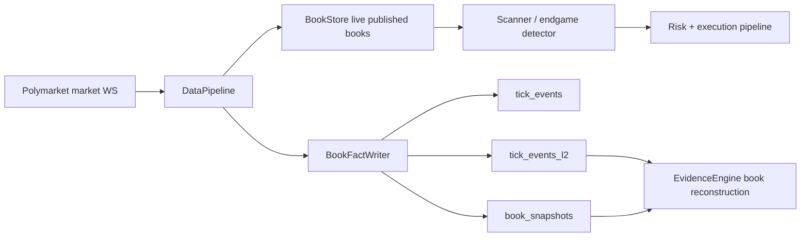
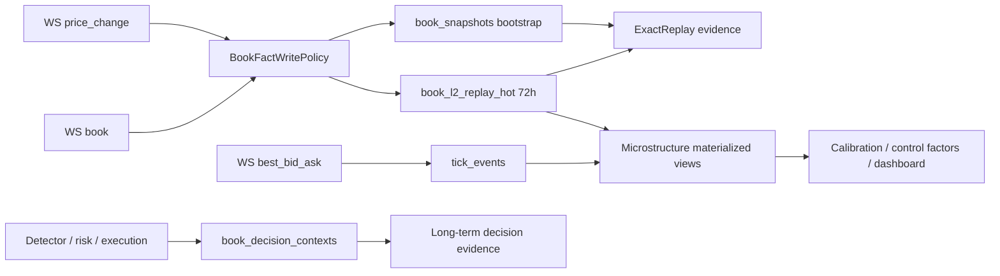

# Phase 5.1a — L2 Book Facts Retention & Decision Evidence

> **状态**: Production Design Target  
> **父计划**: `docs/plans/phase5.1-fact-data-plane.md`  
> **前置依赖**: Phase 5.1, Phase 5.3  
> **覆盖范围**: `tick_events_l2`、`book_snapshots`、book reconstruction、decision-time book evidence、ClickHouse retention  
> **目标**: 将高频 L2 行情从长期 raw event lake 重构为短期精确回放、长期决策证据和长期微结构聚合三层，降低存储爆炸，同时保持 endgame 资金决策 evidence 的权威性。

---

## 0. 最重要结论

`tick_events_l2` 当前保存 Polymarket CLOB market channel 的 token-level L2 book facts：

- `Snapshot`: WebSocket `book` 事件，包含完整 bids/asks levels。
- `Delta`: WebSocket `price_change` 事件，包含变更 price levels；`size = 0` 表示该 price level 删除。
- `book_version`: `BookStore` 应用 snapshot/delta 后的本地版本。
- `event_time` / `ingestion_time` / `sequence`: evidence replay 的稳定排序依据。

这张表不参与 live trading hot path。live 决策依赖内存 `BookStore`，ClickHouse 只服务事后 evidence、materialization、audit、calibration 和操作排障。

当前问题不是 ClickHouse 不适合行情，而是 `tick_events_l2` 同时承担了四个互相冲突的职责：

- 最近事故的逐事件精确回放；
- 长期资金决策审计；
- calibration / factor builder 的长期统计特征；
- dashboard / 运营容量分析。

这会导致 90 天 raw L2 长期留存。endgame 高频活跃市场里，Polymarket `price_change` 会随挂单、撤单、成交影响持续产生，长期逐事件保存会快速膨胀，而且并不天然提高长期 materialization 的权威性。

Phase 5.1a 采用破坏式重构：

- raw L2 只作为 **72 小时热回放层**；
- 长期权威 evidence 改为 **decision-time immutable book context**；
- 长期策略分析改为 **microstructure aggregates**；
- 不保留旧表名兼容、不做 re-export、不用 alias 掩盖语义变化。

---

## 1. 业务语义

### 1.1 Polymarket L2 对 endgame 的价值

Endgame arbitrage 的核心不是保存完整市场历史，而是在临近 resolution 时回答四个资金问题：

1. 当时 YES/NO book 是否 fresh、未 crossed、无明显 gap？
2. 当前 edge 是否能被真实 depth 支撑，而不是只看 best ask？
3. 目标 shares 下 FOK 是否可成交，slippage 和 fees 后是否仍有净 edge？
4. 如果成交、错过或失败，后续 settlement truth 是否证明该类 bucket 应该被收紧或放大？

逐事件 L2 对第 1-3 点有价值，但只在短期复盘、事故排查和精确 replay 中不可替代。长期 materialization 更需要的是“当时生产系统做资金决策时看到的不可变上下文”，而不是 90 天后重新扫每一条 book delta。

### 1.2 MarketId / TokenId 边界

- L2 book facts 必须按 `TokenId` 存储，因为 Polymarket CLOB order book 是 outcome token book。
- market-level evidence 必须通过 Postgres market metadata 解析 YES/NO token pair。
- `MarketId` 是 `condition_id`，只能作为 join / grouping 辅助，不能替代 `TokenId` 做 book replay key。

任何 storage/schema 重构都必须保持这个边界，否则 book reconstruction、execution simulation 和 settlement attribution 会全部偏移。

### 1.3 权威性定义

Phase 5.1a 不再把“是否能逐 tick 重建完整盘口”作为长期唯一权威标准。权威 evidence 分四级：

```text
ExactReplay
  72 小时内，使用 raw L2 + bootstrap snapshots 精确重建。

DecisionContext
  长期，使用 detection/risk/order/fill 等关键节点持久化的不可变 book context。

AggregateOnly
  长期，仅用于统计、calibration 辅助、dashboard、容量分析，不能裁决单笔资金决策。

Insufficient
  缺 bootstrap、gap 超阈值、book stale、crossed book、关键 decision context 缺失；fail closed。
```

这使 materialization report 明确表达“证据来自哪里、能证明什么、不能证明什么”，避免长期聚合数据伪装成逐事件真相。

---

## 2. 当前链路与问题

### 2.1 当前事实流



### 2.2 放大器

`tick_events_l2` 当前放大的来源：

- 每个 WebSocket `book` snapshot 写完整 arrays。
- 每个 `price_change` delta 都写一行。
- TTL 为 90 天。
- 按月分区，过期清理粒度偏粗。
- `book_snapshots` 每 60 秒全市场 published books 突发写入，用于 bootstrap。
- `changed_levels_json` 当前只保存 changed level count，既增加列复杂度，又没有提供足够 replay 价值。

### 2.3 对 materialization 的真实影响

当前 raw L2 长期保留的优点：

- 任意 90 天窗口都能尝试 ExactReplay。
- 对短期没有及时生成 decision context 的历史窗口有补救价值。

当前 raw L2 长期保留的问题：

- 存储和写入成本与订阅 token 数、活跃市场、撤单频率线性增长。
- WS gap、重复、乱序、缺 snapshot 时，raw L2 多不等于 evidence 完整。
- materialization 长期扫描 raw L2 成本高，越接近生产越容易变成不可运营的数据湖。
- endgame factor builder 长期关注的是 decision quality 和 settlement truth，不是每个 price level 的长期原始流水。

---

## 3. 目标架构

Phase 5.1a 将 book facts 分成三层。

### 3.1 热回放层：`book_l2_replay_hot`

职责：

- 保存最近 72 小时逐事件 L2 snapshot/delta。
- 支持最近 opportunity、failed execution、WS gap、reconnect storm 的精确 replay。
- 为 microstructure materialized views 提供输入。

保留策略：

```text
TTL: 72 hours
Partition: toYYYYMMDD(event_time)
Order: (token_id, event_time, ingestion_time, sequence)
```

核心字段：

```text
token_id
market_id
event_type
bid_prices
bid_sizes
ask_prices
ask_sizes
book_version
is_full_snapshot
event_time
ingestion_time
sequence
source
feed_event_hash
schema_version
```

设计要求：

- `feed_event_hash` 基于 source event payload 的 canonical fields 计算，用于检测重复 WS 事件。
- delta 行只保存 changed levels；snapshot 行保存 bounded top N 或 full snapshot 由 policy 决定。
- 删除 `changed_levels_json` 这类弱语义字段，改用结构化 metrics 或 hash。
- raw replay writer 故障不阻塞 live trading，但必须告警并影响 evidence coverage。

### 3.2 决策事实层：`book_decision_contexts`

职责：

- 保存资金决策关键时刻的不可变盘口上下文。
- 成为 72 小时后 materialization 的长期权威 book evidence。
- 支持解释每一次 detect、reject、size、order emit、fill、miss、settlement attribution。

写入时机：

```text
OpportunityDetected
RiskGateEvaluated
SizeComputed
OrderPrepared
OrderSubmitted
OrderFilled
OrderMissed
OrderFailed
SettlementAttributed
```

核心字段：

```text
context_id
opportunity_id
execution_id
market_id
yes_token_id
no_token_id
decision_stage
decision_time
yes_book_version
no_book_version
yes_book_age_ms
no_book_age_ms
top_n
yes_bids
yes_asks
no_bids
no_asks
yes_depth_usd
no_depth_usd
spread_bps
mid_price
imbalance
slippage_curve
tick_size
book_quality
latency_trace
source
schema_version
```

设计要求：

- `decision_stage` 必须是 enum，不用自由字符串。
- `book_quality` 必须表达 fresh/stale/crossed/gap/invalid/insufficient。
- top N 默认 `20`，后续由 config 控制；endgame execution evidence 不应依赖无限深度。
- long-term 单笔资金裁决只能使用 `DecisionContext` 或 `ExactReplay`，不能使用 `AggregateOnly`。
- Live 模式下 decision context writer 不可用时应 fail closed 或至少阻断真实下单；这是资金审计事实，不是可选日志。

### 3.3 微结构聚合层：`book_microstructure_1s` / `book_microstructure_1m`

职责：

- 长期保存盘口微结构统计，用于 calibration、control factor、dashboard 和容量规划。
- 替代长期扫描 raw L2。

建议指标：

```text
best_bid_open/high/low/close
best_ask_open/high/low/close
spread_bps_min/avg/max
mid_price_open/close
top1_depth_usd_avg
top5_depth_usd_avg
top20_depth_usd_avg
imbalance_avg
update_count
snapshot_count
delta_count
delete_count
crossed_count
invalid_level_count
gap_count
last_trade_count
max_book_age_ms
```

保留策略：

```text
book_microstructure_1s: 30-90 days
book_microstructure_1m: 365 days or longer
```

`1s` 粒度用于近期模型分析和运营诊断，`1m` 粒度用于长期 calibration、trend 和 storage forecasting。

### 3.4 最终数据流



---

## 4. Phase 拆分

### Phase A — Schema Semantics Break

目标：先把命名和 schema 语义改正确，避免继续围绕 `tick_events_l2` 堆兼容层。

交付物：

- 删除 `TickEventL2Row` 语义。
- 新增 `BookL2ReplayRow`。
- 新增 `BookDecisionContextRow`。
- 新增 `BookMicrostructure1sRow` / `BookMicrostructure1mRow`。
- Repository trait 改名为 `insert_book_l2_replay`、`book_l2_replay`、`insert_book_decision_contexts`。
- ClickHouse DDL 删除 `tick_events_l2.sql`，新增 `book_l2_replay_hot.sql`、`book_decision_contexts.sql`、`book_microstructure_1s.sql`、`book_microstructure_1m.sql`。

验收：

- schema contract tests 覆盖 Decimal、Enum、TTL、ORDER BY、partition。
- 不存在 `tick_events_l2`、`TickEventL2Row`、`insert_l2_events`、`l2_events` 的生产代码引用。
- 不存在 type alias、compat view、re-export。

### Phase B — Writer Policy

目标：让 live writer 按业务价值写 facts，而不是所有数据同等长期保存。

交付物：

- `BookFactWritePolicy`。
- `book_l2_replay_hot` writer。
- `book_decision_contexts` writer。
- snapshot top-N policy。
- active/endgame token snapshot cadence policy。
- raw writer backpressure metrics。
- decision context writer fail-closed policy。

建议默认值：

```text
l2_replay_ttl_hours = 72
decision_context_ttl_days = 180
microstructure_1s_ttl_days = 90
microstructure_1m_ttl_days = 365
decision_top_n = 20
hot_replay_snapshot_top_n = 50
```

验收：

- WebSocket delta zero-size delete 可回放。
- snapshot top-N 受 config 控制。
- decision context 在 detect/risk/order terminal 节点可落盘。
- raw replay writer backpressure 不阻塞 live hot path。
- decision context writer 在 Live 下不可用时触发 fail-closed 或明确 startup gate。

### Phase C — Evidence Tiering

目标：materialization 明确证据等级，避免长期聚合伪装为精确 replay。

交付物：

- `BookEvidenceTier` enum。
- `BookReconstructionReport` 增加 evidence tier、coverage、reason。
- 72 小时内使用 `ExactReplay`。
- 72 小时后使用 `DecisionContext`。
- 仅聚合数据可用时标记 `AggregateOnly`，不能用于单笔 execution 裁决。
- 关键事实缺失时标记 `Insufficient`。

验收：

- `ExactReplay` 测试覆盖 snapshot bootstrap、delta apply、gap、stale、crossed、invalid。
- `DecisionContext` 测试覆盖 long-term opportunity materialization。
- `AggregateOnly` 不允许通过 execution evidence production gate。
- `Insufficient` 触发 fail-closed quality gate。

### Phase D — Microstructure Materialization

目标：将长期 raw L2 分析迁移到低成本聚合层。

交付物：

- `book_microstructure_1s` MV。
- `book_microstructure_1m` rollup。
- calibration / factor builder 查询改读聚合层。
- dashboard / operations 查询改读聚合层。
- storage forecast metrics。

验收：

- 1s / 1m 聚合 row count 与 raw event count 可对账。
- spread/depth/imbalance 与 spot-check raw replay 一致。
- 长窗口 factor build 不扫 `book_l2_replay_hot`。
- ClickHouse storage bytes/day 指标可观测。

### Phase E — Migration & Operations Cutover

目标：生产切换时清晰、可回滚到代码版本，但不保留数据语义兼容。

交付物：

- DDL migration / bootstrap 文档。
- 老 `tick_events_l2` drop 或 archive 操作手册。
- retention dashboard。
- replay coverage dashboard。
- writer lag / dropped facts / estimated storage 指标告警。

验收：

- 新版本启动只检查新表。
- materialization manifest 记录 evidence tier。
- 运维 runbook 明确 raw replay 只承诺 72 小时。
- 老表不再被任何生产查询依赖。

---

## 5. 对 Materialization 质量的影响

### 5.1 不降低长期资金证据权威性

长期 materialization 的权威性不应该来自“90 天后还能逐事件重放每个 price level”，而应该来自“当时生产系统做资金决策所依赖的事实被不可变保存”。

对 endgame 来说，长期最关键证据是：

- detection 当时的 YES/NO book context；
- risk gate 当时的 book age、depth、spread、quality；
- sizing 当时使用的可成交深度和 slippage curve；
- order emit / terminal 时的 book version 与 latency trace；
- settlement 后 outcome、realized PnL、reconciliation 状态；
- control factor 如何由上述 evidence 产生、发布和回滚。

这些事实由 `book_decision_contexts`、`opportunity_detection`、`opportunity_audit`、settlement facts 和 calibration snapshots 共同闭环，比长期 raw L2 更贴近资金审计。

### 5.2 会改变 replay 能力边界

Phase 5.1a 明确牺牲一项能力：

```text
超过 72 小时后，不再承诺任意窗口逐事件重建完整 order book。
```

换来的是：

```text
长期保存每次资金决策现场的不可变 evidence，并长期保存可分析的微结构特征。
```

这不是质量下降，而是权威性从 raw market history 转向 production decision truth。

### 5.3 Quality gates

生产 materialization 必须遵守：

- `ExactReplay` 可用于近期 book reconstruction、execution simulation、incident replay。
- `DecisionContext` 可用于长期 opportunity / execution / risk / settlement evidence。
- `AggregateOnly` 只能用于统计型 factor，不可裁决单笔交易可成交性。
- `Insufficient` 必须 fail closed，不能用默认值或空数组伪造 book。

---

## 6. 存储收益

当前 raw L2 成本近似：

```text
raw_l2_storage = daily_raw_l2_bytes * 90
```

Phase 5.1a 后：

```text
new_storage =
  daily_raw_l2_bytes * 3
  + decision_context_bytes
  + microstructure_1s_bytes
  + microstructure_1m_bytes
```

其中 `decision_context_bytes` 与 opportunity / execution 数量相关，不与所有 WS updates 线性相关；`microstructure` 与 token/time bucket 数量相关，也远小于逐事件 delta。

预期收益：

- raw L2 留存从 90 天降到 72 小时，单项约 30 倍下降。
- 长期事实从 event-level 转为 decision-level + aggregate-level，通常再降低 1-2 个数量级。
- 生产总体 ClickHouse book facts 存储预计下降 80%-97%+，具体取决于订阅 token 数、市场活跃度、top-N 和聚合 TTL。

---

## 7. 配置

建议新增配置段：

```toml
[db.clickhouse.book_facts]
l2_replay_ttl_hours = 72
decision_context_ttl_days = 180
microstructure_1s_ttl_days = 90
microstructure_1m_ttl_days = 365
decision_top_n = 20
hot_replay_snapshot_top_n = 50
active_snapshot_interval_secs = 60
inactive_snapshot_interval_secs = 900
```

Live 校验：

- `decision_top_n > 0`。
- `l2_replay_ttl_hours >= 24`。
- `decision_context_ttl_days >= 90`。
- `microstructure_1m_ttl_days >= decision_context_ttl_days`。
- Live mode 下 decision context writer 必须可用。

---

## 8. Observability

新增 metrics：

```text
oxide_arb_book_l2_replay_rows_total
oxide_arb_book_l2_replay_rows_dropped_total
oxide_arb_book_l2_replay_writer_lag_ms
oxide_arb_book_decision_context_rows_total
oxide_arb_book_decision_context_write_failures_total
oxide_arb_book_microstructure_mv_lag_ms
oxide_arb_book_fact_estimated_bytes_per_day
oxide_arb_book_evidence_tier_total{tier}
oxide_arb_book_evidence_insufficient_total{reason}
```

告警：

- Live 下 decision context write failure > 0。
- raw replay dropped rows 持续增长。
- MV lag 超过 5 分钟。
- `Insufficient` evidence ratio 超过阈值。
- ClickHouse book facts estimated bytes/day 超过容量预算。

---

## 9. 风险与处理

### 9.1 风险：长期不能任意逐 tick 重建

处理：

- 文档和 manifest 明确 evidence tier。
- 72 小时内保留 ExactReplay。
- 长期单笔资金裁决依赖 DecisionContext。

### 9.2 风险：decision context writer 成为资金审计单点

处理：

- Live mode startup gate。
- bounded queue + backpressure metrics。
- terminal stage 补写 context。
- failure 进入 risk/evidence fail-closed。

### 9.3 风险：top-N 不足以解释大 size

处理：

- `decision_top_n` 按 max order size 和 market liquidity 校准。
- decision context 同时保存 slippage curve 和 depth_used_pct。
- 如果 size 超过 captured depth，execution evidence 标记 insufficient。

### 9.4 风险：聚合指标掩盖异常

处理：

- 聚合只用于 `AggregateOnly`。
- crossed/gap/invalid/delete count 必须进入 aggregate。
- 单笔裁决禁止只用 aggregate。

---

## 10. Done Definition

Phase 5.1a 完成时必须满足：

- `tick_events_l2` 语义在生产代码中消失。
- raw L2 只进入 `book_l2_replay_hot`，TTL 72 小时。
- 每个资金关键节点都有 `book_decision_contexts`。
- materialization report 显示 `ExactReplay` / `DecisionContext` / `AggregateOnly` / `Insufficient`。
- 长期 factor builder 不扫 raw L2。
- storage bytes/day、writer lag、evidence tier、insufficient reason 可观测。
- tests 覆盖 schema、writer policy、evidence tier、gap/stale/crossed/invalid。
- `cargo fmt` 和 `cargo clippy --workspace --all-targets -- -D warnings` 通过。
