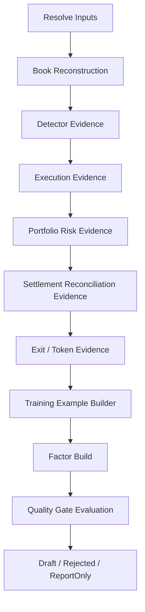

# Phase 5.3 — Evidence Engine & Replay Stage Graph

> **状态**: Production Design Target  
> **父计划**: `docs/plans/phase5-replay-analytics.md`  
> **前置依赖**: Phase 5.1, Phase 5.2  
> **覆盖原章节**: 6.2-6.6, 9.2, 12.9, 18.4  
> **目标**: 实现固定 stage graph，将 PIT inputs 转成 detector、execution、portfolio、settlement、reconciliation、exit/token evidence。Evidence 只产证据，不直接改变 live 行为。

---

## 0. Stage Graph



用户不选择产品模式。用户可以请求 factor builder，但依赖关系决定必须执行哪些 stage。

### 0.1 交付物

| Stage | 输出 |
|---|---|
| Book reconstruction | `BookReconstructionReport`、`BookQualityMetrics`、execution-time book views |
| Detector evidence | live-vs-materialized match、bucket/score distribution |
| Execution evidence | FOK fill/miss confusion matrix、slippage/depth/latency metrics |
| Portfolio risk evidence | deterministic sequence、capital pressure、denial/sizing attribution |
| Settlement reconciliation evidence | outcome attribution、redeem/accounting/reconciliation health |
| Exit/token evidence | report-only exit simulation、sell-side bid coverage、token reconciliation health |
| Training example builder | typed examples、labels、dataset hash |

---

## 1. Book Reconstruction

### 1.1 职责

- Bootstrap token books from `book_snapshots`。
- Apply `tick_events_l2` deltas in event-time order。
- 在 detection 和 execution timestamp 重建 YES/NO book pair。
- 记录 gap、invalid level、crossed book、staleness、snapshot age。
- 输出 per-opportunity execution-time book views。

### 1.2 Coverage metrics

```text
token_count_expected
token_count_reconstructed
l2_event_count
snapshot_bootstrap_count
gap_count
max_gap_ms
median_book_age_ms
p95_book_age_ms
crossed_book_count
invalid_level_count
stale_interval_ms
```

### 1.3 Minimum production rule

- `snapshot_bootstrap_count > 0` for each token in scope。
- `max_gap_ms <= execution.max_replay_gap_ms` for execution factors。
- crossed/invalid levels must be excluded and reported。
- Out-of-order L2 events must be sorted by stable ordering from repository contract。

### 1.4 Tests

- missing snapshot；
- crossed book；
- invalid price/size；
- L2 gap；
- out-of-order events；
- same timestamp tie-break；
- stale interval computation；
- YES/NO token pair reconstruction。

---

## 2. Detector Evidence

### 2.1 职责

- 从 PIT market context 和 reconstructed books 重建 endgame detector inputs。
- 使用 run manifest 固定的 runtime config 运行当前 detector/scorer 逻辑。
- Cross-check against `opportunity_detection`。
- 归因 missed live signals 和 extra materialized signals。

### 2.2 输出

- `DetectorEvidenceReport`；
- bucket distribution；
- score component distribution；
- live-vs-materialized match rate。

### 2.3 Metrics

```text
live_detection_count
materialized_detection_count
matched_opportunity_count
missed_live_signal_count
extra_materialized_signal_count
score_delta_p50
score_delta_p95
bucket_mismatch_count
calibration_snapshot_mismatch_count
```

### 2.4 Hard rules

- 该 stage 只产证据，不是用户可见 `DetectorOnly` run。
- 禁止静默调整 detector 阈值。
- 阈值比较必须使用 run manifest 固定的 runtime config version。
- Any mismatch must preserve enough source refs to investigate writer bug vs replay logic bug。

---

## 3. Execution Evidence

### 3.1 职责

- 使用重建 L2 book 模拟 FOK 可成交性。
- 估计 depth-weighted VWAP、slippage、fee、book age、latency sensitivity。
- Compare simulated fill/miss with `opportunity_audit` terminal rows。
- 产出 fill probability error 和 adverse selection stress metrics。

### 3.2 输出

- `ExecutionEvidenceReport`；
- fill/miss confusion matrix；
- slippage and depth distributions；
- latency harm metrics。

### 3.3 Fill model variants

| 模型 | 用途 | 是否可用于发布 |
|---|---|---|
| `StrictFok` | 只统计 historical book 中可完整成交的情况 | 是 |
| `DepthWeighted` | 估计 VWAP/partial depth pressure | report + stress evidence |
| `LatencyShiftedFok` | 按配置 latency bucket 平移 book | 是，但 latency source 必须 PIT |
| `AdverseSelectionStress` | 按不利方向移动 price/depth | report/gate evidence |

`ExecutionQualityFactor` 只能由 production-eligible models 生成。Stress models 可以阻止发布或降低 confidence，但不能直接生成乐观 payload。

### 3.4 Metrics

```text
strict_fok_fill_rate
live_fill_rate
false_fill_count
false_miss_count
simulated_vwap_p50/p95
realized_slippage_p50/p95
depth_consumed_pct_p50/p95
latency_shifted_miss_rate
adverse_selection_loss_p95
book_age_fill_correlation
```

---

## 4. Portfolio / Risk Evidence

### 4.1 职责

- 重建 trade sequence、reservations、open positions、potential loss、exposure、cash/equity。
- 使用 PIT inputs 重新评估 risk gates 和 sizing constraints。
- 按 reason 归因 denials，衡量 false accept / false reject patterns。
- 估计 drawdown、loss streak、peak potential loss、peak reserved capital。

### 4.2 Deterministic sequence

```text
sort by event_time, tie-break by persisted id
apply detection candidate
apply validation reject or continue
apply risk gates in live order
apply sizing
apply reservation
apply terminal execution
apply post-trade accounting
apply settlement/reconciliation events
```

### 4.3 Metrics

```text
peak_reserved_usd
peak_potential_loss_usd
peak_total_exposure_usd
peak_open_positions
max_drawdown_pct
loss_streak_max
risk_denial_by_gate
sizing_constraint_by_reason
settlement_backlog_max
stale_metrics_window_ms
```

### 4.4 Hard rules

- Risk gates must run in live order from Phase 4.1/4.2 contracts。
- Sizing attribution must preserve binding constraint。
- Missing risk/accounting state cannot be defaulted to zero。
- Sequence output must be reproducible with same inputs/hash。

---

## 5. Settlement / Reconciliation Evidence

### 5.1 职责

- 将 fills join 到 settlement outcomes。
- 归因 payout、realized PnL、redeem status、settlement delay。
- Join reconciliation reports、balance snapshots、token balance snapshots。
- 检测 drift、stale metrics、unresolved redeem、token mismatch。

### 5.2 Required joins

```text
trade_id -> position_id
opportunity_id -> detection snapshot
market_id -> settlement request
winning_token_id -> position side
position_id -> redeem/accounting status
account scope -> balance_snapshot
token_id -> token_balance_snapshot
```

缺失 join 必须显式记录，不能用空字符串或 `0` 指标填充。

### 5.3 Metrics

```text
settled_trade_count
unsettled_trade_count
won_count
lost_count
payout_usd_sum
realized_pnl_usd_sum
settlement_delay_p50/p95
redeem_pending_count
redeem_failed_count
cash_drift_usd
token_drift_shares
critical_drift_count
metrics_stale_secs
```

---

## 6. Exit / Unwind Evidence

Exit evidence 是 report-only 起步，不直接生成 live auto-exit。

### 6.1 Simulation loop

```text
For each historical filled position:
  reconstruct bid book after entry
  simulate fixed stop / trailing stop / time stop / zone invalidation
  compare:
    hold_to_resolution_pnl
    exit_pnl_after_slippage
    missed_recovery_count
    avoided_tail_loss
    false_exit_count
    executable_exit_rate
```

### 6.2 Required evidence

- sell-side L2 bid book coverage；
- token-level balance reconciliation；
- exit accounting model；
- enough historical examples；
- evidence that shadow would not systematically sell final winners too early。

### 6.3 Output

```text
ExitEvidenceReport
exit_strategy_metrics
sell_side_book_coverage
executable_exit_rate
false_exit_distribution
avoided_tail_loss_distribution
token_inventory_consistency
```

---

## 7. Training Example Builder

每类 factor 的 training examples 必须由 materialization run 生成，且带 PIT manifest。

```rust
pub struct FactorTrainingExample {
    pub entity_key: FactorDimensions,
    pub event_time: DateTime<Utc>,
    pub features: FactorFeatureVector,
    pub label: Option<FactorLabel>,
    pub outcome_available_at: Option<DateTime<Utc>>,
    pub source_refs: EvidenceSourceRefs,
}
```

规则：

- `features` 只能使用 `event_time` 当时已经可见的数据。
- `label` 可以延迟到 settlement/reconciliation 后才出现。
- `outcome_available_at` 必须晚于或等于真实 outcome 可见时间。
- 训练集必须保存 `dataset_hash`，并写入 factor evidence。
- 重建训练集时，`dataset_hash` 必须可复现。

---

## 8. 测试策略

| Stage | 必需测试 |
|---|---|
| Book reconstruction | missing snapshot、crossed book、gap、out-of-order L2 events |
| Detector evidence | live match、missed live signal、extra materialized signal、bucket mismatch |
| Execution evidence | strict FOK fill、miss、latency shifted miss、depth stress |
| Portfolio evidence | risk reject、reservation pressure、drawdown、stale metrics |
| Settlement evidence | won、lost、delayed settlement、redeem failure |
| Reconciliation evidence | cash drift、token drift、stale balance、critical drift |
| Exit evidence | fixed stop、trailing stop、time stop、zone invalidation、bid-depth unavailable |
| Token reconciliation | PG 有 position 但链上无 token、链上有 token 但 PG 无 position、allowance missing、resolution 后 redeem |
| Training examples | PIT feature leakage、delayed label、dataset hash reproducibility |

---

## 9. 退出条件

Phase 5.3 完成后必须满足：

1. 每个 evidence stage 输出确定且包含 coverage metrics、warnings、errors、query fingerprints。
2. Book reconstruction 能按 token 重建 execution-time YES/NO book views。
3. Detector evidence 能解释 live vs materialized 差异。
4. Execution evidence 能输出 fill/miss confusion matrix 和 latency/depth/slippage metrics。
5. Portfolio evidence 能 deterministic 重建 sequence 和 binding constraints。
6. Settlement/reconciliation evidence 能 join outcome、redeem、balance、token drift。
7. Exit materialization 至少 report-only，可输出 executable exit rate 和 false exit metrics。
8. Training examples 有 PIT source refs 和 reproducible dataset hash。

---

## 10. 阻止进入 Phase 5.4 的情况

- Stage output 依赖未排序查询结果。
- Detector evidence 使用当前 config/calibration。
- Execution evidence 在 L2 gap 超阈值时仍生成 production factor input。
- Portfolio sequence 不可复现。
- Settlement join 缺失被填成默认值。
- Exit simulation 缺 sell-side bid coverage 却声称 executable。
- Training features 存在未来信息泄漏。
