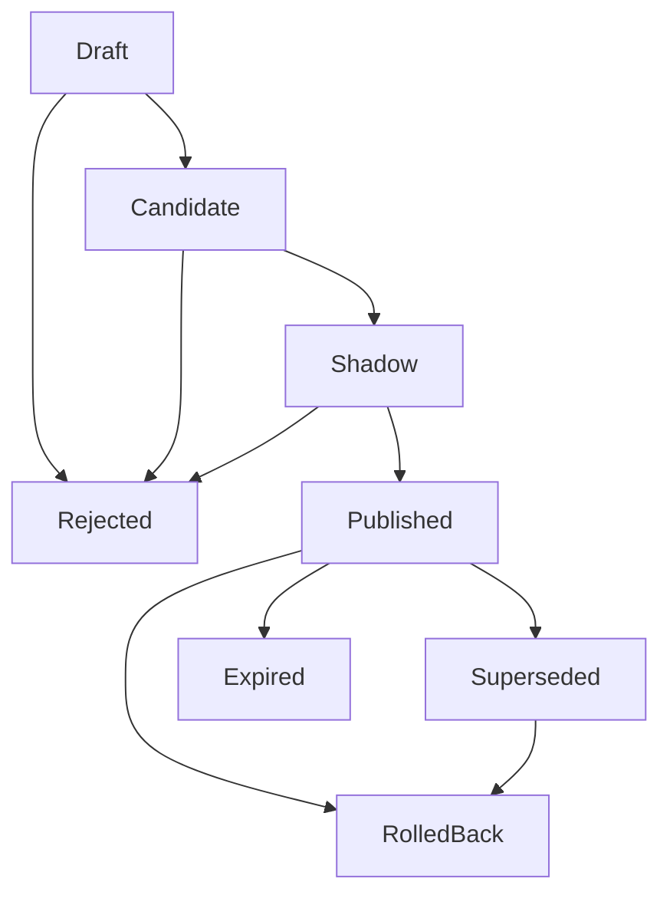

# Phase 5.5 — Registry, Governance Lifecycle, API & Scheduler

> **状态**: Production Design Target  
> **父计划**: `docs/plans/phase5-replay-analytics.md`  
> **前置依赖**: Phase 5.0-5.4  
> **覆盖原章节**: 14, 15.3, 16, 18.6, 18.7  
> **目标**: 建立 control factor registry、publication state machine、audit hash chain、operator API、RBAC 和 scheduler。Governance 负责“什么可以生效”，materialization 只负责“证据和候选”。

> **Phase 5.3/5.4 contract dependency**: Governance 只接收 5.4 产出的 typed Draft/Candidate factor values；不得直接消费 5.3 `EvidenceOnly`/`ProductionIneligible` stage artifacts。API 展示 evidence 时必须保留 stage outcome、typed `EvidenceIssue`、artifact hashes 和 query fingerprints，不能把 stage-level production ineligibility 映射成 factor-level `ReportOnly` 之外的状态。

---

## 0. Phase 5.4 收尾边界（5.5 前置）

Phase 5.4 已在 `oxide-arb-control` / `oxide-arb-models` 落地 **materialization → typed builders → blocking gates → draft persistence** 闭环。下列能力 **明确归属 Phase 5.5**，5.4 不再扩展：

| 能力 | 5.4 现状 | 5.5 负责 |
|---|---|---|
| `RollbackGate` | 未在 materialization evaluator 执行（无 active publication） | publication manager + rollback API |
| Shadow readiness 计算 | `min_shadow_opportunities` 仅在 `QualityGatePolicy`；无 `control_factor_shadow_decision` 写入 | shadow decision 采集、聚合、promotion review |
| Champion / challenger | 无 runtime 比较产物 | Shadow publication + delta 指标 + promotion API |
| Governance FSM | `FactorLifecycle` 类型存在；无 Candidate→Shadow→Published 事务 | registry + publication state machine |
| Audit hash chain | materialization 仅 `FactorCreated` 类事件 | append-only `control_factor_audit_event` + `prev_event_hash` |
| Operator API / RBAC | 无 HTTP surface | §4 API + §7 RBAC |
| Scheduler | 无 enqueue worker | §6 scheduler（只 enqueue，never publish） |
| Live hot path 消费 | 无 `ControlFactorSnapshot` 加载 | Phase 5.6+（本阶段非目标） |

### 0.0 Phase 5.4 已交付（5.5 可依赖）

- 五类 typed `FactorDimensions` / `FactorPayload` / `FactorEvidence`（含 `FactorMaturity::StatisticallyMaterialized`、`dataset_hash`、真实 `PointInTimeInputManifest` 克隆）。
- `FactorBuilderRegistry`：按 bucket 分组 + parent-bucket shrink（`factor/bucket.rs`）；insufficient sample → `ReportOnly`。
- `QualityGateEvaluator`：blocking gates — `PointInTime`、`UpstreamStage`、`Coverage`、`Sample`、`Leakage`、`Stability`、`TailRisk`、`Conservative`、`Ttl`、`Owner`（`enabled_gates` 可配置）。
- Run 终态：`CompletedWithRejectedFactors` 当 gate 产生 rejected factors。
- `StatsError` / `StatsResult` 统一在 `oxide-arb-error::control`。
- 测试：`materialization_smoke` phase 5.3/5.4、gate upstream 单测、bucket shrink 单测。

### 0.0.1 已知生产债（5.5 不必重复做，但发布前应规划）

- **Detector replay leakage**：smoke 合成数据仍可能触发 per-opportunity `bucket`/`calibration_snapshot` mismatch；生产应用 `Leakage` gate，smoke 使用 `QualityGatePolicy::smoke_acceptance()` 关闭 Leakage/TailRisk 以便断言 Candidate 路径。
- **Wilson / β-binomial**：`observed_rate_lower_bound` 为保守 bps band，非完整 Wilson；生产校准可后续收紧。
- **Portfolio builder**：`sequence_complete` + drawdown metrics 不足时仅 `ReportOnly`；非完整 tail-capital 模型。
- **MarketAnomaly**：无 incident evidence 时恒 `ReportOnly`（符合计划）。
- **Training `entity_key`**：已从 `DetectorBucketRef` 派生；`hours_to_settlement` / spread-depth 等细粒度维度待 evidence 扩展后再 materialize 多因子行。

---

## 0. 工作范围

### 0.1 交付物

| 交付物 | 说明 |
|---|---|
| Registry repository | factor value、publication、audit、shadow decision 的 typed repository |
| Governance state machine | Draft/Candidate/Shadow/Published/Superseded/Expired/RolledBack/Rejected |
| Publication manager | active publication 串行化、rollback、expiry |
| Audit event chain | append-only event，记录 actor/reason/request/diff/hash |
| API surface | materialization、candidate review、publication、runtime config version |
| Scheduler | scheduled/event-driven materialization enqueue，never publish directly |
| RBAC/idempotency | mutating API 必须 actor/reason/request/idempotency |

### 0.2 非目标

- 不实现 factor builder（含统计估计、training example 丰富化、gate 规则扩展）。
- 不实现 materialization stage graph 新 stage（5.4 已覆盖 FactorBuild / QualityGateEvaluation / DraftWrite）。
- 不接入 live hot path / CLOB hot-path factor 加载。
- 不实现 UI 具体组件；这里只定义页面和 API 契约。
- 不允许 scheduler 自动 publish factor。
- 不重复实现 5.4 blocking quality gates（governance 只消费 gate 结果与 `QualityGateEvaluationReport`）。

### 0.3 5.5 必须接上的 5.4 产物

- `ControlFactorValue` 行：`Candidate` / `Rejected` / `ReportOnly` / `Draft`（DB status）。
- `QualityGateEvaluation` stage report（`metrics` 内嵌 `QualityGateEvaluationArtifact`）。
- `FactorEvidence`：`stage_report_ids`、`point_in_time_inputs`、`maturity`、`tail_risk`、`source_refs`。
- Materialization run terminal status：`Completed` / `CompletedWithRejectedFactors` / `ReportOnly` / `Failed`。

---

## 1. Governance Lifecycle



| 状态 | 含义 | Live 影响 |
|---|---|---|
| `Draft` | raw materialization output | none |
| `Candidate` | passed quality gates | none |
| `Shadow` | live computes delta only | none |
| `Published` | included in active publication | yes |
| `Superseded` | replaced by newer publication | no unless rolled back |
| `Expired` | TTL 到期 | no |
| `RolledBack` | removed by rollback event | no |
| `Rejected` | failed gate or manual review | no |

All state transitions write `control_factor_audit_event`。

---

## 2. Publication Rules

- Published 状态由 publication 版本控制，不通过原地修改 factor rows 实现。
- 一个 publication 要么包含完整 active set，要么包含带 previous publication pointer 的 deterministic delta。
- Rollback 通过切换 active publication pointer 到 known-good publication 完成。
- Rollback 永远不删除 audit history。
- Manual approval 必须包含 operator、reason、request id、before/after diff。
- 同一时间只能存在一个 `Published / Active` publication。
- Publication writes never silently upsert；retry 必须通过 idempotency key 返回已有 publication。

### 2.1 Risk-expanding approval

Risk-expanding changes require：

- `manual_risk_expansion_approval = true`；
- actor has `risk_owner` role；
- factor-specific justification；
- shorter TTL；
- rollback target；
- before/after diff；
- audit event；
- retrospective review task。

---

## 3. Persistence

### 3.1 `control_factor_value`

Required columns：

```text
factor_id UUID primary key
run_id UUID references control_factor_materialization_run
factor_type text not null
dimensions jsonb not null
dimensions_hash text not null
payload jsonb not null
payload_hash text not null
evidence jsonb not null
status text not null
status_reason text null
schema_version integer not null
generated_at timestamptz not null
expires_at timestamptz not null
owner text not null
created_at timestamptz not null
updated_at timestamptz not null
```

Indexes：

```text
idx_cfv_type_status_expires(factor_type, status, expires_at)
idx_cfv_run(run_id)
idx_cfv_dimensions_hash(dimensions_hash)
uniq_cfv_run_payload(run_id, factor_type, dimensions_hash, payload_hash)
```

### 3.2 `control_factor_publication`

Required columns：

```text
publication_id UUID primary key
mode text not null -- Shadow / Published
status text not null -- Active / Superseded / RolledBack / Expired
factor_ids jsonb not null
previous_publication_id UUID null
effective_from timestamptz not null
expires_at timestamptz not null
approved_by text null
approval_reason text not null
idempotency_key text not null
publication_hash text not null
created_at timestamptz not null
updated_at timestamptz not null
```

Indexes：

```text
idx_cfp_mode_status(mode, status)
idx_cfp_effective(effective_from, expires_at)
uniq_cfp_idempotency(idempotency_key)
```

Use transaction lock or partial unique index to enforce one active Published publication。

### 3.3 `control_factor_audit_event`

Required columns：

```text
event_id UUID primary key
event_type text not null
actor text not null
resource_type text not null
resource_id text not null
request_id text not null
reason text not null
before_hash text null
after_hash text null
diff jsonb not null
prev_event_hash text null
event_hash text not null
created_at timestamptz not null
```

Audit events 只能 append-only，禁止 update path。

Audit must answer：

- who requested the change；
- what changed；
- when it changed；
- why it changed；
- which evidence and approval supported it；
- how to roll back。

### 3.4 `control_factor_shadow_decision`

Required columns：

```text
decision_id UUID primary key
publication_id UUID not null
opportunity_id UUID null
market_id text not null
event_id text null
baseline_decision jsonb not null
shadow_decision jsonb not null
delta jsonb not null
affected_factor_ids jsonb not null
decided_at timestamptz not null
created_at timestamptz not null
```

Indexes：

```text
idx_cfsd_publication_decided(publication_id, decided_at)
idx_cfsd_market_decided(market_id, decided_at)
```

---

## 4. API

### 4.1 Materialization API

```text
POST /api/v1/control-factor-materializations
GET  /api/v1/control-factor-materializations
GET  /api/v1/control-factor-materializations/{run_id}
GET  /api/v1/control-factor-materializations/{run_id}/report
POST /api/v1/control-factor-materializations/{run_id}/cancel
```

`POST` is for：

- scheduler service；
- manual backfill；
- incident response；
- config comparison；
- forensic report。

Request:

```json
{
  "run_kind": "backfill",
  "window": {
    "from": "2026-06-01T00:00:00Z",
    "to": "2026-06-02T00:00:00Z"
  },
  "source_delay_secs": 900,
  "market_filter": {
    "categories": ["politics"],
    "market_ids": []
  },
  "requested_factor_types": ["bucket_risk", "execution_quality"],
  "runtime_config_ref": {
    "mode": "active_at",
    "at": "2026-06-02T00:00:00Z"
  },
  "output_policy": "emit_draft_candidates",
  "force_new_run": false,
  "reason": "daily scheduled materialization"
}
```

Response:

```json
{
  "run_id": "018f0000-0000-7000-8000-000000000001",
  "status": "queued",
  "dedupe_key": "sha256:...",
  "report_url": null,
  "created_at": "2026-06-02T00:00:01Z"
}
```

### 4.2 Candidate review API

```text
GET  /api/v1/control-factors/candidates
GET  /api/v1/control-factors/{factor_id}
POST /api/v1/control-factors/{factor_id}/reject
POST /api/v1/control-factors/{factor_id}/shadow
POST /api/v1/control-factors/{factor_id}/publish
```

Publish request:

```json
{
  "publication_mode": "published",
  "factor_ids": ["018f0000-0000-7000-8000-000000000010"],
  "approval_reason": "Shadow window passed with no reject regressions",
  "idempotency_key": "operator-request-123",
  "manual_risk_expansion_approval": false
}
```

Reject request:

```json
{
  "reason": "Sample count below minimum after reviewing evidence",
  "request_id": "review-456"
}
```

### 4.3 Publication API

```text
GET  /api/v1/control-factors/publications/current
GET  /api/v1/control-factors/publications/{publication_id}
POST /api/v1/control-factors/publications/{publication_id}/rollback
GET  /api/v1/control-factors/snapshot/current
```

### 4.4 Runtime config version API

```text
POST /api/v1/runtime-config/versions
GET  /api/v1/runtime-config/versions
POST /api/v1/runtime-config/versions/{version_id}/activate
```

Runtime config activation is governed like publication：

- immutable version；
- approval reason；
- config hash；
- rollback target；
- audit event。

---

## 5. UI Pages

- Materialization runs：status、manifest、stage coverage、warnings、produced factors。
- Evidence reports：detector、execution、portfolio、settlement、reconciliation。
- Candidate review：payload、evidence、gates、owner、TTL、recommended action。
- Shadow dashboard：would reject、would size、score delta、affected markets。
- Publication dashboard：current snapshot、previous publication、expiry、rollback action。
- Runtime config versions：diff、activation history、rollback。
- Exit/unwind simulations：report-only before any live auto-exit。
- Token reconciliation：internal vs external balances、drift severity、allowance status。

---

## 6. Scheduler

默认调度：

| 任务 | 节奏 | Source delay | 目标因子 |
|---|---:|---:|---|
| `execution-quality-hourly` | hourly | 10-30 min | `ExecutionQualityFactor` |
| `reconciliation-health-hourly` | hourly or on report | 0-10 min | `ReconciliationHealthFactor` |
| `bucket-risk-daily` | daily | 1-6 h | `BucketRiskFactor` |
| `portfolio-risk-daily` | daily | 1-6 h | `PortfolioRiskFactor` |
| `market-anomaly-event` | event-driven | 0-10 min | `MarketAnomalyFactor` |

Scheduler must：

- respect run dedupe keys；
- alert on missed materialization；
- alert when latest successful materialization is older than 2x cadence；
- never publish factors directly；
- write audit events for manual backfill and incident runs。

---

## 7. RBAC

| 角色 | 允许操作 |
|---|---|
| `viewer` | read runs, reports, factors, publications |
| `operator` | create backfill/forensic runs, move Candidate to Shadow |
| `risk_owner` | publish conservative factors, rollback publication |
| `admin` | manage scheduler policy, runtime config versions |
| `emergency_operator` | publish emergency anomaly/reconciliation factor with short TTL |

Every mutating API requires：

```text
actor
request_id
reason
idempotency_key
```

缺少 reason 返回 400。未知 actor role 返回 403。

---

## 8. 测试策略

| 测试 | 必需场景 |
|---|---|
| Lifecycle | Draft->Candidate、Candidate->Shadow、Shadow->Published、Rejected、Expired |
| Publication | one active Published、idempotent retry、lock conflict、rollback |
| Audit | append-only、hash chain、before/after diff、request id uniqueness |
| API validation | missing reason、missing idempotency、unknown role、risk expansion approval |
| Scheduler | dedupe、missed run alert、2x cadence alert、never publish |
| Runtime config | immutable version、activation、rollback、audit |
| Shadow decision | storage shape、publication/day aggregation query |

---

## 9. 退出条件

Phase 5.5 完成后必须满足：

1. Publication、shadow、rollback、expiry、audit 均为 transactional。
2. 同一时间无法存在两个 active Published publications。
3. 所有 mutating API 都要求 actor/reason/request id/idempotency key。
4. Scheduler 只能 enqueue materialization，不能 publish。
5. Audit event append-only，hash chain 可验证。
6. Runtime config version 与 factor publication 一样可回滚、可审计。
7. UI/API 能查看 run、stage report、factor evidence、shadow delta、publication diff。
8. Emergency publish 必须短 TTL、owner、audit、retrospective review。

---

## 10. 阻止进入 Phase 5.6 的情况

- Publication 可以留下两个 active Published versions。
- Rollback 会删除 audit history。
- Mutating API 缺 actor/reason/idempotency。
- Scheduler 直接 publish。
- Risk-expanding change 没有 `risk_owner` 审批。
- Audit event 可以被 update。
- Runtime config activation 不能追溯到 version/hash。
