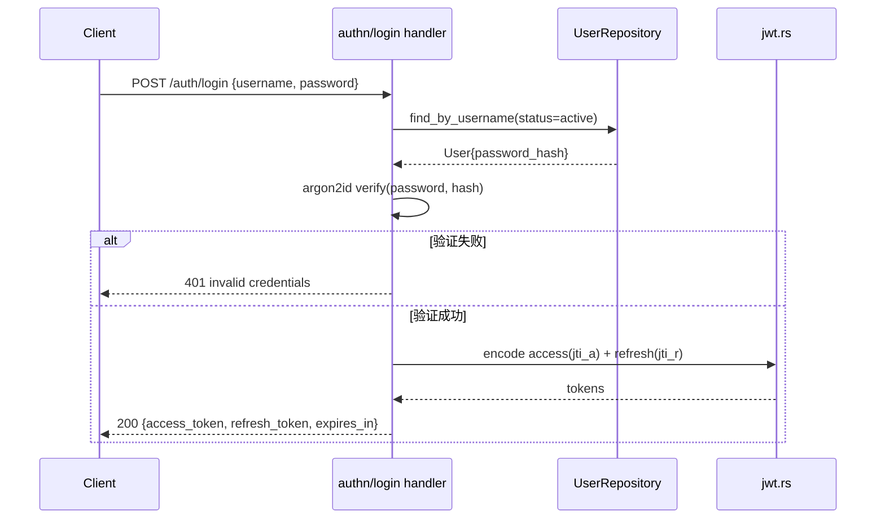
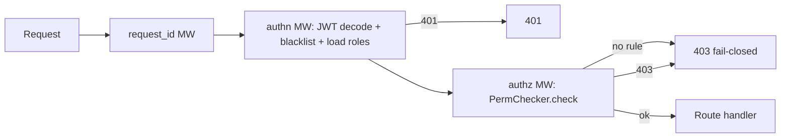
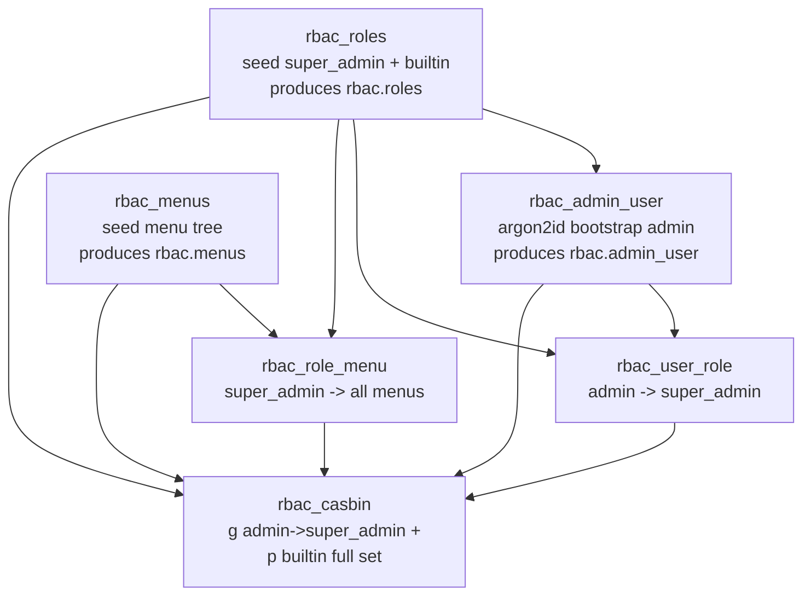
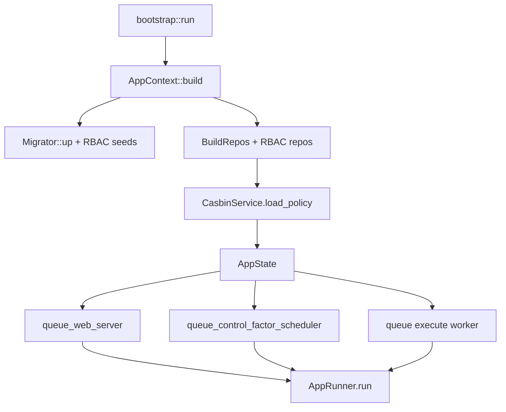

# Phase 6 — Web 服务层 + RBAC 体系（父计划 / Umbrella）

> **状态**: Phase 6.1–6.7 已落地（2026-06）；§19 代码与清单对齐复核完成（2026-06，含 #15 ActingRoleGoverned 落地）。本文档为父计划/总览；具体实现以子 phase 文档 + 代码为准。
>
> **产出**: `oxide-arb-web` crate（actix-web）+ 完整动态 RBAC 体系 + 双轨审计（治理哈希链 + 通用操作日志）+ 治理控制面接线
>
> **前置条件**: Phase 0–4 核心系统可运行；Phase 5.x 治理内核（`ControlFactorRegistry` / 审计链 / scheduler 库）已交付
>
> **验收标准**: JWT 登录签发 access/refresh token；Casbin 资源级授权对每个端点 fail-closed 鉴权；治理变更进入不可变哈希审计链并可校验；所有变更类请求/认证事件进入通用操作日志（`operation_log`）；runtime-config 走治理版本化（非裸 PATCH）；WebSocket 实时推送；生产模式 serve 静态 Vue 文件；全部破坏式变更落地（删除 `OperatorRole`、删除单用户 API-key）

---

## 子 phase 拆分（实施单元）

> 每个子 phase 自带"可编译 + 可测试闭环"，块间停下供 review。逐个推进，前序未通过不进入下一子 phase。

- **[Phase 6.1 — 模型与治理破坏式变更](phase6.1-models-governance-breaking.md)**：workspace 依赖 + `enums/rbac.rs` + `types/ids.rs` + 删除 `OperatorRole`（`actor_role: String`）+ 6 张 RBAC 表 + `operation_log` 表 + argon2id 密码原语 + `config/web.rs` + RBAC seeds（admin 密码写死）。
- **[Phase 6.2 — Repository 层 + Casbin Adapter](phase6.2-repository-rbac-casbin.md)**：RBAC repos + `operation_log` repo + 自写 Casbin adapter（精确匹配，修复 ng-gateway `ptype`-only 去重）。
- **[Phase 6.3 — Web 基座 + 认证](phase6.3-web-foundation-auth.md)**：`oxide-arb-web` 骨架（lib/state/response/error/extractors）+ jwt + argon2id + Redis 黑名单 + authn MW + auth 路由。
- **[Phase 6.4 — 授权 + RBAC 路由](phase6.4-authorization-rbac-routes.md)**：Casbin model/service/checker/rules + authz MW（fail-closed）+ users/roles/menus/permissions + `init_rbac_rules`。
- **[Phase 6.5 — 操作日志中间件 + 治理控制面](phase6.5-operation-log-governance-routes.md)**：`OperationAudit` MW + 异步 writer + control_factors + runtime_config 路由（acting_role + 审计信封）。
- **[Phase 6.6 — 业务路由 + WebSocket + 静态 + Core 接线](phase6.6-business-routes-ws-static-wiring.md)**：业务读写路由 + WS 基础设施（actix-ws，先接非热路径事件）+ SPA 静态 + bootstrap（web task + scheduler tick + execute worker）。
- **[Phase 6.7 — 热路径事件插桩](phase6.7-hotpath-event-instrumentation.md)**：opportunity / trade / pnl emit hooks 接入 WS 事件总线（独立、重点 review）。

## 关键架构决策（父级，子 phase 遵循）

- **双轨审计（不合并）**：`control_factor_audit_event` 保持窄哈希链（仅治理/钱，registry 在事务内原子写入）；新增 `operation_log` 通用活动日志（actix 中间件 + handler 富化、异步缓冲、DB 级 append-only、脱敏、不上哈希链）。治理动作同时出现在两处，`operation_log.governance_audit_event_id` 链接哈希链。依据：合规审计链 ≠ 运维活动日志，哈希链只上关键事件、敏感数据绝不入不可变日志。
- **WS 技术选型**：`actix-ws`（轻量、per-session 订阅 fanout），替代原计划的 `actix-web-actors`。
- **Bootstrap admin**：默认账号密码写死（const）；argon2id 密码原语下沉到 `oxide-arb-models`，seed 运行时哈希、web 登录校验复用同一实现。
- **`super_admin` 旁路**：matcher `g(r.sub, "super_admin")`，subject = 稳定 `user_id`（非 username 字面量）。
- **类型修正**：原计划 `TradeRecord` / `TradeOutcome` 不存在 → 使用 `TradeInfo` / `TradeBusinessOutcome`。

---

## 0. 设计原则（零容忍向前兼容）

本阶段是**直接和钱相关**的控制面，遵循以下硬性原则：

1. **Fail-closed 授权**：未注册 RBAC 规则的路由 **默认拒绝**（修复 ng-gateway 默认放行缺陷）。
2. **强审计**：所有治理类变更进入全局哈希链（`control_factor_audit_event`），`actor / acting_role / request_id / reason` 必填，链上可独立 `verify`。
3. **无向前兼容、无 re-export、无最小变更**：直接重构 / 破坏式变更。删除 `OperatorRole`、删除单用户 API-key、删除裸 PATCH config。
4. **遵循 oxide-arb 约定**：`TypedId(UUID v7)` 主键、`active_string_enum!`（非 SMALLINT）、`#[oxide_schema]` 自动注册 DDL、`SeedSpec` + `SeedContext` 图序播种、`StorageError` 仓储边界、`Arc::clone` 显式共享。
5. **authN/authZ 只在 web 层**：治理内核信任 web 已鉴权，只校验信封字段 + 治理不变量。

---

## 1. 工作范围

1. **认证**：JWT 登录（用户名/密码 → access + refresh token）、刷新、登出黑名单（Redis）、`argon2id` 密码哈希。
2. **授权**：Casbin 动态 RBAC（`g` user→role / `p` role→resource×operation）、路由级规则注册表、`super_admin` 旁路、治理端点 `acting_role` 显式授权。
3. **RBAC 管理**：user / role / menu 的 CRUD + 角色分配 + 权限分配 + 菜单分配。
4. **治理控制面**：control-factor 生命周期（reject/shadow/publish/rollback/emergency）、materialization 触发、runtime-config 版本化、审计链查询、shadow 决策聚合。
5. **业务数据**：system / markets / opportunities / trades / pnl / risk / analytics / replay 的 read 与控制端点。
6. **WebSocket**：实时推送 opportunities / trades / pnl / system / risk，订阅式 fanout。
7. **静态文件**：生产模式 serve Vue 构建产物（SPA fallback）。
8. **进程接线**：web server task、治理 scheduler tick 循环、materialization execute worker。

---

## 2. 核心设计决策

| 维度 | 决策 | 理由 |
|---|---|---|
| 角色模型 | **纯动态 Casbin，删除 `OperatorRole` 枚举** | role 表为动态数据；`role.code` 为字符串；治理端点也走动态 `p` 策略 |
| 超级用户 | `super_admin` 角色码，在 matcher 内 `g(r.sub, "super_admin")` 旁路一切 | 对标 ng-gateway `system_admin`，但基于 **role code + subject=user_id**（非 username 字面量） |
| 权限粒度 | 完整 `ResourceType × Operation` 细粒度，可经 API 给角色分配 | 业务闭环；治理端点叠加 route-level 规则 |
| 关联表 | 显式 join 表 `user_role` + `role_menu`（**不用** ng-gateway 多态 `relation`） | 语义精准；casbin 表只存策略 |
| ID / subject | `UserId/RoleId/MenuId` = `TypedId(UUID v7)`；Casbin subject = 稳定 `user_id` | 改名不失效；符合 oxide-arb 约定 |
| 会话 | access + refresh token + logout 黑名单（Redis）；`argon2id` | 生产级会话管理 |
| 配置变更 | **统一治理版本化**（`create_runtime_config_version` + `activate` + 审计链），删除裸 PATCH/ArcSwap | money-critical，全审计 |

### 2.1 审计归属语义（删除 `OperatorRole` 后）

删除 `OperatorRole` 枚举后，不可变审计链字段 `actor_role` 改为 `String`（role code）。授权采用**显式 acting-role 模型**（比 ng-gateway「任一角色即可」更严、更可审计）：

- 治理类变更端点的请求体必须携带 `acting_role`；
- authZ = `g(user_id, acting_role)` 成立 **且** `has_policy(acting_role, resource, operation)` 成立；
- 审计链 `actor_role` 记录该 `acting_role`（`super_admin` 操作记 `"super_admin"`）；
- 非治理端点（read / RBAC 管理）走常规 `enforce(user_id, ...)`（任一角色即可），不写审计链。

> `OperatorRole` 原本序列化为 snake_case（如 `"risk_owner"`），改为 `String` 后**审计哈希字节格式不变**；且系统无生产审计数据（greenfield），破坏式变更安全。`AuditEventContent` 字段顺序保持不变（顺序是哈希契约）。

---

## 3. 目录结构

```
crates/oxide-arb-web/
├── Cargo.toml
└── src/
    ├── lib.rs                      # spawn_web_server(state, shutdown)
    ├── state.rs                    # AppState { ctx, casbin, perm_checker, jwt, blacklist, repos }
    ├── response.rs                 # WebResponse<T> envelope + Paginated<T>
    ├── error.rs                    # WebError + ResponseError；映射 Registry/Governance/Storage/Rbac/Auth → HTTP
    ├── extractors.rs               # ValidatedJson<T>, Pagination, AuthedActor, RequestId
    ├── jwt.rs                      # Claims, encode/decode access+refresh, jti 黑名单
    ├── auth/
    │   ├── mod.rs
    │   ├── password.rs             # argon2id hash / verify
    │   └── casbin/
    │       ├── mod.rs
    │       ├── model.rs            # CASBIN_MODEL（4-tuple + super_admin 旁路）
    │       ├── service.rs          # CasbinService（CachedEnforcer 封装）
    │       ├── adapter.rs          # SeaOrmAdapter（casbin_rule 表）
    │       ├── checker.rs          # PermChecker 路由规则注册表（fail-closed）
    │       └── rules.rs            # Rule DSL: public / resource_op / acting_role_governed
    ├── middleware/
    │   ├── mod.rs
    │   ├── request_id.rs           # X-Request-Id + tracing span
    │   ├── authn.rs                # JWT 解析 → Claims + 角色加载 → extensions
    │   └── authz.rs               # PermChecker.check(method, matched_path, claims)
    ├── routes/
    │   ├── mod.rs                  # configure() + init_rbac_rules()
    │   ├── health.rs               # /health /ready
    │   ├── metrics.rs              # /metrics (Prometheus)
    │   ├── auth.rs                 # login / refresh / logout / me
    │   ├── users.rs                # 用户 CRUD + 角色分配
    │   ├── roles.rs                # 角色 CRUD + 权限/菜单分配
    │   ├── menus.rs                # 菜单 CRUD + accessible 树
    │   ├── permissions.rs          # 权限目录 + 角色权限查询
    │   ├── system.rs               # 系统控制
    │   ├── markets.rs
    │   ├── opportunities.rs
    │   ├── trades.rs
    │   ├── pnl.rs
    │   ├── risk.rs
    │   ├── analytics.rs
    │   ├── control_factors.rs      # 治理控制面
    │   ├── runtime_config.rs       # 治理版本化配置
    │   └── replay.rs
    ├── ws/
    │   ├── mod.rs
    │   ├── handler.rs              # upgrade + 鉴权
    │   ├── session.rs              # per-connection state
    │   ├── broadcaster.rs          # CoreEvent fanout
    │   └── protocol.rs             # WsMessage / 客户端指令
    └── static_files.rs             # SPA 静态服务
```

---

## 4. Cargo.toml 与 workspace 依赖

### 4.1 新增根 `[workspace.dependencies]`

```toml
actix-web = "4"
actix-cors = "0.7"
actix-files = "0.6"
actix-web-actors = "4"
tracing-actix-web = "0.7"
casbin = { version = "2", features = ["runtime-tokio"] }
jsonwebtoken = "9"
argon2 = "0.5"
# 复用现有：deadpool-redis, redis, sea-orm, validator, uuid, chrono, serde, tokio, flume, thiserror
```

> 实现时以包管理器拉取最新兼容版本核对，确保与现有 `sea-orm = 1` / `tokio = 1` 对齐。**不引入 `sea-orm-adapter`**：自写 Casbin adapter，复用 `casbin_rule` entity 与 oxide-arb repository 约定，避免依赖版本错配。

### 4.2 `crates/oxide-arb-web/Cargo.toml`

```toml
[package]
name = "oxide-arb-web"
description = "HTTP API + WebSocket + RBAC control-plane for oxide-arb"
version.workspace = true
edition.workspace = true
rust-version.workspace = true

[dependencies]
oxide-arb-error = { workspace = true }
oxide-arb-models = { workspace = true }
oxide-arb-control = { workspace = true }
oxide-arb-core = { workspace = true }
oxide-arb-repository = { workspace = true }

actix-web = { workspace = true }
actix-cors = { workspace = true }
actix-files = { workspace = true }
actix-web-actors = { workspace = true }
tracing-actix-web = { workspace = true }
casbin = { workspace = true }
jsonwebtoken = { workspace = true }
argon2 = { workspace = true }
deadpool-redis = { workspace = true }
redis = { workspace = true }

serde = { workspace = true }
serde_json = { workspace = true }
validator = { workspace = true }
rust_decimal = { workspace = true }
chrono = { workspace = true }
uuid = { workspace = true }
sea-orm = { workspace = true }
tokio = { workspace = true }
tokio-util = { workspace = true }
flume = { workspace = true }
tracing = { workspace = true }
thiserror = { workspace = true }
async-trait = { workspace = true }

[dev-dependencies]
actix-rt = { workspace = true }
reqwest = { workspace = true }
testcontainers = { workspace = true }
testcontainers-modules = { workspace = true }
oxide-arb-storage = { workspace = true, features = ["test-util"] }

[lints]
workspace = true
```

---

## 5. 数据模型（oxide-arb-models）

按 `idens/risk_state.rs` 定义 `table()/indexes()/dependencies()/seed_units()`，entity 按 `entities/risk_state.rs`。全部 `#[oxide_schema(lifecycle = "control")]`（与 control_factor 表同生命周期），状态/类型用 `active_string_enum!`，时间戳用 `timestamp_with_write_default`。

### 5.1 表结构

#### `user`
| 列 | 类型 | 约束 |
|---|---|---|
| `id` | `UserId` (uuid, text) | PK |
| `username` | text | NOT NULL, UNIQUE |
| `password_hash` | text | NOT NULL（argon2id PHC string） |
| `nickname` | text | NOT NULL |
| `avatar` | text | NULL |
| `email` | text | NULL |
| `phone` | text | NULL |
| `status` | `UserStatus` | NOT NULL, default `active` |
| `created_at` / `updated_at` | timestamptz | write default |

索引：`uq_user_username (username)`。

#### `role`
| 列 | 类型 | 约束 |
|---|---|---|
| `id` | `RoleId` | PK |
| `code` | text | NOT NULL, UNIQUE（Casbin 策略主体） |
| `name` | text | NOT NULL |
| `description` | text | NULL |
| `kind` | `RoleKind` | NOT NULL（builtin/custom） |
| `status` | `RoleStatus` | NOT NULL, default `enabled` |
| `sort` | integer | NOT NULL, default 0 |
| `created_at` / `updated_at` | timestamptz | |

索引：`uq_role_code (code)`。

#### `menu`
| 列 | 类型 | 约束 |
|---|---|---|
| `id` | `MenuId` | PK |
| `parent_id` | `MenuId` | NULL（根为 NULL） |
| `name` | text | NOT NULL |
| `kind` | `MenuKind` | NOT NULL（directory/menu/button） |
| `path` | text | NULL（前端路由） |
| `component` | text | NULL |
| `title` | text | NOT NULL |
| `icon` | text | NULL |
| `permission_code` | text | NULL（关联 `ResourceType:Operation`，button 级权限点） |
| `sort` | integer | NOT NULL, default 0 |
| `keep_alive` | boolean | NOT NULL, default false |
| `hide_in_menu` | boolean | NOT NULL, default false |
| `status` | `RoleStatus`（复用 enabled/disabled） | |
| `created_at` / `updated_at` | timestamptz | |

索引：`idx_menu_parent (parent_id, sort)`。

#### `user_role`
| 列 | 类型 | 约束 |
|---|---|---|
| `id` | uuid | PK |
| `user_id` | `UserId` | FK → user.id |
| `role_id` | `RoleId` | FK → role.id |
| `created_at` | timestamptz | |

索引：`uq_user_role (user_id, role_id)`、`idx_user_role_role (role_id)`。

#### `role_menu`
| 列 | 类型 | 约束 |
|---|---|---|
| `id` | uuid | PK |
| `role_id` | `RoleId` | FK → role.id |
| `menu_id` | `MenuId` | FK → menu.id |

索引：`uq_role_menu (role_id, menu_id)`。

#### `casbin_rule`
| 列 | 类型 | 约束 |
|---|---|---|
| `id` | bigint | PK auto |
| `ptype` | text | NOT NULL（`p` / `g`） |
| `v0`..`v5` | text | NULL |

索引：`idx_casbin_ptype (ptype)`、`idx_casbin_v0 (v0)`。

`dependencies()`：`user_role` 依赖 `user` + `role`；`role_menu` 依赖 `role` + `menu`（保证 DDL 拓扑顺序）。

### 5.2 新增 enums（`enums/rbac.rs`，`active_string_enum!`）

```rust
active_string_enum! {
    pub enum UserStatus { Active => "active", Disabled => "disabled" }
}
active_string_enum! {
    pub enum RoleKind { Builtin => "builtin", Custom => "custom" }
}
active_string_enum! {
    pub enum RoleStatus { Enabled => "enabled", Disabled => "disabled" }
}
active_string_enum! {
    pub enum MenuKind { Directory => "directory", Menu => "menu", Button => "button" }
}
active_string_enum! {
    /// Resource categories addressable by Casbin `p` policies.
    pub enum ResourceType {
        System => "system", Market => "market", Opportunity => "opportunity",
        Trade => "trade", Pnl => "pnl", Risk => "risk", Blacklist => "blacklist",
        RuntimeConfig => "runtime_config", ControlFactor => "control_factor",
        Publication => "publication", Materialization => "materialization",
        Replay => "replay", Analytics => "analytics", Audit => "audit",
        User => "user", Role => "role", Menu => "menu", Permission => "permission",
    }
}
active_string_enum! {
    /// Operation verbs in Casbin `p` policies.
    pub enum Operation {
        Read => "read", Create => "create", Update => "update", Delete => "delete",
        Assign => "assign", Halt => "halt", Resume => "resume", SwitchMode => "switch_mode",
        Reset => "reset", Reject => "reject", Shadow => "shadow", Publish => "publish",
        Rollback => "rollback", Activate => "activate", Enqueue => "enqueue",
        Emergency => "emergency",
    }
}
```

`RESOURCE_OPERATIONS`：静态 `&[(ResourceType, &[Operation])]` 映射，用于：(a) seed `super_admin` / builtin 角色全量 `p`；(b) 校验角色权限分配请求的合法性（防止分配不存在的 resource×op 组合）。

### 5.3 ID 新类型（`types/ids.rs`）

```rust
/// RBAC user identifier (`usr_<uuid v7>`).
#[derive(TypedId, Debug, Clone, PartialEq, Eq, Hash)]
pub struct UserId(Arc<str>);
/// RBAC role identifier (`rol_<uuid v7>`).
#[derive(TypedId, Debug, Clone, PartialEq, Eq, Hash)]
pub struct RoleId(Arc<str>);
/// RBAC menu identifier (`mnu_<uuid v7>`).
#[derive(TypedId, Debug, Clone, PartialEq, Eq, Hash)]
pub struct MenuId(Arc<str>);
```

各自 `new_v7()` 带前缀。

### 5.4 破坏式变更：删除 `OperatorRole`

- 删除 `enums/control_factor.rs` 中 `OperatorRole`。
- `domain/control_factor/persistence.rs`：`AuditActor.actor_role: String`、`NewControlFactorAuditEvent.actor_role: String`、`ControlFactorAuditEventInfo.actor_role: String`。
- `domain/control_factor/audit.rs`：`AuditEventContent.actor_role: &str`（字段顺序保持 → 哈希契约不变）。
- `entities/control_factor_audit_event.rs`：`actor_role: String`（`#[sea_orm(column_type = "Text")]`）；DDL 列类型保持 `text`。
- 连带同步：`oxide-arb-control/src/materialization/runner.rs`、`oxide-arb-repository`（pg impl + tests）、`oxide-arb-control/tests/governance_snapshot_notify.rs`、`oxide-arb-repository/tests/pg_repository.rs`。

`AuditActor::validate()` 不变（仍校验 actor/request_id/reason 非空）。

---

## 6. 配置（`config/web.rs`，挂入 `Inner.web`）

```rust
#[derive(Debug, Clone, Deserialize)]
pub struct WebConfig {
    pub listen_host: String,          // default "0.0.0.0"
    pub listen_port: u16,             // default 8080
    pub cors_allowed_origins: Vec<String>,
    pub serve_static_ui: bool,
    pub static_ui_dir: String,        // default "static/ui"
    pub jwt: JwtConfig,
    pub bootstrap_admin: BootstrapAdmin,  // 仅首次 seed 使用
}

#[derive(Debug, Clone, Deserialize)]
pub struct JwtConfig {
    pub secret: String,               // env-only 推荐：OXIDE_ARB__WEB__JWT__SECRET
    pub issuer: String,               // default "oxide-arb"
    pub access_ttl_secs: i64,         // default 900 (15m)
    pub refresh_ttl_secs: i64,        // default 604800 (7d)
}

#[derive(Debug, Clone, Deserialize)]
pub struct BootstrapAdmin {
    pub username: String,             // default "admin"
    pub password: String,            // env-only：OXIDE_ARB__WEB__BOOTSTRAP_ADMIN__PASSWORD
}
```

全字段 `#[serde(default)]`，env 覆盖 `OXIDE_ARB__WEB__*`。`Settings::ensure_valid_for_mode`：Live 模式必须配置非默认 `jwt.secret` 与 `bootstrap_admin.password`（fail-closed）。

---

## 7. 认证体系（JWT + argon2id + 黑名单）

### 7.1 Claims

```rust
/// JWT claims. Roles are intentionally NOT embedded — they are loaded at
/// request time so authorization changes take effect without re-login.
#[derive(Debug, Clone, Serialize, Deserialize)]
pub struct Claims {
    pub jti: String,           // unique token id (blacklist key)
    pub sub: String,           // user_id (stable Casbin subject)
    pub iss: String,
    pub iat: i64,
    pub nbf: i64,
    pub exp: i64,
    pub username: String,
    pub token_type: TokenType, // Access | Refresh
}
```

### 7.2 端点

| 方法 | 路径 | 说明 | 鉴权 |
|---|---|---|---|
| POST | `/api/auth/login` | 用户名/密码 → access+refresh | public（需 `Accept-Api-Version: v1`） |
| POST | `/api/auth/refresh` | refresh → 旋转 access+refresh | public（校验 refresh + 黑名单） |
| POST | `/api/auth/logout` | access+refresh jti 入黑名单 | authN only |
| GET | `/api/auth/me` | 当前用户 + 角色 + 可访问菜单 | authN only |

### 7.3 登录序列



### 7.4 黑名单（复用 Redis）

- key：`oxide_arb:jwt:blacklist:<jti>`，value `1`，TTL = token 剩余有效期。
- logout：access+refresh 的 jti 全部写入。
- refresh 旋转：旧 refresh 的 jti 写入（防重放）。
- authN 中间件：每次校验 jti 是否在黑名单 → 命中即 401。

### 7.5 密码哈希（`auth/password.rs`）

`argon2id` 默认参数，PHC string 存 `password_hash`。提供 `hash_password(&str) -> String`、`verify_password(&str, &str) -> bool`。

---

## 8. 授权体系（Casbin 动态，fail-closed）

### 8.1 Casbin model（`auth/casbin/model.rs`）

```text
[request_definition]
r = sub, obj, act, typ

[policy_definition]
p = sub, obj, act, typ

[role_definition]
g = _, _

[policy_effect]
e = some(where (p.eft == allow))

[matchers]
m = g(r.sub, "super_admin") \
 || (p.typ == "resource" && g(r.sub, p.sub) && r.obj == p.obj && r.act == p.act)
```

- `g = (user_id, role_code)`，`p = (role_code, ResourceType, Operation, "resource")`。
- `super_admin` 旁路：matcher 首项 `g(r.sub, "super_admin")`，subject 为稳定 user_id。

### 8.2 CasbinService（`service.rs`）

封装 `casbin::CachedEnforcer`：
- `enforce(user_id, obj, act) -> bool`（typ 固定 `"resource"`）
- `has_role(user_id, role_code) -> bool`
- `has_policy(role_code, obj, act) -> bool`（acting_role 校验用）
- `add_role_for_user / delete_role_for_user`（写 `g`）
- `add_policy / remove_policy`（写 `p`）
- `load_policy()`（分配变更后 reload）

### 8.3 SeaOrm adapter（`adapter.rs`）

实现 `casbin::Adapter`：`load_policy`（`SELECT * FROM casbin_rule` → model）、`add_policy`/`remove_policy`（按 ptype+v0..v5 精确匹配，**修复 ng-gateway 仅按 ptype 去重的粗糙逻辑**）、`save_policy`。复用 `entities::casbin_rule`。

### 8.4 PermChecker 路由规则注册表（`checker.rs`）

```rust
/// Route-level authorization registry. Key = (method, actix matched path).
/// Unregistered protected routes are DENIED (fail-closed), fixing the
/// ng-gateway default-allow defect.
pub struct PermChecker {
    rules: HashMap<(Method, String), Rule>,
}

impl PermChecker {
    pub async fn check(&self, method: &Method, path: &str, claims: &Claims,
                       roles: &ActorRoles, casbin: &CasbinService) -> Result<(), WebError> {
        // super_admin bypass
        if roles.contains("super_admin") { return Ok(()); }
        match self.rules.get(&(method.clone(), path.to_owned())) {
            None => Err(WebError::Forbidden), // fail-closed
            Some(rule) => rule.evaluate(claims, roles, casbin).await,
        }
    }
}
```

### 8.5 Rule DSL（`rules.rs`）

- `public()` — 跳过 authZ（仅 health/metrics/login/refresh）。
- `resource_op(ResourceType, Operation)` — `casbin.enforce(user_id, obj, act)`（任一角色）。
- `acting_role_governed(ResourceType, Operation)` — 治理变更：
  1. 从 body 取 `acting_role`（缺失 → 400）；
  2. `casbin.has_role(user_id, acting_role)`（否 → 403）；
  3. `casbin.has_policy(acting_role, obj, act)`（否 → 403）；
  4. 通过后将 `acting_role` 注入请求 extensions 供 handler 构造审计信封。

### 8.6 鉴权链路



---

## 9. Seed（GraphOrdered RBAC 图）

按 `seed/risk_engine_state.rs` 模式，新增 `seed/rbac/*.rs`，`SeedConflictPolicy::GraphOrdered`，用 `SeedContext` 传递 ID。复用现有 `m20250601_000003_initial_seed` 第 3 lane（topological runner 已就绪）。



种子单元（`SeedSpec`，各表 `seed_units()` 返回）：
1. `rbac.roles.bootstrap` — `produces: Artifact("rbac.roles")`（role code → RoleId 映射写入 ctx）。
2. `rbac.menus.bootstrap` — `produces: Artifact("rbac.menus")`。
3. `rbac.admin_user.bootstrap` — `depends_on: [Seed(rbac.roles)]`；密码 = `argon2id(config.web.bootstrap_admin.password)`；`produces: Artifact("rbac.admin_user")`。
4. `rbac.user_role.bootstrap` — `depends_on: roles + admin_user`。
5. `rbac.role_menu.bootstrap` — `depends_on: roles + menus`。
6. `rbac.casbin.bootstrap` — `depends_on: [全部上游]`；写 `g(admin_id, "super_admin")` + 各 builtin 角色 `p` 全集（`RESOURCE_OPERATIONS`）；`conflict_policy: GraphOrdered`。

> 幂等：`seed_application` ledger 按 `(id, version, checksum)`；改种子数据需 bump version/checksum。`InsertIfAbsent` 语义保证 admin 密码不被 re-migration 覆盖。

---

## 10. Repository 层（oxide-arb-repository）

按 `PgRiskStateRepository` 模式（`StorageError` 边界、`New*`/DTO 入参、`DatabaseConnection`、`with_txn` 变体）。新增 `traits/rbac/` + `postgres/rbac/`：

- `UserRepository`：`find_by_username`、`find_by_id`、`create`、`update`、`delete`、`change_status`、`change_password`、`page`。
- `RoleRepository`：`list`、`find_by_id`、`find_by_code`、`create`、`update`、`delete`、`change_status`。
- `MenuRepository`：`tree`、`accessible_for_roles(role_ids)`、CRUD。
- `UserRoleRepository`：`assign`、`revoke`、`list_roles_for_user`（**事务内同步 casbin `g`**）。
- `RoleMenuRepository`：`assign`、`revoke`、`list_menus_for_role`。
- `RolePermissionRepository`（逻辑层，写 casbin `p`）：`assign_permissions(role_code, &[(ResourceType, Operation)])`、`list_permissions(role_code)`。
- `CasbinRepository`：供 adapter 直接读写 `casbin_rule`。

**事务一致性**：user-role（`g`）与 role-permission（`p`）的 DB 写入与 enforcer reload 在同一边界内完成（分配成功后 `casbin.load_policy()`）。

接入 `BuildRepos`（`app/build.rs`）并通过新 `WebBundle` 暴露给 web。

---

## 11. 路由全表 + 权限映射

> **API 版本化（已落地）**：路径**不含** `/v1` 前缀；客户端在每次 `/api/*` 请求携带 `Accept-Api-Version: v1`（兼容 fallback：`X-API-Version: v1`）。探针 `/health`、`/ready`、`/metrics` 无版本头。未匹配版本 → 404。
>
> 全部 `/api/*`（除 public auth login/refresh、WS）经 authN + authz；`init_rbac_rules` 注册规则；未注册 = 拒绝（403 fail-closed）。

### 11.1 公开（public）
- `GET /health`、`GET /ready`（PG + Redis 探活）、`GET /metrics`（Prometheus text，同 web 端口）
- `POST /api/auth/login`、`POST /api/auth/refresh`（需 `Accept-Api-Version: v1`）

### 11.2 账户（authN only）
- `POST /auth/logout`、`GET /auth/me`

### 11.3 RBAC 管理（`resource_op`）
| 端点 | 方法 | 权限 |
|---|---|---|
| `/users` | GET/POST | `User:Read` / `User:Create` |
| `/users/{id}` | GET/PUT/DELETE | `User:Read/Update/Delete` |
| `/users/{id}/status` | PUT | `User:Update` |
| `/users/{id}/password` | PUT | `User:Update` |
| `/users/{id}/roles` | POST | `User:Assign` |
| `/roles` | GET/POST | `Role:Read/Create` |
| `/roles/{id}` | GET/PUT/DELETE | `Role:Read/Update/Delete` |
| `/roles/{id}/permissions` | GET/POST | `Permission:Read` / `Role:Assign` |
| `/roles/{id}/menus` | POST | `Role:Assign` |
| `/menus` | GET/POST | `Menu:Read/Create` |
| `/menus/{id}` | PUT/DELETE | `Menu:Update/Delete` |
| `/menus/accessible` | GET | authN only（按当前用户角色过滤） |
| `/permissions/catalog` | GET | `Permission:Read` |

### 11.4 治理控制面（`acting_role_governed`，进审计链）
| 端点 | 方法 | 权限 | 治理调用 |
|---|---|---|---|
| `/control-factors` 系列 | GET | `ControlFactor:Read` | 只读 |
| `/control-factors/{id}/reject` | POST | `ControlFactor:Reject` | `registry.reject_factor` |
| `/control-factors/publications/shadow` | POST | `ControlFactor:Shadow` | `registry.promote_to_shadow`（body: `factor_ids[]`） |
| `/control-factors/publications/publish` | POST | `ControlFactor:Publish` | `registry.publish`（risk-expansion gate） |
| `/control-factors/publications/emergency` | POST | `ControlFactor:Emergency` | `registry.publish`（short-TTL） |
| `/control-factors/publications/{id}/rollback` | POST | `Publication:Rollback` | `registry.rollback_publication` |
| `/control-factors/audit` | GET | `Audit:Read` | `load_audit_chain` + `AuditChain::verify` |
| `/control-factors/publications/{id}/shadow-decisions` | GET | `ControlFactor:Read` | `list/aggregate_shadow_decisions` |
| **`/replay`** | **POST** | **`Replay:Create`** | **`ReplayPort::enqueue`（materialization / backfill run）** |
| `/replay/{run_id}` | GET | `Replay:Read` | materialization run 状态 |
| `/replay/{run_id}/history` | GET | `Replay:Read` | stage report 历史 |

> **Materialization enqueue 路由语义（6.6 修正）**：不再使用独立 `/control-factor-materializations`。Operator 触发的 backfill / replay materialization 与 analytics replay 共用 **`POST /api/replay`**（`Replay:Create`），由 core `ReplayPort` 入队 `control_factor_materialization_run`。Scheduler tick 仍走进程内 `MaterializationScheduler::tick`（enqueue-only，never publish）。

### 11.5 治理版本化配置（替代裸 PATCH）
| 端点 | 方法 | 权限 | 调用 |
|---|---|---|---|
| `/runtime-config` | GET | `RuntimeConfig:Read` | 当前激活版本 |
| `/runtime-config/versions` | GET/POST | `RuntimeConfig:Read` / `RuntimeConfig:Create` | `create_runtime_config_version` |
| `/runtime-config/versions/{id}/activate` | POST | `RuntimeConfig:Activate` | `activate_runtime_config_version` |
| `/runtime-config/versions/{id}/rollback` | POST | `RuntimeConfig:Rollback` | `activate_runtime_config_version`（rollback kind） |

### 11.6 业务 read / 控制（`resource_op`）
- `system`：`GET /system/status`(`System:Read`)、`POST /system/halt`(`System:Halt`)、`POST /system/resume`(`System:Resume`)、`POST /system/mode`(`System:SwitchMode`)、`GET /system/health`(`System:Read`)
- `markets`：list/detail/book(`Market:Read`)、subscribe/unsubscribe(`Market:Update`)
- `opportunities`：recent/history/detail/stats(`Opportunity:Read`)
- `trades` / `pnl`：list/detail/decisions/pnl*(`Trade:Read` / `Pnl:Read`)
- `risk`：circuit-breaker/positions/exposure/daily-loss(`Risk:Read`)、circuit-breaker/reset(`Risk:Reset`, **`ActingRoleGoverned`**)、blacklist GET(`Blacklist:Read`)/POST create(`Blacklist:Create`, **`ActingRoleGoverned`**)/POST `{market_id}/remove`(`Blacklist:Delete`, **`ActingRoleGoverned`**)
- `analytics`：daily/weekly/edge-distribution/market-performance(`Analytics:Read`)
- `replay`：POST enqueue(`Replay:Create`, **`ActingRoleGoverned`**)、GET status/history(`Replay:Read`) — **见 §11.4 materialization enqueue 语义**

### 11.7 WebSocket / 静态
- `GET /api/ws?token=<access>`：upgrade 前 JWT + 黑名单校验（query token，非 Bearer header）。
- 生产：`actix-files` serve `static_ui_dir` + SPA fallback。

---

## 12. 治理控制面接线（Phase 5.5 交接）

### 12.1 职责分层（必须遵守）
| 层 | 归属 | 职责 |
|---|---|---|
| authN | `oxide-arb-web` authn MW | JWT → Claims（actor=user_id） |
| authZ | `oxide-arb-web` Casbin | 路由级 + 治理 acting_role |
| 变更信封 | `oxide-arb-web` handler | `AuditActor { actor, actor_role, request_id, reason }`（publish 带 `idempotency_key`） |
| 治理门控 | `ControlFactorRegistry` | risk-expansion / rollback target / `validate()` |
| 原子状态机 + 审计链 | `ControlFactorRepository` | 一事务校验+状态变更+全局哈希链 append |

### 12.2 mutating handler 骨架

```rust
// authZ 已由 authz MW + acting_role_governed 规则完成
let acting_role = req.extensions().get::<ActingRole>()?.0.clone();
let envelope = AuditActor {
    actor: claims.sub.clone(),          // user_id
    actor_role: acting_role,            // String（acting_role；super_admin 记 "super_admin"）
    request_id: request_id(&req),       // X-Request-Id / 生成
    reason: body.reason.clone(),        // 必填，空 → 400
};
let outcome = state.ctx.control.registry.publish(envelope, request).await
    .map_err(WebError::from)?;
```

### 12.3 `ControlFactorRegistry` API（已交付，web 调用）
- `reject_factor(envelope, &factor_id) -> Option<ControlFactorValueInfo>`
- `promote_to_shadow(envelope, PublicationRequest) -> PublishPublicationOutcome`
- `publish(envelope, PublicationRequest) -> PublishPublicationOutcome`
- `rollback_publication(envelope, &active_id, &target_id) -> ControlFactorPublicationInfo`
- `expire_due_factors(envelope) -> ExpireFactorsOutcome`
- `create_runtime_config_version(envelope, NewRuntimeConfigVersion) -> RuntimeConfigVersionInfo`
- `activate_runtime_config_version(envelope, NewRuntimeConfigActivation) -> RuntimeConfigActivationInfo`
- materialization enqueue 不在 registry：经 **`POST /api/replay`** → core `ReplayPort::enqueue` / `ControlFactorRepository::enqueue_materialization_run`；scheduler tick 进程内 enqueue-only
- 只读：`repo.load_active_publication`、`repo.load_audit_chain`、`shadow_repo.list/aggregate_shadow_decisions`

### 12.4 error → HTTP 映射（`error.rs`）
| 错误 | HTTP |
|---|---|
| `AuthError`（invalid/expired/blacklisted） | 401 |
| authz 拒绝 / `GovernanceError::RiskExpansionNotApproved` | 403 |
| `GovernanceError::MissingReason` / `MissingField` / validation | 400 |
| `RollbackTargetMissing` / `FactorNotReadyForPublication` / `FactorSetMismatch` / `EmptyPublication` / `PublicationLockConflict` / `IdempotencyConflict` | 409 |
| `PublishPublicationOutcome::AlreadyApplied`（幂等重放） | 200（返回已存在 publication） |
| `StorageError::NotFound` / `RbacError::NotFound` | 404 |
| `RbacError::Duplicate` | 409 |
| `AuditChain(_)` / 其他 `Storage(_)` | 500 |

### 12.5 Scheduler / execute worker 接线（进程层）
- `oxide-arb-core` 增 `oxide-arb-control` 依赖（control 不依赖 core hot path，无循环）。
- `app/mod.rs` 新增 `queue_control_factor_scheduler()`：用 `PeriodicTask` 每 interval 调 `MaterializationScheduler::tick(Utc::now())`（enqueue-only、`run_dedupe_key` 去重）。
- **execute worker**：独立 `PeriodicTask`/消费循环轮询 `Queued` run → `MaterializationRunner::execute_run`。
- `SchedulerCycleReport::alerts`（`Overdue` / `Stale`）映射到现有 `AlertDispatcher`。
- `SchedulePolicy` 来源：runtime config / `config/oxide-arb.toml`（`production_default` 仅缺省）；`created_by` / `code_git_sha` 写 manifest。
- never-publish 保证：scheduler 只走 `latest_run_for_schedule` + `enqueue_materialization_run`（单测断言 `publish_calls() == 0`）。

### 12.6 Live refresher 接触点
publish/rollback 后，`oxide-arb-core/src/control/factor_refresher.rs` 经 `notify_handle()` 被唤醒（registry 已配 `with_snapshot_refresh_notify`），轮询兜底；web 无需额外实现。

---

## 13. WebSocket

### 13.1 连接与鉴权
`GET /api/ws?token=<access>`：upgrade 前复用 authN 逻辑校验 JWT + 黑名单（**修复 ng-gateway WS 无鉴权缺陷**）。缺失/空 token → 401（非 400）。

### 13.2 消息 envelope（JSON）
```json
{ "type": "event_type", "timestamp": "2025-01-15T10:30:00.000Z", "data": { } }
```

### 13.3 服务端推送类型
`opportunity.detected`、`trade.filled/settled`、`pnl.update`、`system.status/alert`、`risk.circuit_breaker/position_update`、`market.book_update/resolved`、`control.published/rolled_back`、`config.activated`。

> Phase 6.7 落地: 删除 `trade.opened`（单笔 FOK 无驻留挂单）与 `opportunity.expired`（无真实领域过期源）。`pnl.update.total` = 终身累计已实现 PnL（持久化于 `risk_engine_state.total_realized_pnl`，重启安全，纯遥测）。

### 13.4 客户端指令
```json
{ "action": "subscribe", "channel": "market.book", "market_id": "0x..." }
{ "action": "unsubscribe", "channel": "market.book", "market_id": "0x..." }
{ "action": "sync" }
{ "action": "ping" }
```

### 13.5 Broadcaster
核心子系统经 `flume::Sender<CoreEvent>` 发事件；`WsBroadcaster`（专用 tokio task）消费并按每 session 订阅 fanout。心跳：服务端每 15s ping，30s 无 pong 断开。连接后立即推 `system.status` 快照；`sync` 返回全量（持仓/熔断/最近 opportunities/当日 PnL）。

```rust
pub enum CoreEvent {
    OpportunityDetected(Opportunity),
    TradeFilled(TradeInfo),
    TradeSettled { trade_id: TradeId, outcome: TradeBusinessOutcome, pnl: Usd },
    PnlUpdate { daily: Usd, total: Usd },
    SystemStatusChanged(SystemStatus),
    CircuitBreakerTripped { level: u8, reason: String },
    PositionChanged(PositionInfo),
    MarketBookUpdate { market_id: MarketId, view: Box<MarketBookView> },
    MarketResolved { market_id: MarketId, outcome: bool },
    ControlPublished { publication_id: String, mode: PublicationMode },
    ConfigActivated { version_id: String },
    Alert { level: AlertLevel, message: String },
}
```

---

## 14. 静态文件

生产模式 `actix-files::Files::new("/", static_ui_dir).index_file("index.html")`，`default_handler` 对所有非 API 路由回退 `index.html`（Vue Router 客户端路由）。启动检测目录存在则注册，否则仅 API 模式。

---

## 15. 响应 envelope

成功：`{ "code": 200, "message": "ok", "data": {...} }`
错误：`{ "code": 400, "message": "...", "data": null }`
分页：`{ "code": 200, "message": "ok", "data": { "items": [], "total": 1234, "page": 1, "size": 50, "has_next": true } }`

```rust
#[derive(Debug, thiserror::Error)]
pub enum WebError {
    #[error("unauthorized: {0}")] Unauthorized(String),
    #[error("forbidden")] Forbidden,
    #[error("not found: {0}")] NotFound(String),
    #[error("bad request: {0}")] BadRequest(String),
    #[error("conflict: {0}")] Conflict(String),
    #[error("internal error: {0}")] Internal(String),
    #[error("service unavailable: {0}")] ServiceUnavailable(String),
}
```

`impl ResponseError for WebError`：`status_code()` 按上表；`error_response()` 输出统一 envelope。`From<RegistryError>` / `From<GovernanceError>` / `From<StorageError>` / `From<RbacError>` / `From<AuthError>` 实现 §12.4 映射。

---

## 16. AppContext / bootstrap 接线（oxide-arb-core）

- `app/build.rs`：`BuildRepos` 增 RBAC repos；构造 `CasbinService`（连 PG adapter，`load_policy()`）；组装 `AppState`；新增 `WebBundle` 暴露 web 依赖。
- `app/mod.rs`：新增 `queue_web_server()`（`pending_tasks.push(TaskId::WebServer, |shutdown| spawn_web_server(state, shutdown))`）+ `queue_control_factor_scheduler()` + execute worker。
- `task_registry.rs`：`TaskId::WebServer` 注册 `ShutdownStage`（早于 detection 关停，先停止对外接受请求）。
- `bootstrap.rs`：`AppContext::build` 后依次 `ctx.queue_web_server()` / `ctx.queue_control_factor_scheduler()`。



---

## 17. 破坏式变更清单（零兼容）

- 删除 `OperatorRole` 枚举（8 文件：enums/control_factor、domain/persistence、domain/audit、entities/audit_event、control/runner、repository pg+tests、control tests）。
- 审计 `actor_role`：`OperatorRole → String`。
- 删除原单用户 API-key（`ApiKeyAuth` / `Settings.keys.api_key`）— 改为 JWT。
- 删除原裸 `PATCH /api/v1/config` + `ArcSwap<RuntimeConfig>` 即时热更 — 改为治理版本化。
- 关联表用显式 join（不引入 `relation` 多态表）。
- 以上均无生产数据依赖（greenfield）。

---

## 18. 测试策略

- **models**：`active_string_enum` round-trip；`RESOURCE_OPERATIONS` 完整性；删除 `OperatorRole` 后审计哈希与既有测试向量一致（`actor_role: String` 序列化等价）。
- **repository（testcontainers PG）**：RBAC CRUD；user-role/role-menu 事务一致性；casbin adapter `load/save/add/remove` 精确匹配；权限分配后 enforce 生效。
- **web（actix test + PG + Redis）**：login/refresh/logout（含黑名单重放拒绝；Redis 经 `deadpool-redis` 显式池配置 + 启动 readiness PING）；authz 矩阵（每端点正确角色放行 / 越权 403 / 未注册路由 403）；`super_admin` 旁路；治理端点 `acting_role` 校验 + 审计链 append + `AuditChain::verify`；risk/replay governed 变更；runtime-config 版本化幂等（`AlreadyApplied → 200`）。优先 `cargo test-docker`（`--test-threads=1`）。
- **migration**：`migration_pg` 断言 RBAC seed 计数 + topological 顺序 + admin 不被 re-migration 覆盖。
- **scheduler**：`tick` enqueue-only、`publish_calls() == 0`。

---

## 19. 验收清单

- [x] 删除 `OperatorRole`，全 workspace 编译通过，审计链测试通过。
- [x] `POST /auth/login` argon2id 校验 + 签发 access/refresh。
- [x] `POST /auth/refresh` 旋转并将旧 refresh 入黑名单。
- [x] `POST /auth/logout` 后旧 token 被拒（401）。
- [x] 未注册路由返回 403（fail-closed）。
- [x] `super_admin` 旁路全部端点。
- [x] 角色权限/菜单分配落 casbin `p`/`g` + `role_menu` 并即时生效。
- [x] 治理端点缺 `reason` → 400；缺/越权 `acting_role` → 400/403（`X-Acting-Role` header）。
- [x] publish/rollback 进审计链且 `AuditChain::verify` 通过。
- [x] runtime-config 仅经版本化变更（无裸 PATCH 路径）。
- [x] scheduler tick 周期 enqueue；execute worker 处理 Queued run；`Overdue/Stale` 告警分发。
- [x] WebSocket upgrade 前鉴权；订阅 fanout；心跳超时断开。
- [x] 生产模式 serve 静态 Vue + SPA fallback（`serve_static_ui` gated）。
- [x] 全端点 request-id tracing；统一 envelope。
- [x] 高风险 runtime 控制（circuit-breaker reset / blacklist / replay enqueue）走 `ActingRoleGoverned`。（2026-06 代码复核闭合）
- [ ] JWT 黑名单 Redis 连接池可观测（`/metrics` gauges + pressure counters）。不在本次范围；运行时健康依赖 `TokenBlacklist::health_check` + `GET /ready`。

---

## 20. 实施顺序

1. 根 `Cargo.toml` workspace 依赖。
2. models：`enums/rbac.rs` + `types/ids.rs`（UserId/RoleId/MenuId）。
3. **删除 `OperatorRole`** + 审计 `actor_role: String`（连带 control/repository/tests）。
4. models：RBAC idens + entities（6 表）。
5. `config/web.rs` + `Inner.web` + `ensure_valid_for_mode`。
6. RBAC seeds（GraphOrdered 图）。
7. repository：RBAC traits + pg impl（含 casbin 同步）。
8. web crate 骨架：lib/state/response/error/extractors。
9. web 认证：jwt + argon2id + authn MW + auth 路由。
10. web 授权：casbin model/adapter/service/checker/rules + authz MW。
11. web RBAC 路由：users/roles/menus/permissions + `init_rbac_rules`。
12. web 治理路由：control_factors + runtime_config（acting_role + 审计信封）。
13. web 业务路由：system/markets/opportunities/trades/pnl/risk/analytics/replay。
14. web ws + static。
15. core 接线：build.rs/AppState/queue_web_server + scheduler tick + execute worker。
16. 测试全量。
