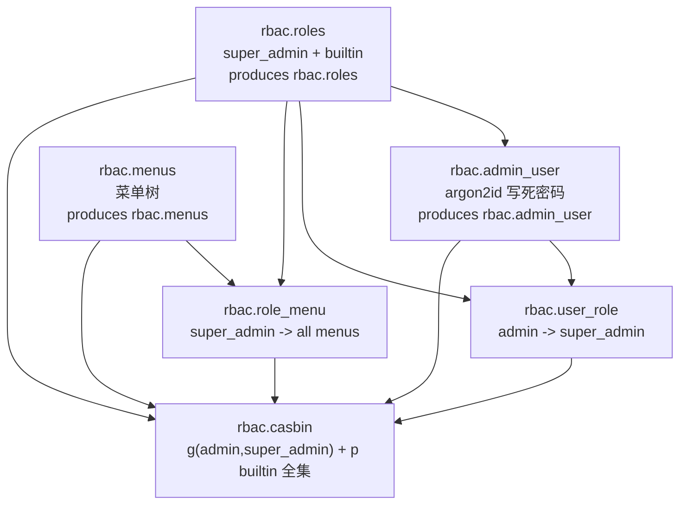

# Phase 6.1 — 模型与治理破坏式变更

> **状态**: Production Design Target
> **父计划**: `docs/plans/phase6-web-layer.md`
> **前置依赖**: Phase 5.x 治理内核已交付（`ControlFactorRegistry` / 审计哈希链 / scheduler 库）
> **覆盖父计划章节**: §4.1, §5, §6, §9, §17（破坏式变更清单）
> **目标**: 在 `oxide-arb-models` 落地 RBAC + 操作日志的全部领域模型、ID、枚举、表结构、seed，并完成 `OperatorRole → String` 破坏式变更（保持审计哈希字节契约不变）。下沉 argon2id 密码原语。本子 phase **不引入 web 框架、不写 repository**。

---

## 0. 工作范围

### 0.1 交付物

| 交付物 | 位置 | 说明 |
|---|---|---|
| workspace 依赖 | 根 `Cargo.toml` | actix/casbin/jwt/argon2 等先登记 `[workspace.dependencies]`（本子 phase 仅用到 argon2） |
| RBAC 枚举 | `enums/rbac.rs` | `UserStatus` / `RoleKind` / `RoleStatus` / `MenuKind` / `ResourceType` / `Operation` + `RESOURCE_OPERATIONS` |
| 操作日志枚举 | `enums/operation_log.rs` | `OperationCategory` / `OperationOutcome` |
| Typed IDs | `types/ids.rs` | `UserId` / `RoleId` / `MenuId` / `UserRoleId` / `RoleMenuId` / `OperationLogId` |
| 密码原语 | `security/password.rs` | argon2id `hash_password` / `verify_password`（seed + web 共用） |
| 删除 `OperatorRole` | 7 文件 | `actor_role: OperatorRole → String`（哈希契约不变） |
| RBAC 表 | `idens/` + `entities/` | `user` / `role` / `menu` / `user_role` / `role_menu` / `casbin_rule` |
| 操作日志表 | `idens/operation_log.rs` + `entities/operation_log.rs` | `operation_log`（append-only，禁 UPDATE/DELETE 触发器） |
| Web 配置 | `config/web.rs` | `WebConfig` + `JwtConfig`，挂入 `Inner.web`，`ensure_valid_for_mode` Live 校验 jwt secret |
| RBAC seeds | `seed/rbac/*.rs` | roles / menus / admin_user / user_role / role_menu / casbin（GraphOrdered + `SeedContext`） |
| 领域 DTO | `domain/rbac/*.rs` + `domain/operation_log.rs` | `New*` / `*Info` 入参/读模型（供 6.2 repository 使用） |

### 0.2 非目标

- 不创建 `oxide-arb-web` crate、不写任何 actix 代码。
- 不写 repository（trait/pg impl）— 归 6.2。
- 不写 Casbin adapter / service — 归 6.2/6.4。
- 不接线 core / bootstrap — 归 6.6。

---

## 1. workspace 依赖（根 `Cargo.toml`）

新增 `[workspace.dependencies]`（按包管理器拉取最新兼容版本核对，确保与 `sea-orm = 1` / `tokio = 1` 对齐）：

```toml
actix-web = "4"
actix-cors = "0.7"
actix-files = "0.6"
actix-ws = "0.3"            # 取代 actix-web-actors（轻量 WS）
tracing-actix-web = "0.7"
casbin = { version = "2", features = ["runtime-tokio"] }
jsonwebtoken = "9"
argon2 = "0.5"
```

本子 phase **仅 `argon2`** 被实际使用（`oxide-arb-models` 新增依赖）。其余在后续子 phase 引入对应 crate 时启用。

> 不引入 `sea-orm-adapter`：6.2 自写 Casbin adapter，复用 `casbin_rule` entity 与 oxide-arb repository 约定，避免版本错配。

---

## 2. Typed IDs（`types/ids.rs`）

遵循现有约定：`#[derive(TypedId, Debug, Clone, PartialEq, Eq, Hash)]` + 手写 `new_v7()` 带前缀（宏不生成 `new_v7`，参考 `ControlFactorId`）。

```rust
/// RBAC user identifier (`usr_<uuid v7>`).
#[derive(TypedId, Debug, Clone, PartialEq, Eq, Hash)]
pub struct UserId(Arc<str>);
/// RBAC role identifier (`rol_<uuid v7>`).
#[derive(TypedId, Debug, Clone, PartialEq, Eq, Hash)]
pub struct RoleId(Arc<str>);
/// RBAC menu identifier (`mnu_<uuid v7>`).
#[derive(TypedId, Debug, Clone, PartialEq, Eq, Hash)]
pub struct MenuId(Arc<str>);
/// user_role join-row identifier (`url_<uuid v7>`).
#[derive(TypedId, Debug, Clone, PartialEq, Eq, Hash)]
pub struct UserRoleId(Arc<str>);
/// role_menu join-row identifier (`rml_<uuid v7>`).
#[derive(TypedId, Debug, Clone, PartialEq, Eq, Hash)]
pub struct RoleMenuId(Arc<str>);
/// operation-log row identifier (`opl_<uuid v7>`).
#[derive(TypedId, Debug, Clone, PartialEq, Eq, Hash)]
pub struct OperationLogId(Arc<str>);
```

各类型 `impl { pub fn new_v7() -> Self { Self(Arc::from(format!("<prefix>_{}", Uuid::now_v7()).as_str())) } }`。

> Casbin subject = 稳定 `user_id`（含前缀的字符串）。改名/改 username 不失效。

---

## 3. 枚举（`enums/rbac.rs` + `enums/operation_log.rs`，`active_string_enum!`）

`active_string_enum!` 生成 `Display`/`as_str`/serde(snake_case)/sea-orm `DeriveActiveEnum(Text)`，**不生成 `FromStr`**。Casbin 策略以字符串存储 `p = (role_code, resource, operation, "resource")`；从 `casbin_rule` 反查权限目录时需把字符串 → 枚举，因此为 `ResourceType` / `Operation` **额外实现 `FromStr`**（或 `TryFrom<&str>`），错误归 `OxideError`/`RbacError::UnknownPermission`。

```rust
active_string_enum! {
    pub enum UserStatus { Active => "active", Disabled => "disabled" }
}
active_string_enum! {
    pub enum RoleKind { Builtin => "builtin", Custom => "custom" }
}
active_string_enum! {
    pub enum RoleStatus { Enabled => "enabled", Disabled => "disabled" }
}
active_string_enum! {
    pub enum MenuKind { Directory => "directory", Menu => "menu", Button => "button" }
}
active_string_enum! {
    /// Resource categories addressable by Casbin `p` policies.
    pub enum ResourceType {
        System => "system", Market => "market", Opportunity => "opportunity",
        Trade => "trade", Pnl => "pnl", Risk => "risk", Blacklist => "blacklist",
        RuntimeConfig => "runtime_config", ControlFactor => "control_factor",
        Publication => "publication", Materialization => "materialization",
        Replay => "replay", Analytics => "analytics", Audit => "audit",
        OperationLog => "operation_log",
        User => "user", Role => "role", Menu => "menu", Permission => "permission",
    }
}
active_string_enum! {
    /// Operation verbs in Casbin `p` policies.
    pub enum Operation {
        Read => "read", Create => "create", Update => "update", Delete => "delete",
        Assign => "assign", Halt => "halt", Resume => "resume", SwitchMode => "switch_mode",
        Reset => "reset", Reject => "reject", Shadow => "shadow", Publish => "publish",
        Rollback => "rollback", Activate => "activate", Enqueue => "enqueue",
        Emergency => "emergency",
    }
}
```

`operation_log` 专用枚举：

```rust
active_string_enum! {
    /// Coarse grouping of an audited HTTP operation.
    pub enum OperationCategory {
        Auth => "auth", Rbac => "rbac", Governance => "governance",
        RuntimeConfig => "runtime_config", System => "system", Risk => "risk",
        Market => "market", Replay => "replay", Other => "other",
    }
}
active_string_enum! {
    /// Outcome of an audited operation.
    pub enum OperationOutcome { Success => "success", Failure => "failure", Denied => "denied" }
}
```

### 3.1 `RESOURCE_OPERATIONS`

静态映射 `pub static RESOURCE_OPERATIONS: &[(ResourceType, &[Operation])]`，是权限体系的**单一事实源**，用途：

1. seed `super_admin` / builtin 角色全量 `p`（6.1）。
2. 校验「角色权限分配」请求合法性（防止分配不存在的 resource×op 组合）（6.4）。
3. `/permissions/catalog` 端点输出权限目录（6.4）。

每个 `ResourceType` 映射其允许的 `Operation` 子集（如 `System → [Read, Halt, Resume, SwitchMode]`、`ControlFactor → [Read, Reject, Shadow, Publish, Emergency]`、`User → [Read, Create, Update, Delete, Assign]`）。映射与 §11 路由权限表逐一对应（在 6.4 最终对齐）。

测试：`RESOURCE_OPERATIONS` 覆盖所有 `ResourceType`；无重复；`Operation` 子集合法。

---

## 4. 密码原语（`security/password.rs`，argon2id）

下沉到 `oxide-arb-models`，**seed 与 web 共用**（seed 在 models/storage 迁移期运行，无法依赖 web）：

```rust
/// Hash a plaintext password with argon2id default params, returning a PHC string.
pub fn hash_password(plaintext: &str) -> Result<String, PasswordError>;
/// Verify a plaintext against a stored argon2id PHC string. Never panics.
pub fn verify_password(plaintext: &str, phc: &str) -> bool;
```

- argon2id 默认参数；PHC string 存 `user.password_hash`。
- `verify_password` 失败/格式错误一律返回 `false`（fail-closed，不 panic）。
- 错误类型 `PasswordError` 归 `oxide-arb-error`（或 `OxideError` 子类）。

> 默认 admin 密码在 seed 中**写死为常量**，由 `hash_password` 运行时哈希（随机 salt、单一实现、无魔法 const）。安全提示见 §7.3。

---

## 5. 破坏式变更：删除 `OperatorRole`

### 5.1 字节契约（已验证）

`AuditEventContent`（`domain/control_factor/audit.rs`）经 `CanonicalDigest::blake3_json` 序列化。`OperatorRole` serde 为 snake_case 字符串（`"operator"` 等），`&str`/`String` 序列化为**同一 JSON 字符串** → 哈希字节不变。审计测试 `sealed_event` 为**动态重算哈希**（非硬编码向量），改类型后仍通过。greenfield 无生产审计数据。**字段顺序保持不变**（顺序是哈希契约）。

### 5.2 改动清单（按依赖序）

| 文件 | 改动 |
|---|---|
| `enums/control_factor.rs:441` | **删除** `OperatorRole` enum 定义 |
| `domain/control_factor/audit.rs` | `AuditEventContent.actor_role: OperatorRole → &'a str`；删除 import；测试用 `"operator"` 字面量 |
| `domain/control_factor/persistence.rs` | `AuditActor.actor_role`、`NewControlFactorAuditEvent.actor_role`、`ControlFactorAuditEventInfo.actor_role`: `OperatorRole → String`；`AuditActor::validate()` 不变（仍校验 actor/request_id/reason 非空）；测试同步 |
| `entities/control_factor_audit_event.rs:19` | `actor_role: String`（`#[sea_orm(column_type = "Text")]`）；DDL 列类型仍 `text` |
| `oxide-arb-control/src/materialization/runner.rs:522` | `OperatorRole::Operator` → `"operator".to_string()`（write_gate_factors 审计信封） |
| `oxide-arb-control/tests/governance_snapshot_notify.rs:20` | `OperatorRole::RiskOwner` → `"risk_owner".to_string()` |
| `oxide-arb-repository/src/postgres/control_factor.rs` | `event.actor_role` / `actor.actor_role` 字段直接传 `String`（无枚举转换） |
| `oxide-arb-repository/tests/pg_repository.rs` | 1179/1197/1431/1458 行 `OperatorRole::*` → 对应字符串字面量 |
| `oxide-arb-test-support/src/materialization/smoke.rs` | 755/773/1030 字段透传 `String` |

### 5.3 验收

- 全 workspace 编译通过。
- `audit.rs` 全部测试通过（哈希向量不变）。
- `pg_repository.rs` 审计链测试通过（`AuditChain::verify` OK）。

---

## 6. 数据模型（idens + entities）

约定：iden 文件 `#[oxide_schema(lifecycle = "...")]` + `table()/indexes()/dependencies()/seed_units()`；entity 文件 `DeriveEntityModel`。时间戳 `timestamp_with_write_default`；含 `UpdatedAt` 列者自动注册 update trigger。RBAC 表 `lifecycle = "control"`；`operation_log` `lifecycle = "audit"`。

### 6.1 `user`（lifecycle control）

| 列 | 类型 | 约束 |
|---|---|---|
| `id` | `UserId` (text) | PK |
| `username` | text | NOT NULL, UNIQUE |
| `password_hash` | text | NOT NULL（argon2id PHC） |
| `nickname` | text | NOT NULL |
| `avatar` | text | NULL |
| `email` | text | NULL |
| `phone` | text | NULL |
| `status` | `UserStatus` | NOT NULL default `active` |
| `created_at` / `updated_at` | timestamptz | write default + update trigger |

索引：`uq_user_username (username)`。

### 6.2 `role`（control）

| 列 | 类型 | 约束 |
|---|---|---|
| `id` | `RoleId` | PK |
| `code` | text | NOT NULL, UNIQUE（Casbin 策略主体） |
| `name` | text | NOT NULL |
| `description` | text | NULL |
| `kind` | `RoleKind` | NOT NULL |
| `status` | `RoleStatus` | NOT NULL default `enabled` |
| `sort` | integer | NOT NULL default 0 |
| `created_at` / `updated_at` | timestamptz | |

索引：`uq_role_code (code)`。

### 6.3 `menu`（control）

| 列 | 类型 | 约束 |
|---|---|---|
| `id` | `MenuId` | PK |
| `parent_id` | `MenuId` | NULL（根为 NULL） |
| `name` | text | NOT NULL |
| `kind` | `MenuKind` | NOT NULL |
| `path` | text | NULL（前端路由） |
| `component` | text | NULL |
| `title` | text | NOT NULL |
| `icon` | text | NULL |
| `permission_code` | text | NULL（`resource:operation`，button 级权限点） |
| `sort` | integer | NOT NULL default 0 |
| `keep_alive` | boolean | NOT NULL default false |
| `hide_in_menu` | boolean | NOT NULL default false |
| `status` | `RoleStatus`（复用 enabled/disabled） | NOT NULL default `enabled` |
| `created_at` / `updated_at` | timestamptz | |

索引：`idx_menu_parent (parent_id, sort)`。

### 6.4 `user_role`（control）

| 列 | 类型 | 约束 |
|---|---|---|
| `id` | `UserRoleId` | PK |
| `user_id` | `UserId` | NOT NULL |
| `role_id` | `RoleId` | NOT NULL |
| `created_at` | timestamptz | write default |

索引：`uq_user_role (user_id, role_id)`、`idx_user_role_role (role_id)`。
`dependencies()`: FK → `user`, `role`。

### 6.5 `role_menu`（control）

| 列 | 类型 | 约束 |
|---|---|---|
| `id` | `RoleMenuId` | PK |
| `role_id` | `RoleId` | NOT NULL |
| `menu_id` | `MenuId` | NOT NULL |
| `created_at` | timestamptz | write default |

索引：`uq_role_menu (role_id, menu_id)`。
`dependencies()`: FK → `role`, `menu`。

### 6.6 `casbin_rule`（control）

| 列 | 类型 | 约束 |
|---|---|---|
| `id` | bigint | PK auto_increment |
| `ptype` | text | NOT NULL（`p` / `g`） |
| `v0`..`v5` | text | NULL |

索引：`idx_casbin_ptype (ptype)`、`idx_casbin_v0 (v0)`、`uq_casbin_rule (ptype, v0, v1, v2, v3, v4, v5)`（精确去重，修复 ng-gateway `ptype`-only 缺陷的 DB 侧保障）。
entity 主键 `i64` auto_increment（与 `UserId` 等 TypedId 不同，casbin 表沿用整型自增）。

### 6.7 `operation_log`（lifecycle **audit**，append-only）

| 列 | 类型 | 约束 |
|---|---|---|
| `id` | `OperationLogId` | PK |
| `occurred_at` | timestamptz | NOT NULL, write default |
| `request_id` | text | NOT NULL（关联 X-Request-Id） |
| `actor_user_id` | `UserId` | NULL（匿名/登录失败为 NULL） |
| `actor_username` | text | NULL（冗余存，改名/删用户后仍可取证） |
| `acting_role` | text | NULL（治理动作的 acting_role） |
| `category` | `OperationCategory` | NOT NULL |
| `action` | text | NOT NULL（如 `user.create` / `auth.login` / `control_factor.publish`） |
| `resource_type` | `ResourceType` | NULL |
| `resource_id` | text | NULL |
| `http_method` | text | NOT NULL |
| `http_path` | text | NOT NULL（matched route pattern） |
| `http_status` | smallint | NOT NULL |
| `outcome` | `OperationOutcome` | NOT NULL |
| `client_ip` | text | NULL |
| `user_agent` | text | NULL |
| `latency_ms` | integer | NOT NULL |
| `detail` | jsonb | NOT NULL default `{}`（脱敏摘要/diff，**绝不含密码/token/PII**） |
| `governance_audit_event_id` | `AuditEventId` | NULL（治理动作链接哈希链） |

索引：`idx_oplog_occurred (occurred_at DESC)`、`idx_oplog_actor (actor_user_id, occurred_at DESC)`、`idx_oplog_category (category, occurred_at DESC)`、`idx_oplog_resource (resource_type, resource_id)`、`idx_oplog_request (request_id)`。

**DB 级 append-only（WORM）**：注册自定义 `TriggerSpec`，对 `operation_log` 的 `UPDATE` / `DELETE` 抛异常（`RAISE EXCEPTION 'operation_log is append-only'`）。无 `updated_at` 列（行永不变更）。

> 现有 `oxide_schema` 宏自动注册 `updated_at` 触发器；append-only 触发器为新增的自定义 `TriggerSpec`（在 `schema/table.rs` / 触发器注册处扩展一个 `TriggerSpec::immutable(table_fn)` 工厂）。

---

## 7. Web 配置（`config/web.rs` → `Inner.web`）

```rust
#[derive(Debug, Clone, Deserialize)]
pub struct WebConfig {
    #[serde(default = "default_listen_host")]
    pub listen_host: String,          // "0.0.0.0"
    #[serde(default = "default_listen_port")]
    pub listen_port: u16,             // 8080
    #[serde(default)]
    pub cors_allowed_origins: Vec<String>,
    #[serde(default)]
    pub serve_static_ui: bool,
    #[serde(default = "default_static_ui_dir")]
    pub static_ui_dir: String,        // "static/ui"
    #[serde(default)]
    pub jwt: JwtConfig,
}

#[derive(Debug, Clone, Deserialize)]
pub struct JwtConfig {
    #[serde(default)]
    pub secret: String,               // env: OXIDE_ARB__WEB__JWT__SECRET
    #[serde(default = "default_issuer")]
    pub issuer: String,               // "oxide-arb"
    #[serde(default = "default_access_ttl")]
    pub access_ttl_secs: i64,         // 900 (15m)
    #[serde(default = "default_refresh_ttl")]
    pub refresh_ttl_secs: i64,        // 604800 (7d)
}
```

- 每个子结构 `impl Default`；`Inner` 增 `#[serde(default)] pub web: WebConfig`。
- `config/oxide-arb.toml` 增 `[web]` + `[web.jwt]` 段（注释标注 secret 走 env）。
- `ensure_valid_for_mode`（实际逻辑在 `config/validation.rs::validate_settings_mode`）：**`Live` 模式 `web.jwt.secret` 为空或默认占位 → fatal**（fail-closed）；`DryRun`/`Paper` 弱 secret 仅 warning。新增 `ConfigValidationError` 变体。
- **不引入 `bootstrap_admin` 配置**：默认 admin 写死在 seed（见 §9）。

### 7.3 安全说明（写死 admin 密码）

默认 admin 账号密码写死（对标 ng-gateway）。这是已知风险，缓解：

- 默认密码强度足够（非 `admin/admin`）；plaintext 在 seed 源码 + 文档明示。
- **强烈建议**：生产首次登录强制改密（标记为 6.3 的后续 hardening，本阶段不强制实现）。
- argon2id 哈希存储，登录时 `verify_password`。

---

## 8. 领域 DTO（`domain/rbac/*.rs` + `domain/operation_log.rs`）

供 6.2 repository 使用的入参/读模型（`New*` 写 DTO，`*Info` 读模型）：

- `NewUser` / `UserInfo` / `UpdateUser` / `ChangeUserStatus` / `ChangeUserPassword`
- `NewRole` / `RoleInfo` / `UpdateRole`
- `NewMenu` / `MenuInfo` / `MenuTreeNode`（含 children）
- `AssignRoles`（user_id + role_ids）/ `AssignMenus`（role_id + menu_ids）/ `AssignPermissions`（role_code + `Vec<(ResourceType, Operation)>`）
- `NewOperationLog`（中间件构造的写 DTO）/ `OperationLogInfo`（读模型）/ `OperationLogQuery`（分页过滤）

DTO 字段使用 TypedId 与 `active_string_enum` 类型，money/时间使用既有 newtype。

---

## 9. Seed（GraphOrdered RBAC 图）

按 `seed/risk_engine_state.rs` 模式新增 `seed/rbac/*.rs`，注册进各表 `seed_units()`。复用 lane 3（`m20250601_000003_initial_seed` 的 topological runner）。`conflict_policy` 当前为元数据，**幂等由 loader 自身 `ON CONFLICT DO NOTHING` 保证**；跨 seed 传 ID 用共享 `SeedContext`（`ctx.put` / `ctx.require`）。



种子单元（`SeedSpec`）：

1. `rbac.roles.bootstrap` — 写 `super_admin`（kind=builtin）+ 其余 builtin 角色（如 `viewer`/`operator`/`risk_owner`/`admin`/`emergency_operator`，对齐原 `OperatorRole` 语义）；`produces: Artifact("rbac.roles")`（role code → `RoleId` 映射写入 ctx）。
2. `rbac.menus.bootstrap` — 写菜单树；`produces: Artifact("rbac.menus")`。
3. `rbac.admin_user.bootstrap` — `depends_on: [Artifact("rbac.roles")]`；`username = DEFAULT_ADMIN_USERNAME`（const），`password_hash = hash_password(DEFAULT_ADMIN_PASSWORD)`；`produces: Artifact("rbac.admin_user")`（admin `UserId`）。
4. `rbac.user_role.bootstrap` — `depends_on: [rbac.roles, rbac.admin_user]`；写 `(admin_id, super_admin_id)`。
5. `rbac.role_menu.bootstrap` — `depends_on: [rbac.roles, rbac.menus]`；写 `super_admin → 所有 menu`。
6. `rbac.casbin.bootstrap` — `depends_on: [全部上游]`；写 `g(admin_id, "super_admin")` + 各 builtin 角色 `p` 全集（来自 `RESOURCE_OPERATIONS`，按角色语义裁剪；`super_admin` 不需要 `p`，靠 matcher 旁路）。

> 幂等：`seed_application` ledger 按 `(id, version, checksum)`；改种子数据需 bump version/checksum。每个 loader 用 `ON CONFLICT DO NOTHING`，admin 密码不被 re-migration 覆盖。

---

## 10. 测试策略

| 测试 | 场景 |
|---|---|
| 枚举 round-trip | 所有 RBAC + operation_log 枚举 `as_str`/serde/sea-orm value 往返一致 |
| `ResourceType`/`Operation` FromStr | 合法字符串解析成功；非法返回错误 |
| `RESOURCE_OPERATIONS` | 覆盖全部 `ResourceType`、无重复、op 合法 |
| 密码原语 | `verify_password(hash_password(p), p) == true`；错误 PHC 返回 false 不 panic |
| 审计哈希契约 | 删除 `OperatorRole` 后 `audit.rs` 全测试通过（向量不变） |
| migration（testcontainers PG） | 6 RBAC 表 + operation_log DDL 创建；append-only 触发器拒绝 UPDATE/DELETE；RBAC seed 计数 + 拓扑顺序；admin 不被 re-migration 覆盖；config `[web]` 反序列化 |

---

## 11. 退出条件

1. 全 workspace 编译通过；`OperatorRole` 已删除且无残留引用。
2. 审计哈希链测试通过（`AuditChain::verify` + 既有向量）。
3. 6 张 RBAC 表 + `operation_log` 表 DDL 正确、索引齐备、FK 拓扑顺序正确。
4. `operation_log` 的 UPDATE/DELETE 被 DB 触发器拒绝。
5. RBAC seeds 在 fresh DB 上按拓扑顺序成功播种，admin 账号可用，casbin 策略齐备。
6. `config/web.rs` 接入 `Inner.web`；Live 模式缺 jwt secret → 校验失败。
7. argon2id 密码原语可被 seed 与（未来）web 复用。

## 12. 阻止进入 6.2 的情况

- 审计哈希契约被破坏（任一既有审计测试失败）。
- `operation_log` 可被 UPDATE/DELETE。
- seed 非幂等（re-migration 覆盖 admin 密码或重复插入）。
- 任一表缺唯一约束（`uq_user_username` / `uq_role_code` / `uq_casbin_rule` 等）。
