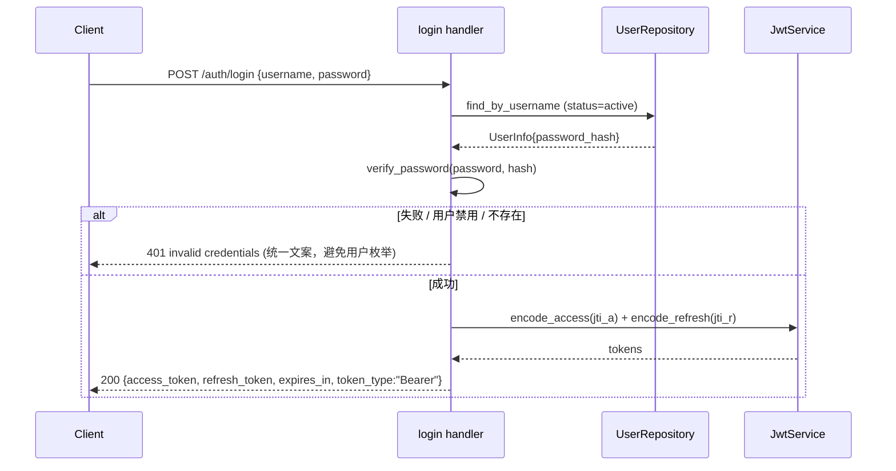

# Phase 6.3 — Web 基座 + 认证（JWT + argon2id + 黑名单）

> **状态**: Production Design Target
> **父计划**: `docs/plans/phase6-web-layer.md`
> **前置依赖**: Phase 6.1（模型/配置/密码原语）、6.2（User repository）
> **覆盖父计划章节**: §3（骨架）, §7（认证）, §15（响应 envelope）, §12.4（error 映射）
> **目标**: 创建 `oxide-arb-web` crate，落地基础设施（state/response/error/extractors）+ JWT 认证（access/refresh + Redis 黑名单）+ authn 中间件 + auth 路由（login/refresh/logout/me）。本子 phase **不做授权（Casbin）**，authz 留待 6.4；本阶段所有受保护路由暂以 "authN only" 保护。

---

## 0. 工作范围

### 0.1 交付物

| 交付物 | 位置 | 说明 |
|---|---|---|
| crate | `crates/oxide-arb-web/Cargo.toml` | 新 crate，挂入 workspace members |
| 入口 | `src/lib.rs` | `spawn_web_server(state, shutdown)`（本阶段最小可启动） |
| 状态 | `src/state.rs` | `AppState`（本阶段：repos 子集 + jwt + blacklist） |
| 响应 | `src/response.rs` | `WebResponse<T>` + `Paginated<T>` envelope |
| 错误 | `src/error.rs` | `WebError` + `ResponseError` + `From<...>` 映射 |
| 提取器 | `src/extractors.rs` | `ValidatedJson<T>` / `Pagination` / `AuthedActor` / `RequestId` |
| JWT | `src/jwt.rs` | `Claims` / `TokenType` / encode/decode access+refresh / jti 黑名单 |
| 密码 | （复用 6.1 `oxide-arb-models::security::password`） | argon2id verify |
| 中间件 | `src/middleware/request_id.rs` + `authn.rs` | X-Request-Id + JWT 解析 + 角色加载 + 黑名单 |
| 路由 | `src/routes/{mod,health,auth}.rs` | health/ready + login/refresh/logout/me |

### 0.2 非目标

- 不做 Casbin model/service/checker/rules/authz MW — 归 6.4。
- 不做 RBAC 管理 / 业务 / 治理路由 — 归 6.4/6.5/6.6。
- 不做 operation_log 中间件 — 归 6.5。
- 不接线 core/bootstrap — 6.6（本阶段提供可单测的 `spawn_web_server` 签名 + 测试用 harness）。

---

## 1. crate 依赖（`crates/oxide-arb-web/Cargo.toml`）

```toml
[dependencies]
oxide-arb-error      = { workspace = true }
oxide-arb-models     = { workspace = true }
oxide-arb-repository = { workspace = true }

actix-web      = { workspace = true }
actix-cors     = { workspace = true }
tracing-actix-web = { workspace = true }
jsonwebtoken   = { workspace = true }
deadpool-redis = { workspace = true }
redis          = { workspace = true }
serde          = { workspace = true }
serde_json     = { workspace = true }
validator      = { workspace = true }
chrono         = { workspace = true }
uuid           = { workspace = true }
tokio          = { workspace = true }
tokio-util     = { workspace = true }
tracing        = { workspace = true }
thiserror      = { workspace = true }
async-trait    = { workspace = true }

[dev-dependencies]
actix-rt        = { workspace = true }
oxide-arb-storage = { workspace = true, features = ["test-util"] }
```

> `oxide-arb-control` / `oxide-arb-core` 依赖在 6.5 / 6.6 引入。

---

## 2. 响应 envelope（`response.rs`）

```rust
// 成功: { "code": 200, "message": "ok", "data": {...} }
// 错误: { "code": 400, "message": "...", "data": null }
pub struct WebResponse<T> { pub code: u16, pub message: String, pub data: Option<T> }
impl<T: Serialize> WebResponse<T> { pub fn ok(data: T) -> Self; pub fn message(...) -> ...; }
```

`Paginated<T>` 复用 6.2 `oxide-arb-models::domain::Paginated`：`{ items, total, page, size, has_next }`。
**统一 envelope**：成功 handler 返回 `WebResponse`（HTTP 200）；错误统一经 `WebError` 的 `ResponseError`（带正确 HTTP 状态码 + 同一 envelope 形态）。**修复 ng-gateway 双 JSON 错误格式不一致缺陷**。

---

## 3. 错误（`error.rs`）

```rust
#[derive(Debug, thiserror::Error)]
pub enum WebError {
    #[error("unauthorized: {0}")] Unauthorized(String),
    #[error("forbidden")] Forbidden,
    #[error("not found: {0}")] NotFound(String),
    #[error("bad request: {0}")] BadRequest(String),
    #[error("conflict: {0}")] Conflict(String),
    #[error("internal error: {0}")] Internal(String),
    #[error("service unavailable: {0}")] ServiceUnavailable(String),
}
```

`impl ResponseError`：`status_code()` 按下表；`error_response()` 输出 `WebResponse::<()>` envelope。本阶段实现 `From<StorageError>` / `From<RbacError>` / `From<AuthError>`（治理相关 `From<RegistryError>` / `From<GovernanceError>` 归 6.5）：

| 来源 | HTTP |
|---|---|
| `AuthError`（invalid/expired/blacklisted credentials） | 401 |
| `WebError::Forbidden` | 403 |
| `RbacError::Duplicate` / `StorageError::Conflict` | 409 |
| `StorageError::NotFound` / `RbacError::NotFound` | 404 |
| validation / `BadRequest` | 400 |
| 其他 `StorageError` | 500 |
| Redis/连接不可用 | 503 |

`AuthError`（新增于 `oxide-arb-error` 或 web 本地）：`MissingToken` / `InvalidToken` / `ExpiredToken` / `Blacklisted` / `WrongTokenType` / `InvalidCredentials`。

---

## 4. JWT（`jwt.rs`）

```rust
/// Roles are intentionally NOT embedded — loaded per-request so authz changes
/// take effect without re-login.
pub struct Claims {
    pub jti: String,           // unique token id (blacklist key)
    pub sub: String,           // user_id (stable Casbin subject)
    pub iss: String,
    pub iat: i64, pub nbf: i64, pub exp: i64,
    pub username: String,
    pub token_type: TokenType, // Access | Refresh
}
pub enum TokenType { Access, Refresh }
```

`JwtService`（持 `JwtConfig` + Redis pool）：

- `encode_access(user) / encode_refresh(user) -> (token, jti, exp)`（HS256，issuer/ttl 来自配置）。
- `decode(token, expected: TokenType) -> Result<Claims, AuthError>`（校验 iss/exp/nbf/token_type）。
- 黑名单（Redis）：key `oxide_arb:jwt:blacklist:<jti>`，value `1`，TTL = token 剩余有效期。
  - `blacklist(jti, ttl)` / `is_blacklisted(jti) -> bool`。

---

## 5. 中间件

### 5.1 `request_id.rs`
读 `X-Request-Id`（无则生成 UUID v7），写回响应头，注入请求 extensions（供 handler/operation_log/审计信封取用），并加入 tracing span（复用 `tracing-actix-web`）。**注意信任边界**：来自公网客户端的 `X-Request-Id` 仅作关联，不可用于安全决策。

### 5.2 `authn.rs`
1. `Authorization: Bearer <token>` 提取（缺失 → 401）。
2. `jwt.decode(token, Access)`（失败/过期 → 401）。
3. 黑名单校验 `is_blacklisted(jti)`（命中 → 401）。**修复 ng-gateway 黑名单未接线缺陷**。
4. 加载角色：`UserRoleRepository::list_roles_for_user(claims.sub)` → `ActorRoles`（role code 集合）。注入 extensions（`Claims` + `ActorRoles`）。
5. public 路由（health/ready/metrics/login/refresh）不经此中间件（路由分层）。

> 6.4 在 authn 之后追加 authz 中间件；本阶段受保护 scope 仅挂 authn。

---

## 6. 提取器（`extractors.rs`）

- `ValidatedJson<T>`：`web::Json<T>` + `validator::Validate`，校验失败 → `WebError::BadRequest`。
- `Pagination`：query `page`/`size`（默认 1/50，size 上限钳制，如 ≤200）。
- `AuthedActor`：从 extensions 取 `Claims` + `ActorRoles`（缺失 → 401，仅用于受保护 handler）。
- `RequestId`：从 extensions 取 request_id。

---

## 7. 认证路由（`routes/auth.rs`）

| 方法 | 路径 | 鉴权 | 说明 |
|---|---|---|---|
| POST | `/api/v1/auth/login` | public | 用户名/密码 → access+refresh |
| POST | `/api/v1/auth/refresh` | public（校验 refresh + 黑名单） | 旋转 access+refresh，旧 refresh jti 入黑名单 |
| POST | `/api/v1/auth/logout` | authN | access+refresh jti 全部入黑名单 |
| GET | `/api/v1/auth/me` | authN | 当前用户 + 角色 + 可访问菜单 |

### 7.1 login 序列



- 失败统一返回 401 + 同一文案（防用户枚举 + 时序：用户不存在时也走一次 dummy verify）。
- `/me`：返回 user + roles + accessible menus（`MenuRepository::accessible_for_roles`）。

---

## 8. `AppState` 与 `spawn_web_server`（最小可启动）

```rust
#[derive(Clone)]
pub struct AppState {
    pub jwt: Arc<JwtService>,
    pub users: Arc<dyn UserRepository>,
    pub user_roles: Arc<dyn UserRoleRepository>,
    pub menus: Arc<dyn MenuRepository>,
    // 6.4 追加 casbin / perm_checker；6.5 追加 control registry / operation_log；6.6 追加业务 repos + ws
}

pub async fn spawn_web_server(state: AppState, cfg: WebConfig, shutdown: CancellationToken) -> OxideResult<()>;
```

- `HttpServer` 挂 CORS（来自 `cfg.cors_allowed_origins`）、request_id MW；public scope（health/ready/login/refresh）+ 受保护 scope（wrap authn）。
- 监听 `cfg.listen_host:listen_port`；`shutdown.cancelled()` 触发 graceful stop。
- 本阶段由集成测试用 `actix_web::test` + testcontainers PG/Redis 启动验证；core 真正接线在 6.6。

---

## 9. 测试策略

| 测试 | 场景 |
|---|---|
| login 成功 | 正确凭证 → 200 + access/refresh；jwt 可解码 |
| login 失败 | 错误密码/禁用用户/不存在 → 401 统一文案 |
| refresh | 有效 refresh → 旋转；旧 refresh jti 入黑名单；旧 refresh 再用 → 401 |
| logout | logout 后 access/refresh 均被拒（401） |
| 黑名单重放 | 被拉黑 token 命中 → 401 |
| authn | 缺 token/无效/过期/wrong type → 401；有效 → 注入 Claims+Roles |
| /me | 返回 user+roles+accessible menus |
| envelope | 成功/错误均统一 `{code,message,data}` 形态 |
| request_id | 响应头回写；上游传入被采用 |

---

## 10. 退出条件

1. `oxide-arb-web` 编译通过，可在测试中启动。
2. login/refresh/logout/me 全链路工作；黑名单生效（修复 ng-gateway 缺陷）。
3. 统一响应/错误 envelope（修复双格式缺陷）。
4. authn 中间件正确注入 Claims + ActorRoles，public 路由放行、受保护路由拦截。
5. 失败登录防用户枚举（统一文案 + 时序）。

## 11. 阻止进入 6.4 的情况

- 黑名单未生效（logout/refresh 后旧 token 仍可用）。
- 响应/错误 envelope 不统一。
- JWT 未校验 token_type（access/refresh 混用）。
