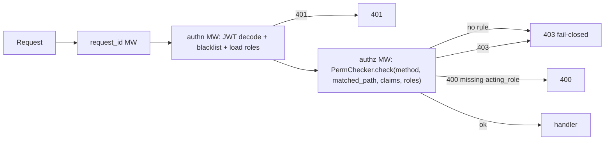

# Phase 6.4 — 授权（Casbin fail-closed）+ RBAC 管理路由

> **状态**: Production Design Target
> **父计划**: `docs/plans/phase6-web-layer.md`
> **前置依赖**: Phase 6.2（Casbin adapter + RBAC repos）、6.3（web 基座 + authn）
> **覆盖父计划章节**: §8（授权）, §11.3（RBAC 管理路由）
> **目标**: 落地 Casbin 动态 RBAC（model/service/checker/rules）+ authz 中间件（**未注册路由默认拒绝**，修复 ng-gateway default-allow）+ `super_admin` 旁路（基于 role code + user_id subject）+ RBAC 管理路由（users/roles/menus/permissions）+ `init_rbac_rules`。

---

## 0. 工作范围

### 0.1 交付物

| 交付物 | 位置 | 说明 |
|---|---|---|
| Casbin model | `src/auth/casbin/model.rs` | 4-tuple + super_admin 旁路（inline 字符串） |
| CasbinService | `src/auth/casbin/service.rs` | `CachedEnforcer` 封装 + 策略变更 + reload |
| PermChecker | `src/auth/casbin/checker.rs` | 路由规则注册表（fail-closed） |
| Rule DSL | `src/auth/casbin/rules.rs` | `public` / `resource_op` / `acting_role_governed` |
| authz MW | `src/middleware/authz.rs` | `PermChecker.check(method, matched_path, claims)` |
| RBAC 路由 | `src/routes/{users,roles,menus,permissions}.rs` | CRUD + 分配 |
| 规则注册 | `src/routes/mod.rs::init_rbac_rules` | 启动时注册所有路由权限规则 |

### 0.2 非目标

- 治理控制面路由 / `acting_role_governed` handler 落地 — 归 6.5（本阶段定义 `acting_role_governed` Rule 类型与 DSL，治理路由本体在 6.5）。
- 业务路由 — 归 6.6。
- operation_log 中间件 — 归 6.5。

---

## 1. Casbin model（`auth/casbin/model.rs`）

```text
[request_definition]
r = sub, obj, act, typ

[policy_definition]
p = sub, obj, act, typ

[role_definition]
g = _, _

[policy_effect]
e = some(where (p.eft == allow))

[matchers]
m = g(r.sub, "super_admin") \
 || (p.typ == "resource" && g(r.sub, p.sub) && r.obj == p.obj && r.act == p.act)
```

- `g = (user_id, role_code)`，`p = (role_code, ResourceType, Operation, "resource")`。
- `super_admin` 旁路：matcher 首项 `g(r.sub, "super_admin")`，subject 为稳定 `user_id`（**修复 ng-gateway 用户名字面量旁路**）。

---

## 2. CasbinService（`service.rs`）

封装 `casbin::CachedEnforcer`（model + 6.2 `PgCasbinAdapter`）：

```rust
pub struct CasbinService { enforcer: Arc<RwLock<CachedEnforcer>> }

impl CasbinService {
    pub async fn new(db: DatabaseConnection) -> Result<Self, WebError>; // load_policy()
    pub async fn enforce(&self, user_id: &str, obj: &str, act: &str) -> bool; // typ="resource"
    pub async fn has_role(&self, user_id: &str, role_code: &str) -> bool;
    pub async fn has_policy(&self, role_code: &str, obj: &str, act: &str) -> bool; // acting_role 校验
    pub async fn add_role_for_user(&self, user_id: &str, role_code: &str) -> Result<(), WebError>;
    pub async fn delete_role_for_user(&self, user_id: &str, role_code: &str) -> Result<(), WebError>;
    pub async fn add_policy(&self, role_code: &str, obj: &str, act: &str) -> Result<(), WebError>;
    pub async fn remove_policy(&self, role_code: &str, obj: &str, act: &str) -> Result<(), WebError>;
    pub async fn reload(&self) -> Result<(), WebError>; // load_policy() after external repo writes
}
```

**一致性**：RBAC 管理路由经 repository（6.2）在事务内写 join 表 + `casbin_rule`，写成功后调 `casbin.reload()` 刷新 `CachedEnforcer` 缓存。`enforce`/`has_role`/`has_policy` 读已加载缓存（hot path 无 DB I/O）。

---

## 3. PermChecker 路由规则注册表（`checker.rs`，fail-closed）

```rust
/// Key = (Method, actix matched path pattern). Unregistered protected routes are
/// DENIED (fail-closed), fixing ng-gateway default-allow.
pub struct PermChecker { rules: HashMap<(Method, String), Rule> }

impl PermChecker {
    pub fn register(&mut self, method: Method, path: impl Into<String>, rule: Rule);
    pub async fn check(&self, method: &Method, matched_path: &str, claims: &Claims,
                       roles: &ActorRoles, casbin: &CasbinService) -> Result<(), WebError> {
        if roles.contains("super_admin") { return Ok(()); }          // bypass
        match self.rules.get(&(method.clone(), matched_path.to_owned())) {
            None => Err(WebError::Forbidden),                          // fail-closed
            Some(rule) => rule.evaluate(claims, roles, casbin).await,
        }
    }
}
```

- key 用 `req.match_pattern()`（路由模板，如 `/api/v1/users/{id}`）。
- 未注册路由 → 403（**核心安全修复**）。

---

## 4. Rule DSL（`rules.rs`）

```rust
pub enum Rule {
    Public,                                       // 跳过 authZ（仅 health/metrics/login/refresh）
    ResourceOp(ResourceType, Operation),          // enforce(user_id, obj, act)（任一角色）
    ActingRoleGoverned(ResourceType, Operation),  // 治理变更（详见 6.5）
    AuthenticatedOnly,                            // 已登录即可（如 /menus/accessible, /auth/me）
}
```

- `ResourceOp`：`casbin.enforce(claims.sub, obj.as_str(), act.as_str())`，否 → 403。
- `ActingRoleGoverned`（**类型与评估在本阶段定义，治理 handler 在 6.5 使用**）：
  1. 从 body 取 `acting_role`（缺失 → 400）；
  2. `casbin.has_role(claims.sub, acting_role)`（否 → 403）；
  3. `casbin.has_policy(acting_role, obj, act)`（否 → 403）；
  4. 通过后将 `acting_role` 注入 extensions（供 6.5 handler 构造审计信封）。
- `AuthenticatedOnly`：authn 已保证；直接 Ok。

> body 中 `acting_role` 的读取需在 authz MW 中预读请求体（actix 中可 `web::Bytes` 预取后回填 payload，或采用 header `X-Acting-Role`）。**决策**：用请求体字段 `acting_role`（与审计信封同源），authz MW 预读 + 缓存 body 供 handler 复用，避免二次消费 payload。

---

## 5. authz 中间件（`middleware/authz.rs`）

挂在受保护 scope，**authn 之后**执行：



从 extensions 取 `Claims` + `ActorRoles`（authn 注入），`PermChecker.check(...)`，结果映射 401/403/400。

---

## 6. RBAC 管理路由（`resource_op`）

| 端点 | 方法 | 权限 |
|---|---|---|
| `/users` | GET / POST | `User:Read` / `User:Create` |
| `/users/{id}` | GET / PUT / DELETE | `User:Read` / `User:Update` / `User:Delete` |
| `/users/{id}/status` | PUT | `User:Update` |
| `/users/{id}/password` | PUT | `User:Update` |
| `/users/{id}/roles` | POST | `User:Assign` |
| `/roles` | GET / POST | `Role:Read` / `Role:Create` |
| `/roles/{id}` | GET / PUT / DELETE | `Role:Read` / `Role:Update` / `Role:Delete` |
| `/roles/{id}/permissions` | GET / POST | `Permission:Read` / `Role:Assign` |
| `/roles/{id}/menus` | POST | `Role:Assign` |
| `/menus` | GET / POST | `Menu:Read` / `Menu:Create` |
| `/menus/{id}` | PUT / DELETE | `Menu:Update` / `Menu:Delete` |
| `/menus/accessible` | GET | `AuthenticatedOnly`（按当前用户角色过滤） |
| `/permissions/catalog` | GET | `Permission:Read` |

handler 要点：

- `users` POST / password PUT：用 6.1 `hash_password` 哈希。
- `users/{id}/roles` POST：`UserRoleRepository::assign` → `casbin.reload()`。
- `roles/{id}/permissions` POST：`RolePermissionRepository::assign_permissions`（校验 `RESOURCE_OPERATIONS`）→ `casbin.reload()`；GET 返回 `list_permissions`。
- `roles/{id}/menus` POST：`RoleMenuRepository::assign`。
- `menus/accessible` GET：`MenuRepository::accessible_for_roles(actor.roles)`。
- `permissions/catalog` GET：输出 `RESOURCE_OPERATIONS` 全量目录。
- 唯一冲突 → 409；NotFound → 404；非法 resource×op → 400。

---

## 7. `init_rbac_rules`（`routes/mod.rs`）

启动时集中注册全部 `(Method, matched_path) → Rule`（对标 ng-gateway 集中注册，但 fail-closed）。本阶段注册 §6 全部 RBAC 路由 + public（health/ready/login/refresh）+ authN-only（logout/me/menus.accessible）。治理与业务路由的注册在 6.5/6.6 追加。

**完整性测试**：遍历 actix 路由表，断言每个非 public 路由都有对应 `Rule` 注册（防止漏注册导致 fail-closed 误伤或安全空洞）。

---

## 8. 测试策略

| 测试 | 场景 |
|---|---|
| fail-closed | 未注册的受保护路由 → 403 |
| super_admin 旁路 | super_admin 用户访问任意端点 → 放行 |
| resource_op 矩阵 | 每端点：正确角色放行 / 越权 403 |
| 动态生效 | 给角色 assign 权限后 `enforce` 立即命中（reload 生效） |
| user-role 分配 | assign 后该用户获得对应权限；revoke 后失效 |
| role-permission | assign 非法 resource×op → 400；合法 → 落 `p` + 即时生效 |
| role-menu | assign 后 `/menus/accessible` 返回对应菜单 |
| 规则完整性 | 所有非 public 路由均已注册 Rule |
| subject 稳定性 | 改 username 后授权仍生效（subject=user_id） |

---

## 9. 退出条件

1. 未注册路由 fail-closed（403）。
2. `super_admin` 基于 role code + user_id subject 旁路全部端点。
3. 角色权限/菜单/用户角色分配落 casbin `p`/`g` + join 表，并经 `reload()` 即时生效。
4. RBAC 管理路由全部 CRUD + 分配工作正常，权限矩阵正确。
5. 路由规则完整性测试通过（无漏注册）。

## 10. 阻止进入 6.5 的情况

- 存在未注册却放行的路由（default-allow 残留）。
- `super_admin` 旁路依赖 username 字面量。
- 分配后未 reload，权限变更不即时生效。
