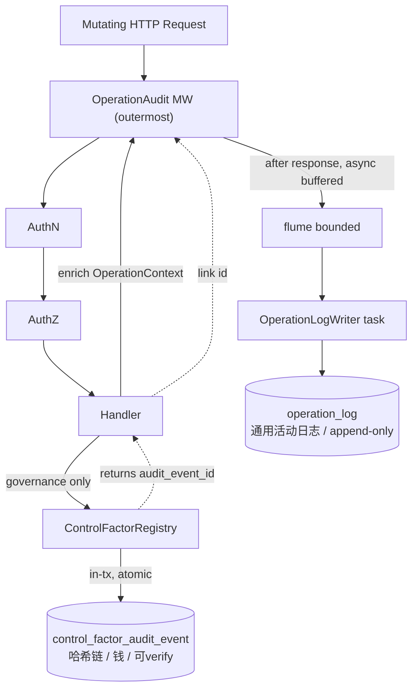

# Phase 6.5 — 操作日志中间件（双轨审计）+ 治理控制面路由

> **状态**: Production Design Target
> **父计划**: `docs/plans/phase6-web-layer.md`
> **前置依赖**: Phase 6.1（operation_log 表 + 枚举）、6.2（OperationLog repo）、6.3（web 基座）、6.4（authz + `acting_role_governed`）、Phase 5.x 治理内核
> **覆盖父计划章节**: §11.4, §11.5, §12（治理接线）, §13.5（control/config 事件源）
> **目标**: 落地通用操作日志的双轨审计（actix 中间件 + handler 富化 + 异步缓冲 writer）+ 治理控制面路由（control-factors 生命周期 + runtime-config 版本化），治理变更进入哈希链且 `AuditChain::verify` 可校验。

---

## 0. 设计原则：双轨审计（不合并）



- **轨一 · 治理哈希链**（`control_factor_audit_event`，6.1 已存在）：仅治理状态机变更（publish/rollback/reject/shadow/runtime-config activate/create），由 `ControlFactorRegistry` / `ControlFactorRepository` **在同一事务内原子写入**，全局 `sequence` + `prev_event_hash`，可独立 `verify`。web 层只构造信封、不直接写链。
- **轨二 · 通用操作日志**（`operation_log`，6.1 新增）：覆盖**所有变更类请求** + 认证事件 + RBAC 管理，由中间件 + handler 富化驱动，**异步缓冲落库**，DB 级 append-only，脱敏，不上哈希链。
- 治理动作**同时**出现在两轨：操作日志记 HTTP envelope 并 `governance_audit_event_id` **硬 FK 链接**哈希链事件（统一活动流 + 权威账本各司其职）。
- **硬链接实现（破坏式内核变更，已落地）**：`reject_factor` / `publish_publication` / `rollback_publication` / `create_version_governed` 的 repo/registry outcome 改为携带 `AuditedOutcome<T> { value, audit_event_id }`，handler 把 `audit_event_id` 通过 `OperationContext::link_governance` 写入 `operation_log.governance_audit_event_id`。幂等重放（`PublishPublicationOutcome::AlreadyApplied`）不追加新事件，故不链接。runtime-config activation 已在 `RuntimeConfigActivationInfo.audit_event_id` 暴露。

---

## 1. OperationAudit 中间件（`middleware/operation_audit.rs`）

### 1.1 位置（最外层）

中间件链顺序（外 → 内）：`OperationAudit` → `request_id` → `authn` → `authz` → `handler`。最外层可在 `srv.call` 返回后读取**最终 HTTP 状态**（含 authn 401 / authz 403）+ 内层注入的 extensions（`Claims` from authn、`OperationContext` from handler）。

> actix 中 extensions 经 `ServiceResponse::request().extensions()` 在外层可见；故最外层中间件能拿到内层写入的 actor 与富化字段。

### 1.2 采集策略（哪些记）

- **记**：变更类方法（POST/PUT/DELETE/PATCH）+ 认证事件（login 成功/失败、refresh、logout）+ 治理动作。
- **不记**：GET 读、`/health`、`/ready`、`/metrics`、`/api/v1/ws`（可配置 denylist）。
- 由路由级 `OperationAuditPolicy`（method + matched_path）决定，避免噪声。

### 1.3 字段来源

| operation_log 字段 | 来源 |
|---|---|
| request_id | request_id MW |
| actor_user_id / actor_username | authn 注入的 `Claims`（匿名/登录失败为 NULL；登录 handler 富化 username） |
| acting_role | `acting_role_governed` 注入的 extensions（治理动作） |
| category / action / resource_type / resource_id / detail / governance_audit_event_id | handler 富化的 `OperationContext` |
| http_method / http_path / http_status / latency_ms | 中间件直接采集（path = matched pattern） |
| outcome | 由 http_status 派生：2xx→success，401/403→denied，其余→failure（handler 可覆盖） |
| client_ip / user_agent | 请求头（`peer_addr` / `User-Agent`，注意代理 `X-Forwarded-For` 信任边界） |

### 1.4 handler 富化（请求作用域上下文）

```rust
/// Request-scoped, handler-populated audit enrichment (Rc<RefCell<…>> in req
/// extensions; single-threaded per actix worker).
pub struct OperationContext { /* RefCell inside */ }
impl OperationContext {
    pub fn set_action(&self, category: OperationCategory, action: &str);
    pub fn set_resource(&self, rtype: ResourceType, id: impl Into<String>);
    pub fn set_detail(&self, detail: serde_json::Value);  // 脱敏后摘要/diff
    pub fn link_governance(&self, audit_event_id: AuditEventId);
    pub fn mark_outcome(&self, outcome: OperationOutcome);
    pub fn set_actor_username(&self, username: &str);     // login 失败：尝试用户名
    pub fn set_actor(&self, user_id: UserId, username: &str); // login 成功：解析后 actor
}
```

提取器 `OperationCtx`（`FromRequest`，clone 出共享的 `Rc<OperationContext>`）供 handler 注入。未富化的变更请求仍记录 envelope（category/action 由 matched_path 兜底推断）。中间件合并：`actor_*` 优先取 handler 富化值（login 在无 `Claims` 时归因），否则取 authn 注入的 `Claims`。**富化覆盖面**：auth + RBAC（users/roles/menus）+ 治理 handler 全部显式富化。

### 1.5 异步缓冲写入（不阻塞响应）

- 归属 **`oxide-arb-web` 的 `audit` 模块**（`audit/{context,buffer,writer}.rs`）：`OperationLogBuffer`（bounded `flume` sender + 丢弃计数）+ `spawn_operation_log_writer`（批量 + 定时 + 关停 drain → `OperationLogRepository::append_batch`）。`OperationLogBuffer` 挂在 `AppState.operation_log`。
- 中间件 `srv.call` 返回后构造 `NewOperationLog`，非阻塞 `try_enqueue`（满/关闭即丢弃并 `warn`）。
- writer 后台任务由 `spawn_web_server` 启动（绑定同一 `CancellationToken`）；测试 harness 同样启动。默认 batch=64 / flush=250ms。
- **best-effort**：channel 满或写库失败仅 `tracing::warn`，**绝不**让日志失败影响业务响应。
- 关停时 drain 残留（writer 在 `shutdown.cancelled()` 后做最终 flush）。
- **脱敏**：`detail` 由 handler 显式构造，**禁止**透传请求体；中间件不读 body。密码/token/PHC/PII 永不入库。登录失败只记**尝试的用户名**（`OperationContext::set_actor_username`），绝不记密码。

---

## 2. 治理控制面路由（`acting_role_governed`，进哈希链）

> authZ 已由 6.4 authz MW + `acting_role_governed` 规则完成（`acting_role` 注入 extensions）。

> **路由形状修正（语义精准，已落地）**：publication 是**原子集合**（新 publication 取代该 mode 当前 active），无法按单个 factor 发布。故 shadow/publish/emergency 改为 **集合端点** `/control-factors/publications/{shadow|publish|emergency}`（body 携带完整 `factor_ids`），而非 `/control-factors/{id}/{action}`；`reject` 仍是 per-factor。`materialization enqueue` 延期到 6.6（见 §9）。

| 端点 | 方法 | 权限 | 治理调用 |
|---|---|---|---|
| `/control-factors`（list by status，默认 candidate） | GET | `ControlFactor:Read` | `repo.list_factors_by_status` |
| `/control-factors/{id}` | GET | `ControlFactor:Read` | `repo.load_factor` |
| `/control-factors/{id}/reject` | POST | `ControlFactor:Reject` | `registry.reject_factor` |
| `/control-factors/publications` | GET | `ControlFactor:Read` | `repo.list_publications` |
| `/control-factors/publications/{id}` | GET | `ControlFactor:Read` | `repo.load_publication` |
| `/control-factors/publications/shadow` | POST | `ControlFactor:Shadow` | `registry.promote_to_shadow` |
| `/control-factors/publications/publish` | POST | `ControlFactor:Publish` | `registry.publish`（risk-expansion gate） |
| `/control-factors/publications/emergency` | POST | `ControlFactor:Emergency` | `registry.publish`（强制 risk-expansion + server 端 short-TTL=1h） |
| `/control-factors/publications/{id}/rollback` | POST | `Publication:Rollback` | `registry.rollback_publication`（{id}=active） |
| `/control-factors/publications/{id}/shadow-decisions` | GET | `ControlFactor:Read` | `list/aggregate_shadow_decisions` |
| `/control-factors/audit` | GET | `Audit:Read` | `repo.load_audit_chain` + `AuditChain::verify` |
| `/operation-logs` | GET | `OperationLog:Read` | `repo.page`（轨二只读闭环） |

### 2.1 mutating handler 骨架

```rust
// authZ + acting_role 已完成；acting_role 在 extensions
let acting_role: String = req.extensions().get::<ActingRole>().ok_or(WebError::Forbidden)?.0.clone();
let envelope = AuditActor {
    actor: claims.sub.clone(),       // user_id
    actor_role: acting_role.clone(), // String（super_admin 记 "super_admin"）
    request_id: request_id(&req),
    reason: body.reason.clone(),     // 必填，空 → 400
};
let outcome = state.registry.publish(envelope, request).await.map_err(WebError::from)?;
// 富化操作日志：链接哈希链事件
op_ctx.set_action(OperationCategory::Governance, "control_factor.publish");
op_ctx.set_resource(ResourceType::ControlFactor, /* factor/publication id */);
// op_ctx.link_governance(outcome 的 audit_event_id 若可得)
```

- **acting_role 来源（已落地）**：走 **`X-Acting-Role` header**（authz 需在 body 解析前授权，不能读 body），`reason` 在 body。authz MW 在 `ActingRoleGoverned` 通过后把解析出的 `acting_role` 注入 extensions，handler 经 `ActingRole` 提取器读取。
- **`super_admin` 旁路 + 治理路由（已落地）**：重构 `PermChecker::check` —— 即便 super_admin 旁路授权，治理路由仍解析并注入 `acting_role`：`X-Acting-Role` 命名了 super_admin **确实持有且 enabled** 的角色则记该角色，否则记 `"super_admin"`。审计链 `actor_role` 记该值；handler 逻辑因此对 super_admin 与普通治理角色**完全统一**。
- `PublishPublicationOutcome::AlreadyApplied`（幂等重放）→ HTTP 200 返回已存在 publication（不追加链事件、不链接）。

### 2.2 ControlFactorRegistry API（5.x 已交付，web 调用）

> 返回类型已按硬链接需求改造（§0）：治理 mutation 透传 `AuditEventId`。

- `reject_factor(envelope, &ControlFactorId) -> Option<AuditedOutcome<ControlFactorValueInfo>>`
- `promote_to_shadow(envelope, PublicationRequest) -> PublishPublicationOutcome`（`Published(AuditedOutcome<…>)`）
- `publish(envelope, PublicationRequest) -> PublishPublicationOutcome`
- `rollback_publication(envelope, &active_id, &target_id) -> AuditedOutcome<ControlFactorPublicationInfo>`
- `expire_due_factors(envelope) -> ExpireFactorsOutcome`（scheduler/worker 用，6.6；未改造，web 不调用）
- `create_runtime_config_version(envelope, NewRuntimeConfigVersion) -> AuditedOutcome<RuntimeConfigVersionInfo>`
- `activate_runtime_config_version(envelope, NewRuntimeConfigActivation) -> RuntimeConfigActivationInfo`（已带 `audit_event_id`）
- materialization enqueue 不在 registry，且本期延期到 6.6（§9）。
- 只读（已挂 `AppState`）：`control_factors.load_factor/list_factors_by_status/list_publications/load_publication/load_audit_chain`，`runtime_config.load_current/list_versions/load_version`，`shadow_decisions.list/aggregate_shadow_decisions`，`operation_logs.page`。

---

## 3. 治理版本化配置路由（替代裸 PATCH）

| 端点 | 方法 | 权限 | 调用 |
|---|---|---|---|
| `/runtime-config` | GET | `RuntimeConfig:Read` | 当前激活版本 |
| `/runtime-config/versions` | GET / POST | `RuntimeConfig:Read` / `RuntimeConfig:Create` | `create_runtime_config_version` |
| `/runtime-config/versions/{id}/activate` | POST | `RuntimeConfig:Activate` | `activate_runtime_config_version` |
| `/runtime-config/versions/{id}/rollback` | POST | `RuntimeConfig:Rollback` | `activate_runtime_config_version`（rollback kind） |

**破坏式**：删除原裸 `PATCH /api/v1/config` + `ArcSwap<RuntimeConfig>` 即时热更（若存在），统一走版本化（immutable version + config hash + approval reason + rollback target + 审计链）。publish/rollback 后 live refresher 经 `notify_handle()` 被唤醒（registry 已配 `with_snapshot_refresh_notify`，6.6 接线），web 无需额外实现。

---

## 4. error → HTTP 映射（`error.rs` 扩展）

本阶段补齐治理相关 `From`：

| 错误 | HTTP |
|---|---|
| `GovernanceError::RiskExpansionNotApproved` | 403 |
| `GovernanceError::MissingReason` / `MissingField` / `InvalidPublicationWindow` / validation | 400 |
| `RollbackTargetMissing` / `FactorNotReadyForPublication` / `FactorSetMismatch` / `EmptyPublication` / `PublicationLockConflict` / `IdempotencyConflict` / `PublicationHashMismatch` | 409 |
| `PublishPublicationOutcome::AlreadyApplied` | 200（返回已存在 publication） |
| `RegistryError::Storage(NotFound)` | 404 |
| `AuditChain(_)` / 其他 `Storage(_)` / `CanonicalDigest(_)` | 500 |

`RegistryError = Governance | Storage | CanonicalDigest`；`From<RegistryError> for WebError` 递归映射上表。

---

## 5. 审计链查询 + 校验端点

`GET /control-factors/audit?from_sequence&limit`：`repo.load_audit_chain(from, limit)` → `AuditChain::verify(&events)`；返回事件 + verify 结果。verify 失败本身不是 500（数据完整性告警），返回 200 + `verified:false` + 首个断裂点（便于审计取证）。**决策**：verify 错误作为响应字段返回（而非 HTTP 错误），因为它是审计结论而非请求错误。

---

## 6. 测试策略

| 测试 | 场景 |
|---|---|
| operation_log envelope | 变更请求落 operation_log（actor/action/resource/status/latency）；GET 不落 |
| 认证事件 | login 成功/失败、logout、refresh 落 operation_log（失败=denied/failure，actor 可为空） |
| 异步不阻塞 | writer 故障/channel 满不影响业务响应（仍 200/正常） |
| 脱敏 | detail 不含密码/token；登录失败不泄漏密码 |
| 双轨链接 | 治理 publish 同时落哈希链（verify OK）+ operation_log（governance_audit_event_id 链接） |
| acting_role | 缺 reason→400；缺/越权 acting_role→400/403；super_admin 旁路记 "super_admin" |
| 治理幂等 | 同 idempotency_key publish 重放 → 200 AlreadyApplied |
| 审计端点 | load_audit_chain + verify；篡改检测返回断裂点 |
| runtime-config | 仅版本化变更；无裸 PATCH 路径；activate/rollback 进链 |
| append-only | operation_log 行不可改（DB 触发器） |

---

## 7. 退出条件

1. 所有变更类请求 + 认证事件进入 `operation_log`（异步、脱敏、append-only）。
2. 治理 publish/rollback/reject/shadow/runtime-config 进哈希链且 `AuditChain::verify` 通过。
3. 双轨：治理动作在两表均有记录且互相链接。
4. 操作日志写入失败不影响业务响应。
5. runtime-config 仅经版本化变更（无裸 PATCH）。
6. 治理 error → HTTP 映射完整正确；幂等重放 → 200。

## 8. 阻止进入 6.6 的情况

- 操作日志写入阻塞或拖垮业务响应。
- 敏感数据（密码/token）进入 operation_log。
- 治理变更未进哈希链或 verify 失败。
- 存在裸 PATCH config 即时热更路径。

## 9. Materialization enqueue —— 6.6 落地设计（本期延期）

**为何延期**：`MaterializationRunner::enqueue(&SealedMaterializationManifest, EnqueueMaterializationRunOptions)` 依赖内核机器 `MaterializationRunnerDeps { control_factors, pit_resolver, evidence_engine }` 与 manifest 构造/封存（sealing）。这些目前只在 `oxide-arb-control` 内核装配，web 触手无法构造 sealed manifest；强行接线会破坏 6.5「web 层 + harness」边界，因此随 6.6 scheduler/execute worker 一并落地。

**6.6 落地步骤**：

1. `AppState`（或新的 `GovernanceBundle`）新增 `Arc<MaterializationRunner>`，由 6.6 core bootstrap 用 `MaterializationRunnerDeps` 构造后注入。
2. 路由：`POST /control-factor-materializations`，权限 `Materialization:Enqueue`，规则 `ActingRoleGoverned`（治理动作，记审计与 operation_log，category=Governance，action=`materialization.enqueue`）。
3. 请求契约草案：
   ```jsonc
   {
     "schedule_ref": "execution-quality-hourly",   // 或 manifest_params 直接描述窗口/类型
     "force_new_run": false,
     "reason": "operator-triggered backfill"        // 必填，进信封
   }
   ```
4. handler 流程：解析 `schedule_ref`/`manifest_params` → 构造 manifest 定义 → `seal` 成 `SealedMaterializationManifest` → `runner.enqueue(&sealed, EnqueueMaterializationRunOptions { force_new_run, reason: Some(reason) })`。
5. 返回 `RunExecutionOutcome::Enqueued`（含 `EnqueueMaterializationRunOutcome::{Created|DuplicateActive|DuplicateCompleted}`）；`Created` → 200/201，重复 → 200（幂等）。enqueue 的审计由 `enqueue_materialization_run` 内部处理。
6. execute worker（独立 `PeriodicTask`/消费循环）轮询 `Queued` run → `MaterializationRunner::execute_run`，与 scheduler tick 同期接线（父计划 §12.5）。

**不变量**：web 仅触发 enqueue，绝不直接 publish；execute 与 scheduler 走 enqueue-only 路径（单测断言 `publish_calls() == 0`）。
