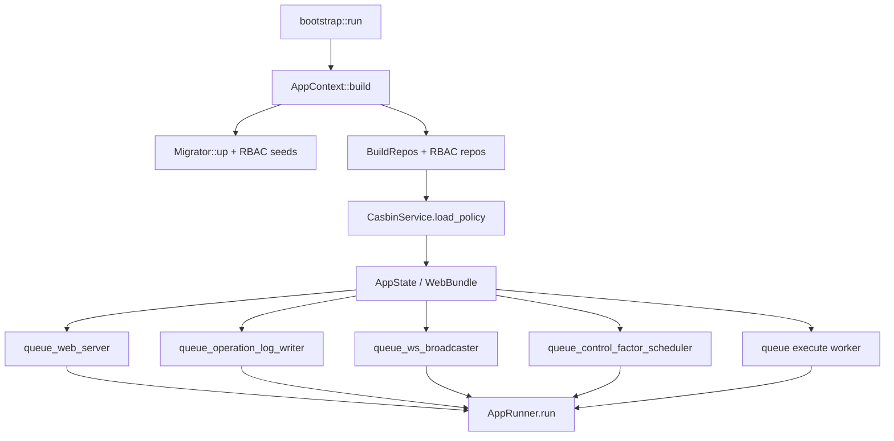

# Phase 6.6 — 业务路由 + WebSocket + 静态文件 + Core 接线

> **状态**: Production Design Target
> **父计划**: `docs/plans/phase6-web-layer.md`
> **前置依赖**: Phase 6.3/6.4/6.5（web 基座 + authz + 操作日志/治理路由）、Phase 5.x（scheduler/materialization 库）
> **覆盖父计划章节**: §11.6（业务路由）, §11.7, §13（WS）, §14（静态）, §16（接线）, §12.5（scheduler/execute worker）
> **目标**: 落地业务 read/控制路由 + WebSocket 基础设施（`actix-ws`，先接非热路径事件）+ 生产静态 SPA + core/bootstrap 接线（web server task + scheduler tick + execute worker），完成 oxide-arb-web 端到端可运行。**热路径事件插桩留待 6.7**。

---

## 0. 工作范围

### 0.1 交付物

| 交付物 | 位置 | 说明 |
|---|---|---|
| 业务路由 | `src/routes/{system,markets,opportunities,trades,pnl,risk,analytics,replay}.rs` | read + 控制端点 |
| WS 基础设施 | `src/ws/{mod,handler,session,broadcaster,protocol}.rs` | actix-ws upgrade+鉴权 / per-session 订阅 fanout |
| 事件总线 | `oxide-arb-core` `CoreEvent` + 发布句柄 | flume 通道，broadcaster 消费 |
| 静态文件 | `src/static_files.rs` | 生产 serve Vue 构建 + SPA fallback |
| core 接线 | `app/build.rs` / `app/mod.rs` / `task_id.rs` / `task_registry.rs` / `bootstrap.rs` | web task + scheduler tick + execute worker + WebBundle |

### 0.2 非目标

- 热路径 opportunity/trade/pnl emit hooks — 归 6.7（本阶段定义 `CoreEvent` 枚举 + broadcaster，仅接非热路径事件）。

---

## 1. 业务路由（`resource_op`）

- `system`：`GET /system/status`(`System:Read`)、`POST /system/halt`(`System:Halt`)、`POST /system/resume`(`System:Resume`)、`POST /system/mode`(`System:SwitchMode`)、`GET /system/health`(`System:Read`)
- `markets`：list/detail/book(`Market:Read`)、subscribe/unsubscribe(`Market:Update`)
- `opportunities`：recent/history/detail/stats(`Opportunity:Read`)
- `trades` / `pnl`：list/detail/decisions/pnl*(`Trade:Read` / `Pnl:Read`)
- `risk`：circuit-breaker/positions/exposure/daily-loss(`Risk:Read`)、circuit-breaker/reset(`Risk:Reset`)、blacklist GET(`Blacklist:Read`)/POST(`Blacklist:Create`)/DELETE(`Blacklist:Delete`)
- `analytics`：daily/weekly/edge-distribution/market-performance(`Analytics:Read`)
- `replay`：POST(`Replay:Create`)、GET status/history(`Replay:Read`)

handler 经 `AppState` 的业务 repos（trade/position/report/fact_data/risk_state/...，来自 `InfraBundle` 子集，6.6 经 `WebBundle` 暴露）。控制类（halt/resume/mode/reset/blacklist 写）走 `resource_op` 并落 operation_log（6.5 中间件自动覆盖）。`system/halt`/`resume`/`mode` 调既有 risk/execution 控制句柄；`circuit-breaker/reset` 调 risk engine。

> 控制类业务端点是否进哈希链？**决策**：不进。哈希链专属 control-factor 治理；业务控制（halt/reset/blacklist）进 `operation_log`（含 actor/action/outcome），满足问责，不污染治理链。

---

## 2. WebSocket（`actix-ws`）

### 2.1 连接与鉴权
`GET /api/v1/ws?token=<access>`：upgrade 前复用 authN 逻辑校验 JWT + 黑名单（**修复 ng-gateway WS 无鉴权缺陷**）。query token（浏览器 WS 无法设自定义头）。鉴权失败 → 401，不 upgrade。

### 2.2 消息 envelope（JSON）
```json
{ "type": "event_type", "timestamp": "2025-01-15T10:30:00.000Z", "data": { } }
```

### 2.3 协议（`protocol.rs`）
- 服务端推送类型：`system.status/alert`、`control.published/rolled_back`、`config.activated`、`risk.circuit_breaker/position_update`、`market.book_update/resolved`（本阶段非热路径子集），`opportunity.*`/`trade.*`/`pnl.*`（6.7 接入）。
- 客户端指令：`{action:"subscribe"|"unsubscribe", channel, market_id?}`、`{action:"sync"}`、`{action:"ping"}`。

### 2.4 Session（`session.rs`）
per-connection 状态：actor、订阅频道集合、`actix_ws::Session` 句柄。心跳：服务端每 15s ping，30s 无 pong 断开。连接后立即推 `system.status` 快照；`sync` 返回全量（持仓/熔断/最近 opportunities/当日 PnL，经 repos 查询）。

### 2.5 CoreEvent 事件总线（`oxide-arb-core`，新建）

```rust
pub enum CoreEvent {
    OpportunityDetected(Opportunity),
    OpportunityExpired(OpportunityId),
    TradeOpened(TradeInfo),
    TradeFilled(TradeInfo),                 // 原计划 TradeRecord 不存在 → TradeInfo
    TradeSettled { trade_id: TradeId, outcome: TradeBusinessOutcome, pnl: Usd }, // TradeOutcome→TradeBusinessOutcome
    PnlUpdate { daily: Usd, total: Usd },
    SystemStatusChanged(SystemStatus),
    CircuitBreakerTripped { level: u8, reason: String },
    PositionChanged(PositionInfo),
    MarketResolved { market_id: MarketId, outcome: bool },
    ControlPublished { publication_id: String, mode: PublicationMode },
    ConfigActivated { version_id: String },
    Alert { level: AlertLevel, message: String },
}
```

- `AppContext` 持 `flume::Sender<CoreEvent>`（bounded）+ 提供 `event_publisher()` 句柄。
- `WsBroadcaster`（专用 tokio task）消费 `flume::Receiver<CoreEvent>`，按每 session 订阅 fanout（per-session `mpsc`/`actix_ws::Session::text`）。
- **本阶段发布源（非热路径）**：`ControlPublished`/`ConfigActivated`（6.5 治理 handler 成功后 `try_send`）、`Alert`（接 `AlertDispatcher` 或 scheduler 告警）、`SystemStatusChanged`/`CircuitBreakerTripped`（periodic / risk audit sink 已有信号点）。
- **6.7 接入**：`OpportunityDetected`/`Trade*`/`PnlUpdate`/`PositionChanged`（scanner/execution/post-trade 热路径插桩）。
- 背压：bounded channel 满时丢弃最旧/计数告警，**绝不**阻塞热路径（6.7 强约束）。

---

## 3. 静态文件（`static_files.rs`）

生产模式 `actix-files::Files::new("/", static_ui_dir).index_file("index.html")`，`default_handler` 对非 API 路由回退 `index.html`（Vue Router 客户端路由）。启动检测目录存在则注册，否则仅 API 模式。`cfg.serve_static_ui` 控制开关。

---

## 4. Core 接线

### 4.1 BuildRepos + WebBundle（`app/build.rs`）
- `BuildRepos` 增 RBAC repos（user/role/menu/user_role/role_menu/role_permission/casbin/operation_log，同 `db.clone()` 模式）。
- 构造 `CasbinService`（连 PG adapter，`load_policy()`）。
- 新增 `WebBundle`（parallel `ControlFactorBundle`）持有 web 依赖：RBAC repos + casbin + jwt service + 业务 repos 子集 + `ControlFactorRegistry` + `MaterializationRunner` + operation_log writer sender + `CoreEvent` publisher。
- 组装 `AppState`（6.3/6.4/6.5/6.6 全量字段）。

### 4.2 task 接线（`app/mod.rs` + `task_id.rs` + `task_registry.rs`）
- **`TaskId::WebServer`**：新增 `TaskKind::ApiIngress` → `ShutdownStage::WsIngress`(stage 0)，**最先关停**（先停止对外接受请求，早于 detection）。
- `queue_web_server()`：`pending_tasks.push(TaskId::WebServer, |shutdown| spawn_web_server(state, cfg, shutdown))`。
- `queue_operation_log_writer()`：后台 task drain operation_log channel → `append_batch`；shutdown 时 drain 残留。
- `queue_ws_broadcaster()`：`WsBroadcaster` 消费 `CoreEvent`。
- `queue_control_factor_scheduler()`：`PeriodicTask` 每 interval 调 `MaterializationScheduler::tick(Utc::now())`（enqueue-only、`run_dedupe_key` 去重）；`SchedulerCycleReport::alerts`（`Overdue`/`Stale`）映射到 `AlertDispatcher` + 发 `CoreEvent::Alert`。
- **execute worker**：独立 `PeriodicTask`/消费循环轮询 `Queued` run → `MaterializationRunner::execute_run`。
- never-publish 保证：scheduler 只走 `latest_run_for_schedule` + `enqueue_materialization_run`（单测断言 `publish_calls() == 0`）。

### 4.3 bootstrap（`bootstrap.rs`）
`AppContext::build` 后依次 `queue_web_server()` / `queue_operation_log_writer()` / `queue_ws_broadcaster()` / `queue_control_factor_scheduler()` / execute worker，再 `AppRunner.run()`。



### 4.4 依赖
`oxide-arb-web` Cargo.toml 增 `oxide-arb-control` + `oxide-arb-core`（core 已依赖 control，无循环）。

---

## 5. 测试策略

| 测试 | 场景 |
|---|---|
| 业务路由 authz | 各端点正确权限放行/越权 403 |
| 控制端点 | halt/resume/mode/reset/blacklist 生效 + 落 operation_log |
| WS 鉴权 | 无/无效 token upgrade 拒绝（401）；有效放行 |
| WS 订阅 fanout | subscribe/unsubscribe；非热路径事件（control.published/config.activated/alert）正确推送给订阅者 |
| WS 心跳 | 30s 无 pong 断开 |
| WS sync | 返回全量快照 |
| scheduler | `tick` enqueue-only、`publish_calls()==0`；Overdue/Stale 告警分发 |
| execute worker | 处理 `Queued` run → `execute_run` |
| 关停顺序 | WebServer 在 detection 前关停（stage 0），不再接受新请求 |
| 端到端 | 启动 → 登录 → RBAC → 治理 → 业务 → WS 全链路冒烟 |

---

## 6. 退出条件

1. 业务 read/控制路由全部工作、authz 正确、控制操作落 operation_log。
2. WebSocket upgrade 前鉴权；订阅 fanout；心跳超时断开；非热路径事件推送正常。
3. 生产模式 serve 静态 Vue + SPA fallback。
4. core 接线：web task（stage 0 关停）+ operation_log writer + ws broadcaster + scheduler tick（enqueue-only）+ execute worker 全部就绪。
5. scheduler 永不 publish（单测断言）。
6. 端到端冒烟通过。

## 7. 阻止进入 6.7 的情况

- WS 未鉴权即可 upgrade。
- scheduler 出现 publish 调用。
- web server 关停晚于 detection（仍接受请求）。
- CoreEvent 背压会阻塞发布方（为 6.7 热路径埋雷）。
