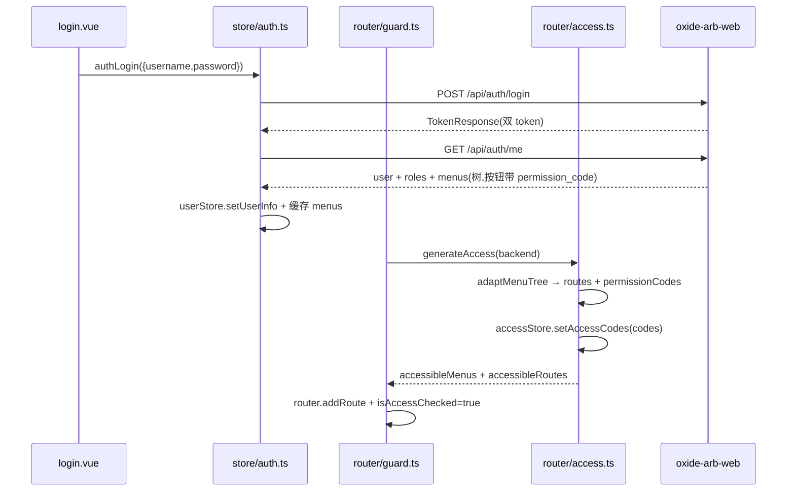

# Phase 7.1 — RBAC 接入、认证流、请求层与基础类型

> **产出**: 请求层对齐后端契约、登录/刷新/登出闭环、backend 动态菜单 RBAC 全链路、权限码聚合 + 按钮级网关、`useGovernedAction`、`packages/types/src/oxide` 基础层、菜单 seed v2
>
> **前置**: [phase7.0](phase7.0-architecture-rules-scaffold.md)
>
> **包含一项小型后端变更**: `crates/oxide-arb-models/src/seed/rbac/menus.rs` bump 至 seed v2(见 §6)

---

## 1. 请求层改造(`src/api/request.ts`)

脚手架现状与目标差异:

| 项 | 脚手架现状 | 目标 |
|---|---|---|
| 成功码 | `successCode: 0` | `successCode: 200`(后端 envelope `{code:200,message,data}`) |
| 版本头 | 无 | `Accept-Api-Version: 'v1'`(所有 `/api/*` 请求) |
| 请求 ID | 无 | `X-Request-Id`: uuid v4,每请求生成(后端审计 envelope 关联) |
| refresh | `baseRequestClient.post('/auth/refresh', { withCredentials: true })`,取 `resp.data`(string) | body `{ refresh_token }`,响应为 `TokenResponse`,**双 token 同落**(轮换) |
| `enableRefreshToken` | preferences 默认 `false` | `true`(`preferences.ts` 覆盖) |
| 错误提示 | 取 `error/message` 字段 | 优先取后端 envelope `message`,否则按状态码 i18n |

目标拦截器链(顺序固定):

```ts
// 请求拦截器
client.addRequestInterceptor({
  fulfilled: (config) => {
    config.headers.Authorization = formatToken(accessStore.accessToken);
    config.headers['Accept-Language'] = preferences.app.locale;
    config.headers['Accept-Api-Version'] = 'v1';
    config.headers['X-Request-Id'] = crypto.randomUUID();
    return config;
  },
});
// 响应链: defaultResponseInterceptor({codeField:'code', dataField:'data', successCode:200})
//        → authenticateResponseInterceptor({doRefreshToken, doReAuthenticate, enableRefreshToken:true})
//        → errorMessageResponseInterceptor(取 envelope.message)
```

`doRefreshToken`:

```ts
async function doRefreshToken() {
  const resp = await refreshTokenApi({ refresh_token: accessStore.refreshToken });
  accessStore.setAccessToken(resp.access_token);
  accessStore.setRefreshToken(resp.refresh_token);   // 轮换:旧 refresh 已被服务端拉黑
  return resp.access_token;
}
```

约定:

- `X-Acting-Role` **不在**全局拦截器注入,由治理调用点经 `useGovernedAction` 按请求传入(`requestClient.post(url, data, { headers })`)。
- `requestClient`(`responseReturn: 'data'`)用于业务;`baseRequestClient` 仅 refresh/logout(避免 401 重入循环)。
- 探针 `/health` `/ready` `/metrics` 不经 `requestClient`(无业务调用场景)。

## 2. 认证 API 与 store(`api/core/auth.ts` / `api/core/user.ts` / `store/auth.ts`)

### 2.1 后端契约

| Method | Path | Req | Resp(`data`) |
|---|---|---|---|
| POST | `/auth/login` | `{ username, password }` | `TokenResponse { access_token, refresh_token, token_type, expires_in }` |
| POST | `/auth/refresh` | `{ refresh_token }` | `TokenResponse`(轮换) |
| POST | `/auth/logout` | Bearer + 可选 `{ refresh_token }` | `null` |
| GET | `/auth/me` | Bearer | `MeResponse { user, roles[], menus[] }` |

### 2.2 `api/core/auth.ts` 重写

```ts
export namespace AuthApi {
  export const base = '/auth';
  export const login = `${base}/login`;
  export const refresh = `${base}/refresh`;
  export const logout = `${base}/logout`;
  export const me = `${base}/me`;
  export interface LoginParams { username: string; password: string; }
}
export async function loginApi(data: AuthApi.LoginParams) {
  return requestClient.post<TokenResponse>(AuthApi.login, data);
}
export async function refreshTokenApi(data: { refresh_token: string | null }) { /* baseRequestClient,手动解 envelope */ }
export async function logoutApi(data: { refresh_token: string | null }) { /* baseRequestClient */ }
export async function getMeApi() {
  return requestClient.get<MeResponse>(AuthApi.me);
}
```

**删除** `getAccessCodesApi`(后端无 `/auth/codes`);`api/core/user.ts` 的 `getUserInfoApi` 由 `getMeApi` 取代(`MeResponse.user + roles` 映射 vben `UserInfo`,`realName ← nickname ?? username`)。

### 2.3 `store/auth.ts` 登录流

```text
authLogin(params)
  → loginApi → TokenResponse
  → accessStore.setAccessToken / setRefreshToken
  → fetchUserInfo():getMeApi()
      → userStore.setUserInfo({...user, roles: roles.map(r => r.code), realName})
      → store 缓存 MeResponse.menus(供守卫期 generateAccess 复用,避免二次请求)
  → 跳转 redirect || '/dashboard'
logout(redirect)
  → logoutApi({ refresh_token }) (忽略失败)
  → resetAllStores() → 跳登录页
```

要点:登录成功后**不再**并行调 codes API;权限码在菜单生成阶段聚合(§3.3)。

## 3. backend 动态菜单 RBAC

### 3.1 `preferences.ts`

```ts
export const overridesPreferences = defineOverridesPreferences({
  app: {
    name: import.meta.env.VITE_APP_TITLE,
    accessMode: 'backend',
    enableRefreshToken: true,
    loginExpiredMode: 'modal',
    defaultHomePath: '/dashboard',
    dynamicTitle: true,
  },
});
```

### 3.2 菜单 API(`api/core/menu.ts`)

```ts
export namespace MenuApi {
  export const base = '/menus';
  export const accessible = `${base}/accessible`;   // AuthenticatedOnly
}
export async function getAccessibleMenusApi() {
  return requestClient.get<MenuTreeNode[]>(MenuApi.accessible);
}
```

### 3.3 菜单适配器(`router/menu-adapter.ts`,新增)

后端返回 `MenuTreeNode`(领域结构),需转换为 vben 的 `RouteRecordStringComponent[]` 并聚合权限码:

```ts
export interface MenuAdaptResult {
  routes: RouteRecordStringComponent[];
  permissionCodes: string[];          // 所有节点(页面+按钮)的 permission_code 去重
}
export function adaptMenuTree(nodes: MenuTreeNode[]): MenuAdaptResult;
```

转换规则(`kind` 取自后端 `MenuKind`):

| kind | 映射 |
|---|---|
| `Directory` | `{ path: '/' + name, name, component: 'BasicLayout', meta: { title, icon, order: sort }, children: adapt(children) }`;无可见子节点的目录丢弃 |
| `Menu` | `{ path, name, component, meta: { title, icon, order: sort, keepAlive: keep_alive, hideInMenu: hide_in_menu } }`;`title` 为 i18n key(seed v2) |
| `Button` | 不产生路由;`permission_code` 收入 `permissionCodes` |

其他规则:`status !== 'enabled'` 节点整支丢弃;页面节点自身的 `permission_code` 同样收入 codes(供「页面内 Tab 级」控制复用);`component` 字符串与 `import.meta.glob('../views/**/*.vue')` 的 pageMap key 匹配(`markets/index` → `/markets/index.vue`),不匹配时 fallback `_core/fallback/not-found.vue`(vben `generateRoutesByBackend` 既有行为)。

### 3.4 `router/access.ts`

```ts
return await generateAccessible('backend', {
  ...options,
  fetchMenuListAsync: async () => {
    const menus = authStore.cachedMenus ?? (await getAccessibleMenusApi());
    const { routes, permissionCodes } = adaptMenuTree(menus);
    useAccessStore().setAccessCodes(permissionCodes);   // 按钮级权限码在此唯一注入点
    return routes;
  },
  forbiddenComponent, layoutMap, pageMap,
});
```

`router/guard.ts` 保持 vben 骨架不动(token 检查 → `isAccessChecked` → `generateAccess` → 写 store)。

### 3.5 按钮级网关

- 指令:`v-access:code="'market:update'"`(`bootstrap.ts` 已注册 `registerAccessDirective`)。
- 组件:`<AccessControl :codes="['risk:reset']" type="code">`。
- 逻辑判断:`useAccess().hasAccessByCodes([...])`(schemas 的 `useColumns` 内控制操作列项 `show`)。
- `super_admin`:`userStore.userRoles` 含 `super_admin` 时 `hasAccessByCodes` 一律放行(在 `useAccess` 包装层实现,与后端 Casbin matcher bypass 对齐)。

### 3.6 流程图



## 4. `useGovernedAction`(实现规格)

规格见 [phase7.0 §5.2](phase7.0-architecture-rules-scaffold.md);本 phase 落地:

- `packages/effects/hooks/src/use-governed-action.ts` + `shared/components/governed-action-modal.vue`。
- Modal 内容:动作标题与摘要(slot)、`reason` 必填文本域(min 4)、acting-role Selector(候选 = `userStore` 角色中 enabled 的;单角色时直接展示不可选)、`danger` 模式的确认词输入。
- 提交回调签名 `(ctx: { actingRole: string; reason: string }) => Promise<T>`;调用方在回调内将 `ctx.reason` 放 body、`ctx.actingRole` 放 header。
- 失败路径走 `useRequestHandler`(toast 后返回 null);403(角色不持有权限)给出专用提示 `governance.error.actingRoleForbidden`。

适用路由(本 phase 仅建好设施,各页面在 7.2–7.7 接线):

`POST /system/mode`、`POST /runtime-config/versions[/{id}/activate|/{id}/rollback]`、`POST /control-factors/{id}/reject`、`POST /control-factors/publications/shadow|publish|emergency|{id}/rollback`、`POST /risk/circuit-breaker/reset`、`POST /risk/blacklist[+/{market_id}/remove]`、`POST /replay`。

## 5. `packages/types/src/oxide` 基础层

本 phase 落地 §7.0 types 骨架中的基础文件(领域文件随各页面 phase 补齐):

```ts
// common.ts
export interface ApiEnvelope<T> { code: number; message: string; data: T; }
export interface Paginated<T> { items: T[]; total: number; page: number; size: number; }
export interface PageQuery { page?: number; size?: number; }            // size ≤ 200
export interface TimeRangeQuery { from?: string; to?: string; }         // ISO 8601
export type UsdString = string;     // rust_decimal 承载,禁止 number
export type PriceString = string;
export type SharesString = string;

// enums.ts(与 Rust serde 输出一致)
export const ExecutionMode = { DryRun: 'dry_run', Paper: 'paper', Live: 'live' } as const;
export type ExecutionMode = (typeof ExecutionMode)[keyof typeof ExecutionMode];
// 同范式:BreakerState / UserStatus / RoleStatus / MenuKind / OperationOutcome / ...

// rbac.ts
export interface UserView { id, username, nickname, avatar, email, phone, status, created_at, updated_at }
export interface RoleInfo { id, code, name, description, status }
export interface MenuInfo { id, parent_id, name, kind, path, component, title, icon, permission_code, sort, keep_alive, hide_in_menu, status }
export interface MenuTreeNode extends MenuInfo { children: MenuTreeNode[] }
export interface Permission { resource: string; operation: string }
export interface PermissionCatalogEntry { resource: string; operations: string[] }
export interface MeResponse { user: UserView; roles: RoleInfo[]; menus: MenuTreeNode[] }
export interface TokenResponse { access_token: string; refresh_token: string; token_type: 'Bearer'; expires_in: number }

// system.ts
export interface SystemStatus { execution_mode: ExecutionMode; breaker_state: BreakerState; uptime_secs: number;
  active_markets: number; open_positions: number; pending_reservations: number;
  total_exposure: UsdString; daily_pnl: UsdString; checked_at: string }
export interface ModeTransitionReport { from: ExecutionMode; to: ExecutionMode }
export interface HealthReport { /* 子系统检查项,对齐 domain/governance/system.rs */ }
```

字段名以 `crates/oxide-arb-models/src/domain/api/*` 的 serde 输出为准,实现时逐一对照,不凭记忆。

## 6. 菜单 seed v2 对齐清单(后端变更)

`seed/rbac/menus.rs` bump `version: 2` + 新 checksum,目标树与 [伞形文档 §3.1](phase7-ui-layer.md) 完全一致。相对 v1 的变更:

| 变更 | 说明 |
|---|---|
| 删除 Trading > PnL 页(`/pnl`) | PnL 数据并入 Overview KPI 与 Analytics;`/api/pnl/*` 仍被消费,仅去掉独立菜单 |
| 删除 Governance > Materializations 页(`/materializations`) | 无专用 HTTP 路由(enqueue 走 `replay:create`),Replay 页覆盖 |
| 删除 System 目录及 System Control 页(`/system`) | halt/resume/switch-mode 收敛到顶栏 + Overview;三个按钮节点(`system:halt/resume/switch_mode`)**移挂** Dashboard > Overview 页下,保证权限码仍经 `/auth/me` 聚合 |
| Operation Log 移入 Governance(更名 Operations 目录) | 原挂 System 目录下 |
| Replay 目录并入 Operations | 单页目录冗余 |
| 删除 Access Control > Permissions 页(`/permissions`) | 权限目录(`GET /permissions/catalog`)在角色页权限矩阵 Modal 内消费;`permission:read` 码移挂 Roles 页按钮节点 |
| 全部 `title` 改为 i18n key(`page.menu.*`) | 前端 `meta.title` 自动翻译 |
| Overview 页新增按钮节点 `pnl:read`? | 不需要——区块级降级用页面码即可;Overview 页保持无权限码 |

按钮节点全量表(v2):

| 页面 | 按钮 permission_code |
|---|---|
| Overview | `system:halt` / `system:resume` / `system:switch_mode` |
| Markets | `market:update` |
| Risk Overview | `risk:reset` |
| Blacklist | `blacklist:create` / `blacklist:delete` |
| Runtime Config | `runtime_config:create` / `runtime_config:activate` / `runtime_config:rollback` |
| Control Factors | `control_factor:reject` / `control_factor:shadow` / `control_factor:publish` / `control_factor:emergency` |
| Publications | `publication:rollback` |
| Replay | `replay:create` |
| Users | `user:create` / `user:update` / `user:delete` / `user:assign` |
| Roles | `role:create` / `role:update` / `role:delete` / `role:assign` / `permission:read` |
| Menus | `menu:create` / `menu:update` / `menu:delete` |

> seed 重放注意:v1 已落库的环境,`on_conflict(id).do_nothing` 不会清旧行;v2 实现需配套「按 seed id 重建菜单树」策略(删除旧 seed 产物后重插,或迁移脚本),具体由实现时依据 `schema/seed` 框架能力决定并在 PR 中说明。

## 7. 登录页与 _core 清理

- `views/_core/authentication/` 保留 `login.vue`,删除 `code-login / qrcode-login / register / forget-password`(后端无对应能力);`router/routes/core.ts` 同步删除路由。
- `views/_core/profile/` 保留(消费 `/auth/me`;修改密码走 `PUT /users/{id}/password`,仅当用户持 `user:update` 时展示——自助改密端点后端暂无,文档标注缺口)。

## 8. 验收清单

- [ ] 登录 → 双 token 落库(secure-ls 持久化)→ `/auth/me` → 动态路由生成 → 首页 `/dashboard` 渲染
- [ ] access token 过期后任意请求自动 refresh 轮换并重放原请求;refresh 失效弹登录过期 Modal
- [ ] `viewer` 角色登录:仅见读菜单;`v-access` 隐藏所有 mutating 按钮;直接访问无权路由 → 403
- [ ] `super_admin` 登录:全菜单 + 全按钮可见
- [ ] 治理动作经 `useGovernedAction` 发出的请求含 `X-Acting-Role` + body `reason`,Operation Log 可查到 `request_id` 关联记录
- [ ] 所有请求头含 `Accept-Api-Version: v1` + `X-Request-Id`(抓包验证)
- [ ] 菜单 seed v2 落库后,`/menus/accessible` 返回树与伞形文档 §3.1 一致;前端 `views/` 目录与 component 全匹配(无 not-found fallback)
- [ ] `packages/types/src/oxide/{common,enums,rbac,system}.ts` 完成且通过 `pnpm typecheck`
