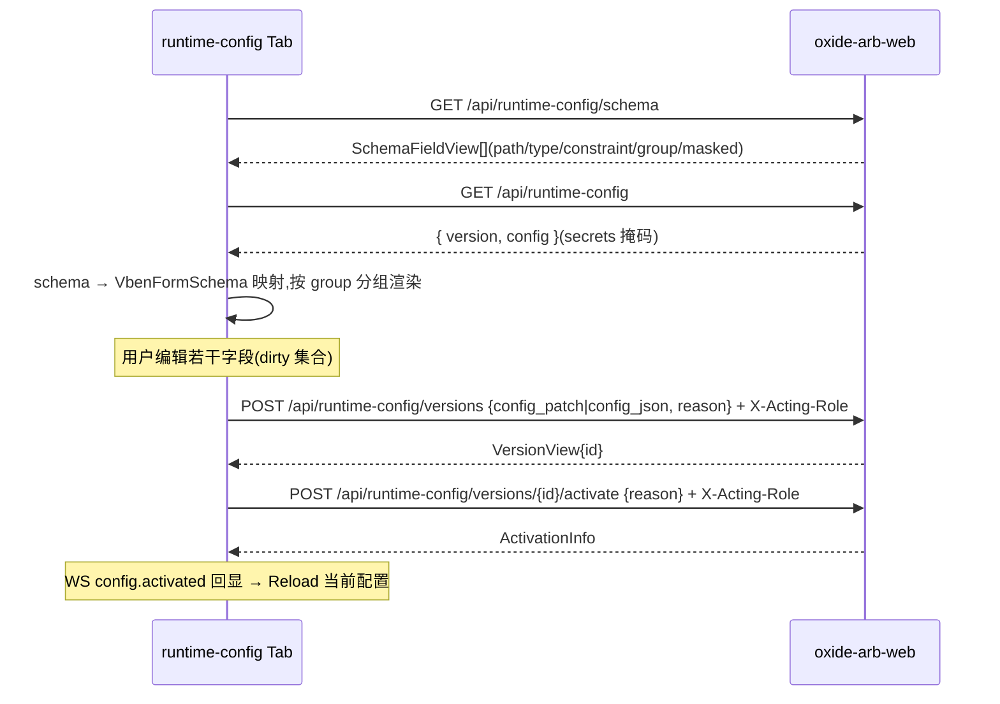

# Phase 7.6 — Operations 治理页面群 + 偏好抽屉「运行时配置」

> **产出**: Runtime Config 版本页、Control Factors、Publications、Replay、Audit Chain、Operation Log 六个治理页 + 偏好设置抽屉「运行时配置」编辑 Tab
>
> **前置**: [phase7.2](phase7.2-overview-realtime-header.md)
>
> **设计原则**(已确认的「配置分层」决策):偏好抽屉只承载「编辑当前配置 → 创建新版本并激活」的高频路径;版本历史 / diff / 回滚 / 治理证据等低频但重审计的操作全部在独立页面

---

## 1. 偏好抽屉「运行时配置」Tab

### 1.1 接线方式(fork 级,参照 ng-gateway system/logging 块)

- 在 `packages/effects/layouts/src/widgets/preferences/preferences-drawer.vue` 的 `tabs` computed 与 template 中注册新 Tab `runtimeConfig`(label `$t('preferences.runtimeConfig.title')`)。
- 块组件目录:`packages/effects/layouts/src/widgets/preferences/blocks/runtime-config/`:

```text
blocks/runtime-config/
├── index.vue                # Tab 总入口:加载 schema + 当前配置,分组渲染 ConfigGroupCard
├── config-group-card.vue    # CardShell 范式:分组表单 + dirty 检测 + Apply/Reset/Reload
├── card-shell.vue           # 移植 ng-gateway card-shell(loading/dirty/error 壳)
└── types.ts                 # 块内局部类型
```

- Tab 可见性:`accessStore.accessCodes` 含 `runtime_config:read` 才渲染;Apply 按钮另查 `runtime_config:create` + `runtime_config:activate`。

### 1.2 数据流(schema 驱动)



要点:

- **schema → 表单映射器**(`runtime-config-schema-mapper.ts`,与 7.7 菜单页无关,放块目录内):字段类型(number/decimal-string/bool/string/enum)+ constraint(min/max/枚举值)→ `VbenFormSchema`(zod 校验);`masked` 字段渲染密码框且未修改时不回传(保持后端掩码语义)。
- **提交 = 一次治理流两个请求**:`useGovernedAction` 弹一次窗(reason 同时用于 create 与 activate,文案标明);中途失败(created 未 activated)→ 显式提示「版本已创建未激活,请到 Runtime Config 页处理」并附版本 id 链接。
- **Diff 预览**:Apply 前展示 dirty 字段 old → new 列表(确认弹窗内嵌)。
- 块内 API 调用直接复用 app `api/runtime-config.ts`?——块位于 packages 层,**不可**反向依赖 app:与 ng-gateway 同策略,块内建独立轻量 client(`blocks/runtime-config/api.ts`,基于 `@vben/request` 的 `RequestClient`,注入同四头),与 app `request.ts` 行为对齐。

## 2. Runtime Config 版本页(`views/runtime-config/`)

| 项 | 值 |
|---|---|
| 路由 / component | `/runtime-config` / `runtime-config/index` |
| 菜单码 | `runtime_config:read`;按钮码 `runtime_config:create / activate / rollback`(均 **governed**) |
| grid/drawer | 版本列表 `useVbenVxeGrid`(`GET /runtime-config/versions?limit=`,无分页参数→本地分页);版本详情/diff `useVbenDrawer` 只读;新建版本(高级场景,直接编辑 JSON)`useVbenDrawer` + JSON 编辑器 |
| WS | `config.activated` → 刷新列表 + 当前版本高亮 |
| i18n | `page.runtimeConfig.*` |
| types | `RuntimeConfigCurrentView / VersionView / SchemaFieldView / ActivationInfo`(`oxide/runtime-config.ts`) |

布局与交互:

```text
┌ 当前生效卡: 版本号 | 激活时间 | 激活人 | [查看配置](Drawer)               ┐
├ 版本 Grid: 版本 | 创建时间 | 创建人 | 状态(CellTag: active/inactive)      ┤
│           | reason | 操作(CellOperation: 详情 / 激活 / 回滚到此版本)      │
└ VersionDetailDrawer: 配置 JSON(JsonViewer) + 与当前生效版本的 diff 视图   ┘
```

- **激活**(`runtime_config:activate`,非 active 版本可用):`useGovernedAction` → `POST /versions/{id}/activate {reason}`。
- **回滚**(`runtime_config:rollback`):语义 = 回滚到选中历史版本,`useGovernedAction`(danger)→ `POST /versions/{id}/rollback {reason}`。
- **新建版本**(`runtime_config:create`,toolbar):Drawer 内 JSON 编辑(预填当前配置),提交 `POST /versions {config_json, reason}`(governed);仅创建不激活(激活是独立动作)。
- diff 视图:两版本 JSON 拍平为 path → value 对比表(新增/删除/变更三色)。

API(`api/runtime-config.ts`):`getCurrentRuntimeConfig` / `getRuntimeConfigSchema` / `fetchRuntimeConfigVersions({limit})` / `createRuntimeConfigVersion({config_json,reason}, actingRole)` / `activateRuntimeConfigVersion(id, {reason}, actingRole)` / `rollbackRuntimeConfigVersion(id, {reason}, actingRole)`。

## 3. Control Factors 页(`views/control-factors/`)

| 项 | 值 |
|---|---|
| 路由 / component | `/control-factors` / `control-factors/index` |
| 菜单码 | `control_factor:read`;按钮码 `control_factor:reject / shadow / publish / emergency`(均 **governed**) |
| grid/drawer | 因子 `useVbenVxeGrid`(搜索: status + factor_type);因子详情 `useVbenDrawer`;Shadow/Publish/Emergency 发布 `useVbenModal`(多选因子 + 发布参数表单) |
| WS | `control.published` → info 提示 + 刷新 |
| i18n | `page.controlFactors.*`;`enum.factorStatus.*` |
| types | `ControlFactorValueInfo / PublishPublicationRequest / EmergencyPublishRequest`(`oxide/control-factor.ts`) |

布局与交互:

```text
┌ 搜索: 状态(默认 Candidate) | factor_type                                   ┐
├ Grid(checkbox 多选): 因子 | 类型 | 状态(CellTag) | 值快照 | 创建时间        ┤
│   行操作: 详情 / 拒绝(reject)                                              │
│   toolbar: [发布 Shadow] [正式发布 Publish] [紧急发布 Emergency](多选驱动) │
└ PublishModal: factor_ids 回显 + idempotency_key(自动生成可改)              ┘
   + effective_from / expires_at + manual_risk_expansion_approval 勾选
   + 治理 reason + acting-role(emergency 走 danger 确认词,TTL 1h 由服务端定)
```

- **拒绝**:行操作 → `useGovernedAction` → `POST /control-factors/{id}/reject {reason}`。
- **三种发布**:同一个 `publish-modal.vue` 按 mode 复用(shadow / publish / emergency 三入口,字段差异由 props 控制);提交分别打 `POST /control-factors/publications/shadow|publish|emergency`(governed)。
- 因子详情 Drawer:值快照 JsonViewer + 治理链摘要。

API(`api/control-factors.ts`):`fetchControlFactors({status,factor_type})` / `getControlFactor(id)` / `rejectControlFactor(id,{reason},actingRole)` / `publishShadow(req,actingRole)` / `publishLive(req,actingRole)` / `publishEmergency(req,actingRole)`。

## 4. Publications 页(`views/publications/`)

| 项 | 值 |
|---|---|
| 路由 / component | `/publications` / `publications/index` |
| 菜单码 | `control_factor:read`;按钮码 `publication:rollback`(**governed**) |
| grid/drawer | `useVbenVxeGrid`(搜索: mode + status + limit);详情 `useVbenDrawer`(含 shadow 决策证据 Tab) |
| WS | `control.published` → 刷新 |
| types | `PublicationView / ShadowDecisionRow`(`oxide/control-factor.ts`) |

交互:

- Grid 列:publication_id | mode(CellTag) | 状态 | 因子数 | 生效/过期时间 | 操作(详情 / 回滚)。
- **回滚**:`useGovernedAction`(danger)→ `POST /control-factors/publications/{id}/rollback {target_publication_id, reason}`;target 在弹窗内从历史 publication 下拉选择。
- 详情 Drawer Tabs:① 基础信息 + 因子清单;② **Shadow 决策证据**:`GET /publications/{id}/shadow-decisions`(窗口参数)渲染为对比表(shadow vs live 决策一致率)。

API(`api/control-factors.ts`,续):`fetchPublications({mode,status,limit})` / `getPublication(id)` / `rollbackPublication(id,{target_publication_id,reason},actingRole)` / `fetchShadowDecisions(id,params)`。

## 5. Replay 页(`views/replay/`)

| 项 | 值 |
|---|---|
| 路由 / component | `/replay` / `replay/index` |
| 菜单码 | `replay:read`;按钮码 `replay:create`(**governed**) |
| grid/drawer | run 列表 `useVbenVxeGrid`;新建 `useVbenDrawer`(表单字段多);run 详情 `useVbenDrawer` + `usePolling` |
| WS | 无专用通道 → `usePolling`(5s,`pauseOnHidden`,terminal 状态停止) |
| types | `ReplayCreateRequest / ReplayEnqueueView / MaterializationRunView / StageReport`(`oxide/replay.ts`) |

**后端缺口**(伞形文档 §6):无 run 列表端点。处理:

1. 文档要求实现期补 `GET /api/replay`(分页,`replay:read`)——加入本 phase 的后端对齐项;
2. 落地前过渡:页面提供「run_id 查询框」+ 本地最近入队记录(`localStorage`,入队成功时记录)。

交互:

- **新建 replay**(`replay:create`,toolbar):Drawer 表单 = `ReplayCreateRequest` 字段(schema 对齐 `domain/api/replay.rs`)+ 治理 reason/acting-role;成功 toast 返回 `run_id` 并写入本地记录。
- **run 详情 Drawer**:`GET /replay/{run_id}` 概要 + `GET /replay/{run_id}/history` 阶段报告时间线(复用 `audit-timeline`);非 terminal 状态时 `usePolling` 自动刷新,Drawer 关闭即 stop。

API(`api/replay.ts`):`createReplay(req, actingRole)` / `getReplayRun(runId)` / `getReplayHistory(runId)`(+ 待后端:`fetchReplayPage`)。

## 6. Audit Chain 页(`views/audit/`)

| 项 | 值 |
|---|---|
| 路由 / component | `/audit` / `audit/index` |
| 菜单码 | `audit:read`(只读,无按钮) |
| grid/drawer | `useVbenVxeGrid`(游标式:`from_sequence + limit`,「加载更多」替代页码)+ 事件详情 `useVbenDrawer`(JsonViewer) |
| types | `AuditChainResponse / AuditEventRow`(`oxide/control-factor.ts`) |

- Grid 列:sequence | 时间 | 事件类型(CellTag) | actor | acting_role | 资源 | 摘要 | 操作(详情)。
- 游标分页:`GET /control-factors/audit?from_sequence&limit`;vxe proxy 不适配游标 → 本页用 grid 静态 data + 自管「加载更多」按钮(范式允许:无 server 页码时豁免 proxyConfig,但仍走 `useVbenVxeGrid`)。
- 详情 Drawer:完整事件 payload + 链式哈希字段展示(prev_hash → hash 验证状态)。

API(`api/control-factors.ts`,续):`fetchAuditChain({from_sequence,limit})`。

## 7. Operation Log 页(`views/operation-log/`)

| 项 | 值 |
|---|---|
| 路由 / component | `/operation-log` / `operation-log/index` |
| 菜单码 | `operation_log:read`(只读) |
| grid/drawer | 标准列表骨架(搜索: actor_user_id / category / resource_type / outcome / 时间范围);详情 `useVbenDrawer`(JsonViewer 渲染 `detail`) |
| types | `OperationLogView`(`oxide/operation-log.ts`) |

- Grid 列:时间(CellDateTime) | 操作人 | acting_role | 动作 | 资源类型 | 资源 | 结果(CellTag: outcome) | request_id(截断复制) | 操作(详情)。
- 详情 Drawer:redacted `detail` JSON + `governance_audit_event_id` 链接(有值时跳 Audit Chain 页定位 sequence)。

API(`api/operation-logs.ts`):`fetchOperationLogPage(params)` → `GET /operation-logs`。

## 8. 文件清单汇总

```text
views/{runtime-config,control-factors,publications,replay,audit,operation-log}/
└── 各自 index.vue + modules/{schemas,widgets}(骨架同 7.0 §1.1)
packages/effects/layouts/src/widgets/preferences/blocks/runtime-config/
├── index.vue / config-group-card.vue / card-shell.vue / api.ts / schema-mapper.ts / types.ts
packages/locales/src/langs/*/preferences.json     # preferences.runtimeConfig.* 文案
```

## 9. 验收清单

- [x] 偏好抽屉 Tab:schema v2 驱动 shadcn 字段栈;稀疏 `config_patch` Apply;dirty diff 预览 + money_critical 确认;WS `config.activated` 后自动 Reload
- [x] 掩码字段未修改时不进入 patch;修改后明文提交且后续读取仍为掩码
- [x] Runtime Config 页:版本列表/详情 diff/激活/回滚闭环;当前生效版本高亮 + activation 元数据;`?version_id=` 深链
- [x] Control Factors:Governance Tab 治理链;reject 仅 candidate;`control.published` 推送后列表刷新
- [x] Publications:回滚仅 active;shadow 决策证据 Tab(窗口 + 摘要卡 + baseline/shadow 对比)
- [x] Replay:列表 WS `materialization.run_update` 刷新;入队 → run_id 详情
- [x] Audit Chain `event_id`/`sequence` 深链定位;Operation Log 时间范围 + request_id 复制 + 治理互查
- [x] 全部治理动作:无码角色不可见按钮;抓包验证 `X-Acting-Role` + reason;Operation Log 留痕含 `governance_audit_sequence`
