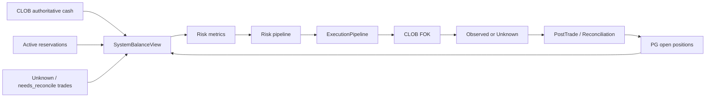
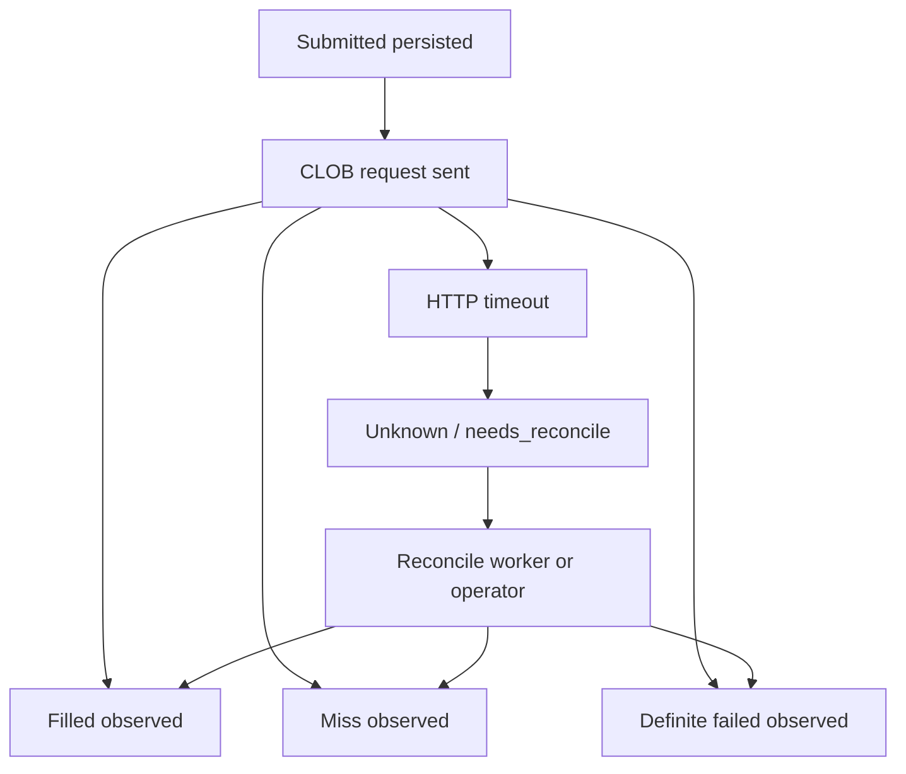

# oxide-arb P0/P1 生产修复实施计划

> **SUPERSEDED（2026-06）：** 实盘安全收窄版已合并至 Live Safety Remediation 计划（Trade Integrity Core、Exposure 读模型、Control Factor warn-only、文档对齐）。下文 P0 细节仅作历史参考；实施请以当前代码与 `docs/operations/live-trading-sop.md` 为准。

> 目标：关闭实盘前必须修复的资金、订单、敞口、感知、测试闭环问题。  
> 原则：不做向前兼容包袱；删除错误语义，合并重复机制，保留单一清晰真相。

---

## 1. 总体目标

当前主链路已经能跑，但生产级真钱系统还缺四条闭环：

```text
资金真相闭环
订单未知态闭环
敞口连续性闭环
运维感知闭环
```

修复后的目标状态：



---

## 2. P0-1 Live 对账口径修复

### 2.1 问题

当前 Live 有两套 cash truth：

```text
预交易：CLOB collateral_balance
定期对账：bankroll_usd - successful_spend + settlement_payout
```

`bankroll_usd` 在 Live 中应该是策略 cap，不应作为真实现金 baseline。

### 2.2 目标设计

Live 中只保留：

```text
authoritative_cash = CLOB collateral_balance
strategy_cap = runtime risk.bankroll_usd
internal_exposure = PG open positions + active reservations + unknown orders
```

对账比较的是：

- authoritative cash 是否可读、是否新鲜；
- PG open positions 是否能解释当前 exposure；
- active reservations 是否未超限；
- unknown trades 是否需要人工处理；
- open order invariant 是否被破坏。

### 2.3 修改范围

| 文件 | 修改 |
| --- | --- |
| `crates/oxide-arb-core/src/app/periodic_services.rs` | 删除 Live `internal_cash = bankroll - spend + payout` 作为真实余额对账的逻辑 |
| `crates/oxide-arb-risk/src/reconciliation.rs` | 明确 `ReconciliationReport` 的 cash 语义，避免空 external positions 导致 false critical |
| `crates/oxide-arb-core/src/service/risk_metrics.rs` | 保持 Live CLOB authoritative cash，为 balance view 输出提供数据 |
| `crates/oxide-arb-core/src/bridge/risk_metrics.rs` | 确认 `RiskMetricsSnapshot` 中 cash/equity/exposure 语义一致 |

### 2.4 删除/合并项

删除：

```text
Live internal_cash = bankroll - spend + payout
```

保留：

```text
DryRun/Paper simulated_cash = bankroll - spend + payout
```

合并：

```text
Live balance / risk metrics / reconciliation
```

都必须从 CLOB authoritative source 出发。

### 2.5 测试

新增或修改：

- Live 人工充值不触发 critical。
- Live 有 open position 但无外部 position 数据时不 false critical。
- CLOB balance fetch 失败时 fail-closed。
- `bankroll_usd` 改小只影响 sizing cap，不改 authoritative cash。

---

## 3. P0-2 FOK timeout unknown 闭环

### 3.1 问题

timeout 当前被当作 terminal failed，但真实 venue 可能已经成交。

### 3.2 目标设计

引入明确业务语义：

```text
Unknown venue outcome
```

最小实现可以通过现有 `needs_reconcile` 字段承载，但 trade state / outcome 必须能表达“未知，不能按失败结账”。

建议流程：



### 3.3 修改范围

| 文件 | 修改 |
| --- | --- |
| `crates/oxide-arb-models/src/enums/common.rs` 或 execution/trade enum | 增加 Unknown / NeedsReconcile 状态或复用现有状态但明确语义 |
| `crates/oxide-arb-core/src/execution/fok_strategy.rs` | timeout 不再返回普通 `Failed` |
| `crates/oxide-arb-core/src/execution/execution_pipeline.rs` | unknown outcome 不做 terminal failed accounting |
| `crates/oxide-arb-repository/src/postgres/...trade...` | 支持 mark needs_reconcile / unknown |
| `crates/oxide-arb-core/src/post_trade/relay.rs` | orphan 与 timeout unknown 合并进入同一 reconciliation queue |

### 3.4 删除/合并项

删除：

```text
timeout == failed
```

合并：

```text
orphan submitted
timeout unknown
needs_reconcile
```

成为一条统一工作流。

### 3.5 测试

必须覆盖：

- CLOB timeout 不产生 terminal failed。
- CLOB timeout 不触发 fill accounting。
- CLOB timeout 标记 `needs_reconcile`。
- unknown trade 出现在 balance/system view。
- operator/reconcile 后才能 terminal。

---

## 4. P0-3 Exposure 连续性修复

### 4.1 问题

Filled 后 reservation 立即 confirm 移除，但 position 稍后才落库，存在 exposure=0 空窗。

### 4.2 目标设计

真实成交后 exposure 连续：

```text
Reserved exposure
  -> Filled pending exposure
  -> Position exposure
```

优先方案：

- reservation 在 Filled 后不立即从风险视图消失；
- post-trade position 创建成功后再 release/confirm；
- 或 market inflight guard 延长到 post-trade ack。

### 4.3 修改范围

| 文件 | 修改 |
| --- | --- |
| `crates/oxide-arb-core/src/execution/execution_pipeline.rs` | Filled 后不立即让 exposure 消失 |
| `crates/oxide-arb-core/src/post_trade/consumer.rs` | position 落库后释放 filled-pending exposure |
| `crates/oxide-arb-core/src/exposure/in_memory.rs` | 如需区分 reserved / filled_pending，尽量在同一 backend 内完成 |
| `crates/oxide-arb-core/src/execution/market_inflight.rs` | 如采用延长 inflight，避免重复入场 |

### 4.4 删除/合并项

避免新增第三套临时锁服务。

优先复用：

- reservation
- market inflight
- trade state

### 4.5 测试

必须覆盖：

- Filled 后、position 创建前，同 market 第二次执行被拒。
- position 创建后，exposure 由 position 接管。
- post-trade 失败时系统进入 emergency 或保持阻断，不静默释放。

---

## 5. P0-4 单一资金状态 API

### 5.1 问题

运营不能从一个端点回答真钱问题。

### 5.2 目标设计

新增：

```http
GET /api/system/balance
```

响应建议：

```json
{
  "execution_mode": "live",
  "source": "authoritative_clob",
  "cash_balance": "300.00",
  "position_mark_value": "12.50",
  "equity": "312.50",
  "bankroll_cap": "300.00",
  "reserve_balance": "50.00",
  "reserved_usd": "25.00",
  "total_exposure": "80.00",
  "available_for_sizing": "175.00",
  "open_position_count": 3,
  "active_reservation_count": 1,
  "unknown_trade_count": 0,
  "metrics_age_secs": 2,
  "is_authoritative": true,
  "is_stale": false
}
```

### 5.3 修改范围

| 文件 | 修改 |
| --- | --- |
| `crates/oxide-arb-models/src/domain/api/system.rs` | 新增 `SystemBalanceView` |
| `crates/oxide-arb-core/src/control/status.rs` 或新 balance builder | 构造资金视图 |
| `crates/oxide-arb-web/src/routes/system.rs` | 新增 route spec 和 handler |
| `crates/oxide-arb-web/tests/web/*` | 补 API 测试 |

### 5.4 删除/合并项

UI 不再拼：

```text
system/status + pnl/live + risk/exposure
```

所有资金状态以 `SystemBalanceView` 为准。

---

## 6. P0-5 Snapshot CI 修复

### 6.1 问题

当前 workspace test 被 `.snap.new` 阻断。

### 6.2 目标设计

对 runtime config schema 做语义 review：

- 如果新 schema 正确，接受快照。
- 如果新 schema 不正确，修生成源。

### 6.3 验收

```bash
cargo test --workspace --all-targets
```

必须通过。

---

## 7. P1 修复

### 7.1 mode transition 测试

新增覆盖：

- preflight failure no commit
- Live without ClobClient fail
- quiesce timeout fail closed
- activation failure stays halted
- successful transition persists mode
- active reservations drain

### 7.2 Web Live 切换测试

新增覆盖：

- acting role
- operation log
- body reason
- error mapping
- status after transition

### 7.3 needs_reconcile worker / operator API

设计为 P1，因为 P0 先阻止错误终局，P1 再做自动/半自动修复。

建议 endpoint：

```http
GET  /api/trades/reconciliation
POST /api/trades/{trade_id}/reconcile
```

### 7.4 Treasury SOP / events

先落文档 SOP，再考虑：

```text
treasury_event
  deposit
  withdraw
  operator_adjustment
```

但 treasury event 不得替代 venue authoritative cash。

---

## 8. 实施顺序

推荐顺序：

1. 文档报告与计划。
2. Snapshot CI 修复。
3. Live reconciliation 修复。
4. FOK timeout unknown。
5. Exposure continuity。
6. System balance API。
7. mode transition / web tests。
8. ignored gates。

原因：

- 先恢复 CI，后续每一步都有干净反馈。
- reconciliation / timeout / exposure 都是实盘真钱 P0，优先于 UI。
- balance API 依赖前面语义稳定。

---

## 9. 最终验收命令

基础：

```bash
cargo fmt
cargo test --workspace --all-targets
cargo clippy --workspace --all-targets -- -D warnings
```

关键子集：

```bash
cargo test -p oxide-arb-risk --all-targets
cargo test -p oxide-arb-core --all-targets
cargo test -p oxide-arb-api --all-targets
```

生产前：

```bash
cargo test-docker
cargo test-network
cargo test -p oxide-arb-core --test production_soak -- --ignored --exact
cargo bench -p oxide-arb-bench --no-run
```

---

## 10. Live 放行标准

只有满足以下条件，才允许小资金 canary：

- P0 全部关闭。
- 全量测试绿。
- 单一资金状态 API 可用。
- 无 unknown trades。
- 无 active reservations。
- CLOB balance authoritative。
- dedicated bot wallet。
- runtime bankroll cap <= bot USDC。
- operation SOP 已确认。
- canary 限额 200-500 USDC。

canary 成功后，必须至少完成一个：

```text
FOK fill -> market resolve -> redeem -> realized PnL
```

才能考虑加钱。
