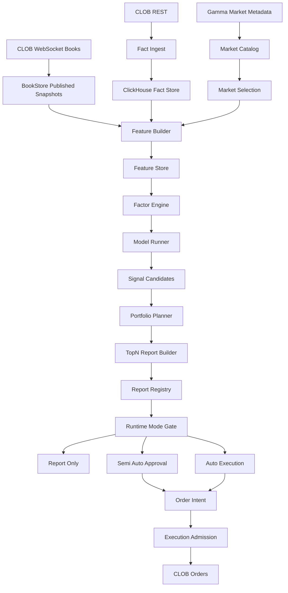

# 00 — Quant Pivot 总体架构

> 状态：生产级目标架构
>
> 范围：Polymarket-only quant-pivot
>
> 取代：Endgame detector、ScoredOpportunity、FOK-first execution hot path、hold-to-resolution settlement loop

## 0. 一句话目标

`quant-pivot` 是一个 Polymarket-only 的量化决策系统。它持续采集 Polymarket 市场事实，构建可审计特征和因子，定时训练或刷新模型，周期性输出 TopN 量化建议报告，并在受治理运行模式下决定是否把建议转成待审批或自动执行的订单意图。

系统必须回答：

- 买什么：具体 `MarketId`、`TokenId`、方向、价格区间。
- 什么时候买：入场触发条件、有效期、数据新鲜度要求。
- 买多少：建议 USD、shares、组合占比、最大允许滑点。
- 什么时候卖：止盈、止损、时间出场、事件出场。
- 卖多少：全部退出、分批退出比例、剩余仓位处理。
- 为什么：因子贡献、模型版本、样本覆盖、回测证据、风险解释。

## 1. 产品边界

### 1.1 保持 Polymarket-only

系统继续只接入 Polymarket：

- Gamma 作为 market/event metadata 来源。
- CLOB REST / WS 作为 book、quote、order 和 fill 来源。
- Polygon / CTF 仅在执行和结算证据需要时使用。

禁止引入：

- `VenueId`。
- generic exchange adapter。
- multi-platform router。
- venue-neutral order API。
- cross-exchange arbitrage 类型。

保留 Polymarket-only 不是为了保守，而是为了让新量化系统先在一个清晰交易微结构、结算规则、API 限制和数据质量边界内做到生产级闭环。

### 1.2 删除 Endgame-only 产品定义

旧系统的核心假设全部作废：

- 市场必须接近结算窗口。
- 最佳 ask 必须进入 0.95 附近 convergence zone。
- `ConvergenceDirection` 是主要 alpha。
- `ResolutionCalibrator` 是核心概率来源。
- 机会是 hold-to-$1 的 settlement bet。
- 事件驱动扫描后立即走 FOK order。
- PnL 报告是主要业务结果。

新系统可以使用 endgame 类特征，但它只能作为一个普通因子，不能再作为系统主语义。

### 1.3 主产物变更

| 旧系统 | 新系统 |
|---|---|
| `Opportunity` | `SignalCandidate` |
| `ScoredOpportunity` | `Recommendation` |
| `OpportunityDetected` event | `RecommendationReportPublished` event |
| `ExecutionMode::DryRun/Paper/Live` | `QuantRuntimeMode::ReportOnly/SemiAuto/AutoExecution` |
| `trade` row as central lifecycle | `recommendation_report` + `recommendation` as central lifecycle |
| `risk pre-trade check` | `RiskEnvelope` + execution admission check |
| settlement/redeem loop | explicit exit plan + optional settlement evidence |

## 2. 生产不变量

### 2.1 数据不变量

- 所有 market-level 决策必须能追溯到 point-in-time 可见数据。
- Feature 只能使用 `as_of` 时刻可见的数据；禁止用未来 settlement 或后验标签污染训练与报告。
- 所有价格、USD、shares、probability 使用 `Decimal` 或现有 newtype；禁止用 `f64` 表示 money/price/share。
- ClickHouse 是事实与分析库，不是 runtime 权威状态库。
- Postgres 是报告、配置、模型 registry、审批、执行意图和审计的权威状态库。
- 热路径或报告生成路径不得同步依赖未限时的外部 I/O。

### 2.2 模型不变量

- 每个模型输出必须携带 `model_version`、`feature_schema_version`、`training_dataset_id`、`runtime_config_version_id`。
- 每个 recommendation 必须携带 factor breakdown，不能只给一个 opaque score。
- 模型未通过质量门禁时只能进入 `report_only_shadow`，不能进入半自动或自动执行。
- 训练标签必须声明 `label_available_at`；未成熟标签不能用于监督评估。
- 线上报告与离线回放必须共享同一套 feature definition，禁止两套逻辑漂移。

### 2.3 报告不变量

- 每份报告必须有唯一 `report_id`、`as_of`、`horizon`、`market_selection_id`。
- TopN 排序必须稳定：score 相同按 risk-adjusted score、liquidity、market_id 排序。
- 每条 recommendation 必须包含 entry、sizing、exit、risk、evidence 五块。
- 报告可以为空，但空报告必须说明原因：market selection empty、data stale、quality gate failed、risk budget exhausted 等。
- 已发布报告不可变；修正必须生成新版本或撤销事件。

### 2.4 执行不变量

- `report_only` 永不产生订单。
- `semi_auto` 只能把 recommendation 转成 `PendingApproval` 的 `OrderIntent`，人工批准后才能发单。
- `auto_execution` 也必须先生成 `OrderIntent`，再经过 risk envelope、venue guard、capital reservation、kill switch。
- recommendation 过期后不能执行。
- entry trigger 未满足时不能执行。
- exit plan 是订单生命周期的一部分，不能靠 runbook 或人工记忆维护。
- 任一关键状态恢复失败时，执行侧 fail closed，但报告生成可以降级为 `execution_disabled`。

### 2.5 治理不变量

- runtime config v3 版本不可变，激活 append-only。
- 模型发布、因子发布、报告发布、审批、执行、撤销都必须写 operation log。
- 提高风险、扩大预算、开启自动执行必须需要更高权限和显式 reason。
- 禁止 re-export 兼容层；所有模块路径以新语义命名。

## 3. 目标分层架构



### 3.1 Data Plane

职责：

- 同步 market/event metadata。
- 维护 token/market 映射。
- 维护 L2 book published snapshot。
- 写入 ClickHouse facts、bars、book snapshots、microstructure aggregates。
- 输出 data quality status。

保留并重命名：

- `BookStore` 模式保留。
- `GammaService` 保留为 Polymarket catalog sync。
- `DataPipeline` 保留 WS ingest 能力，但不再直接触发 execution hot path。
- `BookGate` / `StalenessClassifier` 保留为 data-quality gate。

删除：

- `engine_endgame_window_hours` 语义。
- `Coalescer` 作为 token update -> market scan -> execution 的触发器。
- endgame-only hot subscription policy。

### 3.2 Selection Plane

职责：

- 根据 runtime config v3 构造本次报告的候选市场集合。
- 支持 category、event、liquidity、volume、expiry、market status、manual include/exclude。
- 生成不可变 `MarketSelection` snapshot（`quant_market_selection` + members）。

Selection 不是交易白名单，而是报告输入集合。执行侧还会有单独的 admission gate。

### 3.3 Feature Plane

职责：

- 将 market metadata、book、tick、bar、historical facts 转成 point-in-time feature vector。
- 每个 feature 必须记录 source、observed_at、as_of、staleness、schema version。
- 支持通用因子和垂直领域因子。

通用特征：

- price momentum。
- spread。
- depth。
- imbalance。
- volatility。
- volume。
- book age。
- category liquidity。
- event correlation。
- time-to-resolution。

垂直领域特征：

- sports：赛程阶段、比分状态、开赛/完赛窗口。
- politics：poll shift、event timing、market crowding。
- crypto：underlying price move、funding/risk-on proxy。
- weather：forecast update cadence、model divergence。
- geopolitics：news shock bucket、resolution ambiguity。

垂直领域特征先设计接口和 schema，不要求 Phase 1 全部接入外部数据源。

### 3.4 Factor and Model Plane

职责：

- 定义 `FactorDefinition`。
- 从 feature vector 计算 factor score。
- 训练或刷新模型。
- 执行 point-in-time backtest。
- 通过质量门禁发布 model。
- 输出 `SignalCandidate`。

模型不是必须复杂。第一版可以是受治理的 factor-weighted linear scorer，但必须有模型 registry、版本、质量报告和回放证据。

### 3.5 Portfolio Plane

职责：

- 将 signal candidates 变成组合层面的 recommendations。
- 控制总预算、单市场预算、category exposure、event exposure、相关性、流动性消耗。
- 生成 `PortfolioPlan`。
- 输出 TopN 排序和 rejected candidates 的原因。

组合规划必须独立于执行模式。即使 `report_only`，报告中的 size 也必须是生产级 sizing，而不是展示用虚值。

### 3.6 Report Plane

职责：

- 生成 `RecommendationReport`。
- 持久化报告和每条 recommendation。
- 写 ClickHouse report audit。
- 通过 HTTP、WebSocket、Telegram/webhook 发布。
- 支持报告 diff、撤销、归档。

报告是系统的主产物。执行只是报告之后的可选消费路径。

### 3.7 Execution Plane

职责：

- 根据 runtime mode 消费 recommendations。
- 生成 `OrderIntent`。
- 人工审批或自动审批。
- 执行 admission gate。
- 发送 Polymarket order。
- 管理 entry、exit、cancel、fill、position、reconcile。

旧 execution pipeline 不能原样保留。它必须从 “ScoredOpportunity -> FOK buy -> settlement” 重建为 “Recommendation -> OrderIntent -> EntryOrder/ExitOrder -> PositionLifecycle”。

## 4. Runtime Modes

### 4.1 `report_only`

默认模式。行为：

- 生成报告。
- 推送报告。
- 不创建 `OrderIntent`。
- 不占用资本。
- 不调用 CLOB order API。
- 可以写 shadow execution simulation。

适用：

- 新模型上线前。
- 数据源切换后。
- 生产灰度前。
- 风控异常时降级。

### 4.2 `semi_auto`

半自动模式。行为：

- 报告生成后，对满足 auto-draft 条件的 recommendation 生成 `OrderIntent(PendingApproval)`。
- 人工审批必须提供 acting role 和 reason。
- 审批后系统自动执行 entry order。
- exit plan 进入系统托管。

硬规则：

- 未审批不能发单。
- 审批过期不能发单。
- recommendation 过期不能发单。
- runtime config 或 model version 变化后，旧 approval 必须重新验证。

### 4.3 `auto_execution`

自动执行模式。行为：

- 报告生成后，满足 runtime policy 的 recommendation 自动生成 `OrderIntent(ApprovedByPolicy)`。
- 每个 intent 仍要经过 admission gate。
- entry order 和 exit plan 都由系统管理。
- 自动执行必须可一键降级到 `report_only`。

硬规则：

- 只有 Published model 可进入 auto execution。
- quality gate stale 时禁止自动执行。
- kill switch open 时禁止自动执行。
- risk envelope 失效时禁止自动执行。
- data quality 不达标时禁止自动执行。

## 5. 业务闭环

### 5.1 报告生成闭环

```text
ReportScheduleTick
 -> resolve active runtime config v3
 -> build MarketSelection
 -> build FeatureVectors
 -> run FactorEngine
 -> run ModelRunner
 -> create SignalCandidates
 -> run PortfolioPlanner
 -> build RecommendationReport
 -> persist report + entries + rejected candidates
 -> publish WebSocket / API / notification
```

### 5.2 训练闭环

```text
Fact windows + prior reports + executed outcomes
 -> point-in-time dataset
 -> label maturity filter
 -> train / refresh factor model
 -> backtest
 -> quality gates
 -> candidate model
 -> shadow reports
 -> publish model
```

### 5.3 执行闭环

```text
Recommendation
 -> runtime mode gate
 -> OrderIntent
 -> approval or policy approval
 -> admission gate
 -> entry order
 -> position lifecycle
 -> exit trigger monitor
 -> exit order / cancel / expire
 -> outcome attribution
 -> training labels and report feedback
```

### 5.4 反馈闭环

每条 recommendation 必须最终进入以下状态之一：

- `expired_unacted`：未执行且过期。
- `rejected_by_risk`：组合或执行风控拒绝。
- `approved_not_filled`：批准但未成交。
- `entered`：成功入场。
- `exited_take_profit`：止盈出场。
- `exited_stop_loss`：止损出场。
- `exited_time`：时间节点出场。
- `exited_manual`：人工出场。
- `settled`：持有至结算。
- `ambiguous`：需要 reconciliation。

这些状态进入训练标签和报告质量评估。

## 6. 与旧架构的根本差异

| 维度 | 旧 Endgame 系统 | 新 Quant Pivot |
|---|---|---|
| 触发 | book update event | report schedule + optional trigger monitor |
| 主对象 | opportunity | recommendation |
| 主输出 | trade / PnL | TopN report |
| 策略 | fixed endgame convergence | factor/model driven |
| 风控 | pre-trade gate | portfolio risk envelope + execution admission |
| 执行 | FOK buy then hold | entry/exit plan lifecycle |
| 反馈 | settlement calibration | recommendation attribution + model training |
| 配置 | detection/execution/risk/settlement | selection/data_quality/features/factors/model/reports/portfolio/execution/notification |
| 质量门 | trade safety | data quality + model quality + report SLA + execution safety |

## 7. 非目标

- 不做多交易所。
- 不做泛化 venue abstraction。
- 不保留旧 Endgame compatibility。
- 不保留旧 runtime-config v2 compatibility。
- 不保留旧 `ExecutionMode` 语义别名。
- 不把 TopN report 做成简单 PnL 报表扩展。
- 不把执行作为默认主路径。

## 8. 架构验收标准

Phase 0 完成后必须满足：

- 所有活跃设计文档都使用 quant-pivot 词汇。
- 所有旧 Endgame phase docs 都被标记为 superseded 或进入删除清单。
- `RecommendationReport`、`Recommendation`、`OrderIntent`、`RiskEnvelope` 成为设计主对象。
- 运行模式只有 `report_only`、`semi_auto`、`auto_execution`。
- 文档明确列出每个旧 crate、模块、配置、schema 的命运。
- 没有任何 compatibility re-export 设计。

## 9. 核心 Trait 边界

以下 trait 是目标架构的实现骨架。实际代码可按 crate 边界拆分，但语义不能改变。

### 9.1 数据与 Selection

```rust
/// Reads Polymarket metadata and builds the report market selection.
pub trait MarketSelector {
    /// Build an immutable selection snapshot for one report/model run.
    async fn build_snapshot(
        &self,
        request: MarketSelectionBuildRequest,
    ) -> QuantResult<MarketSelectionSnapshot>;
}

/// Reads point-in-time market data without leaking future facts.
pub trait PointInTimeDataSource {
    /// Resolve all data visible at `as_of` for one market.
    async fn market_context(
        &self,
        market_id: &MarketId,
        as_of: DateTime<Utc>,
    ) -> QuantResult<MarketContext>;

    /// Resolve the best available book snapshot at or before `as_of`.
    async fn book_snapshot(
        &self,
        token_id: &TokenId,
        as_of: DateTime<Utc>,
    ) -> QuantResult<Option<BookSnapshot>>;
}
```

### 9.2 特征、因子、模型

```rust
/// Converts PIT market context into a typed feature vector.
pub trait FeatureBuilder {
    /// Stable schema version owned by this builder.
    fn schema_version(&self) -> FeatureSchemaVersion;

    /// Build features for one selection member at one decision time.
    async fn build(
        &self,
        input: FeatureBuildInput<'_>,
    ) -> QuantResult<FeatureVector>;
}

/// Computes an interpretable factor value from a feature vector.
pub trait FactorComputer {
    /// Stable factor definition id.
    fn definition_id(&self) -> FactorDefinitionId;

    /// Compute one factor value. Missing required features must return a typed error.
    fn compute(&self, features: &FeatureVector) -> QuantResult<FactorValue>;
}

/// Scores candidates using published model artifacts and factor values.
pub trait ModelRunner {
    /// Run inference for one report window.
    async fn infer(
        &self,
        request: ModelInferenceRequest,
    ) -> QuantResult<ModelInferenceOutput>;
}
```

### 9.3 组合、报告、执行

```rust
/// Converts raw model candidates into portfolio-aware recommendations.
pub trait PortfolioPlanner {
    /// Apply budgets, exposure, liquidity, and correlation constraints.
    fn plan(
        &self,
        input: PortfolioPlanInput,
    ) -> QuantResult<PortfolioPlan>;
}

/// Builds and persists the immutable TopN report.
pub trait RecommendationReportService {
    /// Run the full report pipeline for a schedule tick or ad-hoc request.
    async fn generate(
        &self,
        request: GenerateReportRequest,
    ) -> QuantResult<RecommendationReport>;
}

/// Converts recommendations into governed order intents when mode allows it.
pub trait OrderIntentService {
    /// Create an intent only when runtime mode and recommendation eligibility allow it.
    async fn create_intent(
        &self,
        request: CreateOrderIntentRequest,
    ) -> QuantResult<OrderIntent>;
}
```

## 10. Report Scheduler 伪代码

报告调度是新系统主循环，替代旧 `Coalescer -> Scanner -> Funnel -> ExecutionRunner`。

**Phase 4 实现**：经 [`ReportScheduleRunner`](04-topn-report-and-recommendation.md#23-report-schedule-runnerphase-4-调度层)
封装 `tokio-cron-scheduler`；下列逻辑在 job closure 内执行，**不是**裸
`tokio::time::interval` loop（旧草案保留语义说明）。

```rust
pub async fn on_report_schedule_fire(
    schedule_id: &ScheduleId,
    deps: &ReportSchedulerDeps,
) -> QuantResult<()> {
    // Skip-if-running: see 04 §23.6 overlap guard
    let trigger_time = Utc::now();
    let active_config = deps.runtime_config.current();
    let schedule = active_config.reports.schedule_by_id(schedule_id)?;
    let request = GenerateReportRequest {
        schedule_id: schedule_id.clone(),
        trigger_time,
        as_of: trigger_time - Duration::from_secs(schedule.source_delay_secs),
        runtime_config_version_id: active_config.version_id(),
        mode: deps.mode.load(),
    };

    match deps.lifecycle.run_scheduled(schedule_id).await {
        Ok(report) => deps.publisher.publish(&report).await?,
        Err(error) => {
            deps.metrics.report_failed(schedule_id, &error);
            deps.alerts.report_generation_failed(schedule_id, &error).await;
        }
    }
    Ok(())
}

// AppRunner registers one TaskId::ReportGenerator:
//   ReportScheduleRunner::sync_from_config → scheduler.start()
//   shutdown.cancelled() → scheduler.shutdown()
```

关键点：

- `as_of` 永远不是 wall-clock now，而是扣除 `source_delay` 后的决策时间。
- `runtime_config` 先冻结成版本化 snapshot，再传入整个 pipeline。
- 报告失败不能让 ingest 退出。
- 报告成功也不能直接下单；必须进入 mode gate。

## 11. 依赖方向

目标依赖方向：

```text
models <- error
models <- api
models <- storage
models <- repository
models <- research
models <- risk
models <- core
models <- web

repository <- storage
research <- repository + api
risk <- repository
core <- api + repository + research + risk
web <- models + repository + core ports
bin <- core + web + storage
```

禁止：

- `research` 依赖 `web`。
- `research` 直接提交订单。
- `risk` 依赖 `core`。
- `models` 依赖任何业务 crate。
- `api` 暴露 raw SDK types 到 `core` / `research`。
- `web` 绕过 service 直接修改运行时模式或 intent 状态。

## 12. 错误与降级语义

| 场景 | 行为 |
|---|---|
| Gamma sync stale | 报告降级，输出 data quality warning |
| CLOB WS stale | 相关 market 排除或报告为空 |
| ClickHouse 写失败 | ingest 继续，fact writer 计数并告警 |
| Feature 缺关键字段 | market reject，记录原因 |
| Model quality gate stale | report_only 可继续 shadow，禁止 auto execution |
| Report generation failed | 不影响 ingest，写 failed run |
| Intent admission failed | 不修改 report，只拒绝 intent |
| Execution ambiguous | block auto execution，等待 reconciliation |

降级必须显式进入报告 summary 或 operation log，禁止静默吞错。
