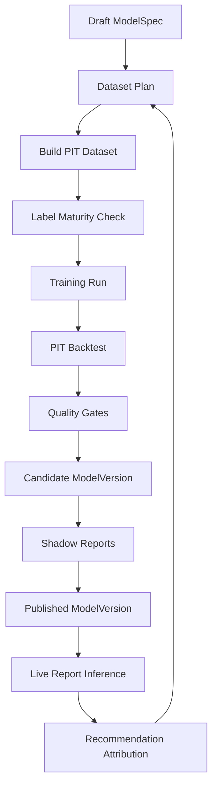

# 03 — 数据、特征、因子、模型管线

> 状态：生产级目标设计
>
> 目标：替换 Endgame detection/calibration/scoring，建立 point-in-time 正确的量化研究与线上推理闭环。

## 0. 核心原则

- 数据先成为事实，再成为特征，再成为因子，再进入模型。
- 任何训练、回测、报告都必须声明 `as_of` 与 `source_delay`。
- 线上 feature builder 和离线 backtest feature builder 必须共用同一套定义。
- 模型可以简单，但治理、版本、质量门禁不能省。
- Endgame 只能作为一个可选 factor family，不能作为系统架构中心。

## 1. 数据事实层

### 1.1 输入源

| 来源 | 用途 | 保留/新增 |
|---|---|---|
| Gamma market API | market/event metadata、category、status、resolution metadata | 保留 |
| CLOB WebSocket | L2 book、BBO、实时 microstructure | 保留 |
| CLOB REST | market read、order book snapshot、orders/fills | 保留 |
| Polygon / CTF | settlement/outcome label、balance evidence | 降级为可选 label source |
| 外部垂直数据 | sports/politics/crypto/weather/geopolitics 特征 | Phase 2+ 接入 |

### 1.2 Fact Writer

旧 `DetectionWriter`、`ExecutionAuditWriter` 删除。新增 writer：

- `TickFactWriter`
- `BookSnapshotWriter`
- `BookMicrostructureWriter`
- `FeatureEventWriter`
- `FactorEventWriter`
- `SignalCandidateWriter`
- `RecommendationEventWriter`
- `ExecutionEventWriter`

所有 writer 使用 bounded channel、batch insert、flush interval、drop counter。ClickHouse 写失败不阻塞数据 ingest，但必须记录 `fact_writer_dropped_total` 和告警。

### 1.3 Source Delay

所有 report/model run 使用窗口：

```text
[trigger_time - source_delay - lookback, trigger_time - source_delay)
```

默认：

- report source delay：60 秒。
- model training source delay：15 分钟。
- settlement label source delay：24 小时或按市场 resolution 成熟度。

## 2. Universe Selector

### 2.1 输入

- active runtime config v3。
- market catalog。
- current book quality。
- recent volume/liquidity facts。
- manual include/exclude。
- active model requirement。

### 2.2 过滤层级

1. `MarketStatusFilter`：只保留 open/active market。
2. `CategoryFilter`：按配置启用 category。
3. `LiquidityFilter`：最小 depth、volume、spread。
4. `DataQualityFilter`：book age、WS health、fact lag。
5. `ResolutionAmbiguityFilter`：过度模糊或规则不清市场可降权或排除。
6. `ManualBlockFilter`：操作员 block。
7. `ModelEligibilityFilter`：模型需要的 feature 可用性。

### 2.3 输出

`UniverseSnapshot` 必须包含：

- included members。
- excluded members。
- exclusion reason summary。
- selector hash。
- config version。
- as_of。

空 universe 不算系统异常，但报告必须输出 `empty_universe` 原因。

## 3. Feature Builder

### 3.1 Feature 分组

#### Market Metadata Features

- category。
- event age。
- time to resolution。
- outcome count。
- neg-risk flag。
- market status。
- rule ambiguity score。

#### Price and Book Features

- best bid / ask。
- mid price。
- spread bps。
- top-N depth。
- depth imbalance。
- order book slope。
- visible liquidity。
- book age。
- crossed / empty book flags。

#### Time-Series Features

- return over 1m / 5m / 15m / 1h。
- realized volatility。
- price reversal。
- momentum decay。
- volume trend。
- spread trend。
- depth trend。

#### Crowd and Microstructure Features

- quote update rate。
- book churn。
- queue depletion。
- sudden liquidity withdrawal。
- adverse selection proxy。
- stale quote frequency。

#### Domain Features

第一版只定义接口和 schema：

- `SportsFeatureBuilder`
- `PoliticsFeatureBuilder`
- `CryptoFeatureBuilder`
- `WeatherFeatureBuilder`
- `GeopoliticsFeatureBuilder`

外部数据不可用时输出 `missing_domain_data`，不能用默认值伪造。

### 3.2 Feature Schema

每个 feature 必须定义：

- `name`
- `family`
- `value_kind`
- `unit`
- `valid_range`
- `null_policy`
- `source_requirement`
- `point_in_time_rule`
- `staleness_policy`

示例：

```text
name: book.spread_bps
family: microstructure
value_kind: decimal
unit: bps
null_policy: reject_market
source_requirement: published_l2_book
point_in_time_rule: book.version.published_at <= as_of
staleness_policy: max_age_ms <= runtime.data_quality.max_book_age_ms
```

### 3.3 Null Policy

| Policy | 行为 |
---|---|
| `reject_market` | 缺失则 market 不进入 candidate |
| `neutral_value` | 使用中性值并记录 |
| `penalize` | 降低 data quality / confidence |
| `domain_missing` | 垂直领域数据缺失，允许通用模型继续 |

禁止静默填 0。

## 4. Factor Engine

### 4.1 FactorDefinition

因子必须具备：

- 稳定 name。
- family。
- input feature schema。
- output type。
- score direction。
- normalization。
- explanation builder。
- owner。
- quality gates。

### 4.2 通用因子

第一阶段必须实现：

- `liquidity_depth_factor`
- `spread_efficiency_factor`
- `momentum_factor`
- `mean_reversion_factor`
- `volatility_regime_factor`
- `book_imbalance_factor`
- `market_activity_factor`
- `time_to_resolution_factor`
- `data_quality_factor`

### 4.3 垂直领域因子

先定义接口和 registry，按 category 启用：

- sports: `pre_match_move_factor`, `live_score_shock_factor`
- politics: `poll_momentum_factor`, `event_deadline_factor`
- crypto: `underlying_beta_factor`, `risk_on_proxy_factor`
- weather: `forecast_revision_factor`
- geopolitics: `news_shock_decay_factor`

垂直因子必须是 additive capability；缺失时不阻塞通用报告，除非对应 model spec 明确要求。

### 4.4 Factor 输出

每个 factor 输出：

- raw value。
- normalized score。
- confidence。
- direction。
- explanation。
- input feature refs。

Factor score 不直接等于 recommendation score，必须经过 model runner 和 portfolio planner。

## 5. Model Runner

### 5.1 第一版模型

第一版使用受治理的 weighted factor scorer：

```text
candidate_score =
  sum(factor_score_i * weight_i * confidence_i)
  * data_quality_multiplier
  * liquidity_multiplier
  * horizon_multiplier
```

但它仍必须作为 `ModelSpec` / `ModelVersion` 管理。

### 5.2 后续模型

可扩展：

- logistic scorer。
- gradient boosted trees。
- pairwise ranker。
- category-specific ensemble。
- regime-switching model。

模型复杂化不能改变 registry、feature schema、quality gate、report payload。

### 5.3 ModelRun 类型

- `training`
- `backtest`
- `shadow_inference`
- `live_report_inference`
- `ad_hoc_report`

### 5.4 SignalCandidate

模型输出候选信号：

- market。
- token。
- side。
- raw score。
- confidence。
- expected return range。
- entry price reference。
- suggested horizon。
- factor breakdown。
- model explanation。
- rejection warnings。

SignalCandidate 还不是 recommendation。必须进入 portfolio planner。

## 6. Training Dataset

### 6.1 样本单位

推荐使用 `(market_id, token_id, as_of, horizon)` 作为训练样本单位。

每个样本包含：

- feature vector。
- factor values。
- label refs。
- source refs。
- universe membership。
- data quality。
- runtime config version。

### 6.2 标签

标签按 horizon 定义：

- `return_to_horizon`
- `max_favorable_excursion`
- `max_adverse_excursion`
- `hit_take_profit`
- `hit_stop_loss`
- `liquidity_exit_possible`
- `settlement_outcome`
- `recommendation_realized_pnl`

标签可用时间：

- price horizon label：horizon 结束后可用。
- settlement label：市场 resolved 后可用。
- execution label：订单生命周期终结后可用。

### 6.3 防泄漏规则

禁止：

- 用 `resolved_at` 后的数据训练 `as_of` 前样本。
- 用未来 volume/liquidity 构建当前 feature。
- 用当前 active model 决策结果反向覆盖历史 feature。
- 用人工修正后的 market metadata 解释过去，除非有 PIT snapshot。

必须：

- 记录每个 feature source 的 observed_at。
- dataset hash 固化。
- feature schema hash 固化。
- label schema hash 固化。

## 7. Point-in-Time Backtest

> 实施状态（Phase 2 → Phase 3）：`PointInTimeDataSource` trait 已在 Phase 2 落地
> （`quant-pivot-models` `domain::data_plane::point_in_time`），并提供 **live** 实现
> `LiveBookDataSource`（`quant-pivot-core` `pipeline::point_in_time`）服务当前
> `BookStore`/`MarketRegistry` 状态、由 `AppContext::pit_source` 注入。
> **historical / ClickHouse-backed PIT resolver（严格按过去 `as_of` 读取、无 look-ahead）
> 是 Phase 3 工作项**：实现同一 trait 的历史源，从 ClickHouse `book_l2_replay_hot` /
> `book_snapshots` / `tick_events` + Postgres metadata 版本按 `as_of` 解析，供回测与训练
> 数据集构建使用。

### 7.1 输入解析

PIT resolver 需要按 `as_of` 读取：

- market metadata。
- token mapping。
- book snapshot。
- tick/bar facts。
- runtime config version。
- model version。
- factor definition version。
- universe selector。

### 7.2 回测输出

每次 backtest 输出：

- coverage。
- sample count。
- missing feature count。
- rank IC。
- hit rate。
- expected vs realized return。
- drawdown。
- turnover。
- liquidity feasibility。
- category breakdown。
- tail loss。
- report-level PnL simulation。

### 7.3 质量门禁

进入 `candidate`：

- sample count >= configured minimum。
- missing critical features <= threshold。
- rank stability >= threshold。
- tail loss <= threshold。
- liquidity feasibility >= threshold。
- no critical PIT leakage warning。

进入 `published`：

- candidate 通过 shadow reports。
- operator approval。
- model artifact hash stable。
- runtime compatibility check passed。

## 8. Shadow 与发布

### 8.1 Shadow

Shadow 模式生成报告但不影响 active report，记录：

- active model TopN。
- shadow model TopN。
- overlap。
- score delta。
- would buy/sell diff。
- risk delta。
- realized label after maturity。

### 8.2 Publish

发布动作必须写：

- model version。
- factor definitions。
- quality gate report。
- operator reason。
- config constraints。
- rollback target。

发布后 live report scheduler 才能使用该 model。

## 9. Runtime 热更新

热更新可以改变：

- universe filter。
- report schedules。
- factor weights for unpublished/candidate model。
- data quality thresholds。
- portfolio budgets。
- mode gate policy。
- notification routing。

热更新不能直接改变：

- published model artifact。
- historical report。
- existing approved order intent 的核心字段。

这些必须通过新版本或撤销流程处理。

## 10. 模块边界

```text
quant-pivot-research/
├── universe/
├── features/
├── factors/
├── model/
├── training/
├── backtest/
├── materialization/
├── gates/
└── governance/
```

禁止：

- research crate 直接下单。
- feature builder 读取 web state。
- model runner 访问 mutable runtime state，必须使用传入 snapshot。
- report builder 在循环中查数据库。

## 11. 验收标准

- 能从 ClickHouse + Postgres PIT 数据生成 feature vectors。
- 能跑一个 weighted-factor model 产生 signal candidates。
- 能生成 TopN recommendations。
- 能生成 backtest report。
- 能发布/撤销 model version。
- 能证明线上报告和离线回放使用同一 feature definition。
- 能拒绝 feature coverage 不足的 model publication。
- 所有 money/price/share/probability 无 `f64`。

## 12. 训练生命周期

模型训练不是一个脚本，而是受治理的生命周期。



### 12.1 状态

`ModelSpec` 状态：

- `draft`
- `candidate`
- `active`
- `retired`
- `rejected`

`ModelVersion` 状态：

- `training`
- `trained`
- `backtested`
- `quality_failed`
- `candidate`
- `shadow`
- `published`
- `retired`
- `rejected`

`TrainingDataset` 状态：

- `planned`
- `building`
- `built`
- `insufficient_labels`
- `ready`
- `expired`
- `failed`

### 12.2 生命周期硬规则

- `draft ModelSpec` 不能线上推理。
- `trained` 未回测不能进入 candidate。
- `quality_failed` 不能 shadow。
- `shadow` 未完成最小 shadow window 不能 publish。
- `published` 不可变，修正必须创建新 version。
- 任何训练输入变化都必须改变 dataset hash 或 model artifact hash。

## 13. 训练关键 Trait

### 13.1 Dataset Planner

```rust
/// Plans point-in-time training samples for one model spec and horizon.
pub trait TrainingDatasetPlanner {
    /// Produce deterministic sample windows and label requirements.
    async fn plan(
        &self,
        request: DatasetPlanRequest,
    ) -> QuantResult<DatasetPlan>;
}

pub struct DatasetPlanRequest {
    pub model_spec_id: ModelSpecId,
    pub window_start: DateTime<Utc>,
    pub window_end: DateTime<Utc>,
    pub horizons: Vec<PredictionHorizon>,
    pub source_delay: Duration,
    pub runtime_config_version_id: RuntimeConfigVersionId,
}
```

### 13.2 Dataset Builder

```rust
/// Builds PIT-correct training examples. No future facts may be read.
pub trait TrainingDatasetBuilder {
    async fn build(
        &self,
        plan: DatasetPlan,
    ) -> QuantResult<TrainingDatasetArtifact>;
}

pub struct TrainingExample {
    pub example_id: TrainingExampleId,
    pub market_id: MarketId,
    pub token_id: TokenId,
    pub as_of: DateTime<Utc>,
    pub horizon: PredictionHorizon,
    pub universe_snapshot_id: UniverseSnapshotId,
    pub feature_vector: FeatureVector,
    pub factor_values: Vec<FactorValue>,
    pub labels: Vec<TrainingLabel>,
    pub source_refs: Vec<EvidenceSourceRef>,
}
```

### 13.3 Labeler

```rust
/// Produces labels only when their data is mature.
pub trait Labeler {
    fn label_name(&self) -> LabelName;

    async fn build_label(
        &self,
        input: LabelBuildInput<'_>,
    ) -> QuantResult<LabelBuildOutput>;
}

pub enum LabelBuildOutput {
    Available(TrainingLabel),
    NotMature { available_after: DateTime<Utc>, reason: LabelDelayReason },
    Unavailable { reason: MissingLabelReason },
}
```

### 13.4 Trainer

```rust
/// Trains or refreshes a model artifact from a frozen dataset.
pub trait ModelTrainer {
    fn model_family(&self) -> ModelFamily;

    async fn train(
        &self,
        request: TrainModelRequest,
    ) -> QuantResult<TrainedModelArtifact>;
}
```

第一版 `WeightedFactorTrainer` 不做复杂优化，也必须实现该 trait：

```rust
pub struct WeightedFactorTrainer;

impl ModelTrainer for WeightedFactorTrainer {
    async fn train(
        &self,
        request: TrainModelRequest,
    ) -> QuantResult<TrainedModelArtifact> {
        let weights = estimate_factor_weights(
            &request.dataset,
            request.objective,
            request.regularization,
        )?;
        let metrics = evaluate_in_sample(&request.dataset, &weights)?;
        Ok(TrainedModelArtifact::weighted(weights, metrics))
    }
}
```

### 13.5 Backtester

```rust
/// Replays model decisions with PIT inputs and report-level portfolio constraints.
pub trait Backtester {
    async fn run(
        &self,
        request: BacktestRequest,
    ) -> QuantResult<BacktestReport>;
}
```

### 13.6 Quality Gate

```rust
/// Decides whether a model version may advance lifecycle state.
pub trait ModelQualityGate {
    fn evaluate(
        &self,
        input: QualityGateInput,
    ) -> QuantResult<QualityGateDecision>;
}

pub enum QualityGateDecision {
    Pass { report: QualityGateReport },
    Fail { report: QualityGateReport, hard_failures: Vec<QualityGateFailure> },
}
```

## 14. Dataset Builder 伪代码

```rust
pub async fn build_training_dataset(
    plan: DatasetPlan,
    deps: &DatasetBuilderDeps,
) -> QuantResult<TrainingDatasetArtifact> {
    let mut examples = Vec::new();

    for sample in plan.samples {
        let as_of = sample.as_of;
        let universe = deps.universe_selector
            .build_snapshot(sample.universe_request(as_of))
            .await?;

        for member in universe.members {
            let feature_vector = deps.feature_builder
                .build(FeatureBuildInput {
                    market: &member,
                    as_of,
                    source_delay: plan.source_delay,
                    required_features: plan.required_features.clone(),
                })
                .await?;

            if feature_vector.data_quality.is_reject() {
                deps.rejections.record(member.market_id, FeatureRejectReason::DataQuality);
                continue;
            }

            let factors = deps.factor_engine.compute_all(&feature_vector, &plan.factor_set)?;

            let mut labels = Vec::new();
            for labeler in &deps.labelers {
                match labeler.build_label(LabelBuildInput {
                    market: &member,
                    as_of,
                    horizon: sample.horizon,
                }).await? {
                    LabelBuildOutput::Available(label) => labels.push(label),
                    LabelBuildOutput::NotMature { available_after, reason } => {
                        deps.pending_labels.record(member.market_id, as_of, available_after, reason);
                    }
                    LabelBuildOutput::Unavailable { reason } => {
                        deps.rejections.record(member.market_id, FeatureRejectReason::MissingLabel(reason));
                    }
                }
            }

            examples.push(TrainingExample {
                example_id: TrainingExampleId::from_v7(),
                market_id: member.market_id.clone(),
                token_id: member.primary_token_id.clone(),
                as_of,
                horizon: sample.horizon,
                universe_snapshot_id: universe.id.clone(),
                feature_vector,
                factor_values: factors,
                labels,
                source_refs: member.source_refs.clone(),
            });
        }
    }

    let artifact = TrainingDatasetArtifact::new(examples)?;
    artifact.assert_no_future_leakage()?;
    deps.dataset_store.persist(artifact).await
}
```

## 15. Label 设计

### 15.1 Price Horizon Label

定义：

```text
return_to_horizon = (future_exit_price - entry_reference_price) / entry_reference_price
```

要求：

- future price 只能来自 `as_of + horizon` 后已成熟事实。
- 若 horizon 内无可退出流动性，label 标记 `liquidity_exit_missing`。
- 不用 settlement 结果替代短 horizon label。

### 15.2 Excursion Labels

- `max_favorable_excursion_bps`
- `max_adverse_excursion_bps`

用途：

- 校准止盈止损。
- 估计 tail risk。
- 训练 exit policy。

### 15.3 Execution-aware Labels

仅用于已执行 recommendation：

- `entry_filled`
- `entry_slippage_bps`
- `exit_compliance`
- `realized_pnl_usd`

这些 label 不能用于训练未执行历史样本的价格预测模型，只能用于 execution policy 和 slippage model。

### 15.4 Settlement Label

用于长 horizon 或 resolution-related factor：

- `settled_yes`
- `payout`
- `resolution_delay`
- `ambiguous_resolution`

Settlement label 成熟前，相关样本不能进入监督训练。

## 16. 训练目标函数

第一版目标：

```text
maximize rank quality under liquidity and downside constraints
```

Weighted factor 模型可用以下目标：

```text
loss =
  pairwise_rank_loss(predicted_score, realized_return)
  + lambda_drawdown * tail_loss_penalty
  + lambda_turnover * turnover_penalty
  + lambda_complexity * weight_l2
```

如果第一版不实现优化器，至少支持：

- 手工权重。
- grid search。
- rolling validation。
- category-level weight override。

伪代码：

```rust
fn estimate_factor_weights(
    dataset: &TrainingDatasetArtifact,
    objective: TrainingObjective,
    regularization: Regularization,
) -> QuantResult<FactorWeights> {
    let candidates = generate_weight_candidates(objective.search_space);
    let mut best = None;

    for weights in candidates {
        let report = evaluate_weights(dataset, &weights, regularization)?;
        if best.as_ref().is_none_or(|b| report.objective_score > b.objective_score) {
            best = Some(WeightedCandidate { weights, report });
        }
    }

    best.map(|b| b.weights).ok_or(QuantError::NoValidWeights)
}
```

## 17. Backtest 伪代码

```rust
pub async fn run_backtest(
    request: BacktestRequest,
    deps: &BacktestDeps,
) -> QuantResult<BacktestReport> {
    let mut report_metrics = BacktestMetrics::default();

    for tick in request.schedule_ticks() {
        let config = deps.config_store.version_at(tick.as_of)?;
        let universe = deps.universe_selector.build_snapshot(tick.universe_request(&config)).await?;
        let features = deps.feature_pipeline.build_for_universe(&universe, tick.as_of, &config).await?;
        let factors = deps.factor_engine.compute_all_batch(&features, &config.factors)?;
        let candidates = deps.model_runner.infer_for_backtest(&request.model, features, factors).await?;
        let plan = deps.portfolio_planner.plan_backtest(candidates, &config.portfolio)?;
        let simulated_report = deps.report_simulator.compose(tick, universe, plan)?;
        let outcomes = deps.outcome_resolver.resolve(&simulated_report).await?;

        report_metrics.record(simulated_report, outcomes);
    }

    Ok(report_metrics.finalize())
}
```

Backtest 不允许调用 live `BookStore`。它只能使用 PIT data source。

## 18. Quality Gate 细节

必须至少包含：

| Gate | Hard/Soft | 默认 |
|---|---|---|
| sample_count | hard | >= 500 |
| label_coverage | hard | >= 70% |
| critical_feature_coverage | hard | >= 95% |
| no_pit_leakage | hard | 0 violations |
| rank_ic | soft/hard | > 0 |
| top_decile_return | soft | > median |
| max_drawdown | hard | <= configured |
| liquidity_exit_feasible | hard for auto | >= 90% |
| category_concentration | soft | within budget |
| shadow_overlap_stability | hard for publish | >= threshold |

Quality gate 输出必须进入 `quality_gate_report` JSON，并可在 UI 展示。

## 19. Shadow 生命周期伪代码

```rust
pub async fn run_shadow_model_tick(
    tick: ReportTick,
    deps: &ShadowDeps,
) -> QuantResult<ShadowComparison> {
    let active = deps.report_service.generate_with_model(tick.clone(), deps.active_model()).await?;
    let shadow = deps.report_service.generate_with_model(tick, deps.shadow_model()).await?;

    let comparison = compare_reports(&active, &shadow)?;
    deps.shadow_repo.create(comparison.clone()).await?;

    if comparison.has_hard_divergence() {
        deps.alerts.shadow_divergence(&comparison).await;
    }

    Ok(comparison)
}
```

Shadow 至少记录：

- TopN overlap。
- rank delta。
- capital allocation delta。
- would-execute delta。
- risk envelope delta。
- matured outcome delta。

## 20. Publish 伪代码

```rust
pub async fn publish_model_version(
    request: PublishModelRequest,
    deps: &ModelGovernanceDeps,
) -> QuantResult<ModelVersion> {
    let version = deps.model_repo.get(request.model_version_id).await?;
    version.ensure_candidate_or_shadow()?;

    let quality = deps.quality_repo.latest_report(version.id()).await?;
    quality.ensure_publishable()?;

    let shadow = deps.shadow_repo.summary(version.id(), request.required_shadow_window).await?;
    shadow.ensure_stable()?;

    deps.governance.require_role(request.actor, Role::RiskManagerOrOperator)?;

    deps.model_repo.publish_model_version(
        version.id(),
        GovernanceAuditInput {
            actor: request.actor,
            reason: request.reason,
            before_hash: version.status_hash(),
            after_hash: version.publish_hash(),
        },
    ).await
}
```

## 21. 线上推理生命周期

```text
Report tick
 -> load published model
 -> load runtime config v3
 -> build universe
 -> build features
 -> compute factors
 -> infer candidates
 -> portfolio plan
 -> report
 -> optional intent
 -> attribution
 -> training dataset
```

线上推理必须写 `ModelRun`：

- `run_kind = live_report_inference`
- `status`
- `input_hash`
- `output_hash`
- metrics。

## 22. 实现模块建议

```text
quant-pivot-research/src/
├── universe/
│   ├── selector.rs
│   └── filters.rs
├── features/
│   ├── builder.rs
│   ├── schema.rs
│   ├── market.rs
│   ├── book.rs
│   ├── timeseries.rs
│   └── domain/
├── factors/
│   ├── registry.rs
│   ├── computer.rs
│   ├── generic.rs
│   └── domain.rs
├── model/
│   ├── spec.rs
│   ├── runner.rs
│   ├── trainer.rs
│   └── weighted.rs
├── training/
│   ├── planner.rs
│   ├── dataset_builder.rs
│   ├── labeler.rs
│   └── leakage.rs
├── backtest/
│   ├── runner.rs
│   ├── simulator.rs
│   └── metrics.rs
├── gates/
│   └── model_quality.rs
└── governance/
    ├── publish.rs
    └── shadow.rs
```

## 23. 新增验收测试

- `dataset_builder_rejects_future_features`
- `labeler_waits_for_maturity`
- `weighted_trainer_produces_stable_hash`
- `backtest_uses_pit_source_not_live_bookstore`
- `quality_gate_blocks_low_coverage_model`
- `shadow_comparison_records_topn_delta`
- `publish_requires_shadow_stability`
- `live_inference_writes_model_run`

## 24. 训练技术栈决策

详细 crate 选型见 [`08-third-party-crates-and-ml-stack.md`](08-third-party-crates-and-ml-stack.md)。本文件固定训练主路径。

### 24.1 第一版训练主路径

第一版必须采用可解释 classical/weighted pipeline：

```text
PIT facts
 -> polars lazy frame / parquet dataset
 -> feature normalization
 -> ndarray TrainingMatrix
 -> factor values
 -> weighted factor scorer
 -> argmin or grid search optimize weights
 -> PIT backtest
 -> quality gates
 -> candidate model
```

原因：

- 可解释，适合 TopN 报告。
- 不需要 GPU。
- 不引入 ONNX/DL native runtime。
- 与 factor breakdown 强绑定。
- 便于做 shadow/live diff。

### 24.2 必需 crate

Phase 3 最小训练栈：

- `polars`：离线特征聚合、rolling/window、Parquet。
- `ndarray`：训练矩阵。
- `ndarray-stats`：quantile、correlation、summary stats。
- `statrs`：分布、置信区间、统计函数。
- `argmin`：权重优化和阈值校准。
- `rayon`：CPU-bound 特征和 backtest 并行。

Phase 3/4 可选 classical ML：

- `smartcore`：tree ensemble、random forest、xgboost-style regressor。
- `linfa`：linear/logistic/PCA/preprocessing baseline。

### 24.3 不进入第一版主路径

- `burn`：后续 Rust-native 深度学习训练。
- `candle`：后续轻量推理或 domain text feature。
- `ort`：后续 ONNX 推理；注意最新版本 MSRV 可能高于当前 workspace 1.85。
- `good_lp`：组合优化复杂化后引入；第一版可用 deterministic greedy planner。

### 24.4 训练 Artifact

Weighted scorer artifact：

```rust
pub struct WeightedFactorModelArtifact {
    pub model_version_id: ModelVersionId,
    pub feature_schema_hash: Hash,
    pub factor_schema_hash: Hash,
    pub weights: Vec<FactorWeight>,
    pub normalization: Vec<FeatureNormalizationSpec>,
    pub objective_report: TrainingObjectiveReport,
    pub backtest_report_hash: Hash,
}
```

Classical ML artifact 不允许把 third-party concrete type 直接暴露给业务层，必须封装：

```rust
pub enum ModelArtifact {
    WeightedFactor(WeightedFactorModelArtifact),
    SmartCore(SmartCoreArtifactRef),
    Linfa(LinfaArtifactRef),
    Onnx(OnnxArtifactRef),
}
```

### 24.5 训练矩阵构建规则

```rust
pub fn build_training_matrix(
    examples: &[TrainingExample],
    spec: &FeatureMatrixSpec,
) -> QuantResult<TrainingMatrix> {
    let mut x = Array2::<f64>::zeros((examples.len(), spec.feature_names.len()));
    let mut y = Array1::<f64>::zeros(examples.len());

    for (row, example) in examples.iter().enumerate() {
        for (col, feature_name) in spec.feature_names.iter().enumerate() {
            let value = example
                .feature_vector
                .get_required(feature_name)?
                .to_scaled_f64(spec.scale_for(feature_name))?;
            x[[row, col]] = value;
        }
        y[row] = example.primary_label(spec.label_name)?.to_f64()?;
    }

    Ok(TrainingMatrix {
        features: x,
        labels: y,
        feature_names: spec.feature_names.clone(),
    })
}
```

规则：

- `Decimal` 到 `f64` 只允许在训练矩阵边界。
- 每个转换必须有 scale spec。
- NaN/inf 直接拒绝样本。
- missing critical feature 直接拒绝样本。
- non-critical missing 走 null policy。

### 24.6 SmartCore / Linfa 使用边界

`smartcore` 适合：

- 非线性特征交互。
- tree/ensemble candidate。
- feature importance。

`linfa` 适合：

- 线性/logistic baseline。
- PCA / preprocessing。
- sanity-check model。

它们必须通过统一 trait 调用：

```rust
pub trait ClassicalModelAdapter {
    fn train(&self, matrix: &TrainingMatrix) -> QuantResult<ModelArtifact>;
    fn predict(&self, artifact: &ModelArtifact, features: &FeatureVector) -> QuantResult<ModelPrediction>;
}
```

业务层永远不直接依赖 `smartcore::...` 或 `linfa::...` concrete model。

## 25. 模型族生命周期总览

不同模型族共享同一个治理生命周期，但训练和 artifact 不同。

| 模型族 | 训练位置 | 推理位置 | Artifact | 第一版状态 |
|---|---|---|---|---|
| Weighted factor | Rust research crate | Rust core/report | JSON/bitcode weights | 主路径 |
| Classical ML | Rust research crate | Rust report/model runner | serialized model + preprocessing | Shadow 候选 |
| LP portfolio | Rust portfolio planner | Rust report builder | constraints config, no prediction model | 后续优化 |
| ONNX | 外部或 Rust export | `ort` runtime | `.onnx` + schema | Phase 6+ |
| Burn DL | Rust research crate | Burn/ONNX runtime | burn checkpoint/export | Phase 8+ |
| Candle inference | Artifact from HF/custom | Candle runtime | safetensors + config | Phase 8+ domain feature |

## 26. 模型族选择决策树

```text
是否需要第一版生产主路径？
  -> 是：Weighted factor scorer

是否 weighted scorer 无法捕捉非线性关系？
  -> 是：SmartCore tree/ensemble shadow

是否只需要 baseline / linear sanity check？
  -> 是：Linfa linear/logistic/PCA

是否组合约束导致 greedy 明显次优？
  -> 是：good_lp portfolio optimizer

是否已有外部训练模型且能导出 ONNX？
  -> 是：ort inference

是否需要 Rust-native deep learning training？
  -> 是：burn spike

是否需要 Hugging Face/safetensors 文本或语义特征？
  -> 是：candle feature extractor
```

## 27. 统一模型运行入口

Report pipeline 不关心模型具体来自 weighted、classical、ONNX 还是 DL。

```rust
pub trait QuantModelRuntime {
    fn model_version_id(&self) -> ModelVersionId;
    fn model_family(&self) -> ModelFamily;
    fn feature_schema_hash(&self) -> Hash;

    async fn infer_batch(
        &self,
        input: ModelRuntimeInput,
    ) -> QuantResult<ModelRuntimeOutput>;
}

pub enum ModelRuntimeInput {
    FactorTable(FactorInferenceTable),
    FeatureMatrix(InferenceMatrix),
    OnnxTensor(OnnxInferenceInput),
    DomainText(TextInferenceInput),
}

pub struct ModelRuntimeOutput {
    pub candidates: Vec<SignalCandidate>,
    pub runtime_metrics: ModelRuntimeMetrics,
    pub warnings: Vec<ModelRuntimeWarning>,
}
```

加载模型：

```rust
pub trait ModelRuntimeFactory {
    async fn load(
        &self,
        model_version: &ModelVersionInfo,
    ) -> QuantResult<Box<dyn QuantModelRuntime>>;
}
```

规则：

- `ModelRuntimeFactory` 是唯一知道第三方 crate concrete type 的地方。
- `ReportBuilder` 只依赖 `QuantModelRuntime`。
- `ModelVersionInfo.artifact_kind` 决定加载哪个 runtime。
- 加载失败时不能 panic，必须返回 typed error。

## 28. 推理降级策略

推理失败按层级处理：

| 失败 | 行为 |
|---|---|
| active weighted model load failed | 报告失败，critical alert |
| shadow model failed | active report 继续，记录 shadow failed |
| classical shadow failed | active weighted 继续 |
| ONNX runtime failed | fallback 到 active weighted/classical |
| candle domain feature failed | domain feature missing，按 null policy |
| burn model failed | 禁止 publish 或 fallback |

自动执行要求：

- 不能使用 fallback model 自动执行，除非 fallback model 本身是 active published model。
- fallback 必须写入 report summary。

## 29. Artifact 发布与回滚闭环

```text
train artifact
 -> compute artifact hash
 -> persist artifact metadata
 -> backtest artifact
 -> quality gate
 -> shadow report
 -> publish model_version
 -> live report inference
 -> attribution
 -> if degraded: retire and rollback previous published version
```

回滚规则：

- 保留 previous published model version。
- runtime config 只引用 model version id，不引用文件路径。
- rollback 是治理动作，必须写 reason。
- rollback 后新报告必须记录新 model version。

## 30. Burn/Candle/Ort 的边界声明

- `burn` 负责 Rust-native DL 训练，不是第一版主路径。
- `candle` 优先作为 domain/text feature extractor，不直接决定 recommendation。
- `ort` 优先作为 ONNX inference runtime，不负责在线训练。
- `good_lp` 负责 portfolio optimization，不负责模型训练。
- `smartcore`/`linfa` 负责 classical candidates，必须通过 adapter。

这些边界如果不清楚，会导致 research、report、execution 三层耦合，必须禁止。
