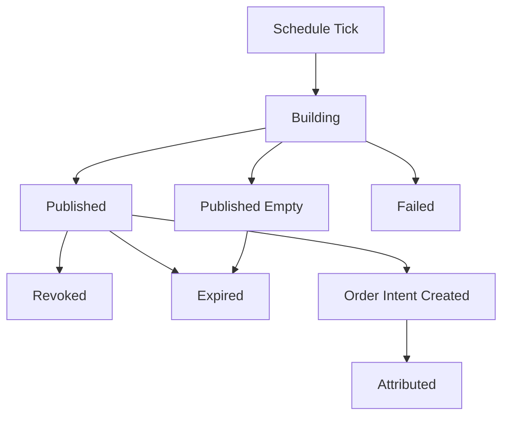

# 04 — TopN 报告与 Recommendation 设计

> 状态：生产级目标设计
>
> 目标：把 TopN 报告定义为 quant-pivot 主产物，而不是旧 PnL report 的扩展。

## 0. 报告职责

`RecommendationReport` 必须完整回答：

- 买什么。
- 什么时候买。
- 买多少。
- 为什么买。
- 什么时候卖。
- 卖多少。
- 什么条件不再买。
- 什么条件强制退出。
- 这条建议来自哪些数据、因子、模型和风险约束。

报告必须做到可读、可执行、可审计、可训练反馈。

## 1. 报告生命周期



状态：

- `building`
- `published`
- `published_empty`
- `failed`
- `revoked`
- `expired`

报告发布后不可变；撤销必须写 `revoked_at` 和 operation log。

## 2. Report Header

每份报告必须包含：

| 字段 | 说明 |
|---|---|
| `recommendation_report_id` | UUID v7 |
| `report_kind` | `top_n`, `shadow_top_n`, `post_run_audit` |
| `as_of` | 报告决策时间 |
| `horizon` | 建议持有/评估时间窗 |
| `runtime_mode` | `report_only`, `semi_auto`, `auto_execution` |
| `runtime_config_version_id` | 配置版本 |
| `model_version_id` | 模型版本 |
| `market_selection_id` | 输入 market selection |
| `portfolio_plan_id` | 组合规划 |
| `top_n` | 报告目标数量 |
| `actual_count` | 实际 recommendation 数量 |
| `status` | 报告状态 |
| `summary` | 聚合摘要 |
| `account_source` | 资本基数来源：恒 `polymarket`（真实 venue 账户；所有 mode 一致，credential-gated），见 [09](09-account-capital-position-reconciliation.md) |
| `capital_base_usd` | 本次 sizing 的资本基数 = `AccountSnapshot.equity_usd`（真实净清算价值 `min` `portfolio.budget` 护栏） |
| `account_snapshot_ref` | 指向 `quant_account_snapshot` 的决策时刻资金/持仓快照（可回放 sizing） |

## 3. Report Summary

`summary` 必须包含：

- market selection market count。
- candidates count。
- rejected count。
- published recommendation count。
- total suggested capital。
- max single recommendation capital。
- category allocation。
- event allocation。
- average score。
- min score。
- model confidence summary。
- data quality summary。
- top rejection reasons。
- execution eligibility summary。

空报告必须说明：

- `empty_selection`
- `insufficient_data_quality`
- `model_quality_gate_failed`
- `portfolio_budget_exhausted`
- `no_positive_signal`
- `runtime_mode_disabled`
- `system_degraded`

## 4. Recommendation 主体

每条 recommendation 必须包含以下块：

```text
Recommendation
├── identity
├── rank_and_score
├── market_context
├── entry_plan
├── sizing_plan
├── exit_plan
├── risk_envelope
├── factor_breakdown
├── evidence
├── execution_eligibility
└── lifecycle
```

## 5. Identity

字段：

- `recommendation_id`
- `recommendation_report_id`
- `rank`
- `market_id`
- `event_id`
- `token_id`
- `outcome_side`
- `category`
- `question`
- `outcome_name`

`outcome_side` 使用 `OutcomeSide` 枚举（仅结果方向，不含买卖动作）：

- `yes`
- `no`

语义铁律：一条 recommendation 永远是**开仓**（buy-to-open）一个 outcome token，方向只在
"买 YES 还是买 NO"——具体 token 已由 `token_id` 唯一确定，`outcome_side` 只是其可读/可审计
标签。买卖动作（`Buy`/`Sell`）是**执行层**概念（`quant_execution_order.side: common::Side`，
入场 = Buy、出场 = Sell）；**卖出计划完全由 `exit_plan` 表达**，绝不用 `outcome_side` 编码 sell。

## 6. Rank and Score

字段：

- `composite_score`
- `risk_adjusted_score`
- `confidence`
- `expected_return_bps`
- `downside_bps`
- `liquidity_score`
- `data_quality_score`
- `model_score_percentile`

解释规则：

- `composite_score` 是模型原始排序分。
- `risk_adjusted_score` 是组合约束后排序分。
- TopN 排序使用 `risk_adjusted_score`。
- score 不允许脱离 factor breakdown 单独出现。

## 7. Market Context

字段：

- `best_bid`
- `best_ask`
- `mid_price`
- `spread_bps`
- `depth_usd`
- `volume_24h_usd`
- `book_age_ms`
- `time_to_resolution_secs`
- `market_status`
- `neg_risk`
- `fee_rate`

这些字段是报告可读性字段，不代替 evidence refs。

## 8. Entry Plan

必须回答什么时候买。

字段：

- `entry_trigger_kind`
- `trigger_price`
- `limit_price`
- `max_slippage_bps`
- `valid_from`
- `valid_until`
- `min_depth_usd`
- `max_book_age_ms`
- `confirmation_window_secs`
- `cancel_if_not_triggered`
- `entry_reason`

Trigger 类型：

| 类型 | 语义 |
|---|---|
| `immediate` | 报告生成后即可入场，但仍受 mode gate |
| `limit_price` | ask/bid 到达指定价格 |
| `pullback` | 价格回撤到目标区间 |
| `breakout` | 突破关键价格或动量阈值 |
| `time_window` | 指定时间窗内才允许 |
| `data_event` | 特征或外部事件更新后触发 |

硬规则：

- `valid_until` 之后不能执行。
- `book_age_ms` 超过阈值不能执行。
- depth 不足不能执行。
- runtime config 或 model version 不匹配时必须重新验证。

## 9. Sizing Plan

必须回答买多少。

字段：

- `suggested_usd`
- `suggested_shares`
- `max_usd`
- `min_usd`
- `portfolio_weight_pct`
- `market_exposure_after_usd`
- `event_exposure_after_usd`
- `category_exposure_after_usd`
- `binding_constraint`
- `sizing_reason`
- `sizing_model`（`kelly`）
- `edge_bps`（Kelly provenance）
- `kelly_fraction_applied`（实际施加的分数乘子 = `kelly_fraction · confidence_shrink · drawdown_scale`）

Sizing 模型：默认 **fractional Kelly**（详见 [04.1 §5.2](phase-04/04.1-portfolio-planner-and-sizing.md)）。
胜率 `q` 由期望均值 `E[r]`、止损 `l`、目标倍数 `R` 反解（`q=(E[r]+l)/(R·l+l)`），`confidence`
作 Kelly 分数的**估计不确定性收缩**（非胜率）。Kelly 是唯一 production sizing model。

Binding constraints：

- `portfolio_budget`
- `available_cash`
- `single_recommendation_cap`
- `single_market_cap`
- `event_cap`
- `category_cap`
- `liquidity_cap`
- `drawdown_cap`
- `confidence_cap`
- `manual_cap`
- `kelly_cap`
- `none`

Sizing 不是展示值。执行模式启用时，`OrderIntent` 只能在 sizing plan 边界内创建。

`*_exposure_after_usd` 与 `binding_constraint` 由 portfolio planner 结合 `AccountSnapshot`（资本基数 + 当前持仓/敞口净额）计算，统一抽象见 [09 — 账户、资本、持仓与对账设计](09-account-capital-position-reconciliation.md)。**所有 mode 的资本基数均取真实 venue equity**（净清算价值 `min` `portfolio.budget` 护栏，credential-gated）；`report_only` ≠ dry-run，同样需要真实余额/持仓，凭证缺失则报告不生成（fail closed）。

## 10. Exit Plan

必须回答什么时候卖、卖多少。

字段：

- `take_profit_price`
- `take_profit_pct`
- `stop_loss_price`
- `stop_loss_pct`
- `time_exit_at`
- `max_hold_secs`
- `partial_exit_nodes`
- `trailing_stop`
- `signal_invalidation_rules`
- `settlement_policy`
- `manual_review_at`
- `exit_reason`

语义铁律（单一真相源、无重复）：

- `take_profit_*` / `stop_loss_*` / `time_exit_at` / `max_hold_secs` 标量字段是（全量）出场的
  **唯一真相源**。`partial_exit_nodes` 只承载**真正的分批出场**（`sell_pct < 1`）；当出场是
  "命中任一标量触发即全平"时，`partial_exit_nodes` 必须为空，绝不复制标量为 `sell_pct = 1` 的节点。
- `settlement_policy` 由出场配置**推导**，不硬编码：配置了任一主动 on-book 出场（TP/SL/time）⇒
  `exit_before_resolution`；无主动出场 ⇒ `hold_to_resolution`。

### 10.1 Partial Exit Node

字段：

- `node_id`
- `trigger_kind`
- `trigger_value`
- `sell_pct`
- `min_price`
- `valid_after`
- `valid_until`
- `reason`

示例：

```json
{
  "node_id": "tp1",
  "trigger_kind": "price_reaches",
  "trigger_value": "0.72",
  "sell_pct": "50",
  "min_price": "0.715",
  "reason": "first take-profit; recover capital and keep convex tail"
}
```

### 10.2 Exit Rule 优先级

从高到低：

1. kill switch / emergency exit。
2. stop loss。
3. signal invalidation。
4. time exit。
5. take profit。
6. settlement hold policy。

如果多个规则同时触发，选择更保守的退出动作。

## 11. Risk Envelope

字段：

- `max_loss_usd`
- `max_slippage_bps`
- `max_position_usd`
- `max_market_exposure_usd`
- `max_event_exposure_usd`
- `max_category_exposure_usd`
- `requires_approval`
- `auto_execution_allowed`
- `risk_notes`
- `envelope_hash`

`RiskEnvelope` 是执行 admission 的输入，不是自然语言提示。

## 12. Factor Breakdown

每个 factor：

- `factor_name`
- `family`
- `raw_value`
- `normalized_score`
- `weight`
- `contribution`
- `confidence`
- `direction`
- `explanation`
- `source_refs`

报告必须展示正贡献和负贡献；不能只展示 bullish 因子。

## 13. Evidence Refs

字段：

- `feature_vector_id`
- `model_run_id`
- `market_selection_id`
- `book_snapshot_ref`
- `runtime_config_version_id`
- `model_version_id`
- `factor_definition_versions`
- `data_quality_report_ref`

每条 recommendation 必须可重放。

## 14. Execution Eligibility

字段：

- `eligible_in_report_only`
- `eligible_in_semi_auto`
- `eligible_in_auto_execution`
- `ineligibility_reasons`
- `approval_required`
- `auto_policy_id`

示例：

- report_only: always reportable。
- semi_auto: true if risk envelope valid。
- auto_execution: true only if model published, data fresh, recommendation high confidence, not manually blocked。

## 15. Lifecycle

字段：

- `status`
- `valid_from`
- `valid_until`
- `intent_created_at`
- `executed_at`
- `expired_at`
- `attributed_at`

状态：

- `published`
- `expired`
- `revoked`
- `intent_created`
- `approved`
- `executed`
- `attributed`

## 16. Report API

### 16.1 Read APIs

- `GET /api/quant/reports`
- `GET /api/quant/reports/{id}`
- `GET /api/quant/reports/latest`
- `GET /api/quant/reports/{id}/recommendations`
- `GET /api/quant/recommendations/{id}`
- `GET /api/quant/recommendations/{id}/evidence`
- `GET /api/quant/reports/{id}/diff/{other_id}`

### 16.2 Mutation APIs

普通报告生成不通过 public mutation API。受治理接口：

- `POST /api/quant/reports/run`：手动触发报告。
- `POST /api/quant/reports/{id}/revoke`：撤销报告。
- `POST /api/quant/recommendations/{id}/create-intent`：半自动创建 intent。

所有 mutation 必须写 operation log。

## 17. WebSocket Events

新增：

- `quant.report.started`
- `quant.report.published`
- `quant.report.empty`
- `quant.report.failed`
- `quant.report.revoked`
- `quant.recommendation.intent_created`
- `quant.recommendation.attributed`

删除：

- `opportunity.detected`
- `trade.opened`
- `trade.filled`
- `trade.settled`

## 18. 通知

通知分级：

- `info`: report published, empty report。
- `warning`: report delayed, data quality degraded。
- `critical`: model quality gate failed, fact writer lag。
- `emergency`: auto execution halted, kill switch open。

TopN 报告通知必须包含：

- report id。
- top 3 recommendations。
- total suggested capital。
- runtime mode。
- link to full report。
- warnings。

## 19. Snapshot Tests

必须为以下 payload 建 insta snapshot：

- non-empty TopN report。
- empty report。
- recommendation with immediate entry。
- recommendation with limit entry。
- recommendation with partial exits。
- recommendation not eligible for auto execution。
- revoked report。

## 20. 验收标准

- 报告 payload 能完整回答买、卖、仓位、触发、止盈、止损、退出节点。
- 报告不可变，撤销通过事件表达。
- 空报告有明确原因。
- 每条 recommendation 可追溯到 feature/model/factor/evidence。
- execution eligibility 与 runtime mode 分离。
- API 不暴露旧 opportunity/trade 语义。

## 21. Report Builder Trait 与伪代码

### 21.1 Trait

```rust
/// Owns the full TopN report generation pipeline.
pub trait ReportBuilder {
    /// Build an immutable report from a frozen runtime/config/model snapshot.
    async fn build(
        &self,
        request: BuildReportRequest,
    ) -> QuantResult<RecommendationReportDraft>;
}

/// Converts portfolio plan entries into persisted report rows.
pub trait RecommendationComposer {
    /// Compose report recommendations and rejected-candidate summaries.
    fn compose(
        &self,
        input: ComposeRecommendationInput,
    ) -> QuantResult<ComposedRecommendations>;
}

/// Publishes report side effects after the DB transaction commits.
pub trait ReportPublisher {
    /// Publish through WebSocket, notification channels, and metrics.
    async fn publish(&self, report: &RecommendationReport) -> QuantResult<()>;
}
```

### 21.2 `build_report` 伪代码

```rust
pub async fn build_report(
    request: BuildReportRequest,
    deps: &ReportPipelineDeps,
) -> QuantResult<RecommendationReport> {
    let config = deps.runtime_config.load_version(request.runtime_config_version_id)?;
    let model = deps.model_registry.active_model(config.model.active_model_version_id).await?;

    let selection = deps.market_selector
        .build_snapshot(MarketSelectionBuildRequest {
            as_of: request.as_of,
            config: config.selection.clone(),
            model_requirements: model.requirements.clone(),
        })
        .await?;

    if selection.members.is_empty() {
        return deps.report_store.create_empty_report(request, selection, EmptyReason::SelectionEmpty).await;
    }

    let features = deps.feature_pipeline
        .build_for_selection(&selection, request.as_of, &config)
        .await?;

    let factor_values = deps.factor_engine.compute_all(&features, &config.factors)?;

    let candidates = deps.model_runner
        .infer(ModelInferenceRequest {
            model,
            selection: selection.clone(),
            features,
            factor_values,
            as_of: request.as_of,
        })
        .await?;

    let plan = deps.portfolio_planner.plan(PortfolioPlanInput {
        candidates,
        budget: config.portfolio.budget(),
        constraints: config.portfolio.constraints(),
    })?;

    let draft = deps.composer.compose(ComposeRecommendationInput {
        request,
        selection,
        portfolio_plan: plan,
        mode: config.execution.runtime_mode,
    })?;

    let report = deps.report_store.create_report(draft).await?;
    deps.audit.record_report_published(&report).await?;
    Ok(report)
}
```

### 21.3 事务边界

一个报告生成事务必须一次性写入：

- `quant_recommendation_report`
- `quant_recommendation`
- `quant_portfolio_plan`
- rejected candidate summary
- operation log event

事务提交后才能：

- 发送 WebSocket。
- 发送 Telegram/webhook。
- 创建 semi-auto/auto intent。
- 写非权威 ClickHouse recommendation event。

### 21.4 空报告生成

空报告不是异常。伪代码：

```rust
fn empty_report(reason: EmptyReason, context: EmptyReportContext) -> RecommendationReportDraft {
    RecommendationReportDraft {
        status: RecommendationReportStatus::PublishedEmpty,
        summary: ReportSummary {
            empty_reason: Some(reason),
            market_selection_count: context.market_selection_count,
            rejected_summary: context.rejected_summary,
            warnings: context.warnings,
            ..ReportSummary::zero()
        },
        recommendations: Vec::new(),
    }
}
```

### 21.5 TopN 稳定排序

排序必须稳定：

```rust
fn sort_recommendations(items: &mut [RecommendationDraft]) {
    items.sort_by(|a, b| {
        b.risk_adjusted_score
            .cmp(&a.risk_adjusted_score)
            .then_with(|| b.composite_score.cmp(&a.composite_score))
            .then_with(|| b.liquidity_score.cmp(&a.liquidity_score))
            .then_with(|| a.market_id.cmp(&b.market_id))
            .then_with(|| a.token_id.cmp(&b.token_id))
    });
}
```

## 22. Report Lifecycle Service

```rust
pub trait ReportLifecycleService {
    async fn run_scheduled(&self, schedule_id: ScheduleId) -> QuantResult<RecommendationReport>;
    async fn run_ad_hoc(&self, request: AdHocReportRequest) -> QuantResult<RecommendationReport>;
    async fn revoke(
        &self,
        report_id: RecommendationReportId,
        reason: GovernanceReason,
    ) -> QuantResult<RecommendationReport>;
    async fn expire_due_reports(&self, now: DateTime<Utc>) -> QuantResult<ExpiredReportCount>;
}
```

撤销与过期不能删除 rows，只能状态迁移。

## 23. Report Schedule Runner（Phase 4 调度层）

> **结论（Phase 4 锁定）**：`ReportScheduleRunner` 的默认实现 **使用
> `tokio-cron-scheduler`**，经 `quant-pivot-core/src/infra/schedule/` 薄封装；
> 业务层（`ReportBuilder` / `ReportLifecycleService`）**不得**直接依赖该 crate。
>
> 本文档是 Phase 4 调度契约的 **权威来源**。`07-implementation-phases.md`、
> `08-third-party-crates-and-ml-stack.md`、`00-quant-pivot-architecture.md` §10
> 均引用本节，不再各自发明第二套 scheduler 伪代码。

### 23.1 职责边界

| 层 | 模块 | 职责 |
|---|---|---|
| 调度 | `ReportScheduleRunner` | 何时触发；多 schedule 注册/热更新；overlap 策略 |
| 编排 | `ReportLifecycleService` | `run_scheduled` / `run_ad_hoc` / revoke / expire |
| 计算 | `ReportBuilder` + Phase 3 pipeline | selection → feature → factor → model → portfolio |
| 副作用 | `ReportPublisher` | 事务提交后的 WS / 通知 / metrics |
| **不替换** | `PeriodicTask` | Gamma sync、data quality、report TTL sweep 等固定 interval |

Phase 3 的 [`FeaturePipelineService`](../../../crates/quant-pivot-core/src/service/feature_pipeline.rs)
保持 **callable unit**；Phase 4 scheduler 只负责在 tick 时调用 lifecycle → builder。

### 23.2 模块布局

```text
core/src/infra/schedule/
├── mod.rs
├── runner.rs           # ReportScheduleRunner trait + TokioCronScheduleRunner
├── job_factory.rs      # ReportScheduleConfig → Job (interval | cron | one-shot)
├── overlap.rs          # per-schedule_id Mutex / skip-if-running
└── config_sync.rs      # RuntimeConfig activation → rebuild jobs

core/src/report/
├── scheduler.rs        # wiring: runner + lifecycle + TaskId::ReportGenerator
├── builder.rs
├── composer.rs
├── publisher.rs
├── lifecycle.rs
└── diff.rs
```

`AppRunner` 只注册 **一个** `TaskId::ReportGenerator`；其内部持有 `JobScheduler`，
shutdown 时先 `scheduler.shutdown().await`，再等待 in-flight `generate()` 结束。

### 23.3 Trait 契约

```rust
/// When and how to fire report generation; not what to build.
pub trait ReportScheduleRunner: Send + Sync {
    /// Idempotently upsert one schedule (interval, cron, or disabled → remove).
    async fn upsert(&self, schedule: &ReportScheduleConfig) -> QuantResult<()>;

    /// Remove a schedule by id (disable or delete from runtime config).
    async fn remove(&self, schedule_id: &str) -> QuantResult<()>;

    /// Rebuild all jobs from the active runtime-config snapshot.
    async fn sync_from_config(&self, reports: &ReportsConfig) -> QuantResult<()>;

    /// Enqueue a one-shot ad-hoc run (API `POST /api/quant/reports/run`).
    async fn enqueue_ad_hoc(&self, request: AdHocReportRequest) -> QuantResult<()>;

    /// Run until cancellation; integrates with AppRunner shutdown token.
    async fn run(&self, shutdown: CancellationToken) -> QuantResult<()>;
}
```

`ReportLifecycleService::run_scheduled` 由 runner 的 job closure 调用；closure 内
**不**再嵌套 `PeriodicTask` loop。

> **04.3 实现说明**：runner 经 `ScheduledReportExecutor` 端口调用报告管线
> （`ReportLifecycleService` 实现），并**提供 `trigger_time = Utc::now()`**——即
> `run_scheduled(ScheduledReportRequest { schedule_id, trigger_time })`（scheduler owns
> clock；`as_of`/version freeze 在 builder 内统一完成）。ad-hoc 经 `enqueue_ad_hoc` →
> `executor.run_ad_hoc(AdHocReportRequest)`（与 scheduled 共用 lifecycle 内部 `run()`，
> 幂等键 `ad_hoc:{request_id}`）。in-flight build spawn 到 runner 自持的 `TaskTracker`
> 以支撑 shutdown graceful drain。

### 23.4 Schedule cadence 配置

`ReportScheduleConfig` 扩展为 **二选一** cadence（与 `06-config-deploy-and-ops.md`
§2.7 对齐）：

```rust
pub enum ScheduleCadence {
    /// Fixed interval; maps to Job::new_async with derived cron or repeated duration.
    Interval { interval_secs: u64 },
    /// Standard cron (6-field, croner); optional IANA timezone for wall-clock reports.
    Cron { expr: String, timezone: Option<String> },
}
```

校验：

- enabled schedule 必须提供有效 cadence（`interval_secs > 0` **或** 合法 cron）。
- `deploy.quant.workers.report_scheduler_tick_secs` 降级为 **健康扫描 / metrics
  补漏**（可选），**不是**主触发器；主触发由 `tokio-cron-scheduler` 承担。

### 23.5 触发语义（quant 硬规则）

每次 job fire：

```rust
let trigger_time = Utc::now(); // 或 scheduler 提供的 fire instant
let config = deps.runtime_config.current();
let as_of = trigger_time - Duration::from_secs(schedule.source_delay_secs);
let request = GenerateReportRequest {
    schedule_id: schedule.schedule_id.clone(),
    trigger_time,
    as_of,
    runtime_config_version_id: config.version_id(),
    top_n: schedule.top_n,
    // ...
};
```

- `as_of` **永远不是**裸 `Utc::now()`。
- 整轮 pipeline 使用 **同一** `runtime_config_version_id` snapshot。
- 报告失败 **不得** panic 或拖垮 ingest；记录 metrics + alert，scheduler 继续。
- 报告成功 **不得**直接下单；仍走 mode gate（Phase 5）。

### 23.6 Overlap 与 missed-fire 策略

报告 pipeline 可能超过 interval（例如 300s cadence、400s 单次耗时）：

| 策略 | 默认 | 说明 |
|---|---|---|
| **Skip if running** | ✓ | 同一 `schedule_id` 已有 in-flight `generate()` 则跳过 |
| Coalesce to latest | ✗ | 量化报告不排队过时 as_of |
| Fire all missed | ✗ | 易造成 as_of 堆积与 duplicate TopN |

实现：`overlap.rs` 内 per-`schedule_id` 异步锁；指标：
`quant_report_schedule_skipped_overlap_total{schedule_id}`。

`tokio-cron-scheduler` 自身不保证 misfire policy；overlap 由封装层显式实现。

### 23.7 Ad-hoc 与 API

- `POST /api/quant/reports/run` → `enqueue_ad_hoc` → `Job::new_one_shot`（或等效
  instant job），受 `ad_hoc_report_enabled` 治理。
- Ad-hoc 与 scheduled fire 共用 `ReportLifecycleService::run_scheduled` 路径，
  幂等键：`ad_hoc:{request_id}` 或 operation-log correlation id。

### 23.8 为何不用 scheduler 持久化

`tokio-cron-scheduler` 可选 `postgres_storage` / `nats_storage`。**Phase 4 明确
不启用**：

- Schedule 权威来源已是 Postgres `runtime_config` + activation 表。
- 单进程 `ReportOnly` 默认部署；重启后 `sync_from_config(active)` 重建 jobs 即可。
- 避免第二套 job metadata 与 governance 分叉。

若未来多副本 leader-elected report worker（Phase 8+），再评估 `apalis-cron` +
Postgres 分布式 claim，而非在本 Phase 引入。

### 23.9 调度伪代码（Phase 4 权威）

```rust
pub struct TokioCronScheduleRunner {
    scheduler: JobScheduler,
    deps: Arc<ReportSchedulerDeps>,
    overlap: ScheduleOverlapGuard,
}

impl ReportScheduleRunner for TokioCronScheduleRunner {
    async fn sync_from_config(&self, reports: &ReportsConfig) -> QuantResult<()> {
        for schedule in &reports.schedules {
            if schedule.enabled {
                self.upsert(schedule).await?;
            } else {
                self.remove(&schedule.schedule_id).await?;
            }
        }
        Ok(())
    }

    async fn run(&self, shutdown: CancellationToken) -> QuantResult<()> {
        self.scheduler.start().await.map_err(scheduler_backend)?;
        shutdown.cancelled().await;
        let _ = self.scheduler.shutdown().await.map_err(scheduler_backend)?;
        Ok(())
    }
}

// Job closure (per schedule_id):
async fn on_schedule_fire(schedule_id: &str, deps: &ReportSchedulerDeps) {
    let _guard = match deps.overlap.try_acquire(schedule_id) {
        Some(g) => g,
        None => {
            deps.metrics.inc_skipped_overlap(schedule_id);
            return;
        }
    };
    if let Err(e) = deps.lifecycle.run_scheduled(schedule_id).await {
        deps.metrics.report_failed(schedule_id, &e);
        deps.alerts.report_generation_failed(schedule_id, &e).await;
    }
}
```

Report TTL / expire sweep 仍用 `PeriodicTask`（`ReportLifecycleService::expire_due_reports`），
与 fire 调度解耦。

## 24. 调度第三方选型调研（2025–2026）

Phase 4 引入调度库前做的市场对比；**结论见 §23 锁定项**。

### 24.1 候选库

| 库 | 定位 | 下载/生态 | 适合 quant-pivot Phase 4？ |
|---|---|---|---|
| **`tokio-cron-scheduler`** | 进程内 tokio cron + interval + one-shot | crates.io ~4M+ 下载；92 reverse deps；v0.15.x (2025-10) | **✓ 默认** — 单节点、无独立 worker 集群 |
| **`PeriodicTask`（已有）** | 自研 interval + jitter + hot-reload | 零依赖 | ✓ 保留 — 非 report 主循环 |
| **`apalis` + `apalis-cron`** | Tower 中间件 + 多后端持久化队列 | 生产级分布式 job 框架 | ✗ Phase 4 — 过重；Phase 8+ 多副本再评估 |
| **`croner` / `cronexpr` + 自研 loop** | 仅解析 cron，自行 `sleep_until` | 轻量 | △ 可行但重复造 `JobScheduler` 轮子 |
| **`job_scheduler`** | 同步 cron（tokio-cron-scheduler 前身） | 维护弱于 successor | ✗ 不引入 |

### 24.2 `tokio-cron-scheduler` 能力与限制

**能力（与 Phase 4 需求匹配）**：

- Cron 表达式（底层 `croner`）、固定 interval repeat、one-shot / instant job。
- 运行时 `add` / `remove` job — 对应 runtime-config activation diff。
- `english` feature：可选 `"every 5 minutes"` 类 UI 文案（非必须）。
- `chrono-tz`：wall-clock cron + IANA timezone（日报类 schedule）。
- `tracing` 原生；与现有 observability 一致。

**明确不用的能力**：

- `postgres_storage` / `nats_storage` — schedule 已由 runtime-config 持久化（§23.8）。
- `shutdown_on_ctrl_c` — 使用 `AppRunner` + `CancellationToken` 分阶段 shutdown。

**已知限制（由封装层补偿）**：

- 无内置 per-job concurrency / misfire policy → `overlap.rs` 实现 skip-if-running。
- 单进程 scheduler；多实例 deploy 会 duplicate fire → Phase 4 文档化 **单 report
  scheduler 实例** 约束；多副本属 Phase 8 ops。

### 24.3 决策记录（ADR 摘要）

| 决策 | 理由 |
|---|---|
| 选 `tokio-cron-scheduler` 而非 `apalis-cron` | Report 调度嵌入主 binary；无需 Redis/独立 worker；减少 Phase 4 面 |
| 不替换 `PeriodicTask` | Gamma/DQ/expire 语义是 interval+shutdown，不是 multi-schedule cron |
| Facade `ReportScheduleRunner` | 隔离第三方 API；测试可 mock；未来可换 backend |
| Config-driven rebuild | 与 governance 一致；避免 scheduler 内置 DB 第二真相源 |
| Skip-if-running 默认 | 防止长 pipeline 重叠产生 duplicate TopN 与 as_of 混乱 |

### 24.4 Cargo 引入约定（Phase 4）

```toml
# quant-pivot-core/Cargo.toml — default features only; no postgres_storage
tokio-cron-scheduler = "0.15"
```

禁止：`quant-pivot-research`、`quant-pivot-web` 直接依赖该 crate。

## 25. 调度层验收标准（Phase 4 增量）

在 §20 报告 payload 验收之外，scheduler 必须满足：

- [ ] 两个 enabled schedule（不同 `interval_secs`）独立 fire，互不阻塞。
- [ ] runtime-config activate 变更 cadence 后，**不重启进程**即可在下一 fire 生效。
- [ ] cron schedule（如 `0 0 9 * * * *` UTC）与 interval schedule 共存。
- [ ] 长耗时 pipeline 触发 skip-if-running，指标递增，无 duplicate report id。
- [ ] `POST /api/quant/reports/run` one-shot 走同一 lifecycle 路径。
- [ ] shutdown：`ReportGenerator` task 在 Execution stage 内 graceful drain。
- [ ] 单元测试 mock `ReportScheduleRunner`；集成测试可用固定 interval + test clock。
