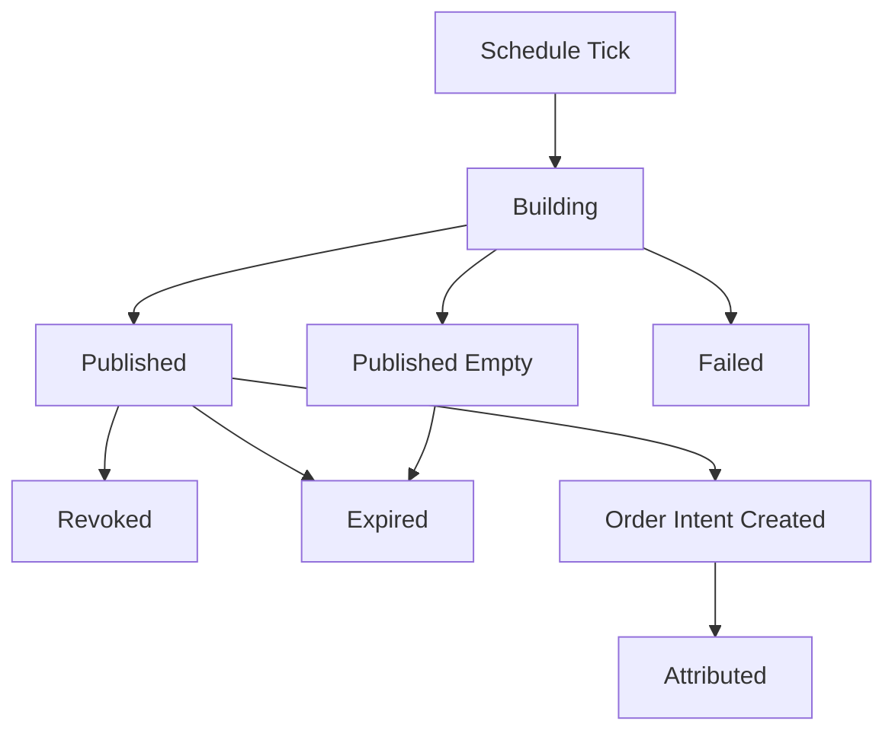

# 04 — TopN 报告与 Recommendation 设计

> 状态：生产级目标设计
>
> 目标：把 TopN 报告定义为 quant-pivot 主产物，而不是旧 PnL report 的扩展。

## 0. 报告职责

`RecommendationReport` 必须完整回答：

- 买什么。
- 什么时候买。
- 买多少。
- 为什么买。
- 什么时候卖。
- 卖多少。
- 什么条件不再买。
- 什么条件强制退出。
- 这条建议来自哪些数据、因子、模型和风险约束。

报告必须做到可读、可执行、可审计、可训练反馈。

## 1. 报告生命周期



状态：

- `building`
- `published`
- `published_empty`
- `failed`
- `revoked`
- `expired`

报告发布后不可变；撤销必须写 `revoked_at` 和 operation log。

## 2. Report Header

每份报告必须包含：

| 字段 | 说明 |
|---|---|
| `recommendation_report_id` | UUID v7 |
| `report_kind` | `top_n`, `shadow_top_n`, `post_run_audit` |
| `as_of` | 报告决策时间 |
| `horizon` | 建议持有/评估时间窗 |
| `runtime_mode` | `report_only`, `semi_auto`, `auto_execution` |
| `runtime_config_version_id` | 配置版本 |
| `model_version_id` | 模型版本 |
| `universe_snapshot_id` | 输入 universe |
| `portfolio_plan_id` | 组合规划 |
| `top_n` | 报告目标数量 |
| `actual_count` | 实际 recommendation 数量 |
| `status` | 报告状态 |
| `summary` | 聚合摘要 |

## 3. Report Summary

`summary` 必须包含：

- universe market count。
- candidates count。
- rejected count。
- published recommendation count。
- total suggested capital。
- max single recommendation capital。
- category allocation。
- event allocation。
- average score。
- min score。
- model confidence summary。
- data quality summary。
- top rejection reasons。
- execution eligibility summary。

空报告必须说明：

- `empty_universe`
- `insufficient_data_quality`
- `model_quality_gate_failed`
- `portfolio_budget_exhausted`
- `no_positive_signal`
- `runtime_mode_disabled`
- `system_degraded`

## 4. Recommendation 主体

每条 recommendation 必须包含以下块：

```text
Recommendation
├── identity
├── rank_and_score
├── market_context
├── entry_plan
├── sizing_plan
├── exit_plan
├── risk_envelope
├── factor_breakdown
├── evidence
├── execution_eligibility
└── lifecycle
```

## 5. Identity

字段：

- `recommendation_id`
- `recommendation_report_id`
- `rank`
- `market_id`
- `event_id`
- `token_id`
- `side`
- `category`
- `question`
- `outcome_name`

`side` 使用新枚举：

- `buy_yes`
- `buy_no`
- `sell_yes`
- `sell_no`

第一版主路径可以只允许 buy，但 schema 必须支持 exit/sell，因为报告需要回答卖出计划。

## 6. Rank and Score

字段：

- `composite_score`
- `risk_adjusted_score`
- `confidence`
- `expected_return_bps`
- `downside_bps`
- `liquidity_score`
- `data_quality_score`
- `model_score_percentile`

解释规则：

- `composite_score` 是模型原始排序分。
- `risk_adjusted_score` 是组合约束后排序分。
- TopN 排序使用 `risk_adjusted_score`。
- score 不允许脱离 factor breakdown 单独出现。

## 7. Market Context

字段：

- `best_bid`
- `best_ask`
- `mid_price`
- `spread_bps`
- `depth_usd`
- `volume_24h_usd`
- `book_age_ms`
- `time_to_resolution_secs`
- `market_status`
- `neg_risk`
- `fee_rate`

这些字段是报告可读性字段，不代替 evidence refs。

## 8. Entry Plan

必须回答什么时候买。

字段：

- `entry_trigger_kind`
- `trigger_price`
- `limit_price`
- `max_slippage_bps`
- `valid_from`
- `valid_until`
- `min_depth_usd`
- `max_book_age_ms`
- `confirmation_window_secs`
- `cancel_if_not_triggered`
- `entry_reason`

Trigger 类型：

| 类型 | 语义 |
|---|---|
| `immediate` | 报告生成后即可入场，但仍受 mode gate |
| `limit_price` | ask/bid 到达指定价格 |
| `pullback` | 价格回撤到目标区间 |
| `breakout` | 突破关键价格或动量阈值 |
| `time_window` | 指定时间窗内才允许 |
| `data_event` | 特征或外部事件更新后触发 |

硬规则：

- `valid_until` 之后不能执行。
- `book_age_ms` 超过阈值不能执行。
- depth 不足不能执行。
- runtime config 或 model version 不匹配时必须重新验证。

## 9. Sizing Plan

必须回答买多少。

字段：

- `suggested_usd`
- `suggested_shares`
- `max_usd`
- `min_usd`
- `portfolio_weight_pct`
- `market_exposure_after_usd`
- `event_exposure_after_usd`
- `category_exposure_after_usd`
- `binding_constraint`
- `sizing_reason`

Binding constraints：

- `portfolio_budget`
- `single_market_cap`
- `event_cap`
- `category_cap`
- `liquidity_cap`
- `drawdown_cap`
- `confidence_cap`
- `manual_cap`

Sizing 不是展示值。执行模式启用时，`OrderIntent` 只能在 sizing plan 边界内创建。

## 10. Exit Plan

必须回答什么时候卖、卖多少。

字段：

- `take_profit_price`
- `take_profit_pct`
- `stop_loss_price`
- `stop_loss_pct`
- `time_exit_at`
- `max_hold_secs`
- `partial_exit_nodes`
- `trailing_stop`
- `signal_invalidation_rules`
- `settlement_policy`
- `manual_review_at`
- `exit_reason`

### 10.1 Partial Exit Node

字段：

- `node_id`
- `trigger_kind`
- `trigger_value`
- `sell_pct`
- `min_price`
- `valid_after`
- `valid_until`
- `reason`

示例：

```json
{
  "node_id": "tp1",
  "trigger_kind": "price_reaches",
  "trigger_value": "0.72",
  "sell_pct": "50",
  "min_price": "0.715",
  "reason": "first take-profit; recover capital and keep convex tail"
}
```

### 10.2 Exit Rule 优先级

从高到低：

1. kill switch / emergency exit。
2. stop loss。
3. signal invalidation。
4. time exit。
5. take profit。
6. settlement hold policy。

如果多个规则同时触发，选择更保守的退出动作。

## 11. Risk Envelope

字段：

- `max_loss_usd`
- `max_slippage_bps`
- `max_position_usd`
- `max_market_exposure_usd`
- `max_event_exposure_usd`
- `max_category_exposure_usd`
- `requires_approval`
- `auto_execution_allowed`
- `risk_notes`
- `envelope_hash`

`RiskEnvelope` 是执行 admission 的输入，不是自然语言提示。

## 12. Factor Breakdown

每个 factor：

- `factor_name`
- `family`
- `raw_value`
- `normalized_score`
- `weight`
- `contribution`
- `confidence`
- `direction`
- `explanation`
- `source_refs`

报告必须展示正贡献和负贡献；不能只展示 bullish 因子。

## 13. Evidence Refs

字段：

- `feature_vector_id`
- `model_run_id`
- `universe_snapshot_id`
- `book_snapshot_ref`
- `runtime_config_version_id`
- `model_version_id`
- `factor_definition_versions`
- `data_quality_report_ref`

每条 recommendation 必须可重放。

## 14. Execution Eligibility

字段：

- `eligible_in_report_only`
- `eligible_in_semi_auto`
- `eligible_in_auto_execution`
- `ineligibility_reasons`
- `approval_required`
- `approval_role`
- `auto_policy_id`

示例：

- report_only: always reportable。
- semi_auto: true if risk envelope valid。
- auto_execution: true only if model published, data fresh, recommendation high confidence, not manually blocked。

## 15. Lifecycle

字段：

- `status`
- `valid_from`
- `valid_until`
- `intent_created_at`
- `executed_at`
- `expired_at`
- `attributed_at`

状态：

- `published`
- `expired`
- `revoked`
- `intent_created`
- `approved`
- `executed`
- `attributed`

## 16. Report API

### 16.1 Read APIs

- `GET /api/quant/reports`
- `GET /api/quant/reports/{id}`
- `GET /api/quant/reports/latest`
- `GET /api/quant/reports/{id}/recommendations`
- `GET /api/quant/recommendations/{id}`
- `GET /api/quant/recommendations/{id}/evidence`
- `GET /api/quant/reports/{id}/diff/{other_id}`

### 16.2 Mutation APIs

普通报告生成不通过 public mutation API。受治理接口：

- `POST /api/quant/reports/run`：手动触发报告。
- `POST /api/quant/reports/{id}/revoke`：撤销报告。
- `POST /api/quant/recommendations/{id}/create-intent`：半自动创建 intent。

所有 mutation 必须写 operation log。

## 17. WebSocket Events

新增：

- `quant.report.started`
- `quant.report.published`
- `quant.report.empty`
- `quant.report.failed`
- `quant.report.revoked`
- `quant.recommendation.intent_created`
- `quant.recommendation.attributed`

删除：

- `opportunity.detected`
- `trade.opened`
- `trade.filled`
- `trade.settled`

## 18. 通知

通知分级：

- `info`: report published, empty report。
- `warning`: report delayed, data quality degraded。
- `critical`: model quality gate failed, fact writer lag。
- `emergency`: auto execution halted, kill switch open。

TopN 报告通知必须包含：

- report id。
- top 3 recommendations。
- total suggested capital。
- runtime mode。
- link to full report。
- warnings。

## 19. Snapshot Tests

必须为以下 payload 建 insta snapshot：

- non-empty TopN report。
- empty report。
- recommendation with immediate entry。
- recommendation with limit entry。
- recommendation with partial exits。
- recommendation not eligible for auto execution。
- revoked report。

## 20. 验收标准

- 报告 payload 能完整回答买、卖、仓位、触发、止盈、止损、退出节点。
- 报告不可变，撤销通过事件表达。
- 空报告有明确原因。
- 每条 recommendation 可追溯到 feature/model/factor/evidence。
- execution eligibility 与 runtime mode 分离。
- API 不暴露旧 opportunity/trade 语义。

## 21. Report Builder Trait 与伪代码

### 21.1 Trait

```rust
/// Owns the full TopN report generation pipeline.
pub trait ReportBuilder {
    /// Build an immutable report from a frozen runtime/config/model snapshot.
    async fn build(
        &self,
        request: BuildReportRequest,
    ) -> QuantResult<RecommendationReportDraft>;
}

/// Converts portfolio plan entries into persisted report rows.
pub trait RecommendationComposer {
    /// Compose report recommendations and rejected-candidate summaries.
    fn compose(
        &self,
        input: ComposeRecommendationInput,
    ) -> QuantResult<ComposedRecommendations>;
}

/// Publishes report side effects after the DB transaction commits.
pub trait ReportPublisher {
    /// Publish through WebSocket, notification channels, and metrics.
    async fn publish(&self, report: &RecommendationReport) -> QuantResult<()>;
}
```

### 21.2 `build_report` 伪代码

```rust
pub async fn build_report(
    request: BuildReportRequest,
    deps: &ReportPipelineDeps,
) -> QuantResult<RecommendationReport> {
    let config = deps.runtime_config.load_version(request.runtime_config_version_id)?;
    let model = deps.model_registry.active_model(config.model.active_model_version_id).await?;

    let universe = deps.universe_selector
        .build_snapshot(UniverseBuildRequest {
            as_of: request.as_of,
            config: config.universe.clone(),
            model_requirements: model.requirements.clone(),
        })
        .await?;

    if universe.members.is_empty() {
        return deps.report_store.create_empty_report(request, universe, EmptyReason::UniverseEmpty).await;
    }

    let features = deps.feature_pipeline
        .build_for_universe(&universe, request.as_of, &config)
        .await?;

    let factor_values = deps.factor_engine.compute_all(&features, &config.factors)?;

    let candidates = deps.model_runner
        .infer(ModelInferenceRequest {
            model,
            universe: universe.clone(),
            features,
            factor_values,
            as_of: request.as_of,
        })
        .await?;

    let plan = deps.portfolio_planner.plan(PortfolioPlanInput {
        candidates,
        budget: config.portfolio.budget(),
        constraints: config.portfolio.constraints(),
    })?;

    let draft = deps.composer.compose(ComposeRecommendationInput {
        request,
        universe,
        portfolio_plan: plan,
        mode: config.execution.runtime_mode,
    })?;

    let report = deps.report_store.create_report(draft).await?;
    deps.audit.record_report_published(&report).await?;
    Ok(report)
}
```

### 21.3 事务边界

一个报告生成事务必须一次性写入：

- `quant_recommendation_report`
- `quant_recommendation`
- `quant_portfolio_plan`
- rejected candidate summary
- operation log event

事务提交后才能：

- 发送 WebSocket。
- 发送 Telegram/webhook。
- 创建 semi-auto/auto intent。
- 写非权威 ClickHouse recommendation event。

### 21.4 空报告生成

空报告不是异常。伪代码：

```rust
fn empty_report(reason: EmptyReason, context: EmptyReportContext) -> RecommendationReportDraft {
    RecommendationReportDraft {
        status: RecommendationReportStatus::PublishedEmpty,
        summary: ReportSummary {
            empty_reason: Some(reason),
            universe_count: context.universe_count,
            rejected_summary: context.rejected_summary,
            warnings: context.warnings,
            ..ReportSummary::zero()
        },
        recommendations: Vec::new(),
    }
}
```

### 21.5 TopN 稳定排序

排序必须稳定：

```rust
fn sort_recommendations(items: &mut [RecommendationDraft]) {
    items.sort_by(|a, b| {
        b.risk_adjusted_score
            .cmp(&a.risk_adjusted_score)
            .then_with(|| b.composite_score.cmp(&a.composite_score))
            .then_with(|| b.liquidity_score.cmp(&a.liquidity_score))
            .then_with(|| a.market_id.cmp(&b.market_id))
            .then_with(|| a.token_id.cmp(&b.token_id))
    });
}
```

## 22. Report Lifecycle Service

```rust
pub trait ReportLifecycleService {
    async fn run_scheduled(&self, schedule_id: ScheduleId) -> QuantResult<RecommendationReport>;
    async fn run_ad_hoc(&self, request: AdHocReportRequest) -> QuantResult<RecommendationReport>;
    async fn revoke(
        &self,
        report_id: RecommendationReportId,
        reason: GovernanceReason,
    ) -> QuantResult<RecommendationReport>;
    async fn expire_due_reports(&self, now: DateTime<Utc>) -> QuantResult<ExpiredReportCount>;
}
```

撤销与过期不能删除 rows，只能状态迁移。
