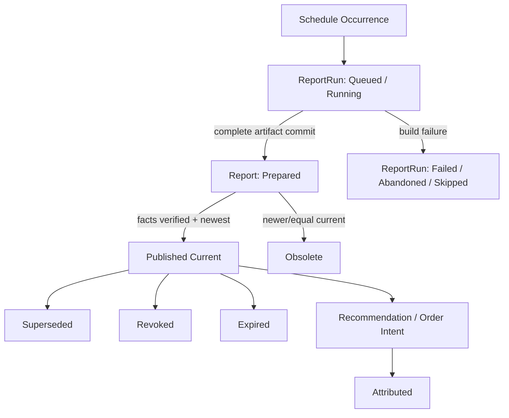

# 04 — TopN 报告与 Recommendation 设计

<!-- quant-pivot-deployment-contract:v1 -->
> **Deployment contract**
> - `fresh_boot_assumption`: 项目尚未正式生产上线，将从全新 `boot` / schema version `1` 部署；仓库和数据库不保存 lifecycle seal 状态。
> - `schema_data_version_impact`: 本文中的历史版本号与递增路径不再具有实施效力；当前实现不迁移测试数据、旧结构或旧版本。
> - `pre_deployment_behavior`: 允许 clean-break、migration squash 与全新基础设施 bootstrap，但任何数据销毁仍需操作者单独授权。
> - `post_deployment_behavior`: 本次实现只交付唯一终态 clean-install contract；不设计升级、降级、旧版本共存或历史数据转换。
> - `rollback_and_data_verification`: 仅在 disposable 空基础设施执行 fresh-install 验证；任何真实数据重置需要操作者另行授权。

> 状态：生产级目标设计
>
> 目标：把 TopN 报告定义为 quant-pivot 主产物，而不是旧 PnL report 的扩展。
>
> **Phase 11.8 覆盖说明**：本文的 typed report 内容仍是概念基线；report/run/delivery FSM、
> current scope、scheduler、API/WS 和 operator workflow 已由
> [`phase-11/11.8-report-lifecycle-fsm-completion.md`](phase-11/11.8-report-lifecycle-fsm-completion.md)
> 破坏式取代。冲突处以 11.8 为唯一权威，本文后半的旧 scheduler 调研仅作历史记录。

> **Cross-Route clean-break**：一份报告可以同时包含多个 category/Buy Route。每个 Route 独立完成
> model/calibration/Trade Policy evaluation，只有转换为 `ExecutableEconomicTier` 的统一贴现 USD 场景
> 现金流后才进入一个全局组合。本文中任何单模型 report header、raw-score 排序、Kelly sizing、
> correlation proxy 或 optimizer fallback 语义均已由本次 clean break 删除；唯一 optimizer 规格见
> [`05.8-cross-route robust portfolio`](phase-05/05.8-portfolio-optimization-highs.md)。

## 0. 报告职责

`RecommendationReport` 必须完整回答：

- 买什么。
- 什么时候买。
- 买多少。
- 为什么买。
- 什么时候卖。
- 卖多少。
- 什么条件不再买。
- 什么条件强制退出。
- 这条建议来自哪些数据、因子、模型和风险约束。

报告必须做到可读、可执行、可审计、可训练反馈。

## 1. 报告生命周期



状态：

- `prepared`
- `published`
- `superseded`
- `obsolete`
- `revoked`
- `expired`

构建状态属于 durable `ReportRun`；有效 empty 是普通 Published 报告并携带 `summary.empty_reason`。
报告内容提交后不可变；lifecycle transition 必须写时间、lineage 和 operation log。

## 2. Report Header

每份报告必须包含：

| 字段 | 说明 |
|---|---|
| `recommendation_report_id` | UUID v7 |
| `report_kind` | `top_n`, `shadow_top_n`, `post_run_audit` |
| `as_of` | 报告决策时间 |
| `route_set_digest` | represented Route 有序集合的 canonical digest |
| `portfolio_scenario_model_artifact_id` | 本报告使用的长期、已晋升场景生成模型 |
| `portfolio_scenario_artifact_id` | 从冻结市场/L2/candidate 输入生成的本报告 concrete 联合场景 |
| `runtime_mode` | `report_only`, `semi_auto`, `auto_execution` |
| `decision_policy_snapshot_id` | 配置版本 |
| `market_selection_id` | 输入 market selection |
| `portfolio_plan_id` | 组合规划 |
| `top_n` | 报告目标数量 |
| `actual_count` | 实际 recommendation 数量 |
| `status` | 报告状态 |
| `summary` | 聚合摘要 |
| `account_source` | 资本基数来源：恒 `polymarket`（真实 venue 账户；所有 mode 一致，credential-gated），见 [09](09-account-capital-position-reconciliation.md) |
| `capital_base_usd` | 本次 sizing 的策略资本基数 = `AccountSnapshot.capital_base_usd`（由真实 venue NLV 受 `portfolio.budget` 护栏约束） |
| `account_snapshot_ref` | 指向 `quant_account_snapshot` 的决策时刻资金/持仓快照（可回放 sizing） |
| `equity_snapshot_ref` | 指向 `quant_equity_snapshot` 的权益历史快照（可回放 high-water mark / drawdown） |

报告不得持有单数 `model_version_id`、`model_run_id` 或 `research_profile_artifact_id`。每个 Route 的
model/calibration/Trade Policy/Research Profile lineage 位于 `ReportRouteRun`，每条 recommendation 引用
自己的 route run。

场景必须分层：`PortfolioScenarioModelArtifact` 是可独立验证、晋升和回滚的长期生成模型；
`PortfolioScenarioArtifact` 是 report-time materialization，只覆盖本报告冻结的 concrete market/token。
禁止把包含当前 market outcome 的 artifact 长期存入 `ModelRouting`，也禁止跨不同 report universe 复用。

## 3. Report Summary

`summary` 必须包含：

- market selection market count。
- candidates count。
- rejected count。
- published recommendation count。
- total suggested capital。
- max single recommendation capital。
- Route/category allocation（只作为敞口与解释维度，不是报告分区）。
- event allocation。
- nominal/robust expected net USD。
- portfolio profit probability、maximum scenario loss 与 CVaR。
- capital occupancy by time bucket。
- represented/zero-candidate/failed Route summary。
- data quality summary。
- top rejection reasons。
- execution eligibility summary。

空报告必须说明：

- `empty_selection`
- `insufficient_data_quality`
- `model_quality_gate_failed`
- `portfolio_budget_exhausted`
- `no_positive_signal`
- `runtime_mode_disabled`
- `system_degraded`

## 4. Recommendation 主体

每条 recommendation 必须包含以下块：

```text
Recommendation
├── identity
├── rank_and_score
├── market_context
├── entry_plan
├── sizing_plan
├── exit_plan
├── risk_envelope
├── factor_breakdown
├── evidence
├── execution_eligibility
└── lifecycle
```

## 5. Identity

字段：

- `recommendation_id`
- `recommendation_report_id`
- `rank`
- `market_id`
- `event_id`
- `token_id`
- `outcome_side`
- `category`
- `question`
- `outcome_name`

`outcome_side` 使用 `OutcomeSide` 枚举（仅结果方向，不含买卖动作）：

- `yes`
- `no`

语义铁律：一条 recommendation 永远是**开仓**（buy-to-open）一个 outcome token，方向只在
"买 YES 还是买 NO"——具体 token 已由 `token_id` 唯一确定，`outcome_side` 只是其可读/可审计
标签。买卖动作（`Buy`/`Sell`）是**执行层**概念（`quant_execution_order.side: common::Side`，
入场 = Buy、出场 = Sell）；**卖出计划完全由 `exit_plan` 表达**，绝不用 `outcome_side` 编码 sell。

## 6. Global Rank and Economics

字段：

- `profit_probability_bps`
- `nominal_expected_net_usd`
- `robust_expected_net_usd`
- `max_loss_usd`
- `cvar_contribution_usd`
- `capital_occupancy_usd_hours`
- `marginal_portfolio_value_usd`
- `binding_constraints`

解释规则：

- raw model score/confidence 只保留在 Route-specific model evidence，不参与跨 Route 排序。
- 排名使用相同 frozen input 下的 leave-one-out robust optimum 差值。
- 同 marginal value 时依次使用 robust net USD、nominal net USD、canonical Route/market/tier identity。
- 所有金额由 exact Decimal verifier 计算，不能直接使用 solver 浮点输出。

## 7. Market Context

字段：

- `best_bid`
- `best_ask`
- `mid_price`
- `spread_bps`
- `depth_usd`
- `volume_24h_usd`
- `book_age_ms`
- `time_to_resolution_secs`
- `market_status`
- `neg_risk`
- `fee_rate`

这些字段是报告可读性字段，不代替 evidence refs。

## 8. Entry Plan

必须回答什么时候买。

字段：

- `entry_trigger_kind`
- `trigger_price`
- `limit_price`
- `max_slippage_bps`
- `valid_from`
- `valid_until`
- `min_depth_usd`
- `max_book_age_ms`
- `confirmation_window_secs`
- `cancel_if_not_triggered`
- `entry_reason`

Trigger 类型：

| 类型 | 语义 |
|---|---|
| `immediate` | 报告生成后即可入场，但仍受 mode gate |
| `limit_price` | ask/bid 到达指定价格 |
| `pullback` | 价格回撤到目标区间 |
| `breakout` | 突破关键价格或动量阈值 |
| `time_window` | 指定时间窗内才允许 |
| `data_event` | 特征或外部事件更新后触发 |

硬规则：

- `valid_until` 之后不能执行。
- `book_age_ms` 超过阈值不能执行。
- depth 不足不能执行。
- runtime config 或 model version 不匹配时必须重新验证。

## 9. Sizing Plan

必须回答买多少。

字段：

- `suggested_usd`
- `suggested_shares`
- `max_usd`
- `min_usd`
- `portfolio_weight_pct`
- `market_exposure_after_usd`
- `event_exposure_after_usd`
- `category_exposure_after_usd`
- `route_exposure_after_usd`
- `binding_constraint`
- `sizing_reason`
- `economic_tier_id`
- `capital_occupancy`

Sizing 由全局 MILP 在真实 L2 生成的离散 `ExecutableEconomicTier` 中选择。不存在 per-candidate Kelly、
confidence curve、连续金额取整或 planner fallback。

Binding constraints：

- `portfolio_budget`
- `available_cash`
- `single_recommendation_cap`
- `single_market_cap`
- `event_cap`
- `category_cap`
- `route_cap`
- `liquidity_cap`
- `drawdown_cap`
- `cvar_cap`
- `scenario_loss_cap`
- `capital_time_bucket_cap`
- `manual_cap`
- `none`

Sizing 不是展示值。执行模式启用时，`OrderIntent` 只能在 sizing plan 边界内创建。

`*_exposure_after_usd` 与 `binding_constraint` 由 portfolio planner 结合 `AccountSnapshot`（资本基数 + 当前持仓/敞口净额）计算，统一抽象见 [09 — 账户、资本、持仓与对账设计](09-account-capital-position-reconciliation.md)。**所有 mode 的资本基数均取真实 venue equity**（净清算价值 `min` `portfolio.budget` 护栏，credential-gated）；`report_only` ≠ dry-run，同样需要真实余额/持仓，凭证缺失则报告不生成（fail closed）。

### 9.1 Route-specific execution economics

`ExecutableEconomicTier` 不再持有语义含混的顶层 shares/entry/occupancy。每个 tier 必须冻结一个
`EntryExecutionEconomics`：

- aggressive：真实 L2 walk 的 requested/filled shares、limit、VWAP 与拆分后的
  `principal_usd` / `venue_fee_usd` / `builder_fee_usd` / `cash_outlay_usd`；
- passive：post-only limit、GTD、requested shares、完整 limit notional 的 hard reservation、OOS
  `PassiveFillDistribution`、expected filled shares，以及可选的 PIT maker-rebate schedule。

组合 scenario 联合枚举 payout/exit 与 `AggressiveFill`、`PassiveNoFill`、`PassivePartialFill`、
`PassiveFullFill`。no-fill 的交易现金流和 rebate 严格为零，但保留 GTD 期间全额资金占用成本；partial/full
只按场景实际 fills 计算 principal、fee、exit 与 delayed rebate。硬现金、最大损失、CVaR 和 tail-risk
cashflow 一律令未到账 rebate 为零。aggressive/passive tiers 共享 candidate identity，因此 MILP 最多选择其一。

Report/API 对执行经济学必须显式输出：`requested_shares`、`expected_filled_shares`、
`hard_reserved_cash_usd`、`immediate_fee_usd`、`expected_maker_rebate_usd`。Decimal 金额继续以 string wire
编码；不得用 expected fill 或 rebate 放松资金约束。

## 10. Exit Plan

必须回答什么时候卖、卖多少。

字段：

- `take_profit_price`
- `take_profit_pct`
- `stop_loss_price`
- `stop_loss_pct`
- `time_exit_at`
- `max_hold_secs`
- `partial_exit_nodes`
- `trailing_stop`
- `signal_invalidation_rules`
- `settlement_policy`
- `manual_review_at`
- `exit_reason`

语义铁律（单一真相源、无重复）：

- `take_profit_*` / `stop_loss_*` / `time_exit_at` / `max_hold_secs` 标量字段是（全量）出场的
  **唯一真相源**。`partial_exit_nodes` 只承载**真正的分批出场**（`sell_pct < 1`）；当出场是
  "命中任一标量触发即全平"时，`partial_exit_nodes` 必须为空，绝不复制标量为 `sell_pct = 1` 的节点。
- `settlement_policy` 由出场配置**推导**，不硬编码：配置了任一主动 on-book 出场（TP/SL/time）⇒
  `exit_before_resolution`；无主动出场 ⇒ `hold_to_resolution`。

### 10.1 Partial Exit Node

字段：

- `node_id`
- `trigger_kind`
- `trigger_value`
- `sell_pct`
- `min_price`
- `valid_after`
- `valid_until`
- `reason`

示例：

```json
{
  "node_id": "tp1",
  "trigger_kind": "price_reaches",
  "trigger_value": "0.72",
  "sell_pct": "50",
  "min_price": "0.715",
  "reason": "first take-profit; recover capital and keep convex tail"
}
```

### 10.2 Exit Rule 优先级

从高到低：

1. kill switch / emergency exit。
2. stop loss。
3. signal invalidation。
4. time exit。
5. take profit。
6. settlement hold policy。

如果多个规则同时触发，选择更保守的退出动作。

## 11. Risk Envelope

字段：

- `max_loss_usd`
- `max_slippage_bps`
- `max_position_usd`
- `max_market_exposure_usd`
- `max_event_exposure_usd`
- `max_category_exposure_usd`
- `requires_approval`
- `auto_execution_allowed`
- `risk_notes`
- `envelope_hash`

`RiskEnvelope` 是执行 admission 的输入，不是自然语言提示。

## 12. Factor Breakdown

每个 factor：

- `factor_name`
- `family`
- `raw_value`
- `normalized_score`
- `weight`
- `contribution`
- `confidence`
- `direction`
- `explanation`
- `source_refs`

报告必须展示正贡献和负贡献；不能只展示 bullish 因子。

## 13. Evidence Refs

字段：

- `feature_vector_id`
- `report_route_run_id`
- `market_selection_id`
- `book_snapshot_ref`
- `decision_policy_snapshot_id`
- `route_lineage`
- `portfolio_scenario_artifact_id`
- `economic_tier_id`
- `factor_definition_versions`
- `data_quality_report_ref`

每条 recommendation 必须可重放。

## 14. Execution Eligibility

字段：

- `eligible_in_report_only`
- `eligible_in_semi_auto`
- `eligible_in_auto_execution`
- `ineligibility_reasons`
- `approval_required`
- `auto_policy_id`

示例：

- report_only: always reportable。
- semi_auto: true if risk envelope valid。
- auto_execution: true only if model published, data fresh, recommendation high confidence, not manually blocked。

## 15. Lifecycle

生命周期按对象严格拆分，禁止把 build、artifact、fact delivery、recommendation 和 execution
揉成一个状态字段：

- `ReportRun`: `queued → running → succeeded | failed | abandoned`，或 `queued → skipped`；
- `RecommendationReport`: `prepared → published | obsolete | revoked`，以及
  `published → superseded | revoked | expired`；
- `ReportFactDelivery`: `pending | delivering | retrying | failed | verified | cancelled`；
- recommendation 与 execution 各自维持独立 FSM。

只有同 `profile_id + report_kind` scope 中唯一的 `published` report 是新入场权威。空结果也是
正式 Published 制品，以 `summary.empty_reason` 表达。

## 16. Report API

### 16.1 Read APIs

- `GET /api/quant/reports`
- `GET /api/quant/reports/{id}`
- `GET /api/quant/reports/current?profile_id=<id>&kind=<kind>`
- `GET /api/quant/reports/{id}/recommendations`
- `GET /api/quant/recommendations/{id}`
- `GET /api/quant/recommendations/{id}/evidence`
- `GET /api/quant/reports/{id}/diff/{other_id}`
- `GET /api/quant/report-runs`
- `GET /api/quant/report-runs/{id}`
- `GET /api/quant/report-schedules/health`
- `GET /api/quant/report-schedule-gaps`
- `GET /api/quant/reports/{id}/timeline`

### 16.2 Mutation APIs

普通报告生成不通过 public mutation API。受治理接口：

- `POST /api/quant/reports/run`：手动触发报告。
- `POST /api/quant/report-runs/{id}/retry`：对 terminal ad-hoc run 创建新 lineage run。
- `POST /api/quant/reports/{id}/publication/retry`：重试 Prepared report 的 failed fact delivery。
- `POST /api/quant/reports/{id}/revoke`：撤销报告。
- `POST /api/quant/recommendations/{id}/create-intent`：半自动创建 intent。

所有 mutation 必须写 operation log。

## 17. WebSocket Events

durable revision hints：

- `quant.report_run`：run 的 durable 状态迁移；
- `quant.report`：`prepared/published/superseded/obsolete/revoked/expired/`
  `delivery_retrying/delivery_failed`；
- `quant.recommendation.intent_created`
- `quant.recommendation.attributed`

WS 不承担状态真相；刷新与重连必须回读 REST/PG。

删除：

- `opportunity.detected`
- `trade.opened`
- `trade.filled`
- `trade.settled`

## 18. 通知

通知分级：

- `info`: report published（包括 empty report）。
- `warning`: report delayed, data quality degraded。
- `critical`: model quality gate failed, fact writer lag。
- `emergency`: auto execution halted, kill switch open。

TopN 报告通知必须包含：

- report id。
- top 3 recommendations。
- total suggested capital。
- runtime mode。
- link to full report。
- warnings。

## 19. Snapshot Tests

必须为以下 payload 建 insta snapshot：

- non-empty TopN report。
- empty report。
- recommendation with immediate entry。
- recommendation with limit entry。
- recommendation with partial exits。
- recommendation not eligible for auto execution。
- revoked report。

## 20. 验收标准

- 报告 payload 能完整回答买、卖、仓位、触发、止盈、止损、退出节点。
- 报告不可变，撤销通过事件表达。
- 空报告有明确原因。
- 每条 recommendation 可追溯到 feature/model/factor/evidence。
- execution eligibility 与 runtime mode 分离。
- API 不暴露旧 opportunity/trade 语义。

## 21. Report Builder Trait 与伪代码

### 21.1 Trait

```rust
/// Owns the full TopN report generation pipeline.
pub trait ReportBuilder {
    /// Build an immutable report from a frozen runtime/config/model snapshot.
    async fn build(
        &self,
        request: BuildReportRequest,
    ) -> QuantResult<RecommendationReportDraft>;
}

/// Converts portfolio plan entries into persisted report rows.
pub trait RecommendationComposer {
    /// Compose report recommendations and rejected-candidate summaries.
    fn compose(
        &self,
        input: ComposeRecommendationInput,
    ) -> QuantResult<ComposedRecommendations>;
}

/// Publishes report side effects after the DB transaction commits.
pub trait ReportPublisher {
    /// Publish through WebSocket, notification channels, and metrics.
    async fn publish(&self, report: &RecommendationReport) -> QuantResult<()>;
}
```

### 21.2 `build_report` 伪代码

```rust
pub async fn build_report(
    request: BuildReportRequest,
    deps: &ReportPipelineDeps,
) -> QuantResult<RecommendationReport> {
    let frozen = deps.report_inputs.freeze(request).await?;
    let discovery = deps.market_selector.discover(&frozen).await?;
    let represented_routes = RepresentedRouteSet::from_discovery(&discovery)?;
    let readiness = deps.route_readiness
        .resolve_all(&represented_routes, &frozen)
        .await?;

    let route_runs = deps.route_pipeline
        .evaluate_all(&represented_routes, &readiness, &discovery, &frozen)
        .await?;
    let tiers = deps.economic_tiers.build(&route_runs, &frozen).await?;
    let plan = deps.global_portfolio
        .solve_and_verify(GlobalPortfolioInput {
            tiers,
            scenario_artifact: readiness.scenario_artifact(),
            account: frozen.account_snapshot(),
            risk: frozen.execution_risk_policy(),
            top_n: frozen.top_n(),
        })?;

    let draft = deps.composer.compose(ComposeRecommendationInput {
        request,
        frozen,
        route_runs,
        global_portfolio_plan: plan,
    })?;

    let report = deps.report_store.create_report(draft).await?;
    deps.audit.record_report_published(&report).await?;
    Ok(report)
}
```

### 21.3 事务边界

一个报告生成事务必须一次性写入：

- `quant_recommendation_report`
- `quant_report_route_run`
- `quant_recommendation`
- `quant_portfolio_plan`
- rejected candidate summary
- operation log event

事务提交后才能：

- 发送 WebSocket。
- 发送 Telegram/webhook。
- 创建 semi-auto/auto intent。
- 写非权威 ClickHouse recommendation event。

### 21.4 空报告生成

空报告不是异常。伪代码：

```rust
fn empty_report(reason: EmptyReason, context: EmptyReportContext) -> RecommendationReportDraft {
    RecommendationReportDraft {
        status: RecommendationReportStatus::Prepared,
        summary: ReportSummary {
            empty_reason: Some(reason),
            market_selection_count: context.market_selection_count,
            rejected_summary: context.rejected_summary,
            warnings: context.warnings,
            ..ReportSummary::zero()
        },
        recommendations: Vec::new(),
    }
}
```

### 21.5 TopN 稳定排序

排序必须稳定：

```rust
fn sort_recommendations(items: &mut [RecommendationDraft]) {
    items.sort_by(|a, b| {
        b.economics
            .marginal_portfolio_value_usd
            .cmp(&a.economics.marginal_portfolio_value_usd)
            .then_with(|| {
                b.economics
                    .robust_expected_net_usd
                    .cmp(&a.economics.robust_expected_net_usd)
            })
            .then_with(|| {
                b.economics
                    .nominal_expected_net_usd
                    .cmp(&a.economics.nominal_expected_net_usd)
            })
            .then_with(|| a.route.cmp(&b.route))
            .then_with(|| a.market_id.cmp(&b.market_id))
            .then_with(|| a.token_id.cmp(&b.token_id))
    });
}
```

## 22. Report Lifecycle Service

生命周期服务消费已 claim 的 durable `ReportRun`，冻结输入后构建不可变 Prepared report；事实验证
成功后通过单一 publication transaction 线性化 current/supersede/obsolete 与 execution cascade。
ad-hoc API 只入队 durable run，不直接在请求线程构建。撤销、过期、失败和重试均写状态或新 lineage，
不得删除事实 row。

## 23. Durable Report Coordinator（Phase 11.8 权威）

Phase 4 的进程内 scheduler、job registry、overlap guard 与 one-shot ad-hoc 设计已经删除，
不得作为历史兼容路径保留。当前唯一调度闭环是：

- PostgreSQL 的 `quant_report_schedule_state` 维护 schedule cursor/spec；
- `quant_report_run` 维护 durable trigger、冻结输入、lease、结果与 retry lineage；
- append-only `quant_report_schedule_gap` 维护未执行 occurrence 的审计范围；
- `croner` 只计算 cadence；claim 使用 `FOR UPDATE SKIP LOCKED` 与 CAS lease；
- 全系统至多一个 Running build；queued scheduled occurrence latest-only coalescing；
- 重启只物化最新 due occurrence，历史 occurrence 聚合为 gap，永不 backfill；
- ad-hoc 使用 durable FIFO、容量 64、TTL 300 秒，失败后由 operator 显式 retry。

完整状态、锁顺序、config activation、崩溃恢复与公平规则以
[Phase 11.8 SCH-*](phase-11/11.8-report-lifecycle-fsm-completion.md) 为唯一真相。

## 24. 调度依赖决策

Report plane 不使用第三方 scheduler runtime。保留 `croner` 解析 interval/cron occurrence；
PostgreSQL 提供 durable ownership、并发线性化与恢复语义。Gamma sync、health check、TTL sweep
等非 report worker 可继续使用既有 `PeriodicTask`，但不得代替 report coordinator。

## 25. 调度层验收标准

调度完成定义只引用 Phase 11.8 的 `SCH-*` 与 `OBS-*`：

- 双副本只能 claim 一次；
- lease heartbeat、lease loss 与 crash recovery 可验证；
- restart gap、latest-only coalescing、schedule reconfigure 可审计；
- ad-hoc FIFO/capacity/TTL/retry 行为有 API 与 PG 测试；
- metrics、alerts、health API 均从 durable PG 事实派生。
