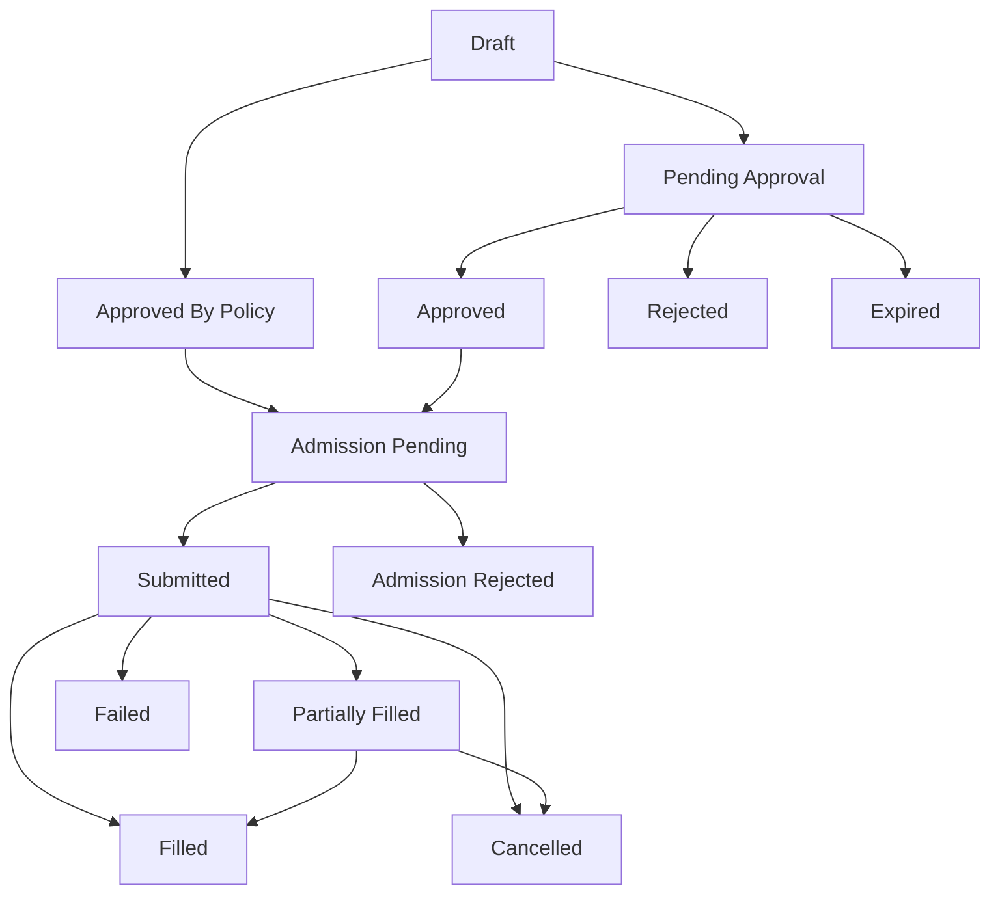

# 05 — 执行、风险与治理设计

> 状态：生产级目标设计
>
> 目标：用 Recommendation 驱动的新执行闭环替换旧 FOK Endgame trade pipeline。

## 0. 总原则

- 执行是报告之后的可选消费路径，不是系统主路径。
- `report_only` 永不创建订单。
- `semi_auto` 必须人工审批。
- `auto_execution` 必须经过 policy approval 和 admission gate。
- 所有执行都从 `OrderIntent` 开始，不允许跳过 intent 直接下单。
- Exit plan 是 position lifecycle 的一部分，不能依赖人工记忆。

## 1. Runtime Mode

### 1.1 `QuantRuntimeMode`

```text
ReportOnly
SemiAuto
AutoExecution
```

删除旧：

```text
DryRun
Paper
Live
```

新模式不是旧模式改名：

- `report_only` 不是 DryRun；它完全不创建订单意图。
- `semi_auto` 不是 Paper；它可以真实下单，但必须人工审批。
- `auto_execution` 不是 Live；它以 Recommendation 和 RiskEnvelope 为中心。

### 1.2 模式转换

允许转换：

- `report_only -> semi_auto`
- `semi_auto -> report_only`
- `semi_auto -> auto_execution`
- `auto_execution -> semi_auto`
- `auto_execution -> report_only`

禁止直接：

- `report_only -> auto_execution`

必须先经过 semi_auto shadow period。

### 1.3 模式切换 preflight

进入 `semi_auto` 需要：

- Polymarket order client ready。
- credentials loaded。
- JWT secret strong。
- active model published or candidate approved for semi-auto。
- data quality green。
- no blocking recovery state。
- risk envelope config valid。

进入 `auto_execution` 需要额外：

- published model。
- shadow period complete。
- quality gates fresh。
- operator approval with reason。
- auto policy limits set。
- kill switch closed。
- max capital budget set。
- exit monitor healthy。

## 2. OrderIntent

### 2.1 作用

`OrderIntent` 是 recommendation 和真实订单之间的唯一桥梁。它冻结：

- recommendation id。
- runtime mode。
- entry plan。
- exit plan。
- sizing plan。
- risk envelope。
- config version。
- model version。
- approval state。

### 2.2 状态机



### 2.3 创建规则

`report_only`：

- 不创建 intent。

`semi_auto`：

- 可以从 recommendation 创建 `PendingApproval` intent。
- 创建 intent 不等于批准。
- intent 必须有 `expires_at`。

`auto_execution`：

- policy 可以创建 `ApprovedByPolicy` intent。
- policy approval 必须记录 policy id、policy hash、reason。

## 3. Approval

### 3.1 人工审批

审批请求：

- acting role。
- operator id。
- reason。
- max allowed USD。
- optional override note。

禁止：

- 修改 recommendation 核心字段。
- 修改模型输出。
- 放宽 risk envelope。
- 延长 recommendation valid_until。

允许：

- 降低 size。
- 降低 limit price。
- 拒绝。
- 要求重新生成报告。

### 3.2 审批失效

以下情况审批立即失效：

- recommendation expired。
- report revoked。
- model version retired。
- runtime config version changed in money-critical path。
- risk envelope hash mismatch。
- data quality degraded below threshold。
- kill switch opened。

## 4. Execution Admission

Admission 不是旧 `RiskPipeline` 的兼容层，而是新执行前置门。

### 4.1 输入

> `account snapshot` / `current exposure` / `filled positions` / `account balance` 的统一类型与唯一 `VenueAccountProvider`（credential-gated 真实账户，**所有 mode 一致**；`report_only` ≠ dry-run，同样读真实余额/持仓，凭证缺失则 fail closed）见 [09 — 账户、资本、持仓与对账设计](09-account-capital-position-reconciliation.md)。

- `OrderIntent`
- latest book snapshot。
- account snapshot。
- active runtime config v3。
- active risk state。
- active kill switch。
- current exposure。
- recommendation evidence refs。

### 4.2 Checks

必须按固定顺序：

1. `IntentStateCheck`
2. `RecommendationFreshnessCheck`
3. `ReportStatusCheck`
4. `RuntimeModeCheck`
5. `ModelPublicationCheck`
6. `DataQualityCheck`
7. `BookFreshnessCheck`
8. `EntryTriggerCheck`
9. `RiskEnvelopeHashCheck`
10. `CapitalBudgetCheck`
11. `MarketExposureCheck`
12. `EventExposureCheck`
13. `CategoryExposureCheck`
14. `LiquidityDepthCheck`
15. `SlippageCheck`
16. `ManualBlockCheck`
17. `KillSwitchCheck`
18. `VenueGuardCheck`
19. `CredentialReadinessCheck`
20. `ExitMonitorReadinessCheck`

任一 hard check fail，拒绝执行。

### 4.3 输出

`AdmissionDecision`：

- `allow`
- `deny`
- `defer`

必须包含：

- check trace。
- threshold。
- actual value。
- elapsed time。
- state version。
- denial reason。

## 5. Entry Order

### 5.1 Order Type

第一版支持：

- limit order。
- FOK only when recommendation explicitly requires immediate liquidity。
- cancel-on-timeout。

不再默认 FOK-only。FOK 是 execution tactic，不是产品架构。

### 5.2 Entry Lifecycle

状态：

- `planned`
- `submitted`
- `accepted`
- `partially_filled`
- `filled`
- `cancel_requested`
- `cancelled`
- `failed`
- `ambiguous`

`ambiguous` 进入 reconciliation，但不自动计为失败。

## 6. Exit Lifecycle

### 6.1 Exit Monitor

每个 filled intent 必须注册 exit monitor：

- price monitor。
- time monitor。
- signal invalidation monitor。
- kill switch monitor。
- manual action monitor。

### 6.2 Exit Actions

- `take_profit_exit`
- `stop_loss_exit`
- `time_exit`
- `partial_exit`
- `signal_invalidated_exit`
- `manual_exit`
- `settlement_hold`

### 6.3 Exit 状态

- `not_started`
- `monitoring`
- `triggered`
- `order_submitted`
- `partially_exited`
- `exited`
- `failed`
- `manual_required`

### 6.4 强制退出

以下情况必须强制退出或要求人工处理：

- kill switch emergency。
- risk envelope breached。
- stop loss triggered。
- model invalidated signal。
- market status abnormal。
- data stale beyond exit threshold。

## 7. Portfolio Risk

### 7.1 报告层风险

Portfolio planner 负责：

- total capital cap。
- per market cap。
- per event cap。
- per category cap。
- correlation cap。
- liquidity cap。
- confidence cap。
- drawdown-aware cap。

### 7.2 执行层风险

Execution admission 负责：

- current exposure。
- pending intents。
- filled positions。
- actual book liquidity。
- account balance。
- venue health。
- trigger validity。

报告层风险不能替代执行层风险；执行层风险也不能修改报告，只能 allow/deny/defer。

## 8. Kill Switch

Kill switch 状态：

- `closed`
- `report_only_forced`
- `execution_halted`
- `exit_only`
- `emergency_halted`

行为：

| 状态 | 报告 | 新入场 | 出场 |
|---|---|---|---|
| `closed` | 允许 | 允许 | 允许 |
| `report_only_forced` | 允许 | 禁止 | 允许 |
| `execution_halted` | 允许 | 禁止 | 禁止自动，人工可处理 |
| `exit_only` | 允许 | 禁止 | 允许 |
| `emergency_halted` | 可降级 | 禁止 | 按 emergency policy |

## 9. Capital Allocation

> 资金状态机、`AccountSnapshot`、`quant_capital_allocation` / `quant_position` 表的完整设计见 [09 — 账户、资本、持仓与对账设计](09-account-capital-position-reconciliation.md)。

旧 reservation system 删除。新系统使用：

- report-level budget。
- intent-level allocation。
- execution-level locked capital。
- release on cancel/fail/exit。

状态：

- `planned`
- `allocated`
- `locked`
- `spent`
- `released`
- `impaired`

资本状态必须可恢复；恢复失败则执行 fail closed，报告可继续。

## 10. Governance

### 10.1 Governed Actions

必须受治理：

- runtime mode change。
- model publish/retire。
- factor publish/retire。
- report revoke。
- order intent approve/reject。
- auto execution policy enable。
- kill switch reset。
- manual market block。
- risk budget increase。

### 10.2 Audit Fields

每个治理动作：

- actor。
- acting role。
- action。
- target id。
- reason。
- before hash。
- after hash。
- request id。
- created_at。

### 10.3 RBAC

角色建议：

- `viewer`: 只读报告。
- `analyst`: 触发 ad-hoc report / backtest。
- `risk_manager`: 调整 risk envelope / reject intents。
- `trader`: approve semi-auto intents。
- `admin`: manage users/config。
- `operator`: mode switch / kill switch。

## 11. Reconciliation

> `quant_reconciliation` 表、证据链与 `PolymarketAccountClient` 数据源见 [09 — 账户、资本、持仓与对账设计](09-account-capital-position-reconciliation.md)。

新 reconciliation 只服务 execution order，不服务旧 trade。

证据顺序：

1. CLOB order status。
2. CLOB trades。
3. token balance delta。
4. account balance delta。
5. book context。
6. operator note。

结果：

- `filled`
- `not_filled`
- `partially_filled`
- `cancelled`
- `unresolvable`

`unresolvable` 必须 block auto execution，直到人工处理。

## 12. Attribution

每个 recommendation 需要结果归因：

- 是否入场。
- 是否按计划入场。
- 入场滑点。
- 是否触发止盈。
- 是否触发止损。
- 是否按时间退出。
- realized PnL。
- missed opportunity return。
- factor contribution after outcome。

Attribution 进入训练样本。

## 13. API

新增：

- `POST /api/quant/intents`
- `POST /api/quant/intents/{id}/approve`
- `POST /api/quant/intents/{id}/reject`
- `POST /api/quant/intents/{id}/cancel`
- `GET /api/quant/intents`
- `GET /api/quant/intents/{id}`
- `GET /api/quant/execution-orders`
- `GET /api/quant/positions`
- `POST /api/system/quant-mode`
- `POST /api/system/kill-switch`

删除：

- `POST /system/mode` old execution mode semantics。
- old trade mutation routes。

## 14. Metrics

新增 metrics：

- `quant_order_intents_created_total`
- `quant_order_intents_approved_total`
- `quant_order_intents_rejected_total`
- `quant_admission_denied_total`
- `quant_execution_orders_submitted_total`
- `quant_execution_fills_total`
- `quant_exit_triggers_total`
- `quant_reconciliation_unresolvable_total`
- `quant_auto_execution_halted`

## 15. 验收标准

- `report_only` 无法创建或提交订单。
- `semi_auto` 未审批无法提交订单。
- `auto_execution` 仍经过 admission gate。
- recommendation 过期后 intent 拒绝执行。
- risk envelope hash mismatch 拒绝执行。
- exit monitor 对每个 filled order 注册。
- kill switch 任一状态行为有测试。
- reconciliation unresolvable 会 block auto execution。
- 所有治理动作写 operation log。

## 16. 核心 Trait 与状态迁移伪代码

### 16.1 Mode Gate

```rust
pub trait RuntimeModeGate {
    /// Decide whether a recommendation may create an order intent.
    fn intent_policy(
        &self,
        mode: QuantRuntimeMode,
        recommendation: &Recommendation,
    ) -> IntentPolicyDecision;
}

pub enum IntentPolicyDecision {
    ReportOnly,
    RequiresApproval { required_role: RoleId, ttl: Duration },
    ApprovedByPolicy { policy_id: PolicyId, reason: String },
    Denied { reason: ModeDenialReason },
}
```

### 16.2 OrderIntent Service

```rust
pub trait OrderIntentService {
    async fn create_from_recommendation(
        &self,
        request: CreateIntentRequest,
    ) -> QuantResult<OrderIntent>;

    async fn approve(
        &self,
        request: ApproveIntentRequest,
    ) -> QuantResult<OrderIntent>;

    async fn reject(
        &self,
        request: RejectIntentRequest,
    ) -> QuantResult<OrderIntent>;

    async fn submit_if_admitted(
        &self,
        order_intent_id: OrderIntentId,
    ) -> QuantResult<ExecutionOrder>;
}
```

### 16.3 创建 intent 伪代码

```rust
pub async fn create_intent_from_recommendation(
    request: CreateIntentRequest,
    deps: &IntentDeps,
) -> QuantResult<OrderIntent> {
    let recommendation = deps.recommendations.get(request.recommendation_id).await?;

    if recommendation.is_expired(deps.clock.now()) {
        return Err(QuantError::RecommendationExpired);
    }

    let report = deps.reports.get(recommendation.report_id()).await?;
    report.ensure_published()?;

    let mode = deps.mode.load();
    let policy = deps.mode_gate.intent_policy(mode, &recommendation);

    match policy {
        IntentPolicyDecision::ReportOnly => Err(QuantError::ReportOnlyMode),
        IntentPolicyDecision::Denied { reason } => Err(QuantError::IntentDenied(reason)),
        IntentPolicyDecision::RequiresApproval { required_role, ttl } => {
            deps.intent_repo.create_pending(NewOrderIntent::pending(
                recommendation,
                required_role,
                deps.clock.now() + ttl,
            )).await
        }
        IntentPolicyDecision::ApprovedByPolicy { policy_id, reason } => {
            deps.intent_repo.create_policy_approved(NewOrderIntent::policy_approved(
                recommendation,
                policy_id,
                reason,
            )).await
        }
    }
}
```

### 16.4 Admission Engine

```rust
pub trait ExecutionAdmissionEngine {
    /// Evaluate all checks in deterministic order.
    async fn evaluate(
        &self,
        input: AdmissionInput,
    ) -> QuantResult<AdmissionDecision>;
}

pub struct AdmissionDecision {
    pub outcome: AdmissionOutcome,
    pub trace: Vec<AdmissionCheckTrace>,
    pub state_version: StateVersion,
}
```

Admission 伪代码：

```rust
pub async fn submit_if_admitted(
    order_intent_id: OrderIntentId,
    deps: &ExecutionDeps,
) -> QuantResult<ExecutionOrder> {
    let intent = deps.intent_repo.get_for_update(order_intent_id).await?;
    intent.ensure_submittable(deps.clock.now())?;

    let input = deps.admission_input_builder.build(&intent).await?;
    let decision = deps.admission.evaluate(input).await?;

    if !decision.outcome.is_allow() {
        deps.intent_repo.mark_admission_rejected(intent.id(), decision.trace).await?;
        return Err(QuantError::AdmissionDenied);
    }

    let order = deps.execution_order_repo.create_entry_order(&intent).await?;
    let venue_result = deps.polymarket_orders.submit(order.to_venue_order()).await;

    deps.execution_order_repo.record_submission_result(order.id(), venue_result).await
}
```

### 16.5 Exit Monitor Trait

```rust
pub trait ExitMonitor {
    /// Evaluate exit rules for one active position/order intent.
    async fn evaluate(
        &self,
        input: ExitMonitorInput,
    ) -> QuantResult<ExitDecision>;
}

pub enum ExitDecision {
    Hold { next_check_at: DateTime<Utc> },
    SubmitExitOrder { reason: ExitReason, order: ExitOrderSpec },
    RequireManualReview { reason: ExitReason },
}
```

Exit 优先级伪代码：

```rust
fn decide_exit(input: &ExitMonitorInput) -> ExitDecision {
    if input.kill_switch.requires_emergency_exit() {
        return emergency_exit(input);
    }
    if input.stop_loss_triggered() {
        return stop_loss_exit(input);
    }
    if input.signal_invalidated() {
        return signal_invalidation_exit(input);
    }
    if input.time_exit_due() {
        return time_exit(input);
    }
    if input.take_profit_triggered() {
        return take_profit_exit(input);
    }
    ExitDecision::Hold { next_check_at: input.next_scheduled_check() }
}
```

## 17. Service 边界

```text
OrderIntentService
├── reads RecommendationReportRepository
├── writes OrderIntentRepository
└── writes OperationLogRepository

ExecutionDispatcher
├── reads OrderIntentRepository
├── calls ExecutionAdmissionEngine
├── writes ExecutionOrderRepository
└── calls PolymarketOrderClient

ExitMonitorService
├── reads active positions/intents
├── reads BookStore / market facts
├── writes ExecutionOrderRepository
└── writes AttributionRepository
```

禁止 handler 直接调用 Polymarket order client；必须通过 service。
