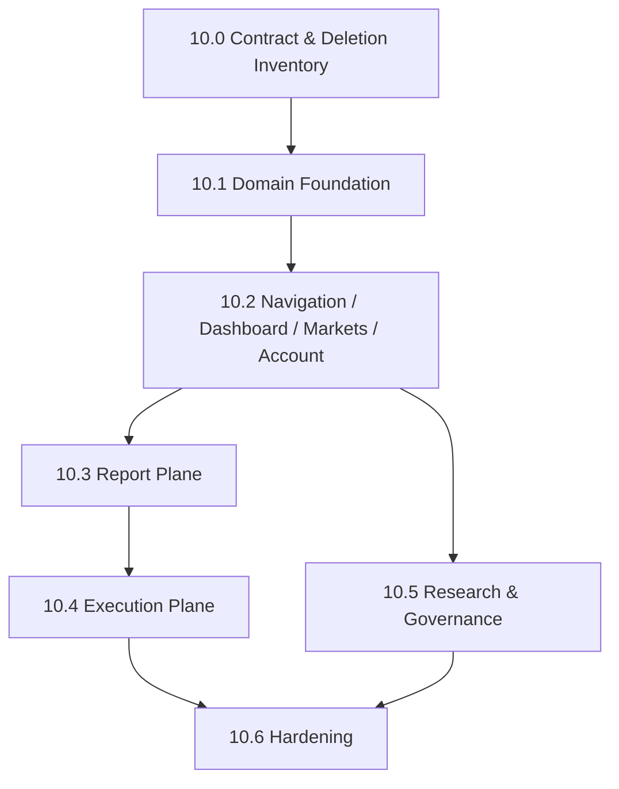

# quant-pivot Frontend Refactor

> 状态：设计计划，未进入代码落地
>
> 范围：`ui/apps/web-antdv-next` 与前端共享类型包 `ui/packages/types`
>
> 目标：把旧 Endgame admin 破坏式重构为 quant-pivot 操作台。主产物是 `RecommendationReport`，执行桥梁是 `OrderIntent`，运行模式只允许 `report_only`、`semi_auto`、`auto_execution`。
>
> **可执行子phase实施契约（10.0–10.6）：** [`phase-10/README.md`](phase-10/README.md)

## 0. 兼容策略

零兼容。删除旧页面、旧 API、旧 store、旧 type、旧 WS case、旧权限码、旧 locale。禁止 re-export 兼容层，禁止旧命名别名，禁止 mock-only 生产页面。

## 1. 设计结论

本次前端不是在旧 Endgame 页面上"换文案"，而是重建业务面。保留 Vben/Antdv 后台基础设施和通用治理能力，删除旧套利业务模型。

**必须保留：**

- Vben `Page`、layout、后端动态菜单、权限码按钮控制。
- `@vben/request` 接入层，以及已有 `Accept-Api-Version: v1` 请求头策略。
- `useVbenVxeGrid`、Drawer 详情、Antdv 表单/弹窗/标签/描述列表等密集后台交互。
- Pinia setup stores，但只保存跨页面、header、realtime、WS revision state；表格主数据由页面 query 拉取。
- 统一 `governed-action-modal`，真实资金、运行模式、kill-switch、runtime-config 激活/回滚等 mutation 必须治理化。
- WebSocket 单例连接、断线重连、订阅恢复、toast/notification 分发。
- RBAC、operation log、users/roles/menus 管理入口。

**必须删除：**

- 旧 Endgame 业务面：`opportunities`、`trades`、`risk`、`pnl`、旧 `analytics`、旧 `replay`、`blacklist`、`control-factors`、`publications`、旧 `audit`。
- 旧运行模式：`DryRun`、`Paper`、`Live`、`ExecutionMode`。
- 旧主路径权限码：`opportunity:*`、`trade:*`、`risk:*`、`pnl:*`、`blacklist:*`、旧 `analytics:*`、旧 `audit:*` 业务入口。
- 旧 WS taxonomy：`opportunity.detected`、`trade.*`、`risk.*`、`pnl.update`、`control.published`。
- 旧业务 barrel export 或 re-export shim。

## 2. 架构约束

前端路由由后端 menu seed 驱动。后端返回的 `component` 必须一一对应 `ui/apps/web-antdv-next/src/views/${component}.vue`，否则登录后动态路由无法落地。

**菜单、权限码、组件路径必须在 10.0 锁死，在 10.2 同步后端 seed 与 locale。不能先做页面再反向猜菜单。**

Pinia 仅承担状态协调职责；表格数据属于页面 query cache，不属于全局事实。

Vue Router 动态路由必须在登录后菜单加载阶段完成，不能依赖页面 mounted 后补路由。

## 3. 子phase索引

| 子phase | 标题 | 文档 |
|---|---|---|
| 10.0 | Contract & Deletion Inventory | [`phase-10/10.0-contract-and-deletion-inventory.md`](phase-10/10.0-contract-and-deletion-inventory.md) |
| 10.1 | Frontend Domain Foundation | [`phase-10/10.1-frontend-domain-foundation.md`](phase-10/10.1-frontend-domain-foundation.md) |
| 10.2 | Navigation / Dashboard / Markets / Account | [`phase-10/10.2-navigation-dashboard-markets-account.md`](phase-10/10.2-navigation-dashboard-markets-account.md) |
| 10.3 | Report Plane | [`phase-10/10.3-report-plane.md`](phase-10/10.3-report-plane.md) |
| 10.4 | Execution Plane | [`phase-10/10.4-execution-plane.md`](phase-10/10.4-execution-plane.md) |
| 10.5 | Research & Governance | [`phase-10/10.5-research-and-governance.md`](phase-10/10.5-research-and-governance.md) |
| 10.6 | Hardening | [`phase-10/10.6-hardening.md`](phase-10/10.6-hardening.md) |

完整菜单树、API matrix、WS 契约、删除清单、API gap、各 phase 详细设计与推进计划见对应子文档。

## 4. 推荐实施顺序

- **10.0** 设计冻结，不写业务代码。
- **10.1** 编译基础层，切断旧 types/API/store/WS。
- **10.2** operator 首屏 + markets + account。
- **10.3** report 主产物 UI。
- **10.4** 执行 ledger 全链路。
- **10.5** 研究与治理（可与 10.3/10.4 并行）。
- **10.6** lint / test / 删除证明。

## 5. 风险与控制

| Risk | Impact | Control |
|---|---|---|
| 后端 menu seed 指向不存在 component | 登录后动态路由不可达 | 10.0 锁 path；10.2 seed verifier |
| 旧 barrel export 残留 | 新页面误用旧 DTO | 10.1 删除；10.6 lint |
| Research 缺 list endpoint | 前端造假 catalog | 10.0 gap register；10.5 ID-driven workbench |
| WS 推送当表格事实源 | 状态不一致 | WS 只改 revision，表格 REST query |
| `report_only` 误解为 dry-run | 凭证语义错误 | Dashboard/System 文案明确 |
| Governed mutation 错误被吞 | fail-closed 不可见 | 409/403/422 detail 原样展示 |

## 6. 外部参考

- [Vben Admin 权限](https://doc.vben.pro/guide/in-depth/access.html)
- [Vben Admin 路由和菜单](https://doc.vben.pro/guide/essentials/route.html)
- [Pinia setup stores](https://pinia.vuejs.org/core-concepts/)
- [Vue Router dynamic routing](https://router.vuejs.org/guide/advanced/dynamic-routing.html)
