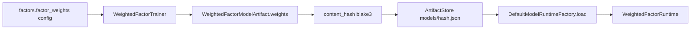

# 03.6 — Trainer, Classical ML & Backtest

<!-- quant-pivot-lifecycle-contract:v1 -->
> **Lifecycle contract**
> - `lifecycle_assumption`: 项目尚未正式生产上线，当前状态为 `pre_production_resettable`，系统自有基线统一为 `boot` / schema version `1`。
> - `schema_data_version_impact`: 本文中的历史版本号与递增路径不再具有实施效力；当前实现不迁移测试数据、旧结构或旧版本。
> - `pre_production_behavior`: 允许 clean-break、migration squash 与全新基础设施 bootstrap，但任何数据销毁仍需操作者单独授权。
> - `production_frozen_behavior`: 一旦完成不可逆 production seal，后续变更必须提供前向 migration、兼容性评估、回滚方案与数据验证。
> - `rollback_and_data_verification`: 封存前通过清空后的 fresh-install 验证；封存后不得回退到 boot reset。

> 父：[`README.md`](README.md) · 概念规格：[`../03-data-factor-model-pipeline.md`](../03-data-factor-model-pipeline.md) §13.4/§16/§17 与
> [`../08-third-party-crates-and-ml-stack.md`](../08-third-party-crates-and-ml-stack.md) §5/§15
>
> 闭环定位：**离线训练/回测层（generic 主路径）**。从冻结 dataset 训练 artifact（weighted 主路径 +
> smartcore classical shadow 候选），用历史 PIT 回测产出指标，并标定 `ReturnModelSpec::Calibrated`。
>
> **垂直领域完整闭环（Crypto 参考垂直）已提升为独立子phase**
> [`03.8-vertical-domain-closed-loop.md`](03.8-vertical-domain-closed-loop.md)（设计真理 D1–D7 +
> 工作流 W1–W7 + 数据源选型），**不在本子phase实现**；3.8 在本子phase的 trainer/backtest 之上加性扩展。

## 1. 目标与闭环定位

- `ModelTrainer`：`WeightedFactorTrainer`。**实现精修**：确定性 coordinate/grid search 为
  **base 主干**（默认 build 即可训练），`argmin`（NelderMead + softmax→单纯形）为 `optimize`-gated
  精修，**仅当严格优于 grid baseline 才采用**——既满足"argmin 优化 + grid 确定性 fallback"，又不
  让 `optimize` 进默认 build。
- classical ML：`ClassicalModelAdapter` over smartcore（首批 RandomForest）+ `bincode` 序列化
  estimator（内容寻址落 `ArtifactStore`，URI/format/preprocessing/metrics 写入
  `ClassicalModelArtifact` JSON）+ 在线 `ClassicalRuntime`，feature-gate `ml-classical`，作为 shadow 候选。
- `Backtester`：**materialized PIT 重放**——按 `as_of` 在冻结 dataset 的横截面上重放（dataset 由 3.5
  离线物化，结构上禁触 live `BookStore`），而非每 tick 流式 `version_at`；最小 deterministic greedy
  allocator 产出 portfolio 级指标。
- `BacktestReport` 指标 + 持久化（新增表 `quant_backtest_report`）。
- **标定**：trainer 写 `objective_report`；回测后由纯函数拟合 `ReturnModelSpec::Calibrated`（PAVA 保单调），
  注册为新 Candidate 子版本（hash 变更，return provenance→calibrated）（见 §1.1）。
- **Admin API**（对齐 3.5.1）：`POST /research/models/train`（`materialization:create`）、
  `GET /research/models/{id}`、`POST /research/models/{id}/backtest`（`replay:create`）、
  `GET /research/backtest-reports/{id}`（`replay:read`）。

### 1.1 从 3.4 承接的标定职责（本期落实）

3.4 已 ship `WeightedFactorModelArtifact` 全字段、`ReturnModelSpec` 两 variant 的
**应用**（`Heuristic` 直接产出、`Calibrated` 插值）与 weight 校验。本期补齐：

- **拟合 `ReturnModelSpec::Calibrated`**：从回测真实结果（已实现 vs 候选）标定单调
  `expected_return_curve` / `downside_curve` + `fit_sample_size`，替换 3.4 的
  `Heuristic` 默认；published 候选的 return provenance 由此变为 `calibrated`。
- **填充 `objective_report: Option<TrainingObjectiveReport>`**：trainer 写入验证目标值
  + 摘要（3.4 hand-authored bootstrap artifact 该字段为 `None`）。
- **`SubstitutionConfidenceRules` 标定**：3.4 用保守默认折减；本期可按回测对
  imputed/kept-missing 行的真实信息损失标定每个 `NullReason` 的乘子（仍 fail-closed）。
- **`ScoreMultiplierSpec` 标定**：data_quality / liquidity / horizon 乘子表可由回测
  分层表现标定，替换 3.4 的保守默认。
- artifact 仍走 3.4 的**内容寻址**落库（`models/<hash>.json` + `quant_model_version`
  记录 hash），trainer 产物经 `ModelRegistryRepository` 注册为 candidate/shadow。

### 1.2 `factor_weights` 训练闭环

`FactorsConfig.factor_weights` 在 3.4 **不参与在线推理**；本子phase将其作为训练侧
输入，产出冻结进 artifact 后再进入 registry。

| 阶段 | 行为 |
|------|------|
| 输入 | `TrainModelRequest` + 冻结 `FactorsConfig.factor_weights` 作 **argmin 初值 / grid search anchor** |
| 优化 | `WeightedFactorTrainer` 产出非负、和为 1 的权重向量（与 3.4 `validate()` 同契约） |
| 冻结 | 权重写入 `WeightedFactorModelArtifact.weights`，参与 `content_hash()` |
| 注册 | 经 `ModelRegistryRepository` 创建 **Candidate** 版本（非 Published） |
| 在线 | 3.6 本身不跑 config overlay；candidate 推理在 3.7 前仍用 artifact 内权重 |

## 2. 删除清单

- 无既有 trainer/backtest 代码可删（净新增）。
- 复用 3.0 的 `ModelArtifact` enum，本期填充 `WeightedFactorModelArtifact`（3.4 已起头）
  与 `ClassicalModelArtifact` 字段；不新建并行 artifact 类型。

## 3. 新领域类型 / 表 / ClickHouse fact

### 3.1 Trainer（`research::model::trainer`）

```rust
pub struct TrainModelRequest {
    pub model_spec_id: ModelSpecId,
    pub dataset: TrainingDatasetArtifact,
    pub objective: TrainingObjective,
    pub regularization: Regularization,
    pub validation: ValidationSpec,         // rolling validation split
}

pub struct TrainedModelArtifact {
    pub artifact: ModelArtifact,
    pub artifact_hash: ContentHash,
    pub in_sample_metrics: TrainingObjectiveReport,
    pub validation_metrics: ValidationReport,
}

pub trait ModelTrainer: Send + Sync {       // 3.0 已定
    fn model_family(&self) -> ModelFamily;
    async fn train(&self, request: TrainModelRequest) -> QuantResult<TrainedModelArtifact>;
}
```

目标函数（父文档 §16）：

```text
loss = pairwise_rank_loss(predicted_score, realized_return)
     + lambda_drawdown * tail_loss_penalty
     + lambda_turnover * turnover_penalty
     + lambda_complexity * weight_l2
```

`WeightedFactorTrainer`：argmin 优化权重；保留 grid search 作 deterministic
fallback；支持手工权重 / category-level override / rolling validation。

### 3.2 Classical adapter（`research::model::classical`，feature `ml-classical`）

**Implemented kinds (6, smartcore 0.5):** `RandomForest`, `ExtraTrees` (tree-ensemble
regressors), `Ridge`, `Lasso`, `ElasticNet` (penalized-linear regressors) → continuous
return-proxy ranking score; `LogisticRegression` (binary classifier) → true yes-probability
`σ(wᵀx+b)`. `GradientBoosting` was **removed** from `ClassicalKind`: smartcore 0.5 ships no
production gradient-boosting estimator (only an experimental `xgboost` binding unfit for
money code), so the enum stays honest — every declared kind is actually producible.

```rust
pub trait ClassicalModelAdapter: Send + Sync {
    fn kind(&self) -> ClassicalKind;
    fn train(&self, matrix: &TrainingMatrix) -> QuantResult<ClassicalTrainOutput>;
    fn validate(&self, matrix: &TrainingMatrix, folds: u32) -> QuantResult<ValidationReport>;
}

// Single dispatch point; the core never names a concrete smartcore type.
ClassicalAdapterRegistry::adapter_for(kind) -> Box<dyn ClassicalModelAdapter>

// The serialized estimator union (bincode); the logistic variant stores the
// extracted coefficients + intercept so inference is a pure dot-product + sigmoid.
enum SmartcoreModel { RandomForest, ExtraTrees, Ridge, Lasso, ElasticNet, Logistic { .. } }
```

pub struct ClassicalModelArtifact {
    pub artifact_id: ModelArtifactId,
    pub family: ClassicalKind,
    pub crate_name: String,                  // "smartcore"
    pub crate_version: String,
    pub feature_schema_hash: ContentHash,
    pub label_schema_hash: ContentHash,
    pub training_dataset_hash: ContentHash,
    pub serialized_model_uri: ArtifactUri,
    pub serialization_format: ModelSerializationFormat,
    pub preprocessing: PreprocessingArtifact,
    pub metrics: ClassicalModelMetrics,
}
```

业务层禁止出现 `smartcore::...` concrete 类型；只经 adapter + `ModelArtifact`。
classical runtime 的在线 `QuantModelRuntime` 实现也在本子phase落地（3.4 已留 factory
分支 + enum arm），使 shadow 推理可统一调用。

### 3.3 Backtester（`research::backtest`）

```rust
pub struct BacktestRequest {
    pub model: Box<dyn QuantModelRuntime>,
    pub window_start: DateTime<Utc>,
    pub window_end: DateTime<Utc>,
    pub schedule: BacktestSchedule,          // tick 序列
    pub decision_policy_snapshot_id: DecisionPolicySnapshotId,
}

pub struct BacktestReport {
    pub backtest_report_id: BacktestReportId,
    pub model_version_id: ModelVersionId,
    pub coverage: Decimal,
    pub sample_count: u64,
    pub missing_feature_count: u64,
    pub rank_ic: Decimal,
    pub hit_rate: Probability,
    pub expected_vs_realized: ExpectedVsRealized,
    pub max_drawdown: Decimal,
    pub turnover: Decimal,
    pub liquidity_feasibility: Probability,
    pub category_breakdown: Vec<CategoryMetric>,
    pub tail_loss: Decimal,
    pub report_pnl_simulation: PnlSimulation,
    pub report_hash: ContentHash,
}

pub trait Backtester: Send + Sync {          // 3.0 已定
    async fn run(&self, request: BacktestRequest) -> QuantResult<BacktestReport>;
}
```

回测循环（父文档 §17）：每 tick → version_at(as_of) → selector → feature pipeline
（`PitView::Historical`）→ factor engine → model infer → **greedy allocator** →
report simulator → outcome resolver → 累计指标。**禁止 live `BookStore`**。

### 3.4 最小 greedy allocator（`research::backtest::allocator`）

```rust
/// Phase 03 占位组合层；Phase 04 用受治理 PortfolioPlanner 复用同一 trait。
pub trait PortfolioAllocator: Send + Sync {
    fn allocate(&self, input: AllocationInput) -> QuantResult<AllocationOutput>;
}
pub struct GreedyPortfolioAllocator;         // sort by risk_adjusted_score → 应用 budget/exposure/liquidity caps
```

用于产出 portfolio 级指标（drawdown / turnover / category breakdown）。完整受治理
planner 见延后项。

### 3.5 Postgres 新增

- **backtest 报告持久化**：新增表 `quant_backtest_report`（iden/entity/domain
  DTO/repo），PK `backtest_report_id`，存指标摘要 + `report_hash` + `parquet_uri`
  （明细可选落 Parquet），生命周期=report，注册进 schema graph。
  （备选：存进 `quant_model_run.metrics_json`；本期选独立表以便 UI/质量门禁直接读，
  父文档 §7.2 指标集较大。）
- 关联：`ModelRunKind::Backtest` 的 `quant_model_run` 记录 run 元数据，
  `quant_backtest_report` 存指标。

### 3.6 ClickHouse fact

无新增（回测指标走 Postgres + Parquet；不污染高频 CH 流）。

### 3.7 权重数据流（config → artifact → runtime）



> 3.4 在线路径只读 artifact 权重；config `factor_weights` 在 3.6 作训练 seed，
> 在 3.7 可对非 Published 版本做热覆盖（见 [`03.7`](03.7-quality-gates-and-governance.md) §3.6）。

## 4. deploy-config key 与 runtime-config v3 path

- 消费 `PortfolioConfig`（greedy allocator 的 budget/exposure/liquidity caps：
  `total_budget_usd`、`max_single_recommendation_usd`、`max_market/event/category_exposure_usd`、
  `liquidity_usage_cap_pct`、`confidence_size_curve`）。
- 消费 `ModelConfig.prediction_horizon_secs`、`FactorsConfig.factor_weights`
  （训练初值/联调）。
- deploy：`deploy.research.artifact_root`（模型/preprocessing/backtest Parquet）。
  classical/argmin 仅在启用 `ml-classical`/`optimize` 的 build 链接。

## 5. 必建模块与 trait

```text
research/src/model/
├── trainer.rs      # ModelTrainer + WeightedFactorTrainer
├── weighted.rs     # (3.4) + classical 在线 runtime
├── classical.rs    # ClassicalModelAdapter (smartcore) [ml-classical]
└── optimize.rs     # argmin objective + grid search fallback [optimize]
research/src/backtest/
├── mod.rs
├── runner.rs       # Backtester
├── simulator.rs    # report simulator + outcome resolver
├── metrics.rs      # BacktestMetrics（rank IC / hit rate / drawdown / tail loss ...）
└── allocator.rs    # GreedyPortfolioAllocator
```

> 垂直领域模块树（linkage / domain / CryptoDomainFeatureBuilder / domain factor / ChDomainPitSource /
> BinanceKlineSource / quant_market_linkage / quant_domain_observation）见
> [`03.8`](03.8-vertical-domain-closed-loop.md) §5，**不在本子phase实现**。

## 6. 生产不变量与失败语义

### 6.1 Training dataset consumer rules（3.5 契约）

- `TrainModelRequest` / `build_training_matrix`：**仅接受** `Ready` dataset；训练直接消费
  冻结 Parquet v2，禁止重新物化或替换 feature/factor/label。
- `InsufficientLabels` / `Failed`：硬拒绝；`label_coverage` 低于 spec 阈值同样拒绝。
- `build_training_matrix`：无 target label 行计入 `rejected_rows`，不得 silent 填零。

### 6.2 Trainer / backtest invariants

- **回测只用 PIT**：禁止 live `BookStore`；feature/factor 经统一
  `PointInTimeSnapshotSource` + `DecisionBoundary` durable resolver。
- **artifact 可复现可 hash**：weighted = serde_json + canonical hash；classical 必须
  先 spike 验证 smartcore serde 能力（父文档 §15.3）——不可序列化则用自有 format 或
  暂不进生产，禁止无 hash 发布。
- **f64 仅训练矩阵 / 优化器边界**；输出权重/分数回到 Decimal/Probability。
- **确定性**：argmin 固定 seed；相同 dataset+objective → 稳定 artifact hash
  （父文档 `weighted_trainer_produces_stable_hash`）。
- **crate version 记录**：classical artifact 存 `crate_name`/`crate_version`；加载时
  mismatch 告警并默认拒绝（父文档 §15.6）。
- **greedy 是占位**：明确标注非全局最优，Phase 04/05 升级。
- **Trainer 输出的 artifact 权重是唯一“待发布”来源**；config `factor_weights` 仅作
  训练 seed，不参与 Published 推理（3.4 行为）。Publish 必须以新 artifact hash 固化
  权重，禁止永久依赖 config overlay（overlay 见 3.7）。

## 7. 第三方 crate 引入

- `optimize`：`argmin` + `argmin-math`（权重优化、阈值校准）。
- `ml-classical`：`smartcore`（RF/ExtraTrees/Logistic/Ridge 等）。
- `dataframe` / `stats`：沿用（矩阵、统计、Parquet）。
- 必做 spike（父文档 §12.2/§12.3）：smartcore 训练+序列化+feature importance+
  inference latency；argmin objective+checkpoint+deterministic seed+convergence。
- 禁止本期：`good_lp`（greedy 占位）、ort/burn/candle。

## 8. 验收测试（含父文档 §23）

**Trainer / optimizer (research):**
- `weighted_trainer_produces_stable_hash`。
- `weighted_trainer_is_thread_count_invariant`（rayon 并行坐标搜索 + fold：1 线程 vs 4
  线程产出 byte-identical artifact）。
- `weighted_trainer_seeds_from_config_factor_weights`（初值来自 config，优化后写入 artifact）。
- `optimize_refine_is_deterministic_on_fixed_platform`（`optimize`：同输入 → 逐 weight Decimal 相等）。
- `optimize_never_worsens_grid_objective`（100 随机 simplex seeds property test）。
- `optimize_converges_and_falls_back_to_grid`。

**标定（research）:**
- `calibration_curve_is_monotone`（PAVA 单调 return/downside 曲线）。
- `calibration_multipliers_fail_closed`（亏损分层坍缩到 0；未观测分层保留保守 baseline）。
- `calibration_substitution_never_exceeds_baseline`、`calibration_liquidity_tiers_are_stratified`。

**Backtest（research + core）:**
- `backtest_uses_pit_source_not_live_bookstore`（核心）。
- `backtest_report_metrics_complete` / `backtest_report_hash_is_deterministic`。
- `greedy_allocator_respects_budget_and_caps`。
- `comparison_reports_capture_deltas_and_disagreement`（pair 模式 rank_ic/pnl delta +
  score correlation + side disagreement）。

**Classical（`ml-classical`）:**
- `every_classical_kind_trains_validates_and_roundtrips`（6 kinds：train + 滚动验证 +
  bincode roundtrip）。
- `logistic_emits_probability_ranking`、`classical_adapter_train_predict_roundtrip`、
  `classical_artifact_serialize_and_reload_with_version_check`。
- `business_layer_has_no_smartcore_concrete_type`（boundary lint/test）。

**repo/schema（docker e2e）:** `quant_backtest_report_migration_and_crud`、
`quant_model_comparison_report_migration_and_crud`、`model_train_backtest_e2e`。

> 仍待补：`trained_artifact_weights_replace_config_at_publish_boundary`（publish-boundary
> e2e，需 DB）与 `backtest_pit_parity`（live/historical 向量 hash 一致），下一 DB 切片落地。

> 垂直验收（`vertical_backtest_category_breakdown` / `crypto_settlement_cross_check_flags_divergence` /
> linkage / domain PIT / 两层向量 / factor 路由 / Oracle / ModelRouting / dataset domain slice）见
> [`03.8`](03.8-vertical-domain-closed-loop.md) §10。

## 9. Blocker

- 若回测访问 live `BookStore`，本子phase失败。
- 若任一 ML concrete type（smartcore）泄漏到业务层 `pub` 契约，本子phase失败。
- 若发布/持久化的模型 artifact 无 canonical hash，本子phase失败。
- 若 `ml-classical`/`optimize`/`dataframe` 被默认 build 强制链接，本子phase失败。

## 10. 延后 / 缺口

- **`ModelConfig.prediction_horizon_secs` → artifact**：trainer 从冻结 config 写入
  `WeightedFactorModelArtifact.prediction_horizon_secs`；3.4 在线 **不读** config（见
  [`03.4`](03.4-model-runtime-weighted-scorer.md) §4.2）。
- **完整受治理 `PortfolioPlanner`** → Phase 04（本期 greedy allocator 占位；trait
  `PortfolioAllocator` 设计为 Phase 04 可平滑替换）。
- **`good_lp` LP/MILP 组合优化** → Phase 05（父文档 §16）。
- **classical 的 category-specific ensemble / regime-switching** → 后续；本期单一
  全局 classical 候选即可满足 shadow 对比。
- **ONNX / `ort` 推理 arm** → Phase 06（3.4 factory 仅 enum 占位）。
- **垂直领域完整闭环（Crypto 参考垂直）** → 独立子phase [`03.8`](03.8-vertical-domain-closed-loop.md)
  （设计真理 D1–D7 + 工作流 W1–W7 + 数据源选型），在本子phase trainer/backtest 之上加性扩展，**不在本子phase实现**。

## 11. 变更记录

| 日期 | 变更 |
|------|------|
| 2026-06 | trainer/classical/backtest 核心闭环落地；标定 `ReturnModelSpec::Calibrated`；Web Admin API |
| 2026-06 | **垂直领域完整闭环移出**：原 §11（W1–W7）提升为独立子phase [`03.8`](03.8-vertical-domain-closed-loop.md)，3.6 纯化为 generic 主路径 |
| 2026-06 | **生产级收口**：① 标定全闭环（return 曲线 + data-quality/liquidity/horizon multiplier + substitution rules + 统一 `calibrate_weighted_artifact`，全 fail-closed；修复回测采样硬编码 `Fresh` 的资金 bug）。② trainer rayon 并行（确定性最速下降坐标搜索 + 并行 fold，线程数不变性测试）+ argmin 确定性/不劣化测试。③ classical 6 kinds（registry + 滚动验证 + `InferenceBatchBuilder` 经 `build_runtime_input` 统一 weighted/classical 输入）；`ModelRunner` shadow 按 `model_family` 分派 + classical 连续失败 critical 告警；classical backtest 支持。④ pair backtest + `ModelComparisonReport`（research 度量 + iden/entity/DTO/View/repo/RBAC `Replay:Read` + `GET /research/comparison-reports/{id}`）。⑤ `GradientBoosting` 从 `ClassicalKind` 移除（smartcore 0.5 无生产级 GB）。⑥ CI `heavy-ml` job + docker e2e 加入 backtest/comparison repo 套件；bin `ml-classical`/`optimize` feature profile |
