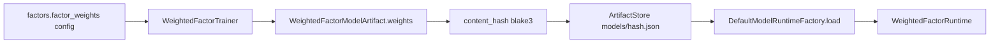
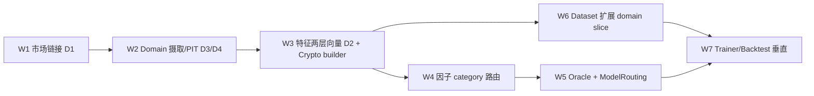

# 03.6 — Trainer, Classical ML & Backtest

> 父：[`README.md`](README.md) · 概念规格：[`../03-data-factor-model-pipeline.md`](../03-data-factor-model-pipeline.md) §13.4/§16/§17 与
> [`../08-third-party-crates-and-ml-stack.md`](../08-third-party-crates-and-ml-stack.md) §5/§15
>
> 闭环定位：**离线训练/回测层 + 垂直领域完整闭环（Crypto 参考垂直）**。从冻结 dataset
> 训练 artifact（weighted 主路径 + smartcore classical shadow 候选），用历史 PIT 回测产出
> 指标；**同时**在本子phase统一落地垂直领域从实体解析 → domain 摄取/PIT → 真实特征/因子 →
> category-specific 模型路由 → domain slice 训练/回测的全链路（设计真理见
> [`03.x-vertical-domain-design.md`](03.x-vertical-domain-design.md)，数据源见
> [`03.8-domain-data-sources.md`](03.8-domain-data-sources.md)）。**3.5 已交付**，垂直工作
> **不回推** 3.2/3.3/3.5，全部排入本子phase §11。

## 1. 目标与闭环定位

- `ModelTrainer`：`WeightedFactorTrainer`（argmin 权重优化 + grid search fallback）。
- classical ML：`ClassicalModelAdapter` over smartcore（tree/ensemble/logistic）+
  序列化 artifact + preprocessing，feature-gate `ml-classical`，作为 shadow 候选。
- `Backtester`：PIT 重放 + 最小 deterministic greedy allocator 产出 portfolio 级指标。
- `BacktestReport` 指标 + 持久化（新增表）。
- **垂直领域完整闭环（Crypto 参考垂直）**：见 §11——在 3.5 已交付的 PIT/dataset 管线上
  加性扩展，不回推 3.2/3.3/3.5。

### 1.1 从 3.4 承接的标定职责（本期落实）

3.4 已 ship `WeightedFactorModelArtifact` 全字段、`ReturnModelSpec` 两 variant 的
**应用**（`Heuristic` 直接产出、`Calibrated` 插值）与 weight 校验。本期补齐：

- **拟合 `ReturnModelSpec::Calibrated`**：从回测真实结果（已实现 vs 候选）标定单调
  `expected_return_curve` / `downside_curve` + `fit_sample_size`，替换 3.4 的
  `Heuristic` 默认；published 候选的 return provenance 由此变为 `calibrated`。
- **填充 `objective_report: Option<TrainingObjectiveReport>`**：trainer 写入验证目标值
  + 摘要（3.4 hand-authored bootstrap artifact 该字段为 `None`）。
- **`SubstitutionConfidenceRules` 标定**：3.4 用保守默认折减；本期可按回测对
  imputed/kept-missing 行的真实信息损失标定每个 `NullReason` 的乘子（仍 fail-closed）。
- **`ScoreMultiplierSpec` 标定**：data_quality / liquidity / horizon 乘子表可由回测
  分层表现标定，替换 3.4 的保守默认。
- artifact 仍走 3.4 的**内容寻址**落库（`models/<hash>.json` + `quant_model_version`
  记录 hash），trainer 产物经 `ModelRegistryRepository` 注册为 candidate/shadow。

### 1.2 `factor_weights` 训练闭环

`FactorsConfig.factor_weights` 在 3.4 **不参与在线推理**；本子phase将其作为训练侧
输入，产出冻结进 artifact 后再进入 registry。

| 阶段 | 行为 |
|------|------|
| 输入 | `TrainModelRequest` + 冻结 `FactorsConfig.factor_weights` 作 **argmin 初值 / grid search anchor** |
| 优化 | `WeightedFactorTrainer` 产出非负、和为 1 的权重向量（与 3.4 `validate()` 同契约） |
| 冻结 | 权重写入 `WeightedFactorModelArtifact.weights`，参与 `content_hash()` |
| 注册 | 经 `ModelRegistryRepository` 创建 **Candidate** 版本（非 Published） |
| 在线 | 3.6 本身不跑 config overlay；candidate 推理在 3.7 前仍用 artifact 内权重 |

## 2. 删除清单

- 无既有 trainer/backtest 代码可删（净新增）。
- 复用 3.0 的 `ModelArtifact` enum，本期填充 `WeightedFactorModelArtifact`（3.4 已起头）
  与 `ClassicalModelArtifact` 字段；不新建并行 artifact 类型。

## 3. 新领域类型 / 表 / ClickHouse fact

### 3.1 Trainer（`research::model::trainer`）

```rust
pub struct TrainModelRequest {
    pub model_spec_id: ModelSpecId,
    pub dataset: TrainingDatasetArtifact,
    pub objective: TrainingObjective,
    pub regularization: Regularization,
    pub validation: ValidationSpec,         // rolling validation split
}

pub struct TrainedModelArtifact {
    pub artifact: ModelArtifact,
    pub artifact_hash: ContentHash,
    pub in_sample_metrics: TrainingObjectiveReport,
    pub validation_metrics: ValidationReport,
}

pub trait ModelTrainer: Send + Sync {       // 3.0 已定
    fn model_family(&self) -> ModelFamily;
    async fn train(&self, request: TrainModelRequest) -> QuantResult<TrainedModelArtifact>;
}
```

目标函数（父文档 §16）：

```text
loss = pairwise_rank_loss(predicted_score, realized_return)
     + lambda_drawdown * tail_loss_penalty
     + lambda_turnover * turnover_penalty
     + lambda_complexity * weight_l2
```

`WeightedFactorTrainer`：argmin 优化权重；保留 grid search 作 deterministic
fallback；支持手工权重 / category-level override / rolling validation。

### 3.2 Classical adapter（`research::model::classical`，feature `ml-classical`）

```rust
pub trait ClassicalModelAdapter: Send + Sync {
    fn family(&self) -> ClassicalKind;       // RandomForest / ExtraTrees / Logistic / Ridge ...
    fn train(&self, matrix: &TrainingMatrix, params: ClassicalTrainingParams)
        -> QuantResult<ModelArtifact>;        // → ModelArtifact::Classical
    fn predict_batch(&self, artifact: &ClassicalModelArtifact, matrix: &InferenceMatrix)
        -> QuantResult<Vec<ModelPrediction>>;
}

pub struct ClassicalModelArtifact {
    pub artifact_id: ModelArtifactId,
    pub family: ClassicalKind,
    pub crate_name: String,                  // "smartcore"
    pub crate_version: String,
    pub feature_schema_hash: ContentHash,
    pub label_schema_hash: ContentHash,
    pub training_dataset_hash: ContentHash,
    pub serialized_model_uri: ArtifactUri,
    pub serialization_format: ModelSerializationFormat,
    pub preprocessing: PreprocessingArtifact,
    pub metrics: ClassicalModelMetrics,
}
```

业务层禁止出现 `smartcore::...` concrete 类型；只经 adapter + `ModelArtifact`。
classical runtime 的在线 `QuantModelRuntime` 实现也在本子phase落地（3.4 已留 factory
分支 + enum arm），使 shadow 推理可统一调用。

### 3.3 Backtester（`research::backtest`）

```rust
pub struct BacktestRequest {
    pub model: Box<dyn QuantModelRuntime>,
    pub window_start: DateTime<Utc>,
    pub window_end: DateTime<Utc>,
    pub schedule: BacktestSchedule,          // tick 序列
    pub runtime_config_version_id: RuntimeConfigVersionId,
}

pub struct BacktestReport {
    pub backtest_report_id: BacktestReportId,
    pub model_version_id: ModelVersionId,
    pub coverage: Decimal,
    pub sample_count: u64,
    pub missing_feature_count: u64,
    pub rank_ic: Decimal,
    pub hit_rate: Probability,
    pub expected_vs_realized: ExpectedVsRealized,
    pub max_drawdown: Decimal,
    pub turnover: Decimal,
    pub liquidity_feasibility: Probability,
    pub category_breakdown: Vec<CategoryMetric>,
    pub tail_loss: Decimal,
    pub report_pnl_simulation: PnlSimulation,
    pub report_hash: ContentHash,
}

pub trait Backtester: Send + Sync {          // 3.0 已定
    async fn run(&self, request: BacktestRequest) -> QuantResult<BacktestReport>;
}
```

回测循环（父文档 §17）：每 tick → version_at(as_of) → selector → feature pipeline
（`PitView::Historical`）→ factor engine → model infer → **greedy allocator** →
report simulator → outcome resolver → 累计指标。**禁止 live `BookStore`**。

### 3.4 最小 greedy allocator（`research::backtest::allocator`）

```rust
/// Phase 03 占位组合层；Phase 04 用受治理 PortfolioPlanner 复用同一 trait。
pub trait PortfolioAllocator: Send + Sync {
    fn allocate(&self, input: AllocationInput) -> QuantResult<AllocationOutput>;
}
pub struct GreedyPortfolioAllocator;         // sort by risk_adjusted_score → 应用 budget/exposure/liquidity caps
```

用于产出 portfolio 级指标（drawdown / turnover / category breakdown）。完整受治理
planner 见延后项。

### 3.5 Postgres 新增

- **backtest 报告持久化**：新增表 `quant_backtest_report`（iden/entity/domain
  DTO/repo），PK `backtest_report_id`，存指标摘要 + `report_hash` + `parquet_uri`
  （明细可选落 Parquet），生命周期=report，注册进 schema graph。
  （备选：存进 `quant_model_run.metrics_json`；本期选独立表以便 UI/质量门禁直接读，
  父文档 §7.2 指标集较大。）
- 关联：`ModelRunKind::Backtest` 的 `quant_model_run` 记录 run 元数据，
  `quant_backtest_report` 存指标。

### 3.6 ClickHouse fact

无新增（回测指标走 Postgres + Parquet；不污染高频 CH 流）。

### 3.7 权重数据流（config → artifact → runtime）



> 3.4 在线路径只读 artifact 权重；config `factor_weights` 在 3.6 作训练 seed，
> 在 3.7 可对非 Published 版本做热覆盖（见 [`03.7`](03.7-quality-gates-and-governance.md) §3.6）。

## 4. deploy-config key 与 runtime-config v3 path

- 消费 `PortfolioConfig`（greedy allocator 的 budget/exposure/liquidity caps：
  `total_budget_usd`、`max_single_recommendation_usd`、`max_market/event/category_exposure_usd`、
  `liquidity_usage_cap_pct`、`confidence_size_curve`）。
- 消费 `ModelConfig.prediction_horizon_secs`、`FactorsConfig.factor_weights`
  （训练初值/联调）。
- deploy：`deploy.research.artifact_root`（模型/preprocessing/backtest Parquet）。
  classical/argmin 仅在启用 `ml-classical`/`optimize` 的 build 链接。

## 5. 必建模块与 trait

```text
research/src/model/
├── trainer.rs      # ModelTrainer + WeightedFactorTrainer
├── weighted.rs     # (3.4) + classical 在线 runtime
├── classical.rs    # ClassicalModelAdapter (smartcore) [ml-classical]
└── optimize.rs     # argmin objective + grid search fallback [optimize]
research/src/backtest/
├── mod.rs
├── runner.rs       # Backtester
├── simulator.rs    # report simulator + outcome resolver
├── metrics.rs      # BacktestMetrics（rank IC / hit rate / drawdown / tail loss ...）
└── allocator.rs    # GreedyPortfolioAllocator
```

垂直领域模块（§11，与上并列交付）：

```text
research/src/
├── linkage/                    # MarketSubject / MarketLinkage / SubjectExtractor / LinkageStore trait
├── domain/                     # DomainObservation / DomainDataSource / DomainPitQueryEngine trait
├── features/domain/crypto/     # CryptoDomainFeatureBuilder（替换 DomainFeatureSkeleton）
├── factors/domain/crypto/      # domain_crypto_* FactorComputer
├── domain/materialized.rs      # MaterializedDomainPitEngine（镜像 pit/materialized.rs）
core/src/
├── pipeline/domain_pit.rs      # ChDomainPitSource
├── pipeline/domain_ingestor.rs # DomainIngestor + BinanceKlineSource 编排
├── service/linkage_resolver.rs # 离线 LLM SubjectExtractor 编排 + PG LinkageStore impl
api/src/binance/                # Binance klines client
storage/clickhouse/sql/         # quant_domain_observation.sql
models/                         # quant_market_linkage iden/entity/DTO
repository/                     # LinkageRepository + DomainObservation read/write
```

## 6. 生产不变量与失败语义

### 6.1 Training dataset consumer rules（3.5 契约）

- `TrainModelRequest` / `build_training_matrix`：**拒绝** `status ∉ {Built, Ready}` 的数据集。
- `InsufficientLabels` / `Failed`：硬拒绝；`label_coverage` 低于 spec 阈值同样拒绝。
- `build_training_matrix`：无 target label 行计入 `rejected_rows`，不得 silent 填零。

### 6.2 Trainer / backtest invariants

- **回测只用 PIT**：禁止 live `BookStore`；feature/factor 经 `PitView::Historical`。
- **artifact 可复现可 hash**：weighted = serde_json + canonical hash；classical 必须
  先 spike 验证 smartcore serde 能力（父文档 §15.3）——不可序列化则用自有 format 或
  暂不进生产，禁止无 hash 发布。
- **f64 仅训练矩阵 / 优化器边界**；输出权重/分数回到 Decimal/Probability。
- **确定性**：argmin 固定 seed；相同 dataset+objective → 稳定 artifact hash
  （父文档 `weighted_trainer_produces_stable_hash`）。
- **crate version 记录**：classical artifact 存 `crate_name`/`crate_version`；加载时
  mismatch 告警并默认拒绝（父文档 §15.6）。
- **greedy 是占位**：明确标注非全局最优，Phase 04/05 升级。
- **Trainer 输出的 artifact 权重是唯一“待发布”来源**；config `factor_weights` 仅作
  训练 seed，不参与 Published 推理（3.4 行为）。Publish 必须以新 artifact hash 固化
  权重，禁止永久依赖 config overlay（overlay 见 3.7）。

## 7. 第三方 crate 引入

- `optimize`：`argmin` + `argmin-math`（权重优化、阈值校准）。
- `ml-classical`：`smartcore`（RF/ExtraTrees/Logistic/Ridge 等）。
- `dataframe` / `stats`：沿用（矩阵、统计、Parquet）。
- 必做 spike（父文档 §12.2/§12.3）：smartcore 训练+序列化+feature importance+
  inference latency；argmin objective+checkpoint+deterministic seed+convergence。
- 禁止本期：`good_lp`（greedy 占位）、ort/burn/candle。

> **垂直领域**：按 `DomainFamily` 分层 validation、category-specific 权重、Crypto smartcore baseline、
> domain 摄取 crate 见 **§11**（不回推 3.2/3.3/3.5）。

## 8. 验收测试（含父文档 §23）

- `weighted_trainer_produces_stable_hash`。
- `weighted_trainer_argmin_converges_and_falls_back_to_grid`。
- `weighted_trainer_seeds_from_config_factor_weights`（初值来自 config，优化后写入 artifact）。
- `trained_artifact_weights_replace_config_at_publish_boundary`（Published 推理以 artifact
  为准，改 config 不影响已发布 hash）。
- `backtest_uses_pit_source_not_live_bookstore`（核心）。
- `backtest_report_metrics_complete`（coverage/rank IC/hit rate/drawdown/turnover/
  liquidity feasibility/tail loss/category breakdown 全部产出）。
- `greedy_allocator_respects_budget_and_caps`。
- `classical_adapter_train_predict_roundtrip`（`ml-classical`）。
- `classical_artifact_serialize_and_reload_with_version_check`。
- `business_layer_has_no_smartcore_concrete_type`（boundary lint/test）。
- repo/schema：`quant_backtest_report_migration_and_crud`。
- `vertical_backtest_category_breakdown`（§11.8）。
- `crypto_settlement_cross_check_flags_divergence`（§11.8）。
- §11 垂直验收全表（linkage / domain PIT / 两层向量 / factor 路由 / Oracle / ModelRouting / dataset domain slice）。

## 9. Blocker

- 若回测访问 live `BookStore`，本子phase失败。
- 若任一 ML concrete type（smartcore）泄漏到业务层 `pub` 契约，本子phase失败。
- 若发布/持久化的模型 artifact 无 canonical hash，本子phase失败。
- 若 `ml-classical`/`optimize`/`dataframe` 被默认 build 强制链接，本子phase失败。

## 10. 延后 / 缺口

- **`ModelConfig.prediction_horizon_secs` → artifact**：trainer 从冻结 config 写入
  `WeightedFactorModelArtifact.prediction_horizon_secs`；3.4 在线 **不读** config（见
  [`03.4`](03.4-model-runtime-weighted-scorer.md) §4.2）。
- **完整受治理 `PortfolioPlanner`** → Phase 04（本期 greedy allocator 占位；trait
  `PortfolioAllocator` 设计为 Phase 04 可平滑替换）。
- **`good_lp` LP/MILP 组合优化** → Phase 05（父文档 §16）。
- **classical 的 category-specific ensemble / regime-switching** → 后续；本期单一
  全局 classical 候选即可满足 shadow 对比（垂直 slice 指标见 §11.8）。
- **ONNX / `ort` 推理 arm** → Phase 06（3.4 factory 仅 enum 占位）。
- **垂直领域完整闭环（Crypto 参考垂直）** → **本子phase §11**（不回推 3.2/3.3/3.5）。

---

## 11. 垂直领域完整闭环（Crypto 参考垂直）— 统一落地于本子phase

> 设计真理：[`03.x-vertical-domain-design.md`](03.x-vertical-domain-design.md)（D1–D7）·
> 数据源：[`03.8-domain-data-sources.md`](03.8-domain-data-sources.md) ·
> **3.5 已交付**——本子phase在既有 PIT/dataset 管线上**加性扩展**，**不回推** 3.2/3.3/3.5。

### 11.0 基线（代码真理，2026-06）

**3.5 已交付（不再动文档契约，仅被 3.6 扩展调用）**

| 能力 | 状态 |
|------|------|
| `ChHistoricalPitSource` + `MaterializedPitEngine` | ✅ |
| `TrainingDatasetService` 编排（plan→prefetch→materialize→feature/factor/label→leakage→parquet） | ✅ |
| CH `market_resolution_event` + `settlement_outcome` labeler | ✅ |
| `build_training_matrix` / `DatasetParquetCodec` / `ResearchHasher::dataset` | ✅（**定宽 generic `FeatureVector`**，尚无 domain slice） |
| core_impure 分层 + `dataframe` always_compile | ✅ |

**垂直仍空（本子phase全部落地）**

| 能力 | 状态 |
|------|------|
| `DomainFeatureSkeleton`（全 5 垂直 `DomainDataMissing`） | 骨架，待替换 |
| `DomainFactorRegistry`（未接 `FactorEngine`） | 空 |
| `FeatureAvailabilityOracle`（`DomainExternal => false`） | 硬编码 |
| `ModelRouting` / category-specific arm | 仅文档 |
| `MarketLinkage` / `DomainDataSource` / `quant_domain_observation` / `quant_market_linkage` | 不存在 |

### 11.1 工作流总览与推荐顺序



| 工作流 | 内容 | 主要 crate | 可并行 |
|--------|------|-----------|--------|
| **W1** | 离线冻结 `MarketLinkage`（security-master） | models / repository / core | — |
| **W2** | Binance 摄取 + `quant_domain_observation` + PIT 读层 | storage / repository / core / api | 与 W1 部分并行 |
| **W3** | D2 两层向量 + `CryptoDomainFeatureBuilder` | research / core | 依赖 W1+W2 |
| **W4** | `DomainFactorRegistry` 接入 `FactorEngine` | research | 依赖 W3 |
| **W5** | Oracle 解硬编码 + `ModelRouting` | research / core | 依赖 W1+W3 |
| **W6** | 扩展 3.5 dataset 产物承载 domain slice | research / core | 依赖 W3 |
| **W7** | 垂直训练/回测 + settlement 交叉核验 | research / core | 依赖 W4+W6 + 本子phase trainer/backtest |

### 11.2 W1 — 市场链接（D1：离线 LLM + 冻结记录）

**目标**：market → 外部标的（如 Binance BTC/USDT 1m close @ 12:00 ET）的可回放、可审计链接。

**research 纯契约**（[`03.x`](03.x-vertical-domain-design.md) §3.1）：

```rust
pub enum MarketSubject { Crypto(CryptoSubject), /* 其余垂直后续 */ }
pub struct CryptoSubject {
    pub asset: CryptoAsset, pub quote: CryptoQuote,
    pub comparator: Comparator, pub strike: Price,
    pub observation_at: DateTime<Utc>,
    pub resolution_source: ResolutionSourceBinding,
}
pub struct MarketLinkage { /* linkage_id, market_id, domain_family, subject,
    instrument_key, confidence, status, resolver_version, llm_model_ref,
    prompt_hash, content_hash, metadata_version */ }
pub trait SubjectExtractor: Send + Sync { /* 仅离线调用 */ }
pub trait LinkageStore: Send + Sync { /* upsert / latest_valid_at / override */ }
```

**core 脏活**：`LinkageResolverService`（Gamma 元数据变更触发 → LLM `SubjectExtractor` → 确定性
结构校验器 → PG upsert）；在线/PIT **只读** `LinkageStore::latest_valid_at`，**零 LLM**。
低 confidence / 校验失败 ⇒ `LinkageStatus::Unresolved` ⇒ fail-closed。

**PG** `quant_market_linkage`：versioned ledger（append-only，按 `metadata_version` PIT 取有效版本）。

**验收**：`linkage_resolved_offline_is_deterministic_on_replay` ·
`linkage_low_confidence_or_invalid_is_unresolved_fail_closed` ·
`linkage_pit_uses_metadata_version_not_future_revision`。

### 11.3 W2 — Domain 摄取与 PIT 存储（D3/D4/D7）

**目标**：Crypto 特征源 = 结算源 = **Binance BTC/USDT klines**（[`03.8`](03.8-domain-data-sources.md) §2）。

**research trait**（[`03.x`](03.x-vertical-domain-design.md) §3.2）：

```rust
pub struct DomainObservation { /* family, source_id, instrument_key, metric,
    value, observed_at, publish_time */ }
pub trait DomainDataSource: Send + Sync { /* fetch */ }
pub trait DomainPitQueryEngine: Send + Sync { /* observations_at */ }
```

**core/api**：`BinanceKlineSource`（`quant-pivot-api` klines client）、`DomainIngestor`（按
`MarketLinkage.instrument_key` 拉取 → CH 写入）、`ChDomainPitSource`（impl `DomainPitQueryEngine`）。

**CH** `quant_domain_observation`（长格式，5 垂直共用）+ 读层 `observations_at` /
`observations_between`（对齐 3.5 `QuantFactReadRepository` 范式：domain-typed bind、显式稳定排序、
`event_time <= as_of - source_delay`）。

**research 纯引擎**：`MaterializedDomainPitEngine`（镜像 3.5 `MaterializedPitEngine`，离线零 DB、
在线/离线 byte-identical）。

**配置**：runtime `domain` 段；deploy `domain_sources`（Binance 无需 key）。

**验收**：`domain_observation_pit_excludes_after_as_of_minus_delay` ·
`materialized_domain_pit_matches_ch_source_byte_identical`。

### 11.4 W3 — 特征平面破坏式升级（D2）+ Crypto 真实 builder

**目标**：取代 `DomainFeatureSkeleton` 的 5×Missing 妥协；落地两层向量 + 复合 hash。

**D2 契约**（破坏式，零兼容）：

- **generic slice**：book / microstructure / time-series / market-metadata（定宽，永远存在）。
- **domain slice**：仅 `DomainFamily::for_category(market.category)` 映射到的**那一个**垂直；
  非 domain category slice **为空**（非 Missing）。
- **复合 hash**：`feature_hash = H(generic_feature_hash, domain_family|none, domain_feature_hash,
  generic_schema_version, domain_schema_version)`。

**Crypto 特征**（`CryptoDomainFeatureBuilder`，present 值带 `EvidenceSourceKind::DomainExternal`）：

`domain.crypto.{distance_to_strike, underlying_momentum, underlying_realized_vol, underlying_beta,
time_to_observation, basis_vs_resolution_source}`

**接线**：`FeaturePipeline` / `ConfiguredFeatureBuilder` 用 category 路由 builder 替换 skeleton；
`FeaturePipelineService`（core）在线路径注入冻结 linkage + domain PIT。

**验收**：`feature_vector_domain_slice_only_for_mapped_category` ·
`feature_hash_composite_stable_and_distinguishes_domain_family` ·
`crypto_domain_feature_present_with_domain_external_evidence` ·
`domain_feature_missing_emits_domain_missing_not_default`（Unresolved linkage 路径）。

### 11.5 W4 — 因子平面 category 路由

**目标**：`DomainFactorRegistry` 接入 `FactorEngine` batch 路径。

- 在 generic 9 因子之后，按向量内 `FeatureValue::Category` 追加
  `DomainFactorRegistry::for_category(category)` 的因子。
- **不改** `FactorComputer::compute_raw(&FeatureVector)` 签名。
- Crypto 首批：`domain_crypto_strike_pressure`、`domain_crypto_beta_regime`。
- 缺失 ⇒ `raw_value: None` / `confidence: 0`；`ZeroWeight` 默认。

**验收**：`domain_factor_routes_by_market_category` · `domain_factor_missing_zero_weight`。

### 11.6 W5 — Oracle + ModelRouting

**Oracle**：替换 `FeatureAvailabilityOracle` 中 `DomainExternal => false` 为：
category→family 有已接源 ∧ 存在 `Resolved` linkage ∧ 源在 `as_of` 有 PIT 数据。

**ModelRouting**（research + core `ModelRunner`）：

```rust
pub enum ModelRouting {
    GenericWeighted,
    CategorySpecific { category: MarketCategory, artifact: ModelVersionId },
}
```

- `WeightedFactorModelArtifact` 增 `category_scope: Option<MarketCategory>`。
- 无 category-specific artifact ⇒ 回落 `GenericWeighted`；model spec 显式 require domain ⇒
  Oracle fail-closed 排除 market。

**验收**：`availability_oracle_true_only_with_source_and_resolved_linkage` ·
`category_specific_model_routes_then_falls_back_to_generic`。

### 11.7 W6 — 扩展 3.5 训练 dataset 承载 domain slice（非回推 3.5）

**原则**：3.5 的 `TrainingDatasetService` / `MaterializedPitEngine` / labeler **保持不动**；
本子phase**加性扩展**调用点与产物格式。

**扩展点**（均在 core / research，不改 3.5 文档契约）：

1. **`historical_window_provider`**（core）：批量预取 domain observations + 冻结 `MarketLinkage`；
   构造 `MaterializedDomainPitEngine` 并入 materialized bundle。
2. **`TrainingDatasetService`**（core）：逐样本经 `CryptoDomainFeatureBuilder` 注入 domain slice；
   domain 因子经已接线的 `FactorEngine` 一并写入 `TrainingExample`。
3. **`build_training_matrix`**（research）：`FeatureMatrixSpec` 支持 generic 列 + 可选 domain 列
   （category-specific 训练时显式声明 domain 列；generic-only 训练忽略 domain 列）。
4. **`DatasetParquetCodec`**（research）：Parquet schema 增 domain 列（与 generic 列分区清晰）。
5. **`ResearchHasher::dataset`**（research）：canonical 纳入 `domain_family` + domain slice hash；
   domain 列变更必改 `dataset_hash`。

**结算**：复用 3.5 `market_resolution_event` + `settlement_outcome` labeler；**垂直不新建结算表**。

**验收**：`dataset_hash_changes_when_domain_slice_added` ·
`dataset_builder_domain_slice_no_future_leakage`（domain 证据 `observed_at <= as_of - source_delay`）。

### 11.8 W7 — 垂直训练 / 回测 + settlement 交叉核验

与本子phase §1–§3 trainer/backtest **同一交付**，垂直能力作为输入 enrichments：

- **`WeightedFactorTrainer`**：dataset 按 `MarketCategory` / `DomainFamily` 分层 validation；
  artifact 可存 `per_category_weights`（Crypto 首批）。
- **smartcore classical shadow**：Crypto tabular（distance_to_strike + momentum + vol）→ RF/ExtraTrees。
- **`BacktestReport.category_breakdown`**：按 `DomainFamily` 聚合 rank_ic / hit_rate（§3.3 字段已有，填充各行）。
- **Crypto settlement 交叉核验**（加性）：Binance close@`observation_at` 重算 `settled_yes` vs
  `market_resolution_event.winning_token_id`；背离 ⇒ 告警 / 标记 linkage 复核——**不改变 label 真相**。

**验收**：`vertical_backtest_category_breakdown` · `crypto_settlement_cross_check_flags_divergence` ·
`backtest_uses_pit_source_not_live_bookstore`（含 domain PIT 路径）。

### 11.9 垂直 Blocker（追加于 §9）

- 在线/PIT 热路径调用 LLM ⇒ 失败。
- Crypto 特征源与 Polymarket 结算源（Binance 1m close）口径不一致而未声明 basis ⇒ 失败。
- domain 缺失静默填 0 / 伪造默认值 ⇒ 失败。
- 垂直侧另建结算表（非复用 3.5 `market_resolution_event`）⇒ 失败。
- dataset 产物（matrix/parquet/hash）静默丢弃 domain 列 ⇒ 失败。
- 回测 / 训练 dataset 构建触 live `BookStore` 或 live domain API（须 PIT/materialized）⇒ 失败。

### 11.10 垂直延后（Post–Crypto 参考垂直）

| 能力 | 说明 |
|------|------|
| Sports/Politics/Weather/Geopolitics 真实外部源 | 按 [`03.8`](03.8-domain-data-sources.md) 加性扩展 W1–W4 |
| Geopolitics/Politics NLP embedding | Phase 06+ ONNX（3.4 factory 预留 arm） |
| LLM provider 具体选型 | 接口先行（W1），provider 可插拔 |

### 11.11 变更记录

| 日期 | 变更 |
|------|------|
| 2026-06 | 3.5 已交付后：垂直完整闭环工作流 W1–W7 **统一排入 3.6 §11**，不回推 3.2/3.3/3.5 |

## 12. 变更记录（本子phase）

| 日期 | 变更 |
|------|------|
| 2026-06 | §11 新增：垂直完整闭环 W1–W7 统一落地；3.5 已交付，dataset 加性扩展 domain slice |
