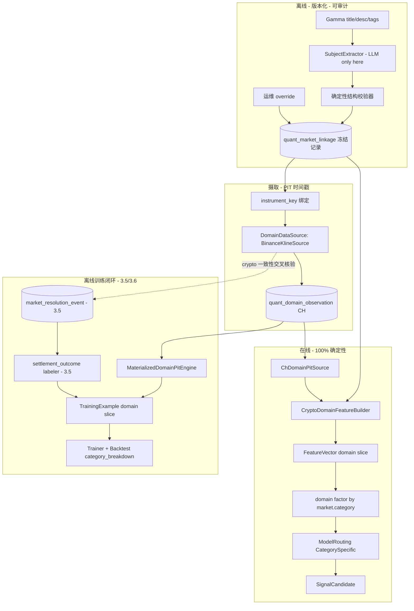
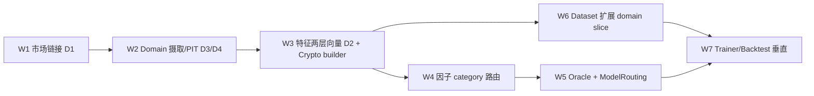

# 03.8 — Vertical Domain Closed-Loop（Crypto 参考垂直）

<!-- quant-pivot-deployment-contract:v1 -->
> **Deployment contract**
> - `fresh_boot_assumption`: 项目尚未正式生产上线，将从全新 `boot` / schema version `1` 部署；仓库和数据库不保存 lifecycle seal 状态。
> - `schema_data_version_impact`: 本文中的历史版本号与递增路径不再具有实施效力；当前实现不迁移测试数据、旧结构或旧版本。
> - `pre_deployment_behavior`: 允许 clean-break、migration squash 与全新基础设施 bootstrap，但任何数据销毁仍需操作者单独授权。
> - `post_deployment_behavior`: 首次部署后使用正常前向 migration、回滚与数据验证；不使用不可逆 production seal 或兼容桥。
> - `rollback_and_data_verification`: 首次部署前通过清空后的 fresh-install 验证；部署后使用备份、前向 migration 与显式回滚。

> **SUPERSEDED by phase-11/11.2.1 + 11.2.2**（破坏式接管，2026-07）。本文档的垂直闭环设计已被
> [`../phase-11/11.2.1-platform-structural-alpha.md`](../phase-11/11.2.1-platform-structural-alpha.md)（平台内
> 结构因子）与 [`../phase-11/11.2.2-crypto-external-vertical.md`](../phase-11/11.2.2-crypto-external-vertical.md)
> （crypto 外部垂直：确定性优先 linkage 取代"LLM 优先"、`ResolutionOracle` + basis 取代"特征源=结算源=Binance"）
> 取代。不做 re-export、不保留旧 seam 命名；新命名以 Phase 11 为准。以下内容仅作历史参考。
>
> 父：[`README.md`](README.md) · 概念规格：[`../03-data-factor-model-pipeline.md`](../03-data-factor-model-pipeline.md) §13/§19 ·
> 技术栈：[`../08-third-party-crates-and-ml-stack.md`](../08-third-party-crates-and-ml-stack.md) ·
> 依赖前序：[`03.2`](03.2-feature-plane.md) / [`03.3`](03.3-factor-plane.md) / [`03.4`](03.4-model-runtime-weighted-scorer.md) /
> [`03.5`](03.5-historical-pit-and-training-dataset.md) / [`03.6`](03.6-trainer-classical-ml-backtest.md)
>
> 闭环定位：**垂直领域完整闭环**——从市场实体解析 → domain 摄取/PIT → 两层特征向量 → category-specific
> 因子/模型路由 → domain slice 训练/回测的全链路。本文档是垂直领域**设计真理（D1–D7）+ 可执行实施契约
> （W1–W7）+ 外部数据源选型**的**唯一权威**（合并自原 `03.x-vertical-domain-design.md`、原 `03.6 §11`、
> 原 `docs/operations/domain-data-sources.md`）。
>
> **3.5/3.6 已交付**——本子phase在既有 PIT/dataset/trainer/backtest 管线上**加性扩展**，**不回推**
> 3.2/3.3/3.5/3.6 的已交付契约。Crypto 为 P0 参考垂直；其余四垂直（Sports/Politics/Weather/Geopolitics）
> 按同一范式加性扩展（§12 延后）。

---

## 0. 现状基线（代码真理，2026-06）

**前序子phase已交付（本子phase仅扩展调用，不改契约）**

| 能力 | 状态 |
|------|------|
| `DomainFamily` + `for_category` + `MarketCategory`(10) + Gamma tag→category | ✅（[`enums/domain.rs`](../../../crates/quant-pivot-models/src/enums/domain.rs)） |
| `DomainFeatureBuilder` trait + `DomainFeatureSkeleton`（占位）+ `EvidenceSourceKind::DomainExternal` | ✅（[`features/value.rs`](../../../crates/quant-pivot-research/src/features/value.rs)） |
| `DomainFactorComputer` trait + 空 `DomainFactorRegistry`（**未接 `FactorEngine`**） | ✅（[`factors/domain.rs`](../../../crates/quant-pivot-research/src/factors/domain.rs)） |
| `ChHistoricalPitSource` + `MaterializedPitEngine` + `PitView::{Live,Historical}` | ✅（3.5） |
| `TrainingDatasetService` 编排（plan→prefetch→materialize→feature/factor/label→leakage→parquet） | ✅（3.5，**定宽 generic `FeatureVector`**，尚无 domain slice） |
| CH `market_resolution_event`（权威键 `winning_token_id`）+ `settlement_outcome` labeler | ✅（3.5） |
| `WeightedFactorTrainer` / `Backtester` / classical adapter / calibration / Admin API | ✅（3.6 generic 主路径） |
| `WeightedFactorRuntime` + verified serving preimage/runtime registry | ✅（3.4，11.9 W2-S clean break） |

**垂直仍空（本子phase全部落地）**

| 能力 | 状态 |
|------|------|
| `DomainFeatureSkeleton`（全 5 垂直 `DomainDataMissing`） | 骨架，待替换 |
| `DomainFactorRegistry`（未接 `FactorEngine`） | 空 |
| `FeatureAvailabilityOracle`（`DomainExternal => false`） | 硬编码 |
| `ModelRouting` / category-specific arm / artifact `category_scope` | 不存在 |
| `MarketLinkage` / `DomainDataSource` / `quant_domain_observation` / `quant_market_linkage` | 不存在 |
| dataset/matrix/parquet/hash 承载 domain slice | 不存在（定宽 generic） |

---

## 1. 目标与闭环定位

- **W1 市场链接**：market → 外部标的（如 Binance BTC/USDT 1m close @ 12:00 ET）的可回放、可审计、版本化链接（security-master 范式，离线 LLM + 确定性校验 + 冻结记录）。
- **W2 Domain 摄取与 PIT**：provider 无关 `DomainDataSource`（首个 concrete = Binance klines）+ CH `quant_domain_observation` 长格式表 + `DomainPitQueryEngine` + 离线 `MaterializedDomainPitEngine`。
- **W3 两层特征向量（D2 破坏式）**：generic slice（定宽，永远存在）+ domain slice（仅该 category 映射的那一个垂直）+ 复合 hash；落地 `CryptoDomainFeatureBuilder`。
- **W4 因子 category 路由**：`DomainFactorRegistry` 接入 `FactorEngine` batch 路径，按 `market.category` 追加 domain 因子。
- **W5 Oracle + ModelRouting**：解硬编码 `FeatureAvailabilityOracle`；落地 `ModelRouting::CategorySpecific` + artifact `category_scope`。
- **W6 Dataset domain slice**：加性扩展 3.5 `TrainingDatasetService` / `build_training_matrix` / `DatasetParquetCodec` / dataset hash 承载 domain 列。
- **W7 垂直训练/回测 + settlement 交叉核验**：分层 validation、`per_category_weights`、Crypto smartcore shadow、`BacktestReport.category_breakdown`、Binance close 与结算事件加性交叉核验。

> 两条已交付闭环（README §2）的**垂直扩展**：在线 `MarketLinkage → DomainDataSource → quant_domain_observation
> → domain slice 特征/因子 → ModelRouting`；离线 domain slice 流入 3.5 dataset → 3.6 trainer/backtest。

---

## 2. 删除清单

- 替换 `DomainFeatureSkeleton`（5×`DomainDataMissing` 妥协）为 category 路由的真实 `DomainFeatureBuilder`（W3）。本子phase落地前不删 skeleton（保持 build 绿色），W3 完成后删除其占位实现。
- 替换 `FeatureAvailabilityOracle` 中 `DomainExternal => false` 硬编码（W5）。
- 其余为净新增（linkage / domain observation / domain factor / ModelRouting）。
- **严禁**：垂直侧另建结算表（必须复用 3.5 `market_resolution_event`，见 D5）。

---

## 3. 设计真理（D1–D7，七条已锁定决策）

### D1 — 市场实体解析：离线 + 版本化 + 内容寻址 + 可审计 + 可覆盖（security-master 范式）

实体解析（market → 外部标的，如 "Bitcoin above $66k on June 4" → `{BTC/USDT, Binance 1m close, 12:00 ET}`）
是和钱最相关、PIT/确定性要求最高的一环。**绝不允许在线/回放热路径调用 LLM**——非确定、不可回放、不可审计。

范式（对齐传统量化的 security master / reference data）：

- LLM 仅在**链接解析时刻**运行（新市场出现或其 Gamma 元数据变更时），产出**冻结的 `MarketLinkage` 记录**。
- 记录内容寻址、版本化、可审计：`resolver_version` + `llm_model_ref` + `prompt_hash` + `content_hash` + `metadata_version`（链接派生自哪个 Gamma 元数据版本）。
- **在线/PIT 路径只读冻结记录，100% 确定性**。
- LLM 抽取后必经**确定性结构校验器**（asset/strike/observation_time/source 可解析并与正则交叉核验），杜绝幻觉污染。Crypto description 高度结构化，校验器可强约束。
- 低 confidence / 结构校验失败 / 未解析 ⇒ `status = Unresolved` ⇒ **fail-closed**。
- 运维可 `Overridden` pin/纠正链接（审计留痕）。

### D2 — 两层特征向量 + 复合 hash（替换"全 5 垂直 Missing"妥协）

当前为保 `feature_hash` 维度恒定，对每个 market 强行 emit 全 5 垂直 `DomainDataMissing`，把"该 category
**结构上不适用**该垂直"与"数据源**缺失**"两种语义混淆——和钱相关下危险（无意义 Missing 污染 hash 与训练矩阵）。

**新设计**：`FeatureVector` 分两层。

- **generic slice**：book / microstructure / time-series / market-metadata。category 无关、定宽、永远存在。
- **domain slice**：仅承载该 market category 对应的那**一个**垂直特征集（由
  [`DomainFamily::for_category`](../../../crates/quant-pivot-models/src/enums/domain.rs) 决定）；
  非 domain category（Finance/Tech/Culture/Economics/Other）domain slice 为**空**（而非 5×Missing）。
- **复合 hash**：`feature_hash = H(generic_feature_hash, domain_family|none, domain_feature_hash,
  generic_schema_version, domain_schema_version)`。在 `(generic_schema_version, domain_family,
  domain_schema_version)` 内布局定序固定 ⇒ hash 确定；Decimal 量化继续防 ULP 漂移。
- **模型输入契约**：generic 模型只消费 generic slice（domain-family 无关）；category-specific 模型消费
  `generic ⊕ 该垂直 domain slice`。"不适用"由 `domain_family` 标签表达，彻底消除 5×Missing。

这是对 [`03.2`](03.2-feature-plane.md) "schema 静态、维度恒定" 的**破坏式修订**（零兼容已授权）。

> **与 3.5 的排序依赖**：D2 在 3.5 之后落地（3.5 先建于**定宽** `FeatureVector`），故 D2 落地（W3/W6）时
> **必须加性扩展** 3.5 的 `build_training_matrix` / `DatasetParquetCodec` / dataset hash 以承载
> category-scoped domain slice 并重算 `dataset_hash`，否则 dataset 无法表达 domain 列。见 §6 W6。

### D3 — provider 无关 `DomainDataSource`，Crypto 参考实现 = Binance klines

Polymarket crypto 市场结算源即 **Binance BTC/USDT 1m close**（见 §7）。**特征源必须对齐结算源**以消除 basis
risk。Binance 市场数据免费、无需 key、1000 根/请求、多年历史。`DomainDataSource` 抽象 provider 无关，
`BinanceKlineSource` 为首个 concrete。

### D4 — 通用 PIT domain 事实存储 + `DomainPitQueryEngine`

新建 ClickHouse 长格式表 `quant_domain_observation`，5 垂直共用存储与 PIT 机理。PIT 查询遵循既有
[`QuantFactReadRepository`](../../../crates/quant-pivot-repository/src/traits/quant/fact_read.rs) 范式：
domain-typed bind、SQL 显式稳定排序、`WHERE event_time <= as_of - knowledge_lag`。

### D5 — settlement 真相源：复用 3.5 的 `market_resolution_event`（不新建结算表）

3.5 已确立 CH 表 `market_resolution_event`（权威键 `winning_token_id`，长 TTL append-only）为
3.5 标签 / 3.6 backtest / `market_at` PIT status 的**唯一**结算真相源。

⇒ 垂直侧**不新建任何结算表**，直接复用。Crypto 仅做**加性一致性交叉核验**：用同一 Binance close@`observation_at`
与结算事件比对，背离超阈值即告警 / 标记 linkage 复核——**绝不**作为独立标签真相。

### D6 — 全程 fail-closed

domain 缺失只走 `KeepMissing` → generic 模型继续；model spec 显式要求 domain ⇒ `RejectCandidate` / 跳过该
market；任何解析 / 数据 / 校验失败绝不伪造默认值。

### D7 — core_impure 分层（对齐 3.5/3.6）

`quant-pivot-research` 仅纯计算 + trait + 内存纯引擎；**所有读 CH/PG、外部 API 摄取、批量预取、编排、持久化
落 `quant-pivot-core` / `quant-pivot-api`**。

| 归属 | 组件 |
|------|------|
| **research**（纯） | `MarketSubject`/`MarketLinkage` 类型、`SubjectExtractor`/`LinkageStore`/`DomainDataSource`/`DomainPitQueryEngine` trait、`CryptoDomainFeatureBuilder`、domain `FactorComputer`、`MaterializedDomainPitEngine` |
| **core/api**（脏活） | `BinanceKlineSource`、`DomainIngestor`、`pit/domain/ch_source`（`ChDomainPitSource`）、LLM provider 适配器、域预取 provider、linkage 解析服务 |

在线 domain 特征/因子走 base deps；离线 domain 物化沿用 3.5 的 `dataframe` always_compile。

---

## 4. 完整闭环数据流



---

## 5. 新模块 / 类型 / 表（带归属）

### 5.1 `research::linkage`（新模块，纯契约 + 类型）

```rust
/// A market's resolved external subject. One arm per vertical.
pub enum MarketSubject {
    Crypto(CryptoSubject),
    // Sports / Politics / Weather / Geopolitics — additive, later phases.
}

/// Crypto market subject parsed from the Gamma title/description.
pub struct CryptoSubject {
    pub asset: CryptoAsset,                 // BTC / ETH / ...
    pub quote: CryptoQuote,                 // USDT / USD / ...
    pub comparator: Comparator,             // Above / Below / Between
    pub strike: Price,
    pub observation_at: DateTime<Utc>,      // resolution observation time (UTC, ET-normalized)
    pub resolution_source: ResolutionSourceBinding, // Binance BTC/USDT 1m close @ observation_at
}

/// Frozen, content-addressed market → external-subject linkage record.
pub struct MarketLinkage {
    pub linkage_id: MarketLinkageId,
    pub market_id: MarketId,
    pub domain_family: DomainFamily,
    pub subject: MarketSubject,
    pub instrument_key: DomainInstrumentKey, // stable key into quant_domain_observation
    pub confidence: Probability,
    pub status: LinkageStatus,               // Resolved / Unresolved / Overridden
    pub resolver_version: ResolverVersion,
    pub llm_model_ref: Option<String>,       // None for deterministic/override path
    pub prompt_hash: ContentHash,
    pub content_hash: ContentHash,           // canonical hash of subject + bindings
    pub metadata_version: MarketMetadataVersion, // Gamma metadata version this linkage derives from
}

pub enum LinkageStatus { Resolved, Unresolved, Overridden }

/// Extracts a structured subject from market metadata. LLM lives *behind* this
/// trait and runs *offline only* (D1). Implementations must not be called on the
/// online/PIT hot path.
pub trait SubjectExtractor: Send + Sync {
    fn resolver_version(&self) -> ResolverVersion;
    async fn extract(&self, ctx: LinkageExtractCtx<'_>) -> QuantResult<ExtractedSubject>;
}

/// Frozen-linkage persistence + PIT lookup. `latest_valid_at` returns the linkage
/// record valid at `as_of` (by metadata_version), never a future revision.
pub trait LinkageStore: Send + Sync {
    async fn upsert(&self, linkage: MarketLinkage) -> QuantResult<MarketLinkageId>;
    async fn latest_valid_at(&self, market_id: &MarketId, as_of: DateTime<Utc>)
        -> QuantResult<Option<MarketLinkage>>;
    async fn set_override(&self, market_id: &MarketId, subject: MarketSubject)
        -> QuantResult<MarketLinkageId>;
}
```

> 分层（D7）：上述均为 research **trait + 纯类型**。LLM provider 适配器（impl `SubjectExtractor`）、
> `LinkageStore` 的 PG 实现、链接解析编排服务归 **core**；确定性结构校验器是 research 纯函数。

**PG** `quant_market_linkage`：versioned ledger（append-only，按 `metadata_version` PIT 取有效版本）。
**结算真相不在此**——复用 3.5 CH `market_resolution_event`。

### 5.2 `research::domain`（摄取 / PIT 契约）

```rust
/// One external observation for a domain instrument at a point in time.
pub struct DomainObservation {
    pub family: DomainFamily,
    pub source_id: DomainSourceId,           // "binance" / "noaa" / ...
    pub instrument_key: DomainInstrumentKey, // "BINANCE:BTCUSDT:1m"
    pub metric: DomainMetric,                // Close / Open / High / Low / Volume / ...
    pub value: Decimal,
    pub observed_at: DateTime<Utc>,          // PIT event_time (candle close time)
    pub publish_time: DateTime<Utc>,         // when the source published it (lag bound)
}

/// Provider-agnostic external domain source (D3). Concrete impls live in core/api.
pub trait DomainDataSource: Send + Sync {
    fn family(&self) -> DomainFamily;
    fn source_id(&self) -> DomainSourceId;
    async fn fetch(&self, req: DomainFetchRequest) -> QuantResult<Vec<DomainObservation>>;
}

/// PIT query over stored domain observations. Mirrors `PointInTimeSnapshotSource` (3.5).
pub trait DomainPitQueryEngine: Send + Sync {
    /// Observations for `key`/`metric` with `event_time <= as_of - knowledge_lag`,
    /// within `lookback`, stably ordered. Never look-ahead.
    async fn observations_at(
        &self,
        key: &DomainInstrumentKey,
        metric: DomainMetric,
        as_of: DateTime<Utc>,
        lookback: Duration,
    ) -> QuantResult<Vec<DomainObservation>>;
}
```

> 分层（D7）：`ChDomainPitSource`（CH 实现）、`BinanceKlineSource`、`DomainIngestor` 归 **core/api**；
> 离线训练循环用 research 纯引擎 **`MaterializedDomainPitEngine`**（从内存预取二分取
> `<= as_of - knowledge_lag` 最新值，零 DB），与 3.5 `MaterializedPitEngine` 同范式，保证在线/离线
> byte-identical。

**CH** `quant_domain_observation`：DDL + read/write repo。读层 `observations_at`（单点 PIT，
`WHERE event_time <= as_of ORDER BY event_time DESC, ingestion_time DESC LIMIT ...`）+
`observations_between`（批量区间预取，供离线 `MaterializedDomainPitEngine` 构造），domain-typed bind、
SQL 显式稳定排序。

### 5.3 真实 Crypto 特征 / 因子（research，纯）

`research::features::domain::crypto::CryptoDomainFeatureBuilder: DomainFeatureBuilder`——消费冻结
`MarketLinkage` + domain PIT 视图，emit 以下特征（present 值带
[`EvidenceSourceKind::DomainExternal`](../../../crates/quant-pivot-research/src/features/value.rs)）：

| feature name | 含义 | 输入 |
|--------------|------|------|
| `domain.crypto.distance_to_strike` | (close − strike)/strike，方向按 comparator | Binance close + subject.strike |
| `domain.crypto.underlying_momentum` | 标的近窗 momentum | Binance close 序列 |
| `domain.crypto.underlying_realized_vol` | 标的近窗 realized vol | Binance close 序列 |
| `domain.crypto.underlying_beta` | 标的相对基准 beta（regime 用） | Binance close + 基准 |
| `domain.crypto.time_to_observation` | now → observation_at | subject.observation_at |
| `domain.crypto.basis_vs_resolution_source` | 特征源 vs 结算源价差（交叉核验） | Binance vs 备选源 |

`research::factors::domain::crypto::*: DomainFactorComputer`——如 `domain_crypto_beta_regime`、
`domain_crypto_strike_pressure`，注册进 `DomainFactorRegistry`。复用 `FactorComputer::compute_raw`
（raw/normalize 分离）；缺失 domain 输入 ⇒ `RawFactor{ raw_value: None, confidence: 0 }`，绝非静默 0。

### 5.4 存储 / 配置 / API 汇总

- **CH** `quant_domain_observation`（W2）。
- **PG** `quant_market_linkage`（W1）。
- **配置**：runtime `domain` 段（per-family enable / knowledge_lag / refresh 策略）；deploy `domain_sources`
  段（endpoint / credential；Binance 市场数据无需 key）。
- **API**：`quant-pivot-api` 新增 provider 无关 Binance klines client。

---

## 6. 工作流 W1–W7（可执行实施契约）

### 6.0 推荐顺序



| 工作流 | 内容 | 主要 crate | 可并行 |
|--------|------|-----------|--------|
| **W1** | 离线冻结 `MarketLinkage`（security-master） | models / repository / core | — |
| **W2** | Binance 摄取 + `quant_domain_observation` + PIT 读层 | storage / repository / core / api | 与 W1 部分并行 |
| **W3** | D2 两层向量 + `CryptoDomainFeatureBuilder` | research / core | 依赖 W1+W2 |
| **W4** | `DomainFactorRegistry` 接入 `FactorEngine` | research | 依赖 W3 |
| **W5** | Oracle 解硬编码 + `ModelRouting` | research / core | 依赖 W1+W3 |
| **W6** | 扩展 3.5 dataset 产物承载 domain slice | research / core | 依赖 W3 |
| **W7** | 垂直训练/回测 + settlement 交叉核验 | research / core | 依赖 W4+W6 + 3.6 trainer/backtest |

### 6.1 W1 — 市场链接（D1：离线 LLM + 冻结记录）

**目标**：market → 外部标的（如 Binance BTC/USDT 1m close @ 12:00 ET）的可回放、可审计链接。

**research 纯契约**：见 §5.1（`MarketSubject` / `CryptoSubject` / `MarketLinkage` / `SubjectExtractor` / `LinkageStore`）。

**core 脏活**：`LinkageResolverService`（Gamma 元数据变更触发 → LLM `SubjectExtractor` → 确定性结构校验器
→ PG upsert）；在线/PIT **只读** `LinkageStore::latest_valid_at`，**零 LLM**。低 confidence / 校验失败 ⇒
`LinkageStatus::Unresolved` ⇒ fail-closed。

**PG** `quant_market_linkage`：versioned ledger（append-only，按 `metadata_version` PIT 取有效版本）。

**验收**：`linkage_resolved_offline_is_deterministic_on_replay` ·
`linkage_low_confidence_or_invalid_is_unresolved_fail_closed` ·
`linkage_pit_uses_metadata_version_not_future_revision`。

### 6.2 W2 — Domain 摄取与 PIT 存储（D3/D4/D7）

**目标**：Crypto 特征源 = 结算源 = **Binance BTC/USDT klines**（§7.2）。

**research trait**：见 §5.2（`DomainObservation` / `DomainDataSource` / `DomainPitQueryEngine`）。

**core/api**：`BinanceKlineSource`（`quant-pivot-api` klines client）、`DomainIngestor`（按
`MarketLinkage.instrument_key` 拉取 → CH 写入）、`ChDomainPitSource`（impl `DomainPitQueryEngine`）。

**CH** `quant_domain_observation`（长格式，5 垂直共用）+ 读层 `observations_at` / `observations_between`
（对齐 3.5 `QuantFactReadRepository` 范式：domain-typed bind、显式稳定排序、`event_time <= as_of - knowledge_lag`）。

**research 纯引擎**：`MaterializedDomainPitEngine`（镜像 3.5 `MaterializedPitEngine`，离线零 DB、在线/离线 byte-identical）。

**配置**：runtime `domain` 段；deploy `domain_sources`（Binance 无需 key）。

**验收**：`domain_observation_pit_excludes_after_as_of_minus_delay` ·
`materialized_domain_pit_matches_ch_source_byte_identical`。

### 6.3 W3 — 特征平面破坏式升级（D2）+ Crypto 真实 builder

**目标**：取代 `DomainFeatureSkeleton` 的 5×Missing 妥协；落地两层向量 + 复合 hash。

**D2 契约**（破坏式，零兼容，见 §3 D2）：generic slice（定宽）+ domain slice（仅映射 category 的那一个垂直，
非 domain category slice 为空）+ 复合 hash。

**Crypto 特征**（`CryptoDomainFeatureBuilder`，present 值带 `EvidenceSourceKind::DomainExternal`）：见 §5.3 表。

**接线**：`ConfiguredFeatureBuilder` 用 category 路由 builder 替换 skeleton；`FeaturePipelineService`（core）
在线路径注入冻结 linkage + domain PIT。

**验收**：`feature_vector_domain_slice_only_for_mapped_category` ·
`feature_hash_composite_stable_and_distinguishes_domain_family` ·
`crypto_domain_feature_present_with_domain_external_evidence` ·
`domain_feature_missing_emits_domain_missing_not_default`（Unresolved linkage 路径）。

### 6.4 W4 — 因子平面 category 路由

**目标**：`DomainFactorRegistry` 接入 `FactorEngine` batch 路径。

- 在 generic 9 因子之后，按向量内 `FeatureValue::Category` 追加
  `DomainFactorRegistry::for_category(category)` 的因子。
- **不改** `FactorComputer::compute_raw(&FeatureVector)` 签名（category 已在向量内）。
- Crypto 首批：`domain_crypto_strike_pressure`、`domain_crypto_beta_regime`。
- 缺失 ⇒ `raw_value: None` / `confidence: 0`；可选 domain 因子不贡献，必需性由冻结定义决定。

**验收**：`domain_factor_routes_by_market_category` · `domain_factor_missing_zero_weight`。

### 6.5 W5 — Oracle + ModelRouting

**Oracle**：替换 `FeatureAvailabilityOracle` 中 `DomainExternal => false` 为：category→family 有已接源
∧ 存在 `Resolved` linkage ∧ 源在 `as_of` 有 PIT 数据。

**ModelRouting**（research + core `ModelRunner`）：

```rust
pub enum ModelRouting {
    /// Generic weighted scorer over the generic slice — all categories.
    GenericWeighted,
    /// Category-specific artifact consuming generic ⊕ that vertical's domain slice.
    CategorySpecific { category: MarketCategory, artifact: ModelVersionId },
}
```

- `WeightedFactorModelArtifact` 增 `category_scope: Option<MarketCategory>`。
- 无 category-specific artifact ⇒ 回落 `GenericWeighted`；model spec 显式 require domain ⇒
  Oracle fail-closed 排除 market。
- **classical shadow**：`ClassicalModelArtifact` + `ClassicalKind`，feature 向量含 domain 列时启用对应 preprocessing。

**推理降级（fail-closed）**：

| 条件 | 行为 |
|------|------|
| domain feature `DomainDataMissing` + generic model | 仅当 domain 因子在冻结契约中为可选才继续；该因子显式 missing 且不贡献 |
| model spec 要求 domain feature（`required_features` 含 `domain.*`） | Oracle 判不可用 ⇒ selection `ModelFeatureUnavailable` 排除该 market |
| category-specific artifact 缺失 | 回落 `GenericWeighted` |
| classical 缺 domain 列 | preprocessing impute 仅当 artifact 声明；否则 fail-closed |

**验收**：`availability_oracle_true_only_with_source_and_resolved_linkage` ·
`category_specific_model_routes_then_falls_back_to_generic`。

### 6.6 W6 — 扩展 3.5 训练 dataset 承载 domain slice（非回推 3.5）

**原则**：3.5 的 `TrainingDatasetService` / `MaterializedPitEngine` / labeler **保持契约不动**；
本子phase**加性扩展**调用点与产物格式。

**扩展点**（均在 core / research，不改 3.5 文档契约）：

1. **`historical_window_provider`**（core）：批量预取 domain observations + 冻结 `MarketLinkage`；
   构造 `MaterializedDomainPitEngine` 并入 materialized bundle。
2. **`TrainingDatasetService`**（core）：逐样本经 `CryptoDomainFeatureBuilder` 注入 domain slice；
   domain 因子经已接线的 `FactorEngine` 一并写入 `TrainingExample`。
3. **`build_training_matrix`**（research）：`FeatureMatrixSpec` 支持 generic 列 + 可选 domain 列
   （category-specific 训练显式声明 domain 列；generic-only 训练忽略 domain 列）。
4. **`DatasetParquetCodec`**（research）：Parquet schema 增 domain 列（与 generic 列分区清晰）。
5. **dataset hash**（research）：canonical 纳入 `domain_family` + domain slice hash；domain 列变更必改 `dataset_hash`。

**结算**：复用 3.5 `market_resolution_event` + `settlement_outcome` labeler；**垂直不新建结算表**。

**验收**：`dataset_hash_changes_when_domain_slice_added` ·
`dataset_builder_domain_slice_no_future_leakage`（domain 证据 `observed_at <= as_of - knowledge_lag`）。

### 6.7 W7 — 垂直训练 / 回测 + settlement 交叉核验

与 3.6 §1–§3 trainer/backtest 复用同一交付，垂直能力作为输入 enrichments：

- **`WeightedFactorTrainer`**：dataset 按 `MarketCategory` / `DomainFamily` 分层 validation；
  artifact 可存 `per_category_weights`（Crypto 首批）。
- **smartcore classical shadow**：Crypto tabular（distance_to_strike + momentum + vol）→ RF/ExtraTrees。
- **`BacktestReport.category_breakdown`**：按 `DomainFamily` 聚合 rank_ic / hit_rate（字段在 3.6 已有，填充各行）。
- **Crypto settlement 交叉核验**（加性）：Binance close@`observation_at` 重算 `settled_yes` vs
  `market_resolution_event.winning_token_id`；背离 ⇒ 告警 / 标记 linkage 复核——**不改变 label 真相**。

**验收**：`vertical_backtest_category_breakdown` · `crypto_settlement_cross_check_flags_divergence` ·
`backtest_uses_pit_source_not_live_bookstore`（含 domain PIT 路径）。

---

## 7. 外部数据源选型（选型真理）

> 定位：垂直领域外部数据源的**选型真理**。为每个 `DomainFamily` 列出候选源，按"和钱相关"的硬标准评估：
> PIT/历史可得性、限速、license、**是否对齐 Polymarket 结算源**。本节是 §5.2 `DomainDataSource` 实现的
> 选源依据；不引入代码，只锁定选型。需 license/付费/凭证的源，凭证经 deploy `domain_sources` 段下发，**不入代码库**。

### 7.1 选源硬标准（按重要性排序）

| # | 标准 | 说明 | 不满足的后果 |
|---|------|------|-------------|
| 1 | **对齐结算源** | 特征/标签源必须与 Polymarket 该市场 `resolution_source` 同源同口径（同交易所、同交易对、同 K 线粒度、同时区） | basis risk：回测好、实盘亏；训练 label 与 live 特征语义分叉 |
| 2 | **PIT 可回放** | 能按历史 `as_of` 取"不晚于该时刻"的观测，且每条带可信 `publish_time` | look-ahead 泄漏，回测虚高 |
| 3 | **历史深度** | 覆盖训练窗口（≥ 1–2 年） | 样本不足，无法训练 category-specific |
| 4 | **License/ToS** | 商用许可、数据再分发条款清晰 | 法务风险，不可生产 |
| 5 | **限速/成本** | 免费层或可接受成本下满足摄取吞吐 | 摄取断流，domain 特征退化为 `DomainDataMissing` |
| 6 | **稳定性** | API 活跃、schema 稳定、有官方文档 | 维护成本高，易腐 |

> **首选原则**：优先选**与结算源同源**的数据源。若结算源本身不开放历史 API，则选与之高度一致的镜像源，
> 并在 `DomainDataSource` 内做**一致性交叉核验**（D5）。

### 7.2 Crypto（参考垂直，优先落地）

**结算结构（地面真理）**：Polymarket crypto 市场是二元合约，标题/描述高度结构化，**结算源明示在 description 内**。典型：

> "Will the price of Bitcoin be above $66,000 on June 4?" —
> *This market will resolve to "Yes" if the **Binance 1 minute candle for BTC/USDT** at
> **12:00 ET (noon)** has a final **"Close"** price higher than the strike. Resolution source is Binance BTC/USDT.*

⇒ 结算键 = `{asset=BTC, quote=USDT, venue=Binance, candle=1m, field=close, observation_at=12:00 ET, comparator=Above, strike=$66,000}`。
这正是 §5.1 `CryptoSubject` + `ResolutionSourceBinding` 的来源。

| 源 | 对齐结算 | PIT/历史 | 限速（免费） | API key | License | 结论 |
|----|---------|----------|-------------|---------|---------|------|
| **Binance klines** (`/api/v3/klines`) | ✅ **就是结算源**（BTC/USDT 1m close） | ✅ 多年历史，1000 根/请求，含 open_time/close_time | weight 制，市场数据 ~1200/min，公开端点无需 key | 公开市场数据**无需 key** | 市场数据可商用（遵守 ToS） | **首选 concrete `BinanceKlineSource`** |
| Coinbase candles (`/products/{id}/candles`) | ⚠️ 不同交易对/价格 | ✅ 但 300 根/请求需分页 | 公开 ~10 req/s | 无需 key | — | 备选/交叉核验 |
| Pyth Benchmarks (`/v1/updates/price/{ts}`) | ⚠️ 聚合预言机价，非 Binance | ✅ 历史可查、签名可验证 | 同 Hermes 限速 | **2026-07-31 起需 `PYTH_API_KEY`** | 需查 ToS | 备选；适合做跨源校验 |

**决策**：特征源 = 结算源 = Binance BTC/USDT klines（粒度对齐市场 description 的 candle），消除 basis risk。
`time_to_observation` 用市场 `observation_at`；`distance_to_strike` / `underlying_momentum` /
`underlying_realized_vol` 全部基于 Binance close 序列。**交叉核验**：`basis_vs_resolution_source` 特征 +
结算时刻用 Coinbase/Pyth 比对 Binance close，背离超阈值 ⇒ 告警并标记 linkage 复核（不改变 label 真相，仅风控信号）。

### 7.3 Sports

| 源 | 对齐结算 | PIT/历史 | 限速 | License/成本 | 结论 |
|----|---------|----------|------|-------------|------|
| **API-Sports** (api-sports.io) | ⚠️ 赛果通常一致；赔率源不一定同庄 | ✅ 15+ 年历史、2000+ 赛事；赛果 + pre-match/live odds | 免费 100 req/day/API | 免费层永久，付费 $10/mo 起 | **首选**（赛果 + 赔率，性价比高） |
| The-Odds-API (the-odds-api.com) | ⚠️ 多庄聚合赔率 | ✅ 历史快照 2020-06 起（2022-09 后 5min 间隔）；**历史仅付费** | 免费 500 credits/mo（历史×10 倍消耗） | 历史付费 $30/mo 起 | 备选（赔率漂移信号强，但历史要钱） |

**决策**：Sports 结算 = 赛果（Polymarket 用官方比分）。特征侧用 **API-Sports 赛果 + 赔率**（pre-match
momentum / 赔率漂移）。赔率源与 Polymarket 庄口径不同属可接受 noise（赔率是特征不是 label）。PIT：以 odds
snapshot 的 `publish_time` 截断。Sports 实体解析最复杂（队名/赛事/日期消歧），强依赖 D1 的 LLM 离线链接 + curated 兜底。

### 7.4 Politics

| 源 | 对齐结算 | PIT/历史 | 限速/成本 | License | 结论 |
|----|---------|----------|----------|---------|------|
| FiveThirtyEight poll 数据（历史 CSV/归档） | ⚠️ 民调≠结算 | ✅ 历史归档可得；时效性弱 | 静态文件 | 各源不一 | poll momentum 特征源 |
| 官方选举结果（AP/官方公报） | ✅ 结算源 | 结算后才有 | — | — | settlement label 校验 |
| 聚合民调 API（第三方） | ⚠️ | 视源 | 视源 | 视源 | 备选 |

**决策**：Politics 结算 = 官方选举结果。特征侧用 **poll 聚合的 momentum / shift + time-to-resolution**
（poll 是特征不是 label）。PIT：以民调发布日截断（民调发布有天级滞后，`knowledge_lag` 须足够大）。

### 7.5 Weather

| 源 | 对齐结算 | PIT/历史 | 限速/成本 | License | 结论 |
|----|---------|----------|----------|---------|------|
| **NOAA / NWS API** | ✅（美国气象市场多以 NOAA 站点为结算源） | ✅ 观测 + 预报历史 | 免费、无需 key（合理使用） | 美国政府公共数据 | **首选**（若结算源是 NOAA） |
| **Open-Meteo** | ⚠️ 模型聚合，非官方站点 | ✅ 历史预报 + 历史观测 archive | 免费（商用需查） | 视用途 | 备选/预报修正特征 |

**决策**：先确认每个 weather 市场 description 的结算站点/源。结算源是 NOAA ⇒ 用 NOAA 观测做 label 校验、
NOAA/Open-Meteo 预报做 `forecast_revision` 特征。PIT：按预报 issue time 截断。

### 7.6 Geopolitics

| 源 | 对齐结算 | PIT/历史 | 限速/成本 | License | 结论 |
|----|---------|----------|----------|---------|------|
| **GDELT** (gdeltproject.org) | ⚠️ 新闻事件流，非结算 | ✅ 15min 更新、长历史归档 | 免费 | 开放（注明出处） | **首选** news shock 特征源 |
| 官方公告/裁决（事件特定） | ✅ 结算源 | 事件后才有 | — | — | settlement label |

**决策**：Geopolitics 结算高度事件特定（官方公告/UMA 裁决）。特征侧用 **GDELT 新闻强度/语调的 shock-decay**
（GDELT 是特征不是 label）。news shock 需 NLP/embedding（ONNX 路径，Phase 06+）；本期可先用 GDELT 数值指标
（事件计数/语调）做非文本特征。PIT：按文章 `publish_time` 截断。

### 7.7 跨垂直汇总

| 垂直 | 特征源（首选） | 结算/label 源 | 特征源是否=结算源 | 历史/PIT | 免费 | 实体解析难度 | 落地优先级 |
|------|---------------|--------------|------------------|----------|------|-------------|-----------|
| **Crypto** | Binance klines | Binance close（同） | ✅ **是** | ✅ 多年 | ✅ | 低（结构化 desc） | **P0 参考垂直** |
| Sports | API-Sports（赛果+赔率） | 官方比分 | ❌（赔率源异） | ✅ 15y | 免费层有限 | 高（队名/赛事消歧） | P2 |
| Politics | poll 聚合 | 官方选举结果 | ❌ | ✅ | 视源 | 中 | P3 |
| Weather | NOAA/Open-Meteo | NOAA 站点 | ⚠️ 视市场 | ✅ | ✅ | 中 | P3 |
| Geopolitics | GDELT | 官方/UMA 裁决 | ❌ | ✅ | ✅ | 高（需 NLP） | P4（Phase 06+ NLP） |

**关键结论**：

1. **只有 Crypto 做到特征源 = 结算源**（Binance），因此 basis risk 最低、PIT 最干净、最适合作参考垂直。
2. 其余垂直的"特征"与"label"必然异源——这是设计常态，**特征是预测信号、label 必须来自结算真相**
   （复用 3.5 `market_resolution_event`，D5）。
3. **统一 `DomainDataSource` 抽象**（§5.2）让上述各源以 provider 无关方式接入；首个 concrete = `BinanceKlineSource`。

---

## 8. deploy-config key 与 runtime-config v3 path

- **runtime `domain` 段**：per-`DomainFamily` enable / `knowledge_lag_secs` / refresh 策略 / `cross_check` 阈值。
- **deploy `domain_sources` 段**：endpoint / credential（Binance 市场数据无需 key；The-Odds-API 历史、
  Pyth 2026-07-31 后、部分商用 weather 需凭证，经此段下发，不入代码库）。
- **LLM provider**（W1）：provider 无关接口，凭证经 deploy 段下发；仅离线 `LinkageResolverService` 使用。

---

## 9. 第三方 crate

> 完整矩阵见 [`../08-third-party-crates-and-ml-stack.md`](../08-third-party-crates-and-ml-stack.md)。

| Crate | 角色 | Vertical 场景 | 链接策略 |
|-------|------|--------------|---------|
| `reqwest`（已有） | Binance klines client | Crypto 摄取（core/api） | base |
| LLM SDK（provider 无关） | `SubjectExtractor` 离线解析 | 全 vertical 实体解析 | core，离线 only |
| `smartcore` | classical shadow | Crypto RF regime | `ml-classical` only（3.6 已引入） |
| `argmin` | weight optimize | `per_category_weights` | `optimize` only（3.6 已引入） |
| `polars` | 离线 domain materialization | domain 大表 join | `dataframe`（3.5 always_compile） |
| `ort` | Phase 06+ | Geopolitics/Politics text ONNX | `onnx-infer`，不进 Phase 3 |

---

## 10. 验收测试（全表）

| 工作流 | 测试 |
|--------|------|
| W1 | `linkage_resolved_offline_is_deterministic_on_replay` · `linkage_low_confidence_or_invalid_is_unresolved_fail_closed` · `linkage_pit_uses_metadata_version_not_future_revision` |
| W2 | `domain_observation_pit_excludes_after_as_of_minus_delay` · `materialized_domain_pit_matches_ch_source_byte_identical` |
| W3 | `feature_vector_domain_slice_only_for_mapped_category` · `feature_hash_composite_stable_and_distinguishes_domain_family` · `crypto_domain_feature_present_with_domain_external_evidence` · `domain_feature_missing_emits_domain_missing_not_default` |
| W4 | `domain_factor_routes_by_market_category` · `domain_factor_missing_zero_weight` |
| W5 | `availability_oracle_true_only_with_source_and_resolved_linkage` · `category_specific_model_routes_then_falls_back_to_generic` |
| W6 | `dataset_hash_changes_when_domain_slice_added` · `dataset_builder_domain_slice_no_future_leakage` |
| W7 | `vertical_backtest_category_breakdown` · `crypto_settlement_cross_check_flags_divergence` · `backtest_uses_pit_source_not_live_bookstore`（含 domain PIT 路径） |
| 持久化 | `quant_market_linkage_migration_and_crud` · `quant_domain_observation_read_pit` |

---

## 11. Blocker

- 在线/PIT 热路径调用 LLM（破坏确定性/可回放）⇒ 失败。
- domain 特征源与该市场结算源口径不一致而未声明 basis（crypto 尤其）⇒ 失败。
- domain 缺失静默填 0 / 伪造默认值 ⇒ 失败。
- 垂直侧另建结算表而非复用 3.5 `market_resolution_event` ⇒ 失败。
- D2 落地后 dataset 产物（matrix/parquet/hash）未承载 domain slice 而静默丢列 ⇒ 失败。
- 回测 / 训练 dataset 构建触 live `BookStore` 或 live domain API（须 PIT/materialized）⇒ 失败。
- 任一 domain concrete provider/LLM/smartcore 类型泄漏到业务层 `pub` 契约 ⇒ 失败。

---

## 12. 延后 / 缺口

| 能力 | 说明 |
|------|------|
| Sports/Politics/Weather/Geopolitics 真实外部源 | 按 §7 加性扩展 W1–W4（Crypto 范式） |
| Geopolitics/Politics NLP embedding | Phase 06+ ONNX（3.4 factory 预留 arm） |
| LLM provider 具体选型 | 接口先行（W1），provider 可插拔 |
| domain category-specific ensemble / regime-switching | 后续；本期单一全局 classical 候选 + Crypto per-category 权重 |

---

## 13. 变更记录

| 日期 | 变更 |
|------|------|
| 2025-06 | 初版：03.2 骨架落地 + Phase 3 垂直增强闭环设计；强类型 `EvidenceSourceKind::DomainExternal` |
| 2025-06 | 03.2 hardening：domain category 路由延后；`market.category` 落地；domain missing 改 `KeepMissing` |
| 2025-06 | 3.4 落地后：`required_features` 全链路编排 → Phase 04；category-specific model / ONNX → defer |
| 2026-06 | 3.5 已交付后排期调整：实施切分（W1–W7）原排入 3.6 §11 |
| 2026-06 | **垂直领域提升为正式子phase 3.8**：合并原 `03.x-vertical-domain-design.md`（D1–D7）、原 `03.6 §11`（W1–W7）、原 `docs/operations/domain-data-sources.md`（数据源选型）为单一权威文档；3.6 纯化为 generic trainer/classical/backtest |
