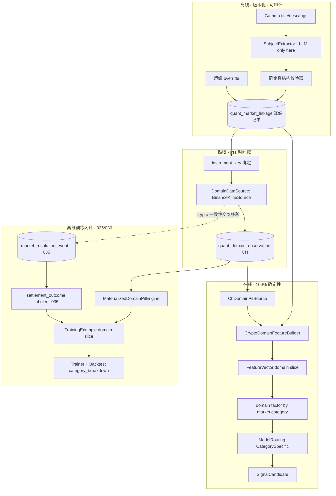

# 03.x — Vertical Domain Closed-Loop Design（Crypto 参考垂直）

> 父：[`README.md`](README.md) · 数据源调研：[`domain-data-sources.md`](../../operations/domain-data-sources.md) ·
> 特征层：[`03.2-feature-plane.md`](03.2-feature-plane.md) · 因子层：[`03.3-factor-plane.md`](03.3-factor-plane.md) ·
> 模型层：[`03.4-model-runtime-weighted-scorer.md`](03.4-model-runtime-weighted-scorer.md) ·
> 历史/数据集：[`03.5-historical-pit-and-training-dataset.md`](03.5-historical-pit-and-training-dataset.md) ·
> 训练/回测：[`03.6-trainer-classical-ml-backtest.md`](03.6-trainer-classical-ml-backtest.md) ·
> 技术栈：[`../08-third-party-crates-and-ml-stack.md`](../08-third-party-crates-and-ml-stack.md)
>
> 闭环定位：**垂直领域（Sports / Politics / Crypto / Weather / Geopolitics）设计真理（D1–D7）**。
> **可执行实施契约**（工作流 W1–W7、模块树、验收）见
> [`03.6-trainer-classical-ml-backtest.md`](03.6-trainer-classical-ml-backtest.md) §11——3.5 已交付后，
> 垂直完整闭环**不回推** 3.2/3.3/3.5，统一在 3.6 落地。

---

## 0. 现状基线（代码真理，2026-06）

| 层 | 已有 | 缺口 |
|----|------|------|
| Taxonomy | [`DomainFamily`](../../../crates/quant-pivot-models/src/enums/domain.rs) + `for_category` + `MarketCategory`(10) + Gamma tag→category | — |
| Feature | `DomainFeatureBuilder` trait + `DomainFeatureSkeleton`（全 5 垂直 `DomainDataMissing`）+ 5 占位 spec | 真实 builder、实体解析、外部源、两层向量 |
| Factor | `DomainFactorComputer` trait + 空 `DomainFactorRegistry`（**未接 `FactorEngine`**） | 真实 computer、引擎接线 |
| Model | `WeightedFactorRuntime`（generic） | `ModelRouting` / category-specific arm |
| Train | `Labeler`/`Trainer`/`Backtester` trait（035/036 落地中） | settlement label 链、垂直 breakdown |
| Availability | `FeatureAvailabilityOracle`（`DomainExternal => false` 硬编码） | 真实可用性判定 |
| Storage | — | domain 外部事实表、市场链接表 |

> 与 [`03.5`](03.5-historical-pit-and-training-dataset.md) 计划已对齐：035 提供历史 PIT 读层、
> `MaterializedPitEngine` 范式、**结算真相源 CH 表 `market_resolution_event`（权威键 `winning_token_id`）**、
> `settlement_outcome` labeler、core_impure 分层、`dataframe` always_compile。本设计**复用**这些产物，
> 不重复建设。

---

## 1. 设计原则（七条已锁定决策）

### D1 — 市场实体解析：离线 + 版本化 + 内容寻址 + 可审计 + 可覆盖（security-master 范式）

实体解析（market → 外部标的，如 "Bitcoin above $66k on June 4" → `{BTC/USDT, Binance 1m close, 12:00 ET}`）
是和钱最相关、PIT/确定性要求最高的一环。**绝不允许在线/回放热路径调用 LLM**——非确定、不可回放、不可审计。

范式（对齐传统量化的 security master / reference data）：

- LLM 仅在**链接解析时刻**运行（新市场出现或其 Gamma 元数据变更时），产出**冻结的 `MarketLinkage` 记录**。
- 记录内容寻址、版本化、可审计：`resolver_version` + `llm_model_ref` + `prompt_hash` + `content_hash` +
  `metadata_version`（链接派生自哪个 Gamma 元数据版本）。
- **在线/PIT 路径只读冻结记录，100% 确定性**。
- LLM 抽取后必经**确定性结构校验器**（asset/strike/observation_time/source 可解析并与正则交叉核验），
  杜绝幻觉污染。Crypto description 高度结构化，校验器可强约束。
- 低 confidence / 结构校验失败 / 未解析 ⇒ `status = Unresolved` ⇒ **fail-closed**。
- 运维可 `Overridden` pin/纠正链接（审计留痕）。

### D2 — 两层特征向量 + 复合 hash（替换"全 5 垂直 Missing"妥协）

当前为保 `feature_hash` 维度恒定，对每个 market 强行 emit 全 5 垂直 `DomainDataMissing`，把"该 category
**结构上不适用**该垂直"与"数据源**缺失**"两种语义混淆——和钱相关下危险（无意义 Missing 污染 hash 与训练矩阵）。

**新设计**：`FeatureVector` 分两层。

- **generic slice**：book / microstructure / time-series / market-metadata。category 无关、定宽、永远存在。
- **domain slice**：仅承载该 market category 对应的那**一个**垂直特征集（由
  [`DomainFamily::for_category`](../../../crates/quant-pivot-models/src/enums/domain.rs) 决定）；
  非 domain category（Finance/Tech/Culture/Economics/Other）domain slice 为**空**（而非 5×Missing）。
- **复合 hash**：`feature_hash = H(generic_feature_hash, domain_family|none, domain_feature_hash,
  generic_schema_version, domain_schema_version)`。在 `(generic_schema_version, domain_family,
  domain_schema_version)` 内布局定序固定 ⇒ hash 确定；Decimal 量化继续防 ULP 漂移。
- **模型输入契约**：generic 模型只消费 generic slice（domain-family 无关）；category-specific 模型消费
  `generic ⊕ 该垂直 domain slice`。"不适用"由 `domain_family` 标签表达，彻底消除 5×Missing。

这是对 [`03.2`](03.2-feature-plane.md) "schema 静态、维度恒定" 的**破坏式修订**（零兼容已授权）。

> **与 035 的排序依赖**：D2 在 035 之后落地（035 先建于**定宽** `FeatureVector`），故 D2 落地时**必须回改
> 035 的 `build_training_matrix` / `DatasetParquetCodec` / `ResearchHasher::dataset`** 以承载
> category-scoped domain slice 并重算 `dataset_hash`，否则 dataset 无法表达 domain 列。见 §8。

### D3 — provider 无关 `DomainDataSource`，Crypto 参考实现 = Binance klines

Polymarket crypto 市场结算源即 **Binance BTC/USDT 1m close**（见 [domain-data-sources](../../operations/domain-data-sources.md) §2）。
**特征源必须对齐结算源**以消除 basis risk。Binance 市场数据免费、无需 key、1000 根/请求、多年历史。
`DomainDataSource` 抽象 provider 无关，`BinanceKlineSource` 为首个 concrete。

### D4 — 通用 PIT domain 事实存储 + `DomainPitQueryEngine`

新建 ClickHouse 长格式表 `quant_domain_observation`，5 垂直共用存储与 PIT 机理。PIT 查询遵循既有
[`QuantFactReadRepository`](../../../crates/quant-pivot-repository/src/traits/quant/fact_read.rs) 范式：
domain-typed bind、SQL 显式稳定排序、`WHERE event_time <= as_of - source_delay`。

### D5 — settlement 真相源：复用 035 的 `market_resolution_event`（不新建结算表）

035 已确立 CH 表 `market_resolution_event`（权威键 `winning_token_id`，长 TTL append-only）为
3.5 标签 / 3.6 backtest / `market_at` PIT status 的**唯一**结算真相源，并删除孤儿 PG `resolution_event`。
`settlement_outcome` labeler 由 035 落地（`settled_yes = winning_token_id == yes_token_id`）。

⇒ 垂直侧**不新建任何结算表**，直接复用。Crypto 仅做**加性一致性交叉核验**：用同一 Binance close@`observation_at`
与结算事件比对，背离超阈值即告警 / 标记 linkage 复核——**绝不**作为独立标签真相。

### D6 — 全程 fail-closed

domain 缺失只走 `KeepMissing` → generic 模型继续；model spec 显式要求 domain ⇒ `RejectCandidate` / 跳过该
market；任何解析 / 数据 / 校验失败绝不伪造默认值。

### D7 — core_impure 分层（对齐 035）

`quant-pivot-research` 仅纯计算 + trait + 内存纯引擎；**所有读 CH/PG、外部 API 摄取、批量预取、编排、持久化
落 `quant-pivot-core` / `quant-pivot-api`**。

| 归属 | 组件 |
|------|------|
| **research**（纯） | `MarketSubject`/`MarketLinkage` 类型、`SubjectExtractor`/`LinkageStore`/`DomainDataSource`/`DomainPitQueryEngine` trait、`CryptoDomainFeatureBuilder`、domain `FactorComputer`、`MaterializedDomainPitEngine` |
| **core/api**（脏活） | `BinanceKlineSource`、`DomainIngestor`、`ChDomainPitSource`、LLM provider 适配器、域预取 provider、linkage 解析服务 |

在线 domain 特征/因子走 base deps；离线 domain 物化沿用 035 的 `dataframe` always_compile。

---

## 2. 完整闭环数据流



---

## 3. 新模块 / 类型 / 表（带归属）

### 3.1 `research::linkage`（新模块，纯契约 + 类型）

```rust
/// A market's resolved external subject. One arm per vertical.
pub enum MarketSubject {
    Crypto(CryptoSubject),
    // Sports / Politics / Weather / Geopolitics — additive, later phases.
}

/// Crypto market subject parsed from the Gamma title/description.
pub struct CryptoSubject {
    pub asset: CryptoAsset,                 // BTC / ETH / ...
    pub quote: CryptoQuote,                 // USDT / USD / ...
    pub comparator: Comparator,             // Above / Below / Between
    pub strike: Price,
    pub observation_at: DateTime<Utc>,      // resolution observation time (UTC, ET-normalized)
    pub resolution_source: ResolutionSourceBinding, // Binance BTC/USDT 1m close @ observation_at
}

/// Frozen, content-addressed market → external-subject linkage record.
pub struct MarketLinkage {
    pub linkage_id: MarketLinkageId,
    pub market_id: MarketId,
    pub domain_family: DomainFamily,
    pub subject: MarketSubject,
    pub instrument_key: DomainInstrumentKey, // stable key into quant_domain_observation
    pub confidence: Probability,
    pub status: LinkageStatus,               // Resolved / Unresolved / Overridden
    pub resolver_version: ResolverVersion,
    pub llm_model_ref: Option<String>,       // None for deterministic/override path
    pub prompt_hash: ContentHash,
    pub content_hash: ContentHash,           // canonical hash of subject + bindings
    pub metadata_version: MarketMetadataVersion, // Gamma metadata version this linkage derives from
}

pub enum LinkageStatus { Resolved, Unresolved, Overridden }

/// Extracts a structured subject from market metadata. LLM lives *behind* this
/// trait and runs *offline only* (D1). Implementations must not be called on the
/// online/PIT hot path.
pub trait SubjectExtractor: Send + Sync {
    fn resolver_version(&self) -> ResolverVersion;
    async fn extract(&self, ctx: LinkageExtractCtx<'_>) -> QuantResult<ExtractedSubject>;
}

/// Frozen-linkage persistence + PIT lookup. `latest_valid_at` returns the linkage
/// record valid at `as_of` (by metadata_version), never a future revision.
pub trait LinkageStore: Send + Sync {
    async fn upsert(&self, linkage: MarketLinkage) -> QuantResult<MarketLinkageId>;
    async fn latest_valid_at(&self, market_id: &MarketId, as_of: DateTime<Utc>)
        -> QuantResult<Option<MarketLinkage>>;
    async fn set_override(&self, market_id: &MarketId, subject: MarketSubject)
        -> QuantResult<MarketLinkageId>;
}
```

> 分层（D7）：上述均为 research **trait + 纯类型**。LLM provider 适配器（impl `SubjectExtractor`）、
> `LinkageStore` 的 PG 实现、链接解析编排服务归 **core**；确定性结构校验器是 research 纯函数。

### 3.2 `research::domain`（摄取 / PIT 契约）

> **2026-06**：generic 历史 PIT + 训练 dataset（`PitQueryEngine` / `TrainingDatasetService`）
> 已在 [03.5](03.5-historical-pit-and-training-dataset.md) 交付。本子节的 **domain 外部观测 PIT**
> 选源依据见 [domain-data-sources](../../operations/domain-data-sources.md)，不回推 3.5。

```rust
/// One external observation for a domain instrument at a point in time.
pub struct DomainObservation {
    pub family: DomainFamily,
    pub source_id: DomainSourceId,           // "binance" / "noaa" / ...
    pub instrument_key: DomainInstrumentKey, // "BINANCE:BTCUSDT:1m"
    pub metric: DomainMetric,                // Close / Open / High / Low / Volume / ...
    pub value: Decimal,
    pub observed_at: DateTime<Utc>,          // PIT event_time (candle close time)
    pub publish_time: DateTime<Utc>,         // when the source published it (lag bound)
}

/// Provider-agnostic external domain source (D3). Concrete impls live in core/api.
pub trait DomainDataSource: Send + Sync {
    fn family(&self) -> DomainFamily;
    fn source_id(&self) -> DomainSourceId;
    async fn fetch(&self, req: DomainFetchRequest) -> QuantResult<Vec<DomainObservation>>;
}

/// PIT query over stored domain observations. Mirrors `PitQueryEngine` (035).
pub trait DomainPitQueryEngine: Send + Sync {
    /// Observations for `key`/`metric` with `event_time <= as_of - source_delay`,
    /// within `lookback`, stably ordered. Never look-ahead.
    async fn observations_at(
        &self,
        key: &DomainInstrumentKey,
        metric: DomainMetric,
        as_of: DateTime<Utc>,
        lookback: Duration,
    ) -> QuantResult<Vec<DomainObservation>>;
}
```

> 分层（D7）：`ChDomainPitSource`（CH 实现）、`BinanceKlineSource`、`DomainIngestor` 归 **core/api**；
> 离线训练循环用 research 纯引擎 **`MaterializedDomainPitEngine`**（从内存预取二分取
> `<= as_of - source_delay` 最新值，零 DB），与 035 `MaterializedPitEngine` 同范式，保证在线/离线
> byte-identical。

### 3.3 真实 Crypto 特征 / 因子（research，纯）

`research::features::domain::crypto::CryptoDomainFeatureBuilder: DomainFeatureBuilder`——消费冻结
`MarketLinkage` + domain PIT 视图，emit 以下特征（present 值带
[`EvidenceSourceKind::DomainExternal`](../../../crates/quant-pivot-research/src/features/value.rs)）：

| feature name | 含义 | 输入 |
|--------------|------|------|
| `domain.crypto.distance_to_strike` | (close − strike)/strike，方向按 comparator | Binance close + subject.strike |
| `domain.crypto.underlying_momentum` | 标的近窗 momentum | Binance close 序列 |
| `domain.crypto.underlying_realized_vol` | 标的近窗 realized vol | Binance close 序列 |
| `domain.crypto.underlying_beta` | 标的相对基准 beta（regime 用） | Binance close + 基准 |
| `domain.crypto.time_to_observation` | now → observation_at | subject.observation_at |
| `domain.crypto.basis_vs_resolution_source` | 特征源 vs 结算源价差（交叉核验） | Binance vs 备选源 |

`research::factors::domain::crypto::*: DomainFactorComputer`——如 `domain_crypto_beta_regime`、
`domain_crypto_strike_pressure`，注册进 `DomainFactorRegistry`。复用 `FactorComputer::compute_raw`
（raw/normalize 分离）；缺失 domain 输入 ⇒ `RawFactor{ raw_value: None, confidence: 0 }`，绝非静默 0。

### 3.4 接线点（改造既有）

- **FeaturePipeline**：用 category 路由的 domain builder 替换 `DomainFeatureSkeleton`；落地 D2 两层向量与
  复合 hash（[`features/builder.rs`](../../../crates/quant-pivot-research/src/features/builder.rs)、
  [`features/value.rs`](../../../crates/quant-pivot-research/src/features/value.rs)、`hashing`）。
- **FactorEngine**：把 `DomainFactorRegistry` 接入 batch 路径，**按向量内 `market.category`
  （[`FeatureValue::Category`](../../../crates/quant-pivot-research/src/features/value.rs)）路由** domain 因子
  （无需改 `FactorComputer` 签名）（[`factors/registry.rs`](../../../crates/quant-pivot-research/src/factors/registry.rs)、
  [`factors/computer.rs`](../../../crates/quant-pivot-research/src/factors/computer.rs)）。详见
  [`03.3`](03.3-factor-plane.md) §5.3。
- **FeatureAvailabilityOracle**：替换 `DomainExternal => false` 硬编码为"该 category→family 有已接源
  ∧ 存在 `Resolved` linkage ∧ 源在 `as_of` 有 PIT 数据"
  （[`features/availability.rs`](../../../crates/quant-pivot-research/src/features/availability.rs)）。
- **ModelRouting / ModelRunner**：落地 `ModelRouting::CategorySpecific` + artifact `category_scope`，
  `ModelRunner` 按 `SelectedMarket.category` 选臂（建于已完成的
  [`model_runner.rs`](../../../crates/quant-pivot-core/src/service/model_runner.rs)、
  [`model/artifact.rs`](../../../crates/quant-pivot-research/src/model/artifact.rs)）。详见 §5。

### 3.5 存储 / 配置 / API

- **CH** `quant_domain_observation`：DDL + read/write repo。读层 `observations_at`（单点 PIT，
  `WHERE event_time <= as_of ORDER BY event_time DESC, ingestion_time DESC LIMIT ...`）+
  `observations_between`（批量区间预取，供离线 `MaterializedDomainPitEngine` 构造），domain-typed bind、
  SQL 显式稳定排序。
- **PG** `quant_market_linkage`：iden / entity / DTO / repo，versioned ledger（append-only，按
  `metadata_version` 取 PIT 有效版本）。**结算真相不在此**——复用 035 的 CH `market_resolution_event`。
- **配置**：runtime `domain` 段（per-family enable / source_delay / refresh 策略）；deploy `domain_sources`
  段（endpoint / credential；Binance 市场数据无需 key）。
- **API**：`quant-pivot-api` 新增 provider 无关 Binance klines client。

---

## 4. 03.3 垂直因子（接入引擎）

- `FactorFamily::Domain(DomainFamily)` 与 [`DomainFamily`](../../../crates/quant-pivot-models/src/enums/domain.rs)
  对齐（models 唯一权威）。
- **按 category 路由**：`FactorEngine` batch 路径读每个 `FeatureVector` 内的 `market.category`
  （`FeatureValue::Category`），对该 market 追加 `DomainFactorRegistry::for_category(category)` 的因子；
  generic 9 因子始终计算。**无需改 `FactorComputer::compute_raw(&FeatureVector)` 签名**——category 已在向量内。
- **Additive**：domain 因子缺输入 ⇒ `raw_value: None` / `confidence: 0`，`missing_factor_policy = ZeroWeight`
  为默认，不阻塞 generic 报告。
- 因子 `input_features` 引用 `domain.crypto.*` 稳定名（§3.3）。

| Vertical | 代表 feature | 规划 factor |
|----------|-------------|-------------|
| Crypto（P0） | `domain.crypto.distance_to_strike` / `underlying_momentum` | `domain_crypto_strike_pressure` / `domain_crypto_beta_regime` |
| Sports | `domain.sports.pre_match_move` | `domain_sports_prematch_momentum` |
| Politics | `domain.politics.poll_momentum` | `domain_politics_poll_shift` |
| Weather | `domain.weather.forecast_revision` | `domain_weather_forecast_surprise` |
| Geopolitics | `domain.geopolitics.news_shock_decay` | `domain_geo_news_decay` |

---

## 5. 03.4 垂直模型路由

### 5.1 Category-specific model arms

```rust
pub enum ModelRouting {
    /// Generic weighted scorer over the generic slice — all categories.
    GenericWeighted,
    /// Category-specific artifact consuming generic ⊕ that vertical's domain slice.
    CategorySpecific { category: MarketCategory, artifact: ModelVersionId },
}
```

- **Generic**：`WeightedFactorRuntime`，generic slice；domain 因子权重可为 0。
- **Category-specific**：artifact 带 `category_scope`，消费 `generic ⊕ 该垂直 domain slice`（D2）；
  `ModelRunner` 按 `SelectedMarket.category` 选臂，无 category-specific artifact 时回落 `GenericWeighted`。
- **Classical shadow**：`ClassicalModelArtifact` + `ClassicalKind`，feature 向量含 domain 列时启用对应
  preprocessing（[`03.6`](03.6-trainer-classical-ml-backtest.md) §3.2）。

### 5.2 推理降级（fail-closed）

| 条件 | 行为 |
|------|------|
| domain feature `DomainDataMissing` + generic model | 继续；domain 因子 ZeroWeight |
| model spec 要求 domain feature（`required_features` 含 `domain.*`） | Oracle 判不可用 ⇒ selection `ModelFeatureUnavailable` 排除该 market |
| category-specific artifact 缺失 | 回落 `GenericWeighted` |
| classical 缺 domain 列 | preprocessing impute 仅当 artifact 声明；否则 fail-closed |

### 5.3 ONNX 预留（Phase 06+）

domain **文本/embedding** 特征（Geopolitics NLP、Politics 新闻）用 `ort`；入口
`ModelArtifact::Onnx(OnnxArtifactRef)` + factory 分支。**不在 Phase 3 链接**，仅 enum arm + degrade 文档化。

---

## 6. 03.6 垂直离线闭环（扩展 3.5 管线，详见 [`03.6 §11`](03.6-trainer-classical-ml-backtest.md)）

> **不平行另起**——扩展 035 既有 `historical_window_provider` / `TrainingDatasetService`。

### 6.1 训练标签（复用 035 settlement truth）

- `settlement_outcome` labeler 由 035 提供，真相源 = `market_resolution_event`（`winning_token_id`）。
- Crypto **加性一致性交叉核验**：用 Binance close@`observation_at` 重算 `settled_yes` 与结算事件比对，
  背离即告警 / 标记 linkage 复核——不改变 label 真相。

### 6.2 domain 特征流入 TrainingExample

- 035 `historical_window_provider` 扩展：批量预取 domain observations（`observations_between`）+ 冻结
  `MarketLinkage`（`latest_valid_at`）。
- 构造 `MaterializedDomainPitEngine`（内存、零 DB），`TrainingDatasetService` 逐样本经
  `CryptoDomainFeatureBuilder` 注入 domain slice 到 `TrainingExample.feature_vector`。
- **D2 回改**：`build_training_matrix` / `DatasetParquetCodec` / `ResearchHasher::dataset` 承载 domain slice
  并重算 `dataset_hash`（§8）。

### 6.3 垂直训练 / 回测

- **WeightedFactorTrainer**：dataset 按 `MarketCategory` / `DomainFamily` 分层 validation；artifact 可存
  `per_category_weights`。
- **smartcore classical shadow**：Crypto tabular（distance_to_strike + momentum + vol）→ RF/ExtraTrees regime。
- **Backtest**：`BacktestReport.category_breakdown` 按 `DomainFamily` 聚合 rank_ic / hit_rate；PIT 重放用
  035 历史源 + 离线 domain PIT，**禁触 live BookStore**。

---

## 7. 第三方 crate

> 完整矩阵见 [`08-third-party-crates-and-ml-stack.md`](../08-third-party-crates-and-ml-stack.md)；数据源选型见
> [domain-data-sources](../../operations/domain-data-sources.md)。

| Crate | 角色 | Vertical 场景 | 链接策略 |
|-------|------|--------------|---------|
| `reqwest`（已有） | Binance klines client | Crypto 摄取（core/api） | base |
| LLM SDK（provider 无关） | `SubjectExtractor` 离线解析 | 全 vertical 实体解析 | core，离线 only |
| `smartcore` | 3.6 shadow | Crypto RF regime | `ml-classical` only |
| `argmin` | 3.6 weight optimize | per_category_weights | `optimize` only |
| `polars` | 3.5 离线 domain materialization | domain 大表 join | `dataframe`（035 always_compile） |
| `ort` | Phase 06+ | Geopolitics/Politics text ONNX | `onnx-infer`，不进 Phase 3 |

---

## 8. 实施切分（3.5 已交付 → 垂直统一落地 3.6 §11）

> **2026-06 排期调整**：3.5 历史 PIT / 训练 dataset 已交付。垂直完整闭环**不回推** 3.2/3.3/3.5，
> 全部工作流（W1–W7）统一排入 [`03.6-trainer-classical-ml-backtest.md`](03.6-trainer-classical-ml-backtest.md) §11。
> 本文档（03.x）保留 **设计真理（D1–D7）** 与验收挂钩；**可执行实施契约**以 3.6 §11 为准。

| 原规划落点 | 现落点 |
|-----------|--------|
| 3.2 两层向量 + Crypto builder | 3.6 §11.4 W3 |
| 3.3 domain factor 引擎接线 | 3.6 §11.5 W4 |
| 3.5 domain slice / MaterializedDomainPit | 3.6 §11.7 W6（加性扩展 3.5 产物，非回推） |
| 3.6 垂直训练/回测 | 3.6 §11.8 W7 |
| 在线 linkage / 摄取 / Oracle / ModelRouting | 3.6 §11.2–§11.6 W1–W5 |

### 8.1 3.5 已交付（3.6 仅扩展调用，不改契约）

`ChHistoricalPitSource` · `MaterializedPitEngine` · `TrainingDatasetService` ·
`market_resolution_event` · `settlement_outcome` labeler · 定宽 generic dataset 产物。

### 8.2 3.6 §11 待交付（垂直 + trainer/backtest 合一）

见 [`03.6 §11`](03.6-trainer-classical-ml-backtest.md) 工作流 W1–W7 与推荐顺序。

---

## 9. 验收挂钩（跨 phase）

| 测试 | Phase | 垂直关联 |
|------|-------|---------|
| （全表） | **3.6 §11** | 可执行验收以 [`03.6`](03.6-trainer-classical-ml-backtest.md) §11 各 W 节为准 |

---

## 10. Blocker

- 在线/PIT 热路径调用 LLM（破坏确定性/可回放）⇒ 失败。
- domain 特征源与该市场结算源口径不一致而未声明 basis（crypto 尤其）⇒ 失败。
- domain 缺失静默填 0 / 伪造默认值 ⇒ 失败。
- 垂直侧另建结算表而非复用 035 `market_resolution_event` ⇒ 失败。
- D2 落地后 dataset 产物（matrix/parquet/hash）未承载 domain slice 而静默丢列 ⇒ 失败。

---

## 11. 变更记录

| 日期 | 变更 |
|------|------|
| 2025-06 | 初版：03.2 骨架落地 + Phase 3 垂直增强闭环设计；强类型 `EvidenceSourceKind::DomainExternal` |
| 2025-06 | 03.2 hardening：domain category 路由延后；`market.category` 落地；domain missing 改 `KeepMissing` |
| 2025-06 | 3.4 落地后：`required_features` 全链路编排 → Phase 04；category-specific model / ONNX → defer |
| 2026-06 | **3.5 已交付后排期调整**：实施切分迁至 3.6 §11（W1–W7），本文档保留设计真理 |
