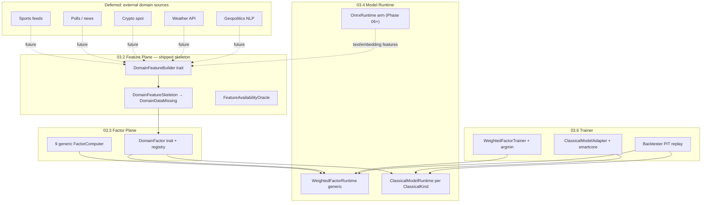

# 03.x — Vertical Domain Enhancement Design (Phase 3 Companion)

> 父：[`README.md`](README.md) · 特征层：[`03.2-feature-plane.md`](03.2-feature-plane.md) ·
> 因子层：[`03.3-factor-plane.md`](03.3-factor-plane.md) · 模型层：[`03.4-model-runtime-weighted-scorer.md`](03.4-model-runtime-weighted-scorer.md) ·
> 训练层：[`03.6-trainer-classical-ml-backtest.md`](03.6-trainer-classical-ml-backtest.md) ·
> 技术栈：[`../08-third-party-crates-and-ml-stack.md`](../08-third-party-crates-and-ml-stack.md)

本文档贯穿 Phase 3 各子计划，定义**垂直领域（Sports / Politics / Crypto / Weather / Geopolitics）**
在 feature → factor → model → train/backtest 闭环中的增强设计。03.2 已落地骨架与缺失语义；
真实外部源接入、category-specific 训练数据集与 ONNX 推理仍按各 phase 标注延后。

---

## 1. 设计原则

| 原则 | 含义 |
|------|------|
| **Additive** | 垂直能力叠加在通用 pipeline 上；缺失 domain 数据不阻塞 generic report，除非 model spec 显式要求 |
| **Single taxonomy** | [`DomainFamily`](../../../crates/quant-pivot-research/src/vertical.rs) 为 feature / factor / model 唯一垂直枚举 |
| **No silent defaults** | domain feature 缺失 ⇒ `NullReason::DomainDataMissing` + `NullPolicy::DomainMissing`；禁止伪造 0 |
| **Category routing** | `DomainFamily::for_category(MarketCategory)` 决定启用哪条垂直 arm |
| **PIT 一致** | 垂直外部事实与 book/Gamma 一样受 `as_of - source_delay` 约束 |
| **Strongly-typed origin** | 每个特征值的来源走 [`EvidenceSourceKind`](../../../crates/quant-pivot-research/src/features/value.rs)（含 `DomainExternal`），由 `SourceRequirement::evidence_kind()` 派生，绝不靠名字前缀反推 |
| **Heavy deps gated** | smartcore / argmin / ort / candle / polars 仅在对应 feature flag + phase 链接 |

---

## 2. 垂直数据流（Phase 3 全链路）



---

## 3. 03.2 已交付 vs 延后

### 3.1 已交付（代码真理）

- [`FeatureSpec`](../../../crates/quant-pivot-research/src/features/schema.rs) 八要素 + `SourceRequirement::DomainExternal { family }` + `SourceRequirement::evidence_kind()`
- [`DOMAIN_FEATURES`](../../../crates/quant-pivot-research/src/features/domain/mod.rs) 五垂直各一代表 feature
- [`DomainFeatureSkeleton`](../../../crates/quant-pivot-research/src/features/domain/mod.rs)：`DomainDataMissing`，不填默认值
- [`EvidenceSourceKind::DomainExternal`](../../../crates/quant-pivot-research/src/features/value.rs)：强类型来源 + `as_wire()` 稳定列契约
- [`FeatureAvailabilityOracle`](../../../crates/quant-pivot-research/src/features/availability.rs)：domain required ⇒ 当前 ineligible（外部源未接）
- 在线编排：[`FeaturePipelineService`](../../../crates/quant-pivot-core/src/service/feature_pipeline.rs)（批量持久化 + present-only CH 发射）

### 3.2 延后

| 能力 | 目标 Phase | 说明 |
|------|-----------|------|
| 真实外部 domain 源（API / 文件 / CH 表） | Post–3.2 / 3.5+ | 每垂直独立 `DomainDataSource` impl |
| 历史 domain PIT 回放 | 3.5 | 与 `PitQueryEngine` 同契约 |
| polars 大规模 domain feature materialization | 3.5 | 离线 batch only |
| Phase 4 定时 `live_report_inference` 调度 | 4.x | 3.2 只交付组件 + e2e |
| **domain feature 的 per-market category 路由** | Post–3.2（随真实外部源接入） | 当前 `DomainFeatureSkeleton` 对**每个** market emit 全部 5 垂直为 `DomainDataMissing`（schema 静态、向量维度恒定）。按 `DomainFamily::for_category` 只 emit 相关垂直需与 **feature_hash / 模型输入维度对齐**方案一并落地（否则 per-market 可变维度会破坏 hash 决定性与模型输入契约），因此推迟到真实 domain 源接入时设计 |

---

## 4. 03.3 垂直因子增强（规划）

### 4.1 Domain factor registry

```rust
pub trait DomainFactorComputer: Send + Sync {
    fn family(&self) -> DomainFamily;
    fn spec(&self) -> &FactorDefinitionSpec;
    /// Reads domain features from FeatureVector; missing ⇒ confidence penalty, not silent zero.
    fn compute(&self, features: &FeatureVector) -> QuantResult<FactorValue>;
}
```

- `FactorFamily::Domain(DomainFamily)` 与 feature 侧 `DomainFamily` 对齐
- 每个垂直 1–3 个因子，input_features 引用 `domain.{vertical}.*` schema names
- **Additive**：generic 9 因子始终计算；domain 因子 `missing_factor_policy = ZeroWeight` 为默认

### 4.2 与 03.2 feature 的契约

| Vertical | 代表 feature (03.2) | 规划 factor (03.3) |
|----------|---------------------|-------------------|
| Sports | `domain.sports.pre_match_move` | `domain_sports_prematch_momentum` |
| Politics | `domain.politics.poll_momentum` | `domain_politics_poll_shift` |
| Crypto | `domain.crypto.underlying_beta` | `domain_crypto_beta_regime` |
| Weather | `domain.weather.forecast_revision` | `domain_weather_forecast_surprise` |
| Geopolitics | `domain.geopolitics.news_shock_decay` | `domain_geo_news_decay` |

---

## 5. 03.4 垂直模型增强（规划）

### 5.1 Category-specific model arms

```rust
pub enum ModelRouting {
    GenericWeighted,                           // 全 category
    CategorySpecific { category: MarketCategory, artifact: ModelVersionId },
}
```

- **Generic**：`WeightedFactorRuntime`，全因子集；domain 因子权重可为 0
- **Category-specific**：Sports 市场可选用 `WeightedFactorModelArtifact` 的子集权重（artifact 内 `category_scope`）
- **Classical shadow**：`ClassicalModelArtifact` + `ClassicalKind`，feature 向量含 domain 列时自动启用对应 preprocessing

### 5.2 ONNX 预留（Phase 06+）

- 用途：domain **文本/embedding** 特征（Geopolitics NLP、Politics 新闻）
- Crate：`ort`（MSRV / native lib 见 §7）
- 入口：`ModelArtifact::Onnx(OnnxArtifactRef)` + `ModelRuntimeFactory` 分支
- **不在 Phase 3 链接**；factory enum arm + degrade 策略在本期文档化

### 5.3 推理降级（与 vertical 相关）

| 条件 | 行为 |
|------|------|
| domain feature `DomainDataMissing` + generic model | 继续；domain 因子 ZeroWeight |
| model spec 要求 domain feature | `RejectCandidate` / 跳过该 market |
| classical 缺 domain 列 | preprocessing impute 仅当 artifact 声明；否则 fail-closed |

---

## 6. 03.6 垂直训练 / 回测增强（规划）

### 6.1 WeightedFactorTrainer + argmin

- **Objective**：pairwise rank loss + turnover/drawdown penalties（见 03.6 §3.1）
- **Vertical slice**：dataset 按 `MarketCategory` / `DomainFamily` 分层 validation
- **Category override**：artifact 可存 `per_category_weights: BTreeMap<MarketCategory, Vec<FactorWeight>>`
- **argmin**（feature `optimize`）：连续权重优化；grid search 作 deterministic fallback

### 6.2 smartcore classical shadow

- **Families**：RandomForest / ExtraTrees / Logistic / Ridge（`ClassicalKind`）
- **Vertical 场景**：
  - Sports：tabular domain + book features → RF 捕捉非线性 pre-match
  - Politics：poll momentum + time-to-resolution → Logistic baseline
  - Crypto：underlying_beta + momentum → ExtraTrees regime
- **Serialization**：`ModelSerializationFormat::SmartcoreJson` 或 `Bitcode`（实现前 spike smartcore serde 稳定性）
- **Adapter 边界**：业务层仅见 `ClassicalModelAdapter`；禁止泄漏 `smartcore::...`

### 6.3 Backtest 垂直指标

- `BacktestReport.category_breakdown` 按 `DomainFamily` 聚合 rank_ic / hit_rate
- PIT 重放必须使用 3.5 历史 `PitView::Historical` + 离线 window provider（禁触 live BookStore）

---

## 7. 第三方 crate 定向调研摘要

> 完整矩阵见 [`08-third-party-crates-and-ml-stack.md`](../08-third-party-crates-and-ml-stack.md)

| Crate | Phase 3 角色 | Vertical 典型场景 | 链接策略 |
|-------|-------------|------------------|---------|
| **smartcore** | 3.6 shadow train/infer | Sports RF、Politics Logistic | `ml-classical` feature only |
| **argmin** | 3.6 weight optimize | 全 vertical 共享 objective | `optimize` feature only |
| **polars** | 3.5 offline materialization | domain 大表 join + rolling | `dataframe` feature only |
| **ort** | Phase 06+ infer | Geopolitics/Politics text ONNX | 独立 feature `onnx-infer` |
| **candle** | Phase 08+ | safetensors 轻量 transformer 实验 | 不进入 Phase 3 |
| **burn** | Phase 08+ | Rust-native DL 研究 | 不进入 Phase 3 |

### 7.1 smartcore artifact

- 训练产物经 adapter 序列化到 `ArtifactStore`（URI + hash）
- 在线加载：`ClassicalModelRuntime::load` → 内存模型 + preprocessing pipeline
- **风险**：smartcore 版本升级需 regression；artifact 必须 pin `crate_version`

### 7.2 argmin 目标函数

- 参数：factor weight vector `w`，约束 `w_i >= 0`, `sum(w) = 1`
- 损失：batch rank IC 负值 + L2 + turnover proxy
- Fallback：coarse grid 保证 CI 无 argmin 时仍可 deterministic train

### 7.3 ort MSRV / 部署

- native lib 随平台分发；Docker 多阶段构建单独层
- 输入：固定维度 float tensor（domain embedding）；输出：scalar score → `Probability`
- Phase 3 仅预留 `ModelArtifact` enum variant + factory match arm

### 7.4 candle / safetensors

- 研究路径：HF 模型 → safetensors → candle 推理
- **生产边界**：Phase 8+；Phase 3 不链接
- 若引入：embedding 作为 `domain.*.embedding_*` feature，PIT 由 ingestion timestamp 约束

---

## 8. 验收挂钩（跨 phase）

| 测试 | Phase | 垂直关联 |
|------|-------|---------|
| `domain_feature_missing_emits_domain_missing_not_default` | 3.2 ✓ | 骨架 |
| `domain_factor_missing_zero_weight` | 3.3 | additive |
| `category_specific_model_routes_sports` | 3.4 | routing |
| `classical_sports_rf_shadow_infer` | 3.6 | smartcore |
| `vertical_backtest_category_breakdown` | 3.6 | metrics |
| `onnx_geopolitics_embedding_infer` | 06+ | ort |

---

## 9. 变更记录

| 日期 | 变更 |
|------|------|
| 2025-06 | 初版：03.2 骨架落地 + Phase 3 垂直增强闭环设计；强类型 `EvidenceSourceKind::DomainExternal` 来源契约 |
| 2025-06 | 03.2 hardening：domain category **路由**仍延后（§3）；`market.category` 已落地；domain missing 改 `KeepMissing`；category one-hot 归一 → 3.3；confidence penalty → 3.4 |
