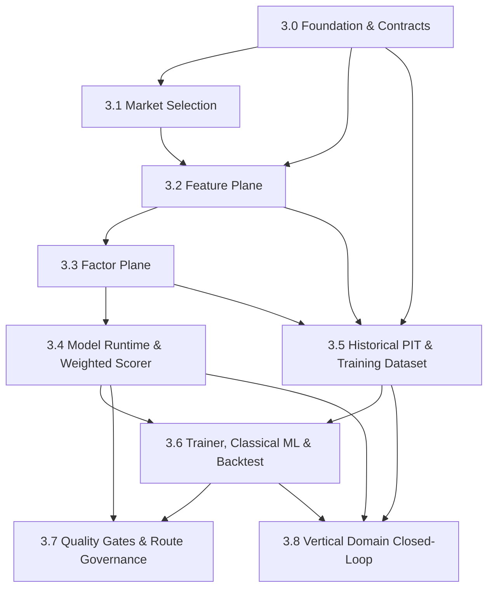

# Phase 03 — Research Plane 子phase索引

<!-- quant-pivot-deployment-contract:v1 -->
> **Deployment contract**
> - `fresh_boot_assumption`: 项目尚未正式生产上线，将从全新 `boot` / schema version `1` 部署；仓库和数据库不保存 lifecycle seal 状态。
> - `schema_data_version_impact`: 本文中的历史版本号与递增路径不再具有实施效力；当前实现不迁移测试数据、旧结构或旧版本。
> - `pre_deployment_behavior`: 允许 clean-break 与唯一 fresh terminal bootstrap rewrite；任何真实数据销毁仍需操作者单独授权。
> - `post_deployment_behavior`: 本次实现只交付唯一 fresh terminal bootstrap；不设计 upgrade/downgrade 或 data/schema/version migration。
> - `rollback_and_data_verification`: 只在 disposable 空基础设施执行 fresh-install 验证；任何真实数据重置必须另行授权。

> 状态：生产级破坏式实施拆分
>
> 父文档（概念规格）：[`../03-data-factor-model-pipeline.md`](../03-data-factor-model-pipeline.md)
> 与 [`../08-third-party-crates-and-ml-stack.md`](../08-third-party-crates-and-ml-stack.md)
>
> 本目录把 Phase 03 拆成 8 个可独立推进、带验收契约的子phase。父文档保持
> "概念真理"，本目录是"可执行实施契约"。任一子phase未满足其 Blocker / 验收，
> 不允许进入下一子phase。

## 0. 为什么拆分

Phase 03 是整个 quant-pivot 的研究平面：市场选择、特征、因子、模型运行时、
训练、回测、质量门禁、治理，外加 ML 技术栈与历史 point-in-time 解析层。它的
体量远超单一可验证增量，因此拆成 3.0–3.7。

**SUPERSEDED 拆分基线**

早期 Phase 1/2 表数、runtime-config v3、stub/module 空白与“待补表”只用于解释当时为何拆分
3.0–3.8，不再描述 current bytes，也不得恢复已删除的统一 runtime-config 或增量 schema
路径。当前实施状态只认 [`../phase-12/12.1-implementation-ledger.md`](../phase-12/12.1-implementation-ledger.md)；
schema 只认唯一 v1 fresh bootstrap，研究计算/持久化形状以 current source 和各自 canonical
contract 为准。

## 1. 子phase索引

| 子phase | 标题 | 闭环定位 | 文档 |
|---|---|---|---|
| 3.0 | Research Foundation & Contracts | 契约/脚手架 | [`03.0-research-foundation-and-contracts.md`](03.0-research-foundation-and-contracts.md) |
| 3.1 | Market Selection | 在线输入 | [`03.1-market-selection.md`](03.1-market-selection.md) |
| 3.2 | Feature Plane | 在线/离线特征 | [`03.2-feature-plane.md`](03.2-feature-plane.md) |
| 3.3 | Factor Plane | 在线/离线因子 | [`03.3-factor-plane.md`](03.3-factor-plane.md) |
| 3.4 | Model Runtime & Weighted Scorer | **在线推理闭环** | [`03.4-model-runtime-weighted-scorer.md`](03.4-model-runtime-weighted-scorer.md) |
| 3.5 | Historical PIT & Training Dataset | 离线数据 | [`03.5-historical-pit-and-training-dataset.md`](03.5-historical-pit-and-training-dataset.md) |
| 3.5.1 | Training Dataset Admin API | UI/API 契约 | [`03.5.1-training-dataset-admin-api.md`](03.5.1-training-dataset-admin-api.md) |
| 3.6 | Trainer, Classical ML & Backtest | **离线训练/回测闭环** | [`03.6-trainer-classical-ml-backtest.md`](03.6-trainer-classical-ml-backtest.md) |
| 3.7 | Quality Gates & Route Governance | **离线证据与 serving-route 治理闭环** | [`03.7-quality-gates-and-governance.md`](03.7-quality-gates-and-governance.md) |
| 3.8 | Vertical Domain Closed-Loop（Crypto 参考垂直） | **垂直完整闭环** | [`03.8-vertical-domain-closed-loop.md`](03.8-vertical-domain-closed-loop.md) |

> 3.8 合并了垂直领域的**设计真理（D1–D7）+ 工作流（W1–W7）+ 外部数据源选型**为单一权威文档
> （原 `03.x-vertical-domain-design.md`、原 `03.6 §11`、原 `docs/operations/domain-data-sources.md`）；
> 3.5/3.6 已交付，垂直在其上加性扩展，**不回推** 3.2/3.3/3.5/3.6。

## 2. 依赖图



两条闭环：

- **在线闭环**（3.1 → 3.2 → 3.3 → 3.4）：`MarketSelection → FeatureVector →
  FactorValue → ModelRun → SignalCandidate`，持久化 ModelRun + ClickHouse 事实。
- **离线闭环**（3.5 → 3.6 → 3.7）：`Historical PIT → TrainingDataset → Trainer →
  Backtest/CPCV → QualityGate → immutable CandidateManifest → Shadow → governed route
  activation/config revision rollback`。
- **垂直闭环**（子phase 3.8，Crypto 参考垂直）：`MarketLinkage → DomainDataSource →
  quant_domain_observation → domain slice 特征/因子 → ModelRouting`。**统一落地于 3.8**
  （3.5/3.6 已交付，垂直在其上加性扩展，不回推 3.2/3.3/3.5/3.6）。

## 3. 已拍板的设计基线（贯穿全部子phase）

1. **Trait 归属**：所有计算 trait（`MarketSelector` / `FeatureBuilder` /
   `FactorComputer` / `QuantModelRuntime` / `ModelTrainer` / `Backtester` /
   `Labeler` / `ModelQualityGate` / `ArtifactStore` / 历史 `PointInTimeDataSource` /
   `PointInTimeSnapshotSource`）与其计算域值类型（强类型 `FeatureVector` / `FactorValue` /
   `SignalCandidate` / `ModelArtifact` / runtime I/O）全部归属
   `quant-pivot-research`。`quant-pivot-models` 只保留持久化 DTO（`*Info` /
   `New*`）、`enums/quant.rs`、typed IDs；research 依赖 models 做持久化映射。
2. **Artifact 后端**：本地 artifact 目录 + `ArtifactStore` trait + `file://` URI
   （deploy 配置 root path），S3/MinIO 后续无缝替换；Postgres 只存 metadata /
   hash / URI。
3. **ML 范围**：weighted-factor 主路径 + smartcore classical ML（shadow 候选），
   统一 `QuantModelRuntime` 隔离调用方；完整 verified serving preimage 唯一构造
   concrete runtime。
4. **Backtest 组合层**：backtest、replay 与 production report 使用同一
   `GlobalPortfolioPlanner`、同一经济 tier/scenario contract 和 exact verifier；不得以 greedy 或
   score-based allocator 生成不可对比的 portfolio 指标。
5. **零兼容、零 re-export**；`f64` 仅允许出现在训练矩阵边界，禁止泄漏到 money domain。
6. **PIT 正确性是硬不变量**：任何特征 / 训练样本不得读取 `as_of` 之后的事实；
   回测禁止访问 live `BookStore`。

## 4. 跨子phase不变量

- 每个 feature / factor / dataset / model artifact / backtest 都有
  `blake3:` canonical hash（复用
  [`models::hashing::CanonicalDigest`](../../../../crates/quant-pivot-models/src/hashing.rs)）。
- 所有计算域 trait 接受**冻结快照**（config version、selection snapshot、PIT
  source），禁止读取 mutable runtime state。
- research crate 禁止：直接下单、读 web state、在循环里查数据库、把第三方 ML
  concrete type 暴露到业务层。
- 货币 / 价格 / shares / probability 一律使用项目 newtype（`Usd` / `Price` /
  `Shares` / `Probability`），绝不用 `f64`。
- 失败语义统一走 `QuantResult` / 结构化错误，`src/` 内禁止 `unwrap()`。

## 5. ML 依赖引入顺序（feature-gate）

落在 `quant-pivot-research` 的 `[features]`：

```toml
# ndarray / ndarray-stats / statrs / rayon 为 base deps（在线 feature plane 必需）
[features]
default = []
dataframe = ["dep:polars", "dep:arrow", "dep:parquet"]
optimize = ["dep:argmin", "dep:argmin-math"]
ml-classical = ["dep:smartcore"]
```

引入子phase对应：

- 3.0：声明 workspace 依赖与 feature gate（numeric stack 为 base dep，`default = []`）。
- 3.2 / 3.5：base numeric stack + `dataframe`（polars/arrow/parquet 仅离线 materialization）。
- 3.6：`optimize`（argmin）+ `ml-classical`（smartcore）。
- direct `highs` + HiGHS 由全局组合模块统一链接；Phase 03 不建立第二 allocator。`ort` / `burn` /
  `candle` 仍按后续模型 phase 引入（见父文档 §30）。

`quant-pivot-core` 链接 `quant-pivot-research/dataframe`（3.5 数据集 Parquet）；
`quant-pivot-research` 自身 `default = []`。报告二进制因此含 polars，但
在线 hot path 不调用 Polars。CI 分 job 测 `ml-classical` / `optimize` heavy features。

## 6. 延后项总表（缺口必须在对应子phase文档显式标注）

| 延后能力 | 本期替代 | 落地 Phase | 标注于 |
|---|---|---|---|
| 全局组合输入装配 | production `GlobalPortfolioPlanner` + PIT economic/scenario adapter | Phase 04/05 | 3.6 / 05.8 |
| TopN 报告生成 / report scheduler / 定时 `live_report_inference` | 按需 `ModelRunner` + SignalCandidate | Phase 04 | 3.4 §10 |
| `required_features` → 03.1 selection 全链路编排 | `QuantModelRuntime::required_features()` trait | Phase 04 | 3.4 §10 / 3.8 §6.5 |
| report-level shadow 完整比较（capital/would-execute/risk envelope delta） | signal/rank 层 `shadow_diff` + metrics | Phase 04 | 3.7 §10 |
| shadow `exceeds_threshold` operator alert + `quant_shadow_comparison` 表 | normalized comparison + typed `weight_source` | **Phase 3.7 ✅ 已交付** | 3.7 §4 / §10 |
| quality/gate freshness | `PromotionGateArtifact` 绑定 exact evidence 与 server timestamp；permit/activation 重验 | **Phase 3.7 + 11.9 ✅** | 3.7 §3 / 11.9 |
| runtime factor-weight overlay | 权重冻结在 content-addressed artifact；变化创建新 model version | **按设计删除** | 3.7 §2 |
| `ReturnModelSpec::Calibrated` 拟合 + `objective_report` | `Heuristic` + Calibrated 插值应用 | **Phase 3.6 ✅ 已交付** | 3.4 §10 / 3.6 §1.1 |
| `classical` runtime（smartcore） | factory `RuntimeUnavailable` | **Phase 3.6 ✅ 已交付**（`ml-classical`） | 3.4 §10 |
| `argmin` 权重优化（grid 主干 + `optimize` 精修） | grid coordinate search | **Phase 3.6 ✅ 已交付**（`optimize`） | 3.6 §1 |
| `ModelConfig.prediction_horizon_secs` 在线读取 | artifact `prediction_horizon_secs`（trainer 写入） | **Phase 3.6 ✅ 已交付**（写入 artifact） | 3.4 §4.2 |
| 垂直领域完整闭环（Crypto：linkage + domain PIT + 两层向量 + 真实特征/因子 + ModelRouting + domain dataset + 垂直训练/回测） | skeleton + `DomainDataMissing` + 3.5 generic dataset | **Phase 3.8** | [`03.8`](03.8-vertical-domain-closed-loop.md) |
| 其余四垂直（Sports/Politics/Weather/Geopolitics）真实外部数据 | Crypto 范式加性扩展 | Post–3.8 Crypto | [`03.8`](03.8-vertical-domain-closed-loop.md) §12 |
| direct `highs` + HiGHS 全局组合 | production 与 backtest 唯一实现 | **Phase 05 clean-break** | 3.6 / 05.8 |
| `ort` ONNX 推理 | `QuantModelRuntime` 预留 arm | Phase 06 | 3.4 §10 |
| PolicyAutomatic 入场门禁生效 | config 口径记录 | Phase 05/06 | 3.7 §10 |
| `burn` / `candle` 深度学习 | — | Phase 08 | 3.4 §10 |
| 对象存储（S3/MinIO）artifact | 本地目录 + content-addressed key | 后续 | 3.0 / 3.4 §1.1 |
| PG `SignalCandidate` 表 | CH `quant_signal_candidate_event` only | —（by design） | 3.4 §10 |
| `SellYes` / `SellNo` 退出候选（机会性 Sell scorer） | Buy 侧 scorer only；05.6 执行侧 Sell 已覆盖 | **Phase 06** | [`phase-06/06.1`](../phase-06/06.1-opportunistic-sell-exit-signal.md) |
| `input_hash` 内容级 audit digest | id + schema + version 绑定 | Phase 04 编排 + 可选 3.7 | 3.4 §10.6 |

## 7. 文档契约模板

每篇子phase文档必须包含以下小节（顺序固定）：

1. **目标与闭环定位** —— 这一子phase交付什么、在两条闭环中的位置。
2. **删除清单** —— 加替代代码前必须删除哪些 crate / 模块 / 类型 / 配置；
   若无可删，显式写"无（本子phase为净新增）"。
3. **新领域类型 / 表 / ClickHouse fact** —— research 计算类型、Postgres 表、CH fact。
4. **deploy-config key 与 runtime-config v3 path** —— 消费哪些既有 config 段、
   是否新增 deploy key。
5. **必建模块与 trait** —— 模块树 + trait 签名（verbatim Rust）。
6. **生产不变量与失败语义** —— PIT、降级、hash、错误处理硬规则。
7. **第三方 crate 引入** —— 本子phase允许 / 禁止的 crate 与 feature gate。
8. **验收测试** —— 必须新增的测试用例（含父文档 §23 对应项）。
9. **Blocker** —— 触发即判定本子phase失败的条件。
10. **延后 / 缺口** —— 本子phase明确不做、留给后续 Phase 的点。

## 8. 质量门禁（每个子phase收尾必跑）

```bash
cargo fmt --all --
cargo clippy --workspace --all-targets -- -D warnings
cargo clippy -p quant-pivot-research --features ml-classical,dataframe,optimize -- -D warnings
cargo xtask architecture audit-functions
cargo xtask architecture check
cargo test --workspace
```
