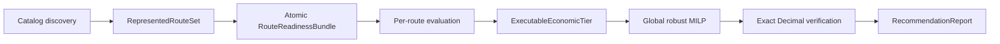

# Phase 04 — Cross-Route Recommendation Report

<!-- quant-pivot-deployment-contract:v1 -->
> **Clean-break contract**：Phase 04 的旧 per-candidate Kelly、greedy allocation、raw-score TopN 和单 Route
> report 已删除。当前 phase 只实现 Route-specific evaluation → executable economic tiers → global portfolio
> plan → immutable report。

## 1. Phase 目标

交付一份可以跨 category/Buy Route 的 `RecommendationReport`，回答买什么、何时买、买多少、何时退出、
风险/资本占用和为什么，并可追溯到每个 Route 的 model/calibration/Trade Policy/Research Profile lineage。

## 2. 子 phase

1. [`04.0-report-foundation-and-contracts.md`](04.0-report-foundation-and-contracts.md)：report、route-run、
   economics、scenario 和 lifecycle 基础合同。
2. [`04.1-portfolio-planner-and-sizing.md`](04.1-portfolio-planner-and-sizing.md)：真实 L2 economic tiers、
   candidate admission、global plan 和 ranking。
3. [`04.2-report-builder-composer-publisher-lifecycle.md`](04.2-report-builder-composer-publisher-lifecycle.md)：
   frozen multi-route builder、atomic persistence、publication 和 empty/failure 语义。
4. [`04.3-scheduler.md`](04.3-scheduler.md)：durable schedule/claim/recovery；调度不得改变报告经济语义。
5. [`04.4-report-web.md`](04.4-report-web.md)：mixed-route API/WebSocket/UI contract。

唯一 optimizer 规格：[`../phase-05/05.8-portfolio-optimization-highs.md`](../phase-05/05.8-portfolio-optimization-highs.md)。

## 3. 生产不变量

- `enabled_categories = []` 表示全部受支持分类。
- `RepresentedRouteSet` 在模型相关过滤之前形成。
- 任一 represented Route readiness 不完整时整份报告失败。
- 完整 Route 零候选是正常 route outcome；discovery/pipeline failure 不是空报告。
- raw model score/confidence 只属于 Route evidence，不参与跨 Route ranking。
- sizing 只能选择完整 `ExecutableEconomicTier`；无 per-candidate sizing model。
- 联合 dependence 只能来自 promoted `PortfolioScenarioArtifact`。
- 组合只接受唯一 HiGHS MILP 的 optimal + exact-verified result。
- 所有 mode 使用真实 venue account；credential 缺失 fail closed。
- report、route-run、plan 和 recommendation 一次事务持久化，commit 后才发布副作用。

## 4. 核心类型

- `RepresentedRouteSet`
- `ReportRouteRunId` / `ReportRouteRun`
- `ExecutableEconomicTier`
- `PortfolioScenarioArtifact`
- `GlobalPortfolioPlan`
- `RecommendationEconomics`
- `RouteLineageView`

报告不得再持有单数 model/profile/run。Recommendation 必须 FK 到 route run 和 selected tier。

## 5. Economics 与 ranking

对每条 recommendation 暴露：

- calibrated `profit_probability_bps`
- `nominal_expected_net_usd`
- `robust_expected_net_usd`
- `max_loss_usd`
- `cvar_contribution_usd`
- `capital_occupancy_usd_hours`
- `marginal_portfolio_value_usd`

leave-one-out marginal robust value 是全局 rank 第一键。删除 `risk_adjusted_score`、Kelly provenance 和
category-local ranking。

## 6. Persistence/transaction

一个成功 report transaction 写入：

- report run success transition；
- `quant_recommendation_report`；
- 每个 `quant_report_route_run`；
- `quant_portfolio_plan`；
- recommendations 与 rejected/zero-candidate funnel evidence；
- operation/outbox events。

Route/pipeline/solver failure 只写 run/route diagnostics，不发布 report。合法 zero-allocation 生成带明确
empty reason 的 Published report。

## 7. 验收

- mixed Pooled/Crypto/Weather 同报告与全局 ranking。
- missing Route artifact、contract mismatch、active inference failure 整体失败。
- zero-candidate、zero-allocation、discovery failure 三种语义有独立测试。
- brute-force parity、input-order determinism、all constraints 与 exact-money verification。
- API snapshot、DB round-trip、WS publication、execution admission lineage。
- report UI 显示 global economics、Route badges/filter 和 route lineage drawer。
- 真实 production-stack Playwright visual/a11y/keyboard/browser-failure gate。
