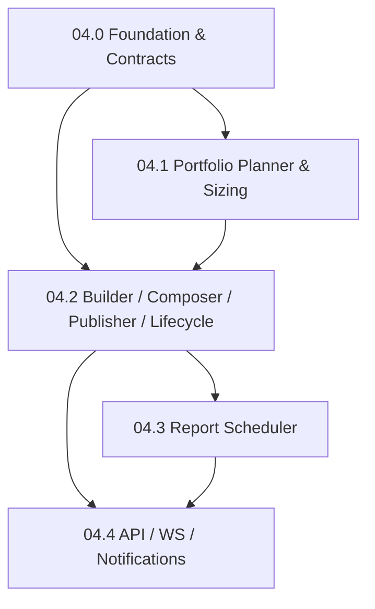

# Phase 04 — Report Plane 子phase索引

> 状态：生产级破坏式实施拆分（设计文档；本目录不含代码）
>
> 父文档（概念规格）：[`../04-topn-report-and-recommendation.md`](../04-topn-report-and-recommendation.md)、
> [`../05-execution-risk-and-governance.md`](../05-execution-risk-and-governance.md)、
> [`../06-config-deploy-and-ops.md`](../06-config-deploy-and-ops.md)、
> [`../08-third-party-crates-and-ml-stack.md`](../08-third-party-crates-and-ml-stack.md)、
> [`../09-account-capital-position-reconciliation.md`](../09-account-capital-position-reconciliation.md)
>
> 本目录把 Phase 04 拆成 5 个可独立推进、带验收契约的子phase。父文档保持
> "概念真理"，本目录是"可执行实施契约"。任一子phase未满足其 Blocker / 验收，
> 不允许进入下一子phase。

## 0. 为什么拆分

Phase 04 是 quant-pivot 的**报告平面**：把 Phase 03 在线闭环产出的
`SignalCandidate` 转成受治理、不可变、可审计、可回放的 `RecommendationReport`
（主产物），并把"何时生成报告"做成生产级调度。它跨越 **6 个 crate**
（models / research / repository / core / web / error），同时引入：

- 受治理 `PortfolioPlanner` + Kelly sizing（直接决定"买多少"，钱相关）。
- 账户资本抽象 `AccountSnapshot` / `AccountProvider`（sizing 的资本基数与敞口净额）。
- 强类型报告 payload（entry / sizing / exit / risk envelope / factor / evidence）。
- 报告生命周期服务 + `tokio-cron-scheduler` 调度层。
- 报告读/写 API、WebSocket 事件、分级通知。

其体量远超单一可验证增量，因此拆成 04.0–04.4。

## 1. 子phase索引

| 子phase | 标题 | 闭环定位 | 文档 |
|---|---|---|---|
| 04.0 | Report Foundation & Contracts | 契约/脚手架/破坏式重构 | [`04.0-report-foundation-and-contracts.md`](04.0-report-foundation-and-contracts.md) |
| 04.1 | Portfolio Planner & Sizing | **"买多少"闭环（钱）** | [`04.1-portfolio-planner-and-sizing.md`](04.1-portfolio-planner-and-sizing.md) |
| 04.2 | Report Builder / Composer / Publisher / Lifecycle | **报告生成闭环** | [`04.2-report-builder-composer-publisher-lifecycle.md`](04.2-report-builder-composer-publisher-lifecycle.md) |
| 04.3 | Report Scheduler | **调度闭环** | [`04.3-report-scheduler.md`](04.3-report-scheduler.md) |
| 04.4 | Report API / WS / Notifications | **对外可观测闭环** | [`04.4-report-api-ws-notifications.md`](04.4-report-api-ws-notifications.md) |

## 2. 依赖图



报告生成主链（一次 schedule fire 内）：

```mermaid
flowchart LR
    Fire["Schedule Fire (as_of = trigger - source_delay)"] --> Freeze["Freeze RuntimeConfig version"]
    Freeze --> Sel["MarketSelector.build_snapshot"]
    Sel --> Feat["FeaturePipelineService.run"]
    Feat --> Model["ModelRunner.run → accepted: Vec&lt;SignalCandidate&gt;"]
    Model --> Acct["AccountProvider.snapshot (capital base + exposures)"]
    Acct --> Plan["PortfolioPlanner.plan (Kelly sizing + caps)"]
    Plan --> Compose["RecommendationComposer.compose (typed payload + eligibility)"]
    Compose --> Persist["ONE txn: report + recs + portfolio_plan + account_snapshot + op-log"]
    Persist --> Publish["ReportPublisher: WS + notify + metrics"]
```



## 3. 当前代码现实（拆分基线，2026-06 实测）

> 本节是删除/重构清单的依据。所有结论均经代码核实，引用 `file:line`。

**Phase 01 已交付（报告链路骨架）**

- 五张 Postgres 表 + entity + iden + DTO（catalog 驱动，无手写 SQL 迁移）：
  `quant_recommendation_report` / `quant_recommendation` / `quant_portfolio_plan` /
  `quant_order_intent` / `quant_recommendation_attribution`（+ `quant_execution_order`）。
- typed IDs：`RecommendationReportId` / `RecommendationId` / `PortfolioPlanId` /
  `OrderIntentId` / `ExecutionOrderId`
  （[`models/src/types/ids.rs`](../../../crates/quant-pivot-models/src/types/ids.rs) §129–147）。
- 生命周期枚举齐全
  （[`models/src/enums/quant.rs`](../../../crates/quant-pivot-models/src/enums/quant.rs)）。
- ClickHouse fact：`quant_recommendation_event` / `quant_execution_event`（row 类型已定义）。

**Phase 03 已交付（报告输入）**

- 在线闭环到 `ModelRunOutcome.accepted: Vec<SignalCandidate>`（已过 score/confidence
  floor、已排序）：`MarketCandidateProvider → MarketSelector → FeaturePipelineService →
  ModelRunner.run`。
- `PortfolioAllocator` trait + `GreedyPortfolioAllocator`（budget/单笔/市场/事件/类别/
  流动性 caps）
  （[`research/src/backtest/allocator.rs`](../../../crates/quant-pivot-research/src/backtest/allocator.rs)）——
  父文档 §21 明确 Phase 04 受治理 planner **复用同一 trait**。
- runtime-config v3 `selection` / `data_quality` / `features` / `factors` / `model` /
  `quality_gate` / `training` / `reports` / `portfolio` / `execution` / `notification`
  齐全；`RuntimeConfigStore`（热快照）+ `RuntimeConfigVersionRepository`（`load_version`）。

**Phase 04 基本空白（本目录补齐）**

- 无受治理 `PortfolioPlanner`、无 sizing 模型、无 `AccountSnapshot`/`AccountProvider`。
- 无 `ReportBuilder`/`Composer`/`Publisher`/`LifecycleService`、无调度层
  （`infra/schedule/` 目录不存在）。
- 报告 payload 仍是裸 `serde_json::Value`（无强类型块）。
- 报告/组合/intent 三个 repository **均未接入任何 bundle/service**
  （`quant-pivot-core` 全仓零引用）。
- `quant-pivot-web` **零 quant 报告/recommendation/intent 路由**。
- `quant_account_snapshot` 表**完全不存在**。

## 4. 全局删除 / 合并 / 重构清单（贯穿子phase）

> 钱相关系统：宁可破坏式重构，不留模糊死代码。每条都标注**动作**与**归属子phase**。
> 逐条细化见各子phase §2「删除清单」。

### 4.1 删除（DEAD：定义存在但全仓零消费）

| 目标 | 证据 | 动作 | 子phase |
|---|---|---|---|
| `QuantReportView` / `QuantReportListQuery`（[`api/quant_report.rs`](../../../crates/quant-pivot-models/src/domain/api/quant_report.rs)） | `quant-pivot-web` 零引用；无路由 | **删除**，由 04.4 强类型 `*View` 取代 | 04.4 |
| `QuantOrderIntentView` / `ApproveQuantOrderIntentRequest`（[`api/quant_execution.rs`](../../../crates/quant-pivot-models/src/domain/api/quant_execution.rs)） | 同上，零路由 | **删除**（intent 执行属 Phase 5；本期不接口） | 04.0 标注 / Phase 5 |
| `RecommendationReportModel`（[`domain/quant/recommendation.rs`](../../../crates/quant-pivot-models/src/domain/quant/recommendation.rs) §138） | 仅 prelude re-export，零构造点 | **删除**，由 04.2 `ComposedReport` 草稿类型取代 | 04.2 |
| `PortfolioPlanModel`（[`domain/quant/portfolio.rs`](../../../crates/quant-pivot-models/src/domain/quant/portfolio.rs)） | 仅 prelude re-export，零构造点 | **删除**（planner 直接产 `NewPortfolioPlan`） | 04.1 |
| `RecommendationAttributionModel`（[`domain/quant/attribution.rs`](../../../crates/quant-pivot-models/src/domain/quant/attribution.rs)） | 仅 prelude re-export，零构造点 | **删除**（attribution 属 Phase 5） | Phase 5（04.0 标注） |
| `QuantWorkersConfig.report_scheduler_tick_secs`（[`config/quant.rs`](../../../crates/quant-pivot-models/src/config/quant.rs)） | 全仓零读取；父文档 §23.4 降级为"可选健康扫描" | **删除或降级**为可选 sweep cadence（不做主触发器） | 04.3 |

### 4.2 合并 / 收敛（重复或重叠语义）

| 目标 | 问题 | 动作 | 子phase |
|---|---|---|---|
| `RecommendationRepository::create_batch`（[`traits/quant/recommendation.rs`](../../../crates/quant-pivot-repository/src/traits/quant/recommendation.rs)） | 与 `RecommendationReportRepository::create_report` 的批量插入**重复**；无 PG impl | 把 recommendation 写入**收敛进**报告创建事务；`RecommendationRepository` 仅保留**读**方法（`find_by_report`/`find_by_id`），删 `create_batch` | 04.0 / 04.2 |
| `ConfidenceSizeCurve` / `DrawdownMultiplierPolicy`（[`runtime_config/wire.rs`](../../../crates/quant-pivot-models/src/runtime_config/wire.rs)） | 扁平挂在 `PortfolioConfig`，无逻辑消费；与 Kelly 语义冲突 | **下沉合并**进新的 `PortfolioConfig.sizing: SizingModelConfig`（见 §5） | 04.0 / 04.1 |
| `ReportDeliveryPolicy`（同上） | 定义存在，无逻辑消费 | 04.2 `ReportPublisher` **真正消费**（`StoreOnly` 跳过通知）；否则降级删除 | 04.2 |

### 4.3 重构（破坏式，钱/审计相关）

| 目标 | 问题 | 动作 | 子phase |
|---|---|---|---|
| `PortfolioConfig` 扁平结构（[`runtime_config/sections/config.rs`](../../../crates/quant-pivot-models/src/runtime_config/sections/config.rs) §359） | 政策(限额)与状态(账户)、sizing 模型混在一层 | 破坏式拆为 `budget` / `constraints` / `sizing` 三段（§5） | 04.0 |
| `ReportScheduleConfig.interval_secs`（同上 §325） | 仅支持扁平 interval | 破坏式改 `cadence: ScheduleCadence{Interval\|Cron}`（父文档 §23.4 / 06 §2.7） | 04.0 |
| `PgRecommendationReportRepository::create_report`（[`postgres/quant/recommendation_report.rs`](../../../crates/quant-pivot-repository/src/postgres/quant/recommendation_report.rs) §30） | **当前不可用**：只插 report+recs，不插 `quant_portfolio_plan`，而 `portfolio_plan_id` 是 NOT NULL FK 且无任何 portfolio_plan 写入路径 → 必 FK 违例 | 重构为单事务写 `account_snapshot → portfolio_plan → report → recommendations`（+ op-log） | 04.2 |
| `PgRecommendationReportRepository::revoke`（同上 §71） | 忽略 `_reason`，不写 operation log | 重构：撤销写 `revoked_at` + 持久化 reason + operation log | 04.2 |
| 报告 payload 裸 `serde_json::Value`（`RecommendationInfo.*_plan` / `summary_json`） | 无强类型契约，易 drift、无法快照断言 | 04.0 定义强类型块（serde ↔ 现有 JSON 列） | 04.0 |
| `quant_order_intent.intent_kind: String`（[`entities/quant_order_intent.rs`](../../../crates/quant-pivot-models/src/entities/quant_order_intent.rs)） | 自由 `String`，无枚举约束 | 引入 `OrderIntentKind` 枚举（**Phase 5 执行落地时**；04.0 仅标注，不接口） | Phase 5（04.0 标注） |

## 5. 已拍板的设计基线（贯穿全部子phase）

1. **Sizing = fractional Kelly（默认）**：新增 `SizingModel` trait + `KellySizingModel`；
   保留 `ConfidenceCurveSizingModel` 作确定性基线 / shadow。Kelly 由
   `expected_return_bps` / `downside_bps` / `confidence` / `entry_price_ref` 推 edge →
   fractional Kelly → 受 caps / liquidity / drawdown 收敛。详见 04.1。
2. **`PortfolioConfig` 破坏式三段**（政策 ≠ 状态）：
   - `budget: PortfolioBudget` — `total_budget_usd`（**纯治理护栏 = 最大可部署上限**，
     所有 mode；`equity = min(真实净清算价值, total_budget_usd)`，**永不**充当 equity）、
     `min_recommendation_usd`、`max_single_recommendation_usd`。
   - `constraints: PortfolioConstraints` — `max_market_exposure_usd` /
     `max_event_exposure_usd` / `max_category_exposure_usd` /
     `max_correlated_exposure_usd` / `liquidity_usage_cap_pct`。
   - `sizing: SizingModelConfig`（tagged enum）— `Kelly { kelly_fraction,
     max_position_pct, drawdown_scaling }`（默认）/ `ConfidenceCurve { curve,
     drawdown_multiplier }`（基线）。
   > **设计依据**：`AccountSnapshot` 是**状态/事实**（现有多少钱、当前持仓/敞口）；
   > `PortfolioConfig` 是**政策/限额**（被允许冒多少险）。planner = 限额(config) ∩
   > 事实(snapshot) ∩ 模型edge(candidate)。两者正交，caps 一个都不能删；唯一被 Kelly
   > 吸收的 `confidence_size_curve` 下沉进 `sizing`。
3. **账户资本抽象 Phase 04 即落地（credential-gated 真实账户，纠偏 09 原 mode-gated 划线）**：
   - 新建 `quant_account_snapshot` 表 + `AccountSnapshot`/`PositionSnapshot`/
     `ExposureBreakdown` 值类型 + `AccountProvider` trait。
   - **`report_only` ≠ dry-run**：报告强制建立在真实余额/持仓上（与
     `00-quant-pivot-architecture.md` §227、`05` §36 一致）。账户真实性由**凭证就绪**决定、
     **与 mode 正交**；mode 只决定「报告之后能否下单」。
   - **唯一 `VenueAccountProvider`（所有 mode）**：抵押 = CLOB `collateral_balance`（私钥
     派生 L2 读凭证）；持仓 = Data API `GET /positions?user=<funder>`（keyless）；
     `equity = min(collateral + Σ持仓现值, budget 护栏)`；`reserved_usd` 读聚合（pending
     intent）。**无** `ConfiguredAccountProvider`/`SimulatedAccountProvider`、无模拟、无绿场。
   - **凭证缺失（无私钥/无 funder）或 venue 读失败 → 报告不生成（fail closed）**；绝不用
     配置 budget 冒充。私钥**仅用于读**；签名/下单仅 semi_auto/auto。
   - **`PolymarketAccountClient` façade** + **`ReservedCapitalReader`**（只读，非完整 FSM）。
   - 报告 header 增列 `account_source`（恒 `polymarket`）/ `capital_base_usd` /
     `account_snapshot_ref`。
   - **持仓：报告依赖决策时刻持仓快照，不依赖 `quant_position` 账本**（见 §5.1）。
   - **`quant_position` 持久化账本 / 完整资金 FSM / 对账 worker** 仍 **Phase 5**（§6）。
4. **强类型 payload serde 进现有 JSON 列**：在 `quant-pivot-models` 定义
   `EntryPlan` / `SizingPlan` / `ExitPlan`（含 `PartialExitNode`）/ `RiskEnvelope` /
   `FactorBreakdownEntry` / `EvidenceRefs` / `ReportSummary` / `ExecutionEligibility`，
   serde ↔ 既有 JsonBinary 列；header 三字段增为独立列（schema catalog 驱动，加 iden
   变体 + entity 字段 + DTO 字段即可，**无手写 SQL 迁移**）。
5. **execution_eligibility 仅计算/持久化**：Phase 04 计算并落库 report_only / semi_auto /
   auto 三态 + `ineligibility_reasons`；真实 `create-intent` / 审批 / admission 全留
   **Phase 5**（§6 标注，04.4 接口返回明确延后语义）。
6. **零兼容、零 re-export**；`f64` 仅允许出现在 Kelly/曲线的中间数值边界，禁止泄漏到
   money domain（`Usd` / `Price` / `Shares` / `Probability`）。
7. **报告调度硬规则**：`as_of` 永不裸 `Utc::now()`（= trigger − source_delay）；整轮
   pipeline 使用**同一** `runtime_config_version_id` 冻结快照；报告失败不得 panic 或
   拖垮 ingest；报告成功不得直接下单（仍走 Phase 5 mode gate）。

### 5.1 持仓：报告生产是否依赖 position？（credential-gated 定稿）

**是——sizing 要回答「在已有持仓基础上再买多少」，报告就必须在 `as_of` 读到真实
余额 + 当前持仓并写入 `quant_account_snapshot`。这是 `report_only` ≠ dry-run 的核心。**

区分两层，避免与 Phase 5 混淆：

| 概念 | Phase 4 | Phase 5 |
|---|---|---|
| **账户快照（读）** | 每次 report fire 从 CLOB（抵押，需私钥）+ Data API（持仓，keyless）拉取，落 `quant_account_snapshot`；planner 用 `exposures` 做净额 | 同上；可对账校验 |
| **持仓账本（写）** | **不做** `quant_position` 表写入 | `quant_position` 由 fills + 对账派生，为跨 tick 真相源 |
| **`exposure_after_usd`** | `snapshot.exposures + 本轮新配额` | 同左；账本用于恢复/对账不一致时 fail closed |

账户读取（**所有 mode 一致，credential-gated，无模拟兜底**）：

- **凭证就绪（私钥 + funder）**：CLOB 抵押 + Data API 持仓 → `equity = min(抵押 + Σ持仓
  现值, budget 护栏)`、真实敞口净额。**这是唯一允许出报告的路径。**
- **凭证缺失（无私钥或无 funder）**：**报告不生成（fail closed）**，无绿场、无配置预算冒充。
- **venue 读失败（任一路径）**：拒绝生成报告（fail closed），不静默降级。

> 结论：**Phase 4 报告强制依赖真实账户数据，但不依赖「持仓账本表」**。对账与账本持久化仍是 Phase 5。

## 6. 延后项总表（缺口必须在对应子phase文档显式标注）

| 延后能力 | 本期替代 | 落地 Phase | 标注于 |
|---|---|---|---|
| `quant_position` 持久化账本（fills 驱动写入） | 报告时点 Data API / venue 快照 → `quant_account_snapshot` | Phase 5 | 04.0 §10 |
| `quant_capital_allocation` 完整资金 FSM（planned→spent 写入） | `ReservedCapitalReader` 只读聚合 pending intent | Phase 4 读 / Phase 5 写 | 04.0 §5.2 |
| `quant_reconciliation` + 对账 worker | 报告不依赖；读路径直接用 venue | Phase 5/6 | 04.0 §10 |
| 真实 `create-intent` / 审批 / admission gate / submit | `execution_eligibility` 仅计算/落库 | Phase 5 | 04.4 §10 |
| `OrderIntentKind` 枚举（替换 `intent_kind: String`） | 现有自由 `String` 列保持不动 | Phase 5 | 04.0 §10 |
| `quant_recommendation_attribution` 写入 + outcome 归因 | 表+DTO 已在，但无写路径 | Phase 5/6 | 04.0 §10 |
| Exit monitor / 实际 exit 执行 | `ExitPlan` 仅作为报告/审计契约 | Phase 5/6 | 04.2 §10 |
| `good_lp` LP/MILP 组合优化 | `GreedyPortfolioAllocator`（复用） | Phase 5 | 04.1 §10 |
| `Sell*` 退出侧 candidate | Buy 侧 scorer（Phase 3.4 已定） | Phase 5 | 04.1 §10 |
| report-level shadow 完整比较（capital / would-execute delta） | signal/rank 层 shadow（Phase 3.4/3.7 已在） | Phase 5+ | 04.2 §10 |
| 多副本 leader-elected report worker | 单 report scheduler 实例约束 | Phase 8+ | 04.3 §10 |
| scheduler `postgres_storage` 持久化 | runtime-config 为 schedule 真相源 | 不做（by design） | 04.3 §10 |

### 6.1 决策闭环完整性映射（买什么 → 卖多少，全链可回放）

> 报告是**主产物**，必须在一次 `as_of` 内**完整回答**一笔交易的全部决策；执行（实际下单 /
> 退出监控）在 Phase 5/6 **消费**这份契约。每个环节都有强类型字段（04.0 落 `report_payload`），
> 无裸 `serde_json::Value`。

| 决策问题 | 强类型载体（字段） | 计算/产出 | 执行/消费 |
|---|---|---|---|
| 买什么 | `Recommendation`（`market_id`/`token_id`/`side`）← `SignalCandidate` | Phase 3.4 ModelRunner | — |
| 入场触发条件 | `EntryPlan.trigger_kind`/`trigger_price`/`limit_price`/`min_depth_usd`/`max_book_age_ms`/`confirmation_window_secs` | 04.2 composer（本期 `immediate`+`limit`；进阶触发 Phase 5） | 05 §5 Entry Order |
| 什么时候买 | `EntryPlan.valid_from`/`valid_until`/`cancel_if_not_triggered` | 04.2 composer（`as_of` ~ `as_of+horizon`） | 05 §4 Admission（窗口校验） |
| 买多少 | `SizingPlan`（`suggested_usd`/`shares`/`weight`/`binding_constraint`/`edge_bps`/`kelly_fraction_applied`） | **04.1 Kelly planner** | 05 §2 OrderIntent（边界内创建） |
| 止盈止损价 | `ExitPlan.take_profit_price`/`stop_loss_price`(+`_pct`)（= entry·(1±) with `g=R·l`,`l`，与 Kelly 同结构） | 04.2 composer | 05 §6 Exit Monitor |
| 什么时候卖 | `ExitPlan.time_exit_at`/`max_hold_secs`/`manual_review_at`/`signal_invalidation_rules`/`settlement_policy` | 04.2 composer | 05 §6 Exit Lifecycle |
| 卖多少 | `ExitPlan.partial_exit_nodes[].sell_pct`/`trailing_stop` | 04.2 composer（本期单节点；多节点+`Sell*` sizing Phase 5） | 05 §6 Exit Actions |
| 出场时间节点 | `PartialExitNode.valid_after`/`valid_until`/`trigger_kind`/`trigger_value` | 04.2 composer | 05 §6 Exit Monitor |
| 能否执行/审批 | `ExecutionEligibility` + `RiskEnvelope`（admission 锚 `envelope_hash`） | 04.1 envelope + 04.2 eligibility | 05 §3/§4 审批+admission |

**闭环判定**：Phase 4 结束时，报告对每条 published recommendation 给出上表全部字段（执行侧只需
"读契约 → 下单/监控退出"，不再重新决策）。Phase 5/6 仅补"执行与退出**监控**"，不改变决策语义。

## 7. 文档契约模板（每篇子phase文档固定顺序）

1. **目标与闭环定位** —— 交付什么、在报告主链中的位置。
2. **删除 / 合并 / 重构清单** —— 加替代代码前必须删/合/重构的 crate / 模块 / 类型 /
   配置；引用 `file:line`；若无可删，显式写"无（本子phase为净新增）"。
3. **新领域类型 / 表 / ClickHouse fact** —— 强类型块、Postgres 表/列、CH fact。
4. **deploy-config key 与 runtime-config v3 path** —— 消费哪些 config 段、是否新增
   deploy key。
5. **必建模块与 trait** —— 模块树 + trait 签名（verbatim Rust）。
6. **生产不变量与失败语义** —— `as_of` 冻结、事务边界、降级、hash、错误处理硬规则。
7. **第三方 crate 引入** —— 本子phase允许 / 禁止的 crate 与 feature gate。
8. **验收测试** —— 必须新增的测试用例（含父文档 §19/§20/§25 对应项）。
9. **Blocker** —— 触发即判定本子phase失败的条件。
10. **延后 / 缺口** —— 本子phase明确不做、留给后续 Phase 的点。

## 8. 父文档修订清单（实现期同步，本目录不直接改父文档）

| 父文档 | 修订点 | 触发子phase |
|---|---|---|
| [`04`](../04-topn-report-and-recommendation.md) §9 | 新增 Kelly sizing 模型；`sizing_plan` 字段补 `kelly_fraction` / `edge_bps` provenance | 04.1 |
| [`04`](../04-topn-report-and-recommendation.md) §2 | header 三字段 `account_source` / `capital_base_usd` / `account_snapshot_ref` 落为**独立列** | 04.0 |
| [`06`](../06-config-deploy-and-ops.md) §2.8 | `portfolio` 段重构为 `budget` / `constraints` / `sizing` | 04.0 |
| [`09`](../09-account-capital-position-reconciliation.md) §1/§1.1/§6/§7 | 语义纠偏：`report_only` ≠ dry-run；credential-gated 唯一 `VenueAccountProvider`（非 mode-gated 双 provider）；equity = 真实净清算价值 min budget 护栏；凭证缺失 fail closed（无模拟/无绿场）。`quant_account_snapshot` + `PolymarketAccountClient` + `ReservedCapitalReader` + 快照读路径 → **Phase 4**；`quant_position`/完整FSM/对账 → Phase 5 | 04.0 |
| [`05`](../05-execution-risk-and-governance.md) §0/§13 | `execution_eligibility` 在 Phase 4 计算；create-intent / admission 留 Phase 5 | 04.4 |

## 9. 质量门禁（每个子phase收尾必跑）

```bash
cargo fmt --all --
cargo clippy --workspace --all-targets -- -D warnings
cargo clippy -p quant-pivot-research --features ml-classical,dataframe,optimize -- -D warnings
bash scripts/lint-architecture.sh
bash scripts/lint-quant-pivot-boundary.sh
cargo test --workspace
```
