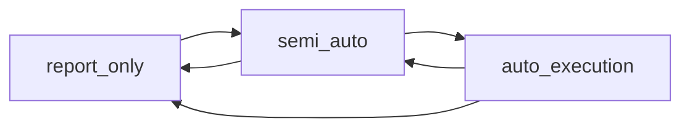

# 05.1 — Runtime Mode Governance & Kill Switch

> 父：[`README.md`](README.md) · 概念规格：[`../05-execution-risk-and-governance.md`](../05-execution-risk-and-governance.md) §1/§8/§10
>
> 闭环定位：**治理门禁闭环**。把"系统当前能做什么"做成受治理、可审计、fail-closed 的两个
> operational 控制面：运行模式（`report_only`/`semi_auto`/`auto_execution`，带转换矩阵 +
> preflight）与 kill switch（5 态 FSM）。后续 05.2–05.6 的每一道执行门都从这两个控制面取真值。

## 1. 目标与闭环定位

1. **模式转换矩阵 + preflight 引擎**：`ModeTransitionGate`（允许矩阵，§4）+ `ModePreflight`
   （进入 semi_auto/auto_execution 的检查清单，§5），接入 `switch_quant_mode`（当前无校验，
   [`runtime_control.rs`](../../../crates/quant-pivot-core/src/governance/runtime_control.rs) §42–57）。
2. **kill switch 5 态 FSM 服务**：`KillSwitchService` + `KillSwitchHandle`（ArcSwap 热读）+
   operational 单例持久化（05.0 `system_kill_switch` 表）+ 治理路由
   `GET/POST /api/system/kill-switch` + §6 行为表语义。
3. **治理审计**：mode change / kill-switch 转换均写 operation log（governed action，父文档 §10.1）。
4. **系统状态投影**：`ExecutionEmergencyView` 重构为真实 kill-switch 状态投影，进 `system_status`
   + WS `system.status`。
5. **metric**：`quant_auto_execution_halted`（kill-switch 阻断 auto 时置位）。

本子phase完成后，05.2 的 intent 创建可消费 `RuntimeModeGate`（基于真实 mode），05.3 admission 的
`RuntimeModeCheck` / `KillSwitchCheck` 可读真实状态，05.6 exit monitor 可读 emergency 触发退出。

## 2. 删除 / 合并 / 重构清单

### 2.1 重构（破坏式）

- `QuantRuntimeControl::switch_quant_mode`（[`runtime_control.rs`](../../../crates/quant-pivot-core/src/governance/runtime_control.rs) §42–57）：
  当前直接 `upsert + store`，无任何校验。重构：转换前依次跑 `ModeTransitionGate.check`（矩阵）+
  `ModePreflight.run`（检查清单），任一失败返回 `ExecutionError::ModeTransitionForbidden` /
  `ModePreflightDenied`，**不**持久化、**不** store（fail closed）。
- `ExecutionEmergencyView` / `ExecutionEmergencyClassView`
  （[`models/src/domain/governance/system.rs`](../../../crates/quant-pivot-models/src/domain/governance/system.rs) §21–48）：
  当前恒 `idle()`，占位。重构为 `KillSwitchView`（投影 `system_kill_switch` 真实状态）：
  `{ state: KillSwitchState, requires_operator_ack, last_reason, changed_by, changed_at }`。
  `SystemStatus.execution_emergency` 字段改名为 `kill_switch: KillSwitchView`。
- `QuantRuntimeControl::system_status`（[`runtime_control.rs`](../../../crates/quant-pivot-core/src/governance/runtime_control.rs) §59–61）：
  当前恒 `report_only_bootstrap`。重构为读真实 mode + kill-switch + operational phase。

### 2.2 合并

- runtime-config 布尔 kill_switch 已在 05.0 §2.2 删除（`enabled` → operational 单例）；本期消费
  `KillSwitchPolicy.emergency_exit`（05.0 §5.4）于 emergency 行为。

## 3. 新领域类型 / 表 / ClickHouse fact

- 无新表（`system_kill_switch` 在 05.0 已立）。
- 新值类型（`core/src/governance/` 或 `core/src/execution/`）：`ModeTransition` / `PreflightReport`
  / `PreflightCheck` / `KillSwitchTransition`（§5/§6）。
- `KillSwitchView`（`domain/governance/kill_switch.rs`，对外投影）。
- 无新 CH fact（mode/kill-switch 变更已由 operation log（WORM）完整审计；如需 CH 时序镜像可在 05.7
  顺带，非必需）。

## 4. 模式转换矩阵（父文档 §1.2）

```rust
// core/src/governance/mode_transition.rs
pub trait ModeTransitionGate: Send + Sync {
    fn check(&self, from: QuantRuntimeMode, to: QuantRuntimeMode)
        -> Result<(), ExecutionError>;     // ModeTransitionForbidden on illegal edge
}
```

允许的边（其余一律拒）：



**禁止直接** `report_only -> auto_execution`（必须先经 semi_auto shadow period）。`from == to` 视为
no-op（返回当前态，不跑 preflight）。

| from \ to | report_only | semi_auto | auto_execution |
|---|---|---|---|
| report_only | — | ✅ +preflight(semi) | ❌ forbidden |
| semi_auto | ✅ | — | ✅ +preflight(auto) |
| auto_execution | ✅ | ✅ | — |

> 降级（→ report_only / auto→semi）**不**跑业务 preflight（永远允许收紧），但仍写审计。升级
> （→ semi / → auto）必须过 preflight。

## 5. Preflight 引擎（父文档 §1.3）

> 实现说明（落地偏离，已生效）：`run` 返回 `QuantResult<PreflightReport>` —— 真正的基础设施失败
> （DB 不可达）经 `?` 上抛为 `QuantError`（web 映射 5xx），业务拒绝则收敛为失败的 hard 项
> （`report.passed == false` → `switch_quant_mode` 转 `ExecutionError::ModePreflightDenied` → 409）。
> `PreflightCheck` 增加显式 `hard: bool`，`report.passed = 所有 hard 项通过`（soft 项仅审计、不阻断）。

```rust
// models/src/domain/governance/mode.rs（对外投影 DTO）
pub trait ModePreflight: Send + Sync {            // core/src/governance/mode_preflight.rs
    async fn run(&self, target: QuantRuntimeMode) -> QuantResult<PreflightReport>;
}

pub struct PreflightReport {
    pub target: QuantRuntimeMode,
    pub checks: Vec<PreflightCheck>,
    pub passed: bool,                        // 全 hard 项通过
}

pub struct PreflightCheck {
    pub name: String,
    pub hard: bool,                          // 失败是否阻断转换
    pub passed: bool,
    pub detail: String,
}
```

进入 `semi_auto` 必须全部通过：

| 检查 | 数据源 |
|---|---|
| order client ready | `ClobClient` 已连接（05.4 ExecutionBundle 就绪；本期校验 keystore + clob auth 已 boot 成功） |
| credentials loaded | `DeployConfig.keys.private_key` + `quant.account.funder` present（[`config/validation.rs`](../../../crates/quant-pivot-models/src/config/validation.rs)） |
| JWT signing key strong | deploy JWT key 必须是 Base64URL-no-pad 编码的 32 个随机字节（复用 deploy config validation） |
| active model published or candidate approved | model registry（`PublicationStatus`） |
| data quality green | 最新 `quant_report_data_quality_snapshot` / `DataQualityStatus` |
| no blocking recovery state | 无 `unresolvable` 对账（`ReconciliationRepository::has_unresolvable`）、无 `Impaired` capital |
| risk envelope config valid | `portfolio.constraints` 校验通过 |

进入 `auto_execution` 额外（叠加 semi_auto 全部）：

| 额外检查 | 数据源 |
|---|---|
| published model | 必须有 active published model（不接受仅 candidate） |
| shadow period complete | model governance shadow 已稳定（`ShadowNotStable` 反向校验） |
| quality gates fresh | 质量门禁快照新鲜（TTL 内） |
| operator approval with reason | 切换请求带 operator + reason（`SwitchQuantModeRequest.reason` 非空 + acting role = operator） |
| auto policy limits set | `execution.admission` 阈值齐全 |
| kill switch closed | `KillSwitchState::Closed` |
| max capital budget set | `portfolio.budget.total_budget_usd > 0` |
| exit monitor healthy | exit monitor worker 已注册且健康（05.6；本期占位 = worker 已 spawn） |

> 实现：preflight 检查是**只读**聚合（无副作用），失败收集 detail 进 `PreflightReport`，整体
> fail-closed。`switch_quant_mode` 在 gate + preflight 全过后才 `upsert + store`。

## 6. Kill Switch 5 态 FSM（父文档 §8）

> 落地（已生效）：5 态行为表编码为 `KillSwitchState` 的 const 方法（`models/src/enums/execution.rs`，
> 单一真相、可测）；热读句柄 `KillSwitchHandle`（`ArcSwap`）委派这些方法；治理读写经
> `KillSwitchPort`（`models/src/domain/ports`）由 `KillSwitchControl`（`core/src/governance/kill_switch.rs`）
> 实现。`emergency_halted` 的 `allows_auto_exit()` 故意为 `false`：紧急清算走
> `requires_emergency_exit()` + `KillSwitchPolicy.emergency_exit`（05.6），不走常规自动出场路径。

```rust
// models/src/enums/execution.rs —— 行为表（const，纯函数）
impl KillSwitchState {
    pub const fn allows_new_entry(self) -> bool;        // 仅 Closed
    pub const fn allows_auto_exit(self) -> bool;        // Closed | ReportOnlyForced | ExitOnly
    pub const fn requires_emergency_exit(self) -> bool; // 仅 EmergencyHalted
    pub const fn is_emergency(self) -> bool;
}

// core/src/governance/kill_switch.rs
pub struct KillSwitchHandle { inner: Arc<ArcSwap<KillSwitchState>> }  // 仿 RuntimeModeHandle
pub struct KillSwitchControl { /* handle + KillSwitchStateRepository + MetricsHub + ArcSwap<KillSwitchView> */ }

// models/src/domain/ports/runtime_control.rs —— web 治理边界
#[async_trait]
pub trait KillSwitchPort: Send + Sync {
    fn current(&self) -> KillSwitchState;
    fn view(&self) -> KillSwitchView;
    async fn set(&self, command: SetKillSwitchCommand) -> QuantResult<KillSwitchView>;  // 持久化+store+metric（审计由 web 中间件）
}
```

行为表（5 态 × 报告/新入场/出场）：

| 状态 | 报告 | 新入场 | 出场 | `allows_new_entry` | `allows_auto_exit` | `requires_emergency_exit` |
|---|---|---|---|:---:|:---:|:---:|
| `closed` | 允许 | 允许 | 允许 | ✅ | ✅ | ❌ |
| `report_only_forced` | 允许 | 禁止 | 允许 | ❌ | ✅ | ❌ |
| `execution_halted` | 允许 | 禁止 | 禁止自动，人工可处理 | ❌ | ❌ | ❌ |
| `exit_only` | 允许 | 禁止 | 允许 | ❌ | ✅ | ❌ |
| `emergency_halted` | 可降级 | 禁止 | 按 emergency policy | ❌ | 按 policy | ✅ |

- **转换**：任意态 → 任意态均允许（kill switch 是安全阀，operator 可随时收紧/放开），但每次写审计 +
  `requires_operator_ack`（emergency → 非 emergency 需先 ack）。`Closed` → 其他 = 收紧；其他 →
  `Closed` = 解除（operator 操作）。
- **emergency_halted**：触发 05.6 exit monitor 按 `KillSwitchPolicy.emergency_exit`
  （`LiquidateAll` / `ManualOnly`）处理 open positions。
- **boot 恢复**：`KillSwitchStateRepository::load` 缺行 → fail-closed 重 seed `Closed`
  （仿 `restore_quant_runtime_mode`）。

## 7. deploy-config key 与 runtime-config v5 path

- 消费 `execution.kill_switch.emergency_exit`（05.0 §5.4）。
- 消费 `portfolio.budget` / `portfolio.constraints`（preflight 校验）。
- 无新增 deploy key。

## 8. 必建模块与 trait + 路由

> 落地（已生效，偏离原 §8）：mode-transition 矩阵 / preflight / kill-switch 均为**治理控制面**，
> 与 `runtime_mode.rs` / `runtime_control.rs` 同属 `core/src/governance/`（`execution/` 保留给
> admission / dispatcher / order_client 等执行流契约）。

```text
crates/quant-pivot-core/src/governance/
├── mode_transition.rs  # ModeTransitionGate + DefaultModeTransitionGate（矩阵）+ is_upgrade
├── mode_preflight.rs   # ModePreflight + DefaultModePreflight + ModePreflightDeps（检查清单）
├── kill_switch.rs      # KillSwitchHandle + KillSwitchControl（impl KillSwitchPort）
└── runtime_control.rs  # switch_quant_mode 接入 gate+preflight；system_status 投影真实态

crates/quant-pivot-models/src/
├── domain/governance/mode.rs        # PreflightReport / PreflightCheck（对外投影）
├── domain/governance/kill_switch.rs # + KillSwitchView
└── domain/ports/runtime_control.rs  # + KillSwitchPort / SetKillSwitchCommand；QuantModeTransitionReport.preflight

crates/quant-pivot-web/src/routes/system.rs   # + GET/POST /api/system/kill-switch
```

路由（仿 [`system.rs`](../../../crates/quant-pivot-web/src/routes/system.rs) §40–51 的 quant-mode）：

```rust
spec(Method::GET,  "/system/kill-switch",
     Rule::ResourceOp(ResourceType::System, Operation::Read), kill_switch_status),
spec(Method::POST, "/system/kill-switch",
     Rule::ActingRoleGoverned(ResourceType::System, Operation::Halt), set_kill_switch),
```

- 请求体 `SetKillSwitchRequest { state: KillSwitchState, reason: String(1..=1024), ack: bool }`
  （`domain/api/system.rs`，仿 `SwitchQuantModeRequest`）。
- `set_kill_switch` handler：`AuthedActor` + `ActingRole` + `OperationCtx`；写 op-log
  `action="system.set_kill_switch"`，detail `{ target_state, reason, ack }`；调
  `state.control.kill_switch().set(...)`。
- `kill_switch_status` → `KillSwitchView`。
- `RRole`：`operator` 持 `System:Halt`（已在 RESOURCE_OPERATIONS）；`emergency_operator` 持
  `System:Halt` 仅可设 `emergency_halted`/收紧（05.2 seed 校验，本期 handler 不区分，由 RBAC 矩阵
  控制能否调用）。

`switch_quant_mode` 重构后流程（`RuntimeControlPort::switch_quant_mode(target, actor, reason)
-> QuantResult<QuantModeTransitionReport>`，`QuantModeTransitionReport.preflight: Option<PreflightReport>`）：

```rust
let from = self.runtime_mode.current();
if from == target { return Ok(no_op_report(from)); }       // no-op：不跑 preflight、不持久化
self.transition_gate.check(from, target)?;                  // 矩阵（ModeTransitionForbidden）
let preflight = if is_upgrade(from, target) {               // 升级才跑业务 preflight
    let report = self.preflight.run(target).await?;
    if !report.passed { return Err(ExecutionError::ModePreflightDenied { reason: report.summary() }.into()); }
    Some(report)
} else { None };                                            // 降级：跳过业务 preflight，仍审计
self.runtime_state_repo.upsert_quant_runtime_mode(target, actor, reason).await?;
self.runtime_mode.store(target);
Ok(QuantModeTransitionReport { from, to: target, preflight })
```

## 9. 生产不变量与失败语义

- **fail closed**：升级 mode 任一 preflight hard 项失败 → 不切换、不持久化、写 op-log
  `outcome=Failure`。
- **降级永远允许**：→ report_only、auto→semi 不跑业务 preflight（安全方向不阻塞），仍审计。
- **kill switch 是安全阀**：任意 → 任意允许，但 emergency 解除需 `ack`；`Closed` 是唯一允许
  auto_execution 的态（与 preflight 一致）。
- **operational 真相单一**：mode 真值 = `system_runtime_state`；kill-switch 真值 =
  `system_kill_switch`；runtime-config 的 `execution.runtime_mode` 仅部署期初值声明，**不**作
  运行真相（05.0 §4.1）。
- **审计完整**：mode change + kill-switch set 必写 operation log（actor/role/action/before/after/
  reason/request_id）。
- **热读无锁**：mode + kill-switch 均 `ArcSwap`；admission/dispatcher/exit 热路径零 DB。
- **错误分层**：`ExecutionError::{ModeTransitionForbidden, ModePreflightDenied}`；web 映射 409。

## 10. 第三方 crate 引入

- 无新增。`arc_swap` 已在（`RuntimeModeHandle` 复用同模式）。

## 11. 验收测试（对照父文档 §15）

- `mode_transition_matrix_allows_only_spec_edges`（report_only→auto 拒；其余按矩阵）。
- `mode_transition_same_mode_is_noop_no_preflight`。
- `mode_downgrade_skips_business_preflight`（auto→semi→report_only 无需 model/quality）。
- `semi_auto_preflight_requires_credentials_and_data_quality`（缺凭证/DQ 红 → 拒切换）。
- `auto_execution_preflight_requires_kill_switch_closed`（kill-switch≠Closed → 拒）。
- `auto_execution_preflight_requires_published_model_and_shadow`。
- `switch_quant_mode_fail_closed_does_not_persist_on_preflight_fail`（mode 不变，op-log Failure）。
- `kill_switch_behavior_table_matches_spec`（5 态 × allows_new_entry/auto_exit/emergency）。
- `kill_switch_set_persists_and_audits`（upsert + op-log）。
- `kill_switch_boot_reseeds_closed_when_missing`。
- `kill_switch_emergency_requires_ack_to_clear`。
- `system_status_projects_real_kill_switch_state`（非恒 idle）。
- `quant_auto_execution_halted_metric_set_when_blocked`。
- Web：`POST /api/system/kill-switch` 需 operator acting role（403 无 role / 非授权角色）。

## 12. Blocker

- 若 `report_only -> auto_execution` 直达成功（跳过 semi_auto shadow），失败。
- 若升级 mode 不跑 preflight 或 preflight 失败仍切换（非 fail-closed），失败。
- 若 kill-switch operational 状态仍源自 runtime-config 布尔，失败。
- 若 5 态行为表任一格与父文档 §8 不符，失败。
- 若 mode/kill-switch 变更不写 operation log，失败。
- 若 `system_status` 仍恒 `idle()` / `report_only_bootstrap`，失败。

## 13. 延后 / 缺口

> 完整索引见 [`README.md`](README.md) §6。

- **exit monitor healthy 检查**：本期 preflight 占位为"worker 已 spawn"；真实健康度（监控覆盖率/
  延迟）→ 05.6 接入后回填。
- **order client ready 检查**：本期校验 keystore + clob auth 已 boot；真实下单连通性探测 → 05.4
  ExecutionBundle 落地后强化。
- **多副本 mode/kill-switch 一致性**（leader 选举）→ Phase 8+（本期单实例 + ArcSwap + DB 单例）。
