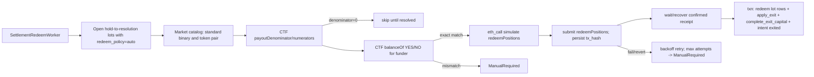

# 05.10 — AutoRedeem Settlement (CTF On-Chain)

<!-- quant-pivot-lifecycle-contract:v1 -->
> **Lifecycle contract**
> - `lifecycle_assumption`: 项目尚未正式生产上线，当前状态为 `pre_production_resettable`，系统自有基线统一为 `boot` / schema version `1`。
> - `schema_data_version_impact`: 本文中的历史版本号与递增路径不再具有实施效力；当前实现不迁移测试数据、旧结构或旧版本。
> - `pre_production_behavior`: 允许 clean-break、migration squash 与全新基础设施 bootstrap，但任何数据销毁仍需操作者单独授权。
> - `production_frozen_behavior`: 一旦完成不可逆 production seal，后续变更必须提供前向 migration、兼容性评估、回滚方案与数据验证。
> - `rollback_and_data_verification`: 封存前通过清空后的 fresh-install 验证；封存后不得回退到 boot reset。

> 父：[`README.md`](README.md) · 前置：[`05.6-exit-lifecycle-and-monitor.md`](05.6-exit-lifecycle-and-monitor.md)
> · 账户/结算：[`../09-account-capital-position-reconciliation.md`](../09-account-capital-position-reconciliation.md)
> · API 层：[`../02-crate-refactor-and-deletion-plan.md`](../02-crate-refactor-and-deletion-plan.md)（删除旧 redeem-first 语义）

## 1. 目标与闭环定位

闭合 `ExitSettlementMode::HoldToResolution` + `RedeemPolicy::Auto` 的**链上结算尾项**。

05.6 已实现：

- `HoldToResolution` → exit monitor **不主动平仓**；保护性 stop/signal/emergency 仍可触发。
- `RedeemPolicy::Auto` 在 intent 冻结的 `ExitPolicySpec` 中投影；05.10 实现标准二元 CTF redeem。

本子phase交付：市场 resolved 后，对满足 `HoldToResolution + Auto` 的标准二元 lot 调用
Polymarket CTF `redeemPositions(pUSD, 0x0, condition_id, [1, 2])`，pUSD 回 funder；随后在同一
Postgres 事务中写 per-lot resolution payout、`apply_exit(ResolutionRedeem)`、`complete_exit_capital`、
`exit_state=Exited`。

**依赖：** 05.6 R3 per-lot ledger + capital FSM `complete_exit_capital` 模式可复用于 resolution payout。

## 2. 删除 / 合并 / 重构清单

- 确认无 Endgame `redeem_routing` / redeem-first 热路径残留（02 删除清单已列；实现时 grep 验证）。
- 不恢复 `runtime_config/redeem_routing.rs`（06-config 已删 key）。

## 3. 新领域类型 / 表 / ClickHouse fact

### 3.1 API 层（quant-pivot-api）

```text
crates/quant-pivot-api/src/
└── ctf/mod.rs          # alloy sol! 绑定 + 标准二元 payout/balance/simulate/submit/recover
```

```rust
pub struct CtfClient; // façade: binary_payout_vector, binary_balances, simulate, submit, recover
pub struct CtfPendingRedeem; // exposes tx_hash before waiting for receipt
```

- 签名身份：与 05.4 `OrderSigner` **同一私钥**，按 `wallet_kind` 拓扑路由：
  - `Eoa`：signer 直接发起 `redeemPositions` 并自付 gas；signer address 必须等于
    `quant.account.funder`（启动 `WalletTopology::resolve` 校验，否则 fail closed）。
  - `Proxy` / `GnosisSafe`：资金/持仓在代理钱包里，EOA 仅作签名者。改走 Polymarket
    gasless relayer（`quant-pivot-api::relayer`）：Safe 走 `SafeTx` EIP-712 + `execTransaction`，
    Proxy 走 GSN `RelayHub` 结构哈希；funder 必须等于 CREATE2 推导地址（启动校验）。
- 链：Polygon mainnet；RPC 来自 `[polymarket.onchain].rpc_endpoint` 的 typed source；relayer 来自 `[polymarket.relayer]`。
- 合约常量：CTF `0x4D97...76045`、pUSD `0xC011...82DFB`，relayer Safe/Proxy factory 与
  `RelayHub` 均为编译期常量；不是 runtime tunable。

### 3.2 Core worker

```text
crates/quant-pivot-core/src/
├── execution/settlement_redeem.rs      # 编排：scan lots → preflight → submit/recover → ledger
└── app/settlement_redeem_worker.rs     # TaskId::SettlementRedeemWorker
```

### 3.3 Settlement redeem ledger

- `quant_settlement_redeem`：一条 `(market_id, funder_address)` redemption batch，记录 state、tx_hash、
  index_sets、payout vector、pre/post balance evidence、payout_usd、gas_fee_pol、retry 状态。
- `quant_settlement_redeem_lot`：batch 内 per-position lot 分摊，唯一约束 `position_id`，防二次赎回。
- Intent/position 复用现有 `exit_state=Exited` + `ExitReason::ResolutionRedeem` + `PositionLedgerState::Closed`。

**无新 CH fact 必需**；可选 mirror `quant_settlement_redeem_event`。

## 4. 流程



**realized PnL（resolution）：**

```text
payout_usd = lot.shares × payout_numerator(side) / payout_denominator
realized_pnl = payout_usd − lot.cost_usd
```

gas 以 `gas_fee_pol` 单独记录；未做 POL→USD 汇率换算，`payout_usd` 是 settlement collateral gross payout。

## 5. deploy-config / runtime-config

```toml
[quant.account]
funder = "0x..."         # eoa: 必须等于 signer EOA；proxy/gnosis_safe: 必须等于 CREATE2 推导地址
wallet_kind = "eoa"      # "eoa" | "proxy" | "gnosis_safe"

[polymarket.onchain]
rpc_endpoint = { source = "systemd_credential", credential = { name = "polygon-rpc-url" } }

[polymarket.relayer]     # proxy / gnosis_safe gasless 赎回所需（eoa 忽略）
base_url = "https://relayer-v2.polymarket.com"
api_key = { name = "polymarket-relayer-api-key" }
# api_key_address = "0x..." # non-secret signer EOA address
request_timeout_ms = 15000

[execution.settlement_redeem] # runtime-config
enabled = true
interval_secs = 300
batch_size = 32
max_attempts = 5
retry_backoff_secs = 300
confirmation_blocks = 3
allow_during_emergency = false
hold_to_resolution_enabled = false   # 开启后 composer 对临近 resolution 的仓位产出 HoldToResolution + Auto
hold_to_resolution_within_secs = 86400
```

## 6. 生产不变量与失败语义

- **fail-closed**：链上 tx revert / RPC 不可用 → 不臆测 payout；告警 + 重试，耗尽后 `ManualRequired`。
- **幂等**：`quant_settlement_redeem (market_id, funder_address)` 唯一；`quant_settlement_redeem_lot.position_id`
  唯一；confirmed row 跳过。
- **余额精确匹配**：redeem 会 burn funder 对该 condition 的全部 YES/NO index sets；因此提交前必须校验
  `chain_balance(YES/NO) == system_open_lot_shares(YES/NO)`。任何额外手工持仓、缺失 lot、token/side mismatch
  都转 `ManualRequired`，禁止自动 redeem。
- **与 CLOB exit 互斥**：只扫描 `Open` 且 exit FSM 非 in-flight/manual/terminal 的 hold-to-resolution lot；
  已 `Closed`/exit submitted 的 lot skip。
- **capital 守恒**：payout 入账与 position close 同一 PG 事务。
- **submitted recovery**：tx hash 在等待 receipt 前落库；worker 重启后按 tx hash 查询 receipt，
  区分 `Pending / Confirmed / Reverted`。等待 receipt 的 RPC 错误只保留 `Submitted` 进入恢复路径，
  不回退为 `Failed` 后重发。
- **kill-switch**：`execution_halted` 不阻塞 redeem（资金回收）；`emergency_halted` 默认暂停，除非
  `allow_during_emergency=true`。

## 7. 第三方 crate 引入

- `alloy`（合约绑定 + tx 发送）：仅在 `quant-pivot-api::ctf`。
- 禁止：core 直接依赖 alloy；core 只消费 `SettlementCtfClient` façade。

## 8. 验收测试

- `redeem_worker_scans_auto_hold_to_resolution_lots_only`。
- `successful_redeem_closes_lot_and_releases_capital`。
- `redeem_idempotent_after_success`。
- `redeem_failure_preserves_position_and_retries`。
- `manual_required_when_chain_balance_exceeds_strategy_lots`。
- `submitted_redeem_recovers_from_persisted_tx_hash`。
- integration：mocked `SettlementCtfClient` trait；Polygon fork test 延后到 Phase 8 CI 环境。

## 9. Blocker

- 若 redeem 绕过 per-lot ledger 写 aggregate position，失败。
- 若 wallet 拓扑校验失败（eoa: signer != funder；proxy/gnosis_safe: funder != CREATE2 推导地址），启动失败。
- 若 proxy/gnosis_safe 但缺 `[polymarket.relayer]` 凭证（upgrade 时），preflight `credentials_loaded` 失败。
- 若 `HoldToResolution` lot 在未 resolved 时 redeem，失败。

## 10. 延后 / 缺口

- **Proxy / Gnosis Safe**：已支持，经 Polymarket gasless relayer 赎回（Safe `execTransaction` /
  Proxy GSN）。余额归属仍以链上 `balanceOf(funder)` 精确匹配证明。Deposit-wallet 形态延后。
- **NegRisk / multi-outcome 复杂 index set**：本期 `ManualRequired`；后续增加 NegRisk Adapter
  专用 relayer 路径（`redeemPositions(conditionId, amounts)` + unwrap）和金额级 redeem。
- **Gas USD 归因**：本期记录 `gas_fee_pol`；若 attribution 需要净 USD PnL，后续引入 POL/USD source。
- **Polygon fork test**：需要稳定 fork RPC/CI secret；Phase 8 CI 环境补。
