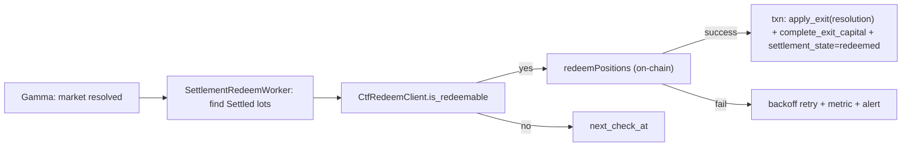

# 05.10 — AutoRedeem Settlement (CTF On-Chain)

> 父：[`README.md`](README.md) · 前置：[`05.6-exit-lifecycle-and-monitor.md`](05.6-exit-lifecycle-and-monitor.md)
> · 账户/结算：[`../09-account-capital-position-reconciliation.md`](../09-account-capital-position-reconciliation.md)
> · API 层：[`../02-crate-refactor-and-deletion-plan.md`](../02-crate-refactor-and-deletion-plan.md)（删除旧 redeem-first 语义）

## 1. 目标与闭环定位

闭合 `SettlementPolicy::AutoRedeem` / `HoldToResolution` 的**链上结算尾项**。

05.6 已实现：

- `HoldToResolution` → exit monitor **不主动平仓**；市场 resolution 后 position → `Settled`。
- `SettlementPolicy::AutoRedeem` 在 intent 冻结的 `ExitPolicySpec` 中已投影；**链上 redeem 未 impl**。

本子phase交付：市场 resolved 后，对 `Settled` lot 调用 Polymarket CTF `redeemPositions`，
USDC 回 funder → 更新 per-lot realized PnL（resolution payout）+ capital `Spent→Released`（或
`Released` 增量），与 05.6 exit fill 同事务语义。

**依赖：** 05.6 R3 per-lot ledger + capital FSM `complete_exit_capital` 模式可复用于 resolution payout。

## 2. 删除 / 合并 / 重构清单

- 确认无 Endgame `redeem_routing` / redeem-first 热路径残留（02 删除清单已列；实现时 grep 验证）。
- 不恢复 `runtime_config/redeem_routing.rs`（06-config 已删 key）。

## 3. 新领域类型 / 表 / ClickHouse fact

### 3.1 API 层（quant-pivot-api）

```text
crates/quant-pivot-api/src/
├── polymarket/ctf/
│   ├── mod.rs
│   ├── contracts.rs    # alloy sol! 绑定 ConditionalTokens / NegRisk 等
│   └── redeem.rs       # CtfRedeemClient::redeem_positions(...)
```

```rust
pub struct RedeemRequest {
    pub condition_id: ConditionId,
    pub index_sets: Vec<U256>,   // outcome index sets per CTF spec
    pub collateral_token: Address,
}

pub trait CtfRedeemClient: Send + Sync {
    async fn redeem_positions(&self, req: RedeemRequest) -> QuantResult<TxReceipt>;
    async fn is_redeemable(&self, condition_id: &ConditionId) -> QuantResult<bool>;
}
```

- 签名身份：与 05.4 `OrderSigner` **同一私钥 / funder**（EOA 或 proxy wallet，按 Polymarket 账户类型）。
- 链：Polygon mainnet（与 CLOB 一致）；RPC 来自 deploy-config `polygon_rpc_url`。

### 3.2 Core worker

```text
crates/quant-pivot-core/src/
├── settlement/
│   ├── redeem_worker.rs      # TaskId::SettlementRedeem
│   └── redeem_service.rs     # 编排：scan Settled lots → redeem → ledger
```

### 3.3 Intent / position 扩展（可选列）

- `quant_order_intent.settlement_state`：`pending_redeem` / `redeemed` / `redeem_failed`（pg_enum）。
- 或复用 `exit_state=Exited` + position `Settled→Closed` 仅在 redeem 成功后。

**无新 CH fact 必需**；可选 mirror `quant_settlement_redeem_event`。

## 4. 流程



**realized PnL（resolution）：**

```text
payout_usd = redeemed_collateral − gas_cost_allocated
realized_pnl = payout_usd − lot.avg_price × lot.shares   // 全量 redeem；partial index set 按份额比例
```

gas 记 `execution_cost_usd` 或单独 `redeem_fee_usd`（05.7 attribution 可见）。

## 5. deploy-config / runtime-config

```toml
# deploy-config
[polygon]
rpc_url = "..."
ctf_conditional_tokens = "0x..."   # Polymarket CTF 合约地址

[execution.settlement]
redeem_enabled = true
redeem_worker_secs = 300
max_redeem_retries = 5
gas_limit = 500000
```

## 6. 生产不变量与失败语义

- **fail-closed**：链上 tx revert / RPC 不可用 → 保持 `Settled`，不臆测 payout；告警 + 重试。
- **幂等**：同一 lot 成功 redeem 后不可二次 redeem（`settlement_state=redeemed` 守卫）。
- **与 CLOB exit 互斥**：lot 必须 `Settled` 且未通过 CLOB 全平；若 05.6 已 `Closed`，skip。
- **capital 守恒**：payout 入账与 position close 同一 PG 事务。
- **kill-switch**：`execution_halted` **不阻塞** redeem（资金回收属安全操作；与 05.1 emergency 语义对齐，需在实现时显式 allowlist）。

## 7. 第三方 crate 引入

- `alloy`（合约绑定 + tx 发送）：`quant-pivot-api` feature `ctf`（默认关，bin 按需开）。
- 禁止：在 core 直接依赖 alloy（经 api façade + `ApiError`）。

## 8. 验收测试

- `redeem_worker_scans_settled_lots_only`。
- `successful_redeem_closes_lot_and_releases_capital`。
- `redeem_idempotent_after_success`。
- `redeem_failure_preserves_settled_state`。
- `realized_pnl_includes_resolution_payout_net_gas`（pg fixture）。
- integration：CTF fork test 或 mocked `CtfRedeemClient` trait。

## 9. Blocker

- 若 redeem 绕过 per-lot ledger 写 aggregate position，失败。
- 若私钥 scope 超出 funder 账户，失败。
- 若 `HoldToResolution` lot 在未 resolved 时 redeem，失败。

## 10. 延后 / 缺口

- **NegRisk / multi-outcome 复杂 index set** → 随 Polymarket 市场类型扩展（首版 binary resolved）。
- **Gas 策略 / EIP-1559 动态费** → ops 调优，非阻塞首版。
