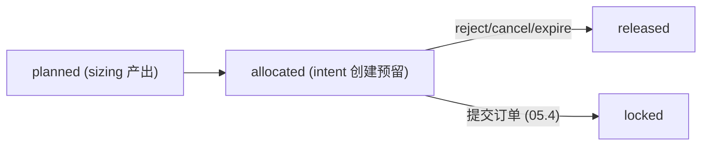

# 05.2 — OrderIntent Service (create / approve)

<!-- quant-pivot-deployment-contract:v1 -->
> **Deployment contract**
> - `fresh_boot_assumption`: 项目尚未正式生产上线，将从全新 `boot` / schema version `1` 部署；仓库和数据库不保存 lifecycle seal 状态。
> - `schema_data_version_impact`: 本文中的历史版本号与递增路径不再具有实施效力；当前实现不迁移测试数据、旧结构或旧版本。
> - `pre_deployment_behavior`: 允许 clean-break、migration squash 与全新基础设施 bootstrap，但任何数据销毁仍需操作者单独授权。
> - `post_deployment_behavior`: 首次部署后使用正常前向 migration、回滚与数据验证；不使用不可逆 production seal 或兼容桥。
> - `rollback_and_data_verification`: 首次部署前通过清空后的 fresh-install 验证；部署后使用备份、前向 migration 与显式回滚。

> 父：[`README.md`](README.md) · 概念规格：[`../05-execution-risk-and-governance.md`](../05-execution-risk-and-governance.md) §2/§3/§13/§16.1/§16.3、
> [`../09-account-capital-position-reconciliation.md`](../09-account-capital-position-reconciliation.md) §4
>
> 闭环定位：**意图 + 审批闭环**。把 published recommendation 经 mode gate 转成受治理的
> `OrderIntent`（semi_auto → `PendingApproval`，auto → `ApprovedByPolicy`，report_only → 拒），
> 并实现人工审批/拒绝/取消 + 审批失效 + 资金预留（capital FSM `planned → allocated → released`）+
> 对外 API + WS + 过期 sweep。**本子phase不提交订单**（提交属 05.4，须过 admission 05.3）。

## 1. 目标与闭环定位

1. `RuntimeModeGate` impl（`DefaultRuntimeModeGate`）：基于真实 mode（05.1）+ recommendation 的
   `ExecutionEligibility` 产出 `IntentPolicyDecision`。
2. `OrderIntentService` impl（`CoreOrderIntentService`）：`create_from_recommendation` /
   `approve` / `reject` / `cancel`，全部受治理、写 op-log、与 capital FSM 同事务。
3. **审批失效**（父文档 §3.2）：recommendation 过期 / report revoked / model retired / config 版本
   变 / envelope hash mismatch / DQ 降级 / kill-switch 开 → intent 立即失效。
4. **capital FSM**（planned → allocated 创建预留；reject/cancel/expire → released）。
5. **API**：`POST /api/quant/intents`、`/{id}/approve`、`/{id}/reject`、`/{id}/cancel`、
   `GET /api/quant/intents`、`GET /api/quant/intents/{id}`（DTO 三层 + RBAC operator）。
6. **WS**：`quant.intent.*` 事件频道。
7. **过期 sweep worker**：`IntentExpirySweep`（PeriodicTask）把超 `expires_at` 的 pending intent
   置 `Expired` + 释放 capital。

本子phase完成后，05.3 可对 `Approved`/`ApprovedByPolicy` intent 评估 admission，05.4 可提交。

## 2. 删除 / 合并 / 重构清单

### 2.1 删除

- `create-intent` 501 stub（[`web/src/routes/quant_recommendations.rs`](../../../crates/quant-pivot-web/src/routes/quant_recommendations.rs) §80–90）：
  **删除**，由 `POST /api/quant/intents` 取代（语义：从 recommendation 创建 intent）。

### 2.2 重构

- ~~`ReservedCapitalReader` 数据源重构~~ **已在 05.0 完成（本期 no-op）**：
  [`reserved_capital.rs`](../../../crates/quant-pivot-repository/src/postgres/quant/reserved_capital.rs)
  / [`capital_allocation.rs`](../../../crates/quant-pivot-repository/src/postgres/quant/capital_allocation.rs)
  的 `sum_reserved_usd` 已读 `quant_capital_allocation`（`GREATEST(allocated, locked) - spent -
  released`，状态 ∈ allocated/locked/impaired）；core `ReservedCapitalReader::sum_locked` 已委派该
  聚合。05.2 不再涉及该重构。
- **`OrderIntentRepository` 破坏式重设计为「intent + capital 复合原子事务」**（as-built）：单表
  `create_pending` / `create_policy_approved` / `approve`（intent-only）废弃，替换为
  `create_with_allocation` / `approve(+entry/allocated override)` / `reject` / `cancel` /
  `expire(+oplog)` / `invalidate(+oplog)`，每个方法在**一个 PG 事务**内同时迁移 intent FSM 与
  capital FSM（背景发起的 expire/invalidate 额外写 op-log）。新增读：`find_by_id` / `page` /
  `find_active_by_report`（report-termination 级联）。`get_for_update` / `mark_admission_rejected` /
  `transition`（→ AdmissionPending/Submitted）保留给 05.4。
- **`CapitalAllocationRepository` 收敛为只读**（`find_by_intent` / `sum_reserved_usd` /
  `has_impaired`）：capital 写入只发生在 OrderIntent 复合事务内（资金真相单源、与 intent 状态原子）；
  invariant helper（`capital_invariant_ok` / `validate_non_negative`）抽为共享函数复用。

## 3. 新领域类型 / 表 / ClickHouse fact

- 无新表（`quant_order_intent` / `quant_capital_allocation` 已在）。
- 新 API DTO（`domain/api/quant_execution.rs`，新建——04.0 删除的死 DTO 在此按需重定义）：
  - `CreateIntentRequest`（wire）/ `ApproveIntentRequest` / `RejectIntentRequest` /
    `CancelIntentRequest` / `OrderIntentListQuery` / `OrderIntentView`（response）。
- 新值类型（`core/src/execution/intent_service.rs`）：service 内部 `CreateIntentRequest`
  （core 命令，区别于 web wire）/ `ApprovalInvalidation`（枚举）。
- 复用：`OrderIntentInfo` / `NewOrderIntent` / `ApproveOrderIntent`
  （[`domain/quant/execution.rs`](../../../crates/quant-pivot-models/src/domain/quant/execution.rs)）、
  `EntryOrderSpec` / `ExitPolicySpec`（[`types/execution_payload.rs`](../../../crates/quant-pivot-models/src/types/execution_payload.rs)）。

```rust
// enums（wire_enum，审批失效原因，父文档 §3.2）
pub enum ApprovalInvalidation {
    RecommendationExpired, ReportRevoked, ModelRetired,
    ConfigVersionChanged, RiskEnvelopeHashMismatch,
    DataQualityDegraded, KillSwitchOpened,
}
```

## 4. mode gate（父文档 §16.1）

```rust
// core/src/execution/mode_gate.rs（impl）
impl RuntimeModeGate for DefaultRuntimeModeGate {
    fn intent_policy(&self, mode, recommendation) -> IntentPolicyDecision {
        // 1. report_only → ReportOnly（永不创建）
        // 2. recommendation 不 eligible(mode) → Denied(RecommendationIneligible)
        // 3. risk_envelope 无效 / auto_execution_allowed=false 且 mode=auto → Denied
        // 4. semi_auto → RequiresApproval { approval_ttl: config.execution.semi_auto.approval_ttl_secs }
        // 5. auto_execution + envelope.auto_execution_allowed → ApprovedByPolicy { policy_id, reason }
    }
}
```

判定输入来自 recommendation 的强类型 `ExecutionEligibility`（Phase 4 落库，`eligible_modes` +
`ineligibility_reasons` + `approval_required`）与 `RiskEnvelope.auto_execution_allowed`。审批权限由
API 层 Casbin RBAC 强制执行，不在 runtime-config 或 report payload 中携带角色名。

## 5. intent 创建流程（父文档 §16.3，确定性 + 事务）

```rust
pub async fn create_from_recommendation(request, deps) -> QuantResult<OrderIntentInfo> {
    let rec = deps.recommendations.find_by_id(request.recommendation_id).await?
        .ok_or(NotFound)?;
    if rec.is_expired(deps.clock.now()) { return Err(ExecutionError::RecommendationExpired(..)); }

    let report = deps.reports.find_report(rec.report_id).await?.ok_or(NotFound)?;
    report.ensure_published()?;                       // revoked/expired → 拒

    let mode = deps.mode.current();                   // 05.1 真实 mode
    if !deps.kill_switch.allows_new_entry() {         // 05.1 kill-switch
        return Err(ExecutionError::KillSwitchBlocks("intent creation"));
    }
    let policy = deps.mode_gate.intent_policy(mode, &rec);

    match policy {
        ReportOnly => Err(ExecutionError::ReportOnlyMode),
        Denied { reason } => Err(ExecutionError::IntentDenied(reason)),
        RequiresApproval { approval_ttl } => {
            // ONE txn: intent(PendingApproval) + capital_allocation(Allocated, planned=allocated=sizing.suggested_usd) + op-log
            deps.tx.create_pending_intent_with_allocation(NewOrderIntent::pending(
                rec, mode, deps.clock.now() + approval_ttl,
            )).await
        }
        ApprovedByPolicy { policy_id, reason } => {
            // ONE txn: intent(ApprovedByPolicy) + capital_allocation(Allocated) + op-log(policy_id/hash/reason)
            deps.tx.create_policy_approved_intent_with_allocation(NewOrderIntent::policy_approved(
                rec, mode, policy_id, reason,
            )).await
        }
    }
}
```

创建规则（父文档 §2.3）：

- `report_only`：不创建 intent（`ExecutionError::ReportOnlyMode`）。
- `semi_auto`：创建 `PendingApproval` intent；**必须**有 `expires_at`（= now + ttl）；创建 ≠ 批准。
- `auto_execution`：policy 创建 `ApprovedByPolicy` intent；**必须**记录 policy id / policy hash /
  reason（写 op-log + intent 字段）。
- intent 冻结（父文档 §2.1）：`recommendation_id` / `runtime_mode` / `entry_order_json`（从 rec 的
  `EntryPlan` + `SizingPlan` 投影为 `EntryOrderSpec`）/ `exit_policy_json`（从 `ExitPlan` 投影为
  `ExitPolicySpec`）/ `risk_envelope_hash`（= rec 的 `envelope_hash`）/ config 版本 / model 版本 /
  approval 状态。

## 6. 审批 / 拒绝 / 取消（父文档 §3）

```rust
async fn approve(&self, req: ApproveIntentRequest) -> QuantResult<OrderIntentInfo>;
async fn reject(&self,  req: RejectIntentRequest)  -> QuantResult<OrderIntentInfo>;
async fn cancel(&self,  req: CancelIntentRequest)  -> QuantResult<OrderIntentInfo>;
```

审批请求字段（父文档 §3.1）：acting role / operator id / reason / max allowed USD / optional
override note。

**审批前重新校验失效条件**（§7），任一命中 → `invalidate` + 拒绝审批（fail closed）：

```rust
// approve 内（事务内 re-check）：
ensure_not_invalidated(&intent, &rec, &report, mode, kill_switch, config_version, dq)?;
// 允许的下调（不放宽）：size ≤ planned、limit_price 不高于 rec、可 reject、可要求重生成报告。
// 禁止：改 recommendation 核心字段 / 改模型输出 / 放宽 risk envelope / 延长 valid_until。
```

- **approve**：`PendingApproval → Approved`；写 `approved_by` / `approval_reason` / `approved_at`；
  capital `Allocated`（保持；锁定在 05.4 提交时）；op-log `action="quant.intent.approve"`。允许
  operator 下调 size（≤ planned）/ 下调 limit price → 重算 `entry_order_json`（仍 ≤ rec 边界，
  envelope hash 不变，因 hash 锚的是 risk 上限非具体 size）。
- **reject**：`PendingApproval → Rejected`；capital `Allocated → Released`（全额释放）；op-log。
  `operator` 与 `risk_owner` 均可 reject（risk 可拒不可批，§9 RBAC）。
- **cancel**：`{PendingApproval, Approved, ApprovedByPolicy} → Cancelled`（未提交才可 cancel）；
  capital `→ Released`；op-log。（已 `Submitted` 的 cancel = 撤场内单，属 05.4。）

角色（已拍板复用 operator）：approve / cancel 需 `operator`；reject 需 `operator` 或 `risk_owner`。

## 7. 审批失效（父文档 §3.2）

以下任一为真，intent 立即失效（`invalidate`，记录 `ApprovalInvalidation`）：

| 条件 | 检测 |
|---|---|
| recommendation expired | `rec.valid_until < now` |
| report revoked | `report.status == Revoked` |
| model version retired | model registry 查 `intent.model_version` 已 retire |
| runtime config version changed in money-critical path | `intent.config_version != active_config_version` 且 money-critical 段（portfolio/execution）有差异 |
| risk envelope hash mismatch | 重算 rec `RiskEnvelope` hash ≠ `intent.risk_envelope_hash` |
| data quality degraded below threshold | 最新 DQ snapshot < 阈值 |
| kill switch opened | `!kill_switch.allows_new_entry()` |

失效作用：approve 时命中 → 拒绝审批（不进 Approved）；已 Approved 未提交的 intent 由 05.4 提交前
admission 再次拦截（`RiskEnvelopeHashCheck` 等）。失效写 op-log + WS `quant.intent.invalidated`。

## 8. capital FSM 写入（09 §4，本子phase覆盖 planned/allocated/released）



- intent 创建（pending/policy）：写 `quant_capital_allocation`（state=`Allocated`，
  `planned_usd=allocated_usd=sizing.suggested_usd`），**与 intent 同事务**。
- reject/cancel/expire：`Allocated → Released`（`released_usd=allocated_usd`），与 intent 状态迁移
  同事务。
- locked/spent/impaired → 05.4。

## 9. 必建模块 / trait / API / WS / worker

As-built（较 05.0 草案收敛抽象，去掉冗余 trait 层）：

```text
crates/quant-pivot-models/src/domain/ports/order_intent.rs   # OrderIntentPort + Command 结构（web 边界）
crates/quant-pivot-models/src/domain/api/quant_execution.rs  # 新 wire(Request/Query) + OrderIntentView
crates/quant-pivot-core/src/execution/
├── mode_gate.rs        # DefaultRuntimeModeGate（impl RuntimeModeGate）
└── intent_service.rs   # CoreOrderIntentService（impl OrderIntentPort + IntentInvalidationHook
                        #   + expire_due；投影/re-check/下调 纯函数）；IntentInvalidationHook trait
crates/quant-pivot-core/src/app/intent_service.rs  # 服务装配 + 级联钩子注入 + IntentExpireSweep 注册
crates/quant-pivot-web/src/routes/quant_intents.rs # 新路由模块（6 端点）
```

**抽象决策（as-built）**：05.0 占位的 `OrderIntentService` trait（缺 reject、缺下调）删除；单一
`CoreOrderIntentService` 同时实现 web `OrderIntentPort`（create/approve/reject/cancel/list/find）、
report 级联 `IntentInvalidationHook`、以及 sweep 用的 `expire_due`，不再额外引入 `intent_port.rs` /
`IntentTransaction` 包装层（事务封装下沉到 repository 复合方法）。报告级联钩子覆盖 **revoke 与
expire** 两条终态（dependency inversion：`ReportLifecycleService` 持 `Option<Arc<dyn
IntentInvalidationHook>>`，boot 时注入）。

API 端口（仿 `QuantReportPort` / `CoreQuantReportPort`，
[`models/src/domain/ports/quant_report.rs`](../../../crates/quant-pivot-models/src/domain/ports/quant_report.rs)）：

```rust
#[async_trait]
pub trait OrderIntentPort: Send + Sync {
    async fn create(&self, cmd: CreateIntentCommand) -> QuantResult<OrderIntentInfo>;
    async fn approve(&self, cmd: ApproveIntentCommand) -> QuantResult<OrderIntentInfo>;
    async fn reject(&self, cmd: RejectIntentCommand) -> QuantResult<OrderIntentInfo>;
    async fn cancel(&self, cmd: CancelIntentCommand) -> QuantResult<OrderIntentInfo>;
    async fn list(&self, query: OrderIntentListQuery)
        -> QuantResult<Paginated<OrderIntentInfo>>;
    async fn find(&self, id: &OrderIntentId) -> QuantResult<Option<OrderIntentInfo>>;
}
```

路由 + RBAC：

| Method | Path | Rule |
|---|---|---|
| POST | `/api/quant/intents` | `ActingRoleGoverned(OrderIntent, Create)` |
| POST | `/api/quant/intents/{id}/approve` | `ActingRoleGoverned(OrderIntent, Approve)` |
| POST | `/api/quant/intents/{id}/reject` | `ActingRoleGoverned(OrderIntent, Reject)` |
| POST | `/api/quant/intents/{id}/cancel` | `ActingRoleGoverned(OrderIntent, Cancel)` |
| GET | `/api/quant/intents` | `ResourceOp(OrderIntent, Read)` |
| GET | `/api/quant/intents/{id}` | `ResourceOp(OrderIntent, Read)` |

Casbin seed（05.0 §5.6 已加目录）：`operator` = `OrderIntent:{Create,Approve,Reject,Cancel,Read}`；
`risk_owner` += `OrderIntent:{Reject,Read}`；`viewer/analyst` += `OrderIntent:Read`。

WS（仿 `quant.report.*`，[`domain/runtime/core_event.rs`](../../../crates/quant-pivot-models/src/domain/runtime/core_event.rs)）：
新增 `WsChannel::QuantIntent`（resource = `OrderIntent`），事件
`quant.intent.{created, approved, rejected, cancelled, expired, invalidated}`，payload
`IntentLifecycleEvent { event, order_intent_id, recommendation_id, status, reason }`。

过期 sweep（仿 `report_expire_sweep`）：`IntentExpirySweep`（`PeriodicTask`，cadence =
`execution.intent.expiry_sweep_secs`）查 `find_expired(now)` → `Expired` + capital `Released` +
WS `quant.intent.expired`。

## 10. 生产不变量与失败语义

- **report_only 永不创建 intent**：mode gate 第一关；测试覆盖。
- **创建 ≠ 批准**：semi_auto 创建只到 `PendingApproval`；未审批无法被 05.4 提交。
- **intent 必有 expires_at**（semi_auto）：缺失即 bug；sweep 兜底过期。
- **单事务**：intent 状态迁移与 capital FSM 迁移 **同一 PG 事务**（任一失败全回滚），避免"扣了
  预留但 intent 没建"或反之。**审计事务边界（as-built 决策）**：HTTP 发起的
  `create/approve/reject/cancel` 由 `operation_audit` 中间件审计（与所有受治理路由一致）；**仅后台
  发起**的 `expire`（sweep）/ `invalidate`（report-termination 级联）把 `NewOperationLog` 写进同一
  业务事务（无 HTTP envelope 兜底，故事务性审计绝不丢失）。approve 时命中失效条件 → 在事务内
  `invalidate`（写 op-log）并拒绝审批。
- **审批 fail closed**：approve 前事务内 re-check 全部失效条件；命中即拒（不进 Approved）。
- **不放宽**：审批只能下调 size/limit、拒绝、要求重生成；禁止改 rec 核心/模型/放宽 envelope/
  延长 valid_until（代码层校验 + 测试）。
- **资金真相单源**：reserved 来自 `quant_capital_allocation`（重构后），不再双账。
- **幂等**：重复 approve/reject/cancel 同 intent → 基于当前 status 的 FSM 校验拒绝非法转换
  （复用 `validate_intent_transition`）。
- **错误分层**：`ExecutionError::{ReportOnlyMode, RecommendationExpired, IntentDenied,
  ApprovalInvalid, KillSwitchBlocks}`；web 映射 409。

## 11. 第三方 crate 引入

- 无新增。复用 actix / sea-orm / async-trait / 现有 WS 总线。

## 12. 验收测试（对照父文档 §15）

- `report_only_mode_never_creates_intent`（父文档 §15 第 1 条）。
- `semi_auto_creates_pending_approval_with_expiry`。
- `auto_execution_creates_approved_by_policy_with_policy_id_hash_reason`。
- `create_intent_denied_when_recommendation_ineligible_for_mode`。
- `create_intent_blocked_when_kill_switch_disallows_entry`。
- `create_intent_reserves_capital_in_same_txn`（intent + allocation 原子）。
- `approve_transitions_pending_to_approved_and_audits`。
- `approve_rejected_when_recommendation_expired`（审批失效，§15 第 4 条）。
- `approve_rejected_when_risk_envelope_hash_mismatch`（§15 第 5 条）。
- `approve_rejected_when_kill_switch_opened`。
- `approve_cannot_widen_risk_envelope_or_extend_valid_until`。
- `approve_allows_size_downscale_only`。
- `reject_releases_capital`（Allocated → Released）。
- `cancel_releases_capital_only_before_submitted`。
- `reject_allowed_for_risk_owner_but_approve_is_not`（RBAC）。
- `intent_expiry_sweep_expires_and_releases`。
- `ws_emits_quant_intent_lifecycle_events`。
- Web：`POST /api/quant/intents` 需 operator acting role；create-intent 501 stub 已删。

## 13. Blocker

- 若 report_only 能创建 intent，失败。
- 若 semi_auto 未审批即可被提交，失败（提交门在 05.4，但 intent 状态必须停在 Approved 前）。
- 若 intent 与 capital 不同事务（可出现孤儿预留/孤儿 intent），失败。
- 若审批能放宽 envelope / 延长 valid_until / 改 rec 核心，失败。
- 若审批失效条件任一未在 approve 前 re-check，失败。
- 若 reserved capital 仍按 intent status 双账（未切 capital FSM），失败。
- 若 `create-intent` 501 stub 残留，失败。

## 14. 延后 / 缺口

> 完整索引见 [`README.md`](README.md) §6。

- **提交（submit）/ admission** → 05.3（评估）+ 05.4（提交）。本期 intent 最多到 `Approved`/
  `ApprovedByPolicy`，capital 最多到 `Allocated`。
- **`get_for_update` / `mark_admission_rejected`** → 05.4（提交时行锁 + 拒绝写入）。
- **capital `locked`/`spent`/`impaired`** → 05.4/05.5。
- **审批失效中 model retired / config diff 的精细 money-critical 比对** → 05.3 admission 复核兜底
  （本期 approve 时做粗粒度版本相等性检查）。
