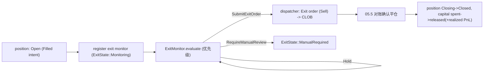

# 05.6 — Exit Lifecycle & Monitor

<!-- quant-pivot-lifecycle-contract:v1 -->
> **Lifecycle contract**
> - `lifecycle_assumption`: 项目尚未正式生产上线，当前状态为 `pre_production_resettable`，系统自有基线统一为 `boot` / schema version `1`。
> - `schema_data_version_impact`: 本文中的历史版本号与递增路径不再具有实施效力；当前实现不迁移测试数据、旧结构或旧版本。
> - `pre_production_behavior`: 允许 clean-break、migration squash 与全新基础设施 bootstrap，但任何数据销毁仍需操作者单独授权。
> - `production_frozen_behavior`: 一旦完成不可逆 production seal，后续变更必须提供前向 migration、兼容性评估、回滚方案与数据验证。
> - `rollback_and_data_verification`: 封存前通过清空后的 fresh-install 验证；封存后不得回退到 boot reset。

> 父：[`README.md`](README.md) · 概念规格：[`../05-execution-risk-and-governance.md`](../05-execution-risk-and-governance.md) §6/§16.5
>
> **后续覆盖（Phase 11.7）**：退出监控只消费 intent 冻结的 `ScaleOutTarget`、
> `TrailingStopPolicy` 与 `ThesisInvalidationPolicy`，统一持久化 `ScaleOutState`；已删除
> `signal_invalidation_ratio`、`PartialExitNode`、`SignalInvalidationRule`、
> `OpportunisticExitState` 与重复的 `ExitTriggerKind`。下文旧符号是 Phase 05 历史设计记录，
> 不再是活跃契约。
>
> 闭环定位：**退出监控闭环**。每个 filled intent 必须注册 exit monitor，按固定优先级评估 TP/SL/
> time/signal/kill-switch 触发，产出 `ExitDecision`（hold / submit exit order / require manual），
> 提交平仓单（复用 05.4 dispatcher，phase=Exit）、推进 `ExitState`、释放/结算 capital、更新 position
> 账本。Exit plan 是 position lifecycle 的一部分，不依赖人工记忆（父文档 §0）。

## 0. As-built 实现说明（05.6 落地，权威）

实现期对原始设计做了如下**已拍板的破坏式调整**（与用户对齐，钱相关取最精确口径）：

- **R3 per-lot 持仓账本**：`quant_position` 改为**每个入场 intent 一个 lot**（代理主键 `PositionId` +
  `order_intent_id` 唯一 + `token_id` 索引）。`apply_fill` 只在**同一 intent** 的成交间加权平均，故
  `avg_price` 是该 lot 的**精确实现成本**（绝不跨 intent 混合）。退出 realized PnL 因此精确
  （`(exit_price − lot.avg_price) × shares − exit_fee`），05.7 归因标签精确，结构上不可能 double-exit。
  按 token 聚合改为查询视图（`find_lots_by_token` / `aggregate`）。
- **退出生命周期状态落 `quant_order_intent`**：新增列 `exit_state`(qp_exit_state)、`exit_reason`
  (qp_exit_reason，`ExitReason` 已 pg 化)、`next_check_at`、`peak_mark_price`、`last_signal_recheck_at`。
- **`ExitPolicySpec` 忠实冻结完整 `ExitPlan`**：补 `take_profit_pct`/`stop_loss_pct`/`max_hold_secs`/
  `trailing_stop`/`signal_invalidation_rules`/`manual_review_at`，并冻结 `entry_reference_price` +
  `entry_composite_score`。退出阶梯**只依赖 intent 冻结值**，不再读 recommendation（signal 维度除外）。
- **统一 `ExitSignalEvaluator` seam**：`ExitSignalVerdict{ ThesisInvalidated / OpportunisticSell{sell_pct}
  / Holds / Indeterminate }`。本期 `ReinferenceSignalEvaluator` 实现 thesis-invalidation 的**分数退化**
  判定（fresh `composite_score < entry × signal_invalidation_ratio` ∨ 不再 eligible ∨ `expected_return ≤ 0`）；
  re-inference 走窄口径 `ExitSignalReinferer` seam（**06.0** `ModelBackedExitSignalReinferer` 生产默认；
  `shadow_mode=true` 时 audit-only；`enabled=false` → `Indeterminate` fail-safe）。**机会性 Sell
  `OpportunisticSell` 的模型 impl 延后 **Phase 6.1**
- **trailing 折叠进 stop-loss**：`effective_stop = max(stop_loss_price, peak_mark×(1−trail_bps))`，
  触发记 `ExitReason::StopLoss`；`peak_mark_price` 每 tick 更新并持久化。
- **`HoldToResolution`**：抑制 take-profit/time/partial/opportunistic 等"获利/超时"档，仅保留保护性档
  （emergency / data-stale / market-abnormal / stop-loss / signal-invalidation）；结算后的自动赎回由
  05.10 的 `RedeemPolicy::Auto` 处理（§11）。
- **退出提交事务**：`ExecutionSubmissionRepository::create_exit_order_and_mark_closing`
  （write-ahead：Exit order Submitted + lot `Open→Closing` + intent `exit_state=OrderSubmitted`）+
  `record_exit_result(ExitLedgerWrite)`（终态：`apply_exit` + `complete_exit_capital`(`Spent→Released`，
  partial 维持 `Spent`) + exit FSM + 失败回退 `Closing→Open` + 可选 recon enqueue）。`CoreExitDispatcher`
  编排并喂 `breaker.observe_venue` + `observe_realized_pnl`。
- **对账相位感知**：`apply_reconciliation` 对 `order_phase=Exit` 走 `apply_exit`+`complete_exit_capital`
  修正（非入场 `apply_fill`），不动入场 intent.status；`token_balance` 聚合校验对 per-lot 仍是安全下界。
- **breaker 日内已实现亏损维度**：`observe_realized_pnl`（UTC 日界清零）；≥80% cap → `Degraded`(admission
  `#18` defer)，≥cap → `trip_kill_switch("daily_loss")`(latch)；config `execution.breaker.daily_realized_loss_cap_usd`。
- **admission `#20` 真实化**：`ExitMonitorHealthHandle`(ArcSwap) 由 worker 每次成功扫描发布心跳；
  builder 读 `is_ready(now)`（spawned ∧ now−last_scan ≤ 2×monitor_secs）；mode preflight `exit_monitor_healthy`
  由 soft 占位改为 hard 真实检查。config `execution.exit_monitor.{enabled,monitor_secs,signal_recheck_secs,signal_invalidation_ratio}`。

## 1. 目标与闭环定位

1. **exit monitor 注册**：每个 `Filled`/`PartiallyFilled` intent（有 open position）注册退出监控：
   price / time / signal invalidation / kill switch / manual action 五类监控（父文档 §6.1）。
2. **退出优先级**（父文档 §16.5）：kill-switch emergency > stop-loss > signal invalidated > time exit >
   take-profit > hold。
3. **退出动作 + 状态**：`ExitReason` × `ExitState`（05.0），含 partial exit。
4. **强制退出**（父文档 §6.4）：kill-switch emergency / risk envelope breached / stop loss / signal
   invalidated / market abnormal / data stale → 强制退出或转人工。
5. **平仓单提交**：复用 05.4 `ExecutionDispatcher`（`ExecutionOrderPhase::Exit`，side=Sell）；capital
   `spent → released`（结算后含 realized PnL）；position `Closing → Closed`。
6. **exit worker**（`ExitMonitorWorker`，`TaskId::ExitMonitor`）+ **metric** `quant_exit_triggers_total`。

本子phase完成后，05.7 attribution 可基于完整 entry+exit outcome 归因。

## 2. 删除 / 合并 / 重构清单

- 无删除（净新增）。
- 复用 05.4 `ExecutionDispatcher` / `PolymarketOrderClient` / `PgExecutionOrderRepository`（退出单是
  `ExecutionOrderPhase::Exit` 的同表行）；复用 05.5 对账（退出单对账走同引擎）。

## 3. 新领域类型 / 表 / ClickHouse fact

- 无新表（退出单复用 `quant_execution_order`，`order_phase=Exit`；退出状态用 `quant_position.state`
  + 可选 `quant_order_intent` 关联）。
- 新值类型（`core/src/execution/exit_monitor.rs`）：`ExitMonitorInput` / `ExitDecision` /
  `ExitOrderSpec`（从 intent `ExitPolicySpec` + 当前 book/position 投影）。
- 复用：`ExitPolicySpec`（[`types/execution_payload.rs`](../../../crates/quant-pivot-models/src/types/execution_payload.rs)）、
  `ExitState` / `ExitReason`（05.0）、`PartialExitNode`、`ExitSettlementMode`、`RedeemPolicy`。

```rust
pub struct ExitMonitorInput {
    pub position: PositionInfo,                  // open/partially exited
    pub intent: OrderIntentInfo,                 // 含 exit_policy_json
    pub exit_policy: ExitPolicySpec,
    pub book: Option<BookSnapshot>,              // 当前价（TP/SL/trailing 判定）
    pub kill_switch: KillSwitchState,            // 05.1
    pub emergency_policy: EmergencyExitPolicy,    // 05.0 §5.4
    pub data_fresh: bool,                         // data stale 强制退出判定
    pub now: DateTime<Utc>,
}

pub enum ExitDecision {
    Hold { next_check_at: DateTime<Utc> },
    SubmitExitOrder { reason: ExitReason, order: ExitOrderSpec },
    RequireManualReview { reason: ExitReason },
}
```

## 4. 退出优先级（父文档 §16.5，确定性短路）

```rust
fn decide_exit(input: &ExitMonitorInput) -> ExitDecision {
    if input.kill_switch == EmergencyHalted {       // 1. 最高优先
        return emergency_exit(input);                //    按 emergency_policy：LiquidateAll | ManualOnly
    }
    if !input.data_fresh && beyond_exit_threshold(input) {
        return RequireManualReview { reason: DataStale };  // data stale → 人工
    }
    if market_abnormal(input) {
        return RequireManualReview { reason: MarketAbnormal };
    }
    if stop_loss_triggered(input) { return stop_loss_exit(input); }   // 2
    if signal_invalidated(input)  { return signal_invalidation_exit(input); }  // 3
    if time_exit_due(input)       { return time_exit(input); }         // 4
    if take_profit_triggered(input) { return take_profit_exit(input); } // 5
    if let Some(node) = next_partial_exit_due(input) { return partial_exit(input, node); }
    ExitDecision::Hold { next_check_at: input.next_scheduled_check() }
}
```

退出动作（父文档 §6.2）：`take_profit_exit` / `stop_loss_exit` / `time_exit` / `partial_exit` /
`signal_invalidated_exit` / `manual_exit` / `settlement_hold`（按 `ExitSettlementMode::HoldToResolution`
持有到结算，不主动平仓）。

强制退出/转人工（父文档 §6.4）：kill-switch emergency（按 policy）/ risk envelope breached / stop loss /
signal invalidated / market status abnormal / data stale beyond threshold。

## 5. 退出执行流程（复用 05.4 dispatcher）



- **退出单提交**：构造 `ExitOrderSpec`（side=Sell、price=TP/SL/limit、shares=全部或 partial `sell_pct`、
  order_type=按紧急度 FOK/GTC）→ 复用 05.4 `submit`（但退出单**不**走入场 admission 20 检查；退出有
  独立轻量门：kill-switch allows_auto_exit、credential ready、venue guard）。
- **capital**：退出成交后 `spent → released`，写 `realized_pnl_usd`（position 累计）；partial exit 按
  比例释放。
- **position**：`Open → Closing`（提交退出单）→ `Closed`（全平）/ `PartiallyExited`（partial）→
  `Settled`（HoldToResolution 市场 resolution 后）。
- **退出单对账**：与入场一致走 05.5（`Ambiguous` 退出单同样不臆测，入对账）。

## 6. exit monitor 注册 + worker

```text
crates/quant-pivot-core/src/execution/
└── exit_monitor.rs   # ExitMonitor + DefaultExitMonitor + ExitMonitorService + CoreExitMonitorWorker

crates/quant-pivot-core/src/app/
└── periodic_services.rs  # + ExitMonitorWorker（TaskId::ExitMonitor）
```

- **注册**：05.4 fill 成交（或 05.5 对账确认 filled）后，position 进 `Open` 即由 worker 纳入监控集
  （`PositionRepository::find_open`）。无需独立注册表——open position 即"必须被监控"的真相源
  （父文档 §6.1："每个 filled intent 必须注册 exit monitor"通过 open position 全量扫描保证覆盖）。
- **worker**：`ExitMonitorWorker`（PeriodicTask，cadence `execution.exit.monitor_secs`）：拉 open
  positions → 每个 `evaluate` → 按 decision 提交退出单/转人工/hold。kill-switch `allows_auto_exit()`
  控制是否自动提交（execution_halted 下只标记 triggered，不自动平，转人工）。
- **emergency**：kill-switch `EmergencyHalted` → 按 `EmergencyExitPolicy`：`LiquidateAll` 全平
  （FOK/市价、max_slippage 限制），`ManualOnly` 全转 `ManualRequired`。

## 6.5 熔断器 feed（日内已实现亏损）+ `ExitMonitorReadiness` 真实化

接入 05.4 `ExecutionBreaker`（§6.5）的**第三个维度**与 admission `#20` 的真实健康态：

- **日内已实现亏损维度**：每次退出成交结算出 `realized_pnl_usd` 后（§5），调用
  `ExecutionBreaker::observe_realized_pnl(pnl, now)`，breaker 累计**当日**（UTC 日界，与 05.9 权益
  快照同口径）已实现亏损：
  - 累计亏损 ≥ 80% × `daily_realized_loss_cap_usd` → `VenueHealth::Degraded`（admission `#18` defer，
    放缓新入场）；
  - 累计亏损 ≥ `daily_realized_loss_cap_usd` → 自动 trip kill-switch 到 `execution_halted`（latch +
    operator ack），当日不再自动新入场。日界翻转时累计清零（但已 latch 的 kill-switch 仍须人工 ack
    解除——fail-closed）。
  - 数据源：05.4 fills（入场成本）+ 本子phase退出 realized PnL，构成 05.9 权益曲线的同一笔流水（单一
    真相源，不双账）。
- **`ExitMonitorReadiness`（admission `#20`）真实化**：05.3 占位 `exit_monitor_ready = true` 由本子phase
  替换为真实健康态——`ExitMonitorWorker` 心跳（上次成功扫描时间在 `2 × monitor_secs` 内）+ worker 已
  spawn。`AdmissionInputBuilder` 读该健康 handle 填 `exit_monitor_ready`；worker 不健康 → admission
  `#20` deny（不开新仓，避免开了却无人监控退出）。

## 7. 生产不变量与失败语义

- **退出不依赖人工记忆**：open position 必被 worker 扫描；exit policy 来自 intent 冻结的
  `ExitPolicySpec`（父文档 §0）。
- **优先级确定性**：严格按 §4 顺序短路；同输入同决策（无随机，除 `input.now`/book）。
- **强制退出 fail-closed**：data stale / market abnormal / 无法判定 → 转人工（`ManualRequired`），
  不臆测平仓价；kill-switch emergency 强制按 policy。
- **kill-switch 门**：`allows_auto_exit()` 为 false（execution_halted）时不自动提交退出单，标记
  triggered + 转人工（父文档 §8：execution_halted 出场"禁止自动，人工可处理"）。
- **capital/position 守恒**：退出 `spent → released`（+realized PnL）与 position 状态同事务；partial
  按比例；`Ambiguous` 退出单入对账不臆测。
- **退出单也对账**：复用 05.5，退出单 `Ambiguous` 同样 fail-closed。
- **settlement hold**：`HoldToResolution` 不主动平仓，position → `Settled`（市场 resolution 后由
  [`05.10`](05.10-auto-redeem-settlement.md) 链上 redeem 或人工处理；05.6 仅标记 `Settled`）。
- **错误分层**：`ExecutionError::KillSwitchBlocks`（emergency）；venue 错误经 `ApiError`。

## 8. 第三方 crate 引入

- 无新增（复用 05.4 dispatcher + order client + BookStore + 05.5 对账）。

## 9. 验收测试（对照父文档 §15）

- `exit_monitor_registered_for_every_filled_position`（§15 第 6 条：每 filled order 注册）。
- `exit_priority_emergency_over_stop_loss_over_signal_over_time_over_take_profit`（§16.5 顺序）。
- `stop_loss_triggers_exit_order`。
- `take_profit_triggers_exit_order`。
- `time_exit_at_due_triggers_exit`。
- `signal_invalidated_triggers_exit`。
- `partial_exit_node_sells_pct_and_releases_proportional_capital`。
- `kill_switch_execution_halted_marks_triggered_not_auto_submitted`（§8 行为）。
- `kill_switch_emergency_liquidate_all_submits_exits`（按 emergency policy）。
- `kill_switch_emergency_manual_only_routes_to_manual`。
- `data_stale_routes_to_manual_review`（不臆测平仓）。
- `exit_order_fill_releases_capital_with_realized_pnl`。
- `exit_order_ambiguous_enqueues_recon`（复用 05.5）。
- `settlement_hold_does_not_submit_exit`。
- `quant_exit_triggers_total_increments_by_reason`。
- `exit_decision_deterministic_for_same_input`。
- `daily_realized_loss_cap_trips_execution_breaker`（日内累计亏损 ≥ cap → kill-switch `execution_halted`
  latch；≥ 80% → admission `#18` defer；breaker §6.5）。
- `exit_monitor_unhealthy_denies_admission_exit_monitor_readiness`（worker 心跳过期 → admission `#20`
  deny）。

## 10. Blocker

- 若 filled position 未被纳入退出监控（漏监控），失败。
- 若退出优先级与父文档 §16.5 不符，失败。
- 若 execution_halted 下自动平仓（违背 §8），失败。
- 若 data stale / 无法判定时臆测平仓价（非转人工），失败。
- 若退出 capital/position 不守恒或不同事务，失败。
- 若退出单 `Ambiguous` 不入对账，失败。

## 11. 延后 / 缺口

> 完整索引见 [`README.md`](README.md) §6。原则：**凡延后项必须指向后续 phase 子文档的详细设计**，
> 不得仅写「Phase N 再做」。

### 11.1 Phase 5 收尾（紧随 05.6，非 ML 范畴）

| 延后能力 | 详细设计 | 为何不在 05.6 核心 |
|---|---|---|
| `ExitSettlementMode::HoldToResolution + RedeemPolicy::Auto` 链上 CTF 赎回 | **[`05.10-auto-redeem-settlement.md`](05.10-auto-redeem-settlement.md)**（alloy `redeemPositions`、`TaskId::SettlementRedeemWorker`、per-lot payout 落账） | 独立 on-chain venue 集成；05.6 仅冻结 hold-to-resolution 退出策略，不提交 redeem |

### 11.2 Phase 6（ML 扩展 — 闭合 05.6 预留 seam）

| 延后能力 | 详细设计 | 05.6 本期预留 |
|---|---|---|
| 机会性 Sell 排序模型（`OpportunisticSell`） | **[`../phase-06/06.1-opportunistic-sell-exit-signal.md`](../phase-06/06.1-opportunistic-sell-exit-signal.md)**（`CompositeExitSignalEvaluator`、Sell scorer artifact、shadow 期、阶梯第 9 档） | `ExitSignalEvaluator` seam + `ExitReason::Opportunistic` + metric 标签；`ReinferenceExitSignalEvaluator` 仅 thesis-invalidation |
| 跨账户周期 reconciliation report | **[`../phase-06/06.2-cross-account-reconciliation-report.md`](../phase-06/06.2-cross-account-reconciliation-report.md)**（登记于 05.5 §11） | — |

> 通用多模型编排见 [`08`](../08-third-party-crates-and-ml-stack.md) §20；**退出侧 opportunistic 闭环以 06.1 为准**（§20 不含 Sell 专用契约）。

### 11.3 Phase 8+（部署架构）

| 延后能力 | 详细设计 | 05.6 本期替代 |
|---|---|---|
| 多副本 exit/recon/dispatch leader 选举 | **[`../phase-08/README.md`](../phase-08/README.md)** §2（`apalis` / lease、`LeaderElectedTask`） | 单实例 + Postgres advisory lock |
| Trailing stop 高频 peak 跟踪 | **[`../phase-08/README.md`](../phase-08/README.md)** §3（book-driven peak 或 `trailing_eval_ms`） | `monitor_secs` 周期评估 `effective_stop`（首版足够） |

### 11.4 已收回 Phase 5（不再延后）

- **真实回撤回灌 planner** → **05.9**（本子phase exit realized PnL 为权益曲线输入）。
- **执行侧 Sell 平仓** → **本子phase**（TP/SL/time/partial/invalidation 完整覆盖；与 06.1 机会性模型正交）。
