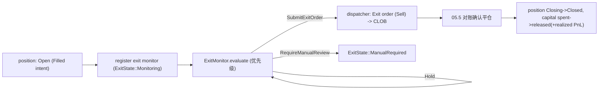

# 05.6 — Exit Lifecycle & Monitor

> 父：[`README.md`](README.md) · 概念规格：[`../05-execution-risk-and-governance.md`](../05-execution-risk-and-governance.md) §6/§16.5
>
> 闭环定位：**退出监控闭环**。每个 filled intent 必须注册 exit monitor，按固定优先级评估 TP/SL/
> time/signal/kill-switch 触发，产出 `ExitDecision`（hold / submit exit order / require manual），
> 提交平仓单（复用 05.4 dispatcher，phase=Exit）、推进 `ExitState`、释放/结算 capital、更新 position
> 账本。Exit plan 是 position lifecycle 的一部分，不依赖人工记忆（父文档 §0）。

## 1. 目标与闭环定位

1. **exit monitor 注册**：每个 `Filled`/`PartiallyFilled` intent（有 open position）注册退出监控：
   price / time / signal invalidation / kill switch / manual action 五类监控（父文档 §6.1）。
2. **退出优先级**（父文档 §16.5）：kill-switch emergency > stop-loss > signal invalidated > time exit >
   take-profit > hold。
3. **退出动作 + 状态**：`ExitReason` × `ExitState`（05.0），含 partial exit。
4. **强制退出**（父文档 §6.4）：kill-switch emergency / risk envelope breached / stop loss / signal
   invalidated / market abnormal / data stale → 强制退出或转人工。
5. **平仓单提交**：复用 05.4 `ExecutionDispatcher`（`ExecutionOrderPhase::Exit`，side=Sell）；capital
   `spent → released`（结算后含 realized PnL）；position `Closing → Closed`。
6. **exit worker**（`ExitMonitorWorker`，`TaskId::ExitMonitor`）+ **metric** `quant_exit_triggers_total`。

本子phase完成后，05.7 attribution 可基于完整 entry+exit outcome 归因。

## 2. 删除 / 合并 / 重构清单

- 无删除（净新增）。
- 复用 05.4 `ExecutionDispatcher` / `PolymarketOrderClient` / `PgExecutionOrderRepository`（退出单是
  `ExecutionOrderPhase::Exit` 的同表行）；复用 05.5 对账（退出单对账走同引擎）。

## 3. 新领域类型 / 表 / ClickHouse fact

- 无新表（退出单复用 `quant_execution_order`，`order_phase=Exit`；退出状态用 `quant_position.state`
  + 可选 `quant_order_intent` 关联）。
- 新值类型（`core/src/execution/exit_monitor.rs`）：`ExitMonitorInput` / `ExitDecision` /
  `ExitOrderSpec`（从 intent `ExitPolicySpec` + 当前 book/position 投影）。
- 复用：`ExitPolicySpec`（[`types/execution_payload.rs`](../../../crates/quant-pivot-models/src/types/execution_payload.rs)）、
  `ExitState` / `ExitReason`（05.0）、`PartialExitNode`、`SettlementPolicy`。

```rust
pub struct ExitMonitorInput {
    pub position: PositionInfo,                  // open/partially exited
    pub intent: OrderIntentInfo,                 // 含 exit_policy_json
    pub exit_policy: ExitPolicySpec,
    pub book: Option<BookSnapshot>,              // 当前价（TP/SL/trailing 判定）
    pub kill_switch: KillSwitchState,            // 05.1
    pub emergency_policy: EmergencyExitPolicy,    // 05.0 §5.4
    pub data_fresh: bool,                         // data stale 强制退出判定
    pub now: DateTime<Utc>,
}

pub enum ExitDecision {
    Hold { next_check_at: DateTime<Utc> },
    SubmitExitOrder { reason: ExitReason, order: ExitOrderSpec },
    RequireManualReview { reason: ExitReason },
}
```

## 4. 退出优先级（父文档 §16.5，确定性短路）

```rust
fn decide_exit(input: &ExitMonitorInput) -> ExitDecision {
    if input.kill_switch == EmergencyHalted {       // 1. 最高优先
        return emergency_exit(input);                //    按 emergency_policy：LiquidateAll | ManualOnly
    }
    if !input.data_fresh && beyond_exit_threshold(input) {
        return RequireManualReview { reason: DataStale };  // data stale → 人工
    }
    if market_abnormal(input) {
        return RequireManualReview { reason: MarketAbnormal };
    }
    if stop_loss_triggered(input) { return stop_loss_exit(input); }   // 2
    if signal_invalidated(input)  { return signal_invalidation_exit(input); }  // 3
    if time_exit_due(input)       { return time_exit(input); }         // 4
    if take_profit_triggered(input) { return take_profit_exit(input); } // 5
    if let Some(node) = next_partial_exit_due(input) { return partial_exit(input, node); }
    ExitDecision::Hold { next_check_at: input.next_scheduled_check() }
}
```

退出动作（父文档 §6.2）：`take_profit_exit` / `stop_loss_exit` / `time_exit` / `partial_exit` /
`signal_invalidated_exit` / `manual_exit` / `settlement_hold`（按 `SettlementPolicy::HoldToResolution`
持有到结算，不主动平仓）。

强制退出/转人工（父文档 §6.4）：kill-switch emergency（按 policy）/ risk envelope breached / stop loss /
signal invalidated / market status abnormal / data stale beyond threshold。

## 5. 退出执行流程（复用 05.4 dispatcher）



- **退出单提交**：构造 `ExitOrderSpec`（side=Sell、price=TP/SL/limit、shares=全部或 partial `sell_pct`、
  order_type=按紧急度 FOK/GTC）→ 复用 05.4 `submit`（但退出单**不**走入场 admission 20 检查；退出有
  独立轻量门：kill-switch allows_auto_exit、credential ready、venue guard）。
- **capital**：退出成交后 `spent → released`，写 `realized_pnl_usd`（position 累计）；partial exit 按
  比例释放。
- **position**：`Open → Closing`（提交退出单）→ `Closed`（全平）/ `PartiallyExited`（partial）→
  `Settled`（HoldToResolution 市场 resolution 后）。
- **退出单对账**：与入场一致走 05.5（`Ambiguous` 退出单同样不臆测，入对账）。

## 6. exit monitor 注册 + worker

```text
crates/quant-pivot-core/src/execution/
└── exit_monitor.rs   # ExitMonitor + DefaultExitMonitor + ExitMonitorService + CoreExitMonitorWorker

crates/quant-pivot-core/src/app/
└── periodic_services.rs  # + ExitMonitorWorker（TaskId::ExitMonitor）
```

- **注册**：05.4 fill 成交（或 05.5 对账确认 filled）后，position 进 `Open` 即由 worker 纳入监控集
  （`PositionRepository::find_open`）。无需独立注册表——open position 即"必须被监控"的真相源
  （父文档 §6.1："每个 filled intent 必须注册 exit monitor"通过 open position 全量扫描保证覆盖）。
- **worker**：`ExitMonitorWorker`（PeriodicTask，cadence `execution.exit.monitor_secs`）：拉 open
  positions → 每个 `evaluate` → 按 decision 提交退出单/转人工/hold。kill-switch `allows_auto_exit()`
  控制是否自动提交（execution_halted 下只标记 triggered，不自动平，转人工）。
- **emergency**：kill-switch `EmergencyHalted` → 按 `EmergencyExitPolicy`：`LiquidateAll` 全平
  （FOK/市价、max_slippage 限制），`ManualOnly` 全转 `ManualRequired`。

## 6.5 熔断器 feed（日内已实现亏损）+ `ExitMonitorReadiness` 真实化

接入 05.4 `ExecutionBreaker`（§6.5）的**第三个维度**与 admission `#20` 的真实健康态：

- **日内已实现亏损维度**：每次退出成交结算出 `realized_pnl_usd` 后（§5），调用
  `ExecutionBreaker::observe_realized_pnl(pnl, now)`，breaker 累计**当日**（UTC 日界，与 05.9 权益
  快照同口径）已实现亏损：
  - 累计亏损 ≥ 80% × `daily_realized_loss_cap_usd` → `VenueHealth::Degraded`（admission `#18` defer，
    放缓新入场）；
  - 累计亏损 ≥ `daily_realized_loss_cap_usd` → 自动 trip kill-switch 到 `execution_halted`（latch +
    operator ack），当日不再自动新入场。日界翻转时累计清零（但已 latch 的 kill-switch 仍须人工 ack
    解除——fail-closed）。
  - 数据源：05.4 fills（入场成本）+ 本子phase退出 realized PnL，构成 05.9 权益曲线的同一笔流水（单一
    真相源，不双账）。
- **`ExitMonitorReadiness`（admission `#20`）真实化**：05.3 占位 `exit_monitor_ready = true` 由本子phase
  替换为真实健康态——`ExitMonitorWorker` 心跳（上次成功扫描时间在 `2 × monitor_secs` 内）+ worker 已
  spawn。`AdmissionInputBuilder` 读该健康 handle 填 `exit_monitor_ready`；worker 不健康 → admission
  `#20` deny（不开新仓，避免开了却无人监控退出）。

## 7. 生产不变量与失败语义

- **退出不依赖人工记忆**：open position 必被 worker 扫描；exit policy 来自 intent 冻结的
  `ExitPolicySpec`（父文档 §0）。
- **优先级确定性**：严格按 §4 顺序短路；同输入同决策（无随机，除 `input.now`/book）。
- **强制退出 fail-closed**：data stale / market abnormal / 无法判定 → 转人工（`ManualRequired`），
  不臆测平仓价；kill-switch emergency 强制按 policy。
- **kill-switch 门**：`allows_auto_exit()` 为 false（execution_halted）时不自动提交退出单，标记
  triggered + 转人工（父文档 §8：execution_halted 出场"禁止自动，人工可处理"）。
- **capital/position 守恒**：退出 `spent → released`（+realized PnL）与 position 状态同事务；partial
  按比例；`Ambiguous` 退出单入对账不臆测。
- **退出单也对账**：复用 05.5，退出单 `Ambiguous` 同样 fail-closed。
- **settlement hold**：`HoldToResolution` 不主动平仓，position → `Settled`（市场 resolution 后由对账/
  redeem 处理；本期标记 `Settled`，链上 `AutoRedeem` 见 §11 具体设计，作为 Phase 5 收尾即时项）。
- **错误分层**：`ExecutionError::KillSwitchBlocks`（emergency）；venue 错误经 `ApiError`。

## 8. 第三方 crate 引入

- 无新增（复用 05.4 dispatcher + order client + BookStore + 05.5 对账）。

## 9. 验收测试（对照父文档 §15）

- `exit_monitor_registered_for_every_filled_position`（§15 第 6 条：每 filled order 注册）。
- `exit_priority_emergency_over_stop_loss_over_signal_over_time_over_take_profit`（§16.5 顺序）。
- `stop_loss_triggers_exit_order`。
- `take_profit_triggers_exit_order`。
- `time_exit_at_due_triggers_exit`。
- `signal_invalidated_triggers_exit`。
- `partial_exit_node_sells_pct_and_releases_proportional_capital`。
- `kill_switch_execution_halted_marks_triggered_not_auto_submitted`（§8 行为）。
- `kill_switch_emergency_liquidate_all_submits_exits`（按 emergency policy）。
- `kill_switch_emergency_manual_only_routes_to_manual`。
- `data_stale_routes_to_manual_review`（不臆测平仓）。
- `exit_order_fill_releases_capital_with_realized_pnl`。
- `exit_order_ambiguous_enqueues_recon`（复用 05.5）。
- `settlement_hold_does_not_submit_exit`。
- `quant_exit_triggers_total_increments_by_reason`。
- `exit_decision_deterministic_for_same_input`。
- `daily_realized_loss_cap_trips_execution_breaker`（日内累计亏损 ≥ cap → kill-switch `execution_halted`
  latch；≥ 80% → admission `#18` defer；breaker §6.5）。
- `exit_monitor_unhealthy_denies_admission_exit_monitor_readiness`（worker 心跳过期 → admission `#20`
  deny）。

## 10. Blocker

- 若 filled position 未被纳入退出监控（漏监控），失败。
- 若退出优先级与父文档 §16.5 不符，失败。
- 若 execution_halted 下自动平仓（违背 §8），失败。
- 若 data stale / 无法判定时臆测平仓价（非转人工），失败。
- 若退出 capital/position 不守恒或不同事务，失败。
- 若退出单 `Ambiguous` 不入对账，失败。

## 11. 延后 / 缺口

> 完整索引见 [`README.md`](README.md) §6。

- **`SettlementPolicy::AutoRedeem` 链上赎回**（已给具体设计，紧随本子phase实现）：市场 resolution 后
  对 `Settled` 持仓调用 CTF（Conditional Tokens Framework）`redeemPositions`，经 `quant-pivot-api`
  新增 **alloy 合约绑定**（与现有 `OrderSigner` 私钥同身份签名链上交易）→ position `Settled` 后
  realized PnL 落账 + capital `released`。**不在本子phase核心**仅因它是一块独立的 on-chain venue
  集成（当前 api 仅 CLOB REST + EIP-712 订单签名，无 CTF 合约调用）；设计已定，作为 Phase 5 收尾即时项。
- **真实回撤回灌 planner** → **05.9**（本子phase产出的 exit realized PnL 正是权益曲线输入；已收回
  Phase 5）。
- **研究侧 `Sell` 排序模型（机会性平仓信号）** → Phase 6（ML 扩展相位，08 §20）；**执行侧平仓已由本
  子phase的 exit plan 完整覆盖**，机会性 Sell scorer 属研究/模型族扩展，非执行闭环必需。
- **trailing stop 精细化**（高频价格跟踪）→ 后续；本期按 worker cadence 评估 trailing（足够首版）。
- **多副本 exit worker leader 选举** → Phase 8+（08 §8 `apalis`；本期单实例 + advisory lock）。
