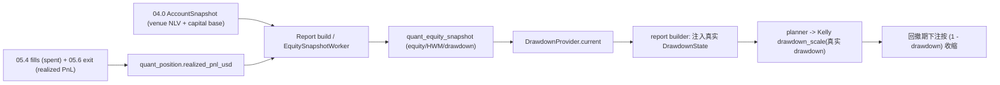

# 05.9 — Equity History & Drawdown-Aware Sizing

<!-- quant-pivot-deployment-contract:v1 -->
> **Deployment contract**
> - `fresh_boot_assumption`: 项目尚未正式生产上线，将从全新 `boot` / schema version `1` 部署；仓库和数据库不保存 lifecycle seal 状态。
> - `schema_data_version_impact`: 本文中的历史版本号与递增路径不再具有实施效力；当前实现不迁移测试数据、旧结构或旧版本。
> - `pre_deployment_behavior`: 允许 clean-break、migration squash 与全新基础设施 bootstrap，但任何数据销毁仍需操作者单独授权。
> - `post_deployment_behavior`: 首次部署后使用正常前向 migration、回滚与数据验证；不使用不可逆 production seal 或兼容桥。
> - `rollback_and_data_verification`: 首次部署前通过清空后的 fresh-install 验证；部署后使用备份、前向 migration 与显式回滚。

> 父：[`README.md`](README.md) · 概念规格：[`../04-topn-report-and-recommendation.md`](../04-topn-report-and-recommendation.md) §9、
> [`../08-third-party-crates-and-ml-stack.md`](../08-third-party-crates-and-ml-stack.md) §15、
> [`../09-account-capital-position-reconciliation.md`](../09-account-capital-position-reconciliation.md) §4
>
> 闭环定位：**回撤感知 sizing 闭环（钱相关）**。Phase 4 的 Kelly `drawdown_scaling` 因无跨 tick 权益
> 历史而恒取 `DrawdownState::neutral()`。Phase 5 已产出
> fills（05.4）+ realized PnL（05.6）+ 真实账户资本基准（04.0），**现在就能**派生权益曲线 / 回撤，把真实
> `DrawdownState` 回灌 planner，让 Kelly 在回撤期自动收缩下注。本子phase关闭这一在 04.1/05.4/05.6
> 反复标注的缺口。
>
> **为何归 Phase 5**：04.1 §10 / 05.4 / 05.6 均把 `DrawdownState` 真实来源延后到"权益历史账本就绪
> 后"；该账本正是 Phase 5（05.4 spent + 05.6 realized PnL）的产物，因此**本期即可闭环**，不应再推。

## 1. 目标与闭环定位

1. **权益历史账本** `quant_equity_snapshot`：记录真实 venue NLV、策略资本基准、累计 realized PnL、
   未实现 PnL、high-water-mark、drawdown，作为跨 tick 权益曲线真相源。
2. **report 同步快照 + worker 补点**：每次 report build 生成一条带 `account_snapshot_ref` 的权益快照并在
   report transaction 中原子提交；独立 worker 只写 `account_snapshot_ref = null` 的 between-report 历史点。
3. **真实 `DrawdownState`**：`DrawdownProvider` 从 HWM + 当前 equity 计算 `current_drawdown`，注入
   report builder → planner sizing（替换 `DrawdownState::neutral()`）。
4. 激活 Kelly `DrawdownMultiplierPolicy::Conservative`（`sizing.rs` §256–263）在生产中真正缩放下注。

本子phase完成后，回撤期 Kelly 下注按 `(1 − drawdown)` 收缩（fractional Kelly 的标准回撤保护），
sizing 在真实权益曲线上自适应。

## 2. 删除 / 合并 / 重构清单

### 2.1 重构（破坏式，激活既有信号路径）

- `DefaultPortfolioPlanner` 的 sizing 调用（[`planner.rs`](../../../crates/quant-pivot-research/src/portfolio/planner.rs) §234–238）：
  当前硬编码 `drawdown_state: DrawdownState::neutral()`。重构：`PortfolioPlanInput` 新增
  `drawdown_state: DrawdownState`（由 caller 提供真实值），planner 透传给 `SizingInput`。
- report builder 账户快照路径：
  新增 `DrawdownProvider::snapshot_for_report()` 调用，产出 `NewAccountSnapshot`、`NewEquitySnapshot` 与真实
  `DrawdownState`，再注入 planner 输入。
- `DrawdownState`（[`sizing.rs`](../../../crates/quant-pivot-research/src/portfolio/sizing.rs) §50–69）：
  文档从"Phase 4 only neutral"改为"Phase 5 真实来源 = `quant_equity_snapshot` HWM/equity"；
  `neutral()` 保留（首份报告无历史时的合法初值）。

### 2.2 合并

- 无。`DrawdownMultiplierPolicy` / `drawdown_scale`（`sizing.rs` §256–263）已实现，本期只提供真实
  输入，不改 Kelly 公式。

## 3. 新领域类型 / 表 / ClickHouse fact

### 3.1 表 `quant_equity_snapshot`（权益曲线账本）

| 列 | 类型 | 说明 |
|---|---|---|
| `equity_snapshot_id` | `EquitySnapshotId`（UUID v7，新 typed id） | 主键 |
| `as_of` | `DateTime<Utc>` | 快照时刻（report `as_of` 或周期 tick） |
| `venue_net_liquidation_usd` | `Usd` | 真实 venue 净清算价值，未被 budget cap 截断 |
| `capital_base_usd` | `Usd` | 策略 sizing / drawdown 基准，`min(venue_net_liquidation_usd, budget cap)` |
| `available_usd` | `Usd` | 可用现金 |
| `reserved_usd` | `Usd` | 已被 pending intents 锁定的资本 |
| `realized_pnl_cumulative_usd` | `Usd` | 累计已实现 PnL（`Σ quant_position.realized_pnl_usd`，05.6） |
| `unrealized_pnl_usd` | `Usd` | 未实现 PnL（持仓现值 − 成本，来自 `AccountSnapshot.positions`） |
| `high_water_mark_usd` | `Usd` | 历史最高 `capital_base_usd`（= `max(prev HWM, capital_base)`） |
| `drawdown_pct` | `Decimal` | `(HWM − capital_base) / HWM`，∈ [0,1] |
| `account_snapshot_ref` | `Option<AccountSnapshotId>` | report 快照关联；worker 独立补点为空 |
| `source` | `AccountSource` | 恒 `Polymarket` |
| `created_at` | `DateTime<Utc>` | 落库时间 |

- iden `#[quant_schema(lifecycle = "ledger")]`；index `idx_quant_equity_snapshot_as_of` /
  `idx_quant_equity_snapshot_created_at`。
- DTO：`EquitySnapshotInfo` / `NewEquitySnapshot` / `EquitySnapshotQuery`（`domain/quant/account.rs`）。
- 新 typed id `EquitySnapshotId`（`types/ids.rs`）。

### 3.2 ClickHouse fact

- 延后 `quant_equity_event`（权益曲线时序分析）；本期 PG `quant_equity_snapshot` 为 source of truth。
  Phase 6/observability 可做 ClickHouse mirror，但不得反向参与 sizing。

## 4. deploy-config key 与 runtime-config path

- runtime-config `portfolio.sizing.drawdown_scaling`（已在，`DrawdownMultiplierPolicy::{Fixed,
  Conservative}`）：本期生效——`Conservative` 真正按真实 drawdown 缩放。
- 新增 deploy key `quant.workers.equity_snapshot_secs`（默认 300s）；这是 restart-bound worker cadence。
- runtime-config `portfolio.sizing.drawdown_scaling` 默认改为 `Conservative`；历史 active config 不静默迁移。

## 5. 必建模块 / trait

```text
crates/quant-pivot-models/src/
├── entities/quant_equity_snapshot.rs + idens/ + domain/quant/account.rs + types/ids.rs（EquitySnapshotId）

crates/quant-pivot-repository/src/
├── traits/quant/equity_snapshot.rs        # EquitySnapshotRepository
└── postgres/quant/equity_snapshot.rs      # Pg 实现

crates/quant-pivot-core/src/service/
└── equity.rs   # EquitySnapshotService + DrawdownProvider

crates/quant-pivot-core/src/app/periodic_services.rs   # + EquitySnapshotWorker（TaskId::EquitySnapshot）
crates/quant-pivot-research/src/portfolio/planner.rs   # PortfolioPlanInput.drawdown_state
crates/quant-pivot-core/src/report/builder.rs          # 注入真实 DrawdownState
```

```rust
#[async_trait]
pub trait EquitySnapshotRepository: Send + Sync {
    async fn create(&self, snapshot: NewEquitySnapshot)
        -> Result<EquitySnapshotInfo, StorageError>;
    async fn latest(&self) -> Result<Option<EquitySnapshotInfo>, StorageError>;
    async fn latest_at_or_before(&self, as_of: DateTime<Utc>)
        -> Result<Option<EquitySnapshotInfo>, StorageError>;
    async fn page(&self, query: EquitySnapshotQuery)
        -> Result<Paginated<EquitySnapshotInfo>, StorageError>;
}

// core
#[async_trait]
pub trait DrawdownProvider: Send + Sync {
    /// 决策时刻真实回撤 + report transaction rows（无历史 → neutral）。
    async fn snapshot_for_report(&self, account: &AccountSnapshot)
        -> QuantResult<ReportEquitySnapshot>;
}
```

`EquitySnapshotService::snapshot_for_report`：

```rust
let prev = self.equity_repo.latest_at_or_before(account.as_of).await?;
let hwm = prev.map(|s| s.high_water_mark_usd)
    .unwrap_or(account.capital_base_usd)
    .max(account.capital_base_usd);
let drawdown = if hwm > Usd::ZERO && account.capital_base_usd < hwm {
    ((hwm - account.capital_base_usd) / hwm).clamp(0, 1)
} else {
    Decimal::ZERO
};
Ok(DrawdownState { current_drawdown: drawdown })
```

`EquitySnapshotWorker`（周期）：读 `AccountSnapshot`（真实净值）+ `Σ realized_pnl`（position 账本）→
计算 unrealized + HWM + drawdown → 写 `quant_equity_snapshot`。

## 6. 闭环数据流



## 7. 生产不变量与失败语义

- **真实回撤、非模拟**：drawdown 源自真实 strategy capital base（credential-gated 账户 + budget cap），无绿场、
  无模拟、无配置预算 fallback。
- **首份报告合法 neutral**：无权益历史（HWM 缺失）→ `DrawdownState::neutral()`（drawdown=0），合法
  真实初值，非降级。
- **HWM 单调**：`high_water_mark = max(历史 equity)`；equity 创新高刷新 HWM，drawdown 归零。
- **确定性可重放**：planner 仍纯函数——`DrawdownState` 作为输入冻结进 `PortfolioPlanInput`，同输入
  同 plan（drawdown 由 caller 在 `as_of` 解析一次）。
- **money newtype**：equity/PnL/HWM 全 `Usd`，drawdown_pct 为 `Decimal` ∈ [0,1]；`f64` 不进。
- **失败语义**：worker 失败仅告警；report 路径若 equity repo / position aggregate / mark 计算失败则 fail closed。
  只有首条有效历史缺失时允许 neutral。
- **ledger 一致**：`realized_pnl_cumulative` 与 `quant_position.realized_pnl_usd` 求和一致（对账校验）。

## 8. 第三方 crate 引入

- 无新增（复用 sea-orm / AccountProvider / position 账本 / PeriodicTask）。

## 9. 验收测试

- `equity_snapshot_records_real_equity_and_pnl`（worker 写真实净值 + 累计 realized PnL）。
- `high_water_mark_is_monotonic_max`。
- `drawdown_pct_is_hwm_minus_equity_over_hwm`。
- `new_account_no_history_is_neutral_drawdown`（首份报告 drawdown=0）。
- `kelly_conservative_policy_shrinks_bet_in_drawdown`（真实 drawdown=0.2 → 下注 ×0.8，对拍
  `drawdown_scale`）。
- `kelly_fixed_policy_ignores_drawdown`（Fixed 仍 1.0）。
- `planner_consumes_real_drawdown_state`（builder 注入真实值，非 neutral）。
- `planner_deterministic_with_frozen_drawdown`（同输入同 plan）。
- `equity_snapshot_repo_create_latest_hwm`（PG）。
- `realized_pnl_cumulative_matches_position_ledger_sum`（一致性）。

## 10. Blocker

- 若 planner 仍硬编码 `DrawdownState::neutral()`（真实回撤未回灌），失败。
- 若 drawdown 源自模拟/配置而非真实 equity + realized PnL，失败。
- 若回撤计算失败时放大下注（非保守 fail-safe），失败。
- 若 equity/PnL 出现 `f64` 泄漏，失败。
- 若 planner 因引入 drawdown 而失去确定性可重放，失败。

## 11. 延后 / 缺口

> 完整索引见 [`README.md`](README.md) §6。

- **更复杂的回撤策略**（per-category drawdown、波动率调整 Kelly）→ 后续研究；本期
  `Conservative = (1 − drawdown)` 线性收缩，简单可审计、生产首版充分。
- **权益曲线的 ClickHouse 时序分析 fact** → 与 05.7 CH 收尾一并（可选）。
- **回撤驱动的自动降级/kill-switch 联动**（如 drawdown 超阈值自动 `report_only_forced`）→ 可作为
  05.1 kill-switch 的策略扩展，后续评估（本期 drawdown 只缩放 sizing，不联动 kill-switch）。
