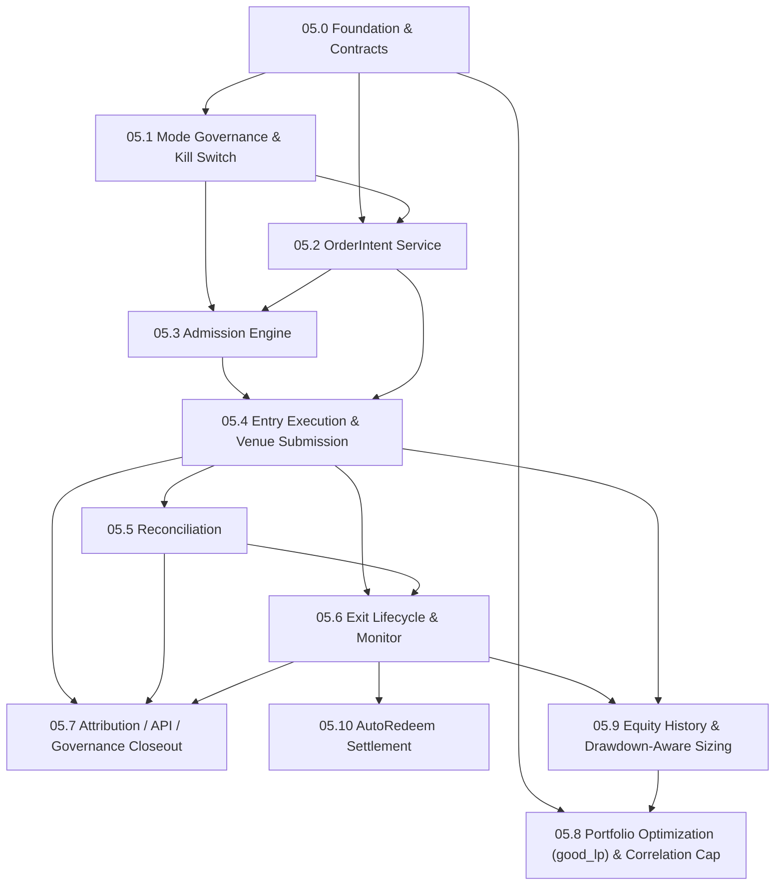
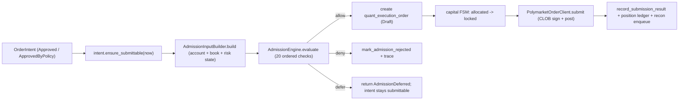

# Phase 05 — Execution / Risk / Governance 子phase索引

<!-- quant-pivot-lifecycle-contract:v1 -->
> **Lifecycle contract**
> - `lifecycle_assumption`: 项目尚未正式生产上线，当前状态为 `pre_production_resettable`，系统自有基线统一为 `boot` / schema version `1`。
> - `schema_data_version_impact`: 本文中的历史版本号与递增路径不再具有实施效力；当前实现不迁移测试数据、旧结构或旧版本。
> - `pre_production_behavior`: 允许 clean-break、migration squash 与全新基础设施 bootstrap，但任何数据销毁仍需操作者单独授权。
> - `production_frozen_behavior`: 一旦完成不可逆 production seal，后续变更必须提供前向 migration、兼容性评估、回滚方案与数据验证。
> - `rollback_and_data_verification`: 封存前通过清空后的 fresh-install 验证；封存后不得回退到 boot reset。

> 状态：生产级破坏式实施拆分（设计文档；本目录不含代码）
>
> 父文档（概念规格）：[`../05-execution-risk-and-governance.md`](../05-execution-risk-and-governance.md)、
> [`../09-account-capital-position-reconciliation.md`](../09-account-capital-position-reconciliation.md)、
> [`../06-config-deploy-and-ops.md`](../06-config-deploy-and-ops.md)、
> [`../08-third-party-crates-and-ml-stack.md`](../08-third-party-crates-and-ml-stack.md)、
> [`../00-quant-pivot-architecture.md`](../00-quant-pivot-architecture.md)
>
> 本目录把 Phase 05 拆成 8 个可独立推进、带验收契约的子phase（05.0–05.7）。父文档保持
> "概念真理"，本目录是"可执行实施契约"。任一子phase未满足其 Blocker / 验收，不允许进入
> 下一子phase。

## 0. 为什么拆分

Phase 05 是 quant-pivot 的**执行 / 风险 / 治理平面**：把 Phase 04 产出的不可变
`RecommendationReport`（主产物）在受治理的运行模式下转化为真实的 Polymarket 订单，
并围绕真金白银建立完整的 fail-closed 闭环：

```text
published recommendation
 -> mode gate (report_only / semi_auto / auto_execution)
 -> OrderIntent (create / approve)
 -> ExecutionAdmission (20 checks)
 -> entry order submit (CLOB, real money)
 -> reconciliation (venue truth)
 -> exit monitor (TP / SL / time / signal / kill switch)
 -> capital FSM (planned -> allocated -> locked -> spent -> released/impaired)
 -> attribution (-> training samples)
```

它直接操作私钥签名与真实资金，是整个系统**最不能出错**的平面，体量远超单一可验证增量，
因此拆成 05.0–05.7。

**核心原则（父文档 §0，逐条不可妥协）：**

- 执行是报告之后的可选消费路径，不是系统主路径。
- `report_only` 永不创建订单意图。
- `semi_auto` 必须人工审批。
- `auto_execution` 必须经过 policy approval 和 admission gate。
- 所有执行都从 `OrderIntent` 开始，不允许跳过 intent 直接下单。
- Exit plan 是 position lifecycle 的一部分，不能依赖人工记忆。

## 1. 子phase索引

| 子phase | 标题 | 闭环定位 | 文档 |
|---|---|---|---|
| 05.0 | Execution Foundation & Contracts | 契约/脚手架/破坏式重构 | [`05.0-execution-foundation-and-contracts.md`](05.0-execution-foundation-and-contracts.md) |
| 05.1 | Runtime Mode Governance & Kill Switch | **治理门禁闭环** | [`05.1-runtime-mode-governance-and-kill-switch.md`](05.1-runtime-mode-governance-and-kill-switch.md) |
| 05.2 | OrderIntent Service (create / approve) | **意图 + 审批闭环** | [`05.2-order-intent-service.md`](05.2-order-intent-service.md) |
| 05.3 | Execution Admission Engine | **准入门闭环（20 检查）** | [`05.3-execution-admission-engine.md`](05.3-execution-admission-engine.md) |
| 05.4 | Entry Execution & Venue Submission | **真金白银下单闭环** | [`05.4-entry-execution-and-venue-submission.md`](05.4-entry-execution-and-venue-submission.md) |
| 05.5 | Reconciliation | **对账闭环** | [`05.5-reconciliation.md`](05.5-reconciliation.md) |
| 05.6 | Exit Lifecycle & Monitor | **退出监控闭环** | [`05.6-exit-lifecycle-and-monitor.md`](05.6-exit-lifecycle-and-monitor.md) |
| 05.7 | Attribution / API / Governance Closeout | **归因 + 可观测 + 治理收尾** | [`05.7-attribution-api-governance-closeout.md`](05.7-attribution-api-governance-closeout.md) |
| 05.8 | Portfolio Optimization (good_lp) & Correlation Cap | **组合优化升级 + 相关性约束生效** | [`05.8-portfolio-optimization-good-lp.md`](05.8-portfolio-optimization-good-lp.md) |
| 05.9 | Equity History & Drawdown-Aware Sizing | **回撤感知 sizing 闭环** | [`05.9-equity-history-and-drawdown-aware-sizing.md`](05.9-equity-history-and-drawdown-aware-sizing.md) |
| 05.10 | AutoRedeem Settlement (CTF On-Chain) | **HoldToResolution 链上赎回尾项** | [`05.10-auto-redeem-settlement.md`](05.10-auto-redeem-settlement.md) |

## 2. 依赖图



> 05.8（组合优化）只依赖 05.0 契约与既有 Phase 4 planner，可与执行链并行推进；05.9（权益历史/回撤）
> 依赖 05.4 fills + 05.6 realized PnL，落在退出闭环之后，并把真实 `DrawdownState` 回灌 planner，
> 使 05.8 的 sizing 在真实回撤曲线上运行（故 05.9 → 05.8 的数据回灌边）。

执行主链（一次 `submit_if_admitted` 内，05.4）：



## 3. 当前代码现实（拆分基线，2026-06 实测）

> 本节是删除/重构清单的依据。所有结论均经代码核实，引用 `file:line`。

**Phase 01 已交付（执行链路骨架）**

- `quant_order_intent` / `quant_execution_order` 实体 + iden + 迁移（catalog 驱动）+ 持久化
  DTO（`Info`/`New`）。
- typed IDs：`OrderIntentId` / `ExecutionOrderId`
  （[`models/src/types/ids.rs`](../../../crates/quant-pivot-models/src/types/ids.rs) §155–161）。
- 执行枚举：`OrderIntentStatus` / `ApprovalStatus`
  （[`models/src/enums/quant.rs`](../../../crates/quant-pivot-models/src/enums/quant.rs) §140–171）、
  `ExecutionOrderState`（§340–352）、`RecommendationOutcome`（§355–367）、
  `OrderIntentKind` / `ExecutionOrderPhase` / `OrderTypeKind` / `VenueOrderStatus`
  （[`models/src/enums/execution.rs`](../../../crates/quant-pivot-models/src/enums/execution.rs)）。
- ClickHouse fact：`quant_report_recommendation_fact`（Phase 11.8 无 lifecycle decision snapshot）/
  `quant_execution_event`。

**Phase 04 已交付（执行输入）**

- 不可变 `RecommendationReport` + 每条 `Recommendation` 携带强类型 `EntryPlan` / `SizingPlan` /
  `ExitPlan` / `RiskEnvelope`（含 `envelope_hash`）/ `ExecutionEligibility`（含 `eligible_modes`）。
- credential-gated `AccountProvider` / `VenueAccountProvider` / `AccountSnapshot` /
  `ExposureBreakdown`（[`core/src/service/account/`](../../../crates/quant-pivot-core/src/service/account/)）、
  `ReservedCapitalReader`（05.0 起从 `quant_capital_allocation` 聚合未释放/未花费资金）。
- `PgOrderIntentRepository`（含 `validate_intent_transition` FSM）
  （[`repository/src/postgres/quant/order_intent.rs`](../../../crates/quant-pivot-repository/src/postgres/quant/order_intent.rs) §100–124）——
  已扩展 policy-approved / admission rejected / invalidated / row lock primitive；**仍无 core service 调用**。
- 05.0 已落 execution foundation：`quant_capital_allocation` / `quant_position` /
  `quant_reconciliation` / `system_kill_switch` 四表、执行资源 RBAC、`ExecutionError`、
  repository PG impl、`core/src/execution/` trait 骨架。
- `quant_order_intent.intent_kind` 已是枚举 `OrderIntentKind`（非 `String`，04.0 标注的重构已落）。
- 强类型 JSONB：`EntryOrderSpec` / `ExitPolicySpec`
  （[`models/src/types/execution_payload.rs`](../../../crates/quant-pivot-models/src/types/execution_payload.rs)）、
  `EntryOutcome` / `ExitOutcome` / `AttributionDetail`（`types/attribution_payload.rs`）——**契约已立，写路径属 Phase 5**。

**venue 能力已就绪（仅未接生产执行路径）**

- `quant-pivot-api::clob::ClobClient`：`place_order`（FOK/GTC/GTD）+ EIP-712 签名
  （`OrderSigner` / `Keystore`）+ `cancel_order` / `cancel_all` / `collateral_balance` /
  `get_trades` / `get_open_orders`
  （[`api/src/clob/mod.rs`](../../../crates/quant-pivot-api/src/clob/mod.rs) §198/§288/§318/§428/§454/§518）。
  **`place_order` 仅被 `quant-pivot-api` 测试调用，未接 core/web/bin。**
- core 仅在 `AccountBundle` 构造一个 `ClobClient` 用于**读**抵押，未暴露到 `AppContext`
  （[`core/src/app/bundles/account.rs`](../../../crates/quant-pivot-core/src/app/bundles/account.rs) §46–52）。

**治理 / RBAC / 审计已就绪**

- `QuantRuntimeMode`（三态）+ `system_runtime_state` 单例（PG）+ `RuntimeModeHandle`（ArcSwap）；
  `QuantRuntimeControl::switch_quant_mode`（**无 preflight**）
  （[`core/src/governance/runtime_control.rs`](../../../crates/quant-pivot-core/src/governance/runtime_control.rs) §42–57）。
- Casbin RBAC：`ResourceType` × `Operation` + `RESOURCE_OPERATIONS` 目录
  （[`models/src/enums/rbac.rs`](../../../crates/quant-pivot-models/src/enums/rbac.rs) §82–283）；
  内置角色 `super_admin/admin/risk_owner/analyst/operator/viewer/emergency_operator`
  （[`models/src/seed/rbac/`](../../../crates/quant-pivot-models/src/seed/rbac/)；**无 trader/risk_manager**）。
- append-only operation log（WORM）+ `operation_audit` 中间件
  （[`web/src/middleware/operation_audit.rs`](../../../crates/quant-pivot-web/src/middleware/operation_audit.rs)）。
- 治理路由模式：handler → `*Port` trait（`AppState`）→ core impl → repository
  （`QuantReportPort` / `CoreQuantReportPort`）。

**仍属 Phase 05（缺口）**

- kill switch 运行态服务/handle/API/状态投影（05.0 已有 `system_kill_switch` 表与 repository；
  runtime-config 布尔已删除，仅保留 emergency policy）。
- 模式转换矩阵 + preflight 引擎（§1.2 / §1.3）。
- OrderIntent **service** 层（mode gate / 创建 / 审批 / 审批失效）。
- 20 检查 admission engine。
- core `PolymarketOrderClient` façade + `ExecutionDispatcher` 真实下单。
- exit monitor / reconciliation worker / capital FSM 业务写入 / position 账本业务写入。
- attribution 写路径。
- 执行类 API（`/api/quant/intents`、`execution-orders`、`positions`、`/api/system/kill-switch`）；
  RBAC 资源/操作已在 05.0 建目录，handler 尚未接；`create-intent` 现返回 501
  （[`web/src/routes/quant_recommendations.rs`](../../../crates/quant-pivot-web/src/routes/quant_recommendations.rs) §80–90）。
- 执行 metrics（父文档 §14）。

## 4. 全局删除 / 合并 / 重构清单（贯穿子phase）

> 钱相关系统：宁可破坏式重构，不留模糊死代码。逐条标注**动作**与**归属子phase**。

### 4.1 删除（DEAD：定义存在但全仓零生产消费）

| 目标 | 证据 | 动作 | 子phase |
|---|---|---|---|
| `ExecutionIntentBundle` 空壳 | [`core/src/app/bundles/future.rs`](../../../crates/quant-pivot-core/src/app/bundles/future.rs) §98–99 空 struct | **删除**，由 05.4 真实 `ExecutionBundle` 取代 | 05.4 |
| `ExecutionOrderModel` wrapper | [`models/src/domain/quant/execution.rs`](../../../crates/quant-pivot-models/src/domain/quant/execution.rs) §131–133 仅 `{ order: NewExecutionOrder }` 包装 | **删除**（planner/dispatcher 直接产 `NewExecutionOrder`） | 05.0 |
| `NoCredentialsPaper` 错误变体 | 已无 Paper mode 路径 | **已删除** | 05.0 |
| `TaskId` 中 endgame 死变体（`Scanner`/`Funnel`/`PostTradeRelay` 等未 spawn） | [`core/src/app/task_id.rs`](../../../crates/quant-pivot-core/src/app/task_id.rs) §50–61 | **删除死变体**，新增 05.x 实际 worker 变体（`ExecutionDispatcher`/`ReconciliationWorker`/`ExitMonitor`/`IntentExpirySweep`） | 05.2/05.4/05.5/05.6 |
| `create-intent` 501 stub | [`web/src/routes/quant_recommendations.rs`](../../../crates/quant-pivot-web/src/routes/quant_recommendations.rs) §80–90 | **删除**，由 05.2 `POST /api/quant/intents` 取代 | 05.2 |

### 4.2 合并 / 收敛

| 目标 | 问题 | 动作 | 子phase |
|---|---|---|---|
| 布尔 `KillSwitchPolicy { enabled, reason }` | 仅二态，无 5 态语义；与运行态 FSM 重叠 | **已破坏式删除**；operational `system_kill_switch` 单例为权威，runtime-config 仅保留 `KillSwitchPolicy { emergency_exit }` 默认策略 | 05.0/05.1 |
| `ExecutionEmergencyView` / `ExecutionEmergencyClassView`（[`models/src/domain/governance/system.rs`](../../../crates/quant-pivot-models/src/domain/governance/system.rs) §21–48） | 占位 dashboard 视图，恒 `idle()` | **重构**为真实 kill-switch 状态投影（05.1 接入 `system_status`） | 05.1 |
| `ReservedCapitalReader::sum_locked`（只读聚合 intent） | Phase 4 用 intent 状态求和；Phase 5 有 `quant_capital_allocation` 账本 | **重构**数据源为 `quant_capital_allocation`（locked 状态求和），保持 trait 不变（实现切换） | 05.2 |

### 4.3 重构（破坏式，钱/审计相关）

| 目标 | 问题 | 动作 | 子phase |
|---|---|---|---|
| `QuantRuntimeControl::switch_quant_mode`（[`runtime_control.rs`](../../../crates/quant-pivot-core/src/governance/runtime_control.rs) §42–57） | 无 preflight：直接持久化 + store，不校验凭证/模型/质量/kill-switch | 重构：转换前跑 `ModeTransitionGate`（允许矩阵）+ `ModePreflight`（§1.3 检查），失败 fail closed | 05.1 |
| `ExecutionConfig.kill_switch`（[`runtime_config/sections/config.rs`](../../../crates/quant-pivot-models/src/runtime_config/sections/config.rs) §446–447） | 布尔 policy 与 operational 状态混淆 | 重构：config 只留 emergency policy；operational 状态移到 `system_kill_switch` 表 | 05.0/05.1 |
| `PgOrderIntentRepository`（[`order_intent.rs`](../../../crates/quant-pivot-repository/src/postgres/quant/order_intent.rs)） | 转换 FSM 已在，但无 `ApprovedByPolicy` 创建路径、无 `get_for_update`（提交需行锁）、无审批失效写入 | 扩展：`create_policy_approved` / `get_for_update` / `mark_admission_rejected` / `invalidate`；与 capital FSM 同事务 | 05.2/05.4 |
| `ExecutionOrderRepository`（trait only，[`traits/quant/execution_order.rs`](../../../crates/quant-pivot-repository/src/traits/quant/execution_order.rs)） | 无 PG impl | 新建 `PgExecutionOrderRepository` + 扩展 `record_submission_result` / `transition` | 05.0/05.4 |
| `AttributionRepository`（trait only） | 无 PG impl，无写路径 | 新建 `PgAttributionRepository` + 写路径 | 05.0/05.7 |

## 5. 已拍板的设计基线（贯穿全部子phase）

1. **无独立 arming 开关**（已拍板）：真实 CLOB 下单仅由四道 fail-closed 门控的**合取**决定：
   `mode ∈ {semi_auto, auto_execution}` ∩ intent 审批通过 ∩ admission `allow` ∩ kill-switch
   允许新入场。**不引入**额外 deploy-config/env arming 标志；不增门 = 不减门，四道门任一不满足
   即拒绝。
2. **Kill switch = 完整 5 态、受治理、持久化单例**（已拍板）：`KillSwitchState ∈
   {closed, report_only_forced, execution_halted, exit_only, emergency_halted}`，落
   `system_kill_switch` 单例表（仿 `system_runtime_state`：`id = 1`、`changed_by`、`reason`、
   `changed_at`）+ `KillSwitchHandle`（ArcSwap 热读）+ `GET/POST /api/system/kill-switch`。
   **破坏式删除** runtime-config 布尔 `KillSwitchPolicy.enabled`；operational state 为权威，
   config 仅留 emergency policy 默认。行为表见父文档 §8 / 05.1 §5。
3. **审批 RBAC 在 API 层**（已拍板）：semi_auto intent `approve/reject/cancel` 由 Casbin
   `order_intent:*` 权限门控（`operator` 可批/拒/取消；`risk_owner` 可拒不可批，见 05.2 §6）。
   **不**在 runtime-config 或 `ExecutionEligibility` 中携带审批角色名。
4. **资金真相分层**（09 §0/§4）：PG 为 source of truth，先持久化业务状态（await 成功）→ 再
   enqueue CH 镜像 fact（fire-and-forget）。资金状态机
   `planned → allocated → locked → spent → released | impaired` 全程可恢复；恢复失败则执行
   fail closed，报告可继续。
5. **执行层风险 ≠ 报告层风险**（父文档 §7）：报告层（Phase 4 planner）管 sizing/caps；执行层
   （admission）只 allow/deny/defer，**不修改报告**。`envelope_hash` 是两层之间的锚：admission
   重算并比对 Phase 4 落库的 `RiskEnvelope.envelope_hash`，mismatch 即拒。
6. **零兼容 / 零 re-export / 破坏式**：删除 DEAD 类型（§4.1），不留 alias。`f64` 仅允许出现在
   venue SDK / 数值边界，禁止泄漏到 money domain（`Usd`/`Price`/`Shares`/`Probability`）。
7. **OrderIntent 是唯一桥梁**：`report_only` 永不创建 intent；任何下单必先有 intent；intent
   冻结 recommendation id / runtime mode / entry+exit spec / risk_envelope_hash / config 版本 /
   model 版本 / approval 状态（父文档 §2.1）。
8. **错误分层**（AGENTS.md §7.1）：新增 typed sub-error `ExecutionError`（§05.0），admission
   denial 是**类型化结果**（`AdmissionDecision`）而非 error；第三方 venue 错误经
   `quant-pivot-api::ApiError` façade 转入，**绝不**在 `quant-pivot-error` 内依赖 SDK。生产 `src/`
   禁止 `QuantError::Internal(`。
9. **Admission 无状态 + ExecutionBreaker 有状态，职责分离**（已拍板）：05.3 admission engine 是
   **无状态、纯函数、确定性**的 20 检查门（只 allow/deny/defer，不持久化、不改报告、同输入同决策）；
   跨决策的**累计安全态**由独立的 `ExecutionBreaker`（05.4 §6.5）承载——它观测 venue 失败 / 对账
   unresolvable / 日内已实现亏损，瞬态退化驱动 admission `#18` defer，持续/硬触发**自动 trip
   kill-switch**（`execution_halted`，latch，需 operator ack）。**不移植** main 分支的有状态
   `RiskEngine`/32-check pipeline（那是热路径 FOK 架构）；breaker 仅作 kill-switch 的自动触发器，
   kill-switch 仍是唯一权威运营态。维度按相位接入：venue→05.4、recon→05.5、日内亏损→05.6。

## 6. 延后项总表

> 原则（已与用户对齐）：**Phase 5 能做的尽量做**；凡可在本期闭环的，纳入本期子phase（已将
> `good_lp`、相关性约束、真实回撤三项**收回 Phase 5**，分别落 05.8 / 05.9）。**仅**保留真正不属于
> 「执行/风险/治理」范畴、或硬性依赖未决的项；每条给出**详细设计位置 + 目标相位 + 为何不在 Phase 5**。

### 6.1 已收回 Phase 5（不再延后）

| 能力 | 原误判 | 现落地 |
|---|---|---|
| `good_lp` LP/MILP 组合优化 | Phase 6+ | **05.8**（08 §9/§16 本就排在 Phase 5；allocator 模块文档已预留 trait seam） |
| `max_correlated_exposure_usd` 真正生效 | Phase 6 | **05.8**（`CorrelationEstimator` + LP 约束 / greedy 近似；当前仅落快照未约束） |
| 真实回撤 `DrawdownState` 驱动 Kelly | Phase 6 | **05.9**（`quant_equity_snapshot` 账本由 05.4 fills + 05.6 realized PnL 派生，回灌 planner） |
| ClickHouse 资金/持仓/权益快照 fact | Phase 6（可选） | **05.7**（执行/资金镜像 fact，PG 先 source of truth；权益 fact 05.9 顺带） |
| 退出侧 `Sell` 平仓执行 | — | **05.6**（exit monitor 按 `ExitPolicySpec` 触发 Sell 平仓单，已完整覆盖执行侧卖出） |

### 6.2 真正延后（非「执行/风险/治理」范畴 或 硬依赖未决；均有详细设计 + 明确目标相位）

| 延后能力 | 详细设计位置 | 为何不在 Phase 5 | 目标相位 |
|---|---|---|---|
| `ort` / ONNX 线上推理 | 父 [`08`](../08-third-party-crates-and-ml-stack.md) §17；[`phase-06/README.md`](../phase-06/README.md)（06.3 待开） | ① **ML 模型族扩展**；② **MSRV 硬阻塞**（08 §7.1/§12.5）；③ weighted scorer 已满足执行闭环 | **Phase 6** |
| classical model（smartcore/linfa）主路径 **publish** | 父 [`08`](../08-third-party-crates-and-ml-stack.md) §15；[`phase-06/README.md`](../phase-06/README.md)（06.4 待开） | ML 模型族扩展；registry 已支持 artifact 类型 | **Phase 6** |
| 研究侧 `Sell` 排序模型（机会性平仓信号） | **[`phase-06/06.1-opportunistic-sell-exit-signal.md`](../phase-06/06.1-opportunistic-sell-exit-signal.md)**（闭合 05.6 `ExitSignalEvaluator` seam） | 执行侧平仓已由 05.6 覆盖；机会性 scorer 填 seam impl | **Phase 6** |
| 跨账户周期 reconciliation report | **[`phase-06/06.2-cross-account-reconciliation-report.md`](../phase-06/06.2-cross-account-reconciliation-report.md)**（登记于 05.5 §11） | 05.5 逐单对账已闭环；跨账户聚合属增强 | **Phase 6** |
| `ExitSettlementMode::HoldToResolution + RedeemPolicy::Auto` 链上赎回 | **[`05.10-auto-redeem-settlement.md`](05.10-auto-redeem-settlement.md)** | 标准二元 CTF `redeemPositions` + per-lot settlement ledger；proxy / neg-risk / multi-outcome 明确转人工并登记后续计划 | **Phase 5 收尾**：05.6 后、05.7 前或并行 |
| 多副本 leader-elected execution/exit/recon worker | **[`phase-08/README.md`](../phase-08/README.md)** §2 | 水平扩展；单实例 advisory lock 首版正确 | **Phase 8+** |
| Trailing stop 高频 peak 跟踪 | **[`phase-08/README.md`](../phase-08/README.md)** §3 | 05.6 `monitor_secs` 首版足够 | **Phase 8+** |

> 判定标准：6.2 每条都满足「**有详细设计**（指向 08/05.6 的具体章节）+ **有明确目标相位** + **有不在
> Phase 5 的硬理由**（范畴外 / MSRV 阻塞 / 独立 venue 集成 / 部署架构）」。不存在「无计划的模糊延后」。

## 7. 文档契约模板（每篇子phase文档固定顺序）

1. **目标与闭环定位** —— 交付什么、在执行主链中的位置。
2. **删除 / 合并 / 重构清单** —— 加替代代码前必须删/合/重构的 crate / 模块 / 类型 / 配置；
   引用 `file:line`；若无可删，显式写"无（本子phase为净新增）"。
3. **新领域类型 / 表 / ClickHouse fact** —— 强类型块、Postgres 表/列、CH fact。
4. **deploy-config key 与 runtime-config v5 path** —— 消费哪些 config 段、是否新增 deploy key。
5. **必建模块与 trait** —— 模块树 + trait 签名（verbatim Rust）。
6. **生产不变量与失败语义** —— 事务边界、fail-closed、hash、恢复、错误分层硬规则。
7. **第三方 crate 引入** —— 本子phase允许 / 禁止的 crate 与 feature gate。
8. **验收测试** —— 必须新增的测试用例（对照父文档 §15 验收标准）。
9. **Blocker** —— 触发即判定本子phase失败的条件。
10. **延后 / 缺口** —— 本子phase明确不做、留给后续 Phase 的点。

## 8. 父文档修订清单（实现期同步，本目录不直接改父文档）

| 父文档 | 修订点 | 触发子phase |
|---|---|---|
| [`05`](../05-execution-risk-and-governance.md) §8 | kill-switch 落为持久化 5 态 operational 单例 `system_kill_switch`（非 runtime-config 布尔） | 05.0/05.1 |
| [`05`](../05-execution-risk-and-governance.md) §1.3 | mode 切换 preflight 接入 `switch_quant_mode`（转换矩阵 + 检查清单） | 05.1 |
| [`05`](../05-execution-risk-and-governance.md) §10.3 | 审批 RBAC 在 API 层（Casbin `order_intent:approve` 等）；删除 `SemiAutoConfig::required_role` 与 `ExecutionEligibility::approval_role` | 05.2 |
| [`05`](../05-execution-risk-and-governance.md) §13 | `create-intent` 改为 `POST /api/quant/intents`（删除 501 stub） | 05.2 |
| [`05`](../05-execution-risk-and-governance.md) §16.3 | **as-built 审计事务边界**：intent+capital 始终同一 PG 事务；op-log 仅在**后台发起**（expire sweep / report-termination 级联 invalidate）写入该事务，HTTP 发起的 create/approve/reject/cancel 由 `operation_audit` 中间件审计（与全站受治理路由一致）。报告级联钩子覆盖 revoke + expire 两条终态 | 05.2 |
| [`09`](../09-account-capital-position-reconciliation.md) §6 | `quant_position` / `quant_capital_allocation` / `quant_reconciliation` + 完整资金 FSM + 对账 worker 正式落 Phase 5 各子phase | 05.0/05.2/05.4/05.5 |
| [`05`](../05-execution-risk-and-governance.md) §11 | 对账落地：`ReconciliationWorker`（`find_reconcilable` sweep + 主动撤单 + 终态一次性守卫幂等校正）；证据 #3/#4 改"当前绝对余额旁证"（05.4 未捕获基线）；cadence/阈值用 `execution.reconciliation.interval_secs`/新增 `stale_open_secs` | 05.5 |
| [`05`](../05-execution-risk-and-governance.md) §6.5 | `ExecutionBreaker` 接入 recon 维度：`observe_unresolvable_recon` 硬触发 kill-switch `execution_halted` latch（dimension `recon`） | 05.5 |
| [`05`](../05-execution-risk-and-governance.md) §6 / §16.5 | **退出闭环 as-built（R3）**：`quant_position` 改 per-lot（`PositionId`+`order_intent_id`，realized PnL 精确）；exit FSM 落 `quant_order_intent`（`exit_state`/`exit_reason`/`next_check_at`/`peak_mark_price`/`last_signal_recheck_at`）；`ExitPolicySpec` 全量冻结 `ExitPlan`；`HoldToResolution` 抑制获利/超时档仅保留保护档；trailing 折叠进 stop-loss；退出提交单事务 `create_exit_order_and_mark_closing`+`record_exit_result`（capital `Spent→Released`）；对账相位感知（Exit 单走 `apply_exit`） | 05.6 |
| [`05`](../05-execution-risk-and-governance.md) §6.5 | `ExecutionBreaker` 第三维度日内已实现亏损：`observe_realized_pnl`（UTC 日界清零）≥80%→Degraded(#18)、≥cap→`execution_halted` latch；config `execution.breaker.daily_realized_loss_cap_usd` | 05.6 |
| [`05`](../05-execution-risk-and-governance.md) §4.2 #20 / §1.3 | admission `#20` `ExitMonitorReadiness` 真实化（`ExitMonitorHealthHandle` worker 心跳）；mode preflight `exit_monitor_healthy` 由 soft 改 hard | 05.6 |
| [`06`](../06-config-deploy-and-ops.md) | runtime-config 删除 `execution.kill_switch.enabled` 布尔；新增 kill-switch operational 单例语义 + 执行 metrics 清单 | 05.0/05.1 |
| [`06`](../06-config-deploy-and-ops.md) | `execution` 段新增 `exit_monitor.{enabled,monitor_secs,signal_recheck_secs,signal_invalidation_ratio}` + `breaker.daily_realized_loss_cap_usd`；metric `quant_exit_triggers_total{reason}` | 05.6 |
| [`06`](../06-config-deploy-and-ops.md) | `portfolio` 段新增 `optimizer`（LP/MILP）+ `constraints.correlation`；deploy-config `quant.workers.equity_snapshot_secs` | 05.8/05.9 |
| [`08`](../08-third-party-crates-and-ml-stack.md) §9/§16 | `good_lp` 由"Phase 5 若 greedy 不够"明确为 **Phase 5 已实现的可选升级**（greedy 默认 + fallback，pure-Rust microlp 默认层 + 可选 native HiGHS） | 05.8 |
| [`04`](../04-topn-report-and-recommendation.md) §9 | sizing `drawdown_scaling` 在 Phase 5 由 `quant_equity_snapshot` 提供真实回撤（不再恒 neutral） | 05.9 |

## 9. 质量门禁（每个子phase收尾必跑）

```bash
cargo fmt --all --
cargo clippy --workspace --all-targets -- -D warnings
bash scripts/lint-architecture.sh
bash scripts/lint-quant-pivot-boundary.sh
bash scripts/lint-quant-pivot-errors.sh
cargo test --workspace
```
