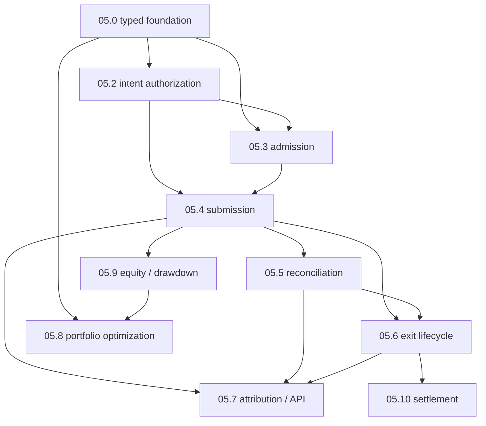

# Phase 05 — Execution / Risk / Governance

<!-- quant-pivot-deployment-contract:v1 -->
> **Deployment contract**
> - `fresh_boot_assumption`: 项目尚未生产运行，只从唯一 fresh `boot` / schema version `1` 安装。
> - `schema_data_version_impact`: 不读取、转换或迁移旧数据、旧 schema、旧 config 或旧 wire contract。
> - `compatibility_policy`: 无 alias、legacy parser、双读、双写、版本分派或降级路径。
> - `rollback_and_verification`: 只在 disposable 空基础设施上重建并验证 fresh install；真实数据销毁必须另行授权。

> 当前执行授权、账户单写者、break-glass 恢复和经济反馈规格的唯一 owner 是
> [`../phase-12/12.0-execution-authority-account-recovery-fast-feedback.md`](../phase-12/12.0-execution-authority-account-recovery-fast-feedback.md)。
> Phase 05 文档只描述与当前代码一致的执行、风险、资金和对账合同，不保留被删除的全局 mode 轴。

## 1. 业务闭环

```text
published Recommendation
 -> frozen ExecutionAuthorityCeiling + blockers + policy binding
 -> current EntryAuthorizationPolicy
 -> PendingAuthorization | Authorized OrderIntent
 -> immutable AuthorizationEvidence
 -> entry condition + fixed-order admission
 -> write-ahead ExecutionOrder
 -> CLOB observation + finalized account-chain execution
 -> strategy position lot + capital lifecycle
 -> exit / reconciliation / attribution
```

报告生成、入场授权、kill switch、退出、settlement chain write 与模型 serving authority 各有独立 owner：

- 报告始终使用真实 venue account sizing，没有 simulation 或 configured-budget fallback。
- `EntryAuthorizationPolicy::OperatorApprovalRequired` 是 safe default。
- `PolicyAutomatic` 只是当前入场授权策略；它不改写 recommendation 的 ceiling/blockers，也不绕过 economic health、account recovery、kill switch 或 admission。
- intent 一旦 `Authorized`，其 `AuthorizationEvidence` 不可变。后续 runtime-control 变化不得重写历史 grant。
- kill switch 只有 `Closed`、`ExecutionHalted`、`ExitOnly`、`EmergencyHalted`。只有 `Closed` 允许新入场。
- `SettlementWritePolicy` 与 entry authorization 独立；已持久化的 submission identity 必须继续 exact recovery。

## 2. 子 phase 索引

| 子 phase | 当前合同 | 文档 |
|---|---|---|
| 05.0 | execution foundation、typed contracts、FSM 与 owner 边界 | [`05.0-execution-foundation-and-contracts.md`](05.0-execution-foundation-and-contracts.md) |
| 05.1 | 已删除；全局 runtime-mode 轴被 Phase 12 clean break 取代 | — |
| 05.2 | `OrderIntent` create / authorize / reject / cancel / expiry | [`05.2-order-intent-service.md`](05.2-order-intent-service.md) |
| 05.3 | 26-check deterministic admission | [`05.3-execution-admission-engine.md`](05.3-execution-admission-engine.md) |
| 05.4 | claim-first write-ahead venue submission | [`05.4-entry-execution-and-venue-submission.md`](05.4-entry-execution-and-venue-submission.md) |
| 05.5 | venue/account reconciliation | [`05.5-reconciliation.md`](05.5-reconciliation.md) |
| 05.6 | exit lifecycle and monitor | [`05.6-exit-lifecycle-and-monitor.md`](05.6-exit-lifecycle-and-monitor.md) |
| 05.7 | attribution / API / governance closeout | [`05.7-attribution-api-governance-closeout.md`](05.7-attribution-api-governance-closeout.md) |
| 05.8 | global portfolio optimization with exact verification | [`05.8-portfolio-optimization-highs.md`](05.8-portfolio-optimization-highs.md) |
| 05.9 | equity history and drawdown evidence | [`05.9-equity-history-and-drawdown-aware-sizing.md`](05.9-equity-history-and-drawdown-aware-sizing.md) |
| 05.10 | governed CTF settlement | [`05.10-auto-redeem-settlement.md`](05.10-auto-redeem-settlement.md) |

## 3. 依赖与 owner



| Owner | 唯一责任 |
|---|---|
| Recommendation/report | 冻结 ceiling、blockers、entry/exit plan、risk envelope 和 lineage |
| Runtime control | 当前 entry authorization policy、kill switch、settlement write policy、CAS revision |
| Intent service/repository | 授权 FSM、immutable evidence、capital reservation 与 governed mutation |
| Admission builder/engine | 一次 I/O 快照与固定顺序纯判定 |
| Dispatcher/submission repositories | claim-first、write-ahead identity、venue call 与 ambiguous recovery |
| Account-chain projector | finalized account execution 与 exact fee truth |
| Reconciliation / account recovery | 不确定成交、外部写入和资金收敛 |
| Exit monitor / settlement | 冻结 exit policy 与独立 settlement authorization |

## 4. 硬不变量

1. 任何新入场必须来自 `Authorized` intent；不存在绕过 intent 的正常下单路径。
2. `AnalysisOnly` ceiling 不得创建 intent；`OperatorApproval` 不得被 active policy 自动授权。
3. Operator 只能收紧 shares、limit price 和 notional，不能放大报告风险包络。
4. intent、capital allocation、operation log/outbox 在各自规定的 PostgreSQL 事务边界内原子收敛。
5. Admission 不做 I/O、不改报告、不修改下单参数、不提交 venue order。
6. Venue 调用之前先持久化 prepared/submission identity；timeout/unknown 进入 `Ambiguous`/reconciliation，不重新生成 order identity。
7. Money/price/shares 使用 Decimal newtypes；缺失 fact 不编码为 zero。
8. 外部 account execution 不伪造 `OrderIntent`；它进入 Phase 12 strict account recovery。

## 5. 执行顺序

```text
create intent + reserve capital
 -> authorization grant frozen
 -> entry condition becomes claimable
 -> Authorized -> AdmissionPending (row-locked claim)
 -> build one AdmissionInput snapshot
 -> evaluate 26 checks
 -> Allow: persist ExecutionOrder/prepared identity + lock capital
 -> call venue outside DB lock
 -> persist accepted/rejected/ambiguous result
 -> reconcile CLOB observation with finalized account-chain execution
```

`Defer` 会把 claim 收敛回 `Authorized`，使原 intent 以同一不变授权证据稍后重试。`Deny` 进入
`AdmissionRejected` 并释放未使用资金。

## 6. 验收

- old runtime-mode type/field/route/config/UI/docs 只能出现在显式删除 inventory，不能成为 current behavior。
- authorization FSM 覆盖 property、CAS、并发 approve/reject/cancel/expire/invalidate。
- admission 的 short-circuit/full-trace 在同一 input 上产生相同 final outcome。
- submission 覆盖 duplicate claim、timeout-after-submit、restart、venue rejection 和 ambiguous reconciliation。
- fresh PostgreSQL/ClickHouse schema、workspace tests、architecture checks 与 Browser E2E 通过。
- Implementation evidence 不得冒充真实 venue canary 或 Operational Activation。
