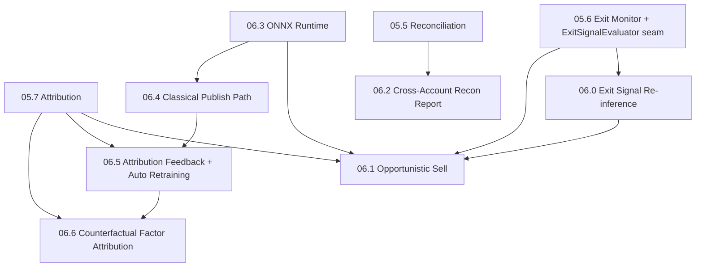

# Phase 06 — ML 扩展相位 子phase索引

<!-- quant-pivot-deployment-contract:v1 -->
> **Deployment contract**
> - `fresh_boot_assumption`: 项目尚未正式生产上线，将从全新 `boot` / schema version `1` 部署；仓库和数据库不保存 lifecycle seal 状态。
> - `schema_data_version_impact`: 本文中的历史版本号与递增路径不再具有实施效力；当前实现不迁移测试数据、旧结构或旧版本。
> - `pre_deployment_behavior`: 允许 clean-break、migration squash 与全新基础设施 bootstrap，但任何数据销毁仍需操作者单独授权。
> - `post_deployment_behavior`: 首次部署后使用正常前向 migration、回滚与数据验证；不使用不可逆 production seal 或兼容桥。
> - `rollback_and_data_verification`: 首次部署前通过清空后的 fresh-install 验证；部署后使用备份、前向 migration 与显式回滚。

> 状态：设计文档 + 部分已落地（**06.0 / 06.1 已实现**，见各子phase §0 落地状态；其余仍为设计契约）
>
> 父文档：[`../08-third-party-crates-and-ml-stack.md`](../08-third-party-crates-and-ml-stack.md)、
> [`../03-data-factor-model-pipeline.md`](../03-data-factor-model-pipeline.md)、
> [`../05-execution-risk-and-governance.md`](../05-execution-risk-and-governance.md)
>
> 本目录承接 **Phase 5 明确延后**、且属于「研究/模型族扩展」或「跨平面增强」的能力。
> 每条延后项在 Phase 5 子phase §11 / [`phase-05/README.md`](../phase-05/README.md) §6.2
> 中已登记；**本目录给出可执行实施契约**，保证后续落地时能闭合 05.6 预留的 seam。

## 0. 为什么单独开 Phase 6

Phase 5 闭环（05.0–05.9）已覆盖：**执行 / 风险 / 治理 / 对账 / 退出监控 / 权益曲线**。
以下能力**不阻塞** Phase 5 生产闭环，但 Phase 5 已在代码与契约层**预留接口**（seam +
enum + metric + config 字段），Phase 6 必须按本目录契约**填 impl**，不得另起炉灶：

| Phase 5 预留（seam） | Phase 6 填 impl | 权威子phase |
|---|---|---|
| `ExitSignalReinferer` + `ReinferenceSignalEvaluator`（thesis invalidation 占位） | **`ModelBackedExitSignalReinferer`** + shadow 激活 | [`06.0`](06.0-exit-signal-reinference.md) |
| `ExitSignalEvaluator` + `ExitReason::Opportunistic` + `quant_exit_triggers_total{reason=opportunistic}` | **已落地**：`HoldVsExitWeighted` Sell scorer + `CompositeExitSignalEvaluator` + 幂等累计 scale-out + 统一审计 fact（shadow 默认关） | [`06.1`](06.1-opportunistic-sell-exit-signal.md) |
| `UnifiedModelRunner` + model registry artifact 类型 | ONNX / classical publish 主路径（08 §17/§15） | [`06.3`](06.3-onnx-runtime-integration.md) / [`06.4`](06.4-classical-model-publish-path.md) |
| 05.7 attribution + training sample source | attribution feedback、自动再训练、CH/outbox 覆盖率强化 | [`06.5`](06.5-attribution-feedback-and-auto-retraining.md) |
| recommendation frozen factor breakdown | 反事实 factor attribution / missed-return 精细估计 | [`06.6`](06.6-counterfactual-factor-attribution.md) |
| 逐订单对账引擎（05.5） | 跨账户周期 reconciliation report | [`06.2`](06.2-cross-account-reconciliation-report.md) |

**硬依赖（Phase 6 开工前必须满足）：**

- 05.6 `ExitMonitor` + `ExitSignalEvaluator` seam + per-lot position ledger（R3）已落地。
- 05.7 attribution 已写入 PG（训练样本来源）。
- MSRV 决策 + `ort` spike（08 §12.5）若走 ONNX 路径。

## 1. 子phase索引

| 子phase | 标题 | 闭环定位 | 文档 | 依赖 |
|---|---|---|---|---|
| 06.0 | Exit Signal Re-inference | **激活 05.6 thesis-invalidation 信号退出** | [`06.0-exit-signal-reinference.md`](06.0-exit-signal-reinference.md) | 05.6 |
| 06.1 | Opportunistic Sell Exit Signal | **闭合 05.6 退出信号 seam（机会性平仓）** | [`06.1-opportunistic-sell-exit-signal.md`](06.1-opportunistic-sell-exit-signal.md) | 05.6 / **06.0** |
| 06.2 | Cross-Account Reconciliation Report | **05.5 对账平面跨账户增强** | [`06.2-cross-account-reconciliation-report.md`](06.2-cross-account-reconciliation-report.md) | 05.5/05.7 |
| 06.3 | ONNX Runtime Integration | ONNX 线上推理（08 §17） | [`06.3-onnx-runtime-integration.md`](06.3-onnx-runtime-integration.md) | 3.4/3.6/08 §12.5 |
| 06.4 | Classical Model Publish Path | smartcore/linfa 主路径 publish（08 §15） | [`06.4-classical-model-publish-path.md`](06.4-classical-model-publish-path.md) | 3.6/3.7/06.3 |
| 06.5 | Attribution Feedback & Auto Retraining | attribution → dataset → retrain governance 闭环 | [`06.5-attribution-feedback-and-auto-retraining.md`](06.5-attribution-feedback-and-auto-retraining.md) | 05.7/06.4 |
| 06.6 | Counterfactual Factor Attribution | 反事实 factor attribution + missed return 精细估计 | [`06.6-counterfactual-factor-attribution.md`](06.6-counterfactual-factor-attribution.md) | 05.7/06.5 |

## 2. 依赖图



## 3. 与 Phase 5 延后项总表的对照

[`phase-05/README.md`](../phase-05/README.md) §6.2 中指向 Phase 6 的条目，**详细设计落点**如下：

| 延后能力 | 详细设计文档 |
|---|---|
| 研究侧 thesis-invalidation 再推理（信号失效退出） | **06.0** |
| 研究侧 `Sell` 排序模型（机会性平仓信号） | **06.1**（非 08 §20 alone — §20 仅通用多模型编排） |
| `ort` / ONNX 线上推理 | 08 §17 + **06.3** |
| classical model 主路径 publish | 08 §15 + **06.4** |
| attribution feedback、自动再训练、CH/outbox 覆盖率强化 | **06.5** |
| 深度反事实 factor attribution / missed-return 精细估计 | **06.6** |
| 跨账户全量对账 / 周期 reconciliation report | **06.2**（登记于 05.5 §11） |

**不在 Phase 6、而在 Phase 5 收尾的项**见 [`05.10-auto-redeem-settlement.md`](../phase-05/05.10-auto-redeem-settlement.md)（`AutoRedeem` 链上赎回）。

**Phase 8+ 部署架构项**见 [`../phase-08/README.md`](../phase-08/README.md)（多副本 leader-elected worker、高频 trailing 评估）。

## 4. 文档契约模板

与 Phase 3/5 相同（10 节固定顺序），见 [`phase-05/README.md`](../phase-05/README.md) §7。

## 5. 质量门禁（每个子phase收尾必跑）

```bash
cargo fmt --all --
cargo clippy --workspace --all-targets -- -D warnings
bash scripts/lint-architecture.sh
bash scripts/lint-quant-pivot-boundary.sh
bash scripts/lint-quant-pivot-errors.sh
cargo test --workspace
```
