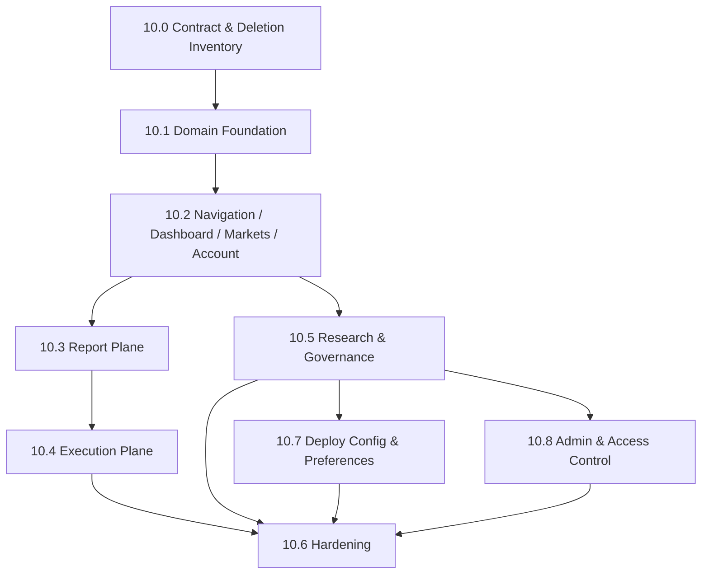

# Phase 10 — Frontend Refactor 子phase索引

<!-- quant-pivot-lifecycle-contract:v1 -->
> **Lifecycle contract**
> - `lifecycle_assumption`: 项目尚未正式生产上线，当前状态为 `pre_production_resettable`，系统自有基线统一为 `boot` / schema version `1`。
> - `schema_data_version_impact`: 本文中的历史版本号与递增路径不再具有实施效力；当前实现不迁移测试数据、旧结构或旧版本。
> - `pre_production_behavior`: 允许 clean-break、migration squash 与全新基础设施 bootstrap，但任何数据销毁仍需操作者单独授权。
> - `production_frozen_behavior`: 一旦完成不可逆 production seal，后续变更必须提供前向 migration、兼容性评估、回滚方案与数据验证。
> - `rollback_and_data_verification`: 封存前通过清空后的 fresh-install 验证；封存后不得回退到 boot reset。

> 状态：10.0 契约冻结（含后端破坏式对齐）已完成；**10.1 types/API/WS/store 地基**、**10.2 导航/首屏/markets/account**、**10.3 Report Plane**、**10.4 Execution Plane**、**10.5 Research Catalog & Realtime**、**10.7 Deploy Config & Runtime Config**（单入口 `/runtime-config` 页：schema 编辑器迁出 preferences、UiText locale-map、`when` 联动、widget/semantics 分离 governance-critical、deploy 只读快照）已落地并通过质量门禁（前端 typecheck/build/unit/eslint 全绿；后端 fmt/clippy/boundary/errors/architecture + models/repository/web/core 单测全绿）；10.6 hardening、10.8 admin 为设计计划，未进入代码落地。
>
> 父文档（概念规格）：[`../10-frontend-refactor.md`](../10-frontend-refactor.md)、
> [`../04-topn-report-and-recommendation.md`](../04-topn-report-and-recommendation.md)、
> [`../05-execution-risk-and-governance.md`](../05-execution-risk-and-governance.md)、
> [`../06-config-deploy-and-ops.md`](../06-config-deploy-and-ops.md)
>
> 范围：`ui/apps/web-antdv-next` 与前端共享类型包 `ui/packages/types`
>
> 本目录把前端破坏式重构拆成 7 个可独立推进、带验收契约的子phase（10.0–10.6）。父文档保持
> "概念真理"，本目录是"可执行实施契约"。任一子phase未满足其 Blocker / 验收，不允许进入
> 下一子phase。

## 0. 为什么拆分

前端重构不是旧 Endgame 页面上"换文案"，而是**重建 quant-pivot 操作台**。保留 Vben/Antdv
后台基础设施与通用治理能力，删除旧套利业务模型。主产物是 `RecommendationReport`，执行桥梁是
`OrderIntent`，运行模式只允许 `report_only`、`semi_auto`、`auto_execution`。

**兼容策略（逐条不可妥协）：**

- 零兼容：删除旧页面、旧 API、旧 store、旧 type、旧 WS case、旧权限码、旧 locale。
- 禁止 re-export 兼容层、旧命名别名、mock-only 生产页面。
- 所有 Decimal/Money/Price/Shares/Bps wire type 在 TypeScript 中均为 `string`。
- `report_only` 不是 dry-run：报告 sizing 基于真实 venue account；缺凭证 fail-closed。

```text
后端 DTO / RBAC / menu seed / WS channel
 -> 10.0 契约冻结 + 删除清单
 -> 10.1 types / API / WS / store 地基
 -> 10.2 首屏 + markets + account
 -> 10.3 RecommendationReport 主产物 UI
 -> 10.4 OrderIntent -> ledger 执行平面
 -> 10.5 research workbench + governance + admin
 -> 10.6 lint / unit / E2E / 删除证明
```

## 1. 子phase索引

| 子phase | 标题 | 闭环定位 | 文档 |
|---|---|---|---|
| 10.0 | Contract & Deletion Inventory | **契约冻结 / 删除清单** | [`10.0-contract-and-deletion-inventory.md`](10.0-contract-and-deletion-inventory.md) |
| 10.1 | Frontend Domain Foundation | **types / API / WS / store 地基** | [`10.1-frontend-domain-foundation.md`](10.1-frontend-domain-foundation.md) |
| 10.2 | Navigation / Dashboard / Markets / Account | **操作台首屏闭环** | [`10.2-navigation-dashboard-markets-account.md`](10.2-navigation-dashboard-markets-account.md) |
| 10.3 | Report Plane | **RecommendationReport 主产物 UI** | [`10.3-report-plane.md`](10.3-report-plane.md) |
| 10.4 | Execution Plane | **Intent -> ledger 执行闭环** | [`10.4-execution-plane.md`](10.4-execution-plane.md) |
| 10.5 | Research Catalog & Realtime | **研究全闭环 catalog + 实时 WS + Recovery 收敛** | [`10.5-research-and-governance.md`](10.5-research-and-governance.md) |
| 10.6 | Hardening | **防回流 + 测试 + 删除证明** | [`10.6-hardening.md`](10.6-hardening.md) |
| 10.7 | Deploy Config & Preferences | **部署/运行配置 UI 分离**（含 runtime-config） | [`10.7-deploy-config-and-preferences.md`](10.7-deploy-config-and-preferences.md) |
| 10.8 | Admin & Access Control | **users/roles/menus 管理台 + 防菜单漂移** | [`10.8-admin-and-access-control.md`](10.8-admin-and-access-control.md) |

## 2. 依赖图



执行原则：

- **10.0** 是设计冻结点，不写业务代码。
- **10.1** 必须先完成旧 types/API/store/WS 切断，再开始大规模页面。
- **10.2** 先交付 operator 首屏、market、account，给 report/execution 提供上下文。
- **10.3** 让 report 成为前端主产物。
- **10.4** 打通真实执行 ledger。
- **10.5** 处理研究和治理，不阻塞 report/execution 主路径（可与 10.3/10.4 并行）。
- **10.6** 阻止旧语义回流并补齐 E2E。

## 3. 架构约束（贯穿全部子phase）

### 3.1 动态路由与菜单

前端路由由后端 menu seed 驱动。后端返回的 `component` 必须一一对应
`ui/apps/web-antdv-next/src/views/${component}.vue`，否则登录后动态路由无法落地。

**因此：菜单、权限码、组件路径必须在 10.0 锁死，在 10.2 同步后端 seed 与 locale。不能先做页面再反向猜菜单。**

Vue Router 支持运行期 `router.addRoute()` 动态注入，但新增 route 后当前页面不会自动重新渲染；
动态路由生成必须在登录后菜单加载阶段完成，不能依赖页面 mounted 后补路由。

### 3.2 Pinia store 边界

Pinia 仅承担状态协调职责。表格主数据由页面 query 拉取，**不能**长期塞进全局 store。

允许进 store 的状态：

- cross-page revision（report/intent/research last event）
- header/system status、kill-switch/mode revision
- market scoped book cache + subscription refs
- WS 连接状态、重连状态、last error

禁止进 store：

- 分页表格列表数据
- 旧 PnL/breaker/trade balance 字段

### 3.3 WebSocket 设计规则

- WS 不携带全量表格数据，所有列表刷新仍走 REST query。
- market book 是唯一允许存储热点 payload 的跨页面 realtime state。
- reconnect 后按顺序：重连成功 → 订阅全局 authorized channels → `sync` → 恢复 market scoped subscriptions。
- unsupported channel 必须在类型层、permission map、dispatch、测试中同时不存在。

## 4. 全局删除清单（贯穿子phase）

> 完整路径见 [`10.0-contract-and-deletion-inventory.md`](10.0-contract-and-deletion-inventory.md) §3。
> 删除不是"最后清理"，而是阻止旧语义继续扩散的架构动作。

| 类别 | 动作 | 归属子phase |
|---|---|---|
| 旧 views（opportunities/trades/risk/…） | **删除** | 10.1 切断引用；10.2+ 确认无残留 |
| 旧 api/store/types | **删除** | 10.1 |
| 旧 shared components/composables | **删除或重建** | 10.1 / 10.2 |
| 旧 locale namespace | **删除** | 10.2（menu seed 同步时） |
| 旧 WS cases | **删除** | 10.1 |
| 新 quant views/api/store/types | **新增或重建** | 10.1 地基；10.2–10.5 页面 |

## 5. API Gap Register（贯穿 10.5）

不得用假数据、mock catalog 或前端拼出来的"伪列表"遮盖后端契约缺口：

| Gap | 前端降级原则 | 归属 |
|---|---|---|
| ~~Research 无 model/dataset/comparison list~~ | **已补齐**：`GET /research/*` 分页 list + catalog 页 | 10.5 ✓ |
| ~~Factor/model publication 无 catalog~~ | **已补齐**：factors/models catalog 页 + governed 行动作 | 10.5 ✓ |
| Account snapshot 无 list | 只展示 live + equity snapshot list | 10.2（历史 list 延后 10.8） |
| Data quality 仅当前快照 | dashboard snapshot，无趋势图 | 10.2 |

补齐 list/catalog 后，必须先更新 10.0 契约与 API matrix，再进入页面实现。

## 6. 风险与控制

| Risk | Impact | Control |
|---|---|---|
| 后端 menu seed 指向不存在 component | 登录后动态路由不可达 | 10.0 锁 component path；10.2 seed path verifier |
| 旧 barrel export 残留 | 新页面继续误用旧 DTO | 10.1 删除旧 export；10.6 lint 禁止旧符号 |
| Research 缺 list endpoint | 前端容易造假 catalog | 10.0 gap register；10.5 ID-driven workbench |
| WS 推送被当作表格事实源 | 状态不一致、分页错乱 | WS 只改 revision，表格始终 REST query |
| `report_only` 被误解为 dry-run | 资金/凭证语义错误 | System/Dashboard 文案明确 credential-gated sizing |
| Governed mutation 错误被吞 | 操作者无法判断 fail-closed 原因 | 409/403/422 detail 原样展示 |
| 菜单权限和 RBAC catalog 漂移 | 按钮不可见或越权显示 | 10.0 权限矩阵；10.6 permission catalog test |

## 7. 文档契约模板（每篇子phase文档固定顺序）

1. **目标与闭环定位** —— 交付什么、在前端重构主链中的位置。
2. **删除 / 合并 / 重构清单** —— 加新页面前必须删/合/重构的 views / api / store / types / locale / WS。
3. **契约与模块设计** —— 菜单/API/WS/types/store/组件的详细设计。
4. **推进计划** —— 分步骤 scope、交付物、验收标准。
5. **生产不变量与 UX 语义** —— fail-closed、governed modal、权限、凭证语义。
6. **验收测试** —— unit / component / E2E 必须覆盖的路径。
7. **Blocker** —— 触发即判定本子phase失败的条件。
8. **延后 / 缺口** —— 本子phase明确不做、留给后续的点。

## 8. 质量门禁

**前端（每个子phase收尾，10.6 全量）：**

```bash
pnpm -F @vben/web-antdv-next run typecheck
pnpm -F @vben/web-antdv-next run build
pnpm test:unit -- --runInBand
pnpm lint
```

**后端 seed 或 RBAC 变更后（10.2 起）：**

```bash
cargo fmt --all --
cargo clippy --workspace --all-targets -- -D warnings
bash scripts/lint-architecture.sh
bash scripts/lint-quant-pivot-boundary.sh
bash scripts/lint-quant-pivot-errors.sh
cargo test --workspace
```

## 9. 外部参考

- [Vben Admin 权限](https://doc.vben.pro/guide/in-depth/access.html)：后端动态菜单、混合访问控制、权限码按钮控制。
- [Vben Admin 路由和菜单](https://doc.vben.pro/guide/essentials/route.html)：核心/静态/动态路由边界。
- [Pinia setup stores](https://pinia.vuejs.org/core-concepts/)：store 边界。
- [Vue Router dynamic routing](https://router.vuejs.org/guide/advanced/dynamic-routing.html)：运行期 `addRoute` 行为。
