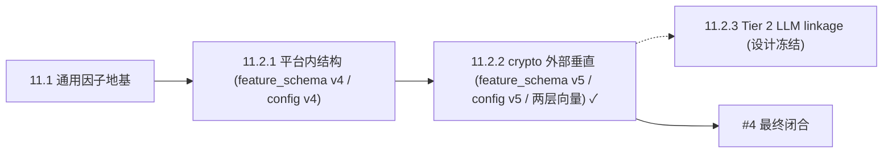

# 11.2 — Polymarket Vertical Alpha（拆分索引，SUPERSEDED-BY-SPLIT）

> **本文档已破坏式拆分**为两篇权威子设计，不再承载具体设计内容（零 re-export、零重复真理）：
>
> - [`11.2.1-platform-structural-alpha.md`](11.2.1-platform-structural-alpha.md) — **平台内结构性阿尔法**
>   （`FactorFamily::Structural` 因子族 + neg-risk 全腿 PIT + `FavoriteLongshotBiasTable` + 删除死垂直脚手架
>   + runtime-config v12→v13 + 治理页）。**无外部数据源**。关闭审计点 **#4 前半**。
> - [`11.2.2-crypto-external-vertical.md`](11.2.2-crypto-external-vertical.md) — **crypto 外部垂直**
>   （两层 `FeatureVector` + 分层 linkage Tier 0/1 + `ResolutionOracle` + **Binance REST `/api/v3/klines`**
>   特征源 + ClickHouse domain 事实 + PIT + category 路由 + `ModelRouting` + dataset 扩展 +
>   runtime-config **v5** / `feature_schema_version` **5**）。**已落地**。关闭审计点 **#4 后半**，
>   最终闭合 #4。
> - [`11.2.3-tier2-llm-linkage.md`](11.2.3-tier2-llm-linkage.md) — **Tier 2 LLM linkage 兜底**
>   （离线 schema-enforced 抽取 + `SubjectValidator` grounding gate 复用 + review queue + provider 抽象）。
>   **设计冻结，待实现**；扩展 11.2.2 长尾 coverage，不进在线热路径。
>
> **拆分动机**：原 11.2 把"平台内可算（无外部依赖）"与"crypto 外部垂直（需 Binance + 分层 linkage +
> bitemporal ledger + 两层向量破坏式重构）"两类工作绑在一起，粒度过大、可验收边界不清。拆分后：
> 11.2.1 是自足的、无外部数据依赖的结构阿尔法闭环；11.2.2 是外部垂直闭环，正确重建 11.2.1 删除的 domain
> 契约。
>
> **两篇合计取代** [`../phase-03/03.8-vertical-domain-closed-loop.md`](../phase-03/03.8-vertical-domain-closed-loop.md)
> （标注 `> SUPERSEDED by phase-11/11.2.1 + 11.2.2`）。

## 依赖顺序

## 审计点 #4 归属

| 审计点 #4 | 前半：平台内结构性阿尔法 | 后半：crypto 外部垂直 |
|---|---|---|
| 归属 | [11.2.1](11.2.1-platform-structural-alpha.md) | [11.2.2](11.2.2-crypto-external-vertical.md)（已落地） |
| 闭合内容 | 结构因子族 + neg-risk 全腿 + favorite-longshot | domain registry 激活 + Binance 特征源 + 两层向量 + category 路由 |
| 后续 | — | 长尾 linkage → [11.2.3](11.2.3-tier2-llm-linkage.md)（Tier 2 LLM，离线 only） |
