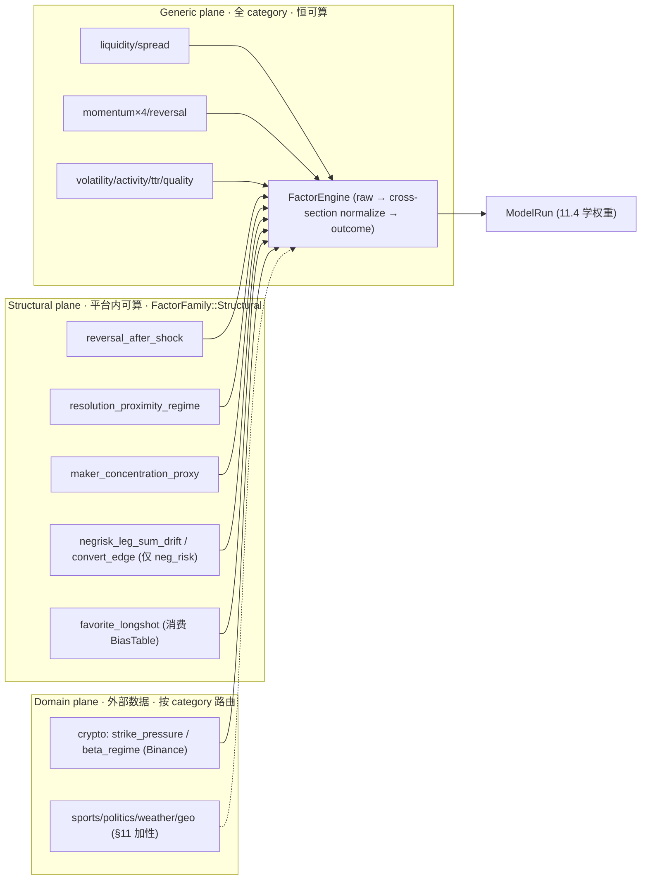
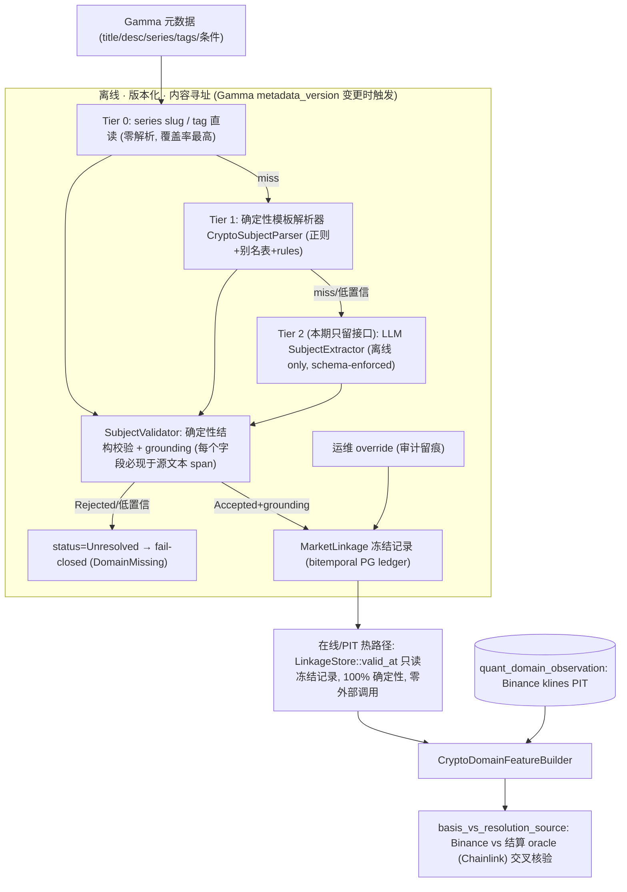

# 11.2 — Polymarket Vertical Alpha（权威设计）

> 关闭审计点：**#4（垂直/领域信号完全缺席：domain feature 恒 `DomainDataMissing`、
> `DomainFactorRegistry` 从不注册、`FactorRegistry::build` 不挂载；Polymarket 真实边缘一个都没有）**。
>
> **本文档地位**：Polymarket 结构性 + 领域性阿尔法的**唯一权威设计**。它**破坏式接管**并**取代**
> [`../phase-03/03.8-vertical-domain-closed-loop.md`](../phase-03/03.8-vertical-domain-closed-loop.md)
> 的垂直闭环设计（03.8 的"LLM 优先市场链接"假设与"特征源=结算源=Binance"假设均已被本文档修正，
> 见 §3.6）。落地时 03.8 头部标注 `> SUPERSEDED by phase-11/11.2`，不做 re-export、不保留旧 seam。
>
> **状态**：设计冻结（DESIGN-FROZEN），待实现。本期一次性落地：Structural 因子族 + 平台内可算结构因子
> （含 neg-risk 全腿在线+离线闭环）+ FavoriteLongshotBiasTable + **完整** crypto 外部垂直（确定性优先
> linkage + Binance 特征源 + ClickHouse domain 事实 + PIT + 两层特征向量 + category 路由 + dataset 扩展）
> + 治理页与可视化。
>
> **与 11.3 的握手**：`FavoriteLongshotBiasTable`（市场隐含价 → 经验结算频率的校准）本期在 11.2 落地，
> 语义上与 11.3 的 `ProbabilityCalibrator`（模型 score → P(win) 的校准）同属**校准 artifact 家族**；11.3
> 正式落地后统一到 `CalibrationArtifactId` 治理（见 [11.3 §3.4](11.3-probabilistic-calibration-and-kelly.md)）。
>
> 兼容策略（逐条不可妥协）：**零兼容、零 re-export、零向前兼容、零死语义**。接受破坏式变更
> （runtime-config schema v12→v13、`feature_schema_version` bump、`FeatureVector` 结构破坏式重构）。

---

## 1. 目标与闭环定位

把在线因子层从"platform-agnostic 微结构排序"升级为"**prediction-market-aware 排序**"，并激活领域按 category
路由。它是 Phase 11 阿尔法链的第二环：`11.1 通用因子地基 → 11.2 领域/结构因子 → 11.4 训练把两类因子一起学权重`。

三类阿尔法（严格分层，语义精准）：

1. **结构性因子（Structural，平台内可算，本期必须落地）**：仅依赖 quant-pivot 已有事实（book / price /
   registry / neg-risk metadata / microstructure window），产出真实边缘，无需任何外部数据源。
2. **领域性因子（Domain，需外部数据，本期落地 Crypto 参考垂直）**：接 Binance 标的价，按 category 路由；
   其余 4 垂直（Sports/Politics/Weather/Geopolitics）加性扩展、post-11.2（§11）。
3. **校准偏差因子（favorite_longshot，消费 `FavoriteLongshotBiasTable`）**：本期落地经验偏差表，纠正 retail
   系统性尾部高估。

设计立场（实证支撑，逐条核对 §12 文献）：

- **Favorite-longshot reversal**：Polymarket 低概率 token 系统性被**高估**、高概率 token 被**低估**。该偏差
  **并非每个市场都存在**，需按 category / time-to-resolution 条件化，部分市场可能是"Yes Bias"统计假象。
  因此因子必须**条件化 + 可开关 + 经 IC 验证**（arXiv Polymarket-v1 Database；*How Wise is the Crowd?*）。
- **Neg-risk 结构约束**：多结果事件（3+ outcomes）走 Neg Risk CTF Exchange；各腿 YES 之和应 ≈ 1，漂移即
  结构性错价；NO 可经 Neg Risk Adapter 转成其余全部 YES（capital-efficiency 边缘）。
- **强反转性 / 参与者集中**：大幅波动后 24–48h 显著回补；top 1% maker 占 84% 成交（Gini 0.97），whale 系统性
  向小单让出 EV。
- **结算源已多元化**：短周期 crypto 市场（5m/15m）多用 **Chainlink Data Streams** 链上自动结算，daily/阈值
  梯度仍用 **Binance BTC/USDT 1m candle**；两者在结算毫秒会分叉（"oracle gap"）。这**修正** 03.8"特征源=
  结算源=Binance"的过时假设，引入 `ResolutionOracle` 建模 + basis 交叉核验（§3.6）。

---

## 2. 删除 / 合并 / 重构清单（该删/合并/迁移，逐条给出处置）

| 对象 | 现状 | 处置 |
|---|---|---|
| `DomainFeatureSkeleton`（[`features/domain/mod.rs`](../../../crates/quant-pivot-research/src/features/domain/mod.rs) `:49-63`），恒发 5×`DomainDataMissing` | 死/有害占位：把"结构上不适用"与"数据缺失"混淆，污染 `feature_hash` 与训练矩阵 | **删除**。由两层特征向量（§3.3）+ 真实 `CryptoDomainFeatureBuilder`（§3.6）取代；非映射 category → `domain: None`（不再 5×Missing）。 |
| `DOMAIN_FEATURES` 中 sports/politics/weather/geopolitics 4 条占位特征名（[`features/names.rs`](../../../crates/quant-pivot-research/src/features/names.rs) `:88-106`），从不 emit | 死语义 | **删除** 4 条非 crypto 占位；crypto 换成真实特征名（§3.6）。其余 4 垂直加性扩展时再加真实名（§11）。 |
| `DomainFactorComputer` / `DomainFactorRegistry`（[`factors/domain.rs`](../../../crates/quant-pivot-research/src/factors/domain.rs)），从不注册、`FactorEngine` 不挂载 | 死代码 | **激活**（非删除）：`FactorEngine::compute_all_batch_inner` 在通用/结构因子后按向量内 category 追加 `DomainFactorRegistry::for_category`（§3.7）。 |
| `FeatureVector`（[`features/value.rs`](../../../crates/quant-pivot-research/src/features/value.rs) `:227-246`）单一扁平 `values: BTreeMap` | 无 generic/domain slice 区分，无法表达"结构不适用" | **破坏式重构**为两层向量 + 复合 hash（§3.3）。 |
| `struct.reversal_after_shock` vs 既有 `mean_reversion`；`struct.resolution_proximity_regime` vs 既有 `time_to_resolution` | 语义相邻 | **保留但正交化**：结构因子是**条件/交互**信号（shock 条件反转、ttr×价格分位交互），与线性因子非同一列；纳入 `FactorCollinearityAnalyzer`（[`factors/collinearity.rs`](../../../crates/quant-pivot-research/src/factors/collinearity.rs)）\|ρ\|>阈值 触发正交化/删列。 |
| favorite_longshot 偏差表 | 本期 11.2 自有 artifact | **迁移路径明确**：未来 11.3 校准落地后统一到 `CalibrationArtifactId` 治理（§3.5 + 11.3 §3.4）；本期 `FavoriteLongshotBiasTableId` 独立声明。 |
| 03.8 D1 "LLM 优先"市场链接假设 | 过时（非确定、不可回放、resolution 源已多元） | **取代**为分层解析器（Tier 0 slug → Tier 1 模板 → Tier 2 可选 LLM 兜底）+ 确定性校验器 + grounding（§3.6）；本期只实现 Tier 0/1，Tier 2 留可插拔接口。 |
| 03.8 D3 "特征源=结算源=Binance"假设 | 过时（短周期市场用 Chainlink） | **取代**为 `ResolutionOracle` 建模 + basis 交叉核验（§3.6）。 |

无需删除既有 factor/feature registry / trait 骨架、执行/对账/结算平面；在其上重构。

---

## 3. 契约与算法设计

### 3.0 三层因子平面总览



- **Generic**：`FactorFamily::ALL_GENERIC`（11.1 已落地 8 族），config `factors.enabled_factor_families` 开关。
- **Structural**：新增 `FactorFamily::Structural`（**平台内可算、config 可选、neg-risk 因子自条件化**），与
  generic 同 registry、独立开关；`FactorDefinitionScope::Structural`。
- **Domain**：`FactorFamily::Domain*`（5 垂直），**不进 config**，由 `DomainFactorRegistry::for_category`
  按 `market.category` 路由；`FactorDefinitionScope::Domain*`。

### 3.1 结构性因子定义（平台内可算，本期必须落地）

| 因子 | family | category 适用 | 定义 | 输入特征 | 经济含义 |
|---|---|---|---|---|---|
| `struct.reversal_after_shock` | Structural | 全体 | shock 门控的反转打分：`shock = |ret_short| / realized_vol_short`；当 `shock > k`（config）时输出 `−sign(ret_short)·min(shock, cap)`，否则 confidence 低（不参与） | window mids（`ts_*`） | 大移动后 48h 部分回补；条件反转，正交于线性 `mean_reversion` |
| `struct.resolution_proximity_regime` | Structural | 全体 | `time_to_resolution` 分桶 × 价格极端度 `|mid − 0.5|` 的交互打分 | `market.time_to_resolution_secs`、`book.mid` | 临近 resolution 的定价成熟度差异（交互项，正交于线性 `time_to_resolution`） |
| `struct.maker_concentration_proxy` | Structural | 全体 | 用 `micro.book_churn` + 大单占比近似 maker 集中度 | `micro.book_churn`、depth 分布 | 集中做市 → 结构性 taker 劣势/优势 |
| `struct.negrisk_leg_sum_drift` | Structural | `neg_risk=true` | `Σ best_ask(all YES legs) − 1`（另出 bid/mid 版本作 confidence 佐证） | sibling legs book（§3.4） | 多腿和偏离 1 = 结构性错价 |
| `struct.negrisk_convert_edge` | Structural | `neg_risk=true` | `cost(buy YES basket of all-but-favorite) − cost(buy NO_favorite via adapter)` | sibling legs book | 转换套利式 capital-efficiency 边缘 |
| `struct.favorite_longshot` | Structural | 全体（条件化） | 按 `mid` 价分位查 `FavoriteLongshotBiasTable[(category, bucket)]` → `E[bias]`（signed） | `book.mid`、`market.category`、BiasTable | 校正 retail 尾部高估（§3.5） |

**语义精准**：
- neg-risk 因子对 `neg_risk=false`（binary/单市场）输出 `NormalizedFactor::NotApplicable`（**非 missing、非 0**）。
- 缺腿 → `Indeterminate { reason: LegBookMissing }`（源自 `FactorIndeterminateReason` 扩展）。
- `favorite_longshot`：BiasTable 缺失或该 category IC 不显著 → 因子 disabled（confidence=0，report 显 —），
  不静默套用。

### 3.2 Structural 因子的 raw/normalize 分离（复用 11.1 引擎）

结构因子全部实现为 `FactorComputer`（[`factors/computer.rs`](../../../crates/quant-pivot-research/src/factors/computer.rs)
`FactorComputer::compute_raw(&FeatureVector)`），**不改签名**（sibling legs 与 category 已在向量/上下文内）；
归一化走 11.1 的 `CrossSectionalNormalizer`（默认 `WinsorizedZScore`，neg-risk 漂移用 `WinsorizedZScore`，
favorite_longshot bias 已是 signed 期望值用 `MinMax` 界值经 config）。**零硬编码归一化常量**（与 11.1 一致）。

### 3.3 两层特征向量 + 复合 hash（D2 破坏式）

**动机**：当前对每个 market 强 emit 全 5 垂直 `DomainDataMissing`，把"该 category 结构上不适用该垂直"与
"数据源缺失"混淆（污染 `feature_hash`、训练矩阵）。破坏式修订（[`features/value.rs`](../../../crates/quant-pivot-research/src/features/value.rs)）：

```rust
/// Point-in-time feature vector: a fixed-width generic slice + an optional,
/// category-scoped domain slice. There is no 5×missing pollution: a market whose
/// category maps to no vertical (or whose vertical has no source) carries
/// `domain = None`, which is *structurally distinct* from a present-but-missing
/// domain feature.
pub struct FeatureVector {
    pub market_id: MarketId,
    pub token_id: Option<TokenId>,
    pub as_of: DateTime<Utc>,
    pub generic_schema_version: SchemaVersion,
    /// Generic + Structural plane (platform-computable, always present, fixed width).
    pub generic: BTreeMap<FeatureName, FeatureValue>,
    /// Category-mapped external vertical slice; `None` when the category maps to no
    /// vertical or the vertical is unresolved/unavailable (fail-closed, not zero).
    pub domain: Option<DomainFeatureSlice>,
    pub substitutions: Vec<SubstitutionAudit>,
    pub data_quality: DataQualityStatus,
    pub staleness_ms: u64,
    pub source_refs: Vec<EvidenceSourceRef>,
}

pub struct DomainFeatureSlice {
    pub family: DomainFamily,
    pub schema_version: SchemaVersion,
    pub values: BTreeMap<FeatureName, FeatureValue>,
}
```

**复合 hash**（[`hashing.rs`](../../../crates/quant-pivot-research/src/hashing.rs) `ResearchHasher::feature_vector`）：

```text
feature_hash = H(
  generic_schema_version,
  H(generic_values),                              // 排序 BTreeMap 规范 JSON
  domain_family | "none",
  domain_schema_version | 0,
  H(domain_values) | "∅",
)
```

- 布局在 `(generic_schema_version, domain_family, domain_schema_version)` 内定序固定 → hash 确定；Decimal 量化防 ULP 漂移（沿用 `STAT_SCALE=12`）。
- **联动改造**（均破坏式）：`features/persistence.rs`（`FeatureVector::try_to_new`）、`features/builder.rs::compute_vector`、`features/schema.rs`（`domain_specs`/`build`，`FeatureFamily::Structural` 归 generic slice）、`training/mod.rs::CanonicalExample` + `dataset_hash`、`training/matrix.rs::matrix_spec_from_schema`。
- bump `features.feature_schema_version`（当前 3 → 4）。**结构因子的特征归 generic slice**（平台内可算，恒存在），domain slice 只装外部垂直特征。

### 3.4 neg-risk 全腿 PIT 解析（在线 + 离线一致，训练-服务零 skew）

**问题**：当前管线逐市场（只解析 primary token book）；neg-risk 漂移/转换因子需要**同一 event 全部 YES 腿的
PIT book**。破坏式新增 event 全腿解析，**在线与离线双侧对称**（否则违反 11.6 训练-服务一致性）。

```rust
// MarketRegistry (quant-pivot-core / models domain)
impl MarketRegistry {
    /// The event a market belongs to, if catalogued.
    pub fn get_event(&self, event_id: &EventId) -> Option<Arc<EventRegistryInfo>>;
    /// Every YES-leg token id of a neg-risk event, deterministically ordered by
    /// market_id then token_id (stable for hashing / parity).
    pub fn neg_risk_yes_legs(&self, event_id: &EventId) -> Vec<NegRiskLeg>;
}

pub struct NegRiskLeg { pub market_id: MarketId, pub yes_token_id: TokenId }

// FeatureComputeCtx (features/builder.rs) 新增 sibling legs — PIT-resolved books.
pub struct ResolvedLeg {
    pub market_id: MarketId,
    pub token_id: TokenId,
    pub book: ResolvedBook,   // resolved at the SAME as_of (PIT)
}
// FeatureComputeCtx { …, pub sibling_legs: &'a [ResolvedLeg] }
```

- **在线**：`crates/quant-pivot-core/src/service/feature_pipeline.rs` + `ConfiguredFeatureBuilder::resolve_inputs`——对 `neg_risk=true` 市场，用 `PitView::resolve_book`（已支持任意 token）解析 `neg_risk_yes_legs` 的全腿 book@`as_of`，注入 `FeatureComputeCtx.sibling_legs`。
- **离线**：`core/src/pipeline/historical_window.rs::HistoricalWindowLoader` **预取同 event 全腿 book** 进 `MaterializedPitEngine`；`historical_replay.rs::materialize_cross_section` 透传 sibling legs。**在线与离线 sibling 解析走同一 `resolve_book` 语义 → byte-identical**。
- **失败语义**：缺腿 → `Indeterminate { LegBookMissing }`；binary → `NotApplicable`；全腿必须同一 `as_of` 解析（PIT）。**绝不静默填 0**。

### 3.5 FavoriteLongshotBiasTable（11.3 提前件，本期落地）

**语义**：市场隐含价（mid）→ 该价位历史结算为 YES 的**经验频率**的校准表，按 `(category, price_bucket)`
条件化。与 11.3 的 `ProbabilityCalibrator`（模型 score→P(win)）**同属校准 artifact 家族**，但校准对象不同
（这里是**市场隐含概率**的校准，是 favorite-longshot 偏差的直接度量）。

```rust
pub struct FavoriteLongshotBiasTable {
    pub table_id: FavoriteLongshotBiasTableId,
    pub content_hash: ContentHash,          // blake3 canonical
    pub fit_window: TimeWindow,             // 拟合样本区间
    pub calibration_split_hash: ContentHash,// 独立拟合集 hash（防泄漏，与 11.3 一致）
    pub by_category: BTreeMap<MarketCategory, CategoryBiasCurve>,
}
pub struct CategoryBiasCurve {
    pub bins: Vec<PriceBiasBin>,
    pub ic: Decimal,                        // 该 category 偏差因子的样本内 IC
    pub ic_significant: bool,               // IC 显著性门（11.5 联合）
    pub sample_count: u64,
}
pub struct PriceBiasBin {
    pub price_lo: Price,
    pub price_hi: Price,
    pub implied_mid: Price,                 // 桶中值
    pub realized_frequency: Probability,    // 桶内结算 YES 经验频率
    pub bias: Decimal,                      // realized_frequency − implied_mid（signed）
    pub bias_ci: (Decimal, Decimal),        // Wilson 区间
    pub sample_count: u64,
}
```

**拟合协议**（research 纯 + core 编排，与 11.3 校准 fit 同范式）：

1. 从训练 spine 逐样本收集 `(category, entry_mid, settled_yes)`：`entry_mid` 来自 PIT book mid
   （`historical_replay.rs:151`），`settled_yes` 来自 `SettlementOutcomeLabeler`（真相键 `winning_token_id`，
   [`training/labeler.rs`](../../../crates/quant-pivot-research/src/training/labeler.rs) `:347`）。
2. 按 category 分层，按价格分桶（config `bins`，默认等宽或经验分位），每桶算 `realized_frequency`、Wilson CI、
   `bias = realized_frequency − implied_mid`、per-category IC。
3. 产 content-addressed artifact（`blake3:`）；**独立拟合集**（与训练/校准集不相交，hash 校验），遵守 11.5 purge/embargo。
4. 拟合走 research job（[`routes/research_jobs.rs`](../../../crates/quant-pivot-web/src/routes/research_jobs.rs)）+ 治理端点；config `factors.structural.favorite_longshot.bias_table_ref`。

**消费**：`struct.favorite_longshot` 因子按 `mid` 落桶 → `bias`（signed）作为 raw_value；表缺失/该 category
`ic_significant=false` → 因子 disabled。**迁移**：11.3 落地后 `bias_table_ref` 统一到 `CalibrationArtifactId`。

### 3.6 Crypto 外部垂直：分层 linkage 架构（确定性优先，取代 03.8 LLM 优先）

#### 3.6.1 为什么分层（生产级最佳实践，逐条核对 §12 文献）

金融 reference data / security master 的权威范式是**分层解析**（deterministic → probabilistic → ML/LLM →
human-in-the-loop），且 **precision ≫ recall**（一次错链污染所有下游 join，ml4trading Ch.4）；全链路
**离线 + 版本化 + 内容寻址 + bitemporal PIT 可回放**（VectorFin bitemporal；Horkan ER：把 ER 当基础设施）。

Polymarket crypto 的关键判断：这是**"解析问题"（parse）而非"模糊匹配问题"（fuzzy match）**——描述高度
模板化、series 分组、slug 按时钟确定性生成。因此**确定性层能覆盖绝大多数成交量主力市场**，LLM 只在长尾有
边际价值，且必过同一确定性校验器（LLM 结构化抽取生产范式：schema-enforced + runtime validation +
**evidence binding/grounding** + deterministic fallback + fail-closed，见 Fordel / PARSE / dev.to）。



#### 3.6.2 解析器分层契约

```rust
/// One tier of the layered linkage resolver. Deterministic tiers (Tier0/Tier1)
/// are pure research functions; the Tier2 LLM extractor lives behind this trait
/// and runs OFFLINE ONLY — never on the online/PIT hot path (non-deterministic,
/// non-replayable). This iteration ships Tier0 + Tier1; Tier2 is interface-only.
pub trait SubjectExtractor: Send + Sync {
    fn tier(&self) -> ResolverTier;                 // Tier0Slug | Tier1Template | Tier2Llm
    fn resolver_version(&self) -> ResolverVersion;
    fn extract(&self, ctx: &LinkageExtractCtx<'_>) -> QuantResult<Option<ExtractedSubject>>;
}

/// The SINGLE gate: every candidate subject (from ANY tier) must pass this before
/// it becomes a frozen linkage. Structural validation + grounding (each extracted
/// value must appear as a literal span in the source metadata) — this is why the
/// deterministic validator is irreplaceable even when Tier2 LLM is used.
pub trait SubjectValidator: Send + Sync {
    fn validate(&self, candidate: &ExtractedSubject, source: &LinkageSource<'_>)
        -> QuantResult<ValidationOutcome>; // Accepted { grounding } | Rejected { reason }
}

pub enum ResolverTier { Tier0Slug, Tier1Template, Tier2Llm, Override }
pub enum LinkageStatus { Resolved, Unresolved, Overridden }
```

#### 3.6.3 领域主体与冻结记录

```rust
/// The settlement oracle a crypto market resolves against. Feature source
/// alignment: Binance klines is the feature source; when the oracle is Chainlink,
/// basis is modeled explicitly (§3.6.6). Label truth is ALWAYS market_resolution_event.
pub enum ResolutionOracle {
    BinanceKline { symbol: BinanceSymbol, interval: KlineInterval, field: KlineField },
    ChainlinkDataStreams { feed_id: String },
    Other { descriptor: String },   // 未识别 → 特征侧 basis fail-closed
}

pub enum PriceComparator { Above, Below, Between { hi: Price }, UpVsReference }

pub struct CryptoSubject {
    pub asset: CryptoAsset,             // BTC / ETH / SOL / ...
    pub quote: CryptoQuote,             // USDT / USD
    pub comparator: PriceComparator,
    pub strike: Option<Price>,          // None for Up/Down (relative) markets
    pub reference_at: Option<DateTime<Utc>>, // Up/Down 的参考观测时刻
    pub observation_at: DateTime<Utc>,  // resolution 观测时刻 (UTC, ET 归一化)
    pub resolution_oracle: ResolutionOracle,
}

pub enum MarketSubject { Crypto(CryptoSubject) } // Sports/… 加性 (§11)

/// Frozen, content-addressed, bitemporal market → external-subject linkage record.
pub struct MarketLinkage {
    pub linkage_id: MarketLinkageId,
    pub market_id: MarketId,
    pub domain_family: DomainFamily,
    pub subject: MarketSubject,
    pub instrument_key: DomainInstrumentKey,  // e.g. "BINANCE:BTCUSDT:1m"
    pub confidence: Probability,
    pub status: LinkageStatus,
    pub resolver_tier: ResolverTier,
    pub resolver_version: ResolverVersion,
    pub metadata_version: MarketMetadataVersion, // 派生自哪个 Gamma 元数据版本 (bitemporal knowledge axis)
    pub content_hash: ContentHash,               // blake3 of subject + bindings
    pub grounding: GroundingProof,               // 字段 → 源文本 span 映射 (防幻觉审计)
}

/// Bitemporal, append-only linkage ledger (SCD2). PIT: valid_at returns the record
/// valid at `as_of` by metadata_version — never a future revision.
pub trait LinkageStore: Send + Sync {
    async fn upsert(&self, linkage: MarketLinkage) -> QuantResult<MarketLinkageId>;
    async fn valid_at(&self, market_id: &MarketId, as_of: DateTime<Utc>)
        -> QuantResult<Option<MarketLinkage>>;
    async fn set_override(&self, market_id: &MarketId, subject: MarketSubject, reason: &str)
        -> QuantResult<MarketLinkageId>;
}
```

#### 3.6.4 domain 摄取与 PIT（Binance 特征源）

```rust
pub struct DomainObservation {
    pub family: DomainFamily,
    pub source_id: DomainSourceId,           // "binance"
    pub instrument_key: DomainInstrumentKey, // "BINANCE:BTCUSDT:1m"
    pub metric: DomainMetric,                // Close / High / Low / Open / Volume
    pub value: Decimal,
    pub observed_at: DateTime<Utc>,          // candle close_time (PIT event_time)
    pub publish_time: DateTime<Utc>,         // 源发布时刻 (lag bound)
}

/// Provider-agnostic external source; concrete BinanceKlineSource in quant-pivot-api.
pub trait DomainDataSource: Send + Sync {
    fn family(&self) -> DomainFamily;
    fn source_id(&self) -> DomainSourceId;
    async fn fetch(&self, req: DomainFetchRequest) -> QuantResult<Vec<DomainObservation>>;
}

/// PIT query over stored domain observations (mirrors PitQueryEngine).
pub trait DomainPitQueryEngine: Send + Sync {
    async fn observations_at(
        &self, key: &DomainInstrumentKey, metric: DomainMetric,
        as_of: DateTime<Utc>, lookback: Duration,
    ) -> QuantResult<Vec<DomainObservation>>; // event_time <= as_of - source_delay, 稳定排序
}
```

- **在线/摄取脏活**归 core/api：`BinanceKlineSource`（[`quant-pivot-api`](../../../crates/quant-pivot-api)，公有无 key，`reqwest` + `infra/retry`，weight 限流，仿 `data_api/mod.rs`）、`DomainIngestor`（按 `instrument_key` 拉 klines → CH）、`ChDomainPitSource`。
- **离线纯引擎**：`MaterializedDomainPitEngine`（内存二分取 `<= as_of - source_delay` 最新值，零 DB，与 `MaterializedPitEngine` 同范式，在线/离线 byte-identical）。

#### 3.6.5 Crypto 特征 / 因子

| feature | 含义 | 输入 |
|---|---|---|
| `domain.crypto.distance_to_strike` | `(close − strike)/strike`，方向按 comparator | Binance close + subject.strike |
| `domain.crypto.underlying_momentum` | 标的近窗 momentum | Binance close 序列 |
| `domain.crypto.underlying_realized_vol` | 标的近窗 realized vol | Binance close 序列 |
| `domain.crypto.time_to_observation` | now → observation_at | subject.observation_at |
| `domain.crypto.basis_vs_resolution_source` | 特征源(Binance) vs 结算 oracle 价差；oracle=Chainlink 时为风控信号 | Binance close vs oracle 报价 |

crypto 域因子（`DomainFactorComputer`，注册进 `DomainFactorRegistry`）：`domain_crypto_strike_pressure`
（distance_to_strike + time_to_observation 的压力打分）、`domain_crypto_beta_regime`（标的 momentum/vol regime）。
缺 domain 输入 → `RawFactor{ raw_value: None, confidence: 0 }`（`DomainMissing`，绝非静默 0）。

#### 3.6.6 basis 交叉核验（结算源多元的正确处理）

- Binance klines 作**标的价特征源**（免费/多年 1m/PIT 干净）。
- 当 `resolution_oracle = ChainlinkDataStreams` 时，`basis_vs_resolution_source` 度量 Binance 与 Chainlink 报价
  差，超阈值（config `domain.crypto.cross_check.max_basis_bps`）→ 风控信号 + 标记 linkage 复核。
- **label 真相恒来自** CH `market_resolution_event`（实际结算，`winning_token_id`），**Binance 永不当 label**。

### 3.7 因子 category 路由（DomainFactorRegistry 激活）

```rust
/// Routes structural/domain factors by market category and market-structure flags.
pub trait DomainFactorRouter {
    fn factors_for(&self, category: MarketCategory, neg_risk: bool) -> Vec<FactorId>;
}
```

`FactorEngine::compute_all_batch_inner`（[`factors/computer.rs`](../../../crates/quant-pivot-research/src/factors/computer.rs)）
在 generic + structural 因子之后，按向量内 `FeatureValue::Category` 追加 `DomainFactorRegistry::for_category`
的因子。neg-risk 专属结构因子只对 `neg_risk=true` 计算，否则 `NotApplicable`（非 missing、非 0）。

### 3.8 ModelRouting + FeatureAvailabilityOracle（解硬编码）

```rust
pub enum ModelRouting {
    /// Generic + structural weighted scorer — all categories.
    GenericWeighted,
    /// Category-specific artifact consuming generic ⊕ structural ⊕ that vertical's domain slice.
    CategorySpecific { category: MarketCategory, artifact: ModelVersionId },
}
```

- `WeightedFactorModelArtifact` 增 `category_scope: Option<MarketCategory>`。
- `FeatureAvailabilityOracle` 解硬编码 `DomainExternal => false`：category→family 有已接源 ∧ 存在 `Resolved`
  linkage ∧ 源在 `as_of` 有 PIT 数据。
- **fail-closed 降级矩阵**：domain missing + generic model → 继续（domain 因子 ZeroWeight）；model spec 显式
  require domain → Oracle 判不可用 → selection `ModelFeatureUnavailable` 排除该 market；无 category-specific
  artifact → 回落 `GenericWeighted`。

### 3.9 离线 dataset domain slice 扩展（加性，不回推 3.5）

- `HistoricalWindowLoader` 预取 domain observations + 冻结 `MarketLinkage` + neg-risk 全腿 book，构造
  `MaterializedDomainPitEngine` 并入 materialized bundle。
- `TrainingDatasetService` 逐样本经 `CryptoDomainFeatureBuilder` 注入 domain slice；结构因子/domain 因子经已接线
  `FactorEngine` 写入 `TrainingExample`。
- `build_training_matrix` / `DatasetParquetCodec` / `dataset_hash` 承载 domain 列（与 generic 列清晰分区）；
  `dataset_hash` canonical 纳入 `domain_family` + domain slice hash。
- leakage：domain 证据 `observed_at <= as_of - source_delay`；neg-risk sibling legs 同 `as_of`。

---

## 4. 新领域类型 / 表 / ClickHouse fact

- **枚举**（models）：`FactorFamily::Structural` + `FactorDefinitionScope::Structural`；`FeatureFamily::Structural`；
  `ResolutionOracle`、`PriceComparator`、`CryptoAsset`、`CryptoQuote`、`KlineInterval`、`KlineField`、
  `DomainMetric`、`ResolverTier`、`LinkageStatus`；`FactorIndeterminateReason::LegBookMissing`；
  `NormalizedFactor::NotApplicable`（或 `FactorEligibility` 侧新增 NotApplicable 语义）。
- **typed IDs**（`types/ids.rs`）：`MarketLinkageId`、`DomainInstrumentKey`、`FavoriteLongshotBiasTableId`、
  `CalibrationArtifactId`（11.3 提前）、`ResolverVersion`、`MarketMetadataVersion`。
- **ClickHouse**：
  - `quant_domain_observation`（长格式，5 垂直共用；DDL 进 [`clickhouse/schema.rs`](../../../crates/quant-pivot-storage/src/clickhouse/schema.rs) `all_ddl()`；PIT 读 `observations_at`/`observations_between` 仿 `book_snapshot_at`：`event_time <= as_of - source_delay` + 稳定 `ORDER BY event_time DESC, ingestion_time DESC`）。
  - 可选 `quant_structural_factor_event`（复用 `quant_factor_event` schema，加 `family` 维度）。
- **Postgres**：`quant_market_linkage`（bitemporal/SCD2 append-only ledger，按 `metadata_version` PIT 取有效版本）；
  `quant_favorite_longshot_bias_table`（artifact 元数据 + 内容寻址）。
- **两层向量**：`FeatureVector` domain slice（§3.3）；`quant_feature_vector` payload 投影相应扩展。

---

## 5. deploy-config key 与 runtime-config schema path

**破坏式 bump v12 → v13**（拒绝 <13，零兼容，`from_json` + activation preflight 双门）。

```text
# runtime-config (v13)
factors.enabled_factor_families          = [..8 generic.., structural]   # 新增 structural
factors.structural.reversal_after_shock.shock_k       = 2.5
factors.structural.negrisk.min_legs                   = 3
factors.structural.favorite_longshot.bias_table_ref   = <FavoriteLongshotBiasTableId | none>
factors.structural.per_category_ic_gate               = true             # IC 不显著自动关 (软, 硬门禁→11.5)
features.enabled_feature_families        = [..generic.., structural]     # structural 特征归 generic slice
features.structural.shock_window_secs / maker_concentration_window_secs
domain.enabled_by_family                 = { crypto: true }              # 03.8 加性
domain.crypto.source_delay_secs          = 5
domain.crypto.cross_check.max_basis_bps  = 50
selection.category                       = (既有, 驱动路由)

# deploy-config (config/quant-pivot.toml 无需改; runtime-config 存 Postgres, RuntimeConfig::default 播种)
domain_sources.binance.base_url          = https://api.binance.com   # 公有市场数据无需 key
domain_sources.binance.weight_budget_per_min = 1000
```

---

## 6. 必建模块与 trait（模块树 + verbatim 签名）

```text
crates/quant-pivot-research/src/
├── features/
│   ├── value.rs                 # FeatureVector 两层重构 + DomainFeatureSlice (§3.3)
│   ├── structural/mod.rs        # 新: StructuralFeatureBuilder (§3.1) — FeatureGroupBuilder
│   ├── domain/
│   │   ├── mod.rs               # 删 DomainFeatureSkeleton; DomainFeatureBuilder trait 保留
│   │   └── crypto.rs            # 新: CryptoDomainFeatureBuilder (§3.6.5)
│   └── builder.rs               # FeatureComputeCtx + sibling_legs (§3.4)
├── factors/
│   ├── structural.rs            # 新: FactorFamily::Structural 因子 (§3.1/3.2)
│   ├── domain.rs                # DomainFactorRegistry 激活 (§3.7); crypto 域因子
│   ├── computer.rs              # FactorEngine 追加 domain 路由 (§3.7)
│   └── registry.rs              # FactorRegistry::build 注册 structural
├── linkage/                     # 新: 市场链接纯契约 + 确定性解析 (§3.6)
│   ├── mod.rs                   # MarketSubject / CryptoSubject / MarketLinkage / ResolutionOracle
│   ├── extractor.rs             # SubjectExtractor / SubjectValidator trait
│   ├── tier0_slug.rs            # Tier 0: series slug/tag 直读
│   ├── tier1_template.rs        # Tier 1: CryptoSubjectParser (正则+别名+rules)
│   └── store.rs                 # LinkageStore trait
├── domain/                      # 新: 外部 domain PIT 契约 (§3.6.4)
│   ├── mod.rs                   # DomainObservation / DomainDataSource / DomainPitQueryEngine
│   └── materialized.rs          # MaterializedDomainPitEngine
└── model/
    └── favorite_longshot.rs     # 新: FavoriteLongshotBiasTable 拟合/查表 (§3.5)

crates/quant-pivot-api/src/
├── domain/                      # 新: provider 无关 kline 类型 + trait
└── binance/                     # 新: BinanceKlineSource (公有无 key)

crates/quant-pivot-core/src/
├── pipeline/
│   ├── historical_window.rs     # 预取 domain obs + linkage + neg-risk 全腿
│   └── domain_pit.rs            # 新: ChDomainPitSource
├── service/
│   ├── feature_pipeline.rs      # neg-risk 全腿在线预取 (§3.4)
│   └── domain_ingest.rs         # 新: DomainIngestor
└── governance/
    ├── linkage.rs               # 新: LinkageResolverService (离线, 确定性优先)
    └── factor_governance.rs     # register 扩展: structural + domain 因子定义
```

关键 trait 签名见 §3.4 / §3.5 / §3.6 / §3.7（verbatim）。

---

## 7. 生产不变量与失败语义

- **确定性优先 + fail-closed**：linkage Tier 0/1 确定性；低置信/校验失败/未解析 → `Unresolved` → `DomainMissing`
  （通用模型继续，绝不伪造）。在线/PIT 热路径**零 LLM、零外部解析调用**（只读冻结记录）。
- **grounding（反幻觉）**：任何 tier 的候选主体，每个抽取字段必须作为字面 span 出现于源元数据；否则 `Rejected`。
- **bitemporal PIT**：linkage 按 `metadata_version` PIT 取有效版本，never a future revision；append-only/SCD2。
- **条件化 + IC 验证**：favorite-longshot 等偏差因子按 category 分别验证 IC 符号与显著性（11.5），不显著自动关
  （避免把统计假象当边缘）。
- **neg-risk 正确性**：读 `market.neg_risk`（源自 Gamma），不按标题猜；全腿同一 `as_of` PIT 解析；缺腿
  `Indeterminate { LegBookMissing }`，binary `NotApplicable`。
- **结算源对齐**：Binance 作特征源；oracle=Chainlink 时显式 basis；label 恒来自 `market_resolution_event`。
- **训练-服务零 skew**：neg-risk sibling legs / domain slice 在线与离线走同一 `resolve_book` / PIT 语义，byte-identical。
- **无静默填零**：缺腿/缺外部数据 → `Indeterminate`/`NotApplicable`/`DomainMissing`，各有独立语义。
- **货币/数值不变量**：Decimal↔f64 仅在拟合/求解边界；NaN/inf 拒样本；所有 artifact `blake3:` 内容寻址。

---

## 8. 第三方 crate 引入

- 结构性因子：**无新增 crate**（复用 book/registry/window + `ndarray-stats`）。
- Binance 客户端：复用既有 `reqwest`（base dep）；无新增。
- linkage 确定性解析：复用 `regex`（若未引入则 base dep 引入）；**本期不引入 LLM SDK / PyO3**（Tier 2 接口留空）。
- 离线 domain 物化：沿用 03.5 `dataframe`（`polars`）always_compile。
- FavoriteLongshotBiasTable 拟合：复用 `statrs`（Wilson CI）；无重依赖。

---

## 9. 验收测试

结构 / neg-risk / favorite-longshot：
- `favorite_longshot_uses_bias_table_not_constant`
- `negrisk_leg_sum_drift_computed_only_for_neg_risk_markets`
- `negrisk_factor_indeterminate_when_leg_book_missing`（#4 no-silent）
- `binary_market_gets_not_applicable_for_negrisk_factor`
- `structural_factor_ic_gate_disables_insignificant_category`（11.5 联合）
- `reversal_after_shock_orthogonal_to_mean_reversion`（\|ρ\|<阈值）
- `negrisk_sibling_legs_online_offline_parity`（在线/离线 byte-identical）

两层向量 / 路由 / dataset：
- `feature_vector_domain_slice_only_for_mapped_category`
- `feature_hash_composite_stable_and_distinguishes_domain_family`
- `domain_factor_registered_and_routed_by_category`（修复"从不注册"）
- `dataset_hash_changes_when_domain_slice_added`
- `dataset_builder_domain_slice_no_future_leakage`

crypto linkage / PIT：
- `crypto_subject_parser_tier1_deterministic_fail_closed`
- `linkage_tier0_slug_direct_read_matches_tier1`
- `linkage_grounding_rejects_field_absent_from_source`（反幻觉）
- `linkage_pit_uses_metadata_version_not_future_revision`（bitemporal）
- `crypto_domain_feature_present_with_domain_external_evidence`
- `domain_observation_pit_excludes_after_as_of_minus_delay`
- `materialized_domain_pit_matches_ch_source_byte_identical`
- `basis_vs_resolution_source_flags_divergence_for_chainlink_oracle`

---

## 10. Blocker（触发即判定失败）

- `DomainFactorRegistry` 仍为空 / `FactorEngine` 仍不路由领域因子。
- neg-risk 因子对 binary 市场误算或对缺腿静默填值；在线/离线 sibling 解析不一致。
- favorite-longshot 因子仍是常数 / 未经 category IC 验证。
- 在线/PIT 热路径调用 LLM 或在线解析器（破坏确定性/可回放）。
- linkage 无 grounding 校验 / 非 bitemporal / 在线可写。
- domain 特征源与结算 oracle 不一致而未建模 basis；用 Binance 当 label。
- domain 缺失静默填 0 / 伪造默认值；D2 落地后 dataset 静默丢 domain 列。
- 两层向量落地后 `feature_hash` 不确定 / 不区分 domain_family。

---

## 11. 延后 / 缺口（明确后续 phase 详细设计）

| 能力 | 处置 / 归属 |
|---|---|
| Sports/Politics/Weather/Geopolitics 真实外部源 | 按分层 linkage + `DomainDataSource` 范式**加性扩展**（§3.6 数据源选型见旧 03.8 §7，迁入本文档附录待补）；post-11.2 独立子 phase。 |
| Tier 2 LLM linkage 兜底实现 | 接口本期已留（§3.6.2）；真需长尾时按 LLM 结构化抽取生产范式落地（schema-enforced generation + Pydantic/serde runtime validation + grounding + deterministic fallback + human-in-the-loop 复核带），**离线 only**。归后续。 |
| 跨市场（cross-event）一致性套利（非 neg-risk 同事件） | 留后续独立子 phase。 |
| favorite-longshot 偏差表统一到 `CalibrationArtifactId` 治理 | 随 11.3 正式落地（§3.5）。 |
| per-category IC **硬** publish-gate 强制 | 本期软门（不显著自动关）；硬门禁 → 11.5。 |
| category-specific ensemble / regime-switching / classical shadow（crypto RF） | 本期单一全局 + crypto per-category 权重；ensemble 后续。 |
| 回指审计点 #4：在此**闭合**（结构因子落地 + neg-risk 全腿 + favorite-longshot + crypto domain registry 激活 + Binance 特征源；其余 4 垂直加性扩展）。 |

---

## 12. 外部参考文献（权威来源，落地时逐条核对）

**Polymarket 垂直信号 / 结算机制**
- Polymarket-v1 Database（favorite-longshot reversal、neg-risk、participant concentration）：<https://arxiv.org/html/2606.04217v1>
- How Wise is the Crowd? Bias and Edge in Prediction Markets：<https://doi.org/10.5281/zenodo.18821864>
- Polymarket Create Order（GTC/GTD/FOK/FAK + negRisk）：<https://docs.polymarket.com/trading/orders/create>
- NegRisk execution mechanics：<https://polymarkets.co.il/en/bots/polymarket-negrisk-execution/>
- Polymarket Gamma API（series/tags/outcomes/clobTokenIds/neg_risk 结构化元数据）：<https://gamma-api.polymarket.com>
- 结算源多元（Chainlink Data Streams vs Binance oracle gap）：<https://dev.to/adelan/why-my-polymarket-bot-watches-chainlink-not-binance-the-oracle-gap-that-changes-every-close-1e96>
- Binance klines / up-or-down 市场解析（确定性 slug）：<https://youcanbuildthings.com/articles/polymarket-resolution-scanning/>

**Binance 市场数据（特征源）**
- Binance Spot Market Data endpoints（`/api/v3/klines`，无 key，weight=2，1000/req，1s..1M）：<https://developers.binance.com/docs/binance-spot-api-docs/rest-api/market-data-endpoints>
- Binance 公共数据归档（`data.binance.vision` CSV，多年历史）。

**市场实体解析 / security master（分层解析 + PIT）**
- ML for Trading Ch.4（point-in-time correctness、三级层级 ER、precision≫recall、published predictors decay）：<https://ml4trading.io/third-edition/chapters/04_fundamental_alternative_data/>
- Entity Resolution & Matching at Scale（deterministic→fuzzy→probabilistic、SCD2、把 ER 当基础设施）：<https://horkan.com/2025/12/16/entity-resolution-matching-at-scale-on-the-bronze-layer>
- Entity Resolution 技术综述：<https://www.puppygraph.com/blog/entity-resolution> · <https://www.rudderstack.com/blog/what-is-entity-resolution/>

**Bitemporal / PIT / 防 look-ahead**
- Bitemporal Data（effective vs knowledge time、append-only、as-of query）：<https://vectorfinancials.com/glossary/bitemporal-data>
- Point-in-Time Query：<https://vectorfinancials.com/glossary/point-in-time-query>
- Backtesting Without Cheating（bitemporal joins、"join on knowledge clock"）：<https://medium.com/@kyle-t-jones/backtesting-without-cheating-bitemporal-joins-as-of-correctness-and-the-sahm-rule-d762f0d4057d>

**LLM 结构化抽取生产范式（Tier 2 兜底落地时）**
- LLM Structured Outputs Production Guide（schema-enforced ≠ JSON mode、runtime validation、grounding）：<https://fordelstudios.com/research/structured-outputs-production-systems>
- Stop Parsing LLMs with Regex（schema enforcement + Zod runtime validation）：<https://dev.to/dthompsondev/llm-structured-json-building-production-ready-ai-features-with-schema-enforced-outputs-4j2j>
- PARSE: LLM Driven Schema Optimization for Reliable Entity Extraction（多级校验 + grounding + 反思）：<https://arxiv.org/html/2510.08623v1>
- llm-extraction-pipeline（evidence binding 降幻觉 ~60% + deterministic fallback + fail-closed）：<https://github.com/wilsebbis/llm-extraction-pipeline>

**因子归一化 / 校准（与 11.1 / 11.3 一致）**
- Coqueret & Guida — ML for Factor Investing Ch.4：<https://www.mlfactor.com/Data.html>
- Cross-sectional normalization operators：<https://docs.skelfresearch.com/sigc/operators/cross-sectional/>
