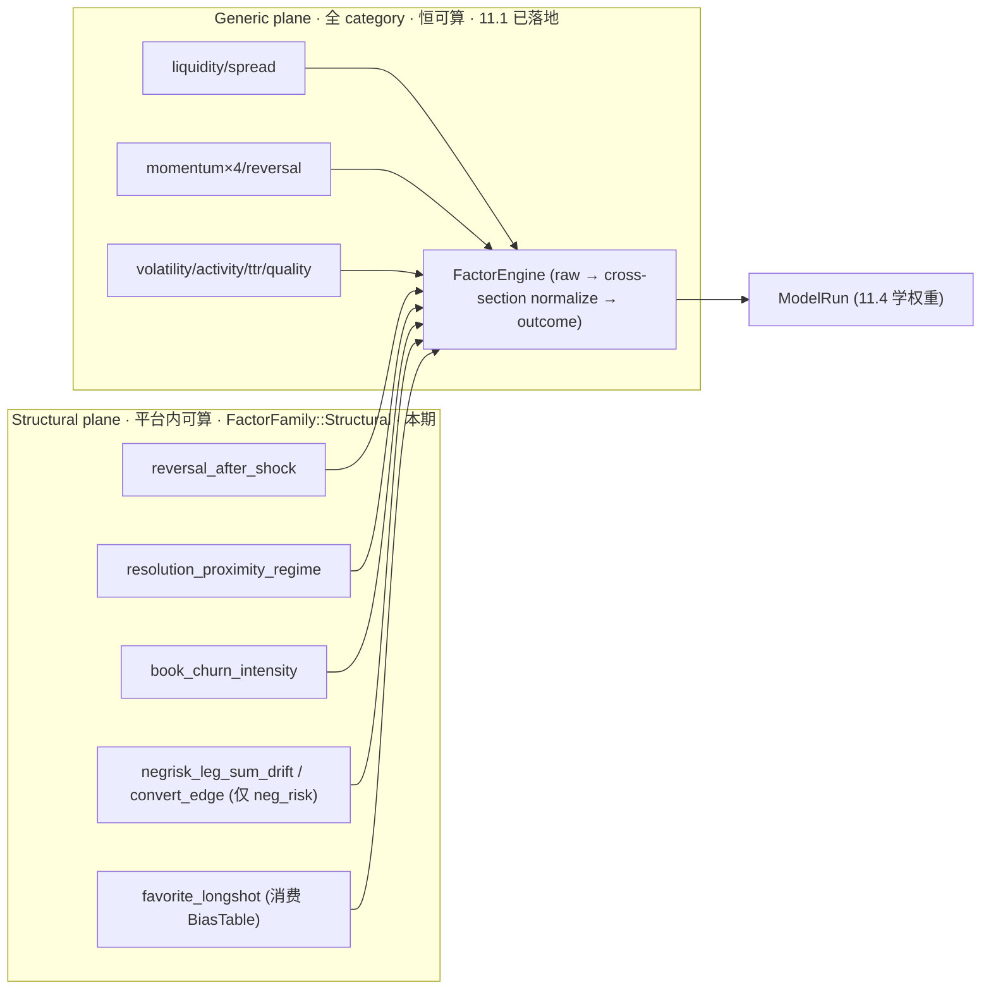

# 11.2.1 — Platform-Internal Structural Alpha（权威设计）

> 关闭审计点 **#4 的前半**：**平台内可算的结构性阿尔法完全缺席**（`DomainFactorRegistry` 从不注册、
> 结构性错价/反转/集中度/neg-risk 全腿/favorite-longshot 一个都没算）。#4 的后半（crypto 外部垂直）由
> [`11.2.2-crypto-external-vertical.md`](11.2.2-crypto-external-vertical.md) 闭合。
>
> **本文档地位**：Polymarket **平台内结构性**阿尔法的**唯一权威设计**。它与 11.2.2 一起**破坏式接管**并
> **取代** [`../phase-03/03.8-vertical-domain-closed-loop.md`](../phase-03/03.8-vertical-domain-closed-loop.md)。
> 落地时 03.8 头部标注 `> SUPERSEDED by phase-11/11.2.1 + 11.2.2`，不做 re-export、不保留旧 seam。
>
> **状态**：设计冻结（DESIGN-FROZEN），本期实现。本期一次性落地：`FactorFamily::Structural` 因子族
> （含 neg-risk 全腿在线+离线闭环）+ `FavoriteLongshotBiasTable`（11.3 提前件）+ 删除死垂直脚手架 +
> runtime-config v12→v13 + 治理页与可视化。**不含任何外部数据源**（crypto/Binance 归 11.2.2）。
>
> **历史版本说明：**本文的 v12/v13/v14 数字是早期设计波次记录，已被后续实际版本序列取代；
> 11.6 完成时为 runtime v10 / feature v6 / artifact v2。当前版本见
> [Phase 11 权威版本账本](README.md#权威版本账本当前)。
> 下文历史数字不得用于配置、迁移或验收；时间/缺失/路由语义统一遵守
> [11.6](11.6-training-serving-parity-and-no-silent-zero.md)。
>
> **与 11.2.2 的边界**：本期删除所有**当前即死**的 domain-external 脚手架（`DomainFeatureSkeleton`、5 条
> 占位 domain 特征名、`DomainFeatureBuilder`、`DomainFactorRegistry`、`FeatureFamily::Domain`、
> `FactorFamily::Domain*`、`FactorDefinitionScope::Domain*`、`SourceRequirement::DomainExternal`、
> `NullReason::DomainDataMissing`、`FeatureAvailabilityOracle` 的 `DomainExternal => false` 分支），由
> 11.2.2 **正确重建并真正 wire**。因此本期 `FeatureVector` 保持**扁平且全为真实值**（无死字段）；两层
> `FeatureVector` 破坏式重构（generic ⊕ domain slice + 复合 hash）**移到 11.2.2**（domain slice 真正被
> 填充时再改）。本期 `feature_schema_version` 3→4，runtime-config schema **v12→v13**；11.2.2 再 bump
> feature_schema 5、config v14。
>
> **与 11.3 的握手**：`FavoriteLongshotBiasTable`（市场隐含价 → 经验结算频率的校准）本期在 11.2.1 落地，
> 语义上与 11.3 的 `ProbabilityCalibrator`（模型 score → P(win) 的校准）同属**校准 artifact 家族**；11.3
> 正式落地后统一到 `CalibrationArtifactId` 治理（见 [11.3 §3.4](11.3-probabilistic-calibration-and-kelly.md)）。
>
> 兼容策略（逐条不可妥协）：**零兼容、零 re-export、零向前兼容、零死语义**。接受破坏式变更。

---

## 1. 目标与闭环定位

把在线因子层从"platform-agnostic 微结构排序"升级为"**prediction-market-structure-aware 排序**"，
**无需任何外部数据源**。它是 Phase 11 阿尔法链第二环的前半：
`11.1 通用因子地基 → 11.2.1 平台内结构因子 → 11.2.2 领域/外部因子 → 11.4 训练把三类因子一起学权重`。

两类本期落地的阿尔法（严格分层，语义精准）：

1. **结构性因子（Structural，平台内可算，本期必须落地）**：仅依赖 quant-pivot 已有事实（book / price /
   registry / neg-risk metadata / microstructure window / 同 event 全腿 book），产出真实边缘，无需任何外部
   数据源。
2. **校准偏差因子（favorite_longshot，消费 `FavoriteLongshotBiasTable`）**：本期落地经验偏差表，纠正 retail
   系统性尾部高估。

设计立场（实证支撑，逐条核对 §12 文献）：

- **Favorite-longshot reversal**：Polymarket 低概率 token 系统性被**高估**、高概率 token 被**低估**。该偏差
  **并非每个市场都存在**，需按 category / time-to-resolution 条件化，部分市场可能是"Yes Bias"统计假象。
  因此因子必须**条件化 + 可开关 + 经 IC 验证**（arXiv Polymarket-v1 Database；*How Wise is the Crowd?*）。
- **Neg-risk 结构约束**：多结果事件（3+ outcomes）走 Neg Risk CTF Exchange；各腿 YES 之和应 ≈ 1，漂移即
  结构性错价；NO 可经 Neg Risk Adapter 转成其余全部 YES（capital-efficiency 边缘）。
- **强反转性 / 参与者集中**：大幅波动后 24–48h 显著回补；真实 participant concentration 依赖
  trade tape（11.2.1.1），本 11.2.1 只保留 book-derived churn 信号，不把它命名为 maker concentration。

**闭环回指**：本文档 §10 明确本期**只闭合 #4 的平台内一半**；crypto 外部垂直的 #4 后半在 11.2.2 闭合。

---

## 2. 删除 / 合并 / 重构清单（该删/合并/迁移，逐条给出处置）

零死语义：本期删除所有**当前即死**的 domain-external 脚手架，由 11.2.2 正确重建并真正 wire。

| 对象 | 现状 | 处置 |
|---|---|---|
| `DomainFeatureSkeleton`（[`features/domain/mod.rs`](../../../crates/quant-pivot-research/src/features/domain/mod.rs)），恒发 5×`DomainDataMissing` | 死/有害占位：把"结构上不适用"与"数据缺失"混淆，污染 `feature_hash` 与训练矩阵 | **删除**。整个 `features/domain/` 模块删除，由 11.2.2 以真实 `CryptoDomainFeatureBuilder` 重建。 |
| `DOMAIN_FEATURES`（5 条）+ `features/names.rs` 的 5 条占位 domain 特征名 + `features/schema.rs::domain_specs` | 从不 emit 真实值，死语义 | **删除**。11.2.2 加真实 crypto 特征名。 |
| `DomainFeatureBuilder` trait（[`features/domain/mod.rs`](../../../crates/quant-pivot-research/src/features/domain/mod.rs)） | 无任何真实实现（只有 skeleton），死契约 | **删除**。11.2.2 以真实签名重建（可含 sibling/domain PIT 上下文）。 |
| `DomainFactorComputer` / `DomainFactorRegistry`（[`factors/domain.rs`](../../../crates/quant-pivot-research/src/factors/domain.rs)） | 从不注册、`FactorEngine` 不挂载，死代码 | **删除**。11.2.2 以真实 crypto 域因子 + category 路由重建。 |
| `FeatureFamily::Domain`（[`runtime_config/wire.rs`](../../../crates/quant-pivot-models/src/runtime_config/wire.rs)） | 无真实 builder，enabled 后 no-op | **删除**（config v13）。11.2.2 config v14 重建。 |
| `FactorFamily::Domain{Sports,Politics,Crypto,Weather,Geopolitics}` + `FactorDefinitionScope::Domain*` | 从不 emit，死枚举值 | **删除**（pg_enum → 迁移；greenfield 无痛）。11.2.2 重建（至少 `DomainCrypto`）。 |
| `SourceRequirement::DomainExternal` / `EvidenceSourceKind::DomainExternal` | 无源接入，死语义 | **删除**。11.2.2 随外部源重建。 |
| `NullReason::DomainDataMissing` | 仅被 skeleton 使用 | **删除**。11.2.2 以 domain slice 的 `DomainMissing` 语义重建。 |
| `FeatureAvailabilityOracle` 的 `DomainExternal => false` 硬编码分支（[`features/availability.rs`](../../../crates/quant-pivot-research/src/features/availability.rs)） | 死分支 | **删除**。11.2.2 以 category→源→PIT 可用性判定重建。 |
| `enums/domain.rs` 的 `DomainFamily` + `for_category` | 仅被上述死代码引用 | **删除**（若无其他引用）。11.2.2 重建。落地时以编译器验证无残留引用为准。 |
| `struct.reversal_after_shock` vs 既有 `mean_reversion`；`struct.resolution_proximity_regime` vs 既有 `time_to_resolution` | 语义相邻 | **保留但正交化**：结构因子是**条件/交互**信号（shock 条件反转、ttr×价格分位交互），与线性因子非同一列；纳入 `FactorCollinearityAnalyzer`（[`factors/collinearity.rs`](../../../crates/quant-pivot-research/src/factors/collinearity.rs)）\|ρ\|>阈值 触发正交化/删列。 |
| favorite_longshot 偏差表 | 本期 11.2.1 自有 artifact | **迁移路径明确**：未来 11.3 校准落地后统一到 `CalibrationArtifactId` 治理（§3.5 + 11.3 §3.4）；本期 `FavoriteLongshotBiasTableId` 独立声明。 |

无需删除既有 factor/feature registry / trait 骨架、执行/对账/结算平面；在其上重构。

---

## 3. 契约与算法设计

### 3.0 本期因子平面（Generic + Structural；Domain 归 11.2.2）



- **Generic**：`FactorFamily::ALL_GENERIC`（11.1 已落地 8 族），config `factors.enabled_factor_families` 开关。
- **Structural**：新增 `FactorFamily::Structural`（**平台内可算、config 可选、neg-risk 因子自条件化**），与
  generic 同 registry、独立开关；`FactorDefinitionScope::Structural`；`FeatureFamily::Structural`。
- **Domain**：归 11.2.2（本期不存在 domain 因子/特征/枚举）。

### 3.1 结构性因子定义（平台内可算，本期必须落地）

| 因子 | family | category 适用 | 定义 | 输入特征 | 经济含义 |
|---|---|---|---|---|---|
| `struct.reversal_after_shock` | Structural | 全体 | shock 门控的反转打分：`shock = |ret_short| / realized_vol_short`；当 `shock > k`（config）时输出 `−sign(ret_short)·min(shock, cap)`，否则 confidence 低（不参与） | window mids（`ts_*`） | 大移动后 48h 部分回补；条件反转，正交于线性 `mean_reversion` |
| `struct.resolution_proximity_regime` | Structural | 全体 | `time_to_resolution` 分桶 × 价格极端度 `|mid − 0.5|` 的交互打分 | `market.time_to_resolution_secs`、`book.mid` | 临近 resolution 的定价成熟度差异（交互项，正交于线性 `time_to_resolution`） |
| `struct.book_churn_intensity` | Structural | 全体 | book update/delta churn 强度；不是 maker/taker 地址集中度 | `micro.book_churn`、depth 分布 | 订单簿 churn regime / microstructure instability |
| `struct.negrisk_leg_sum_drift` | Structural | `neg_risk=true` | `Σ best_ask(all YES legs) − 1`（另出 bid/mid 版本作 confidence 佐证） | sibling legs book（§3.4） | 多腿和偏离 1 = 结构性错价 |
| `struct.negrisk_convert_edge` | Structural | `neg_risk=true` | `cost(buy YES basket of all-but-favorite) − cost(buy NO_favorite via adapter)` | sibling legs book | 转换套利式 capital-efficiency 边缘 |
| `struct.favorite_longshot` | Structural | 全体（条件化） | 按 `mid` 价分位查 `FavoriteLongshotBiasTable[(category, bucket)]` → `E[bias]`（signed） | `book.mid`、`market.category`、BiasTable | 校正 retail 尾部高估（§3.5） |

**语义精准**：
- neg-risk 因子对 `neg_risk=false`（binary/单市场）输出 `NormalizedFactor::NotApplicable`（**非 missing、非 0**）。
- 缺腿 → `Indeterminate { reason: LegBookMissing }`（`FactorIndeterminateReason::LegBookMissing` 新增）。
- `favorite_longshot`：BiasTable 缺失或该 category IC 不显著 → 因子 disabled（confidence=0，report 显 —），
  不静默套用。

### 3.2 Structural 因子的 raw/normalize 分离（复用 11.1 引擎）

结构因子全部实现为 `FactorComputer`（[`factors/computer.rs`](../../../crates/quant-pivot-research/src/factors/computer.rs)
`FactorComputer::compute_raw(&FeatureVector)`），**不改签名**。sibling legs 与 category 在**特征构建阶段**已由
`StructuralFeatureBuilder`（§3.3）写入 `FeatureVector`（例如 `struct.negrisk_leg_ask_sum`、
`struct.negrisk_leg_count`、`struct.negrisk_favorite_no_cost`），因此因子读向量即可，无需改 `compute_raw` 签名。
归一化走 11.1 的 `CrossSectionalNormalizer`（默认 `WinsorizedZScore`，neg-risk 漂移用 `WinsorizedZScore`，
favorite_longshot bias 已是 signed 期望值用 `MinMax` 界值经 config）。**零硬编码归一化常量**（与 11.1 一致）。

### 3.3 StructuralFeatureBuilder（`FeatureFamily::Structural`，归 generic 扁平向量）

新增 `features/structural/mod.rs::StructuralFeatureBuilder`（实现 `FeatureGroupBuilder`），产出的特征归入
**现有扁平 `FeatureVector.values`**（平台内可算、恒存在；本期不引入 domain slice）。产出：

- shock / realized-vol 窗口统计（`config.structural.shock_window_secs`）。
- `|mid − 0.5|` × `time_to_resolution` 分桶交互项。
- `micro.book_churn` + depth 变化（book churn regime，`features.structural.book_churn_window_secs`；真实
  participant concentration 由 11.2.1.1 的 trade-tape fact/feature 提供）。
- **neg-risk 全腿聚合**：`struct.negrisk_leg_ask_sum`（`Σ best_ask(all YES legs)`）、
  `struct.negrisk_leg_count`、`struct.negrisk_favorite_no_cost`（favorite 腿 NO 经 adapter 成本）——来自
  `ctx.sibling_legs`（§3.4）。`neg_risk=false` 时这些特征 `Missing(NotApplicable)`（新 `NullReason`），
  缺腿时 `Missing(LegBookMissing)`。

`feature_schema_version` 3→4；`features/schema.rs::FeatureSchema::build` 在 `FeatureFamily::Structural` 启用时
追加上述 spec。

### 3.4 neg-risk 全腿 PIT 解析（在线 + 离线一致，训练-服务零 skew）

**问题**：当前管线逐市场（只解析 primary token book）；neg-risk 漂移/转换因子需要**同一 event 全部 YES 腿的
PIT book**。破坏式新增 event 全腿解析，**在线与离线双侧对称**（否则违反 11.6 训练-服务一致性）。

```rust
pub struct ResolvedMarketSnapshot {
    pub boundary: DecisionBoundary,
    pub market: Arc<MarketRegistryInfo>,
    pub event: Arc<EventRegistryInfo>,
    pub neg_risk_leg_set: NegRiskLegSet,
    // immutable catalog revision ids + content hashes omitted
}

pub struct NegRiskLeg { pub market_id: MarketId, pub yes_token_id: TokenId }

pub struct ResolvedLeg {
    pub market_id: MarketId,
    pub token_id: TokenId,
    pub book: ResolvedBook, // resolved at the SAME DecisionBoundary
}
// FeatureComputeCtx { …, pub sibling_legs: &'a [ResolvedLeg] }
```

- **catalog membership**：只从 `PointInTimeSnapshotSource::market_snapshot_at` 返回的 immutable
  `ResolvedMarketSnapshot.neg_risk_leg_set` 读取；禁止再从 current `MarketRegistry` 拼历史 event membership。
- **在线**：`ConfiguredFeatureBuilder::resolve_inputs` 复用报告轮已冻结的 `DecisionBoundary` 和 market snapshot，
  经 `PointInTimeSnapshotSource::book_at_boundary` 解析全部 sibling token，注入
  `FeatureComputeCtx.sibling_legs`。
- **离线**：`HistoricalWindowLoader` 预取同 event 全腿 book 进 `MaterializedPitEngine`；
  `historical_replay.rs::materialize_cross_section` 仍调用同一个 `PointInTimeSnapshotSource`/builder 契约。
  在线与离线 sibling 解析共享同一 boundary 与转换语义，要求 byte-identical。
- **失败语义**：缺腿 → `Indeterminate { LegBookMissing }`；binary → `NotApplicable`；全腿必须由同一
  `DecisionBoundary` 解析。**绝不静默填 0**。

### 3.5 FavoriteLongshotBiasTable（11.3 提前件，本期落地）

**语义**：市场隐含价（mid）→ 该价位历史结算为 YES 的**经验频率**的校准表，按 `(category, price_bucket)`
条件化。与 11.3 的 `ProbabilityCalibrator`（模型 score→P(win)）**同属校准 artifact 家族**，但校准对象不同
（这里是**市场隐含概率**的校准，是 favorite-longshot 偏差的直接度量）。

```rust
pub struct FavoriteLongshotBiasTable {
    pub table_id: FavoriteLongshotBiasTableId,
    pub content_hash: ContentHash,          // blake3 canonical
    pub fit_window: TimeWindow,             // 拟合样本区间
    pub calibration_split_hash: ContentHash,// 独立拟合集 hash（防泄漏，与 11.3 一致）
    pub by_category: BTreeMap<MarketCategory, CategoryBiasCurve>,
}
pub struct CategoryBiasCurve {
    pub bins: Vec<PriceBiasBin>,
    pub ic: Decimal,                        // 该 category 偏差因子的样本内 IC
    pub ic_significant: bool,               // IC 显著性门（11.5 联合）
    pub sample_count: u64,
}
pub struct PriceBiasBin {
    pub price_lo: Price,
    pub price_hi: Price,
    pub implied_mid: Price,                 // 桶中值
    pub realized_frequency: Probability,    // 桶内结算 YES 经验频率
    pub bias: Decimal,                      // realized_frequency − implied_mid（signed）
    pub bias_ci: (Decimal, Decimal),        // Wilson 区间
    pub sample_count: u64,
}
```

**拟合协议**（research 纯 + core 编排，与 11.3 校准 fit 同范式）：

1. 从训练 spine 逐样本收集 `(category, entry_mid, settled_yes)`：`entry_mid` 来自 PIT book mid
   （`historical_replay.rs`），`settled_yes` 来自 `SettlementOutcomeLabeler`（真相键 `winning_token_id`，
   [`training/labeler.rs`](../../../crates/quant-pivot-research/src/training/labeler.rs)）。
2. 按 category 分层，按价格分桶（config `bins`，默认等宽或经验分位），每桶算 `realized_frequency`、Wilson CI、
   `bias = realized_frequency − implied_mid`、per-category IC。
3. 产 content-addressed artifact（`blake3:`）；**独立拟合集**（与训练/校准集不相交，hash 校验），遵守 11.5 purge/embargo。
4. 拟合走 research job（[`routes/research_jobs.rs`](../../../crates/quant-pivot-web/src/routes/research_jobs.rs)，
   新增 `ResearchJobKind::BiasTableFit`）+ 治理端点；config `factors.structural.favorite_longshot.bias_table_ref`。

**greenfield fail-closed**：每桶 `sample_count < min_bin_samples`（config）→ 该桶不产 `bias`（`None`）；
per-category `sample_count < min_category_samples` 或 `ic_significant=false` → 该 category 曲线 disabled；
全表无任何合格 category → **不产 artifact**（job 成功但 `result_ref=None` + 明确 coverage 说明），**绝不产空表
伪装成功**。

**消费**：`struct.favorite_longshot` 因子按 `mid` 落桶 → `bias`（signed）作为 raw_value；表缺失/该 category
`ic_significant=false`/桶 `bias=None` → 因子 disabled（confidence=0）。**迁移**：11.3 落地后 `bias_table_ref`
统一到 `CalibrationArtifactId`。

### 3.6 因子失败语义三态（贯通 outcome → 持久化 → report）

新增 `NormalizedFactor::NotApplicable` + `FactorEligibility::NotApplicable`，与既有 `MissingInput` /
`Indeterminate` 正交：

| 状态 | 语义 | 触发 | report 呈现 |
|---|---|---|---|
| `NotApplicable` | 结构上不适用（不是缺数据） | neg-risk 因子遇 binary 市场 | `—`（明确"不适用"） |
| `Indeterminate{LegBookMissing}` | 应可算但输入缺失 | neg-risk 市场缺腿 book | `—`（明确"数据缺失"） |
| `MissingInput` | 单一输入缺失 | 既有语义 | `—` |
| disabled (confidence=0) | 因子被治理关闭 | BiasTable 缺失/IC 不显著 | `—` |

持久化：`FactorValueInfo`/`NewFactorValue`（[`domain/quant/factor.rs`](../../../crates/quant-pivot-models/src/domain/quant/factor.rs)）
增 `NotApplicable` 落库语义（不与 `indeterminate_reason` 混用）；report DTO 统一渲染 `—`。

---

## 4. 新领域类型 / 表 / ClickHouse fact

- **枚举**（models）：`FactorFamily::Structural` + `FactorDefinitionScope::Structural`；`FeatureFamily::Structural`；
  `FactorIndeterminateReason::LegBookMissing`；`NormalizedFactor::NotApplicable` + `FactorEligibility::NotApplicable`；
  `NullReason::{NotApplicable, LegBookMissing}`（feature 侧，取代删除的 `DomainDataMissing`）。
- **typed IDs**（`types/ids.rs`）：`FavoriteLongshotBiasTableId`。
- **ClickHouse**：`quant_factor_event` 的 `factor_family` 维度枚举加 `structural`
  （[`clickhouse/sql/quant_facts.sql`](../../../crates/quant-pivot-storage/src/clickhouse/sql/quant_facts.sql)）。
- **Postgres**：`quant_favorite_longshot_bias_table`（artifact 元数据 + 内容寻址；catalog-derived DDL +
  SeaORM 迁移）。
- **删除**（config v13 迁移）：`FeatureFamily::Domain`、`FactorFamily::Domain*`、`FactorDefinitionScope::Domain*`、
  `EvidenceSourceKind::DomainExternal`、`DomainFamily`。

---

## 5. deploy-config key 与 runtime-config schema path

**破坏式 bump v12 → v13**（拒绝 <13，零兼容，`from_json` + activation preflight 双门）。

```text
# runtime-config (v13)
factors.enabled_factor_families                       = [..8 generic.., structural]   # 新增 structural
factors.structural.reversal_after_shock.shock_k       = 2.5
factors.structural.negrisk.min_legs                   = 3
factors.structural.favorite_longshot.bias_table_ref   = <FavoriteLongshotBiasTableId | none>
factors.structural.favorite_longshot.min_bin_samples  = 200
factors.structural.favorite_longshot.min_category_samples = 1000
factors.structural.per_category_ic_gate               = true             # IC 不显著自动关 (软, 硬门禁→11.5)
features.enabled_feature_families                      = [..generic.., structural]     # structural 特征归扁平向量
features.structural.shock_window_secs                  = 900
features.structural.book_churn_window_secs             = 900

# 删除（v13 起不再接受）
features.enabled_feature_families 中的 domain          # 11.2.2 config v14 重建
factors.enabled_factor_families 中的 domain_*          # 11.2.2 重建
```

deploy-config（`config/quant-pivot.toml`）本期无需改（runtime-config 存 Postgres，`RuntimeConfig::default` 播种）。

---

## 6. 必建模块与 trait（模块树）

```text
crates/quant-pivot-research/src/
├── features/
│   ├── structural/mod.rs        # 新: StructuralFeatureBuilder (§3.3) — FeatureGroupBuilder
│   ├── domain/                  # 删除整个模块 (skeleton/trait/names)
│   ├── availability.rs          # 删 DomainExternal 分支
│   ├── schema.rs                # 删 domain_specs; 加 structural specs
│   ├── names.rs                 # 删 5 domain 占位名
│   └── builder.rs               # FeatureComputeCtx + sibling_legs (§3.4)
├── factors/
│   ├── structural.rs            # 新: FactorFamily::Structural 因子 (§3.1/3.2)
│   ├── domain.rs                # 删除 (11.2.2 重建)
│   ├── computer.rs              # 无需改签名
│   └── registry.rs              # FactorRegistry::build 注册 structural
└── model/
    └── favorite_longshot.rs     # 新: FavoriteLongshotBiasTable 拟合/查表 (§3.5)

crates/quant-pivot-core/src/
├── pipeline/
│   ├── market_registry.rs       # get_event / neg_risk_leg_set (§3.4)
│   └── historical_window.rs     # 预取 neg-risk 全腿 book (§3.4)
├── service/
│   ├── feature_pipeline.rs      # neg-risk 全腿在线预取 (§3.4)
│   ├── historical_replay.rs     # materialize_cross_section 透传 sibling legs
│   └── bias_table_fit.rs # BiasTable 拟合编排 (research job)
├── app/research_job_worker.rs   # BiasTableFit dispatch
└── governance/factor_governance.rs # 自动注册 structural 因子定义（既有路径复用）
```

关键 trait 签名见 §3.4 / §3.5（verbatim）。

---

## 7. 生产不变量与失败语义

- **neg-risk 正确性**：读 `market.neg_risk`（源自 Gamma），不按标题猜；全腿同一 `as_of` PIT 解析；缺腿
  `Indeterminate { LegBookMissing }`，binary `NotApplicable`（非 missing、非 0）。
- **条件化 + IC 验证**：favorite-longshot 因子按 category 分别验证 IC 符号与显著性（11.5 硬门禁前的软门），
  不显著自动关（避免把统计假象当边缘）。
- **训练-服务零 skew**：neg-risk sibling legs 在线与离线走同一 `resolve_book` PIT 语义，byte-identical。
- **无静默填零**：缺腿/不适用 → `Indeterminate`/`NotApplicable`，各有独立语义；绝不转 0/0.5。
- **greenfield fail-closed**：BiasTable 样本不足 → 不产 artifact；因子 inert；报告 `—`；绝不产空表伪装成功。
- **货币/数值不变量**：Decimal↔f64 仅在拟合/求解边界；NaN/inf 拒样本；所有 artifact `blake3:` 内容寻址。
- **schema 门**：runtime-config v13 双门（`from_json` + activation preflight）；`feature_schema_version` 4。

---

## 8. 第三方 crate 引入

- 结构性因子：**无新增 crate**（复用 book/registry/window + `ndarray-stats`）。
- FavoriteLongshotBiasTable 拟合：复用 `statrs`（Wilson CI，已在 `quant-pivot-research` deps）；无重依赖。

---

## 9. 验收测试

结构 / neg-risk / favorite-longshot：
- `favorite_longshot_uses_bias_table_not_constant`
- `negrisk_leg_sum_drift_computed_only_for_neg_risk_markets`
- `negrisk_factor_indeterminate_when_leg_book_missing`（#4 no-silent）
- `binary_market_gets_not_applicable_for_negrisk_factor`
- `structural_factor_ic_gate_disables_insignificant_category`（11.5 联合）
- `reversal_after_shock_orthogonal_to_mean_reversion`（\|ρ\|<阈值）
- `negrisk_sibling_legs_online_offline_parity`（在线/离线 byte-identical）
- `bias_table_fit_fail_closed_when_insufficient_samples`（greenfield）

config / 清理：
- `runtime_config_v13_rejects_v12`
- `domain_scaffolding_fully_removed`（编译期：无 `DomainExternal`/`DomainFamily`/`FeatureFamily::Domain` 引用）
- `structural_factor_registered_and_selected_by_config`

---

## 10. Blocker（触发即判定失败）

- neg-risk 因子对 binary 市场误算或对缺腿静默填值；在线/离线 sibling 解析不一致。
- favorite-longshot 因子仍是常数 / 未经 category IC 验证 / 样本不足仍产空表。
- 结构因子未接 `FactorRegistry::build` / 未走 11.1 归一化。
- 删除清单未删干净（残留 `DomainFeatureSkeleton`/`FeatureFamily::Domain`/死枚举）。
- runtime-config 未 bump v13 或未双门校验。

---

## 11. 延后 / 缺口（明确后续 phase 详细设计）

| 能力 | 处置 / 归属 |
|---|---|
| crypto 外部垂直（linkage / Binance / domain PIT / CH domain 事实 / 两层向量 / category 路由 / ModelRouting / dataset domain slice / basis） | **[11.2.2](11.2.2-crypto-external-vertical.md)**（本期删除的 domain 契约在此正确重建） |
| Sports/Politics/Weather/Geopolitics 真实外部源 | 按 11.2.2 分层 linkage + `DomainDataSource` 范式加性扩展；post-11.2.2 独立子 phase。 |
| favorite-longshot 拟合集 vs 训练集 **不相交** + `calibration_split_hash` 真实样本键 | **本期已落地**（fit 前只扫描通过 integrity gate 的 `Ready` 训练集；`Built` 状态已由 11.6 删除；hash = window + sorted `(market_id, sampled_at)`）。Purged CPCV → 11.5。 |
| favorite-longshot 偏差表统一到 `CalibrationArtifactId` 治理 | 随 11.3 正式落地（§3.5）。 |
| per-category IC **硬** publish-gate 强制 | 本期软门（不显著自动关）；硬门禁 → 11.5。 |
| 回指审计点 #4：本期**闭合前半**（平台内结构因子 + neg-risk 全腿 + favorite-longshot）；后半（crypto domain registry 激活 + Binance 特征源）→ 11.2.2 闭合。 |

---

## 12. 外部参考文献（权威来源，落地时逐条核对）

**Polymarket 垂直信号 / 结算机制**
- Polymarket-v1 Database（favorite-longshot reversal、neg-risk、participant concentration）：<https://arxiv.org/html/2606.04217v1>
- How Wise is the Crowd? Bias and Edge in Prediction Markets：<https://doi.org/10.5281/zenodo.18821864>
- Polymarket Create Order（GTC/GTD/FOK/FAK + negRisk）：<https://docs.polymarket.com/trading/orders/create>
- NegRisk execution mechanics：<https://polymarkets.co.il/en/bots/polymarket-negrisk-execution/>

**因子归一化 / 校准（与 11.1 / 11.3 一致）**
- Coqueret & Guida — ML for Factor Investing Ch.4：<https://www.mlfactor.com/Data.html>
- Cross-sectional normalization operators：<https://docs.skelfresearch.com/sigc/operators/cross-sectional/>
