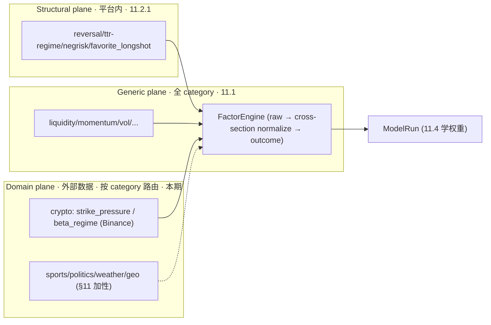
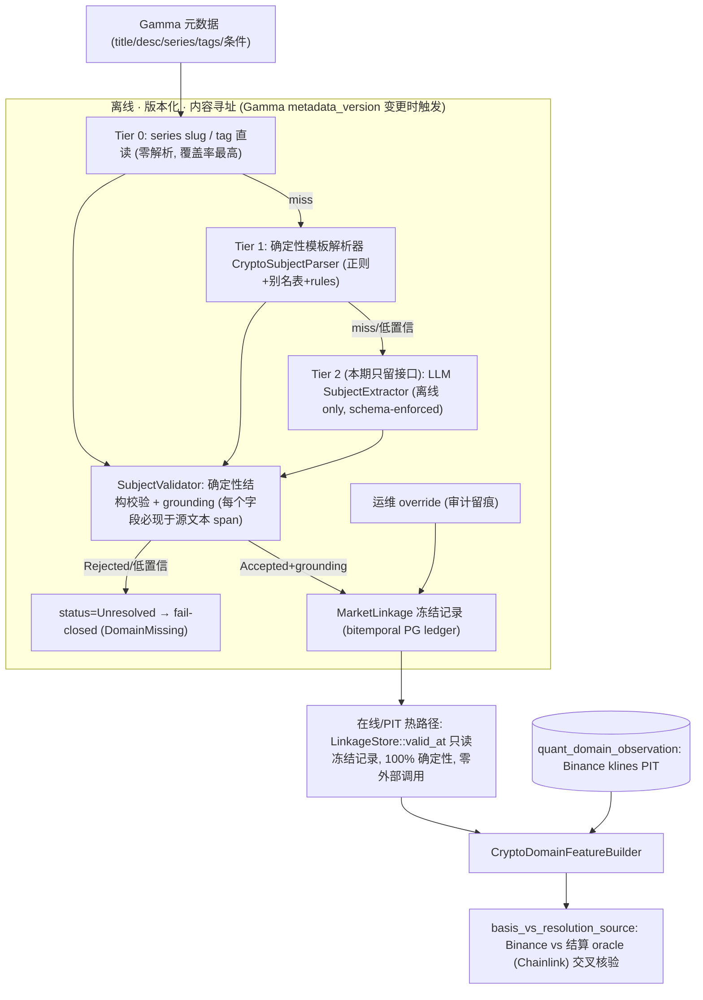

# 11.2.2 — Crypto External Vertical（权威设计）

> 关闭审计点 **#4 的后半**：**crypto 外部垂直缺席**（domain feature 恒 missing、`DomainFactorRegistry` 从不
> 注册、无外部特征源）。#4 前半（平台内结构因子）由 [`11.2.1-platform-structural-alpha.md`](11.2.1-platform-structural-alpha.md)
> 闭合；本文档闭合后半并**最终闭合 #4**。
>
> **本文档地位**：Polymarket **crypto 外部垂直**阿尔法的**唯一权威设计**。与 11.2.1 一起**破坏式接管**并
> **取代** [`../phase-03/03.8-vertical-domain-closed-loop.md`](../phase-03/03.8-vertical-domain-closed-loop.md)
> （03.8 的"LLM 优先市场链接"假设与"特征源=结算源=Binance"假设均已被本文档修正，见 §3.6）。
>
> **状态**：设计冻结（DESIGN-FROZEN），**已落地**（Tier 0/1 确定性 linkage + Binance 特征源 + 两层向量 +
> domain 路由 + PIT + 治理页）。Tier 2 LLM 兜底**未实现**——接口已留，设计见
> [`11.2.3-tier2-llm-linkage.md`](11.2.3-tier2-llm-linkage.md)。
>
> **数据源决策（已拍板）**：crypto 标的价特征源为 **Binance Spot REST `GET /api/v3/klines`**（公有、无 key、
> weight=2、1000 根/请求、interval 1s..1M）；部署区域可直连 `api.binance.com`。历史回填可选 `data.binance.vision`
> 归档（§3.6.4）。
>
> **与 11.2.1 的边界**：11.2.1 已删除所有当前即死的 domain-external 脚手架。本文档**正确重建并真正 wire**：
> `DomainFamily`、`FeatureFamily::Domain`、`FactorFamily::DomainCrypto`、`FactorDefinitionScope::DomainCrypto`、
> domain slice（两层向量）、`CryptoDomainFeatureBuilder`、`DomainFactorRegistry` + category 路由。**不做
> re-export、不复用旧命名**。runtime-config **单调 +1 bump** 至 **schema v5**（`RUNTIME_CONFIG_SCHEMA_VERSION`），`feature_schema_version` **4→5**。
>
> 兼容策略（逐条不可妥协）：**零兼容、零 re-export、零向前兼容、零死语义**。接受破坏式变更。

---

## 1. 目标与闭环定位

激活领域按 category 路由，接 Binance 标的价，闭合"训练 → 归因 → 再训练"研究闭环所需的 domain 特征源。它是
Phase 11 阿尔法链第二环的后半：`11.2.1 平台内结构 → 11.2.2 crypto 外部垂直 → 11.4 训练把三类因子一起学权重`。

一类本期落地的阿尔法：

- **领域性因子（Domain，需外部数据，本期落地 Crypto 参考垂直）**：接 Binance 标的价，按 category 路由；其余
  4 垂直（Sports/Politics/Weather/Geopolitics）加性扩展、post-11.2.2（§11）。

设计立场（实证支撑，逐条核对 §12 文献）：

- **结算源已多元化**：短周期 crypto 市场（5m/15m）多用 **Chainlink Data Streams** 链上自动结算，daily/阈值
  梯度仍用 **Binance BTC/USDT 1m candle**；两者在结算毫秒会分叉（"oracle gap"）。这**修正** 03.8"特征源=
  结算源=Binance"的过时假设，引入 `ResolutionOracle` 建模 + basis 交叉核验（§3.6）。
- **确定性优先市场链接**：Polymarket crypto 市场描述高度模板化、series 分组、slug 按时钟确定性生成——这是
  **"解析问题"而非"模糊匹配问题"**；确定性层覆盖绝大多数成交量主力市场，LLM 只在长尾有边际价值（本期只留
  接口，见 §3.6.2）。

**闭环回指**：本文档 §10 明确本期**闭合 #4 的 crypto 一半并最终闭合 #4**。

---

## 2. 删除 / 合并 / 重构清单（该删/合并/迁移，逐条给出处置）

11.2.1 已删除 domain-external 死脚手架；本文档为**重建 + 破坏式扩展**清单：

| 对象 | 现状（11.2.1 后） | 处置 |
|---|---|---|
| `features/` flat 文件（`book.rs` / `market.rs` / …） | 11.2.1 仍 flat，按 `FeatureFamily` 1:1 | **11.2.2 落地**时迁入 `features/generic/`（§6 模块树）；与 `features/domain/` 对称，generic slice 构建器集中注册。 |
| `FeatureVector`（[`features/value.rs`](../../../crates/quant-pivot-research/src/features/value.rs)）单一扁平 `values: BTreeMap` | 无 generic/domain slice 区分 | **破坏式重构**为两层向量（generic ⊕ optional domain slice）+ 复合 hash（§3.3）。 |
| domain 特征表达 | 11.2.1 已删（无 domain 特征） | **重建**为 `DomainFeatureSlice`（§3.3）+ 真实 `CryptoDomainFeatureBuilder`（§3.6.5）；非映射 category → `domain: None`（**绝不 5×Missing**）。 |
| `DomainFamily` / `FeatureFamily::Domain` / `FactorFamily::DomainCrypto` / `FactorDefinitionScope::DomainCrypto` | 11.2.1 已删 | **重建**（至少 crypto；其余 4 垂直 §11 加性）。 |
| `DomainFactorRegistry` + category 路由 | 11.2.1 已删 | **重建并激活**：`FactorEngine::compute_all_batch_inner` 在通用/结构因子后按向量内 category 追加 `DomainFactorRegistry::for_category`（§3.7）。 |
| `FeatureAvailabilityOracle` 的 domain 可用性 | 11.2.1 已删死分支 | **重建**为 category→family 有已接源 ∧ 存在 `Resolved` linkage ∧ 源在 `as_of` 有 PIT 数据（§3.8）。 |
| 03.8 D1 "LLM 优先"市场链接假设 | 过时 | **取代**为分层解析器（Tier 0 slug → Tier 1 模板 → Tier 2 可选 LLM 兜底）+ 确定性校验器 + grounding（§3.6）；本期只实现 Tier 0/1，Tier 2 留可插拔接口。 |
| 03.8 D3 "特征源=结算源=Binance"假设 | 过时 | **取代**为 `ResolutionOracle` 建模 + basis 交叉核验（§3.6）。 |
| favorite_longshot `FavoriteLongshotBiasTableId` | 11.2.1 独立 artifact | 迁移到 `CalibrationArtifactId` 治理随 11.3（本文档不动）。 |

---

## 3. 契约与算法设计

### 3.0 三层因子平面总览（Generic + Structural + Domain）



- **Domain**：`FactorFamily::Domain*`（本期 crypto），**不进 config**，由 `DomainFactorRegistry::for_category`
  按 `market.category` 路由；`FactorDefinitionScope::Domain*`。

### 3.3 两层特征向量 + 复合 hash（破坏式）

**动机**：把"该 category 结构上不适用该垂直"与"数据源缺失"清晰区分（避免污染 `feature_hash`、训练矩阵）。
破坏式修订（[`features/value.rs`](../../../crates/quant-pivot-research/src/features/value.rs)）：

```rust
/// Point-in-time feature vector: a fixed-width generic slice + an optional,
/// category-scoped domain slice. There is no 5×missing pollution: a market whose
/// category maps to no vertical (or whose vertical has no source) carries
/// `domain = None`, which is *structurally distinct* from a present-but-missing
/// domain feature.
pub struct FeatureVector {
    pub market_id: MarketId,
    pub token_id: Option<TokenId>,
    pub as_of: DateTime<Utc>,
    pub generic_schema_version: SchemaVersion,
    /// Generic + Structural plane (platform-computable, always present, fixed width).
    pub generic: BTreeMap<FeatureName, FeatureValue>,
    /// Category-mapped external vertical slice; `None` when the category maps to no
    /// vertical or the vertical is unresolved/unavailable (fail-closed, not zero).
    pub domain: Option<DomainFeatureSlice>,
    pub substitutions: Vec<SubstitutionAudit>,
    pub data_quality: DataQualityStatus,
    pub staleness_ms: u64,
    pub source_refs: Vec<EvidenceSourceRef>,
}

pub struct DomainFeatureSlice {
    pub family: DomainFamily,
    pub schema_version: SchemaVersion,
    pub values: BTreeMap<FeatureName, FeatureValue>,
}
```

**复合 hash**（[`hashing.rs`](../../../crates/quant-pivot-research/src/hashing.rs) `ResearchHasher::feature_vector`）：

```text
feature_hash = H(
  generic_schema_version,
  H(generic_values),                              // 排序 BTreeMap 规范 JSON
  domain_family | "none",
  domain_schema_version | 0,
  H(domain_values) | "∅",
)
```

- 布局在 `(generic_schema_version, domain_family, domain_schema_version)` 内定序固定 → hash 确定；Decimal 量化防 ULP 漂移（沿用 `STAT_SCALE=12`）。
- **联动改造**（均破坏式）：`features/persistence.rs`（`FeatureVector::try_to_new`）、`features/builder.rs::compute_vector`、`features/schema.rs`（`domain_specs`/`build`，`FeatureFamily::Structural` 归 generic slice）、`training/mod.rs::CanonicalExample` + `dataset_hash`、`training/matrix.rs::matrix_spec_from_schema`。
- bump `features.feature_schema_version`（4 → 5）。**结构因子的特征仍归 generic slice**（平台内可算，恒存在），domain slice 只装外部垂直特征。

### 3.6 Crypto 外部垂直：分层 linkage 架构（确定性优先，取代 03.8 LLM 优先）

#### 3.6.1 为什么分层（生产级最佳实践，逐条核对 §12 文献）

金融 reference data / security master 的权威范式是**分层解析**（deterministic → probabilistic → ML/LLM →
human-in-the-loop），且 **precision ≫ recall**（一次错链污染所有下游 join，ml4trading Ch.4）；全链路
**离线 + 版本化 + 内容寻址 + bitemporal PIT 可回放**（VectorFin bitemporal；Horkan ER：把 ER 当基础设施）。



#### 3.6.2 解析器分层契约

```rust
/// One tier of the layered linkage resolver. Deterministic tiers (Tier0/Tier1)
/// are pure research functions; the Tier2 LLM extractor lives behind this trait
/// and runs OFFLINE ONLY — never on the online/PIT hot path (non-deterministic,
/// non-replayable). This iteration ships Tier0 + Tier1; Tier2 is interface-only.
pub trait SubjectExtractor: Send + Sync {
    fn tier(&self) -> ResolverTier;                 // Tier0Slug | Tier1Template | Tier2Llm
    fn resolver_version(&self) -> ResolverVersion;
    fn extract(&self, ctx: &LinkageExtractCtx<'_>) -> QuantResult<Option<ExtractedSubject>>;
}

/// The SINGLE gate: every candidate subject (from ANY tier) must pass this before
/// it becomes a frozen linkage. Structural validation + grounding (each extracted
/// value must appear as a literal span in the source metadata) — this is why the
/// deterministic validator is irreplaceable even when Tier2 LLM is used.
pub trait SubjectValidator: Send + Sync {
    fn validate(&self, candidate: &ExtractedSubject, source: &LinkageSource<'_>)
        -> QuantResult<ValidationOutcome>; // Accepted { grounding } | Rejected { reason }
}

pub enum ResolverTier { Tier0Slug, Tier1Template, Tier2Llm, Override }
pub enum LinkageStatus { Resolved, Unresolved, Overridden }
```

#### 3.6.3 领域主体与冻结记录

```rust
/// The settlement oracle a crypto market resolves against. Feature source
/// alignment: Binance klines is the feature source; when the oracle is Chainlink,
/// basis is modeled explicitly (§3.6.6). Label truth is ALWAYS market_resolution_event.
pub enum ResolutionOracle {
    BinanceKline { symbol: BinanceSymbol, interval: KlineInterval, field: KlineField },
    ChainlinkDataStreams { feed_id: String },
    Other { descriptor: String },   // 未识别 → 特征侧 basis fail-closed
}

pub enum PriceComparator { Above, Below, Between { hi: Price }, UpVsReference }

pub struct CryptoSubject {
    pub asset: CryptoAsset,             // BTC / ETH / SOL / ...
    pub quote: CryptoQuote,             // USDT / USD
    pub comparator: PriceComparator,
    pub strike: Option<Price>,          // None for Up/Down (relative) markets
    pub reference_at: Option<DateTime<Utc>>, // Up/Down 的参考观测时刻
    pub observation_at: DateTime<Utc>,  // resolution 观测时刻 (UTC, ET 归一化)
    pub resolution_oracle: ResolutionOracle,
}

pub enum MarketSubject { Crypto(CryptoSubject) } // Sports/… 加性 (§11)

/// Frozen, content-addressed, bitemporal market → external-subject linkage record.
pub struct MarketLinkage {
    pub linkage_id: MarketLinkageId,
    pub market_id: MarketId,
    pub domain_family: DomainFamily,
    pub subject: MarketSubject,
    pub instrument_key: DomainInstrumentKey,  // e.g. "BINANCE:BTCUSDT:1m"
    pub confidence: Probability,
    pub status: LinkageStatus,
    pub resolver_tier: ResolverTier,
    pub resolver_version: ResolverVersion,
    pub metadata_version: MarketMetadataVersion, // 派生自哪个 Gamma 元数据版本 (bitemporal knowledge axis)
    pub content_hash: ContentHash,               // blake3 of subject + bindings
    pub grounding: GroundingProof,               // 字段 → 源文本 span 映射 (防幻觉审计)
}

/// Bitemporal, append-only linkage ledger (SCD2). PIT: valid_at returns the record
/// valid at `as_of` by metadata_version — never a future revision.
pub trait LinkageStore: Send + Sync {
    async fn upsert(&self, linkage: MarketLinkage) -> QuantResult<MarketLinkageId>;
    async fn valid_at(&self, market_id: &MarketId, as_of: DateTime<Utc>)
        -> QuantResult<Option<MarketLinkage>>;
    async fn set_override(&self, market_id: &MarketId, subject: MarketSubject, reason: &str)
        -> QuantResult<MarketLinkageId>;
}
```

#### 3.6.4 domain 摄取与 PIT（Binance REST 特征源）

```rust
pub struct DomainObservation {
    pub family: DomainFamily,
    pub source_id: DomainSourceId,           // "binance"
    pub instrument_key: DomainInstrumentKey, // "BINANCE:BTCUSDT:1m"
    pub metric: DomainMetric,                // Close / High / Low / Open / Volume
    pub value: Decimal,
    pub observed_at: DateTime<Utc>,          // candle close_time (PIT event_time)
    pub publish_time: DateTime<Utc>,         // 源发布时刻 (lag bound)
}

/// Provider-agnostic external source; concrete BinanceKlineSource in quant-pivot-api.
pub trait DomainDataSource: Send + Sync {
    fn family(&self) -> DomainFamily;
    fn source_id(&self) -> DomainSourceId;
    async fn fetch(&self, req: DomainFetchRequest) -> QuantResult<Vec<DomainObservation>>;
}

/// Assemble the PIT domain slice for one `(category, market, as_of)` — the
/// **single** implementation both the online and offline plane call (11.2.2
/// remediation R9: no dual-engine mirror, one code path, zero skew by
/// construction).
pub fn build_domain_slice_inputs(
    category: MarketCategory, linkages: &[MarketLinkage], as_of: DateTime<Utc>,
    domain: &DomainConfig, observations: &HashMap<DomainInstrumentKey, Vec<DomainObservation>>,
) -> Option<DomainSliceInputs>; // derived_at <= as_of PIT linkage select; observed_at <= as_of - source_delay window
```

- **Binance REST 客户端**：`BinanceKlineSource`（[`quant-pivot-api`](../../../crates/quant-pivot-api)，公有无 key，
  `reqwest` + `infra/retry`，`GET /api/v3/klines?symbol=&interval=&startTime=&endTime=&limit=1000`，weight=2/req，
  1000 根/请求，`base_url` 缺省 `https://api.binance.com`，`weight_budget_per_min` 主动限流，仿 `data_api/mod.rs`）。
- **历史回填（可选）**：`data.binance.vision` 归档 CSV（多年 1m），走离线 ingest 批量导入，与 REST 同 schema。
- **摄取脏活**归 core：`DomainIngestor`（按 `instrument_key` 拉 klines → CH `quant_domain_observation`）。
- **PIT 读取是单一路径，不是双引擎镜像**（11.2.2 remediation R9 修正）：在线 (`feature_pipeline.rs`) 与离线
  (`historical_replay.rs`) 都先用同一条 `QuantFactReadRepository::domain_observations_between` 查询把窗口预取进
  内存 `HashMap<DomainInstrumentKey, Vec<DomainObservation>>`，再调用同一个 `build_domain_slice_inputs` 函数组装
  PIT 切片——一致性是"只有一份实现"的结构性结果，不是靠"两套引擎恰好返回相同结果"的测试断言换来的。（早期设计
  曾规划 `ChDomainPitSource` / `MaterializedDomainPitEngine` 双引擎镜像 `platform` PIT 的模式，但从未接入生产路径，
  已删除；`materialized_domain_pit_matches_ch_source_byte_identical` 这条验收测试名同步废弃，见 §9。）

#### 3.6.5 Crypto 特征 / 因子

| feature | 含义 | 输入 |
|---|---|---|
| `domain.crypto.distance_to_strike` | `(close − strike)/strike`，方向按 comparator | Binance close + subject.strike |
| `domain.crypto.underlying_momentum` | 标的近窗 momentum | Binance close 序列 |
| `domain.crypto.underlying_realized_vol` | 标的近窗 realized vol | Binance close 序列 |
| `domain.crypto.time_to_observation` | now → observation_at | subject.observation_at |
| `domain.crypto.basis_vs_resolution_source` | 特征源(Binance) vs 结算 oracle 价差；oracle=Chainlink 时为风控信号 | Binance close vs oracle 报价 |

crypto 域因子（`DomainFactorComputer`，注册进 `DomainFactorRegistry`）：`domain_crypto_strike_pressure`
（distance_to_strike + time_to_observation 的压力打分）、`domain_crypto_beta_regime`（标的 momentum/vol regime）。
缺 domain 输入 → `RawFactor{ raw_value: None, confidence: 0 }`（`DomainMissing`，绝非静默 0）。

#### 3.6.6 basis 交叉核验（结算源多元的正确处理）

- Binance klines 作**标的价特征源**（免费/多年 1m/PIT 干净）。
- 当 `resolution_oracle = ChainlinkDataStreams` 时，`basis_vs_resolution_source` 度量 Binance 与 Chainlink 报价
  差，超阈值（config `domain.crypto.cross_check.max_basis_bps`）→ 风控信号 + 标记 linkage 复核。
- **label 真相恒来自** CH `market_resolution_event`（实际结算，`winning_token_id`），**Binance 永不当 label**。

### 3.7 因子 category 路由（DomainFactorRegistry 激活）

```rust
/// Routes structural/domain factors by market category and market-structure flags.
pub trait DomainFactorRouter {
    fn factors_for(&self, category: MarketCategory, neg_risk: bool) -> Vec<FactorId>;
}
```

`FactorEngine::compute_all_batch_inner` 在 generic + structural 因子之后，按向量内
`FeatureValue::Category` 追加 `DomainFactorRegistry::for_category` 的因子。

### 3.8 ModelRouting + FeatureAvailabilityOracle（解硬编码）

```rust
pub enum ModelRouting {
    /// Generic + structural weighted scorer — all categories.
    GenericWeighted,
    /// Category-specific artifact consuming generic ⊕ structural ⊕ that vertical's domain slice.
    CategorySpecific { category: MarketCategory, artifact: ModelVersionId },
}
```

- `WeightedFactorModelArtifact` 增 `category_scope: Option<MarketCategory>`。
- `FeatureAvailabilityOracle` 重建 domain 可用性：category→family 有已接源 ∧ 存在 `Resolved` linkage ∧ 源在
  `as_of` 有 PIT 数据。
- **fail-closed 降级矩阵**：domain missing + generic model → 继续（domain 因子 ZeroWeight）；model spec 显式
  require domain → Oracle 判不可用 → selection `ModelFeatureUnavailable` 排除该 market；无 category-specific
  artifact → 回落 `GenericWeighted`。

### 3.9 离线 dataset domain slice 扩展（加性）

- `HistoricalWindowLoader` 预取 domain observations（`HashMap<DomainInstrumentKey, Vec<DomainObservation>>`）+
  冻结 `MarketLinkage` 台账，随 `Prefetched` 一并携带；`historical_replay.rs` 对每个样本调用与在线相同的
  `build_domain_slice_inputs`（见 §3.6.4）。
- `TrainingDatasetService` 逐样本经 `CryptoDomainFeatureBuilder` 注入 domain slice；domain 因子经已接线
  `FactorEngine` 写入 `TrainingExample`。
- `build_training_matrix` / `DatasetParquetCodec` / `dataset_hash` 承载 domain 列（与 generic 列清晰分区）；
  `dataset_hash` canonical 纳入 `domain_family` + domain slice hash。
- leakage：domain 证据 `observed_at <= as_of - source_delay`。

---

## 4. 新领域类型 / 表 / ClickHouse fact

- **枚举**（重建，models）：`DomainFamily`；`FeatureFamily::Domain`；`FactorFamily::DomainCrypto` +
  `FactorDefinitionScope::DomainCrypto`；`ResolutionOracle`、`PriceComparator`、`CryptoAsset`、`CryptoQuote`、
  `KlineInterval`、`KlineField`、`DomainMetric`、`ResolverTier`、`LinkageStatus`；`EvidenceSourceKind::DomainExternal`。
- **typed IDs**：`MarketLinkageId`、`DomainInstrumentKey`、`ResolverVersion`、`MarketMetadataVersion`、
  `DomainSourceId`。
- **ClickHouse**：`quant_domain_observation`（长格式，5 垂直共用；PIT 读 `observations_at`/`observations_between`
  仿 `book_snapshot_at`：`event_time <= as_of - source_delay` + 稳定 `ORDER BY event_time DESC, ingestion_time DESC`）。
- **Postgres**：`quant_market_linkage`（bitemporal/SCD2 append-only ledger，按 `metadata_version` PIT 取有效版本）。
- **两层向量**：`FeatureVector` domain slice（§3.3）；`quant_feature_vector` payload 投影相应扩展。

---

## 5. deploy-config key 与 runtime-config schema path

**破坏式 bump 至 runtime-config schema v5**（拒绝 <5，零兼容，`from_json` + activation preflight 双门）。

```text
# runtime-config (v5)
features.enabled_feature_families        = [..generic.., structural, domain]   # 重建 domain
factors.enabled_factor_families          = [..generic.., structural]           # domain 走 category 路由，不进 config
domain.enabled_by_family                 = { crypto: true }
domain.crypto.source_delay_secs          = 5
domain.crypto.cross_check.max_basis_bps  = 50
selection.category                       = (既有, 驱动路由)

# deploy-config (config/quant-pivot.toml)
domain_sources.binance.base_url          = https://api.binance.com   # 公有市场数据无需 key
domain_sources.binance.weight_budget_per_min = 1000
```

---

## 6. 必建模块与 trait（模块树）

```text
crates/quant-pivot-research/src/
├── features/
│   ├── value.rs                 # FeatureVector 两层重构 + DomainFeatureSlice (§3.3)
│   ├── generic/                 # 11.2.2 落地：将现有 flat 文件迁入此目录
│   │   ├── mod.rs               # GenericFeatureBuilder trait + registry（book/market/microstructure/...）
│   │   ├── book.rs              # 自 features/book.rs 迁入
│   │   ├── market.rs            # 自 features/market.rs 迁入
│   │   ├── microstructure.rs    # 自 features/microstructure.rs 迁入
│   │   ├── stats.rs             # 自 features/stats.rs 迁入
│   │   ├── timeseries.rs        # 自 features/timeseries.rs 迁入
│   │   └── structural.rs        # 自 features/structural/ 迁入（generic slice 内 Structural 族）
│   ├── domain/
│   │   ├── mod.rs               # DomainFeatureBuilder trait (真实签名，含 domain PIT/subject 上下文)
│   │   └── crypto.rs            # 新: CryptoDomainFeatureBuilder (§3.6.5)
│   └── availability.rs          # domain 可用性重建 (§3.8)
├── factors/
│   ├── domain.rs                # DomainFactorRegistry 重建/激活 (§3.7); crypto 域因子
│   └── computer.rs              # FactorEngine 追加 domain 路由 (§3.7)
├── linkage/                     # 新: 市场链接纯契约 + 确定性解析 (§3.6)
│   ├── mod.rs                   # MarketSubject / CryptoSubject / MarketLinkage / ResolutionOracle
│   ├── extractor.rs             # SubjectExtractor / SubjectValidator trait
│   ├── tier0_slug.rs            # Tier 0: series slug/tag 直读
│   ├── tier1_template.rs        # Tier 1: CryptoSubjectParser (正则+别名+rules)
│   └── store.rs                 # LinkageStore trait
└── domain/                      # 外部 domain PIT 契约 (§3.6.4)
    ├── mod.rs                   # DomainObservation / DomainObservationWindow
    └── slice.rs                 # build_domain_slice_inputs / linkage_valid_at — 唯一 PIT 组装路径 (R9)

crates/quant-pivot-api/src/
├── domain/                      # 新: provider 无关 kline 类型 + trait
└── binance/                     # 新: BinanceKlineSource (REST /api/v3/klines, 公有无 key)

crates/quant-pivot-core/src/
├── ingest/                      # Polymarket 实时 ingest 热路径
├── pit/
│   └── platform/ch_historical.rs
├── prefetch/
│   ├── historical_window.rs     # 预取 domain obs + linkage
│   └── market_candidates.rs
├── service/
│   └── domain_ingest.rs         # DomainIngestor
└── governance/
    └── linkage.rs               # LinkageResolverService (离线, 确定性优先)
```

关键 trait 签名见 §3.6 / §3.7 / §3.8（verbatim）。

---

## 7. 生产不变量与失败语义

- **确定性优先 + fail-closed**：linkage Tier 0/1 确定性；低置信/校验失败/未解析 → `Unresolved` → `DomainMissing`
  （通用模型继续，绝不伪造）。在线/PIT 热路径**零 LLM、零外部解析调用**（只读冻结记录）。
- **grounding（反幻觉）**：任何 tier 的候选主体，每个抽取字段必须作为字面 span 出现于源元数据；否则 `Rejected`。
- **bitemporal PIT**：linkage 按 `metadata_version` PIT 取有效版本，never a future revision；append-only/SCD2。
- **结算源对齐**：Binance 作特征源；oracle=Chainlink 时显式 basis；label 恒来自 `market_resolution_event`。
- **Chainlink 诚实加固（11.2.2 收尾）**：当前 oracle ingest 为链上 **Data Feeds**（`AggregatorV3`），非 Polymarket 结算所用的 **Data Streams**（付费订阅，延后 11.2.3）。Chainlink-settled 市场的 PTB **禁止**跨源静默回退 Binance；`domain.crypto.cross_check.max_oracle_staleness_secs` 对滞后 oracle 观测走 `StaleBeyondPolicy`——缓解 0.3–0.8% / 10–30s 量级的跨源偏离，**不消除**。
- **训练-服务零 skew**：domain slice 在线与离线走同一 PIT 语义，byte-identical。
- **无静默填零**：缺外部数据 → `DomainMissing`（domain slice `None` 或 slice 内 `Missing`），绝不填 0。
- **两层向量 hash 确定**：`feature_hash` 区分 `domain_family`（§3.3）。
- **货币/数值不变量**：Decimal↔f64 仅在拟合/求解边界；NaN/inf 拒样本；所有 artifact `blake3:` 内容寻址。

---

## 8. 第三方 crate 引入

- Binance 客户端：复用既有 `reqwest`（base dep）；无新增。
- linkage 确定性解析：复用 `regex`（若未引入则 base dep 引入）；**本期不引入 LLM SDK / PyO3**（Tier 2 接口留空）。
- 离线 domain 物化：沿用 `dataframe`（`polars`）always_compile。

---

## 9. 验收测试

两层向量 / 路由 / dataset：
- `feature_vector_domain_slice_only_for_mapped_category`
- `feature_hash_composite_stable_and_distinguishes_domain_family`
- `domain_factor_registered_and_routed_by_category`（修复"从不注册"）
- `dataset_hash_changes_when_domain_slice_added`
- `dataset_builder_domain_slice_no_future_leakage`

crypto linkage / PIT：
- `crypto_subject_parser_tier1_deterministic_fail_closed`
- `linkage_tier0_slug_direct_read_matches_tier1`
- `linkage_grounding_rejects_field_absent_from_source`（反幻觉）
- `linkage_pit_uses_metadata_version_not_future_revision`（bitemporal）
- `crypto_domain_feature_present_with_domain_external_evidence`
- `domain_observation_pit_excludes_after_as_of_minus_delay`（对 `build_domain_slice_inputs` 断言，非双引擎镜像；
  R9 remediation 删除了从未接入生产的 `ChDomainPitSource` / `MaterializedDomainPitEngine`，故不再有
  `materialized_domain_pit_matches_ch_source_byte_identical` 这条验收测试名）
- `basis_vs_resolution_source_computes_bps_from_close_and_oracle`（纯特征计算；"超阈值 → 告警 →
  可确认" 的完整闭环由 `crates/quant-pivot-core/src/service/basis_alert.rs` 的单测 + `crates/
  quant-pivot-repository/tests/pg_basis_alert.rs::acknowledge_marks_the_alert_and_is_idempotent`
  覆盖，二者均不在本清单内，因为本清单只列 `domain_vertical_acceptance.rs` 里的验收测试）

> 本清单不再由自动化脚本强制存在性/非 `#[ignore]` 检查（11.2.2 收尾闭环移除了
> `scripts/lint-acceptance-tests.sh`，见该次改动记录）；保留于此仅作为验收范围的文档说明，
> 由 `cargo test --workspace` + 人工 review 保证。

---

## 10. Blocker（触发即判定失败）

- `DomainFactorRegistry` 仍为空 / `FactorEngine` 仍不路由领域因子。
- 在线/PIT 热路径调用 LLM 或在线解析器（破坏确定性/可回放）。
- linkage 无 grounding 校验 / 非 bitemporal / 在线可写。
- domain 特征源与结算 oracle 不一致而未建模 basis；用 Binance 当 label。
- domain 缺失静默填 0 / 伪造默认值；dataset 静默丢 domain 列。
- 两层向量落地后 `feature_hash` 不确定 / 不区分 domain_family。

---

## 11. 延后 / 缺口（明确后续 phase 详细设计）

| 能力 | 处置 / 归属 |
|---|---|
| Sports/Politics/Weather/Geopolitics 真实外部源 | 按分层 linkage + `DomainDataSource` 范式**加性扩展**（数据源选型见旧 03.8 §7）；post-11.2.2 独立子 phase。 |
| **Chainlink Data Streams** settlement oracle ingest | `ResolutionOracle::ChainlinkDataStreams` 已建模；**11.2.2 收尾**以 Data Feeds + PTB fail-closed + `max_oracle_staleness_secs` 缓解残余风险；真正 Data Streams 接入（付费订阅，亚秒级签名报告）→ **11.2.3**。 |
| **RTDS**（Polymarket real-time data stream）auxiliary 证据 | 可选 context 源；不进 label、不替代 Binance 特征源；ingest 设计留后续。 |
| Tier 2 LLM linkage 兜底实现 | 接口已留（§3.6.2）；**权威设计 → [`11.2.3-tier2-llm-linkage.md`](11.2.3-tier2-llm-linkage.md)**（schema-enforced + grounding gate 复用 + review queue + provider 抽象，离线 only）。 |
| 跨市场（cross-event）一致性套利（非 neg-risk 同事件） | 留后续独立子 phase。 |
| category-specific ensemble / regime-switching / classical shadow（crypto RF） | 本期单一全局 + crypto per-category 权重；ensemble 后续。 |
| 回指审计点 #4：在此**最终闭合**（crypto domain registry 激活 + Binance 特征源 + 两层向量 + category 路由）。 |

---

## 12. 外部参考文献（权威来源，落地时逐条核对）

**Polymarket 垂直信号 / 结算机制**
- Polymarket-v1 Database：<https://arxiv.org/html/2606.04217v1>
- Polymarket Gamma API（series/tags/outcomes/clobTokenIds/neg_risk 结构化元数据）：<https://gamma-api.polymarket.com>
- 结算源多元（Chainlink Data Streams vs Binance oracle gap）：<https://dev.to/adelan/why-my-polymarket-bot-watches-chainlink-not-binance-the-oracle-gap-that-changes-every-close-1e96>
- Binance klines / up-or-down 市场解析（确定性 slug）：<https://youcanbuildthings.com/articles/polymarket-resolution-scanning/>

**Binance 市场数据（特征源）**
- Binance Spot Market Data endpoints（`/api/v3/klines`，无 key，weight=2，1000/req，1s..1M）：<https://developers.binance.com/docs/binance-spot-api-docs/rest-api/market-data-endpoints>
- Binance 公共数据归档（`data.binance.vision` CSV，多年历史）。

**市场实体解析 / security master（分层解析 + PIT）**
- ML for Trading Ch.4（point-in-time correctness、三级层级 ER、precision≫recall）：<https://ml4trading.io/third-edition/chapters/04_fundamental_alternative_data/>
- Entity Resolution & Matching at Scale（deterministic→fuzzy→probabilistic、SCD2）：<https://horkan.com/2025/12/16/entity-resolution-matching-at-scale-on-the-bronze-layer>

**Bitemporal / PIT / 防 look-ahead**
- Bitemporal Data（effective vs knowledge time、append-only、as-of query）：<https://vectorfinancials.com/glossary/bitemporal-data>
- Backtesting Without Cheating（bitemporal joins）：<https://medium.com/@kyle-t-jones/backtesting-without-cheating-bitemporal-joins-as-of-correctness-and-the-sahm-rule-d762f0d4057d>

**LLM 结构化抽取生产范式（Tier 2 兜底落地时）**
- LLM Structured Outputs Production Guide（schema-enforced、runtime validation、grounding）：<https://fordelstudios.com/research/structured-outputs-production-systems>
- PARSE: LLM Driven Schema Optimization for Reliable Entity Extraction：<https://arxiv.org/html/2510.08623v1>
- llm-extraction-pipeline（evidence binding + deterministic fallback + fail-closed）：<https://github.com/wilsebbis/llm-extraction-pipeline>
